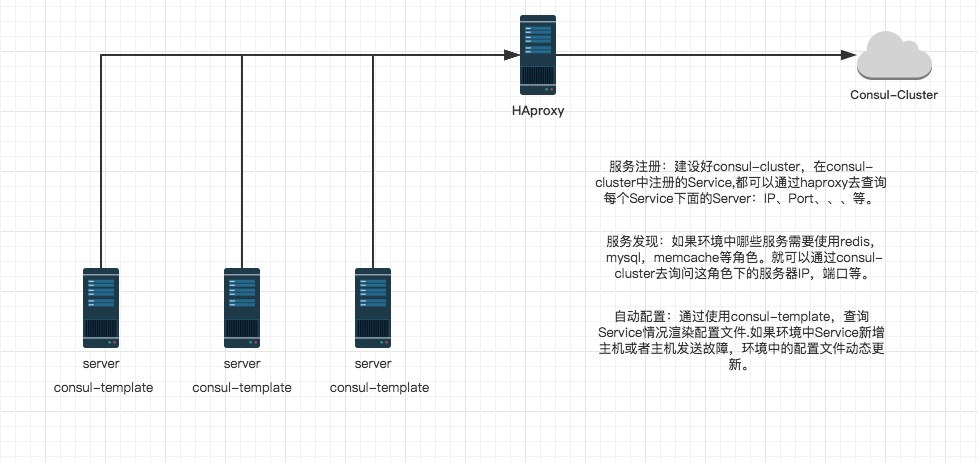
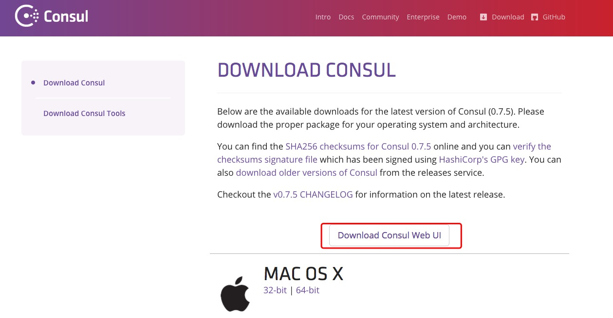
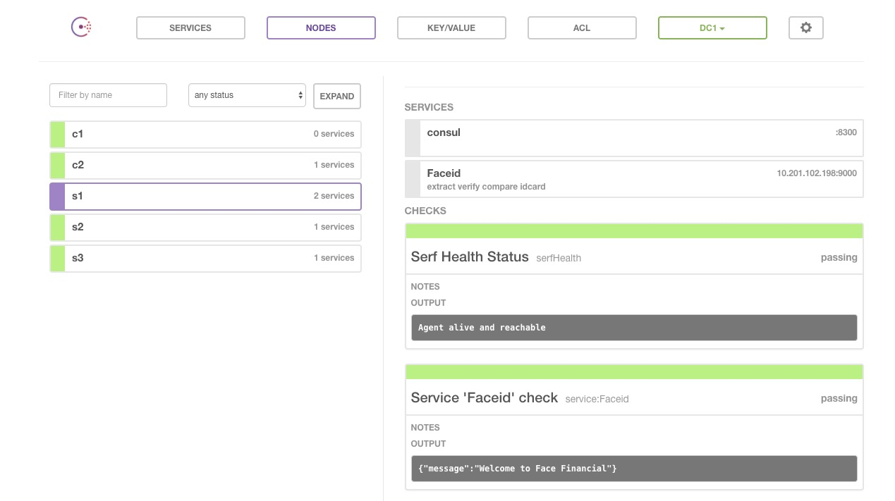

# Consul 使用手册（感觉比较全了）

https://blog.csdn.net/liuzhuchen/article/details/81913562

http://www.liangxiansen.cn/2017/04/06/consul/  【原文有目录】


# 使用consul

## 介绍

Consul包含多个组件,但是作为一个整体,为你的基础设施提供服务发现和服务配置的工具.他提供以下关键特性:

**服务发现**

 Consul的客户端可用提供一个服务,比如 api 或者mysql ,另外一些客户端可用使用Consul去发现一个指定服务的提供者.通过DNS或者HTTP应用程序可用很容易的找到他所依赖的服务. 
 **健康检查** 

Consul客户端可用提供任意数量的健康检查,指定一个服务(比如:webserver是否返回了200  OK 状态码)或者使用本地节点(比如:内存使用是否大于90%).  这个信息可由operator用来监视集群的健康.被服务发现组件用来避免将流量发送到不健康的主机. 
 **Key/Value存储**

 应用程序可用根据自己的需要使用Consul的层级的Key/Value存储.比如动态配置,功能标记,协调,领袖选举等等,简单的HTTP API让他更易于使用. 
 **多数据中心** 

Consul支持开箱即用的多数据中心.这意味着用户不需要担心需要建立额外的抽象层让业务扩展到多个区域. 
 Consul面向DevOps和应用开发者友好.是他适合现代的弹性的基础设施. 
 

## 基础架构

Consul是一个分布式高可用的系统. 这节将包含一些基础,我们忽略掉一些细节这样你可以快速了解Consul是如何工作的.如果要了解更多细节,请参考深入的架构描述.

每个提供服务给Consul的阶段都运行了一个Consul agent . 发现服务或者设置和获取 key/value存储的数据不是必须运行agent.这个agent是负责对节点自身和节点上的服务进行健康检查的.

Agent与一个和多个Consul Server 进行交互.Consul Server  用于存放和复制数据.server自行选举一个领袖.虽然Consul可以运行在一台server ,  但是建议使用3到5台来避免失败情况下数据的丢失.每个数据中心建议配置一个server集群.

你基础设施中需要发现其他服务的组件可以查询任何一个Consul 的server或者 agent.Agent会自动转发请求到server .

每个数据中运行了一个Consul server集群.当一个跨数据中心的服务发现和配置请求创建时.本地Consul Server转发请求到远程的数据中心并返回结果.

更多介绍查看官网[点击前往](https://www.consul.io/)

## 安装Consul

安装Consul,找到适合你系统的包下载他.Consul打包为一个’Zip’文件.[前往下载](https://www.consul.io/downloads.html)

下载后解开压缩包.拷贝Consul到你的PATH路径中,在Unix系统中`~/bin`和`/usr/local/bin`是通常的安装目录.根据你是想为单个用户安装还是给整个系统安装来选择.在Windows系统中有可以安装到`%PATH%`的路径中.

## 验证安装

完成安装后,通过打开一个新终端窗口检查`consul`安装是否成功.通过执行 `consul`你应该看到类似下面的输出

```
[root@dhcp-10-201-102-248 ~]# consul
usage: consul [--version] [--help] <command> [<args>]
Available commands are:
    agent          Runs a Consul agent
    configtest     Validate config file
    event          Fire a new event
    exec           Executes a command on Consul nodes
    force-leave    Forces a member of the cluster to enter the "left" state
    info           Provides debugging information for operators
    join           Tell Consul agent to join cluster
    keygen         Generates a new encryption key
    keyring        Manages gossip layer encryption keys
    kv             Interact with the key-value store
    leave          Gracefully leaves the Consul cluster and shuts down
    lock           Execute a command holding a lock
    maint          Controls node or service maintenance mode
    members        Lists the members of a Consul cluster
    monitor        Stream logs from a Consul agent
    operator       Provides cluster-level tools for Consul operators
    reload         Triggers the agent to reload configuration files
    rtt            Estimates network round trip time between nodes
    snapshot       Saves, restores and inspects snapshots of Consul server state
    version        Prints the Consul version
    watch          Watch for changes in Consul123456789101112131415161718192021222324
```

如果你得到一个`consul not be found`的错误,你的`PATH`可能没有正确设置.请返回检查你的consul的安装路径是否包含在`PATH`中.

## 运行Agent

完成Consul的安装后,必须运行agent. agent可以运行为`server`或`client`模式.每个数据中心至少必须拥有一台server . 建议在一个集群中有3或者5个server.部署单一的server,在出现失败时会不可避免的造成数据丢失.

其他的agent运行为client模式.一个client是一个非常轻量级的进程.用于注册服务,运行健康检查和转发对server的查询.agent必须在集群中的每个主机上运行.

查看启动数据中心的细节请查看[这里](https://www.consul.io/docs/guides/bootstrapping.html).

## 启动 Consul Server

```
consul agent -server -bootstrap-expect 3 -data-dir /tmp/consul -node=s1 -bind=10.201.102.198 -ui-dir ./consul_ui/ -rejoin -config-dir=/etc/consul.d/ -client 0.0.0.01
```

运行cosnul agent以`server`模式，

- `-server` ： 定义agent运行在server模式
- `-bootstrap-expect` ：在一个datacenter中期望提供的server节点数目，当该值提供的时候，consul一直等到达到指定sever数目的时候才会引导整个集群，该标记不能和bootstrap共用
- `-bind`：该地址用来在集群内部的通讯，集群内的所有节点到地址都必须是可达的，默认是0.0.0.0
- `-node`：节点在集群中的名称，在一个集群中必须是唯一的，默认是该节点的主机名
- `-ui-dir`： 提供存放web ui资源的路径，该目录必须是可读的
- `-rejoin`：使consul忽略先前的离开，在再次启动后仍旧尝试加入集群中。
- `-config-dir`：配置文件目录，里面所有以.json结尾的文件都会被加载
- `-client`：consul服务侦听地址，这个地址提供HTTP、DNS、RPC等服务，默认是127.0.0.1所以不对外提供服务，如果你要对外提供服务改成0.0.0.0

```
[root@dhcp-10-201-102-198 consul]# consul agent -server -bootstrap-expect 1 -data-dir /tmp/consul -node=s1 -bind=10.201.102.198 -ui-dir ./consul_ui/ -rejoin -config-dir=/etc/consul.d/ -client 0.0.0.0
==> WARNING: Expect Mode enabled, expecting 3 servers
==> Starting Consul agent...
==> Starting Consul agent RPC...
==> Consul agent running!
           Version: 'v0.7.4'
           Node ID: '422ec677-74ef-8f29-2f22-01effeed6334'
         Node name: 's1'
        Datacenter: 'dc1'
            Server: true (bootstrap: false)
       Client Addr: 0.0.0.0 (HTTP: 8500, HTTPS: -1, DNS: 8600, RPC: 8400)
      Cluster Addr: 10.201.102.198 (LAN: 8301, WAN: 8302)
    Gossip encrypt: false, RPC-TLS: false, TLS-Incoming: false
             Atlas: <disabled>
==> Log data will now stream in as it occurs:
    2017/03/17 18:03:08 [INFO] raft: Restored from snapshot 139-352267-1489707086023
    2017/03/17 18:03:08 [INFO] raft: Initial configuration (index=6982): [{Suffrage:Voter ID:10.201.102.199:8300 Address:10.201.102.199:8300} {Suffrage:Voter ID:10.201.102.200:8300 Address:10.201.102.200:8300} {Suffrage:Voter ID:10.201.102.198:8300 Address:10.201.102.198:8300}]
    2017/03/17 18:03:08 [INFO] raft: Node at 10.201.102.198:8300 [Follower] entering Follower state (Leader: "")
    2017/03/17 18:03:08 [INFO] serf: EventMemberJoin: s1 10.201.102.198
    2017/03/17 18:03:08 [INFO] serf: Attempting re-join to previously known node: s2: 10.201.102.199:8301
    2017/03/17 18:03:08 [INFO] consul: Adding LAN server s1 (Addr: tcp/10.201.102.198:8300) (DC: dc1)
    2017/03/17 18:03:08 [INFO] consul: Raft data found, disabling bootstrap mode
    2017/03/17 18:03:08 [INFO] serf: EventMemberJoin: s2 10.201.102.199
    2017/03/17 18:03:08 [INFO] serf: EventMemberJoin: s3 10.201.102.200
    2017/03/17 18:03:08 [INFO] serf: Re-joined to previously known node: s2: 10.201.102.199:8301
    2017/03/17 18:03:08 [INFO] consul: Adding LAN server s2 (Addr: tcp/10.201.102.199:8300) (DC: dc1)
    2017/03/17 18:03:08 [INFO] consul: Adding LAN server s3 (Addr: tcp/10.201.102.200:8300) (DC: dc1)
    2017/03/17 18:03:08 [INFO] serf: EventMemberJoin: s1.dc1 10.201.102.198
    2017/03/17 18:03:08 [INFO] consul: Adding WAN server s1.dc1 (Addr: tcp/10.201.102.198:8300) (DC: dc1)
    2017/03/17 18:03:08 [WARN] serf: Failed to re-join any previously known node
    2017/03/17 18:03:14 [INFO] agent: Synced service 'consul'
    2017/03/17 18:03:14 [INFO] agent: Deregistered service 'consul01'
    2017/03/17 18:03:14 [INFO] agent: Deregistered service 'consul02'
    2017/03/17 18:03:14 [INFO] agent: Deregistered service 'consul03'12345678910111213141516171819202122232425262728293031323334
```

**查看集群成员** 
 新开一个终端窗口运行`consul members`, 你可以看到Consul集群的成员.

```
[root@dhcp-10-201-102-198 ~]# consul members
Node  Address              Status  Type    Build  Protocol  DC
s1    10.201.102.198:8301  alive   server  0.7.4  2         dc1
s2    10.201.102.199:8301  alive   server  0.7.4  2         dc1
s3    10.201.102.200:8301  alive   server  0.7.4  2         dc112345
```

## 启动 Consul Client

```
consul agent -data-dir /tmp/consul -node=c1 -bind=10.201.102.248 -config-dir=/etc/consul.d/ -join 10.201.102.1981
```

运行cosnul agent以client模式，`-join` 加入到已有的集群中去。

```
[root@dhcp-10-201-102-248 ~]# consul agent -data-dir /tmp/consul -node=c1 -bind=10.201.102.248 -config-dir=/etc/consul.d/ -join 10.201.102.198
==> Starting Consul agent...
==> Starting Consul agent RPC...
==> Joining cluster...
    Join completed. Synced with 1 initial agents
==> Consul agent running!
           Version: 'v0.7.4'
           Node ID: '564dc0c7-7f4f-7402-a301-cebe7f024294'
         Node name: 'c1'
        Datacenter: 'dc1'
            Server: false (bootstrap: false)
       Client Addr: 127.0.0.1 (HTTP: 8500, HTTPS: -1, DNS: 8600, RPC: 8400)
      Cluster Addr: 10.201.102.248 (LAN: 8301, WAN: 8302)
    Gossip encrypt: false, RPC-TLS: false, TLS-Incoming: false
             Atlas: <disabled>
==> Log data will now stream in as it occurs:
    2017/03/17 15:35:16 [INFO] serf: EventMemberJoin: c1 10.201.102.248
    2017/03/17 15:35:16 [INFO] agent: (LAN) joining: [10.201.102.198]
    2017/03/17 15:35:16 [INFO] serf: EventMemberJoin: s2 10.201.102.199
    2017/03/17 15:35:16 [INFO] serf: EventMemberJoin: s3 10.201.102.200
    2017/03/17 15:35:16 [INFO] serf: EventMemberJoin: s1 10.201.102.198
    2017/03/17 15:35:16 [INFO] agent: (LAN) joined: 1 Err: <nil>
    2017/03/17 15:35:16 [INFO] consul: adding server s2 (Addr: tcp/10.201.102.199:8300) (DC: dc1)
    2017/03/17 15:35:16 [INFO] consul: adding server s3 (Addr: tcp/10.201.102.200:8300) (DC: dc1)
    2017/03/17 15:35:16 [INFO] consul: adding server s1 (Addr: tcp/10.201.102.198:8300) (DC: dc1)
    2017/03/17 15:35:16 [INFO] agent: Synced node info1234567891011121314151617181920212223242526
```

**查看集群成员** 
 新开一个终端窗口运行`consul members`, 你可以看到Consul集群的成员.

```
[root@dhcp-10-201-102-248 ~]# consul members
Node  Address              Status  Type    Build  Protocol  DC
c1    10.201.102.248:8301  alive   client  0.7.4  2         dc1
s1    10.201.102.198:8301  alive   server  0.7.4  2         dc1
s2    10.201.102.199:8301  alive   server  0.7.4  2         dc1
s3    10.201.102.200:8301  alive   server  0.7.4  2         dc1123456
```

**加入集群**

```
[root@dhcp-10-201-102-248 ~]# consul join 10.201.102.198
Node  Address              Status  Type    Build  Protocol  DC
c1    10.201.102.248:8301  alive   client  0.7.4  2         dc1
s1    10.201.102.198:8301  alive   server  0.7.4  2         dc1
s2    10.201.102.199:8301  alive   server  0.7.4  2         dc1
s3    10.201.102.200:8301  alive   server  0.7.4  2         dc1123456
```

## 停止Agent

你可以使用`Ctrl-C` 优雅的关闭Agent. 中断Agent之后你可以看到他离开了集群并关闭.

在退出中,Consul提醒其他集群成员,这个节点离开了.如果你强行杀掉进程.集群的其他成员应该能检测到这个节点失效了.当一个成员离开,他的服务和检测也会从目录中移除.当一个成员失效了,他的健康状况被简单的标记为危险,但是不会从目录中移除.Consul会自动尝试对失效的节点进行重连.允许他从某些网络条件下恢复过来.离开的节点则不会再继续联系.

此外,如果一个agent作为一个服务器,一个优雅的离开是很重要的,可以避免引起潜在的可用性故障影响达成[一致性协议](https://www.consul.io/docs/internals/consensus.html).

查看[这里](https://www.consul.io/docs/internals/consensus.html)了解添加和移除server.

## 更新服务

服务定义可以通过配置文件并发送`SIGHUP`给agent来进行更新.这样你可以让你在不关闭服务或者保持服务请求可用的情况下进行更新.

```
consul reload1
```

另外 HTTP API可以用来动态的添加,移除和修改服务.

注册服务 
 搭建好conusl集群后，用户或者程序就能到consul中去查询或者注册服务。可以通过提供服务定义文件或者调用HTTP API来注册一个服务.

首先,为Consul配置创建一个目录.Consul会载入配置文件夹里的所有配置文件.在Unix系统中通常类似 `/etc/consul.d` (.d 后缀意思是这个路径包含了一组配置文件).

```
mkdir /etc/consul.d1
```

然后,我们将编写服务定义配置文件.假设我们有一个名叫web的服务运行在 80端口.另外,我们将给他设置一个标签.这样我们可以使用他作为额外的查询方式:

```
echo '{"service": {"name": "web", "tags": ["rails"], "port": 80}}' >/etc/consul.d/web.json1
```

现在重启agent , 设置配置目录:

```
$ consul agent -server -bootstrap-expect 1 -data-dir /tmp/consul -node=s1 -bind=10.201.102.198 -rejoin -config-dir=/etc/consul.d/ -client 0.0.0.0
...
    [INFO] agent: Synced service 'web'
...1234
```

- `-data-dir`：提供一个目录用来存放agent的状态，所有的agent允许都需要该目录，该目录必须是稳定的，系统重启后都继续存在 
   你可能注意到了输出了 “synced” 了 web这个服务.意思是这个agent从配置文件中载入了服务定义,并且成功注册到服务目录.

如果你想注册多个服务,你应该在Consul配置目录创建多个服务定义文件.

HTTP API注册服务,curl命令或者postman 以`PUT`方式请求consul HTTP API更多细节[点击查看](https://www.consul.io/docs/agent/http/catalog.html#catalog_register)

```
curl -X PUT -d '{"Datacenter": "dc1", "Node": "c2", "Address": "10.155.0.106", "Service": {"Service": "MAC", "tags": ["lianglian", "Mac"], "Port": 22}}' http://127.0.0.1:8500/v1/catalog/register1
```

## 查询服务

一旦agent启动并且服务同步了.我们可以通过DNS或者HTTP的API来查询服务.

**DNS API** 
 让我们首先使用DNS API来查询.在DNS API中,服务的DNS名字是 `NAME.service.consul`. 虽然是可配置的,但默认的所有DNS名字会都在`consul`命名空间下.这个子域告诉Consul,我们在查询服务,`NAME`则是服务的名称.

对于我们上面注册的Web服务.它的域名是 `web.service.consul` :

```
[root@dhcp-10-201-102-198 ~]# dig @127.0.0.1 -p 8600 web.service.consul
; <<>> DiG 9.8.2rc1-RedHat-9.8.2-0.17.rc1.el6 <<>> @127.0.0.1 -p 8600 web.service.consul
; (1 server found)
;; global options: +cmd
;; Got answer:
;; ->>HEADER<<- opcode: QUERY, status: NOERROR, id: 39468
;; flags: qr aa rd; QUERY: 1, ANSWER: 1, AUTHORITY: 0, ADDITIONAL: 0
;; WARNING: recursion requested but not available
;; QUESTION SECTION:
;web.service.consul.            IN      A
;; ANSWER SECTION:
web.service.consul.     0       IN      A       10.201.102.198
;; Query time: 0 msec
;; SERVER: 127.0.0.1#8600(127.0.0.1)
;; WHEN: Tue Mar 28 16:10:24 2017
;; MSG SIZE  rcvd: 52
[root@dhcp-10-201-102-198 ~]#1234567891011121314151617
```

如你所见,一个`A`记录返回了一个可用的服务所在的节点的IP地址.`A`记录只能设置为IP地址. 有也可用使用 DNS API 来接收包含 地址和端口的 SRV记录:

```
[root@dhcp-10-201-102-198 ~]# dig @127.0.0.1 -p 8600 web.service.consul SRV
; <<>> DiG 9.8.2rc1-RedHat-9.8.2-0.17.rc1.el6 <<>> @127.0.0.1 -p 8600 web.service.consul SRV
; (1 server found)
;; global options: +cmd
;; Got answer:
;; ->>HEADER<<- opcode: QUERY, status: NOERROR, id: 13331
;; flags: qr aa rd; QUERY: 1, ANSWER: 1, AUTHORITY: 0, ADDITIONAL: 1
;; WARNING: recursion requested but not available
;; QUESTION SECTION:
;web.service.consul.            IN      SRV
;; ANSWER SECTION:
web.service.consul.     0       IN      SRV     1 1 80 s1.node.dc1.consul.
;; ADDITIONAL SECTION:
s1.node.dc1.consul.     0       IN      A       10.201.102.198
;; Query time: 0 msec
;; SERVER: 127.0.0.1#8600(127.0.0.1)
;; WHEN: Tue Mar 28 16:10:56 2017
;; MSG SIZE  rcvd: 84
[root@dhcp-10-201-102-198 ~]#12345678910111213141516171819
```

`SRV`记录告诉我们 web 这个服务运行于节点`dhcp-10-201-102-198` 的`80`端口. DNS额外返回了节点的A记录.

最后,我们也可以用 DNS API 通过标签来过滤服务.基于标签的服务查询格式为`TAG.NAME.service.consul`. 在下面的例子中,我们请求Consul返回有 `rails`标签的 `web`服务.我们成功获取了我们注册为这个标签的服务:

```
[root@dhcp-10-201-102-198 ~]# dig @127.0.0.1 -p 8600 rails.web.service.consul SRV
; <<>> DiG 9.8.2rc1-RedHat-9.8.2-0.17.rc1.el6 <<>> @127.0.0.1 -p 8600 rails.web.service.consul SRV
; (1 server found)
;; global options: +cmd
;; Got answer:
;; ->>HEADER<<- opcode: QUERY, status: NOERROR, id: 37307
;; flags: qr aa rd; QUERY: 1, ANSWER: 1, AUTHORITY: 0, ADDITIONAL: 1
;; WARNING: recursion requested but not available
;; QUESTION SECTION:
;rails.web.service.consul.      IN      SRV
;; ANSWER SECTION:
rails.web.service.consul. 0     IN      SRV     1 1 80 s1.node.dc1.consul.
;; ADDITIONAL SECTION:
s1.node.dc1.consul.     0       IN      A       10.201.102.198
;; Query time: 0 msec
;; SERVER: 127.0.0.1#8600(127.0.0.1)
;; WHEN: Tue Mar 28 16:11:45 2017
;; MSG SIZE  rcvd: 90
[root@dhcp-10-201-102-198 ~]#12345678910111213141516171819
```

**HTTP API** 
 除了DNS API之外,HTTP API也可以用来进行服务查询:

```
[root@dhcp-10-201-102-198 ~]# curl -s 127.0.0.1:8500/v1/catalog/service/web | python -m json.tool
[
    {
        "Address": "10.201.102.198",
        "CreateIndex": 492843,
        "ID": "422ec677-74ef-8f29-2f22-01effeed6334",
        "ModifyIndex": 492843,
        "Node": "s1",
        "NodeMeta": {},
        "ServiceAddress": "",
        "ServiceEnableTagOverride": false,
        "ServiceID": "web",
        "ServiceName": "web",
        "ServicePort": 80,
        "ServiceTags": [
            "rails"
        ],
        "TaggedAddresses": {
            "lan": "10.201.102.198",
            "wan": "10.201.102.198"
        }
    }
]1234567891011121314151617181920212223
```

目录API给出所有节点提供的服务.稍后我们会像通常的那样带上健康检查进行查询.就像DNS内部处理的那样.这是只查看健康的实例的查询方法:

```
[root@dhcp-10-201-102-198 ~]# curl -s 127.0.0.1:8500/v1/catalog/service/web?passing | python -m json.tool
[
    {
        "Address": "10.201.102.198",
        "CreateIndex": 492843,
        "ID": "422ec677-74ef-8f29-2f22-01effeed6334",
        "ModifyIndex": 492843,
        "Node": "s1",
        "NodeMeta": {},
        "ServiceAddress": "",
        "ServiceEnableTagOverride": false,
        "ServiceID": "web",
        "ServiceName": "web",
        "ServicePort": 80,
        "ServiceTags": [
            "rails"
        ],
        "TaggedAddresses": {
            "lan": "10.201.102.198",
            "wan": "10.201.102.198"
        }
    }
]1234567891011121314151617181920212223
```

## WEB管理界面

Consul同时提供了一个漂亮的功能齐全的WEB界面,开箱即用.界面可以用来查看所有的节点,可以查看健康检查和他们的当前状态.可以读取和设置K/V 存储的数据.UI自动支持多数据中心.[点击前往下载](https://www.consul.io/downloads.html)



下载完后上传至服务器，建议所有server角色都使用WebUI，。

```
consul agent -server -bootstrap-expect 1 -data-dir /tmp/consul -node=s1 -bind=10.201.102.198 -ui-dir ./consul_ui/ -rejoin -config-dir=/etc/consul.d/ -client 0.0.0.01
```

- `-ui-dir`： 提供存放web ui资源的路径，指向该目录必须是可读的
- `-client`：consul服务侦听地址，这个地址提供HTTP、DNS、RPC等服务，默认是127.0.0.1所以不对外提供服务，如果你要对外提供服务改成0.0.0.0 
   可通过<http://10.201.102.198:8500>访问WEB管理界面。



## 健康检查

我们现在看到Consul运行时如此简单.添加节点和服务,查询节点和服务.在这一节.我们将继续添加健康检查到节点和服务.健康检查是服务发现的关键组件.预防使用到不健康的服务.

这一步建立在前一节的Consul集群创建之上.目前你应该有一个包含多个节点的Consul集群.

**自定义检查** 
 和服务注册类似,一个检查可以通过检查定义或HTTP API请求来注册.

我们将使用和检查定义来注册检查.和服务类似,因为这是建立检查最常用的方式.

在第二个节点的配置目录建立定义文件:

```
/etc/consul.d/web.json1
{"service": {
    "name": "Faceid",
    "tags": ["extract", "verify", "compare", "idcard"],
    "address": "10.201.102.198",
    "port": 9000,
    "check": {
        "name": "ping",
        "script": "curl -s localhost:9000",
        "interval": "3s"
        }
    }
}123456789101112
```

or

```
/etc/consul.d/web.json1
{"service": {
    "name": "Faceid",
    "tags": ["extract", "verify", "compare", "idcard"],
    "address": "10.201.102.199",
    "port": 9000,
    "check": {
        "id": "api",
           "name": "HTTP API on port 9000",
        "http": "http://localhost:9000",
        "interval": "10s",
        "timeout": "1s"
        }
   }
}1234567891011121314
```

more

## 检查健康状态

我们能适应HTTP API来检查他们.首先我们检查有哪些失败的检查.使用这个命令(注意:这个命令可以运行在任何节点)

```
[root@dhcp-10-201-102-198 ~]# curl -s http://localhost:8500/v1/health/state/critical | python -m json.tool
[
    {
        "CheckID": "service:Faceid",
        "CreateIndex": 493398,
        "ModifyIndex": 493846,
        "Name": "Service 'Faceid' check",
        "Node": "s1",
        "Notes": "",
        "Output": "",
        "ServiceID": "Faceid",
        "ServiceName": "Faceid",
        "Status": "critical"
    }
]123456789101112131415
```

我们可以看到,只有一个检查我们的`web`服务在`critical`状态

另外,我们可以尝试用DNS查询web服务,Consul将不会返回结果.因为服务不健康.

```
[root@dhcp-10-201-102-198 ~]# dig @127.0.0.1 -p 8600 Faceid.service.consul SRV
; <<>> DiG 9.8.2rc1-RedHat-9.8.2-0.17.rc1.el6 <<>> @127.0.0.1 -p 8600 Faceid.service.consul SRV
; (1 server found)
;; global options: +cmd
;; Got answer:
;; ->>HEADER<<- opcode: QUERY, status: NOERROR, id: 40884
;; flags: qr aa rd; QUERY: 1, ANSWER: 3, AUTHORITY: 0, ADDITIONAL: 3
;; WARNING: recursion requested but not available
;; QUESTION SECTION:
;Faceid.service.consul.         IN      SRV
;; ANSWER SECTION:
Faceid.service.consul.  0       IN      SRV     1 1 9000 s3.node.dc1.consul.
Faceid.service.consul.  0       IN      SRV     1 1 9000 s1.node.dc1.consul.
Faceid.service.consul.  0       IN      SRV     1 1 9000 s2.node.dc1.consul.
;; ADDITIONAL SECTION:
s3.node.dc1.consul.     0       IN      A       10.201.102.200
s1.node.dc1.consul.     0       IN      A       10.201.102.198
s2.node.dc1.consul.     0       IN      A       10.201.102.199
;; Query time: 0 msec
;; SERVER: 127.0.0.1#8600(127.0.0.1)
;; WHEN: Tue Mar 28 18:20:15 2017
;; MSG SIZE  rcvd: 16512345678910111213141516171819202122
```

## K ／V

除了提供服务发现和健康检查的集成.Consul提供了一个易用的键/值存储.这可以用来保持动态配置,协助服务协调,领袖选举,做开发者可以想到的任何事情.

```
[root@dhcp-10-201-102-198 ~]# curl -v http://localhost:8500/v1/kv/?recurse
* About to connect() to localhost port 8500 (#0)
*   Trying ::1... 拒绝连接
*   Trying 127.0.0.1... connected
* Connected to localhost (127.0.0.1) port 8500 (#0)
> GET /v1/kv/?recurse HTTP/1.1
> User-Agent: curl/7.19.7 (x86_64-redhat-linux-gnu) libcurl/7.19.7 NSS/3.21 Basic ECC zlib/1.2.3 libidn/1.18 libssh2/1.4.2
> Host: localhost:8500
> Accept: */*
>
< HTTP/1.1 404 Not Found
< X-Consul-Index: 1
< X-Consul-Knownleader: true
< X-Consul-Lastcontact: 0
< Date: Thu, 18 Aug 2016 08:21:39 GMT
< Content-Length: 0
< Content-Type: text/plain; charset=utf-8
<
* Connection #0 to host localhost left intact
* Closing connection #01234567891011121314151617181920
```

因为没有key所以我们得到了一个404响应.现在我们`PUT`一些示例的Key:

```
[root@dhcp-10-201-102-198 ~]# curl -X PUT -d 'test' http://localhost:8500/v1/kv/web/key1
[root@dhcp-10-201-102-198 ~]# curl -X PUT -d 'test' http://localhost:8500/v1/kv/web/key2?flags=42
[root@dhcp-10-201-102-198 ~]# curl -X PUT -d 'test'  http://localhost:8500/v1/kv/web/sub/key3123
```

我们创建了值为”test”的3个Key,注意返回的值是经过了`base64`编码的.用来支持非UTF8编码字符.对Key `web/key2`我们设置了一个标志值为 `42`.所有的key支持设置一个64位的整形数字标志.Consul内部不适用这个值.但是他可以被客户端适用来做一些元数据.

完成设置后,我们发起了一个`GET`请求来接收多个key的值,使用`?recurse`参数.

```
[root@dhcp-10-201-102-198 ~]# curl -s http://localhost:8500/v1/kv/web/?recurse | python -m json.tool
[
    {
        "CreateIndex": 502660,
        "Flags": 0,
        "Key": "web/key1",
        "LockIndex": 0,
        "ModifyIndex": 502660,
        "Value": "dGVzdA=="
    },
    {
        "CreateIndex": 502663,
        "Flags": 42,
        "Key": "web/key2",
        "LockIndex": 0,
        "ModifyIndex": 502663,
        "Value": "dGVzdA=="
    },
    {
        "CreateIndex": 502665,
        "Flags": 0,
        "Key": "web/sub/key3",
        "LockIndex": 0,
        "ModifyIndex": 502665,
        "Value": "dGVzdA=="
    }
]123456789101112131415161718192021222324252627
```

你可以获取**单个**的key

```
[root@dhcp-10-201-102-198 ~]# curl -s http://localhost:8500/v1/kv/web/key1 | python -m json.tool
[
    {
        "CreateIndex": 502660,
        "Flags": 0,
        "Key": "web/key1",
        "LockIndex": 0,
        "ModifyIndex": 502660,
        "Value": "dGVzdA=="
    }
]1234567891011
```

删除key也很简单.通过`DELETE`动作来完成.我们可以通过指定完整路径来删除一个单独的key.或者我们可以使用`?recurse`**递归**的删除主路径下所有key.

```
[root@dhcp-10-201-102-198 ~]# curl -X DELETE http://localhost:8500/v1/kv/web/sub?recurse
true12
```

可以通过发送相同的URL并提供不同的消息体的`PUT`请求去修改一个Key.另外,Consul提供一个检查并设置的操作,实现原子的Key修改.通过`?cas=参数`加上`GET`中最近的`ModifyIndex`来达到. 例如我们想修改 “web/key1”:

```
curl -X PUT -d 'newval' http://localhost:8500/v1/kv/web/key1?cas=502660
true
curl -X PUT -d 'newval' http://localhost:8500/v1/kv/web/key1?cas=502660
false1234
```

在这种情况下,第一次`CAS` 更新成功因为`ModifyIndex`是`502660`.而第二次失败是因为`ModifyIndex`在第一次更新后已经不是`502660`了 .

我们也可以使用`ModifyIndex`来等待key值的改变.例如我们想等待`key2`被修改:

```
[root@dhcp-10-201-102-198 ~]# curl "http://localhost:8500/v1/kv/web/key2"
[{"LockIndex":0,"Key":"web/key2","Flags":42,"Value":"dGVzdA==","CreateIndex":502663,"ModifyIndex":502663}]
[root@dhcp-10-201-102-198 ~]# curl "http://localhost:8500/v1/kv/web/key2?index=502663&wait=5s"
[{"LockIndex":0,"Key":"web/key2","Flags":42,"Value":"dGVzdA==","CreateIndex":502663,"ModifyIndex":502663}]1234
```

通过提供 `?index=`,我们请求等待key值有一个比`502663`更大的`ModifyIndex`.虽然`?wait=5s`参数限制了这个请求最多5秒,否则返回当前的未改变的值. 这样可以有效的等待key的改变.另外,这个功能可以用于等待一组key.直到其中的某个key有修改.

# Conusl 命令行

见识了consul的强大，consul可以通过一个简单的CLI来控制，consul只有一个命令行应用，就是consul命令，consul命令可以包含agent、members等参数进行使用，这一篇来具体看看consul  CLI的具体用法，consul -h即可看到consul cli所支持的参数，而每个参数里面又支持其他参数，下面我们就来具体看看。

```
[root@dhcp-10-201-102-198 ~]# consul
usage: consul [--version] [--help] <command> [<args>]
Available commands are:
    agent          Runs a Consul agent  运行一个consul agent
    configtest     Validate config file
    event          Fire a new event
    exec           Executes a command on Consul nodes  在consul节点上执行一个命令
    force-leave    Forces a member of the cluster to enter the "left" state   强制节点成员在集群中的状态转换到left状态
    info           Provides debugging information for operators  提供操作的debug级别的信息
    join           Tell Consul agent to join cluster   加入consul节点到集群中
    keygen         Generates a new encryption key  生成一个新的加密key
    keyring        Manages gossip layer encryption keys
    kv             Interact with the key-value store
    leave          Gracefully leaves the Consul cluster and shuts down
    lock           Execute a command holding a lock
    maint          Controls node or service maintenance mode
    members        Lists the members of a Consul cluster    列出集群中成员
    monitor        Stream logs from a Consul agent  打印consul节点的日志信息
    operator       Provides cluster-level tools for Consul operators
    reload         Triggers the agent to reload configuration files   触发节点重新加载配置文件
    rtt            Estimates network round trip time between nodes
    snapshot       Saves, restores and inspects snapshots of Consul server state
    version        Prints the Consul version    打印consul的版本信息
    watch          Watch for changes in Consul   监控consul的改变123456789101112131415161718192021222324
```

更详细见[官网](https://www.consul.io/docs/commands/index.html)

## Agent

`agent`指令是consul的核心，它运行agent来维护成员的重要信息、运行检查、服务宣布、查询处理等等。

```
==> Usage: consul agent [options]
  Starts the Consul agent and runs until an interrupt is received. The
  agent represents a single node in a cluster.
Options:
  -advertise=addr                  Sets the advertise address to use
  -advertise-wan=addr              Sets address to advertise on wan instead of
                                   advertise addr
  -bootstrap                       Sets server to bootstrap mode
  -bind=0.0.0.0                    Sets the bind address for cluster
                                   communication
  -http-port=8500                  Sets the HTTP API port to listen on
  -bootstrap-expect=0              Sets server to expect bootstrap mode.
  -client=127.0.0.1                Sets the address to bind for client access.
                                   This includes RPC, DNS, HTTP and HTTPS (if
                                   configured)
  -config-file=foo                 Path to a JSON file to read configuration
                                   from. This can be specified multiple times.
  -config-dir=foo                  Path to a directory to read configuration
                                   files from. This will read every file ending
                                   in ".json" as configuration in this
                                   directory in alphabetical order. This can be
                                   specified multiple times.
  -data-dir=path                   Path to a data directory to store agent
                                   state
  -dev                             Starts the agent in development mode.
  -recursor=1.2.3.4                Address of an upstream DNS server.
                                   Can be specified multiple times.
  -dc=east-aws                     Datacenter of the agent (deprecated: use
                                   'datacenter' instead).
  -datacenter=east-aws             Datacenter of the agent.
  -encrypt=key                     Provides the gossip encryption key
  -join=1.2.3.4                    Address of an agent to join at start time.
                                   Can be specified multiple times.
  -join-wan=1.2.3.4                Address of an agent to join -wan at start
                                   time. Can be specified multiple times.
  -retry-join=1.2.3.4              Address of an agent to join at start time
                                   with retries enabled. Can be specified
                                   multiple times.
  -retry-interval=30s              Time to wait between join attempts.
  -retry-max=0                     Maximum number of join attempts. Defaults to
                                   0, which will retry indefinitely.
  -retry-join-ec2-region           EC2 Region to use for discovering servers to
                                   join.
  -retry-join-ec2-tag-key          EC2 tag key to filter on for server
                                   discovery
  -retry-join-ec2-tag-value        EC2 tag value to filter on for server
                                   discovery
  -retry-join-gce-project-name     Google Compute Engine project to discover
                                   servers in
  -retry-join-gce-zone-pattern     Google Compute Engine region or zone to
                                   discover servers in (regex pattern)
  -retry-join-gce-tag-value        Google Compute Engine tag value to filter
                                   for server discovery
  -retry-join-gce-credentials-file Path to credentials JSON file to use with
                                   Google Compute Engine
  -retry-join-wan=1.2.3.4          Address of an agent to join -wan at start
                                   time with retries enabled. Can be specified
                                   multiple times.
  -retry-interval-wan=30s          Time to wait between join -wan attempts.
  -retry-max-wan=0                 Maximum number of join -wan attempts.
                                   Defaults to 0, which will retry
                                   indefinitely.
  -log-level=info                  Log level of the agent.
  -node=hostname                   Name of this node. Must be unique in the
                                   cluster
  -node-meta=key:value             An arbitrary metadata key/value pair for
                                   this node.
                                   This can be specified multiple times.
  -protocol=N                      Sets the protocol version. Defaults to
                                   latest.
  -rejoin                          Ignores a previous leave and attempts to
                                   rejoin the cluster.
  -server                          Switches agent to server mode.
  -syslog                          Enables logging to syslog
  -ui                              Enables the built-in static web UI server
  -ui-dir=path                     Path to directory containing the Web UI
                                   resources
  -pid-file=path                   Path to file to store agent PID123456789101112131415161718192021222324252627282930313233343536373839404142434445464748495051525354555657585960616263646566676869707172737475767778
```

## event

`event`命令提供了一种机制，用来fire自定义的用户事件，这些事件对consul来说是不透明的，但它们可以用来构建自动部署、重启服务或者其他行动的脚本。

```
-http-addr：http服务的地址，agent可以链接上来发送命令，如果没有设置，则默认是127.0.0.1:8500。
-datacenter：数据中心。
-name：事件的名称
-node：一个正则表达式，用来过滤节点
-service：一个正则表达式，用来过滤节点上匹配的服务
-tag：一个正则表达式，用来过滤节点上符合tag的服务，必须和-service一起使用。123456
```

## exec

`exec`指令提供了一种远程执行机制，比如你要在所有的机器上执行uptime命令，远程执行的工作通过job来指定，存储在KV中，agent使用event系统可以快速的知道有新的job产生，消息是通过gossip协议来传递的，因此消息传递是最佳的，但是并不保证命令的执行。事件通过gossip来驱动，远程执行依赖KV存储系统(就像消息代理一样)。

```
-http-addr：http服务的地址，agent可以链接上来发送命令，如果没有设置，则默认是127.0.0.1:8500。
-datacenter：数据中心。
-prefix：key在KV系统中的前缀，用来存储请求数据，默认是_rexec
-node：一个正则表达式，用来过滤节点，评估事件
-service：一个正则表达式，用来过滤节点上匹配的服务
-tag：一个正则表达式，用来过滤节点上符合tag的服务，必须和-service一起使用。
-wait：在节点多长时间没有响应后，认为job已经完成。
-wait-repl：
-verbose：输出更多信息123456789
```

## force-leave

`force-leave`治疗可以强制consul集群中的成员进入left状态(空闲状态)，记住，即使一个成员处于活跃状态，它仍旧可以再次加入集群中，这个方法的真实目的是强制移除failed的节点。如果failed的节点还是网络的一部分，则consul会周期性的重新链接failed的节点，如果经过一段时间后(默认是72小时)，consul则会宣布停止尝试链接failed的节点。force-leave指令可以快速的把failed节点转换到left状态。

```
-rpc-addr:一个rpc地址，agent可以链接上来发送命令，如果没有指定，默认是127.0.0.1:8400。1
```

## info

`info`指令提供了各种操作时可以用到的debug信息，对于client和server，info有返回不同的子系统信息，目前有以下几个KV信息：agent(提供agent信息)，consul(提供consul库的信息)，raft(提供raft库的信息)，serf_lan(提供LAN  gossip pool),serf_wan(提供WAN gossip pool)

```
-rpc-addr：一个rpc地址，agent可以链接上来发送命令，如果没有指定，默认是127.0.0.1:84001
```

## join

`join`指令告诉consul agent加入一个已经存在的集群中，一个新的consul  agent必须加入一个已经有至少一个成员的集群中，这样它才能加入已经存在的集群中，如果你不加入一个已经存在的集群，则agent是它自身集群的一部分，其他agent则可以加入进来。agents可以加入其他agent多次。consul  join [options] address。如果你想加入多个集群，则可以写多个地址，consul会加入所有的地址。

```
-wan：agent运行在server模式，xxxxxxx
-rpc-addr：一个rpc地址，agent可以链接上来发送命令，如果没有指定，默认是127.0.0.1:8400。12
```

## keygen

`keygen`指令生成加密的密钥，可以用在consul agent通讯加密

生成一个key

## leave

`leave`指令触发一个优雅的离开动作并关闭agent，节点离开后不会尝试重新加入集群中。运行在server状态的节点，节点会被优雅的删除，这是很严重的，在某些情况下一个不优雅的离开会影响到集群的可用性。

```
-rpc-addr:一个rpc地址，agent可以链接上来发送命令，如果没有指定，默认是127.0.0.1:8400。1
```

## members

`members`指令输出consul agent目前所知道的所有的成员以及它们的状态，节点的状态只有alive、left、failed三种状态。

```
-detailed：输出每个节点更详细的信息。
-rpc-addr：一个rpc地址，agent可以链接上来发送命令，如果没有指定，默认是127.0.0.1:8400。
-status：过滤出符合正则规则的节点
-wan：xxxxxx1234
```

## monitor

`monitor`指令用来链接运行的agent，并显示日志。monitor会显示最近的日志，并持续的显示日志流，不会自动退出，除非你手动或者远程agent自己退出。

```
-log-level：显示哪个级别的日志，默认是info
-rpc-addr：一个rpc地址，agent可以链接上来发送命令，如果没有指定，默认是127.0.0.1:840012
```

## reload

`reload`指令可以重新加载agent的配置文件。SIGHUP指令在重新加载配置文件时使用，任何重新加载的错误都会写在agent的log文件中，并不会打印到屏幕。

```
-rpc-addr：一个rpc地址，agent可以链接上来发送命令，如果没有指定，默认是127.0.0.1:84001
```

## version

打印consul的版本

## watch

`watch`指令提供了一个机制，用来监视实际数据视图的改变(节点列表、成员服务、KV)，如果没有指定进程，当前值会被dump出来

```
-http-addr：http服务的地址，agent可以链接上来发送命令，如果没有设置，则默认是127.0.0.1:8500。
-datacenter：数据中心查询。
-token：ACL token
-key：监视key，只针对key类型
-name：监视event，只针对event类型
-prefix：监视key prefix，只针对keyprefix类型
-service：监控service，只针对service类型
-state：过略check state
-tag：过滤service tag
-type：监控类型，一般有key、keyprefix、service、nodes、checks、event12345678910
```

# Consul 配置

agent有各种各样的配置项可以在命令行或者配置文件进行定义，所有的配置项都是可选择的，当加载配置文件的时候，consul从配置文件或者配置目录加载配置。后面定义的配置会合并前面定义的配置，但是大多数情况下，合并的意思是后面定义的配置会覆盖前面定义的配置，但是有些情况，例如event句柄，合并仅仅是添加到前面定义的句柄后面。consul重新加载配置文件也支持以信号的方式接收update信号。

下面看看命令行参数：

```
-advertise：通知展现地址用来改变我们给集群中的其他节点展现的地址，一般情况下-bind地址就是展现地址
-bootstrap：用来控制一个server是否在bootstrap模式，在一个datacenter中只能有一个server处于bootstrap模式，当一个server处于bootstrap模式时，可以自己选举为raft leader。
-bootstrap-expect：在一个datacenter中期望提供的server节点数目，当该值提供的时候，consul一直等到达到指定sever数目的时候才会引导整个集群，该标记不能和bootstrap公用
-bind：该地址用来在集群内部的通讯，集群内的所有节点到地址都必须是可达的，默认是0.0.0.0
-client：consul绑定在哪个client地址上，这个地址提供HTTP、DNS、RPC等服务，默认是127.0.0.1
-config-file：明确的指定要加载哪个配置文件
-config-dir：配置文件目录，里面所有以.json结尾的文件都会被加载
-data-dir：提供一个目录用来存放agent的状态，所有的agent允许都需要该目录，该目录必须是稳定的，系统重启后都继续存在
-dc：该标记控制agent允许的datacenter的名称，默认是dc1
-encrypt：指定secret key，使consul在通讯时进行加密，key可以通过consul keygen生成，同一个集群中的节点必须使用相同的key
-join：加入一个已经启动的agent的ip地址，可以多次指定多个agent的地址。如果consul不能加入任何指定的地址中，则agent会启动失败，默认agent启动时不会加入任何节点。
-retry-join：和join类似，但是允许你在第一次失败后进行尝试。
-retry-interval：两次join之间的时间间隔，默认是30s
-retry-max：尝试重复join的次数，默认是0，也就是无限次尝试
-log-level：consul agent启动后显示的日志信息级别。默认是info，可选：trace、debug、info、warn、err。
-node：节点在集群中的名称，在一个集群中必须是唯一的，默认是该节点的主机名
-protocol：consul使用的协议版本
-rejoin：使consul忽略先前的离开，在再次启动后仍旧尝试加入集群中。
-server：定义agent运行在server模式，每个集群至少有一个server，建议每个集群的server不要超过5个
-syslog：开启系统日志功能，只在linux/osx上生效
-ui-dir:提供存放web ui资源的路径，该目录必须是可读的
-pid-file:提供一个路径来存放pid文件，可以使用该文件进行SIGINT/SIGHUP(关闭/更新)agent12345678910111213141516171819202122
```

除了命令行参数外，配置也可以写入文件中，在某些情况下配置文件会更简单一些，例如：利用consul被用来管理系统。配置文件是json格式的，很容易编写。配置文件不仅被用来设置agent的启动，也可以用来提供健康检测和服务发现的定义。配置文件的一般样例如下：

```
{
  "datacenter": "dc1",
  "data_dir": "/opt/consul",
  "log_level": "INFO",
  "node_name": "s1",
  "server": true,
  "bootstrap_expect": 3,
  "bind_addr": "10.201.102.198",
  "client_addr": "0.0.0.0",
  "ui_dir": "/root/consul_ui",
  "retry_join": ["10.201.102.198","10.201.102.199","10.201.102.200","10.201.102.248"],
  "retry_interval": "30s",
  "enable_debug": false,
  "rejoin_after_leave": true,
  "start_join": ["10.201.102.198","10.201.102.199","10.201.102.200","10.201.102.248"],
  "enable_syslog": true,
  "syslog_facility": "local5"
}123456789101112131415161718
```

下面看看详细的配置文件参数：

```
acl_datacenter：只用于server，指定的datacenter的权威ACL信息，所有的servers和datacenter必须同意ACL datacenter
acl_default_policy：默认是allow
acl_down_policy：
acl_master_token：
acl_token：agent会使用这个token和consul server进行请求
acl_ttl：控制TTL的cache，默认是30s
addresses：一个嵌套对象，可以设置以下key：dns、http、rpc
advertise_addr：等同于-advertise
bootstrap：等同于-bootstrap
bootstrap_expect：等同于-bootstrap-expect
bind_addr：等同于-bind
ca_file：提供CA文件路径，用来检查客户端或者服务端的链接
cert_file：必须和key_file一起
check_update_interval：
client_addr：等同于-client
datacenter：等同于-dc
data_dir：等同于-data-dir
disable_anonymous_signature：在进行更新检查时禁止匿名签名
disable_remote_exec：禁止支持远程执行，设置为true，agent会忽视所有进入的远程执行请求
disable_update_check：禁止自动检查安全公告和新版本信息
dns_config：是一个嵌套对象，可以设置以下参数：allow_stale、max_stale、node_ttl 、service_ttl、enable_truncate
domain：默认情况下consul在进行DNS查询时，查询的是consul域，可以通过该参数进行修改
enable_debug：开启debug模式
enable_syslog：等同于-syslog
encrypt：等同于-encrypt
key_file：提供私钥的路径
leave_on_terminate：默认是false，如果为true，当agent收到一个TERM信号的时候，它会发送leave信息到集群中的其他节点上。
log_level：等同于-log-level
node_name:等同于-node
ports：这是一个嵌套对象，可以设置以下key：dns(dns地址：8600)、http(http api地址：8500)、rpc(rpc:8400)、serf_lan(lan port:8301)、serf_wan(wan port:8302)、server(server rpc:8300)
protocol：等同于-protocol
recursor：
rejoin_after_leave：等同于-rejoin
retry_join：等同于-retry-join
retry_interval：等同于-retry-interval
server：等同于-server
server_name：会覆盖TLS CA的node_name，可以用来确认CA name和hostname相匹配
skip_leave_on_interrupt：和leave_on_terminate比较类似，不过只影响当前句柄
start_join：一个字符数组提供的节点地址会在启动时被加入
statsd_addr：
statsite_addr：
syslog_facility：当enable_syslog被提供后，该参数控制哪个级别的信息被发送，默认Local0
ui_dir：等同于-ui-dir
verify_incoming：默认false，如果为true，则所有进入链接都需要使用TLS，需要客户端使用ca_file提供ca文件，只用于consul server端，因为client从来没有进入的链接
verify_outgoing：默认false，如果为true，则所有出去链接都需要使用TLS，需要服务端使用ca_file提供ca文件，consul server和client都需要使用，因为两者都有出去的链接
watches：watch一个详细名单12345678910111213141516171819202122232425262728293031323334353637383940414243444546
```

# HTTP API

consul的主要接口是RESTful HTTP API，该API可以用来增删查改nodes、services、checks、configguration。所有的endpoints主要分为以下类别：

```
kv - Key/Value存储
agent - Agent控制
catalog - 管理nodes和services
health - 管理健康监测
session - Session操作
acl - ACL创建和管理
event - 用户Events
status - Consul系统状态12345678
```

下面我们就单独看看每个模块的具体内容。

## agent

agent endpoints用来和本地agent进行交互，一般用来服务注册和检查注册，支持以下接口

```
/v1/agent/checks : 返回本地agent注册的所有检查(包括配置文件和HTTP接口)
/v1/agent/services : 返回本地agent注册的所有 服务
/v1/agent/members : 返回agent在集群的gossip pool中看到的成员
/v1/agent/self : 返回本地agent的配置和成员信息
/v1/agent/join/<address> : 触发本地agent加入node
/v1/agent/force-leave/<node>>: 强制删除node
/v1/agent/check/register : 在本地agent增加一个检查项，使用PUT方法传输一个json格式的数据
/v1/agent/check/deregister/<checkID> : 注销一个本地agent的检查项
/v1/agent/check/pass/<checkID> : 设置一个本地检查项的状态为passing
/v1/agent/check/warn/<checkID> : 设置一个本地检查项的状态为warning
/v1/agent/check/fail/<checkID> : 设置一个本地检查项的状态为critical
/v1/agent/service/register : 在本地agent增加一个新的服务项，使用PUT方法传输一个json格式的数据
/v1/agent/service/deregister/<serviceID> : 注销一个本地agent的服务项12345678910111213
```

## catalog

catalog endpoints用来注册/注销nodes、services、checks

```
/v1/catalog/register : Registers a new node, service, or check
/v1/catalog/deregister : Deregisters a node, service, or check
/v1/catalog/datacenters : Lists known datacenters
/v1/catalog/nodes : Lists nodes in a given DC
/v1/catalog/services : Lists services in a given DC
/v1/catalog/service/<service> : Lists the nodes in a given service
/v1/catalog/node/<node> : Lists the services provided by a node1234567
```

## health

health endpoints用来查询健康状况相关信息，该功能从catalog中单独分离出来

```
/v1/healt/node/<node>: 返回node所定义的检查，可用参数?dc=
/v1/health/checks/<service>: 返回和服务相关联的检查，可用参数?dc=
/v1/health/service/<service>: 返回给定datacenter中给定node中service
/v1/health/state/<state>: 返回给定datacenter中指定状态的服务，state可以是"any", "unknown", "passing", "warning", or "critical"，可用参数?dc=1234
```

## session

session endpoints用来create、update、destory、query sessions

```
/v1/session/create: Creates a new session
/v1/session/destroy/<session>: Destroys a given session
/v1/session/info/<session>: Queries a given session
/v1/session/node/<node>: Lists sessions belonging to a node
/v1/session/list: Lists all the active sessions12345
```

## acl

acl endpoints用来create、update、destory、query acl

```
/v1/acl/create: Creates a new token with policy
/v1/acl/update: Update the policy of a token
/v1/acl/destroy/<id>: Destroys a given token
/v1/acl/info/<id>: Queries the policy of a given token
/v1/acl/clone/<id>: Creates a new token by cloning an existing token
/v1/acl/list: Lists all the active tokens123456
```

## event

event endpoints用来fire新的events、查询已有的events

```
/v1/event/fire/<name>: 触发一个新的event，用户event需要name和其他可选的参数，使用PUT方法
/v1/event/list: 返回agent知道的events12
```

## status

status endpoints用来或者consul 集群的信息

```
/v1/status/leader : 返回当前集群的Raft leader
/v1/status/peers : 返回当前集群中同事12
```

# Consul-Template

在consul-template没出现之前，大家构建服务发现系统，大多采用的是zookeeper、etcd+confd这样类似的系统，之前写过一篇consul+confd的文，讲的是如何动态生成配置文件的，如今consul官方推出了自己的模板系统，就是consul-template，这样的话动态的配置系统可以分化为etcd+confd和consul+consul-template两大阵营。consul是一个和etcd类似但又强于etcd的系统，关于etcd和consul可以翻阅以前的文章，consul-template的定位就和confd差不多一样了，confd的后端可以是etcd或者consul，相信consul搭配consul-template能发挥更大的效果。consul-template提供了一个便捷的方式从consul中获取存储的值，consul-template守护进程会查询consul实例，来更新系统上指定的任何模板，当更新完成后，模板可以选择运行一些任意的命令。

```
    consul template的使用场景：consul template可以查询consul中的服务目录、key、key-values等。这种强大的抽象功能和查询语言模板可以使consul template特别适合动态的创建配置文件。例如：创建apache/nginx proxy balancers、haproxy backends、varnish servers、application configurations。1
```

consul template的特性：

```
    quiescence：consul template内制静止平衡功能，可以智能的发现consul实例中的更改信息。这个功能可以防止频繁的更新模板而引起系统的波动。
    dry mode：不确定当前架构的状态？担心模板的变化会破坏子系统？无须担心，因为consul template还有-dry模式。在dry模式，consul template会将结果呈现在STDOUT，所以操作员可以检查输出是否正常，以决定更换模板是否安全
    CLI and Config：如果你喜欢在命令行上指定一切，consul template都可以hold住。随着内置HCL的支持，consul template接收一个配置文件，命令行参数，或者两者的混合。通过这种方式你可以继续使用你现在已有的配置管理工具和consul template来配合。
    verbose debugging：即使每件事你都做的近乎完美，但是有时候还是会有失败发生。consul template可以提供更详细的debug日志信息。1234
```

## 安装

你可以在[发布页](https://releases.hashicorp.com/consul-template/)下载发布包.如果你希望自己编译请查看[说明文档](https://github.com/hashicorp/consul-template#contributing).

## 使用

```
-auth=<user[:pass]>      设置基本的认证用户名和密码
  -consul-addr=<address>   设置Consul实例的地址
  -max-stale=<duration>    查询过期的最大频率，默认是1s
  -dedup                   启用重复数据删除，当许多consul template实例渲染一个模板的时候可以降低consul的负载
  -ssl                     使用https连接Consul使用SSL
  -ssl-verify              通过SSL连接的时候检查证书
  -ssl-cert                SSL客户端证书发送给服务器
  -ssl-key                 客户端认证时使用的SSL/TLS私钥
  -ssl-ca-cert             验证服务器的CA证书列表
  -token=<token>           设置Consul API的token
  -syslog                  把标准输出和标准错误重定向到syslog，syslog的默认级别是local0。
  -syslog-facility=<f>     设置syslog级别，默认是local0，必须和-syslog配合使用
  -template=<template>     增加一个需要监控的模板，格式是：'templatePath:outputPath(:command)'，多个模板则可以设置多次
  -wait=<duration>         当呈现一个新的模板到系统和触发一个命令的时候，等待的最大最小时间。如果最大值被忽略，默认是最小值的4倍。
  -retry=<duration>        当在和consul api交互的返回值是error的时候，等待的时间，默认是5s。
  -config=<path>           配置文件或者配置目录的路径
  -pid-file=<path>         PID文件的路径
  -log-level=<level>       设置日志级别，可以是"debug","info", "warn" (default), and "err"
  -dry                     Dump生成的模板到标准输出，不会生成到磁盘
  -once                    运行consul-template一次后退出，不以守护进程运行
  -reap                    子进程自动收割123456789101112131415161718192021
```

查看全部选项,使用以下命令

```
consul-template -h1
```

## 命令行

1、查询本地consl实例，生成模板后重启nginx，如果consul不可用，如果api故障则每30s尝试检测一次值，consul-template运行一次后退出

```
consul-template -retry 30s -once -consul-addr=10.201.102.198:8500 -template "test.ctmpl:test.out"1
```

test.ctmpl

```
{{range service "Faceid"}}
{{.ID}} {{.Address}}:{{.Port}} check inter 5000 fall 1 rise 2 weight 2{{end}}12
```

test.out

```
Faceid 10.201.102.198:9000 check inter 5000 fall 1 rise 2 weight 2
Faceid 10.201.102.199:9000 check inter 5000 fall 1 rise 2 weight 2
Faceid 10.201.102.200:9000 check inter 5000 fall 1 rise 2 weight 2123
```

2、运行consul-temple作为一个服务

```
consul-template -consul-addr=10.201.102.198:8500 -template "test.ctmpl:test.out"1
```

3、查询一个实例，渲染多个模板，然后重启相关服务

```
consul-template -retry 30s -once -consul-addr=10.201.102.198:8500 -template "test.ctmpl:test.out"\
 -template "/tmp/redis.ctmpl:/var/redis/redis.conf:service redis restart" \
 -template "/tmp/haproxy.ctmpl:/var/haproxy/haproxy.conf"123
```

4、查询一个实例，dump模板到标准输出，参数中的-template则会被忽略

```
consul-template -dry -consul-addr=10.201.102.198:8500 -template "test.ctmpl:test.out"1
```

以上参数除了在命令行使用，也可以直接配置在文件中，下面看看Consul-Template的配置文件，简称HCL(HashiCorp Configuration Language)，它是和JSON兼容的，下面看个例子：

```
#### 配置文件
​```Consul-Template```配置文件是使用[HashiCorp Configuration Language (HCL)](https://github.com/hashicorp/hcl)编写的.这意味着```Consul Template```是和JSON兼容的,查看更多信息请查看 [HCL 规范](https://github.com/hashicorp/hcl)
配置文件语法支持上面的所有的选项,除非在表格中进行标明.
​```json
// 这是要连接的Consul Agent的地址.默认为127.0.0.1:8500.这是Consul的默认绑定地址和端口.
// 不建议你直接与 Consul的 Server直接进行交互,请与本地的Consul Agent进行交互.这样做是有一些原因
// 最重要的是本地agent可以复用与server的连接.减少HTTP的连接数.另外这个地址更好记.
consul = "127.0.0.1:8500"
// 这是用于连接Consul的ACL token. 如果你的集群未启用就不需要设置.
//
// 这个选项也可以通过环境变量 CONSUL_TOKEN 来进行设置
token = "abcd1234"
// 这是监听出发reload事件的信号,默认值如下所示.将这个值设置为空将引起 CT ,从而不监听reload事件
reload_signal = "SIGHUP"
// 这是监听出发core dump事件的信号,默认值如下所示.将这个值设置为空将引起 CT ,从而不监听core dump信号
dump_signal = "SIGQUIT"
// 这是监听出发graceful stop事件的信号,默认值如下所示.将这个值设置为空将引起 CT ,从而不监听graceful stop信号
kill_signal = "SIGINT"
// 这是连接Consul的重试时间.Consul Template是高容错的设计.这意味着,出现失败他不会退出.而按照
// 分布式系统的惯例进行指数补偿和重试来等待集群恢复.
retry = "10s"
// This is the maximum interval to allow "stale" data. By default, only the
// Consul leader will respond to queries; any requests to a follower will
// forward to the leader. In large clusters with many requests, this is not as
// scalable, so this option allows any follower to respond to a query, so long
// as the last-replicated data is within these bounds. Higher values result in
// less cluster load, but are more likely to have outdated data.
// 这是允许陈旧数据的最大时间.Consul默认只有领袖对请求进行相应.所有对追随者的请求将被转发给领袖.
// 在有大量请求的大型集群中,这显得不够有扩展性.所以这个选项允许任何追随者响应查询,只要最后复制的数据
// 在这个范围内.数值越高,越减少集群负载,但是更容易接受到过期数据.
max_stale = "10m"
// 这是log的等级,如果你找到了bug,请打开debug 日志,这样我们可以更好的定位问题.这个选项也可用在命令行.
log_level = "warn"
// 这是存放Consul Template 进程的PID文件的路径,如果你计划发送定制的信号到这个进程这会比较有用.
pid_file = "/path/to/pid"
// 这是一个静止定时器,他定义了在模板渲染之前等待集群达到一致状态的最小和最大时间.
// 这对于一些变化较大的系统中比较有用,可以减少模板渲染的次数
wait = "5s:10s"
// 这是 Vault配置的开始
// Vault是HashiCorp的另外一个产品
vault {
  // This is the address of the Vault leader. The protocol (http(s)) portion
  // of the address is required.
  address = "https://vault.service.consul:8200"
  // This is the token to use when communicating with the Vault server.
  // Like other tools that integrate with Vault, Consul Template makes the
  // assumption that you provide it with a Vault token; it does not have the
  // incorporated logic to generate tokens via Vault's auth methods.
  //
  // This value can also be specified via the environment variable VAULT_TOKEN.
  token = "abcd1234"
  // This option tells Consul Template to automatically renew the Vault token
  // given. If you are unfamiliar with Vault's architecture, Vault requires
  // tokens be renewed at some regular interval or they will be revoked. Consul
  // Template will automatically renew the token at half the lease duration of
  // the token. The default value is true, but this option can be disabled if
  // you want to renew the Vault token using an out-of-band process.
  //
  // Note that secrets specified in a template (using {{secret}} for example)
  // are always renewed, even if this option is set to false. This option only
  // applies to the top-level Vault token itself.
  renew = true
  // This section details the SSL options for connecting to the Vault server.
  // Please see the SSL options below for more information (they are the same).
  ssl {
    // ...
  }
}
// 这部分配置请求的基本的权限验证信息
auth {
  enabled  = true
  username = "test"
  password = "test"
}
// 这部分配置连接到Consul服务器的SSL信息.
ssl {
  // 使用SSL需要先打开这个开关
  enabled = true
  // This enables SSL peer verification. The default value is "true", which
  // will check the global CA chain to make sure the given certificates are
  // valid. If you are using a self-signed certificate that you have not added
  // to the CA chain, you may want to disable SSL verification. However, please
  // understand this is a potential security vulnerability.
  verify = false
  // This is the path to the certificate to use to authenticate. If just a
  // certificate is provided, it is assumed to contain both the certificate and
  // the key to convert to an X509 certificate. If both the certificate and
  // key are specified, Consul Template will automatically combine them into an
  // X509 certificate for you.
  cert = "/path/to/client/cert"
  key = "/path/to/client/key"
  // This is the path to the certificate authority to use as a CA. This is
  // useful for self-signed certificates or for organizations using their own
  // internal certificate authority.
  ca_cert = "/path/to/ca"
}
// 设置连接到syslog服务器的配置
// 用于进行日志记录syslog {
  // 打开开关
  enabled = true
  // 设备名称
  facility = "LOCAL5"
}
// This block defines the configuration for de-duplication mode. Please see the
// de-duplication mode documentation later in the README for more information
// on how de-duplication mode operates.
deduplicate {
  // This enables de-duplication mode. Specifying any other options also enables
  // de-duplication mode.
  enabled = true
  // This is the prefix to the path in Consul's KV store where de-duplication
  // templates will be pre-rendered and stored.
  prefix = "consul-template/dedup/"
}
// This block defines the configuration for exec mode. Please see the exec mode
// documentation at the bottom of this README for more information on how exec
// mode operates and the caveats of this mode.
exec {
  // This is the command to exec as a child process. There can be only one
  // command per Consul Template process.
  command = "/usr/bin/app"
  // This is a random splay to wait before killing the command. The default
  // value is 0 (no wait), but large clusters should consider setting a splay
  // value to prevent all child processes from reloading at the same time when
  // data changes occur. When this value is set to non-zero, Consul Template
  // will wait a random period of time up to the splay value before reloading
  // or killing the child process. This can be used to prevent the thundering
  // herd problem on applications that do not gracefully reload.
  splay = "5s"
  // This defines the signal that will be sent to the child process when a
  // change occurs in a watched template. The signal will only be sent after
  // the process is started, and the process will only be started after all
  // dependent templates have been rendered at least once. The default value
  // is "" (empty or nil), which tells Consul Template to restart the child
  // process instead of sending it a signal. This is useful for legacy
  // applications or applications that cannot properly reload their
  // configuration without a full reload.
  reload_signal = "SIGUSR1"
  // This defines the signal sent to the child process when Consul Template is
  // gracefully shutting down. The application should begin a graceful cleanup.
  // If the application does not terminate before the `kill_timeout`, it will
  // be terminated (effectively "kill -9"). The default value is "SIGTERM".
  kill_signal = "SIGINT"
  // This defines the amount of time to wait for the child process to gracefully
  // terminate when Consul Template exits. After this specified time, the child
  // process will be force-killed (effectively "kill -9"). The default value is
  // "30s".
  kill_timeout = "2s"
}
// 这部分定义了对模板的配置,和其他配置块不同.这部分可以针对不同模板配置多次.也可以在CLI命令
// 直接进行配置
template {
  // 这是输入模板的配置文件路径,必选项
  source = "/path/on/disk/to/template.ctmpl"
  // 这是源模板渲染之后存放的路径,如果父目录不存在Consul Template会尝试进行创建
  destination = "/path/on/disk/where/template/will/render.txt"
  // This is the optional command to run when the template is rendered. The
  // command will only run if the resulting template changes. The command must
  // return within 30s (configurable), and it must have a successful exit code.
  // Consul Template is not a replacement for a process monitor or init system.
  // 这是当模板渲染完成后可选的要执行的命令.这个命令只会在模板发生改变后才会运行.这个命令必须要在30秒
  // 内进行返回(可配置),必须返回一个成功的退出码.Consul Template不能替代进程监视或者init 系统
  // 的功能
  command = "restart service foo"
  // 这是最大的等待命令返回的时间,默认是30秒
  command_timeout = "60s"
  // 这是渲染后的文件的权限,如果不设置,Consul Template将去匹配之前已经存在的文件的权限.
  // 如果文件不存在,权限会被设置为 0644
  perms = 0600
  // 这个选项对渲染之前的文件进行备份.他保持一个备份.
  // 这个选项在发生意外更高时,有一个回滚策略.
  backup = true
  // 模板的分隔符,默认是 "{{"和"}}".但是对于一些模板用其他的分隔符可能更好
  // 可以避免与本身的冲突
  left_delimiter  = "{{"
  right_delimiter = "}}"
  // 这是最小和最大等待渲染一个新模板和执行命令的时间.使用 分号 个号.如果忽略最大值,最大
  // 值会被设置为最小值的4倍.这个选项没有默认值.这个值相对全局所以的等待时间有最高优先级
  wait = "2s:6s"
}123456789101112131415161718192021222324252627282930313233343536373839404142434445464748495051525354555657585960616263646566676869707172737475767778798081828384858687888990919293949596979899100101102103104105106107108109110111112113114115116117118119120121122123124125126127128129130131132133134135136137138139140141142143144145146147148149150151152153154155156157158159160161162163164165166167168169170171172173174175176177178179180
```

**注意**: 不是所有的选项都是必选的.例如: 如果你没有使用Vault你不用设置这一块. 类似的你没有使用syslog系统你也不需要指定syslog配置.

为了更加安全,`token`也可以从环境变量里读取,使用 `CONSUL_TOKEN` 和 `VAULT_TOKEN`.强烈建议你不要把token放到未加密的文本配置文件中.

## 模版语法

Consul Template 使用了Go的模板语法.如果你对他的语法不熟悉建议你读下文档.他的语法看起来与 Mustache, Handlebars, 或者 Liquid 类似.

在Go 提供的模板函数之外,Consul Template暴露了以下的函数:

## API 函数

**datacenters** 
 查询目录中的所有数据中心.使用以下语法:

```
{{datacenters}}1
```

**file** 
 读取并输出磁盘上的本地文件,如果无法读取产生一个错误.使用如下语法

```
{{file "/path/to/local/file"}}1
```

这个例子将输出 `/path/to/local/file` 文件内容到模板. 注意:这不会在嵌套模板中被处理

**key** 
 查询Consul指定key的值,如果key的值不能转换为字符串,将产生错误.使用如下语法:

```
{{key "service/redis/maxconns@east-aws"}}1
```

上面的例子查询了在`east-aws`数据中心的 `service/redis/maxconns`的值.如果忽略数据中心参数,将会查询本地数据中心的值:

```
{{key "service/redis/maxconns"}}1
```

Consul键值结构的美妙在于,这完全取决于你!

**key_or_default** 
 查询Consul中指定的key的值,如果key不存在,则返回默认值.使用方式如下

```
{{key_or_default "service/redis/maxconns@east-aws" "5"}}1
```

注意Consul Template使用了多个阶段的运算.在第一阶段的运算如果Consul没有返回值,则会一直使用默认值.后续模板解析中如果值存在了则会读取真实的值.这很重要,运维Consul Templae不会因为`key_or_default`没找到key而阻塞模板的的渲染.即使key存在如果Consul没有按时返回这个数据,也会使用默认值来进行替代.

**ls** 
 查看Consul的所有以指定前缀开头的key-value对.如果有值无法转换成字符串则会产生一个错误:

```
{{range ls "service/redis@east-aws"}}
{{.Key}} {{.Value}}{{end}}12
```

如果Consul实例在`east-aws`数据中心存在这个结构`service/redis`,渲染后的模板应该类似这样:

```
minconns 2
maxconns 1212
```

如果你忽略数据中心属性,则会返回本地数据中心的查询结果.

**node** 
 查询目录中的一个节点信息

```
{{node "node1"}}1
```

如果未指定任何参数,则当前agent所在节点将会被返回:

```
{{node}}1
```

你可以指定一个可选的参数来指定数据中心:

```
{{node "node1" "@east-aws"}}1
```

如果指定的节点没有找到则会返回`nil`.如果节点存在就会列出节点的信息和节点提供的服务.

```
{{with node}}{{.Node.Node}} ({{.Node.Address}}){{range .Services}}
  {{.Service}} {{.Port}} ({{.Tags | join ","}}){{end}}
{{end}}123
```

**nodes** 
 查询目录中的全部节点,使用如下语法

```
{{nodes}}1
```

这个例子会查询Consul的默认数据中心.你可以使用可选参数指定一个可选参数来指定数据中心:

```
{{nodes "@east-aws"}}1
```

这个例子会查询east-aws数据中心的所有几点.

**secret** 
 查询`Vault`中指定路径的密匙.如果指定的路径不存在或者`Vault`的`Token`没有足够权限去读取指定的路径,将会产生一个错误.如果路径存在但是key不存在则返回“.

```
{{with secret "secret/passwords"}}{{.Data.password}}{{end}}1
```

可以使用如下字段:

```
LeaseID - the unique lease identifier
LeaseDuration - the number of seconds the lease is valid
Renewable - if the secret is renewable
Data - the raw data - this is a map[string]interface{}, so it can be queried using Go's templating "dot notation"
If the map key has dots "." in it, you need to access the value using the index function:
{{index .Data "my.key.with.dots"}}
If additional arguments are passed to the function, then the operation is assumed to be a write operation instead of a read operation. The write operation must return data in order to be valid. This is especially useful for the PKI secret backend, for example.
{{ with secret "pki/issue/my-domain-dot-com" "common_name=foo.example.com" }}
{{ .Data.certificate }}
{{ end }}
The parameters must be key=value pairs, and each pair must be its own argument to the function:
{{ secret "path/" "a=b" "c=d" "e=f" }}
Please always consider the security implications of having the contents of a secret in plain-text on disk. If an attacker is able to get access to the file, they will have access to plain-text secrets.12345678910111213
```

Please note that Vault does not support blocking queries. As a  result, Consul Template will not immediately reload in the event a  secret is changed as it does with Consul’s key-value store. Consul  Template will fetch a new secret at half the lease duration of the  original secret. For example, most items in Vault’s generic secret  backend have a default 30 day lease. This means Consul Template will  renew the secret every 15 days. As such, it is recommended that a  smaller lease duration be used when generating the initial secret to  force Consul Template to renew more often.

**secrets** 
 Query Vault to list the secrets at the given path. Please note this  requires Vault 0.5+ and the endpoint you want to list secrets must  support listing. Not all endpoints support listing. The result is the  list of secret names as strings.

```
{{range secrets "secret/"}}{{.}}{{end}}1
```

The trailing slash is optional in the template, but the generated  secret dependency will always have a trailing slash in log output.

To iterate and list over every secret in the generic secret backend  in Vault, for example, you would need to do something like this:

```
{{range secrets "secret/"}}
{{with secret (printf "secret/%s" .)}}
{{range $k, $v := .Data}}
{{$k}}: {{$v}}
{{end}}
{{end}}
{{end}}1234567
```

You should probably never do this. Please also note that Vault does  not support blocking queries. To understand the implications, please  read the note at the end of the secret function.

**service** 
 查询Consul中匹配表达式的服务.语法如下:

```
{{service "release.web@east-aws"}}1
```

上面的例子查询Consul中,在`east-aws`数据中心存在的健康的 `web`服务.tag和数据中心参数是可选的.从当前数据中心查询所有节点的`web`服务而不管tag,查询语法如下:

```
{{service "web"}}1
```

这个函数返回`[]*HealthService`结构.可按照如下方式应用到模板:

```
{{range service "web@data center"}}
server {{.Name}} {{.Address}}:{{.Port}}{{end}}12
```

产生如下输出:

```
server nyc_web_01 123.456.789.10:8080
server nyc_web_02 456.789.101.213:808012
```

默认值会返回健康的服务,如果你想获取所有服务,可以增加`any`选项,如下:

```
{{service "web" "any"}}1
```

这样就会返回注册过的所有服务,而不论他的状态如何.

如果你想过滤指定的一个或者多个健康状态,你可以通过逗号隔开多个健康状态:

```
{{service "web" "passing, warning"}}1
```

这样将会返回被他们的节点和服务级别的检查定义标记为 “passing” 或者 “warning”的服务. 请注意逗号是 `OR`而不是`AND`的意思.

指定了超过一个状态过滤,并包含`any`将会返回一个错误.因为`any`是比所有状态更高级的过滤.

后面这2种方式有些架构上的不同:

```
{{service "web"}}
{{service "web" "passing"}}12
```

前者会返回Consul认为`healthy`和`passing`的所有服务.后者将返回所有已经在Consul注册的服务.然后会执行一个客户端的过滤.通常如果你想获取健康的服务,你应该不要使用`passing`参数,直接忽略第三个参数即可.然而第三个参数在你想查询 passing或者`warning`的服务会比较有用,如下:

```
{{service "web" "passing, warning"}}1
```

服务的状态也是可见的,如果你想自己做一些额外的过滤,语法如下:

```
{{range service "web" "any"}}
{{if eq .Status "critical"}}
// Critical state!{{end}}
{{if eq .Status "passing"}}
// Ok{{end}}12345
```

执行命令时,在Consul将服务设置为维护模式,只需要在你的命令上包上Consul的 `maint` 调用:

```
#!/bin/sh
set -e
consul maint -enable -service web -reason "Consul Template updated"
service nginx reload
consul maint -disable -service web12345
```

另外如果你没有安装Consul agent,你可以直接调用API请求:

```
#!/bin/sh
set -e
curl -X PUT "http://$CONSUL_HTTP_ADDR/v1/agent/service/maintenance/web?enable=true&reason=Consul+Template+Updated"
service nginx reload
curl -X PUT "http://$CONSUL_HTTP_ADDR/v1/agent/service/maintenance/web?enable=false"12345
```

**services** 
 查询Consul目录中的所有服务,使用如下语法:

```
{{services}}1
```

这个例子将查询Consul的默认数据中心,你可以指定一个可选参数来指定数据中心:

```
{{services "@east-aws"}}1
```

请注意: services函数与service是不同的,service接受更多参数并且查询监控的服务列表.这个查询Consul目录并返回一个服务的tag的Map,如下:

```
{{range services}}
{{.Name}}
{{range .Tags}}
  {{.}}{{end}}
{{end}}12345
```

**tree** 
 查询所有指定前缀的key-value值对,如果其中的值有无法转换为字符串的则引发错误:

```
{{range tree "service/redis@east-aws"}}
{{.Key}} {{.Value}}{{end}}12
```

如果Consul实例在`east-aws`数据中心有一个`service/redis`结构,模板的渲染结果类似下面:

```
minconns 2
maxconns 12
nested/config/value "value"123
```

和`ls`不同,`tree`返回前缀下的所有key.和Unix的tree命令比较像.如果忽略数据中心参数,则会使用本地数据中心

[查看更多](https://book-consul-guide.vnzmi.com/11_consul_template.html)

[项目Github地址](https://book-consul-guide.vnzmi.com/11_consul_template.html)

## Haproxy 实例

根据haproxy服务的配置文件创建一个consul-template模版渲染文件：`haproxy.ctmpl`

```
# Consul Haproxy configured
global
        maxconn         20480
        ulimit-n        65535
        log             127.0.0.1 local5
        uid             200
        gid             200
        chroot          /usr/local/haproxy
        nbproc          1
        daemon
        pidfile         /usr/local/haproxy/logs/haproxy.pid
defaults
        log             global
        mode            http
        option          httplog
        option          dontlognull
        option          forwardfor
        option          abortonclose
        retries         3
        maxconn         3000
        stats           enable
        stats           hide-version
        stats   uri     /admin
        stats   auth    admin:admin
        stats   refresh 10s
        balance         roundrobin
        timeout connect 5000ms
        timeout client 50000ms
        timeout server 50000ms
        timeout check 2000ms
listen web_haproxy
        bind 0.0.0.0:8080
        mode http
        log     127.0.0.1 local5 err
        stats   refresh 5s
        stats   uri /admin
        stats   realm liang lian
        stats   auth admin:admin
        stats   hide-version
        stats   admin if TRUE
frontend consul
        bind    0.0.0.0:8500
        mode    http
        log     global
        default_backend consul-cluster
backend consul-cluster
        mode http
        {{range service "Faceid"}}
        server {{.ID}} {{.Address}}:{{.Port}} check inter 5000 fall 1 rise 2 weight 2{{end}}12345678910111213141516171819202122232425262728293031323334353637383940414243444546474849
```

运行consul-template作为一个服务,通过上面的渲染模版渲染一个haproxy.cfg的配置文件，然后重启haproxy服务

```
consul-template -consul-addr=10.201.102.185:8500 -template "/root/haproxy.ctmpl:/etc/haproxy.cfg:service haproxy restart"1
```

10.201.102.185 看我上篇文章[Haproxy](http://www.liangxiansen.cn/2017/03/06/haproxy/)，这是consul集群的VIP，为了避免单独调某一台服务器服务器出现故障后consul-template无法工作。

渲染后的`haproxy.cfg`

```
# Consul Haproxy configured
global
        maxconn         20480
        ulimit-n        65535
        log             127.0.0.1 local5
        uid             200
        gid             200
        chroot          /usr/local/haproxy
        nbproc          1
        daemon
        pidfile         /usr/local/haproxy/logs/haproxy.pid
defaults
        log             global
        mode            http
        option          httplog
        option          dontlognull
        option          forwardfor
        option          abortonclose
        retries         3
        maxconn         3000
        stats           enable
        stats           hide-version
        stats   uri     /admin
        stats   auth    admin:admin
        stats   refresh 10s
        balance         roundrobin
        timeout connect 5000ms
        timeout client 50000ms
        timeout server 50000ms
        timeout check 2000ms
listen web_haproxy
        bind 0.0.0.0:8080
        mode http
        log     127.0.0.1 local5 err
        stats   refresh 5s
        stats   uri /admin
        stats   realm liang lian
        stats   auth admin:admin
        stats   hide-version
        stats   admin if TRUE
frontend consul
        bind    0.0.0.0:8500
        mode    http
        log     global
        default_backend consul-cluster
backend consul-cluster
        mode http
        server Faceid 10.201.102.198:9000 check inter 5000 fall 1 rise 2 weight 2
        server Faceid 10.201.102.199:9000 check inter 5000 fall 1 rise 2 weight 2
        server Faceid 10.201.102.200:9000 check inter 5000 fall 1 rise 2 weight 21234567891011121314151617181920212223242526272829303132333435363738394041424344454647484950
```

整个就是搭建consul集群，平台中的服务会注册到consul集群中，haproxy避免consul-template调consul时出现单点故障consul-template无法工作做的高可用，Consul-template就是能在整个平台的各个系统和应用中使用，查询consul集群来获取平台上各个应用的存活状态和IP。

整套下来实现了两个重点：

实现了中心服务注册查询 
 平台中其他节点的查询服务和配置文件自动更新

# 参考资料

<https://my.oschina.net/guol/blog/675281> 
 <https://www.consul.io/docs/guides/index.html> 
 <https://www.gitbook.com/book/vincentmi/consul-guide/details>

<https://my.oschina.net/abcfy2/blog/675665>

# 下载

[点击下载PDF文件](http://www.liangxiansen.cn/files/consul.pdf)

本文标题:Consul 使用手册 
 文章作者:梁先森 
 发布时间:2017-04-06, 19:25:40 
 最后更新:2017-08-02, 14:15:20

原始链接:<http://www.liangxiansen.cn/2017/04/06/consul/>  
 许可协议: “署名-非商用-相同方式共享 4.0” 转载请保留原文链接及作者。