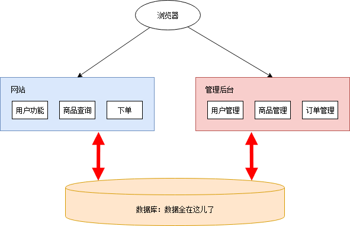
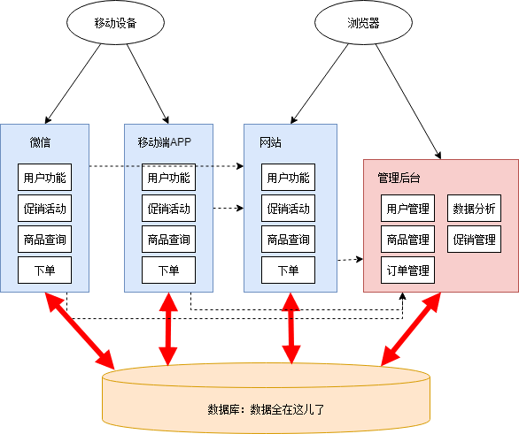
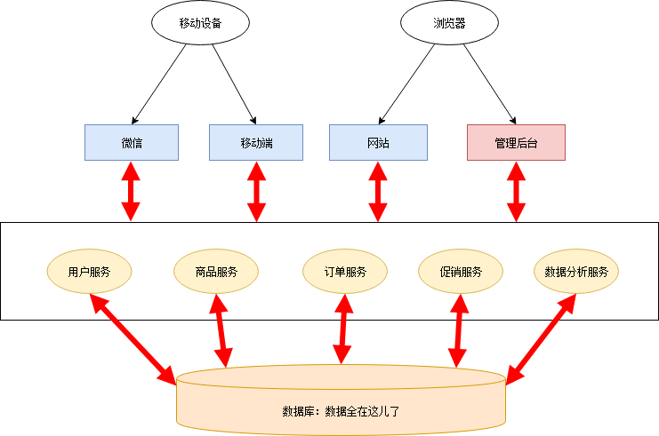

​         [微服务, 架构, 服务治理, 链路跟踪, 服务发现, 流量控制, Service Mesh](https://www.cnblogs.com/Leo_wl/p/11736579.html)          

> **阅读目录**
>
> - [一、熔断](https://www.cnblogs.com/Leo_wl/p/11736579.html#_label0)
> - [二、服务降级](https://www.cnblogs.com/Leo_wl/p/11736579.html#_label1)
> - [三、限流](https://www.cnblogs.com/Leo_wl/p/11736579.html#_label2)

**阅读目录**

- [微服务架构](https://www.cnblogs.com/Leo_wl/p/11736579.html#_label0)

[微服务](https://www.cnblogs.com/skabyy/tag/微服务/), [架构](https://www.cnblogs.com/skabyy/tag/架构/), [服务治理](https://www.cnblogs.com/skabyy/tag/服务治理/), [链路跟踪](https://www.cnblogs.com/skabyy/tag/链路跟踪/), [服务发现](https://www.cnblogs.com/skabyy/tag/服务发现/), [流量控制](https://www.cnblogs.com/skabyy/tag/流量控制/), [Service Mesh](https://www.cnblogs.com/skabyy/tag/Service Mesh/)

[回到目录](https://www.cnblogs.com/Leo_wl/p/11736579.html#_labelTop)

# [微服务架构](https://www.cnblogs.com/skabyy/p/11396571.html)

 

本文将介绍微服务架构和相关的组件，介绍他们是什么以及为什么要使用微服务架构和这些组件。本文侧重于简明地表达微服务架构的全局图景，因此不会涉及具体如何使用组件等细节。

> 为了防止不提供原网址的转载，特在这里加上原文链接：
> https://www.cnblogs.com/skabyy/p/11396571.html

要理解微服务，首先要先理解不是微服务的那些。通常跟微服务相对的是单体应用，即将所有功能都打包成在一个独立单元的应用程序。从单体应用到微服务并不是一蹴而就的，这是一个逐渐演变的过程。本文将以一个网上超市应用为例来说明这一过程。

## 最初的需求

几年前，小明和小皮一起创业做网上超市。小明负责程序开发，小皮负责其他事宜。当时互联网还不发达，网上超市还是蓝海。只要功能实现了就能随便赚钱。所以他们的需求很简单，只需要一个网站挂在公网，用户能够在这个网站上浏览商品、购买商品；另外还需一个管理后台，可以管理商品、用户、以及订单数据。

我们整理一下功能清单：

- 网站
  - 用户注册、登录功能
  - 商品展示
  - 下单
- 管理后台
  - 用户管理
  - 商品管理
  - 订单管理

由于需求简单，小明左手右手一个慢动作，网站就做好了。管理后台出于安全考虑，不和网站做在一起，小明右手左手慢动作重播，管理网站也做好了。总体架构图如下：

小明挥一挥手，找了家云服务部署上去，网站就上线了。上线后好评如潮，深受各类肥宅喜爱。小明小皮美滋滋地开始躺着收钱。

## 随着业务发展……

好景不长，没过几天，各类网上超市紧跟着拔地而起，对小明小皮造成了强烈的冲击。

在竞争的压力下，小明小皮决定开展一些营销手段：

- 开展促销活动。比如元旦全场打折，春节买二送一，情人节狗粮优惠券等等。
- 拓展渠道，新增移动端营销。除了网站外，还需要开发移动端APP，微信小程序等。
- 精准营销。利用历史数据对用户进行分析，提供个性化服务。
- ……

这些活动都需要程序开发的支持。小明拉了同学小红加入团队。小红负责数据分析以及移动端相关开发。小明负责促销活动相关功能的开发。

因为开发任务比较紧迫，小明小红没有好好规划整个系统的架构，随便拍了拍脑袋，决定把促销管理和数据分析放在管理后台里，微信和移动端APP另外搭建。通宵了几天后，新功能和新应用基本完工。这时架构图如下：

这一阶段存在很多不合理的地方：

- 网站和移动端应用有很多相同业务逻辑的重复代码。
- 数据有时候通过数据库共享，有时候通过接口调用传输。接口调用关系杂乱。
- 单个应用为了给其他应用提供接口，渐渐地越改越大，包含了很多本来就不属于它的逻辑。应用边界模糊，功能归属混乱。
- 管理后台在一开始的设计中保障级别较低。加入数据分析和促销管理相关功能后出现性能瓶颈，影响了其他应用。
- 数据库表结构被多个应用依赖，无法重构和优化。
- 所有应用都在一个数据库上操作，数据库出现性能瓶颈。特别是数据分析跑起来的时候，数据库性能急剧下降。
- 开发、测试、部署、维护愈发困难。即使只改动一个小功能，也需要整个应用一起发布。有时候发布会不小心带上了一些未经测试的代码，或者修改了一个功能后，另一个意想不到的地方出错了。为了减轻发布可能产生的问题的影响和线上业务停顿的影响，所有应用都要在凌晨三四点执行发布。发布后为了验证应用正常运行，还得盯到第二天白天的用户高峰期……
- 团队出现推诿扯皮现象。关于一些公用的功能应该建设在哪个应用上的问题常常要争论很久，最后要么干脆各做各的，或者随便放个地方但是都不维护。

尽管有着诸多问题，但也不能否认这一阶段的成果：快速地根据业务变化建设了系统。不过**紧迫且繁重的任务容易使人陷入局部、短浅的思维方式，从而做出妥协式的决策**。在这种架构中，每个人都只关注在自己的一亩三分地，缺乏全局的、长远的设计。长此以往，系统建设将会越来越困难，甚至陷入不断推翻、重建的循环。

## 是时候做出改变了

幸好小明和小红是有追求有理想的好青年。意识到问题后，小明和小红从琐碎的业务需求中腾出了一部分精力，开始梳理整体架构，针对问题准备着手改造。

> 要做改造，首先你需要有足够的精力和资源。如果你的需求方（业务人员、项目经理、上司等）很强势地一心追求需求进度，以致于你无法挪出额外的精力和资源的话，那么你可能无法做任何事……

在编程的世界中，最重要的便是**抽象能力**。微服务改造的过程实际上也是个抽象的过程。小明和小红整理了网上超市的业务逻辑，抽象出公用的业务能力，做成几个公共服务：

- 用户服务
- 商品服务
- 促销服务
- 订单服务
- 数据分析服务

各个应用后台只需从这些服务获取所需的数据，从而删去了大量冗余的代码，就剩个轻薄的控制层和前端。这一阶段的架构如下：

这个阶段只是将服务分开了，数据库依然是共用的，所以一些烟囱式系统的缺点仍然存在：

1. 数据库成为性能瓶颈，并且有单点故障的风险。
2. 数据管理趋向混乱。即使一开始有良好的模块化设计，随着时间推移，总会有一个服务直接从数据库取另一个服务的数据的现象。
3. 数据库表结构可能被多个服务依赖，牵一发而动全身，很难调整。

如果一直保持共用数据库的模式，则整个架构会越来越僵化，失去了微服务架构的意义。因此小明和小红一鼓作气，把数据库也拆分了。所有持久化层相互隔离，由各个服务自己负责。另外，为了提高系统的实时性，加入了消息队列机制。架构如下：

完全拆分后各个服务可以采用异构的技术。比如数据分析服务可以使用数据仓库作为持久化层，以便于高效地做一些统计计算；商品服务和促销服务访问频率比较大，因此加入了缓存机制等。

> 还有一种抽象出公共逻辑的方法是把这些公共逻辑做成公共的框架库。这种方法可以减少服务调用的性能损耗。但是这种方法的管理成本非常高昂，很难保证所有应用版本的一致性。

> 数据库拆分也有一些问题和挑战：比如说跨库级联的需求，通过服务查询数据颗粒度的粗细问题等。但是这些问题可以通过合理的设计来解决。总体来说，数据库拆分是一个利大于弊的。

微服务架构还有一个技术外的好处，它使整个系统的分工更加明确，责任更加清晰，每个人专心负责为其他人提供更好的服务。在单体应用的时代，公共的业务功能经常没有明确的归属。最后要么各做各的，每个人都重新实现了一遍；要么是随机一个人（一般是能力比较强或者比较热心的人）做到他负责的应用里面。在后者的情况下，这个人在负责自己应用之外，还要额外负责给别人提供这些公共的功能——而这个功能本来是无人负责的，仅仅因为他能力较强/比较热心，就莫名地背锅（这种情况还被美其名曰能者多劳）。结果最后大家都不愿意提供公共的功能。长此以往，团队里的人渐渐变得各自为政，不再关心全局的架构设计。

从这个角度上看，使用微服务架构同时也需要组织结构做相应的调整。所以说做微服务改造需要管理者的支持。

改造完成后，小明和小红分清楚各自的锅。两人十分满意，一切就像是麦克斯韦方程组一样漂亮完美。

然而……

## 没有银弹

春天来了，万物复苏，又到了一年一度的购物狂欢节。眼看着日订单数量蹭蹭地上涨，小皮小明小红喜笑颜开。可惜好景不长，乐极生悲，突然嘣的一下，系统挂了。

以往单体应用，排查问题通常是看一下日志，研究错误信息和调用堆栈。而**微服务架构整个应用分散成多个服务，定位故障点非常困难**。小明一个台机器一台机器地查看日志，一个服务一个服务地手工调用。经过十几分钟的查找，小明终于定位到故障点：促销服务由于接收的请求量太大而停止响应了。其他服务都直接或间接地会调用促销服务，于是也跟着宕机了。**在微服务架构中，一个服务故障可能会产生雪崩效用，导致整个系统故障**。其实在节前，小明和小红是有做过请求量评估的。按照预计，服务器资源是足以支持节日的请求量的，所以肯定是哪里出了问题。不过形势紧急，随着每一分每一秒流逝的都是白花花的银子，因此小明也没时间排查问题，当机立断在云上新建了几台虚拟机，然后一台一台地部署新的促销服务节点。几分钟的操作后，系统总算是勉强恢复正常了。整个故障时间内估计损失了几十万的销售额，三人的心在滴血……

事后，小明简单写了个日志分析工具（量太大了，文本编辑器几乎打不开，打开了肉眼也看不过来），统计了促销服务的访问日志，发现在故障期间，商品服务由于代码问题，在某些场景下会对促销服务发起大量请求。这个问题并不复杂，小明手指抖一抖，修复了这个价值几十万的Bug。

问题是解决了，但谁也无法保证不会再发生类似的其他问题。微服务架构虽然逻辑设计上看是完美的，但就像积木搭建的华丽宫殿一样，经不起风吹草动。微服务架构虽然解决了旧问题，也引入了新的问题：

- 微服务架构整个应用分散成多个服务，定位故障点非常困难。
- 稳定性下降。服务数量变多导致其中一个服务出现故障的概率增大，并且一个服务故障可能导致整个系统挂掉。事实上，在大访问量的生产场景下，故障总是会出现的。
- 服务数量非常多，部署、管理的工作量很大。
- 开发方面：如何保证各个服务在持续开发的情况下仍然保持协同合作。
- 测试方面：服务拆分后，几乎所有功能都会涉及多个服务。原本单个程序的测试变为服务间调用的测试。测试变得更加复杂。

小明小红痛定思痛，决心好好解决这些问题。对故障的处理一般从两方面入手，一方面尽量减少故障发生的概率，另一方面降低故障造成的影响。

## 监控 - 发现故障的征兆

在高并发分布式的场景下，故障经常是突然间就雪崩式爆发。所以必须建立完善的监控体系，尽可能发现故障的征兆。

微服务架构中组件繁多，各个组件所需要监控的指标不同。比如Redis缓存一般监控占用内存值、网络流量，数据库监控连接数、磁盘空间，业务服务监控并发数、响应延迟、错误率等。因此如果做一个大而全的监控系统来监控各个组件是不大现实的，而且扩展性会很差。一般的做法是让各个组件提供报告自己当前状态的接口（metrics接口），这个接口输出的数据格式应该是一致的。然后部署一个指标采集器组件，定时从这些接口获取并保持组件状态，同时提供查询服务。最后还需要一个UI，从指标采集器查询各项指标，绘制监控界面或者根据阈值发出告警。

大部分组件都不需要自己动手开发，网络上有开源组件。小明下载了RedisExporter和MySQLExporter，这两个组件分别提供了Redis缓存和MySQL数据库的指标接口。微服务则根据各个服务的业务逻辑实现自定义的指标接口。然后小明采用Prometheus作为指标采集器，Grafana配置监控界面和邮件告警。这样一套微服务监控系统就搭建起来了：

## 定位问题 - 链路跟踪

在微服务架构下，一个用户的请求往往涉及多个内部服务调用。为了方便定位问题，需要能够记录每个用户请求时，微服务内部产生了多少服务调用，及其调用关系。这个叫做链路跟踪。

我们用一个Istio文档里的链路跟踪例子来看看效果：

> 图片来自[Istio文档](https://istio.io/zh/docs/tasks/telemetry/distributed-tracing/zipkin/)

从图中可以看到，这是一个用户访问productpage页面的请求。在请求过程中，productpage服务顺序调用了details和reviews服务的接口。而reviews服务在响应过程中又调用了ratings的接口。整个链路跟踪的记录是一棵树：

要实现链路跟踪，每次服务调用会在HTTP的HEADERS中记录至少记录四项数据：

- traceId：traceId标识一个用户请求的调用链路。具有相同traceId的调用属于同一条链路。
- spanId：标识一次服务调用的ID，即链路跟踪的节点ID。
- parentId：父节点的spanId。
- requestTime & responseTime：请求时间和响应时间。

另外，还需要调用日志收集与存储的组件，以及展示链路调用的UI组件。

以上只是一个极简的说明，关于链路跟踪的理论依据可详见Google的[Dapper](http://bigbully.github.io/Dapper-translation/)

了解了理论基础后，小明选用了Dapper的一个开源实现Zipkin。然后手指一抖，写了个HTTP请求的拦截器，在每次HTTP请求时生成这些数据注入到HEADERS，同时异步发送调用日志到Zipkin的日志收集器中。这里额外提一下，HTTP请求的拦截器，可以在微服务的代码中实现，也可以使用一个网络代理组件来实现（不过这样子每个微服务都需要加一层代理）。

链路跟踪只能定位到哪个服务出现问题，不能提供具体的错误信息。查找具体的错误信息的能力则需要由日志分析组件来提供。

## 分析问题 - 日志分析

日志分析组件应该在微服务兴起之前就被广泛使用了。即使单体应用架构，当访问数变大、或服务器规模增多时，日志文件的大小会膨胀到难以用文本编辑器进行访问，更糟的是它们分散在多台服务器上面。排查一个问题，需要登录到各台服务器去获取日志文件，一个一个地查找（而且打开、查找都很慢）想要的日志信息。

因此，在应用规模变大时，我们需要一个日志的“**搜索引擎**”。以便于能准确的找到想要的日志。另外，数据源一侧还需要收集日志的组件和展示结果的UI组件：

小明调查了一下，使用了大名鼎鼎地ELK日志分析组件。ELK是Elasticsearch、Logstash和Kibana三个组件的缩写。

- Elasticsearch：搜索引擎，同时也是日志的存储。
- Logstash：日志采集器，它接收日志输入，对日志进行一些预处理，然后输出到Elasticsearch。
- Kibana：UI组件，通过Elasticsearch的API查找数据并展示给用户。

最后还有一个小问题是如何将日志发送到Logstash。一种方案是在日志输出的时候直接调用Logstash接口将日志发送过去。这样一来又（咦，为啥要用“又”）要修改代码……于是小明选用了另一种方案：日志仍然输出到文件，每个服务里再部署个Agent扫描日志文件然后输出给Logstash。

## 网关 - 权限控制，服务治理

拆分成微服务后，出现大量的服务，大量的接口，使得整个调用关系乱糟糟的。经常在开发过程中，写着写着，忽然想不起某个数据应该调用哪个服务。或者写歪了，调用了不该调用的服务，本来一个只读的功能结果修改了数据……

为了应对这些情况，微服务的调用需要一个把关的东西，也就是网关。在调用者和被调用者中间加一层网关，每次调用时进行权限校验。另外，网关也可以作为一个提供服务接口文档的平台。

使用网关有一个问题就是要决定在多大粒度上使用：最粗粒度的方案是整个微服务一个网关，微服务外部通过网关访问微服务，微服务内部则直接调用；最细粒度则是所有调用，不管是微服务内部调用或者来自外部的调用，都必须通过网关。折中的方案是按照业务领域将微服务分成几个区，区内直接调用，区间通过网关调用。

由于整个网上超市的服务数量还不算特别多，小明采用的最粗粒度的方案：

## 服务注册于发现 - 动态扩容

前面的组件，都是旨在降低故障发生的可能性。然而故障总是会发生的，所以另一个需要研究的是如何降低故障产生的影响。

最粗暴的（也是最常用的）故障处理策略就是冗余。一般来说，一个服务都会部署多个实例，这样一来能够分担压力提高性能，二来即使一个实例挂了其他实例还能响应。

冗余的一个问题是使用几个冗余？这个问题在时间轴上并没有一个切确的答案。根据服务功能、时间段的不同，需要不同数量的实例。比如在平日里，可能4个实例已经够用；而在促销活动时，流量大增，可能需要40个实例。因此冗余数量并不是一个固定的值，而是根据需要实时调整的。

一般来说新增实例的操作为：

1. 部署新实例
2. 将新实例注册到负载均衡或DNS上

操作只有两步，但如果注册到负载均衡或DNS的操作为人工操作的话，那事情就不简单了。想想新增40个实例后，要手工输入40个IP的感觉……

解决这个问题的方案是服务自动注册与发现。首先，需要部署一个服务发现服务，它提供所有已注册服务的地址信息的服务。DNS也算是一种服务发现服务。然后各个应用服务在启动时自动将自己注册到服务发现服务上。并且应用服务启动后会实时（定期）从服务发现服务同步各个应用服务的地址列表到本地。服务发现服务也会定期检查应用服务的健康状态，去掉不健康的实例地址。这样新增实例时只需要部署新实例，实例下线时直接关停服务即可，服务发现会自动检查服务实例的增减。

服务发现还会跟客户端负载均衡配合使用。由于应用服务已经同步服务地址列表在本地了，所以访问微服务时，可以自己决定负载策略。甚至可以在服务注册时加入一些元数据（服务版本等信息），客户端负载则根据这些元数据进行流量控制，实现A/B测试、蓝绿发布等功能。

服务发现有很多组件可以选择，比如说Zookeeper 、Eureka、Consul、Etcd等。不过小明觉得自己水平不错，想炫技，于是基于Redis自己写了一个……

## 熔断、服务降级、限流

[返回顶部](https://www.cnblogs.com/Leo_wl/p/11736579.html#_labelTop)

### 熔断

当一个服务因为各种原因停止响应时，调用方通常会等待一段时间，然后超时或者收到错误返回。如果调用链路比较长，可能会导致请求堆积，整条链路占用大量资源一直在等待下游响应。所以当多次访问一个服务失败时，应熔断，标记该服务已停止工作，直接返回错误。直至该服务恢复正常后再重新建立连接。

> 图片来自《[微服务设计](https://book.douban.com/subject/26772677/)》

[返回顶部](https://www.cnblogs.com/Leo_wl/p/11736579.html#_labelTop)

### 服务降级

当下游服务停止工作后，如果该服务并非核心业务，则上游服务应该降级，以保证核心业务不中断。比如网上超市下单界面有一个推荐商品凑单的功能，当推荐模块挂了后，下单功能不能一起挂掉，只需要暂时关闭推荐功能即可。

[返回顶部](https://www.cnblogs.com/Leo_wl/p/11736579.html#_labelTop)

### 限流

一个服务挂掉后，上游服务或者用户一般会习惯性地重试访问。这导致一旦服务恢复正常，很可能因为瞬间网络流量过大又立刻挂掉，在棺材里重复着仰卧起坐。因此服务需要能够自我保护——限流。限流策略有很多，最简单的比如当单位时间内请求数过多时，丢弃多余的请求。另外，也可以考虑分区限流。仅拒绝来自产生大量请求的服务的请求。例如商品服务和订单服务都需要访问促销服务，商品服务由于代码问题发起了大量请求，促销服务则只限制来自商品服务的请求，来自订单服务的请求则正常响应。

## 测试

微服务架构下，测试分为三个层次：

1. 端到端测试：覆盖整个系统，一般在用户界面机型测试。
2. 服务测试：针对服务接口进行测试。
3. 单元测试：针对代码单元进行测试。

三种测试从上到下实施的容易程度递增，但是测试效果递减。端到端测试最费时费力，但是通过测试后我们对系统最有信心。单元测试最容易实施，效率也最高，但是测试后不能保证整个系统没有问题。

由于端到端测试实施难度较大，一般只对核心功能做端到端测试。一旦端到端测试失败，则需要将其分解到单元测试：则分析失败原因，然后编写单元测试来重现这个问题，这样未来我们便可以更快地捕获同样的错误。

服务测试的难度在于服务会经常依赖一些其他服务。这个问题可以通过Mock Server解决：

单元测试大家都很熟悉了。我们一般会编写大量的单元测试（包括回归测试）尽量覆盖所有代码。

## 微服务框架

指标接口、链路跟踪注入、日志引流、服务注册发现、路由规则等组件以及熔断、限流等功能都需要在应用服务上添加一些对接代码。如果让每个应用服务自己实现是非常耗时耗力的。基于DRY的原则，小明开发了一套微服务框架，将与各个组件对接的代码和另外一些公共代码抽离到框架中，所有的应用服务都统一使用这套框架进行开发。

使用微服务框架可以实现很多自定义的功能。甚至可以将程序调用堆栈信息注入到链路跟踪，实现代码级别的链路跟踪。或者输出线程池、连接池的状态信息，实时监控服务底层状态。

使用统一的微服务框架有一个比较严重的问题：框架更新成本很高。每次框架升级，都需要所有应用服务配合升级。当然，一般会使用兼容方案，留出一段并行时间等待所有应用服务升级。但是如果应用服务非常多时，升级时间可能会非常漫长。并且有一些很稳定几乎不更新的应用服务，其负责人可能会拒绝升级……因此，使用统一微服务框架需要完善的版本管理方法和开发管理规范。

## 另一条路 - Service Mesh

另一种抽象公共代码的方法是直接将这些代码抽象到一个反向代理组件。每个服务都额外部署这个代理组件，所有出站入站的流量都通过该组件进行处理和转发。这个组件被称为Sidecar。

> Sidecar不会产生额外网络成本。Sidecar会和微服务节点部署在同一台主机上并且共用相同的虚拟网卡。所以sidecar和微服务节点的通信实际上都只是通过内存拷贝实现的。

> 图片来自：[Pattern: Service Mesh](http://philcalcado.com/2017/08/03/pattern_service_mesh.html)

Sidecar只负责网络通信。还需要有个组件来统一管理所有sidecar的配置。在Service  Mesh中，负责网络通信的部分叫数据平面（data plane），负责配置管理的部分叫控制平面（control  plane）。数据平面和控制平面构成了Service Mesh的基本架构。

> 图片来自：[Pattern: Service Mesh](http://philcalcado.com/2017/08/03/pattern_service_mesh.html)

Sevice Mesh相比于微服务框架的优点在于它不侵入代码，升级和维护更方便。它经常被诟病的则是性能问题。即使回环网络不会产生实际的网络请求，但仍然有内存拷贝的额外成本。另外有一些集中式的流量处理也会影响性能。

## 结束、也是开始

微服务不是架构演变的终点。往细走还有Serverless、FaaS等方向。另一方面也有人在唱合久必分分久必合，重新发现单体架构……

不管怎样，微服务架构的改造暂时告一段落了。小明满足地摸了摸日益光滑的脑袋，打算这个周末休息一下约小红喝杯咖啡。

​    分类:             [[27\]NET Core](https://www.cnblogs.com/Leo_wl/category/225703.html)