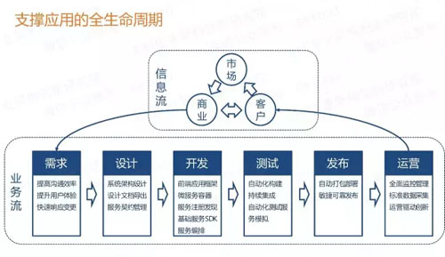
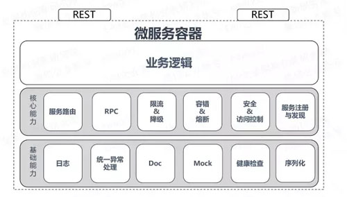

# [晓晨Master](https://www.cnblogs.com/stulzq/)

## 资深CVGG软件工程师

##  			[微服务的4个设计原则和19个解决方案](https://www.cnblogs.com/stulzq/p/8573828.html)

> 本文转自：http://developer.51cto.com/art/201709/552085.htm
>
> https://www.cnblogs.com/stulzq/p/8573828.html

微服务架构现在是谈到企业应用架构时必聊的话题，微服务之所以火热也是因为相对之前的应用开发方式有很多优点，如更灵活、更能适应现在需求快速变更的大环境。
 本文将介绍微服务架构的演进、优缺点和微服务应用的设计原则，然后着重介绍作为一个“微服务应用平台”需要提供哪些能力、解决哪些问题才能更好的支撑企业应用架构。
 微服务平台也是我目前正在参与的，还在研发过程中的平台产品，平台是以SpringCloud为基础，结合了普元多年来对企业应用的理解和产品的设计经验，逐步孵化的一个微服务应用平台。

# 一、微服务架构演进过程

近年来我们大家都体会到了互联网、移动互联带来的好处，作为IT从业者，在生活中时刻感受互联网好处的同时，在工作中可能感受的却是来自自互联网的一些压力，那就是我们传统企业的IT建设也是迫切需要转型，需要面向外部客户，我们也需要应对外部环境的快速变化、需要快速创新，那么我们的IT架构也需要向互联网企业学习作出相应的改进，来支撑企业的数字化转型。
 我们再看一下应用架构的演进过程，回忆一下微服务架构是如何一步一步进化产生的，最早是应用是单块架构，后来为了具备一定的扩展和可靠性，就有了垂直架构，也就是加了个负载均衡，接下来是前几年比较火的SOA，主要讲了应用系统之间如何集成和互通，而到现在的微服务架构则是进一步在探讨一个应用系统该如何设计才能够更好的开发、管理更加灵活高效。
 微服务架构的基本思想就是“围绕业务领域组件来创建应用，让应用可以独立的开发、管理和加速”。

# 二、微服务架构的好处

我们总结了四个方面的优点，分别如下：
 是每个微服务组件都是简单灵活的，能够独立部署。不再像以前一样，应用需要一个庞大的应用服务器来支撑。
 可以由一个小团队负责更专注专业，相应的也就更高效可靠。
 微服务之间是松耦合的，微服务内部是高内聚的，每个微服务很容易按需扩展。
 微服务架构与语言工具无关，自由选择合适的语言和工具，高效的完成业务目标即可。
 看到这里，大家会觉得微服务架构挺不错，然而还会有一些疑问，什么样的应用算是一个微服务架构的应用?该怎样设计一个微服务架构的应用?那我们来一起看看我们推荐的微服务应用的设计原则。

# 三、微服务应用4个设计原则

我们总结了四个原则推荐给大家：

- AKF拆分原则
- 前后端分离
- 无状态服务
- Restful通信风格

### 1.AKF拆分原则

AKF扩展立方体(参考《The Art of Scalability》)，是一个叫AKF的公司的技术专家抽象总结的应用扩展的三个维度。理论上按照这三个扩展模式，可以将一个单体系统，进行无限扩展。
 X 轴 ：指的是水平复制，很好理解，就是讲单体系统多运行几个实例，做个集群加负载均衡的模式。
 Z 轴 ：是基于类似的数据分区，比如一个互联网打车应用突然或了，用户量激增，集群模式撑不住了，那就按照用户请求的地区进行数据分区，北京、上海、四川等多建几个集群。
 Y 轴 ：就是我们所说的微服务的拆分模式，就是基于不同的业务拆分。
 场景说明：比如打车应用，一个集群撑不住时，分了多个集群，后来用户激增还是不够用，经过分析发现是乘客和车主访问量很大，就将打车应用拆成了三个乘客服务、车主服务、支付服务。三个服务的业务特点各不相同，独立维护，各自都可以再次按需扩展。

### 2.前后端分离

前后端分离原则，简单来讲就是前端和后端的代码分离也就是技术上做分离，我们推荐的模式是最好直接采用物理分离的方式部署，进一步促使进行更彻底的分离。不要继续以前的服务端模板技术，比如JSP  ，把Java JS HTML CSS 都堆到一个页面里，稍复杂的页面就无法维护。这种分离模式的方式有几个好处：
 前后端技术分离，可以由各自的专家来对各自的领域进行优化，这样前端的用户体验优化效果会更好。
 分离模式下，前后端交互界面更加清晰，就剩下了接口和模型，后端的接口简洁明了，更容易维护。
 前端多渠道集成场景更容易实现，后端服务无需变更，采用统一的数据和模型，可以支撑前端的web UI 移动App等访问。

### 3.无状态服务

对于无状态服务，首先说一下什么是状态：如果一个数据需要被多个服务共享，才能完成一笔交易，那么这个数据被称为状态。进而依赖这个“状态”数据的服务被称为有状态服务，反之称为无状态服务。
 那么这个无状态服务原则并不是说在微服务架构里就不允许存在状态，表达的真实意思是要把有状态的业务服务改变为无状态的计算类服务，那么状态数据也就相应的迁移到对应的“有状态数据服务”中。
 场景说明：例如我们以前在本地内存中建立的数据缓存、Session缓存，到现在的微服务架构中就应该把这些数据迁移到分布式缓存中存储，让业务服务变成一个无状态的计算节点。迁移后，就可以做到按需动态伸缩，微服务应用在运行时动态增删节点，就不再需要考虑缓存数据如何同步的问题。

### 4.Restful通信风格

作为一个原则来讲本来应该是个“无状态通信原则”，在这里我们直接推荐一个实践优选的Restful 通信风格 ，因为他有很多好处：
 无状态协议HTTP，具备先天优势，扩展能力很强。例如需要安全加密是，有现成的成熟方案HTTPS可用。
 JSON 报文序列化，轻量简单，人与机器均可读，学习成本低，搜索引擎友好。
 语言无关，各大热门语言都提供成熟的Restful API框架，相对其他的一些RPC框架生态更完善。
 当然在有些特殊业务场景下，也需要采用其他的RPC框架，如thrift、avro-rpc、grpc。但绝大多数情况下Restful就足够用了。

# 四、微服务架构带来的问题

做到了前面讲的四个原则，那么就可以说是构建了一个微服务应用，感觉上也不复杂。但实际上微服务也不是个万金油，也是有利有弊的，接下来我们来看看引入微服务架构后带来的问题有哪些。

依赖服务变更很难跟踪，其他团队的服务接口文档过期怎么办?依赖的服务没有准备好，如何验证我开发的功能。
 部分模块重复构建，跨团队、跨系统、跨语言会有很多的重复建设。
 微服务放大了分布式架构的系列问题，如分布式事务怎么处理?依赖服务不稳定怎么办?
 运维复杂度陡增，如：部署物数量多、监控进程多导致整体运维复杂度提升。
 上面这些问题我们应该都遇到过，并且也会有一些解决方案，比如提供文档管理、服务治理、服务模拟的工具和框架; 实现统一认证、统一配置、统一日志框架、分布式汇总分析; 采用全局事务方案、采用异步模拟同步;搭建持续集成平台、统一监控平台等等。
 这些解决方案折腾到最后终于搞明白了，原来我们是需要一个微服务应用平台才能整体性的解决这些问题。

# 五、微服务平台的19个落地实践

### 1.企业IT建设的三大基础环境

我们先来宏观的看一下，一个企业的IT建设非常重要的三大基础环境：团队协作环境、个人基础环境、IT基础设施。

团队协作环境：主要是DevOps领域的范畴，负责从需求到计划任务，团队协作，再到质量管理、持续集成和发布。
 个人基础环境：就是本文介绍的微服务应用平台，他的目标主要就是要支撑微服务应用的设计开发测试，运行期的业务数据处理和应用的管理监控。
 IT基础设施：就是我们通常说的各种运行环境支撑如IaaS (VM虚拟化)和CaaS (容器虚拟化)等实现方式。

### 2.微服务应用平台总体架构

微服务应用平台的总体架构，主要是从开发集成、微服务运行容器与平台、运行时监控治理和外部渠道接入等维度来划分的。

- 开发集成：主要是搭建一个微服务平台需要具备的一些工具和仓库
- 运行时：要有微服务平台来提供一些基础能力和分布式的支撑能力，我们的微服务运行容器则会运行在这个平台之上。
- 监控治理：则是致力于在运行时能够对受管的微服务进行统一的监控、配置等能力。
- 服务网关： 则是负责与前端的WEB应用 移动APP 等渠道集成，对前端请求进行认真鉴权，然后路由转发。

### 3.微服务应用平台的运行视图

参考上图，在运行期，作为一个微服务架构的平台与业务系统，除了业务应用本身外，还需要有接入服务、统一门户、基础服务等平台级服务来保障业务系统的可靠运行。图中的公共服务就是业务处理过程中需要用到的一些可选服务。

### 4.微服务平台的设计目标

微服务平台的主要目标主要就是要支撑微服务应用的全生命周期管理，从需求到设计开发测试，运行期的业务数据处理和应用的管理监控等，后续将从应用生命周期的几个重要阶段切入，结合前面提到的设计原则和问题，介绍平台提供的能力支撑情况。

### 5.微服务开发：前端、后端、混合

我们一起看一下我们正在开发中的微服务应用平台EOS8.0的一些开发工具截图，了解一下开发期提供了哪些关键的能力支撑。
 前面的设计原则中提到了一个前后端分离的原则，那么我们的开发环境中，目前支持创建前端项目、后端项目和混合项目。其中前端项目、后端项目就对应前后端分离的原则，利用平台中集成的开发工具和框架可以做到前后端开发分离，利用持续集成工具可以方便的将前端、后端项目编译打包成可独立运行的程序。混合项目则是为了兼容传统模式而保留的，为企业应用向微服务架构演进提供过渡方案。

### 6.服务契约与API管理

对于前面提到的微服务带来的依赖管理问题，我们可以通过平台提供的API管理能力来解决。说到API管理，那首先就用提到服务契约。平台开发工具中提供了方便的服务发布能力，能够快速的将业务功能对外发布，生成服务的规格契约，当然也可以先设计服务契约，在根据契约来生成服务的默认实现代码。
 这里强调一下，我们提到的服务契约是一个很重要的东西，他有点类似web service的wsdl描述，主要描述服务接口的输入输出规格标准和其他一些服务调用集成相关的规格内容。

### 7.服务契约与服务模拟

有了服务契约，我们就可以根据契约自动生成服务的文档和服务模拟测试环境，这样，开发者就可以方便的获取到依赖服务变更的情况，能够及时的根据依赖服务的变化调整自己的程序，并且能够方便的进行模拟测试验证。

### 8.服务契约与服务编排

有了服务契约，那就有了服务接口的输入输出规格，那么restful的服务编排也就变得可行。在我们设计的契约标准中，还定义了调用集成相关的内容，比如服务支持的事务模式等等。通过这些约定，我们就可以采用简单图形化的方式来对业务服务流程进行编排。编排能够很大程度上简化分布式服务调用的复杂度，如同步、异步、异步模拟同步、超时重试、事务补偿等，均有服务编排引擎完成，不再完全依赖老师傅的编码能力。
 服务编排的作用和意义很大，可以快速的将已经提供的微服务能力进行组合发布，非常适合业务的快速创新。
 但是大家要注意，逻辑流编排的是业务流程，尽量能够简单明了，一眼看上去就明白业务含义。而业务规则推荐采用服务内部进行编码实现。千万不要将我们的  “逻辑流” 图形化服务编排完全取代程序编码，这样就会可能会走入另外一个极端，比如设计出像蜘蛛网一样的逻辑流图，简直就是灾难。

### 9.微服务容器

我们再来看一下微服务运行容器的一个逻辑图，大家可以看到，我们要做微服务架构的应用，可靠高效的微服务应用，实际上我们需要做的事情还是非常多的。如果没有一个统一的微服务容器，这些能力在每个微服务组件中都需要建设一遍，而且会五花八门，也很难集成到一起。有了统一的微服务运行容器和一些公共的基础服务，前面所提到的微服务架构下部分组件重复建设的问题也迎刃而解。

### 10.三方能力集成说明

我们的API管理契约文档API模拟我们是集成了Swagger的工具链。微服务应用平台的基础就是SpringCloud，从容器框架到注册发现再到安全认证这些基础方案均采用了他的能力来支撑。下面简单看下我们集成的一些开源框架和工具。

SpringCloud在微服务平台中的定位是基础框架，本文重点是要介绍一个企业级的微服务平台在落地过程中的一些设计原则和解决方案。具体Spring Cloud相关的技术就不在文中多做介绍了，大家可以在我们的公众号里面查看相关文章。

### 11.服务注册发现路由

接下来我们聊一下注册发现，以前的单块应用之间互相调用时配置个IP就行了，但在微服务架构下，服务提供者会有很多，手工配置IP地址又变成了一个不可行的事情。那么服务自动注册发现的方案就解决了这个问题。
 我们的服务注册发现能力是依赖SpringCloud  Eureka组件实现的。服务在启动的时候，会将自己要发布的服务注册到服务注册中心，运行时，如果需要调用其他微服务的接口，那么就要先到注册中心获取服务提供者的地址，拿到地址后，通过微服务容器内部的简单负载均衡期进行路由用。
 一般情况，系统内微服务的调用都通过这种客户端负载的模式进行，否则就需要有很多的负载均衡进程。跨业务系统的服务调用，也可以采用这种去中心化的路由方式。当然采用SOA的模式，由中心化的服务网管来管理系统间的调用也是另一种选择，要结合企业的IT现状和需求来决定。

### 12.统一认证鉴权

安全认证方面，我们基于Spring Security结合Auth2再加上JWT(Json web  token)做安全令牌，实现统一的安全认证与鉴权，使得微服务之间能够按需隔离和安全互通。后续在统一认证和权限方面我们产品会陆续推出较完善并且扩展性良好的微服务组件，可以作为微服务平台的公共的认证和鉴权服务。再啰嗦一句，认证鉴权一定是个公共的服务，而不是多个系统各自建设。

### 13.日志与流水设计

作为一个微服务应用平台除了提供支撑开发和运行的技术组件和框架之外，我们还提供一些运维友好的经验总结，我们一起来看一下我们推荐的日志与流水实现，先来看日志，平台默认回会提供的日志主要有三种，系统日志，引擎日志还有跟踪日志。有了这些日志，在出问题的时候能够帮助我们获取一些关键信息进行问题定位。
 要想做到出了问题能够追根溯源，那么右边的这些流水号的设计也是非常重要的，日志与各种流水号配合，能够让我们快速定位问题发生的具体时间地点以及相关信息，能够快速还原业务交易全链路。对这些日志与流水的细节处理，对于系统运维问题定位有非常大的帮助，没有这些有用的日志内容，ELK日志收集套件搭建的再漂亮，收一对垃圾日志也是没用的。通常开源框架只是提供个框架有开发人员自由发挥，而设计一个平台则一定要考虑直接提供统一规范的基础能力。

### 14.集中配置管理

微服务分布式环境下，一个系统拆分为很多个微服务，一定要告别投产或运维手工修改配置配置的方式。需要采用集中配置管理的方式来提升运维的效率。
 配置文件主要有运行前的静态配置和运行期的动态配置两种。静态配置通常是在编译部署包之前设置好。动态配置则是系统运行过程中需要调整的系统变量或者业务参数。要想做到集中的配置管理，那么需要注意以下几点。
 是配置与介质分离，这个就需要通过制定规范的方式来控制。千万别把配置放在Jar包里。
 是配置的方式要统一，格式、读写方式、变更热更新的模式尽量统一，要采用统一的配置框架
 就是需要运行时需要有个配置中心来统一管理业务系统中的配置信息，这个就需要平台来提供配置中心服务和配置管理门户。

### 15.统一管理门户

微服务架构下，一个大的EAR、WAR应用被拆为了多个小的可独立运行的微服务程序，通常这些微服务程序都不再依赖应用服务器，不依赖传统应用服务器的话，应用服务器提供管理控制台也就没得用了，所以微服务的运行时管理需要有统一的管理门户来支撑。我们规划了的统一集中的微服务门户，可以支撑   应用开发、业务处理、应用管理、系统监控等。上图是应用管理页面，就是对我们传统意义上的业务系统进行管理，点击一个业务系统，我们就能够看到系统下有哪些微服务，每个微服务有几个节点实例再运行，可以监控微服务的子节点状态，对微服务进行配置管理和监控。

### 16.分布式事务问题

微服务架构的系统下，进程成倍增多，那么也分布式事务一致性的问题也就更加明显。我们这里说的事务一致性，不是传统说的基于数据库实现的技术事务。微服务之间是独立的、调用协议也是无状态的，因此数据库事务方案在一开始就已经不再我们考虑的范围内。我们要解决的是一定时间后的数据达到最终一致状态，准确的说就是采用传统的业务补偿与冲正方式。
 推荐的事务一致性方案有三种：

- 可靠事件模式：即事件的发送和接收保障高可靠性，来实现事务的一致性。
- 补偿模式：Confirm Cancel ，如果确认失败，则全部逆序取消。
- TCC模式：Try Confirm Cancel ，补偿模式的一种特殊实现 通常转账类交易会采用这种模式。

> 晓晨的补充：还有 最大努力型、异步确保、2PC、3PC

### 17.分布式同步调用问题

微服务架构下，相对于传统部署方式，存在更多的分布式调用，那么“如何在不确定的环境中交付确定的服务”，这句话可以简单理解为，我所依赖的服务的可靠性是无法保证的情况下，我如何保证自己能够正常的提供服务，不被我依赖的其他服务拖垮?
 我们推荐SEDA架构来解决这个问题。

SEDA : staged event-driven architecture本质上就是采用分布式事件驱动的模式，用异步模拟来同步，无阻塞等待，再加上资源分配隔离结起来的一个解决方案。

### 18.持续集成与持续交付设计

在运维方面，首先我们要解决的就是持续集成和持续交付，而微服务应用平台的职责范围目前规划是只做持续集成，能够方便的用持续集成环境把程序编译成介质包和部署包。(目前规划持续部署由DevOps平台提供相应能力，微服务平台可与DevOps平台集成)
 这里要厘清一个概念：介质，是源码编译后的产物，与环境无关，多环境下应该是可以共用的，如：jar、dockerfile;配置：则是环境相关的信息。配置+介质=部署包。
 获取到部署包之后，微服务应用平台的职责就完成了，接下来就是运维人员各显神通来进行上线部署操作。

### 19.微服务平台与容器云、DevOps的关系

就微服务应用平台本身来说，并不依赖DevOps和容器云，开发好的部署包可以运行在物理机、虚拟机或者是容器中。
 然而当微服务应用平台结合了DevOps和容器云之后，我们就会发现，持续集成和交付变成了一个非常简单便捷并且又可靠的过程。
 简单几步操作，整套开发、测试、预发或者生产环境就能够搭建完成。整个过程的复杂度都由平台给屏蔽掉了，通过三大基础环境的整合，我们能够使分散的微服务组件更简单方便的进行统一管理和运维交付。