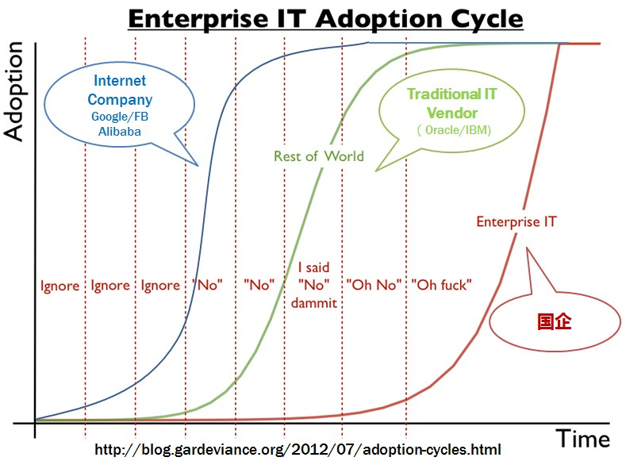
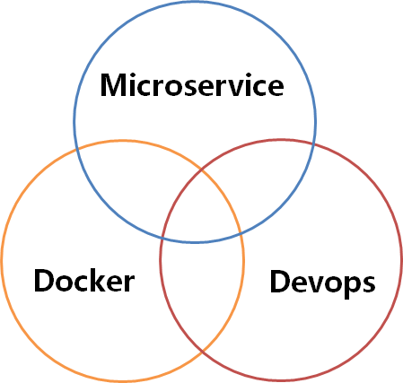
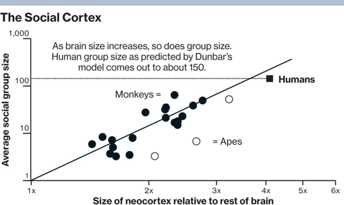
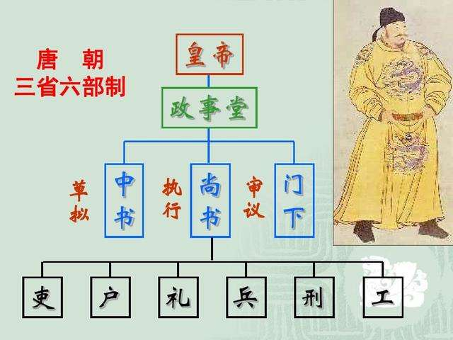
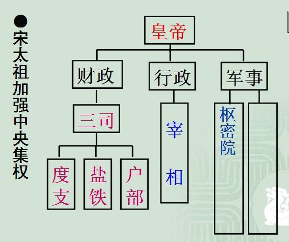
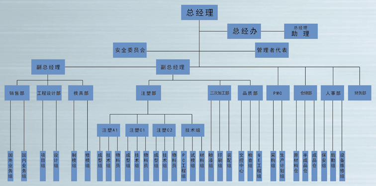
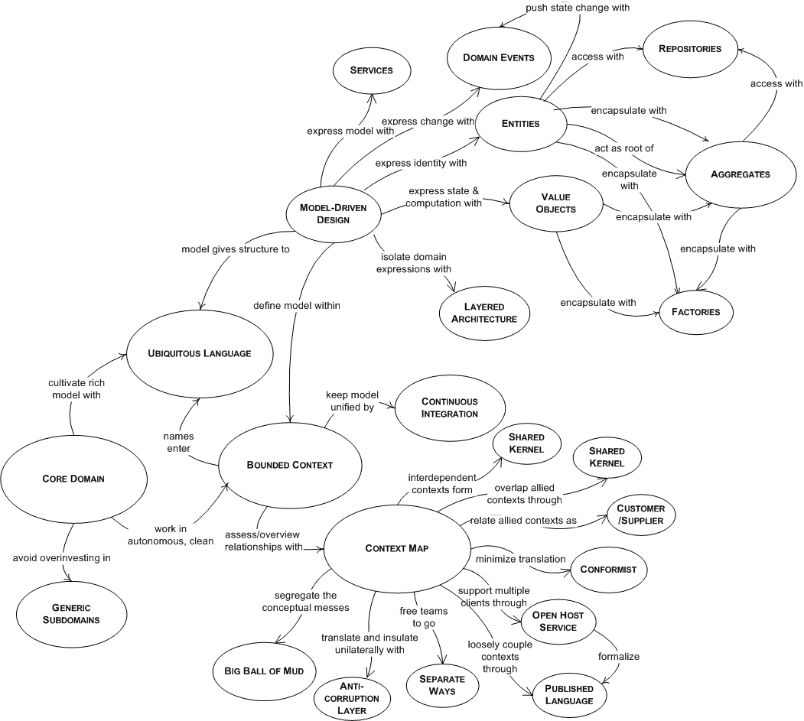

# 服务化三部曲

# 序曲

### [微服务架构的理论基础 - 康威定律](https://www.cnblogs.com/gudi/p/6685474.html)

粗细粒度降序排列，

墨菲定律（设计系统）

康威定律（系统划分）

领域驱动设计(细节设计)

>
> 其实本来所谓的微服务就是对互联网在应用技术的一个总结归纳，
>
> IT厂商鼓吹所有概念无非是为了生意（business），SOA是，Cloud是，Microservice也是。
>
> 下面玩笑很有意思的概括了这个情况（我加了第一条线，原图见[这里](https://yq.aliyun.com/go/articleRenderRedirect?url=http%3A%2F%2Fblog.gardeviance.org%2F2012%2F07%2Fadoption-cycles.html)）
>
> https://yq.aliyun.com/articles/2764

所以微服对我们的思考我觉得更多的是思维上的，对已微服务架构， 

领先，顶尖的互联网公司已经给出了解决方案 

现阶段的开源工具也足以支持中小公司的项目所需

我们也便能在生态 平台角逐出，历史选择下的中间件坐享集成到我们的项目中去了。

如果满足不了。。。你的团队的确也应该有经济实力个性定制化中间件了。。。

> **技术上不是问题，意识比工具重要。**
>
> - 按照业务 或者客户需求组织资源（这是最难的）
> - 做有生命的产品，而不是项目
> - 头狼战队，全栈化
> - 后台服务贯彻Single Responsibility Principle
> - VM->Docker （to PE）
> - DevOps (to PE)
>
> 同时，对于开发同学，有这么多的中间件和强大的PE支持固然是好事，我们也需要深入去了解这些中间件背后的原理，知其然知其所以然，设想下，如果我们是一个小公司的CTO，离开的阿里的大环境，在有限的技术资源如何通过开源技术实施微服务？
>
> 最后，一般提到微服务都离不开DevOps和Docker，
>
> 理解微服务架构是核心，
>
> devops和docker是工具，是手段。
> 
>

> ### 参考资料和推荐阅读
>
> - [http://www.infoq.com/articles/microservices-intro](https://yq.aliyun.com/go/articleRenderRedirect?url=http%3A%2F%2Fwww.infoq.com%2Farticles%2Fmicroservices-intro)
> - [http://martinfowler.com/articles/microservices.html](https://yq.aliyun.com/go/articleRenderRedirect?url=http%3A%2F%2Fmartinfowler.com%2Farticles%2Fmicroservices.html)
> - [http://martinfowler.com/microservices/](https://yq.aliyun.com/go/articleRenderRedirect?url=http%3A%2F%2Fmartinfowler.com%2Fmicroservices%2F)
> - [http://highscalability.com/blog/2014/4/8/microservices-not-a-free-lunch.html](https://yq.aliyun.com/go/articleRenderRedirect?url=http%3A%2F%2Fhighscalability.com%2Fblog%2F2014%2F4%2F8%2Fmicroservices-not-a-free-lunch.html)
> - [https://www.nginx.com/blog/introduction-to-microservices/](https://yq.aliyun.com/go/articleRenderRedirect?url=https%3A%2F%2Fwww.nginx.com%2Fblog%2Fintroduction-to-microservices%2F)
> - [http://microservices.io/patterns/microservices.html](https://yq.aliyun.com/go/articleRenderRedirect?url=http%3A%2F%2Fmicroservices.io%2Fpatterns%2Fmicroservices.html)
> - [http://www.infoq.com/presentations/migration-cloud-native](https://yq.aliyun.com/go/articleRenderRedirect?url=http%3A%2F%2Fwww.infoq.com%2Fpresentations%2Fmigration-cloud-native)
> - [https://github.com/Netflix/recipes-rss](https://yq.aliyun.com/go/articleRenderRedirect?url=https%3A%2F%2Fgithub.com%2FNetflix%2Frecipes-rss)
> - [http://www.mattstine.com/microservices](https://yq.aliyun.com/go/articleRenderRedirect?url=http%3A%2F%2Fwww.mattstine.com%2Fmicroservices)
>
> > PS: 阿里巴巴客户体验驱动创新中心随时招人，欢迎加入，有意者联系 xiaoxia.qxx@alibaba-inc.com
>
>   本文为云栖社区原创内容，未经允许不得转载，如需转载请发送邮件至yqeditor@list.alibaba-inc.com；如果您发现本社区中有涉嫌抄袭的内容，欢迎发送邮件至：yqgroup@service.aliyun.com                                 进行举报，并提供相关证据，一经查实，本社区将立刻删除涉嫌侵权内容。                             

# 墨菲定律（设计系统）

https://blog.csdn.net/mytobaby00/article/details/79840927

> 在设计系统时，应该多考虑 墨菲定律：
>
> - 任何事物都没有表面看起来那么简单。
> - 所有的事都会比你预计的时间长。
> - 可能出错的事总会出错。
> - 如果你担心某种情况发生，那么他就更有可能发生。

对此本君习惯性有两条应对：

### 没那么简单

控制服务/项目体量时，在复杂场景下应为其考量更多

个人习惯在预估已知周期下，额外再要求40%的时间，解决如此场景下的测试，

发布，Bug，功能，任务上都会在更多的维度和视角，故而这也是在不损伤原健壮性下的保底估量

### 先搞定能搞定的

同时，开发-测试-生产环境中遇到不同的问题，即使在预估考虑周详的情况下都有难以把控的要点

更何况在经验不是足够丰富，场景动态且多变的情景下不可控的场景因素，至少

> 尽人事	知天命

既然不可控的因素，在执行的过程中难以预料，那么能够预料或担忧的可能尽量去解决，才有更多的空间和精力去解决

> 对于一个极其复杂的系统，总会有考虑不周全的地方，Erik认为这个问题最好的解决办法就是：不去管它。

---

# 康威定律（系统划分）

> > 在划分系统时，应该多考虑 康威定律：
> >
> > - 系统架构是公司组织架构的反映。
> > - 应该按照业务闭环进行系统拆分／组织架构划分，实现闭环／高内聚／低耦合，减少沟通成本。
> > - 如果沟通出现问题，那么应该考虑进行系统和组织架构的调整。
> > - 在合适时机进行系统拆分，不要一开始就把系统／服务拆的非常细，虽然闭环，但是每个人维护的系统多，维护成本高。
>
> 著名的《The Mythical Man-Month》一书介绍了Brooks的理论，并引用了康威的一些观点，于是康威的理论被推崇成为我们现在所熟知的康威定律。
>
> 康威定律详细介绍https://segmentfault.com/a/1190000011118897

在文章中，Mike Amundesn总结了一些核心观点：

- 第一定律：企业沟通方式会通过系统设计表达出来
- 第二定律：再多的时间也没办法让任务完美至极，但总有时间能将它完成
- 第三定律：线型系统和线型组织架构间有潜在的异质同态特性
- 第四定律：大系统比小系统更适用于任务分解

##  康威第一定律	-**人是复杂社会动物**

**第一定律：**Communication dictates design（组织沟通方式会通过系统设计表达出来）

> 系统架构是公司组织架构的反映。

沟通效率的边际效用

> 原概念公式为
>
> - 5人团队，需要沟通的渠道是 5*(5–1)/2 = 10
> - 15人团队，需要沟通的渠道是15*(15–1)/2 = 105
> - 50人团队，需要沟通的渠道是50*(50–1)/2 = 1,225
> - 150人团队，需要沟通的渠道是150*(150–1)/2 = 11,175

除沟通渠道外，每个人的阅历，接受的教育，世界观价值观总是存在的差异

做同一件事，越多的个体参与，存在联系必然逃不过分歧

且人与人的沟通是非常复杂的，一个人的沟通精力是有限的，所以当问题太复杂需要很多人解决的时候，我们需要做拆分组织来达成对沟通效率的管理

你想要什么样的系统设计，就架构什么样的团队，能扁平化就扁平化。最好按业务来划分团队，这样能让团队自然的自治内聚，明确的业务边界会减少和外部的沟通成本，每个小团队都对自己的模块的整个生命周期负责，没有边界不清

> 如果沟通出现问题，那么应该考虑进行系统和组织架构的调整。

沟通的问题，会带来系统设计的问题，进而影响整个系统的开发效率和最终产品结果。

## 康威第二定律	-一口气吃不成胖子

**第二定律：**There is never enough time to do something right, but there is always enough time to do it over（时间再多一件事情也不可能做的完美，但总有时间做完一件事情）

罗马不是一天建成的，学会先解决首要问题。

敏捷开发巨头之一Erik Hollnagel 在他的书中阐述了类似的观点：

> 问题太复杂？那么不妨忽略不必要的细节。
>
> 没有足够的资源？放弃无用的功能。
>
> ——Erik Hollnagel（2009）

先搞定能搞定的，对这也是面对【墨菲定律】下面对问题的解决之一

主次矛盾：先解决主要矛盾

主次方面：主要矛盾的主要方面

优先级排列，逐个击破。一天吃不成的胖子，多吃几顿。。。

> 在合适时机进行系统拆分，不要一开始就把系统／服务拆的非常细，
>
> 虽然闭环，但是每个人维护的系统多，维护成本高。

所以也不是为了分开而分开，此处分割原则推荐了解DDD领域驱动设计的领理念

## 康威第三定律	-独立自治 效率沟通

**第三定律：**There is a  homomorphism from the linear graph of a system to the linear graph of  its design organization（线型系统和线型组织架构间有潜在的异质同态特性）        

减少沟通成本！=减少沟通

原文中市以团队距离，如前端，Java后端，DBA运维等只能分组，分部门

这也是常规做法，本君在校艺术团(带有社团色彩的学生会组织)阶段也意识到该问题

> 如果沟通出现问题，那么应该考虑进行系统和组织架构的调整。

后来也是意识到，如果按照舞蹈，音乐，戏剧等特长属性来拆分团队，

如果		容易造成队伍中的隔阂，甚至[鄙视链]阵营

但若		面向每次活动的组织，每个任务去组队，团队的目标一致，配合形成的合力也会越大

换到微服务的架构设计中

> **让团队自治，原因就是因为如果团队按照这样的方式组建，将沟通的成本维持在系统内部，每个子系统就会更加内聚，彼此的依赖耦合能变弱，跨系统的沟通成本也就能降低。**

## 康威第四定律	-合久必分 分而治之

**第四定律：** The structures  of large systems tend to disintegrate during development, qualitatively  more so than with small systems（大的系统组织总是比小系统更倾向于分解）

> 在合适时机进行系统拆分，不要一开始就把系统／服务拆的非常细，
>
> 虽然闭环，但是每个人维护的系统多，维护成本高。

不仅是沟通成本，管理团队，项目，组织活动拆分出的是一个个细节，一件件具体的业务

当抽象的，一个概括性完整的使命降临，通过拆分让抽象具化，细化落实到细节

从秦汉地方的郡县，唐宋中央的三省六部 三权分立

到现代的组织架构，依旧让分治成为解决负责问题的有效手段

亚马逊的Bezos有个逗趣的比喻，如果**2个披萨**不够一个团队吃的，那么这个团队就太大了。

事实上一般一个互联网公司小产品的团队差不多就是7，8人左右（包含前后端测试交互用研等，可能身兼数职）

# 领域驱动设计(细节设计)

## 	是否需要上车

前面一直讨论的是“分”

然而如何去分，分后如何整合，打通经脉

--------DDD

### 切分良药DDD

> 软件工程(DevOps)、基础设施(容器化)、软件开发模式(敏捷开发)的变革有利的推进了微服务架构的大行其道。
>
> 而微服务架构是一种架构风格、架构理念，其中的「微」更体现了它的精髓在切分。
>
> 在实际微服务的落地过程中证明，如果**切分**是错误的，你得不到**微服务承诺的「低耦合、自治、易维护」**之类的优势，并且还会比单体架构拥有更多的麻烦。
>
> 那么如何切分呢？其实并不是一些新的方法论，而是都提出很多年的架构设计方法，也称它们为微服务设计基础或架构模型：
>
> 领域驱动设计和立方体模型。

### 领域驱动设计的意义

当然，领域驱动设计并非「银弹」，不是能解决所有疑难杂症的「灵丹妙药」，学习并应用它的意义在于：

一套完整的模型驱动的软件设计方法，用于简化软件项目的**复杂度**，它能带给你：

从战略设计到战术设计的规范过程，使得你的设计思路能够更加清晰，设计过程更加规范；

**一种思维方式和概念**，可以应用在处理复杂业务的软件项目中，加快项目的交付速度；

一组提炼出来的原则和模式，可以帮助开发者开发优雅的软件系统、促进开发者对架构与模型的精心打磨，尤其善于处理系统架构的演进设计、有助于提高团队成员的面向对象设计能力与架构设计能力；

领域驱动设计与微服务架构天生匹配，无论是在新项目中设计微服务架构，还是将系统从单体架构演进到微服务设计，都可以遵循领域驱动设计的架构原则。

### 不需要DDD的场景

当然，领域驱动能给我们带来很多收获，但如果你是属于以下几种情况的某种，

那么你确实不需要学习领域驱动设计了：

如果你是独当一面的架构师，

并能设计出优雅的软件架构如果你是高效编码的程序员，

并只想踏踏实实的写代码如果你是前端的设计人员，

并奉行「用户体验至上」的理念如果你负责的软件系统并不复杂，二三人便可轻松维护

### 驱动(Driven)

DDD中，总是以领域为边界，分析领域中的核心问题(核心关注点)。然后设计对应的领域模型，通过领域模型驱动代码的实现。而数据库设计、持久化技术这些都不是DDD的核心，属于外围的东西。与数据库驱动开发的思路形成对比，驱动中需要记住两个原则：

领域驱动领域模型设计

领域模型驱动代码实现

> 领域驱动设计的最大价值是让我们告别从面向过程式的思想(天马星空，想到哪写到哪)转化为基于系统化的模型驱动思维。我们脑补一下软件开发中的常规心路历程：
>
> 1、领域设计
>
> > ​	设计表结构  术语里为领域对象的设计，也就是Java/C#等OO的class对象
> >
> > ​	与数据库所对应的类对象，【参考-“领域”概念】
>
> 2、(代码写的很冗余，不够抽象)
>
> 3、维护代码(适应业务变化)
>
> 4、遇到困难(数据结构设计不合理、代码到处冗余、改BUG引入新BUG、新人看代码和无字天书一般)
>
> 5、愈发难以维护，开始重构(理论上在老基础上改的技术债务堪比重新开发)
>
> 6、重构完成，新系统上线
>
> (兼容历史数据、数据迁移、新老系统并行，等等出发点考虑，其实本质上只是做了代码重构)
>
> 7、重复执行3-6步......

拆分DDD的三个D分别为：

> - 什么是领域/子领域(Domain/Subdomain)
>
> - 什么是设计(Design)
>
> - 什么是驱动(Driven)
>
> 此篇文中以简述https://baijiahao.baidu.com/s?id=1619520813230704466&wfr=spider&for=pc

## 驾驶指南

### [领域驱动设计的基础知识总结](https://www.cnblogs.com/butterfly100/p/7827870.html)

https://www.cnblogs.com/butterfly100/p/7827870.html

虽然借由ABP框架学习DDD设计两年多，但此奥义博大精深

再者***前人之述备*矣**，待本君再行修炼，深耕细作	砥砺前行

若成一家之言再悉数项项诸位

## 项目实战干货[+]

### 面向对象概念的理解与分析

### **领域模型不是设计文档，但也不是代码**！

​	目标是做到**模型既设计、代码与设计保持一致**！

### 架构分层合理性

无论是MVC MVVM MVP基于不同的场景，各种分层都显示其优势

而在领域驱动的传统四层，比对MVC的模型(model)－视图(view)－控制器(controller)

model/business-业务层更多负责处理的是代表业务价值的逻辑代码

接近接口的controller控制器除了非逻辑性的验证安全等公共模块

controller也将清晰的负责转发和控制服务调用链

View，微服务以前后端分离的前提下，交给Vue-React等前端JS框架更为合适

以下是领域驱动所用到的 设计模式

## 使用的模式

