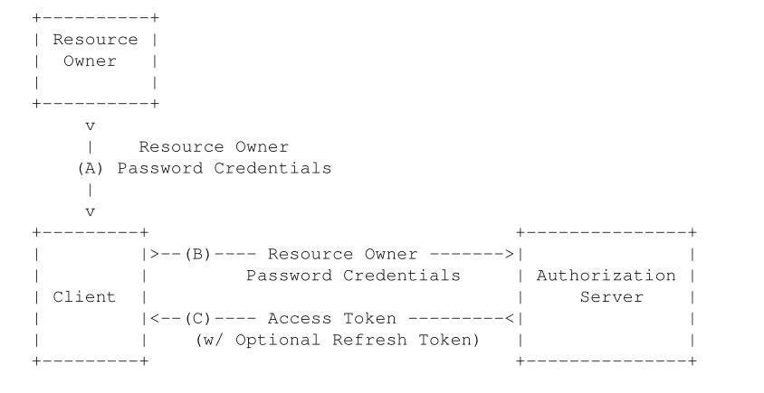
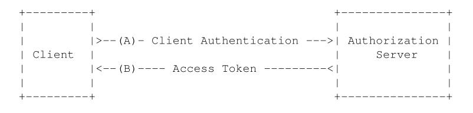

#  			[[认证 & 授权\] 1. OAuth2授权](https://www.cnblogs.com/linianhui/p/oauth2-authorization.html)


分类: [[认证 & 授权\]](https://www.cnblogs.com/linianhui/category/929878.html)

标签: [OAuth2](https://www.cnblogs.com/linianhui/tag/OAuth2/)

# 1 OAuth2解决什么问题的？

举个栗子先。**小明**在**QQ空间**积攒了多年的照片，想挑选一些照片来打印出来。然后小明在找到一家提供在线打印并且包邮的网站（我们叫它**PP**吧（Print Photo缩写 😂））。

那么现在问题来了，小明有两个方案来得到打印的服务。

1. 在自己的QQ空间把想要打印的照片下载下来，然后提供给PP（直接发邮件给PP或者网盘共享给PP等等）。
2. 把自己的QQ账号密码给PP，然后告诉PP我要打印哪些照片。

针对方案（1）：小明要去下载这些照片，然后给PP，小明累觉不爱，，，

针对方案（2）：小明交出去自己的QQ账号密码，还要告诉PP哪些需要打印，哪些不需要，小明觉得自己有些小秘密不想给PP看，，，

小明觉得很痛苦，，，那么有没有不给PP账号密码，不下载照片，自己选哪些要打印直接扔给PP去打印的办法呢？OAuth走了过来扔给小明一块肥皂...

# 2 OAuth2简介

总结来说，OAuth2 是一个**开放授权标准，**它允许用户（小明）让第三方应用（PP）访问该用户在某服务的**特定私有资源**（QQ空间中小明的照片，可以不包含小明的小视频哦）但是不提供账号密码信息给第三方应用（PP）*。*

> 有个小问题，为啥是OAuth2呢？1在哪？嗯，这个嘛，其实是有1和1.1版本的，只是因为1和1.1版本流程比较复杂，应用不是很广范，这里就不介绍了。据笔者以前做过的项目，Twitter是使用的OAuth1.1的版本，感兴趣的可以去了解下<https://dev.twitter.com/oauth>。

## 2.1 OAuth2的四个重要角色

进入正题，在OAuth2的完整授权流程中有4个重要的角色参与进来：

1. **Resource Owner**：资源拥有者，上面栗子中的**小明**；
2. **Resource Server**：资源服务器，上面栗子中的**QQ空间**，它是小明想要分享照片给PP的照片的提供方；
3. **Client**：第三方应用客户端，上面栗子中的**PP**，代指任何可以消费资源服务器的第三方应用；
4. **Authorization Server** ：授权服务器，管理**Resource Owner，Client和Resource Server的三角关系的中间层**。

其中Authorization server和Resource server可以是独立的服务提供商，也可以是在一起的，比如腾讯提供QQ空间作为资源服务器的同时也提供授权服务。

从这里可以看出，OAuth2在解决小明遇到的问题的过程中增加了一个**Authorization server**的角色。又印证了那句话，在计算机领域的所有问题都可以添加一个中间层来解决。

OAuth2解决问题的关键在于使用Authorization  server提供一个访问凭据给Client，使得Client可以在不知道Resource owner在Resource  server上的用户名和密码的情况下消费Resource owner的受保护资源。

# 3 部署OAuth2需要的完成的工作

由于OAuth2引入了Authorization server来管理Resource Owner，Client和Resource Server的三角关系，那么想要用上OAuth2，是实现以下功能的。

1. 增加一个Authorization server，提供授权的实现，一般由Resource server 来提供。
2. Resource server 为第三方应用程序提供注册接口。
3. Resource server 开放相应的受保护资源的API。
4. Client 注册成为Resource server的第三方应用。
5. Client 消费这些API。

作为资源服务提供商来说，1，2，3这三件事情是需要完成的。

作为第三方应用程序，要完成的工作是在4和5这两个步骤中。

其中作为Resource owner来说，是不用做什么的，是OAuth2受益的千千万万的最终人类用户。

## 3.1 作为Resource server

在一般情况下，Resource server提供Authorization server服务，主要提供两类接口：

1. 授权接口：接受Client的授权请求，引导用户到Resource server完成登陆授权的过程。
2. 获取访问令牌接口：使用授权接口提供的许可凭据来颁发Resource owner的访问令牌给Client，或者由Client更新过期的访问令牌。

除此之外，还需要提供一个第三方应用程序注册管理的服务。通常情况下会为注册完成的第三方应用程序分配两个成对出现的重要参数：

1. client_id：第三方应用程序的一个标识id，这个信息通常是公开的信息，用来区分哪一个第三方应用程序。
2. client_secret：第三方应用程序的私钥信息，这个信息是私密的信息，不允许在OAuth2流程中传递的，用于安全方面的检测和加密。

## 3.2 作为Client

在Client取得client_id和client_secret之后。使用这些信息来发起授权请求、获取access_token请求和消费受保护的资源。

# 4 OAuth2的授权流程

贴个图瞅瞅OAuth2的工作流程：


在上述的OAuth完整流程中，（A）->（B）->（C）->（D）是授权的过程（参与者有**小明**，**PP**，**QQ空间**，**Authorization server**）；（E）->（F）是消费资源的过程（参与者有**PP**和**QQ空间**）。

- （A）**小明**访问**PP**，**PP**向**QQ空间**发起授权请求；
- （B）**QQ空间**接受**PP**的授权请求，并返回*授权许可*给**PP**；
- （C）**PP**使用*授权许可*向**Authorization server**发起请求**；**
- （D）**Authorization server**验证**PP**的身份和*授权许可*，发送*访问令牌*给**PP**；
- （E）**PP**用*访问令牌*请求**小明**存储在**QQ空间**的照片；
- （F）**QQ空间**根据*访问令牌*，返回**小明**的照片信息给**PP**。

这其中比较重要的一个概念是***访问令牌*** ，它代表的信息是整个OAuth2的核心，也是ABCD这些步骤最终要得到的信息。

访问令牌是对**PP可以在QQ空间访问小明的哪些信息**这个完整权限的一个抽象，比如PP要访问小李在QQ空间的照片，那么就是另外一个访问令牌了。

访问令牌背后抽象的信息有哪些呢?如下3类信息。

1. 客户端标识（比如**PP**）；
2. 用户标识（比如**小明**）；
3. 客户端能访问资源所有者的哪些资源以及其相应的权限。

有了这三类信息，那么资源服务器（Resouce Server）就可以区分出来是哪个第三方应用（Client）要访问哪个用户（Resource Owner）的哪些资源（以及有没有权限）。

# 5 OAuth2的4种授权许可

上一小节介绍了OAuth2的授权流程，除了访问令牌之外，还有一个重要的概念**授权许可（Authorization Grant）。**

书面化的方式解释就是**授权许可是一个代表资源所有者授权（访问受保护资源）的凭据，客户端用它来获取访问令牌**。读起来比较抽象，翻一下就是**授权许可是小明授予PP获得QQ空间访问令牌的一个凭据**。

那么如何获得这个凭据呐，OAuth2定义了四种许可类型以及用于定义其他类型的可扩展性机制：

1. Authorization Code：授权码；
2. Implicit：隐式许可；
3. Resource Owner Password Credentials：资源所有者密码凭据；
4. Client Credentials ：客户端凭据。

**注意：以下4种授权许可是对上述(4. OAuth2的授权流程)中的ABDE四个阶段的展开。**

## **5.1 Authorization Code**

这是OAuth2最常用的一种授权许可类型，比如QQ，微博，Facebook和豆瓣等等。要求Client具有可公开访问的Server服务器来接受**Authorization Code**，具体的流程如下：


上图ABCDE这5个步骤，既是完整的获取访问令牌的一个过程，其中引入了一些其他的概念，比如客户端标识，刷新令牌等和重定向URL等概念，后续会在[6. OAuth2附属概念和流程](https://www.cnblogs.com/linianhui/p/oauth2-authorization.html#auto_id_6)介绍。

- （A）**Client**使用浏览器（用户代理）访问**Authorization server。**也就是用浏览器访问一个URL，这个URL是**Authorization server**提供的，访问的收Client需要提供（客户端标识，请求范围，本地状态和重定向URL）这些参数。
- （B）**Authorization server**验证**Client**在（A）中传递的参数信息，如果无误则提供一个页面供**Resource owner**登陆，登陆成功后选择**Client**可以访问**Resource server**的哪些资源以及读写权限。
- （C）在（B）无误后返回一个**授权码（Authorization Code）**给Client**。**
- （D）**Client**拿着（C）中获得的**授权码（Authorization Code）**和（客户端标识、重定向URL等信息）作为参数，请求**Authorization server**提供的获取访问令牌的URL**。**
- （E）**Authorization server**返回**访问令牌**和可选的**刷新令牌**以及**令牌有效时间**等信息给**Client**。

### 5.1.1 Authorization Request

对应步骤（A），客户端提供以下参数请求Authorization Server：

1. response_type：必选。值固定为“code”。
2. client_id：必选。第三方应用的标识ID。
3. state：**推荐**。Client提供的一个字符串，服务器会原样返回给Client。
4. redirect_uri：必选。授权成功后的重定向地址。
5. scope：可选。表示授权范围。

比如以下示例：

> ```
> GET /authorize?response_type=code&client_id=1&state=xyz&redirect_uri=https%3A%2F%2Fclient%2Eexample%2Ecom%2Foauth2&scope=user,photo HTTP/1.1
> Host: server.example.com
> ```

### 5.1.2 Authorization Response

对应步骤（C），Authorization Server会返回如下信息：

1. code：授权码。
2. state：步骤（A）中客户端提供的state参数原样返回。

比如示例如下：

> ```
> HTTP/1.1 302 Found
> Location: https://client.example.com/oauth2?code=SplxlOBeZQQYbYS6WxSbIA&state=xyz
> ```

Location头部信息指向步骤（A）提供的redirect_uri地址，同时携带code信息和state信息给client，这样浏览器在重定向的时候就会已GET的方式访问Client提供的redirect_uri，同时Client接收到code信息和state信息。下一步就可以请求access_token了。

### 5.1.3 Access Token Request

对应步骤（D），客户端提供以下参数请求Authorization Server：

1. grant_type：必选。固定值“authorization_code”。
2. code : 必选。Authorization Response 中响应的code。
3. redirect_uri：必选。必须和Authorization Request中提供的redirect_uri相同。
4. client_id：必选。必须和Authorization Request中提供的client_id相同。

比如以下示例：

> ```
> POST /token HTTP/1.1
> Host: server.example.com
> Content-Type: application/x-www-form-urlencoded
> 
> grant_type=authorization_code&code=123&client_id=1&redirect_uri=https%3A%2F%2Fclient%2Eexample%2Ecom%2Foauth2
> ```

### 5.1.4 Access Token Response

对应步骤（E），Authorization Server会返回如下典型的信息：

1. access_token：访问令牌。
2. refresh_token：刷新令牌。
3. expires_in：过期时间。

比如以下示例：

> ```
> HTTP/1.1 200 OK
> Content-Type: application/json;charset=UTF-8
> 
> {
>    "access_token":"2YotnFZFEjr1zCsicMWpAA",
>    "token_type":"example",
>    "expires_in":3600, 
>    "refresh_token":"tGzv3JOkF0XG5Qx2TlKWIA", 
>    "example_parameter":"example_value"
> }
> ```

## 5.2 Implicit

这个是Authorization Code的简化版本。其中省略掉了颁发授权码（Authorization  Code）给客户端的过程，而是直接返回访问令牌和可选的刷新令牌。其适用于没有Server服务器来接受处理Authorization  Code的第三方应用，其流程如下：


其步骤就不做详细介绍了，相信大家都能理解。和Authorzation Code类型下重要的区分就是省略了Authorization  Response和Access Token Request。而是直接由Authorization Request返回Access Token  Response信息，具体如下。

### 5.2.1 Authorization Request

客户端提供以下参数请求Authorization Server：

1. response_type：必选。值固定为“token”。
2. client_id：必选。第三方应用的标识ID。
3. state：**推荐**。Client提供的一个字符串，服务器会原样返回给Client。
4. redirect_uri：可选。授权成功后的重定向地址。
5. scope：可选。表示授权范围。

重点区别在于**response_type为“token”**，而不再是“code”，redirect_uri也变为了可选参数。

比如以下示例：

> ```
> GET /authorize?response_type=token&client_id=1&state=xyz&redirect_uri=https%3A%2F%2Fclient%2Eexample%2Ecom%2Foauth2&scope=user,photo HTTP/1.1
> Host: server.example.com
> ```

### 5.2.2 Access Token Response

Authorization Server会返回如下典型的信息：

1. access_token：访问令牌。
2. refresh_token：刷新令牌。
3. expires_in：过期时间。

比如以下示：

> ```
> HTTP/1.1 302 Found
> Location: http://client.example.com/oauth2#access_token=2YotnFZFEjr1zCsicMWpAA&state=xyz&expires_in=3600
> ```

注意其和Authorization  Code的最大区别在于它是把token信息放在了url的hash部分（#后面），而不是作为参数(?后面)。这样浏览器在访问重定向的Location指定的url时，就不会把这些数据发送到服务器。而Client可以通过读取Location头信息中获取到access_token信息。

## 5.3 Resource Owner Password Credentials Grant

看看流程图：



这种模式再一步简化，和Authorzation Code类型下重要的区分就是省略了Authorization  Request和Authorization Response。而是Client直接使用Resource  owner提供的username和password来直接请求access_token（直接发起Access Token  Request然后返回Access Token Response信息）。这种模式一般适用于Resource  server高度信任第三方Client的情况下。

客户端提供以下参数请求Authorization Server：

1. grant_type：必选。值固定为“password”。
2. username：必选。用户登陆名。
3. passward：必选**。**用户登陆密码。
4. scope：可选。表示授权范围。

比如以下示例：

> ```
> POST /token HTTP/1.1
> Host: server.example.com
> Content-Type: application/x-www-form-urlencoded
> 
> grant_type=password&username=blackheart&password=1234
> ```

Access Token Response和Authorization Code一致，就不列出来了。

## 5.4 Client Credentials Grant

这种类型就更简化了，Client直接已自己的名义而不是Resource owner的名义去要求访问Resource server的一些受保护资源。



客户端提供以下参数请求Authorization Server：

1. grant_type：必选。值固定为“client_credentials”。
2. scope：可选。表示授权范围。

比如以下示例：

> ```
> POST /token HTTP/1.1
> Host: server.example.com
> Content-Type: application/x-www-form-urlencoded
> 
> grant_type=client_credentials
> ```

Access Token Response和Authorization Code一致，就不列出来了。

以笔者以前做公共号开发的经验，它提供由这类的OAuth2许可类型，这个场景下得到的access_token的所属人是公众号的，可以用此access_token来获取所有已关注的用户的信息，而不局限于特定的某一个用户，正是Client  Credentials Grant这种类型的许可的用武之地，案例文档地址在文章最后面。

# 6 OAuth2刷新令牌

在上述得到访问令牌（access_token）时，一般会提供一个过期时间和刷新令牌。以便在访问令牌过期失效的时候可以由客户端自动获取新的访问令牌，而不是让用户再次登陆授权。那么问题来了，是否可以把过期时间设置的无限大呢，答案是可以的，笔者记得Pocket的OAuth2拿到的访问令牌就是无限期的，好像豆瓣的也是。如下是刷新令牌的收客户端需要提供给Authorization  Server的参数：

1. grant_type：必选。固定值“refresh_token”。
2. refresh_token：必选。客户端得到access_token的同时拿到的刷新令牌。

比如以下示例：

> ```
>  POST /token HTTP/1.1
>  Host: server.example.com
> 
>  grant_type=refresh_token&refresh_token=tGzv3JOkF0XG5Qx2TlKWIA
> ```

响应信息和5.1.4 Access Token Response保持一致。

# 7 Token传递方式

在第三方Client拿到access_token后，如何发送给Resouce Server这个问题并没有在RFC6729种定义，而是作为一个单独的RFC6750来独立定义了。这里做以下简单的介绍，主要有三种方式如下：

1. URI Query Parameter.
2. Authorization Request Header Field.
3. Form-Encoded Body Parameter.

## 7.1 URI Query Parameter

这种使用途径应该是最常见的一种方式，非常简单，比如：

> *GET /resource?access_token=mF_9.B5f-4.1JqM HTTP/1.1*
>
> *Host: server.example.com*

在我们请求受保护的资源的Url后面追加一个access_token的参数即可。另外还有一点要求，就是Client需要设置以下Request Header的**Cache-Control:no-store**，用来阻止access_token不会被Web中间件给log下来，属于安全防护方面的一个考虑。

## 7.2 Authorization Request Header Field

因为在HTTP应用层协议中，专门有定义一个授权使用的Request Header，所以也可以使用这种方式：

> *GET /resource HTTP/1.1*
> *Host: server.example.com*
> *Authorization: Bearer mF_9.B5f-4.1JqM*

其中"Bearer "是固定的在access_token前面的头部信息。

## 7.3 Form-Encoded Body Parameter

使用Request Body这种方式，有一个额外的要求，就是Request  Header的"Content-Type"必须是固定的“application/x-www-form-urlencoded”，此外还有一个限制就是不可以使用GET访问，这个好理解，毕竟GET请求是不能携带Request  Body的。

> *POST /resource HTTP/1.1*
> *Host: server.example.com*
> *Content-Type: application/x-www-form-urlencoded*
>
> *access_token=mF_9.B5f-4.1JqM*

# 8 OAuth2的安全问题

在OAuth2早期的时候爆发过不少相关的安全方面的漏洞，其实仔细分析后会发现大都都是没有严格遵循OAuth2的安全相关的指导造成的，相关的漏洞事件百度以下就有了。

其实OAuth2在设计之初是已经做了很多安全方面的考虑，并且在RFC6749中加入了一些安全方面的规范指导。比如

1. 要求Authorization server进行有效的Client验证；
2. client_serect,access_token,refresh_token,code等敏感信息的安全存储（不得泄露给第三方）、传输通道的安全性（TSL的要求）；
3. 维持refresh_token和第三方应用的绑定，刷新失效机制；
4. 维持Authorization Code和第三方应用的绑定，这也是state参数为什么是推荐的一点，以防止CSRF；
5. 保证上述各种令牌信息的不可猜测行，以防止被猜测得到；

安全无小事，这方面是要靠各方面（开放平台，第三方开发者）共同防范的。如QQ互联的OAuth2 API中，state参数是强制必选的参数，授权接口是基于HTTPS的加密通道等；同时作为第三方开发者在使用消费这些服务的时候也应该遵循其相关的安全规范。

# 9 总结 & 参考 & 案例

OAuth2是一种**授权**标准框架，用来解决的是第三方服务在无需用户提供账号密度的情况下访问用户的私有资源的一套流程规范。与其配套的还有其他相关的规范，都可以到<https://oauth.net/2/>去延伸阅读和了解。

相关参考：

<https://oauth.net/2/>

<https://www.oauth.com/>

<https://aaronparecki.com/oauth-2-simplified/>

[RFC6749 : The OAuth 2.0 Authorization Framework](https://tools.ietf.org/html/rfc6749)

[RFC6749中文版（https://github.com/jeansfish/RFC6749.zh-cn）](https://github.com/jeansfish/RFC6749.zh-cn)

[RFC6750 - The OAuth 2.0 Authorization Framework: Bearer Token Usage](https://tools.ietf.org/html/rfc6750).

[RFC6819 - OAuth 2.0 Threat Model and Security Considerations](https://tools.ietf.org/html/rfc6819).

OAuth2案例：

[豆瓣OAuth2 API（Authorization Code）](https://developers.douban.com/wiki/?title=oauth2)

[QQ OAuth2 API（Authorization Code）](http://wiki.connect.qq.com/使用authorization_code获取access_token)

[豆瓣OAuth2 API（Implicit )](https://developers.douban.com/wiki/?title=browser)

[QQ OAuth2 API（Implicit）](http://wiki.connect.qq.com/使用implicit_grant方式获取access_token)

[微信公众号获取access_token（Client Credentials Grant）](https://mp.weixin.qq.com/wiki?id=mp1421140183&t=0.2731444596120334)。

至于Resource Owner Password Credentials  Grant这种类型的许可方式，由于其适用常见，平时作为第三方开发者的开发工作中，没有遇到此类的案例。其适用场景在于第三方应用和Resoure  server属于同一方这样高度可信的环境下。