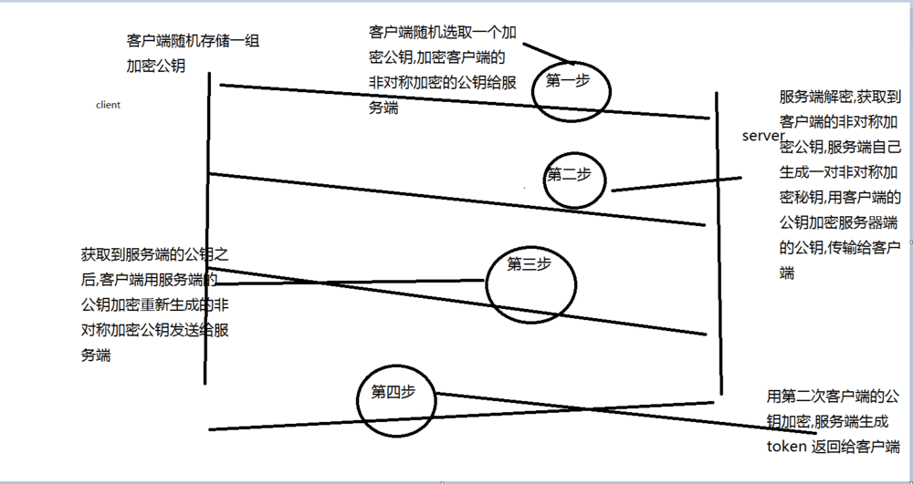

# 如果一个用户的 [token 被其他用户劫持](https://blog.csdn.net/weixin_43644324/article/details/87895729)了，怎样解决这个安全问题

  2019年02月23日 18:56:43           [Askrc](https://me.csdn.net/weixin_43644324)           阅读数：696                   

​                   

a、在存储的时候把 token 进行对称加密存储，用时解开。
 b、将请求 URL、时间戳、token 三者进行**合并加盐/签名**，服务端校验有效性。
 c、**HTTPS** 对 URL 进行判断。

# App token防劫持

1.第一步,2次非对称加密获取token

2.你拿到后，放在你本地或者内存中，每次请求用token+userid+时间戳md5后带过来

3.验签

4.短信验证码

---

#		策[略](https://www.v2ex.com/amp/t/516357/1)

所以 https 加密 + B 端不要忽略 ca 验证就可以了.

再说一句，token 是对称加密，但是加密密钥只在服务器端，只能拦截了模仿，不能伪造。

现在又有关键词可以学习了，https，ca 验证。
ip 地址我倒是有考虑过。

拦截  token 和获取 token 分开讲，https 拦截 token 是不容易的，否则整个 ssl 加密都失去意义了。获取 token  的方式就比较容易，客户端失控模拟真实访问 s 端很难察觉，为了安全可以配合 ip、csrf  这些一起验证，大厂的风控综合计算的参数就更多了，超过风险阙值就会让用户短信验证，或者客户端扫码登录。

liuyanjun0826

@[luosuosile](https://www.v2ex.com/member/luosuosile) 参考 <https://github.com/spacecowboy/Feeder> <https://github.com/DIYgod/RSSHub> 即使用代理证书

----

# JWT 的[token被盗用了](https://bbs.csdn.net/topics/392423499?page=1)怎么防止

wt token被盗没办法，只能等他过期。你可以把token的过期时间弄短些，十几分钟到半小时就行。如果token放在头部，并且用的是https，这样很难被盗。话又说回来，连token都能被盗的用户说明他太傻，肯定乱点不该点的东西  

​	[JWT生成Token做登录校验](https://blog.csdn.net/sky_jiangcheng/article/details/80546370)

---

# app怎样防止[token被盗取](https://zhidao.baidu.com/question/1949510644752274148.html)

 token是个凭条，不过它比门票温柔多了，门票丢了重新花钱买，token丢了重新操作下认证一个就可以了，因此token丢失的代价是可以忍受的——前提是你别丢太频繁，要是让用户[隔三差五](https://www.baidu.com/s?wd=隔三差五&tn=SE_PcZhidaonwhc_ngpagmjz&rsv_dl=gh_pc_zhidao)就认证一次那就损失用户体验了。

客户端方面这个除非你有一个非常安全的办法，比如[操作系统](https://www.baidu.com/s?wd=操作系统&tn=SE_PcZhidaonwhc_ngpagmjz&rsv_dl=gh_pc_zhidao)提供的隐私[数据存储](https://www.baidu.com/s?wd=数据存储&tn=SE_PcZhidaonwhc_ngpagmjz&rsv_dl=gh_pc_zhidao)，那token肯定会存在泄露的问题。比如我拿到你的手机，把你的token拷出来，在过期之前就都可以以你的身份在别的地方登录。
解决这个问题的一个简单办法
1、在存储的时候把token进行[对称加密](https://www.baidu.com/s?wd=对称加密&tn=SE_PcZhidaonwhc_ngpagmjz&rsv_dl=gh_pc_zhidao)存储，用时解开。
2、将请求URL、时间戳、token三者进行合并加盐签名，服务端校验有效性。
这两种办法的出发点都是：窃取你存储的数据较为容易，而反汇编你的程序hack你的加密解密和签名算法是比较难的。然而其实说难也不难，所以终究是防君子不防小人的做法。话说加密存储一个你要是被人扒开客户端看也不会被喷明文存储……
方法1它拿到存储的密文解不开、方法2它不知道你的签名算法和盐，两者可以结合食用。
但是如果token被人拷走，他自然也能植入到自己的手机里面，那到时候他的手机也可以以你的身份来用着，这你就瞎了。
于是可以提供一个让用户可以主动expire一个过去的token类似的机制，在被盗的时候能远程止损。
话说一个人连自己手机都保护不好还谈什么安全……

在网络层面上token明文传输的话会非常的危险，所以建议一定要使用HTTPS，并且把token放在post body里。   

---

# [App token防劫持](https://www.jianshu.com/p/90038e4cd6f6)

​              

​             [wuy](https://www.jianshu.com/u/1b2374be40b6)                          

​                                               2017.10.16 17:40*               字数 69             阅读 890评论 0喜欢 0

2次非对称加密获取token 原理图:

1.第一步,2次非对称加密获取token

2.你拿到后，放在你本地或者内存中，每次请求用token+userid+时间戳md5后带过来

3.验签

4.短信验证码