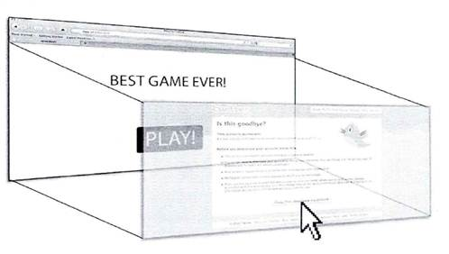
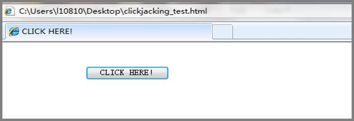
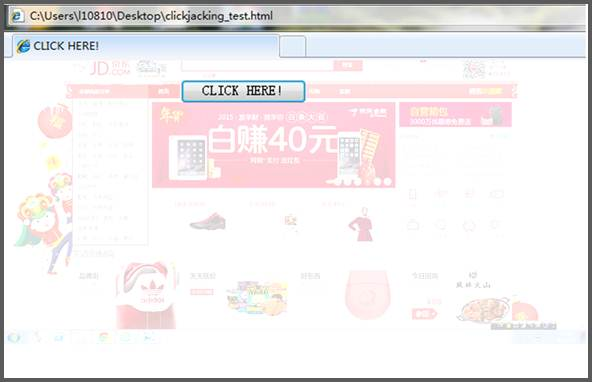

**[点击劫持攻击与防御技术](https://www.jianshu.com/p/251704d8ff18)**

文/H3C攻防团队

​       点击劫持是一种比较常见的基于浏览器的攻击，曾一度备受关注的 Facebook ‘likejacking’ 骗局攻击、Adobe Flash Player 网站漏洞利用、Twitter 的 Don’t click 攻击等，都利用了点击劫持技术。可见点击劫持从未走远，它可能带来的安全问题更加不容小觑。

[转载自：[攻防：点击劫持攻击与防御技术简介](http://www.h3c.com/cn/d_201506/872401_30008_0.htm)

# 一、     什么是点击劫持技术

​    点击劫持 (Clickjacking) 技术又称为界面伪装攻击 (UI redress attack )，是一种视觉上的欺骗手段。攻击者使用一个或多个透明的 iframe 覆盖在一个正常的网页上，然后诱使用户在该网页上进行操作，当用户在不知情的情况下点击透明的 iframe 页面时，用户的操作已经被劫持到攻击者事先设计好的恶意按钮或链接上。攻击者既可以通过点击劫持设计一个独立的恶意网站，执行钓鱼攻击等；也可以与 XSS 和 CSRF 攻击相结合，突破传统的防御措施，提升漏洞的危害程度。

 

# 二、     点击劫持原理及实例

点击劫持漏洞 (Clickjacking) 是由网络安全专家 Robert Hansen 和 Jeremiah Grossman 在 OWASP (Open Web Application Security Project) 会议上提出的，现场还对该漏洞的危害作了演示。第14届Black Hat大会上，安全专家 Paul Stone 讲解了Clickjacking 的拖拽（Drag-and-Drop）技术，这项技术使黑客的攻击手法更加灵活多变，同时能够突破许多传统的安全防御措施，获取更多的用户信息，增加了Clickjacking 漏洞的危害性。

攻击者在点击劫持漏洞利用实现过程中使用 iframe 作为目标网页载体。iframe 是 HTML 标准中的一个标签，可以创建包含另外一个页面的内联框架，在点击劫持漏洞利用中主要用来载入目标网页。点击劫持典型的攻击原理示意图如图1所示：

图1 点击劫持原理示意图

攻击者实施攻击的一般步骤是：

1) 黑客创建一个网页利用iframe包含目标网站； 2)隐藏目标网站，使用户无法察觉到目标网站存在； 3)构造网页，诱骗用户点击特定按钮 (图1中的PLAY!按钮)；4) 用户在不知情的情况下点击按钮，触发执行恶意网页的命令。

**1** **点击劫持利用技术**

比较重要的点击劫持漏洞利用技术包括目标网页隐藏、点击操作劫持、拖拽技术。

l  **目标网页隐藏技术**

​    目标网页隐藏技术原理是攻击者在恶意网站上通过 iframe 载入目标网页，然并隐藏目标网页，欺骗用户点击隐藏的恶意链接。目前主要的网页隐藏技术有两种：CSS隐藏技术和双iframe隐藏技术。

CSS 隐藏技术的原理是利用 CSS 技术控制网页内容显示的效果。其中opacity参数表示元素的透明度，取值范围为0~1，默认值为1表示不透明， 取值为0时元素在网页中完全透明显示。当设置目标 iframe 的opacity 属性小于或等于0.1，用户就无法看到含恶意代码的目标网页。

双iframe隐藏技术使用内联框架和外联框架。内联框架的主要功能是载入目标网页，并将目标网页定位到特定按钮或者链接。外联框架的主要功能是筛选，只显示内联框架中特定的按钮。

l  **点击操作劫持**

在成功隐藏目标网页后，攻击者下一个目标是欺骗用户点击特定的按钮，最简单实用的方法是使用社会工程学。例如，将攻击按钮外观设计成类似QQ消息的提示按钮，诱使用户点击从而触发攻击行为。另外一种思路是使用脚本代码以及其他技术增加用户点击特定按钮的概率。主要方法如JavaScript实现鼠标跟随技术、按键劫持 (Stroke jacking) 技术等。

l  **拖拽（Drag and Drop）技术**

主流的浏览器都有drag-and-drop API 接口，供网站开发人员创建交互式网页。但是，这些 API 接口在设计时没有考虑很多的安全性问题，导致通过拖拽就可以实现跨域操作。利用拖拽技术，攻击者可以突破很多已有的安全防御措施， 

利用拖拽技术，攻击者可以轻易将文本注入到目标网页。在实际实施过程中，攻击者欺骗用户选择输入框的内容，完成拖拽操作。另外一种方式是，通过浏览器的 API 接口将 iframe 中的内容拖拽到目标网页的 text area 中，攻击者就可以获得用户网页中存在的敏感信息。

**2****．点击劫持实例**

以下是一个简单的点击劫持攻击实例：

攻击者构造一个恶意链接诱使用户访问，若用户不慎打开了此链接，用户看到的是正常的页面。此例中制作了一个简单的“CLICK HERE !”，如图2所示：

图2 攻击者构造的恶意网页（opacity值为0）

实际上这个页面是由两个 iframe 嵌套而成，用户看到的是一个正常的页面。实则在其表面，覆盖了一个恶意链接的页面，click here按键的操作也相应的落在了这个恶意的页面上，对于整个过程，用户全然不知。

攻击者是怎样把这个恶意页面隐藏起来的呢？这主要是通过设置 CSS 中 div 元素的不透明度来实现的，在 CSS 中声明 opacity 用来设置一个元素的透明度。现在主流的浏览器都支持opacity属性，取值为由浮点数字和单位标识符组成，不可为负。Opacity 取值为1的元素是完全不透明的，反之取值为0时为全透明，即用户是看不见的。攻击者正是利用了opacity为0来隐藏了这个页面。

接下来，我们不妨把 opacity 值改为0.5，即设置表面的 iframe 为半透明，是不是就可以看见攻击者想要隐藏的那部分内容呢？结果如大家所料，我们就能够隐约看见被攻击者隐藏的iframe。如图3：

图3 攻击者构造的恶意网页（opacity值为0.5）

​    可以看出，在button上面其实覆盖了一个钓鱼网站，在不经意间，用户就已经落入攻击者制作的陷阱，被劫持到一个虚假的购物网站中。

# 三、     点击劫持与其他漏洞的结合技术

点击劫持技术如果结合其他漏洞进行攻击，将突破某些安全措施，实现更大范围的攻击。

**1** **结合 CSRF 漏洞**

CSRF (Cross-Site Request Forgery CSRF)是指跨站点请求伪造漏洞，目前广泛使用的CSRF漏洞防御技术是 token 识别技术。token 是网站给每一次 HTTP 连接分配的随机数，用来标识不同的用户身份。对于网站开发人员，最方便实用的方法是将 token 存储在页面隐藏的表单中，最终跟随信息共同提交到服务器端。服务器检查该参数，判断用户身份的真实性。因此成功实施 CSRF 攻击的关键因素是正确获取 token 值，攻击者需要将载入目标网页 iframe 中 token 自动添加到 src 属性后面。使用HTTP “GET”方法的表单会自动完成上述步骤，实现攻击WEB应用程序。Twitter 蠕虫攻击就是利用点击劫持漏洞来实现CSRF攻击。

**2** **结合 XSS 漏洞**

Clickjacking 和反射型 XSS (跨站点脚本漏洞) 结合，转变为存储型 XSS 漏洞。反射型 XSS 漏洞最重要的特征是难于利用。通过 Clickjacking 漏洞，反射型 XSS 可以转化为存储型 XSS 漏洞，只要用户点击触发此漏洞，就可以在用户浏览器上执行任意的JavaScript 代码，因此具有极大的危害性。

# 四、     点击劫持漏洞的防御

点击劫持漏洞防御措施可以从两个方面考虑：服务器端防御和客户端防御。服务器端防御主要涉及到用户身份验证，客户端防御主要涉及到浏览器的安全。

**1** **服务器端防御**

服务器端防御点击劫持漏洞的思想是结合浏览器的安全机制进行防御，主要的防御方法介绍如下。

l  X-FRAME-OPTIONS 机制

在微软发布新一代的浏览器Internet Explorer 8.0中首次提出全新的安全机制：X-FRAME-OPTIONS。该机制有两个选项：DENY 和 SAMEORIGIN。DENY表示任何网页都不能使用 iframe 载入该网页，SAMEORIGIN表示符合同源策略的网页可以使用 iframe载入该网页。如果浏览器使用了这个安全机制，在网站发现可疑行为时，会提示用户正在浏览 网页存在安全隐患，并建议用户在新窗口中打开。这样攻击者就无法通过 iframe 隐藏目标的网页。

l  使用 FrameBusting 代码

点击劫持攻击需要首先将目标网站载入到恶意网站中，使用 iframe 载入网页是最有效的方法。Web安全研究人员针对 iframe 特性提出 Frame Busting 代码，使用 JavaScript 脚本阻止恶意网站载入网页。如果检测到网页被非法网页载入，就执行自动跳转功能。Frame Busting代码是一种有效防御网站被攻击者恶意载入的方法，网站开发人员使用Frame Busting代码阻止页面被非法载入。需要指出的情况是，如果用户浏览器禁用JavaScript脚本，那么FrameBusting代码也无法正常运行。所以，该类代码只能提供部分保障功能。

l  使用认证码认证用户

点击劫持漏洞通过伪造网站界面进行攻击，网站开发人员可以通过认证码识别用户，确定是用户发出的点击命令才执行相应操作。识别用户的方法中最有效的方法是认证码认证。例如，在网站上广泛存在的发帖认证码，要求用户输入图形中的字符，输入某些图形的特征等。

**2** **客户端防御**

由于点击劫持攻击的代码在客户端执行，因此客户端有很多机制可以防御此漏洞。

l  升级浏览器

最新版本的浏览器提供很多防御点击劫持漏洞的安全机制，对于普通的互联网用户，经常更新修复浏览器的安全漏洞，能够最有效的防止恶意攻击。

l  NoScript 扩展

对于Firefox的用户，使用 NoScript 扩展能够在一定程度上检测和阻止点击劫持攻击。利用 NoScript 中 ClearClick 组件能够检测和警告潜在的点击劫持攻击，自动检测页面中可能不安全的页面。

# 五、     结束语

互联网行业的快速发展带来了越来越多的安全性问题，同时也给用户数据和信息带来巨大的威胁。点击劫持漏洞也会随着社交网站和移动互联网的发展，越来越多的被关注，如果利用点击劫持漏洞与其它已有的 Web 漏洞相结合，会产生更大的危害性，也是需要安全研究人员要进一步研究的问题。

转载自：[攻防：点击劫持攻击与防御技术简介](http://www.h3c.com.cn/About_H3C/Company_Publication/IP_Lh/2015/02/Home/Catalog/201506/872401_30008_0.htm)

# 六、推荐资料

[基于HTML5的Web前端安全性研究](https://www.xzbu.com/8/view-11236728.htm)

web安全相关书籍：
 1、[白帽子讲Web安全](https://book.douban.com/subject/10546925/)