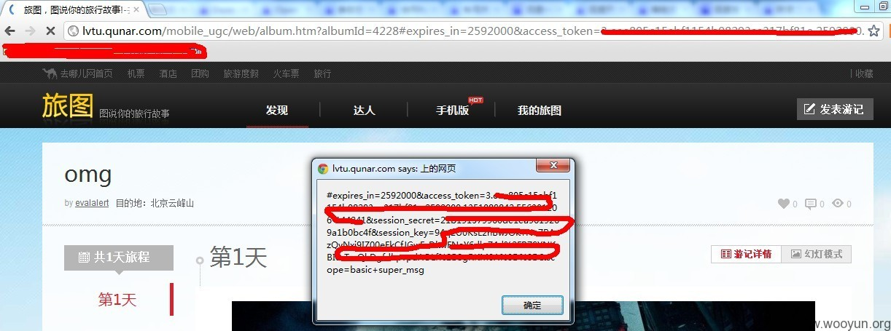

# 百度开放平台oauth授权接口可以劫持access_token

   					[漏洞](https://www.secpulse.com/archives/category/vul)   					               [Chloe O_o](https://www.secpulse.com/newpage/author?author_id=425)   						  					   				

   					   					2015-05-17   					   					2,576   				

| 漏洞标题 | 百度开放平台oauth授权接口可以劫持access_token |
| -------- | --------------------------------------------- |
| 相关厂商 | 百度                                          |
| 漏洞作者 | 心伤的胖子                                    |
| 提交时间 | 2012-09-25 10:05                              |
| 公开时间 | 2012-11-09 10:06                              |
| 漏洞类型 | 设计缺陷/逻辑错误                             |
| 危害等级 | 高                                            |
| 自评Rank | 15                                            |
| 漏洞状态 | 厂商已经确认                                  |
| Tags标签 |                                               |

## 漏洞详情

详细的步骤如下：

1、结合 [WooYun: 去哪儿一处存储型XSS漏洞](http://www.wooyun.org/bugs/wooyun-2012-012682) 这个漏洞（应该审核通过了吧）

2、百度账号可以登录qunar网站，通过百度账号连接服务

3、授权模式中的Implicit grant模式只需要client_id和redirect_uri就可以完成账号的授权流程，从而把获取到的access_token返回到redirect_uri页面中

4、构造如下的URL：

http://openapi.baidu.com/oauth/2.0/authorize?scope=super_msg&response_type=token&client_id=RCKbWANx8KewnXs9rwGWFtZV&redirect_uri=http://lvtu.qunar.com/mobile_ugc/web/album.htm?albumId=4228

client_id为qunar网的百度应用ID

redirect_uri为获取access_token后的回调地址

response_type=token是采用Implicit grant授权模式

scope为申请的权限

5、可以把该地址发给他人诱使别人连接，最方便的利用是结合点击劫持来让用户完成授权流程。从而劫持到用户的access_token

6、获取到的token可以利用api接口来操作该账号（百度的api少的可怜）。 

## 漏洞证明：

下面图是劫持后的。

 

## 修复方案：

1、最好是严格限制redirect_uri，我知道很难。

2、可以在授权页面加入放点击劫持代码，降低风险 

## 版权声明：转载请注明来源 [心伤的胖子](http://www.wooyun.org/whitehats/心伤的胖子)@[乌云](http://www.wooyun.org/bugs/wooyun-2010-012683)