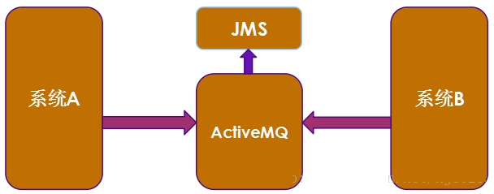
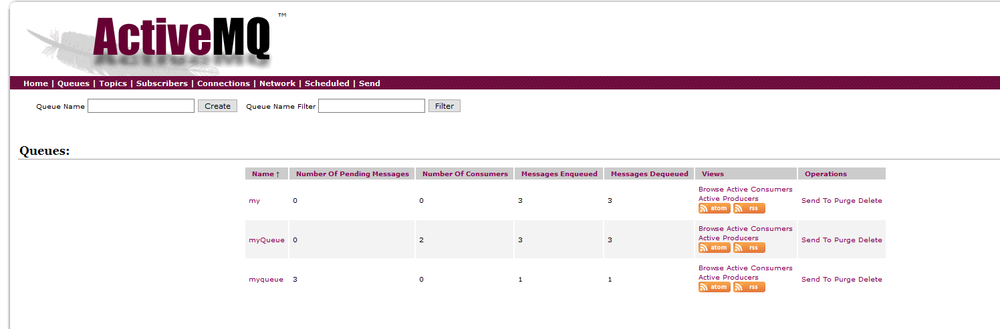
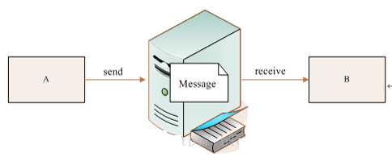
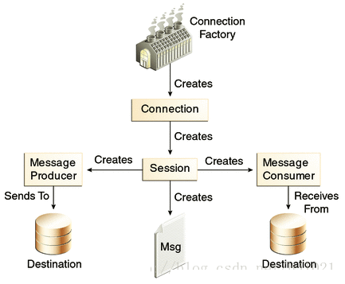
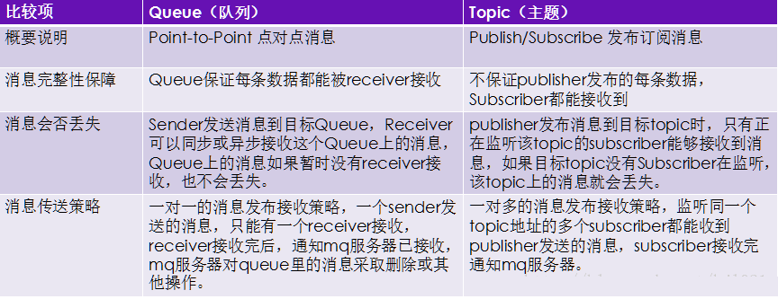
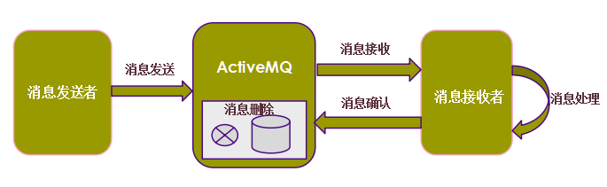
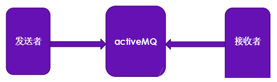
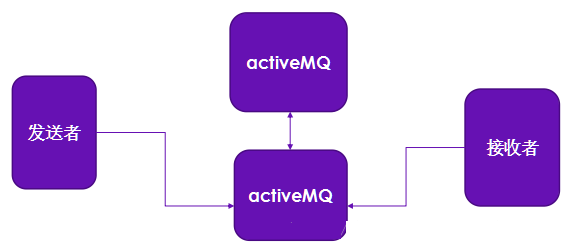

http://www.uml.org.cn/zjjs/201802111.asp

 ###		ActiveMQ---知识点整理                       
 17781 次浏览                    评价： [好](http://www.uml.org.cn/inc/pf.asp?Rating=3&act=show&id=20435)               [中](http://www.uml.org.cn/inc/pf.asp?Rating=2&act=show&id=20435)               [差](http://www.uml.org.cn/inc/pf.asp?Rating=1&act=show&id=20435)                                                2018-2-11  **编辑推荐:**本文来自于csdn，文章通过介绍ActiveMQ的安装，使用，搭建等等，简单整理了ActiveMQ。一.背景介绍1.1 java消息服务:不同系统之间的信息交换，是我们开发中比较常见的场景，比如系统A要把数据发送给系统B，这个问题我们应该如何去处理？                              1999年，原来的SUN公司领衔提出了一种面向消息的中间件服务--JMS规范（标准）；常用的几种信息交互技术(httpClient、hessian、dubbo、jms、webservice                              五种).1.2JMS概述:JMS即Java消息服务（Java Message Service的简称），是Java EE 的标准/规范之一。这种规范（标准）指出：消息的发送应该是异步的、非阻塞的。也就是说消息的发送者发送完消息后就直接返回了，不需要等待接收者返回后才能返回，发送者和接收者可以说是互不影响。所以这种规范（标准）能够减轻或消除系统瓶颈，实现系统之间去除耦合，提高系统的整体可伸缩性和灵活性。JMS只是Java                             EE中定义的一组标准API，它自身并不是一个消息服务系统，它是消息传送服务的一个抽象，也就是说它定义了消息传送的接口而并没有具体实现。1.3ActiveMQ概述:我们知道JMS只是消息服务的一组规范和接口，并没有具体的实现，而ActiveMQ就是JMS规范的具体实现；它是Apache下的一个项目，采用Java语言开发；是一款非常流行的开源消息服务器.1.4 ActiveMQ与JMS关系:我们知道，JMS只是定义了一组有关消息传送的规范和标准，并没有真正实现，也就说JMS只是定义了一组接口而已；就像JDBC抽象了关系数据库访问、JPA抽象了对象与关系数据库映射、JNDI抽象了命名目录服务访问一样，JMS具体的实现由不同的消息中间件厂商提供，比如Apache                             ActiveMQ就是JMS规范的具体实现，Apache ActiveMQ才是一个消息服务系统，而JMS不是。                            二.ActiveMQ的使用2.1 ActiveMQ环境搭建:1.ActiveMQ运行需要Java的支持，首先需要配置Java环境变量；3.切换到解压后的activemq的bin目录下 cd / usr                             / local / apache - activemq - 5.15.2 去启动3.切换到bin目录下，启动：./activemq start ;关闭：                              . / activemq stop 4.启动后有两个端口号，一个是web控制台:8161，一个是消息服务broker连接端口：61616 5.web管理控制台admin URL地址：http : // localhost                             : 8161 默认登录账号 admin 密码 admin，注意：Linux防火前要关闭 ;通过这个地址可以即时访问交互信息.如下图:消息服务broker URL地址 : tcp : // localhost : 61616                            2.2 Java消息队列JMS整体设计结构2.2.1 基本要素:1、生产者producer ; 2、消费者consumer                             ; 3、消息服务broker                            2.2.1 交互模型:2.2.3 JMS两种消息传送模式                            点对点（ Point-to-Point）：专门用于使用队列Queue传送消息；基于队列Queue的点对点消息只能被一个消费者消费，如多个消费者都注册到同一个消息队列上，当生产者发送一条消息后，而只有其中一个消费者会接收到该消息，而不是所有消费者都能接收到该消息。                            发布/订阅（Publish/Subscribe）：专门用于使用主题Topic传送消息。基于主题的发布与订阅消息能被多个消费者消费，生产者发送的消息，所有订阅了该topic的消费者都能接收到。2.3 Java消息队列JMS API总体概览:2.3.1JMS API 概览JMS API可以分为3个主要部分：1、公共API：可用于向一个队列或主题发送消息或从其中接收消息；2、点对点API：专门用于使用队列Queue传送消息；3、发布/订阅API：专门用于使用主题Topic传送消息。JMS公共API:在JMS公共API内部，和发送与接收消息有关的JMS API接口主要是：ConnectionFactory                             / Connection / Session / Message / Destination / MessageProducer                             / MessageConsumer . 它们的关系是：一旦有了ConnectionFactory，就可以创建Connection，一旦有了Connection，就可以创建Session，而一旦有了Session，就可以创建                              Message 、MessageProducer 和 MessageConsumer 。JMS点对点API:点对点（p2p）消息传送模型API是指JMS API之内基于队列（Queue）的接口：QueueConnectionFactory                             / QueueConnection / QueueSession / Message / Queue                             / QueueSender / QueueReceiver .从接口的命名可以看出，大多数接口名称仅仅是在公共API接口                            名称之前添加Queue一词。一般来说，使用点对点消息传送模型的应用程序将使用基于队列的API，而不使用公共API                              。JMS发布/订阅API:发布/订阅消息传送模型API是指JMS API之内基于主题（Topic）的接口：TopicConnectionFactory                             / TopicConnection / TopicSession / Message / Topic /                             TopicPublisher / TopicSubscriber . 由于基于主题（Topic）的JMS                             API类似于基于队列（Queue） 的API，因此在大多数情况下，Queue这个词会由Topic取代。2.4 ActiveMQ点对点发送与接收消息示例2.4.1 简单示例:写一个采用Queue队列方式点对点发送接收文本信息的Demo,先写发送者,如下:package                                   com.kinglong.activemq.queue; 
                                  import org.apache.activemq.ActiveMQConnectionFactory;                                    
                                  import javax.jms.*; 
                                  /** 
                                  * 消息发送者 
* 
                                  */ 
public class Sender { 
                                  /**消息服务器的连接地址**/ 
public static final String BROKER_URL = "tcp://192.168.174.129:61616";                                    
                                  public static void main(String[] args) { 
                                  Sender sender = new Sender(); 
                                  sender.sendMessage("Hello ActiveMQ.");                                    
                                  } 
                                  /** 
                                  * 发送消息 
* 
                                  * @param msg 
                                  */ 
                                  public void sendMessage (String msg) { 
                                  Connection connection = null; 
                                  Session session = null; 
                                  MessageProducer messageProducer = null; 
                                  try { 
                                  //1.创建一个连接工厂 
ConnectionFactory connectionFactory = new ActiveMQConnectionFactory(BROKER_URL);                                    
                                  //2.创建一个连接 
connection = connectionFactory.createConnection();                                    
                                  //3.创建一个Session 
                                  session = connection.createSession(Boolean.FALSE,                                   Session.AUTO_ACKNOWLEDGE); 
                                  //4.创建消息，此处创建了一个文本消息 
Message message = session.createTextMessage(msg);                                    
                                  //5.创建一个目的地 
Destination destination = session.createQueue("myQueue");                                    
                                  //6.创建一个消息的生产者（发送者） 
messageProducer = session.createProducer(destination);                                    
                                  //7.发送消息 
messageProducer.send(message); 
                                  } catch (JMSException e) { 
                                  e.printStackTrace(); 
                                  } finally { 
                                  try { 
                                  //关闭连接释放资源 
if (null != messageProducer) { 
                                  messageProducer.close(); 
                                  } 
                                  if (null != session) { 
                                  session.close(); 
                                  } 
                                  if (null != connection) { 
                                  connection.close(); 
                                  } 
                                  } catch (JMSException e) { 
                                  e.printStackTrace(); 
                                  } 
                                  } 
                                  } 
                                  } 再写接收者:package                                   com.kinglong.activemq.queue; 
                                  import org.apache.activemq.ActiveMQConnectionFactory;                                    
                                  import javax.jms.*; 
                                  public class Receiver { 
                                  /**消息服务器的连接地址**/ 
public static final String BROKER_URL = "tcp://192.168.174.129:61616";                                    
                                  public static void main(String[] args) { 
                                  Receiver receiver = new Receiver(); 
                                  receiver.receiveMessage(); 
                                  } 
                                  /** 
                                  * 接收消息 
* 
                                  */ 
public void receiveMessage () { 
                                  Connection connection = null; 
                                  Session session = null; 
                                  MessageConsumer messageConsumer = null; 
                                  try { 
                                  //1.创建一个连接工厂 
ConnectionFactory connectionFactory = new ActiveMQConnectionFactory(BROKER_URL);                                    
                                  //2.创建一个连接 
connection = connectionFactory.createConnection();                                    
                                  //3.创建一个Session 
                                  session = connection.createSession(Boolean.FALSE,                                   Session.AUTO_ACKNOWLEDGE); 
                                  //4.创建一个目的地 
Destination destination = session.createQueue("myQueue");                                    
                                  //5.创建一个消息的消费者（接收者） 
messageConsumer = session.createConsumer(destination);                                    
                                  //接收消息之前，需要把连接启动一下 
connection.start(); 
                                  //6.接收消息 
Message message = messageConsumer.receive();                                    
                                  //判断消息的类型 
if (message instanceof TextMessage) { //判断是否是文本消息                                    
String text = ((TextMessage) message).getText();                                    
                                  System.out.println("接收到的消息内容是：" +                                    text); 
                                  } 
                                  } catch (JMSException e) { 
                                  e.printStackTrace(); 
                                  } finally { 
                                  try { 
                                  //关闭连接释放资源 
if (null != messageConsumer) { 
                                  messageConsumer.close(); 
                                  } 
                                  if (null != session) { 
                                  session.close(); 
                                  } 
                                  if (null != connection) { 
                                  connection.close(); 
                                  } 
                                  } catch (JMSException e) { 
                                  e.printStackTrace(); 
                                  } 
                                  } 
                                  } 
                                  } 总结:创建过程中有几个重要的注意点,说明一下:1.                                   session = connection.createSession(Boolean.FALSE,                                   Session.AUTO_ACKNOWLEDGE); 
                                  // 其中:Boolean.FALSE表示本次会话不开启事务管理,假如需要开启事务管理,将其改为Boolean.TRUE即可                                    
//同时需要在发送消息后添加session.commit(),否则,消息是不会被提交的.                                    
                                  //Session.AUTO_ACKNOWLEDGE表示消息确认机制 
AUTO_ACKNOWLEDGE:自动确认 
CLIENT_ACKNOWLEDGE:客户端确认 
SESSION_TRANSACTED:事务确认,如果使用事务推荐使用该确认机制 
AUTO_ACKNOWLEDGE:懒散式确认,消息偶尔不会被确认,也就是消息可能会被重复发送.但发生的概率很小                                    
2. connection.start(); 
                                  //在消息接收端,接受消息前需要加入这段代码,开启连接,否则一样无法获取消息. 
3. Destination destination = session.createQueue("myQueue");                                    
                                  //创建目的地时,如果做测试收不到信息,可以将目的地名称修改一下,我用的是IDEA,不清楚为何,                                    
                                  //有时候收不到信息,修改一下就好了,猜测可能是缓存的原因吧 发布与订阅的topic方式实际与点对点的queue方式,代码通用很多,只是在创建目的地Destination时候创建为Destination                                   destination = session.createTopic("myTopic 2.4.2Queue与Topic比较2.4.3拉模式与推模式a.点对点消息，如果没有消费者在监听队列，消息将保留在队列中，直至消息消费者连接到队列为止。这种消息传递模型是                            传统意义上的懒模型或轮询模型。在此模型中，消息不是自动推动给消息消费者的，而是要由消息消费者从队列中请求获得(拉模式)。                              b.pub/sub消息传递模型基本上是一个推模型。在该模型中，消息会自动广播，消息消费者无须通过主动请求或轮询主题的方法来获得新的消息。2.5 ActiveMQ消息类型1、TextMessage 文本消息：携带一个java.lang.String作为有效数据(负载)的消息，可用于字符串类型的信息交换；2、ObjectMessage 对象消息：携带一个可以序列化的Java对象作为有效负载的消息，可用于Java对象类型的信息交换；3、MapMessage 映射消息：携带一组键值对的数据作为有效负载的消息，有效数据值必须是Java原始数据类型（或者它们的包装类）及String。即：byte                             , short , int , long , float , double , char , boolean                             , String                            4、BytesMessage 字节消息 ：携带一组原始数据类型的字节流作为有效负载的消息；5、StreamMessage 流消息：携带一个原始数据类型流作为有效负载的消息，它保持了写入流时的数据类型，写入什么类型，                            则读取也需要是相同的类型；                            需要注意的是:如果使用对象消息做Demo时,如果使用之前的连接创建方式可能会无法接收到消息,因为安全问题.所以,如果想要使用Demo测试对象消息,创建连接时建议改为这样(官网推荐的连接方式)://创建对象消息连接工厂                                    
ActiveMQConnectionFactory activeMQConnectionFactory                                   = new ActiveMQConnectionFactory(BROKER_URL);                                    
                                  List<String > list = new ArrayList<String>();                                    
                                  list.add("com.kinglong.activemq.receiver");                                    
                                  list.add("com.kinglong.activemq.model");                                    
                                  activeMQConnectionFactory.setTrustedPackages(list);                                                              2.6 ActiveMQ事务消息和非事务消息                            消息分为事务消息和非事务消息1、事务消息：创建会话Session使用transacted=trueconnection.createSession(Boolean.TRUE,                                   Session.AUTO_ACKNOWLEDGE);2、非事务消息：创建会话Session使用transacted=false                                   connection.createSession(Boolean.FALSE, Session.AUTO_ACKNOWLEDGE);事务消息必须在发送和接收完消息后显式地调用session.commit();事务性消息，不管设置何种消息确认模式，都会自动被确认；与设置的确认机制无关,但官方推荐事务性消息使用事务确认机制.2.7 ActiveMQ消息确认机制 消息只有在被确认之后，才认为已经被成功消费，然后消息才会从队列或主题中删除。消息的成功消费通常包含三个阶段：(1)、客户接收消息；(2)、客户处理消息;(3)、消息被确认；                            确认机制前面提过一下,共有四种:                            (1)、Session.AUTO_ACKNOWLEDGE；客户（消费者）成功从receive方法返回时，或者从MessageListener.onMessage方法成功返回时，会话自动确认消息,然后自动删除消息.                            (2)、Session.CLIENT_ACKNOWLEDGE；客户通过显式调用消息的acknowledge方法确认消息,。                             即在接收端调用message.acknowledge();方法,否则,消息是不会被删除的.                            (3)、Session. DUPS_OK_ACKNOWLEDGE ；不是必须确认，是一种“懒散的”消息确认，消息可能会重复发送，在第二次重新传送消息时，消息头的JMSRedelivered会被置为true标识当前消息已经传送过一次，客户端需要进行消息的重复处理控制。(4)、 Session.SESSION_TRANSACTED；事务提交并确认。2.8 ActiveMQ持久化消息与非持久化消息messageProducer.setDeliveryMode(DeliveryMode.                                   NON_PERSISTENT);//不持久化
messageProducer.setDeliveryMode(DeliveryMode.PERSISTENT);//持久化的，当然activemq发送消息默认都是持久化的说明:设置完后,如果为持久化,那么消息在没有被消费前都会被写入本地磁盘kahadb文件中保存起来,即使服务器宕机,也不会影响                            消息.如果是非持久化的,那么,服务一旦宕机之类的情况发生,消息即会被删除.ActiveMQ默认是持久化的.2.9 ActiveMQ消息过滤ActiveMQ提供了一种机制，可根据消息选择器中的标准来执行消息过滤，只接收符合过滤标准的消息；                            生产者可在消息中放入特有的标志，而消费者使用基于这些特定的标志来接收消息；1、发送消息放入特殊标志：message . setString Property ( name                             , value ) ;2、接收消息使用基于特殊标志的消息选择器:MessageConsumer                                   createConsumer(Destination destination, String                                   messageSelector);注：消息选择器是一个字符串，语法与数据库的SQL相似，相当于SQL语句where条件后面的内容；具体代码如下:发送端代码:package                                   com.bjpowernode.activemq.selector; 
                                  import org.apache.activemq.ActiveMQConnectionFactory;                                    
                                  import javax.jms.*; 
                                  /** 
                                  * 消息发送者 
* 
                                  */ 
public class Sender { 
                                  /**消息服务器的连接地址**/ 
public static final String BROKER_URL = "tcp://192.168.174.129:61616";                                    
                                  public static void main(String[] args) { 
                                  Sender sender = new Sender(); 
                                  sender.sendMessage("Hello ActiveMQ.");                                    
                                  } 
                                  /** 
                                  * 发送消息 
* 
                                  * @param msg 
                                  */ 
                                  public void sendMessage (String msg) { 
                                  Connection connection = null; 
                                  Session session = null; 
                                  MessageProducer messageProducer = null; 
                                  try { 
                                  //1.创建一个连接工厂 
ConnectionFactory connectionFactory = new ActiveMQConnectionFactory(BROKER_URL);                                    
                                  //2.创建一个连接 
connection = connectionFactory.createConnection();                                    
                                  //3.创建一个Session 
                                  session = connection.createSession(Boolean.FALSE,                                   Session.AUTO_ACKNOWLEDGE); 
                                  //5.创建一个目的地 
Destination destination = session.createQueue("myQueue");                                    
                                  //6.创建一个消息的生产者（发送者） 
messageProducer = session.createProducer(destination); 
                                  //设置发送的消息是否需要持久化 
messageProducer.setDeliveryMode(DeliveryMode.NON_PERSISTENT);//这里使用不持久化                                    
//创建一个循环,测试消息标识的使用 
for (int i=0; i<20; i++) { 
                                  //4.创建消息，此处创建了一个文本消息 
Message message = session.createTextMessage(msg+i);                                    
                                  //将消息设置一个特有的标识 
message.setIntProperty("id", i); 
                                  //7.发送消息 
messageProducer.send(message); 
                                  } 
                                  } catch (JMSException e) { 
                                  e.printStackTrace(); 
                                  } finally { 
                                  try { 
                                  //关闭连接释放资源 
if (null != messageProducer) { 
                                  messageProducer.close(); 
                                  } 
                                  if (null != session) { 
                                  session.close(); 
                                  } 
                                  if (null != connection) { 
                                  connection.close(); 
                                  } 
                                  } catch (JMSException e) { 
                                  e.printStackTrace(); 
                                  } 
                                  } 
                                  } 
                                  } 接收端代码:package                                   com.bjpowernode.activemq.selector; 
                                  import org.apache.activemq.ActiveMQConnectionFactory;                                    
                                  import javax.jms.*; 
                                  public class Receiver { 
                                  /**消息服务器的连接地址**/ 
public static final String BROKER_URL = "tcp://192.168.174.129:61616";                                    
                                  public static void main(String[] args) { 
                                  Receiver receiver = new Receiver(); 
                                  receiver.receiveMessage(); 
                                  } 
                                  /** 
                                  * 接收消息 
* 
                                  */ 
public void receiveMessage () { 
                                  Connection connection = null; 
                                  Session session = null; 
                                  MessageConsumer messageConsumer = null; 
                                  try { 
                                  //1.创建一个连接工厂 
ConnectionFactory connectionFactory = new ActiveMQConnectionFactory(BROKER_URL);                                    
                                  //2.创建一个连接 
connection = connectionFactory.createConnection();                                    
                                  //3.创建一个Session 
                                  session = connection.createSession(Boolean.FALSE,                                   Session.AUTO_ACKNOWLEDGE); 
                                  //4.创建一个目的地 
Destination destination = session.createQueue("myQueue");                                    
                                  //5.创建一个消息的消费者（接收者）,selector即为消息选择器,通过选择需要的标识,过滤消息接受id为10-15之                                    //间的消息 
String selector = "id >=10 and id<=15";                                    
                                  messageConsumer = session.createConsumer(destination, selector);                                    
                                  //接收消息之前，需要把连接启动一下 
connection.start(); 
                                  while (true) { 
                                  //6.接收消息 同步接收 
Message message = messageConsumer.receive(); 
                                  //判断消息的类型 
if (message instanceof TextMessage) { //判断是否是文本消息 
String text = ((TextMessage) message).getText();                                    
                                  System.out.println("接收到的消息内容是：" +                                    text); 
                                  } 
                                  } 
                                  } catch (JMSException e) { 
                                  e.printStackTrace(); 
                                  } finally { 
                                  try { 
                                  //关闭连接释放资源 
if (null != messageConsumer) { 
                                  messageConsumer.close(); 
                                  } 
                                  if (null != session) { 
                                  session.close(); 
                                  } 
                                  if (null != connection) { 
                                  connection.close(); 
                                  } 
                                  } catch (JMSException e) { 
                                  e.printStackTrace(); 
                                  } 
                                  } 
                                  } 
                                  }                             2.10 ActiveMQ消息接收方式                            同步接收:receive()方法接收消息叫同步接收,就是之前的Demo代码使用的接收方式.在不使用循环方法时接收端代码执行                            一次即结束.异步接收:使用监听器接收消息，这种接收方式叫异步接收,接收端会一直处于监听状态,只要有消息产生,即会接收消息.下面是异步接收代码:package                                   com.bjpowernode.activemq.listener; 
                                  import org.apache.activemq.ActiveMQConnectionFactory;                                    
                                  import javax.jms.*; 
                                  public class Receiver { 
                                  /**消息服务器的连接地址**/ 
public static final String BROKER_URL = "tcp://192.168.174.129:61616";                                    
                                  public static void main(String[] args) { 
                                  Receiver receiver = new Receiver(); 
                                  receiver.receiveMessage(); 
                                  } 
                                  /** 
                                  * 接收消息 
* 
                                  */ 
public void receiveMessage () { 
                                  Connection connection = null; 
                                  Session session = null; 
                                  MessageConsumer messageConsumer = null; 
                                  try { 
                                  //1.创建一个连接工厂 
ConnectionFactory connectionFactory = new ActiveMQConnectionFactory(BROKER_URL);                                    
                                  //2.创建一个连接 
connection = connectionFactory.createConnection();                                    
                                  //3.创建一个Session 
                                  session = connection.createSession(Boolean.FALSE,                                   Session.AUTO_ACKNOWLEDGE); 
                                  //4.创建一个目的地 
Destination destination = session.createQueue("myQueue");                                    
                                  //5.创建一个消息的消费者（接收者） 
messageConsumer = session.createConsumer(destination);                                    
                                  //接收消息之前，需要把连接启动一下 
connection.start(); 
                                  //6.接收消息 同步接收 
//Message message = messageConsumer.receive();                                    
                                  //异步接收，使用监听器接收消息 
messageConsumer.setMessageListener(new MessageListener(){                                    
                                  public void onMessage(Message message) { 
                                  //判断消息的类型 
if (message instanceof TextMessage) { //判断是否是文本消息                                    
String text = null; 
                                  try { 
                                  text = ((TextMessage) message).getText(); 
                                  } catch (JMSException e) { 
                                  e.printStackTrace(); 
                                  } 
                                  System.out.println("接收到的消息内容是：" +                                    text); 
                                  } 
                                  } 
                                  }); 
                                  } catch (JMSException e) { 
                                  e.printStackTrace(); 
                                  } finally { 
                                  /*try { 
                                  //关闭连接释放资源 
if (null != messageConsumer) { 
                                  messageConsumer.close(); 
                                  } 
                                  if (null != session) { 
                                  session.close(); 
                                  } 
                                  if (null != connection) { 
                                  connection.close(); 
                                  } 
                                  } catch (JMSException e) { 
                                  e.printStackTrace(); 
                                  }*/ 
                                  } 
                                  } 
                                  } 三.ActiveMQ的集成使用:3.1ActiveMQ与Spring集成(以下是一个简单的上手Demo):鉴于发送端与接收端pom文件依赖相同,所以只写一份,依赖如下:[html]                                   view plain copy
                                  <!--spring-jms依赖--> 
                                  < dependency> 
                                  <groupId>org.springframework</groupId>                                    
                                  <artifactId>spring-jms</artifactId>                                    
                                  <version>4.3.13.RELEASE</version>                                    
                                  </dependency> 
                                  <!--activemq的jar依赖--> 
                                  < dependency> 
                                  <groupId>org.apache.activemq</groupId>                                    
                                  <artifactId>activemq-client</artifactId>                                    
                                  <version>5.15.2</version> 
                                  </dependency> 
                                  <!-- JMS规范的jar依赖 --> 
                                  < dependency> 
                                  <groupId>javax.jms</groupId> 
                                  <artifactId>javax.jms-api</artifactId>                                    
                                  <version>2.0.1</version> 
                                  </dependency> 
发送端:(需要两个配置文件)1. applicationContext.xml<?xml                                   version="1.0" encoding="UTF-8"?>                                    
                                  <beans xmlns="http://www.springframework.org/schema/beans"                                    
                                  xmlns:xsi="http://www.w3.org/2001/XMLSchema-instance"                                    
                                  xsi:schemaLocation="http://www.springframework.org/schema/beans                                   http://www.springframework.org/schema/beans/spring-beans.xsd">                                    
                                  <import resource="applicationContext-jms.xml"/>                                    
                                  </beans>                             2. applicationContext-jms.xml<?xml                                   version="1.0" encoding="UTF-8"?>                                    
                                  <beans xmlns="http://www.springframework.org/schema/beans"                                    
                                  xmlns:xsi="http://www.w3.org/2001/XMLSchema-instance"                                    
                                  xmlns:context="http://www.springframework.org/schema/context"                                    
                                  xsi:schemaLocation="http://www.springframework.org/schema/beans                                   http://www.springframework.org/schema/beans/spring-beans.xsd                                   http://www.springframework.org/schema/context                                   http://www.springframework.org/schema/context/spring-context.xsd">                                    
                                  <context:component-scan base-package="com.kinglong.activemq.sender"/>                                    
                                  <!-- 配置一个连接工厂 --> 
                                  < bean id="connectionFactory" class="org.apache.activemq.ActiveMQConnectionFactory">                                    
                                  <property name="brokerURL" value="tcp://192.168.174.129:61616"/>                                    
                                  </bean> 
                                  <!-- 配置JmsTemplate --> 
                                  < bean id="jmsTemplate" class="org.springframework.jms.core.JmsTemplate">                                    
                                  <property name="connectionFactory"                                   ref="connectionFactory" />                                    
                                  <property name="defaultDestinationName"                                  value="springTopic"                                   /> 
                                  <!--指定消息传送模式，true表示发布订阅、false表示点对点-->                                   
                                  < property name="pubSubDomain" value="true"/>                                    
                                  </bean> 
                                  </beans> 发送类:package                                   com.kinglong.activemq.sender; 
                                  import org.springframework.beans.factory.annotation.Autowired; 
                                  import org.springframework.jms.core.JmsTemplate; 
                                  import org.springframework.jms.core.MessageCreator;                                    
                                  import org.springframework.stereotype.Component;                                    
                                  import javax.jms.JMSException; 
                                  import javax.jms.Message; 
                                  import javax.jms.Session; 
                                  @Component 
                                  public class Sender { 
                                  @Autowired 
                                  private JmsTemplate jmsTemplate; 
                                  public void sendMessage (final String msg) {                                    
                                  //发送消息 
jmsTemplate.send(new MessageCreator() { 
                                  public Message createMessage(Session session) throws                                   JMSException { 
                                  return session.createTextMessage(msg); 
                                  } 
                                  }); 
                                  } 
                                  } 下面是测试类:package                                   com.kinglong.activemq.sender; 
                                  import org.springframework.context.support.ClassPathXmlApplicationContext;                                    
                                  public class Test { 
                                  public static void main(String[] args) { 
                                  ClassPathXmlApplicationContext context = 
                                  new ClassPathXmlApplicationContext("classpath:applicationContext.xml");                                    
                                  Sender springSender = (Sender)context.getBean("sender");                                    
                                  springSender.sendMessage("Spring jms ActiveMQ.");                                    
                                  } 
                                  } 
接收端(也同样需要两个配置文件,这里使用异步接收,所以需要配置一个监听器):1. applicationContext.xml<?xml                                   version="1.0" encoding="UTF-8"?>                                    
                                  <beans xmlns="http://www.springframework.org/schema/beans"                                    
                                  xmlns:xsi="http://www.w3.org/2001/XMLSchema-instance"                                    
                                  xsi:schemaLocation="http://www.springframework.org/schema/beans                                   http://www.springframework.org/schema/beans/spring-beans.xsd">                                    
                                  <import resource="applicationContext-jms.xml"/>                                    
                                  </beans>                             2. applicationContext-jms.xml监听器:(MyMessageListener)<?xml                                   version="1.0" encoding="UTF-8"?>                                    
                                  <beans xmlns="http://www.springframework.org/schema/beans"                                    
                                  xmlns:xsi="http://www.w3.org/2001/XMLSchema-instance"                                    
                                  xmlns:context="http://www.springframework.org/schema/context"                                    
                                  xsi:schemaLocation="http://www.springframework.org/schema/beans                                   http://www.springframework.org/schema/beans/spring-beans.xsd                                   http://www.springframework.org/schema/context                                   http://www.springframework.org/schema/context/spring-context.xsd">                                    
                                  <context:component-scan base-package="com.kinglong.activemq.receiver"/>                                    
                                  <!-- 配置一个连接工厂 --> 
                                  < bean id="connectionFactory" class="org.apache.activemq.ActiveMQConnectionFactory">                                    
                                  <property name="brokerURL" value="tcp://192.168.174.129:61616"/>                                    
                                  </bean> 
                                  <!-- 配置JmsTemplate --> 
                                  < bean id="jmsTemplate" class="org.springframework.jms.core.JmsTemplate">                                    
                                  <property name="connectionFactory"                                   ref="connectionFactory"                                   /> 
                                  <property name="defaultDestinationName"                                  value="springTopic"                                   /> 
                                  <!--指定消息传送模式，true表示发布订阅、false表示点对点-->                                   
                                  < property name="pubSubDomain" value="true"/>                                    
                                  </bean> 
                                  <!-- 我们自定义的一个消息监听器 --> 
                                  < bean id="receiverListener" class="com.kinglong.activemq.receiver.MyMessageListener" />                                    
                                  <!-- 配置一个sping监听器的容器 --> 
                                  < bean class="org.springframework.jms.listener.DefaultMessageListenerContainer">                                    
                                  <property name="connectionFactory"                                   ref="connectionFactory"/>                                    
                                  <property name="destinationName"                                   value="springTopic"/>                                    
                                  <property name="messageListener"                                   ref="receiverListener" />                                    
                                  <!--指定消息传送模式，true表示发布订阅、false表示点对点-->                                   
                                  < property name="pubSubDomain" value="true"/>                                    
                                  </bean> 
                                  </beans> 下面是测试类:package                                   com.kinglong.activemq.receiver; 
                                  import org.springframework.context.support.ClassPathXmlApplicationContext;                                    
                                  public class Test { 
                                  public static void main(String[] args) { 
                                  ClassPathXmlApplicationContext context = 
                                  new ClassPathXmlApplicationContext("classpath:applicationContext.xml");                                    
                                  } 
                                  } 说明:由于使用的是Topic发布订阅模式,所以测试时一定先开启接收端服务,再开启发送端发送消息,否则接不到消息.相比较之下,spring集成的activemq使用已经相当简化,与原始版相比,整个链接对象的创建全部交给spring完成了,所以效率上更高了.其次,各属性配置也都从代码中剥离归整在配置文件里,使得修改配置也变得更为容易,但是,个人觉得还是有必要学习学习原始版本,可以更好地理解其创建过程,加深理解.3.2ActiveMQ与Springboot集成(以下是一个简单的上手Demo):同样pom依赖,因为依赖相同,所以只写一份,如下:<!--配置父级依赖-->                                   
                                  < parent> 
                                  <groupId>org.springframework.boot</groupId>                                    
                                  <artifactId>spring-boot-starter-parent</artifactId>                                    
                                  <version>1.5.9.RELEASE</version>                                    
                                  <relativePath/> <!-- lookup parent                                   from repository --> 
                                  </parent> 
                                  <!--属性配置--> 
                                  < properties> 
                                  <project.build.sourceEncoding>UTF-8</project.build.sourceEncoding>                                    
                                  <project.reporting.outputEncoding>UTF-8</project.reporting.outputEncoding>                                    
                                  <java.version>1.8</java.version>                                    
                                  </properties> 
                                  <dependencies> 
                                  <!--开发springboot的Java程序的起步依赖--> 
                                  < dependency> 
                                  <groupId>org.springframework.boot</groupId>                                    
                                  <artifactId>spring-boot-starter</artifactId>                                    
                                  </dependency> 
                                  <dependency> 
                                  <groupId>org.springframework.boot</groupId>                                    
                                  <artifactId>spring-boot-starter</artifactId>                                    
                                  </dependency> 
                                  <!--springboot集成activemq的起步依赖--> 
                                  < dependency> 
                                  <groupId>org.springframework.boot</groupId>                                    
                                  <artifactId>spring-boot-starter-activemq</artifactId>                                    
                                  </dependency> 
                                  </dependencies> 发送端:只有一个主配置文件:application.propertiesspring.activemq.broker-url=tcp://192.168.174.129:61616                                    
                                  #发布订阅模式 
spring.jms.pub-sub-domain=true main方法类:package                                   com.kinglong.activemq; 
                                  import org.springframework.boot.SpringApplication;                                    
                                  import org.springframework.boot.autoconfigure.SpringBootApplication;                                    
                                  import org.springframework.context.ConfigurableApplicationContext;                                    
                                  @SpringBootApplication 
                                  public class SenderApplication { 
                                  public static void main(String[] args) { 
                                  ConfigurableApplicationContext context = SpringApplication.run(SenderApplication.class, args); 
                                  SpringBootSender springBootSender = (SpringBootSender)context.getBean("springBootSender");                                    
                                  springBootSender.sendMessage("springboot activemq.");                                    
                                  } 
                                  } 发送者:SpringBootSenderpackage                                   com.kinglong.activemq; 
                                  import org.springframework.beans.factory.annotation.Autowired;                                    
                                  import org.springframework.jms.core.JmsTemplate;                                    
                                  import org.springframework.jms.core.MessageCreator;                                    
                                  import org.springframework.stereotype.Component;                                    
                                  import javax.jms.JMSException; 
                                  import javax.jms.Message; 
                                  import javax.jms.Session; 
                                  @Component 
                                  public class SpringBootSender { 
                                  @Autowired //注入JmsTemplate 
                                  private JmsTemplate jmsTemplate; 
                                  //发送消息，"myTopic"是发送到的队列destination，message是待发送的消息                                    
public void sendMessage(String message) { 
                                  jmsTemplate.send("myTopic", new MessageCreator() { 
                                  @Override 
                                  public Message createMessage(Session session) throws JMSException                                   { 
                                  return session.createTextMessage(message); 
                                  } 
                                  }); 
                                  } 
                                  } 接收端:主配置文件与发送端相同main方法类:ReceiverApplicationpackage                                   com.kinglong.activemq; 
                                  import org.springframework.boot.SpringApplication;                                    
                                  import org.springframework.boot.autoconfigure.SpringBootApplication;                                    
                                  import org.springframework.context.ConfigurableApplicationContext;                                    
                                  import javax.jms.JMSException; 
                                  @SpringBootApplication 
                                  public class ReceiverApplication { 
                                  public static void main(String[] args) throws                                  JMSException { 
                                  ConfigurableApplicationContext context = SpringApplication.run(ReceiverApplication.class, args); 
                                  //这里采用异步接收 
} 
                                  } 监听器:MessageListenerReceiverpackage                                   com.kinglong.activemq; 
                                  import org.springframework.jms.annotation.JmsListener;                                    
                                  import org.springframework.stereotype.Component;                                    
                                  @Component 
                                  public class MessageListenerReceiver { 
                                  @JmsListener(destination = "myTopic")                                    
                                  public void receiveQueue(String text) { 
                                  System.out.println("Consumer收到的报文为:"                                   + text); 
                                  } 
                                  }                             OVER! 是不是发现springboot集成的ActiveMQ更加精巧了?配置文件都不用写了,springboot全帮我们做完了.不过,还是那句话,建议把原始版本原理,思路整通了再做spring或是springboot的集成,要不感觉直接理解起来springboot的发送和接收还是比较抽象的.四.ActiveMQ集群4.1 何为集群?集群就是将相同的程序、功能，部署在两台或多台服务器上，这些服务器对外提供的功能是完全一样的。通过不断横向扩展增加服务器的方式，以提高服务的能力。4.1.1 不集群模式4.1.2 集群模式4.2 集群的优势:1、集群可以解决单点故障问题；2、集群可以提高系统服务能力；