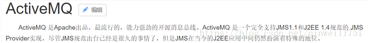
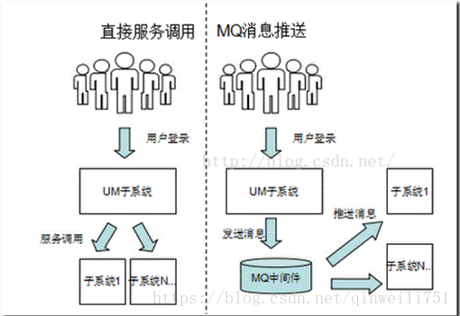
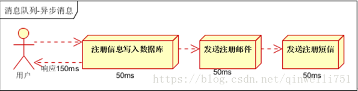
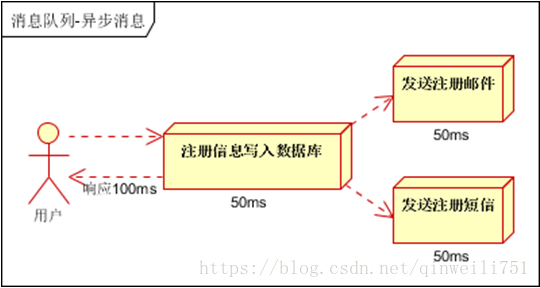
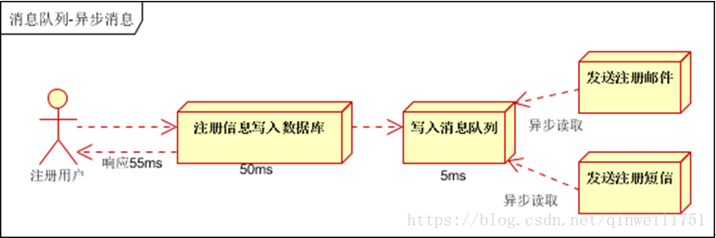
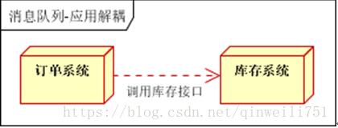
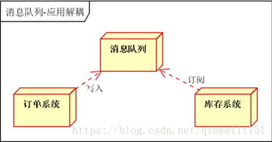
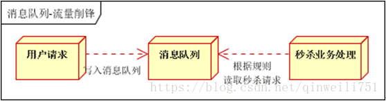
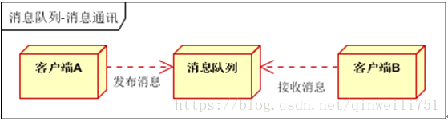
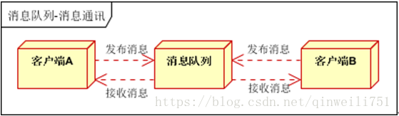

# ActiveMQ的作用总结(应用场景及优势)

2018年06月08日 11:21:58 [青莲键仙](https://me.csdn.net/qinweili751) 阅读数：15972

https://blog.csdn.net/qinweili751/article/details/80620104

业务场景说明:

消息队列在大型电子商务类网站，如京东、淘宝、去哪儿等网站有着深入的应用，

队列的主要作用是消除高并发访问高峰，加快网站的响应速度。

在不使用消息队列的情况下，用户的请求数据直接写入数据库，在高并发的情况下，会对数据库造成巨大的压力，同时也使得系统响应延迟加剧。

在使用队列后，用户的请求发给队列后立即返回,

（例如: 当然不能直接给用户提示订单提交成功，京东上提示：您“您提交了订单，请等待系统确认”），

再由消息队列的消费者进程从消息队列中获取数据，异步写入数据库。

由于消息队列的服务处理速度远快于数据库，因此用户的响应延迟可得到有效改善。

图解说明:

# 1.   消息队列说明

消息队列中间件是分布式系统中重要的组件，主要解决应用耦合，异步消息，流量削锋等问题。

实现高性能，高可用，可伸缩和最终一致性架构。是大型分布式系统不可缺少的中间件。

目前在生产环境，使用较多的消息队列有ActiveMQ，RabbitMQ，ZeroMQ，Kafka，MetaMQ，RocketMQ等。

 

# 2.    消息队列应用场景

消息队列在实际应用中常用的使用场景。异步处理，应用解耦，流量削锋和消息通讯四个场景。

## 2.1.     异步处理

场景说明：用户注册后，需要发注册邮件和注册短信。传统的做法有两种1.串行的方式；2.并行方式。

（1）串行方式：将注册信息写入[**数据库**](http://lib.csdn.net/base/mysql)成功后，发送注册邮件，再发送注册短信。以上三个任务全部完成后，返回给客户端。

 

（2）并行方式：将注册信息写入[**数据库**](http://lib.csdn.net/base/mysql)成功后，发送注册邮件的同时，发送注册短信。以上三个任务完成后，返回给客户端。与串行的差别是，并行的方式可以提高处理的时间。

假设三个业务节点每个使用50毫秒钟，不考虑网络等其他开销，则串行方式的时间是150毫秒，并行的时间可能是100毫秒。

因为CPU在单位时间内处理的请求数是一定的，假设CPU1秒内吞吐量是100次。

则串行方式1秒内CPU可处理的请求量是7次（1000/150）。并行方式处理的请求量是10次（1000/100）。

 

小结：如以上案例描述，传统的方式系统的性能（并发量，吞吐量，响应时间）会有瓶颈。如何解决这个问题呢？

引入消息队列，将不是必须的业务逻辑，异步处理。改造后的架构如下：

 

按照以上约定，用户的响应时间相当于是注册信息写入数据库的时间，也就是50毫秒。

注册邮件，发送短信写入消息队列后，直接返回，因此写入消息队列的速度很快，基本可以忽略，

因此用户的响应时间可能是50毫秒。所以基于此架构改变后，系统的吞吐量提高到每秒20 QPS。比串行提高了3倍，比并行提高了两倍。

## 2.2.    应用解耦

场景说明：用户下单后，订单系统需要通知库存系统。传统的做法是，订单系统调用库存系统的接口。如下图：

 

传统模式的缺点：

1）  假如库存系统无法访问，则订单减库存将失败，从而导致订单失败；

2）  订单系统与库存系统耦合；

如何解决以上问题呢？引入应用消息队列后的方案，如下图：

 

- 1:订单系统：用户下单后，订单系统完成持久化处理，将消息写入消息队列，返回用户订单下单成功,请等待物流配送。
- 2:库存系统：订阅下单的消息，采用拉/推的方式，获取下单信息，库存系统根据下单信息，进行库存操作。
- 3:假如：在下单时库存系统不能正常使用。也不影响正常下单，
- 因为下单后，订单系统写入消息队列就不再关心其他的后续操作了。实现订单系统与库存系统的应用解耦。

 

## 2.3.    流量削锋

流量削锋也是消息队列中的常用场景，一般在秒杀或团抢活动中使用广泛。

应用场景：秒杀活动，一般会因为流量过大，导致流量暴增，应用容易挂掉。为解决这个问题，一般需要在应用前端加入消息队列。

1. 可以控制活动的人数.
2. 可以缓解短时间内高流量压垮应用；

 

1. 用户的请求，服务器接收后，首先写入消息队列。假如消息队列长度超过最大数量，则直接抛弃用户请求或跳转到错误页面；
2. 秒杀业务根据消息队列中的请求信息，再做后续处理。

## 2.4.    消息通讯

消息通讯是指，消息队列一般都内置了高效的通信机制，因此也可以用在纯的消息通讯。比如实现点对点消息队列，或者聊天室等。

点对点通讯：

 

客户端A和客户端B使用同一队列，进行消息通讯。

聊天室通讯：

 

客户端A，客户端B，客户端N订阅同一主题，进行消息发布和接收。实现类似聊天室效果。

以上实际是消息队列的两种消息模式，点对点或发布订阅模式。