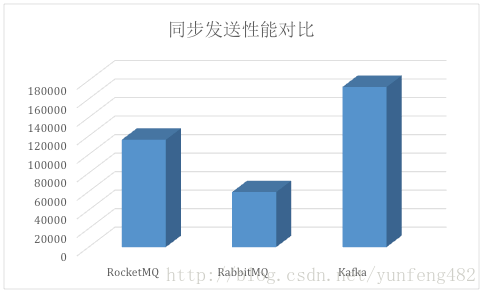
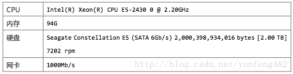
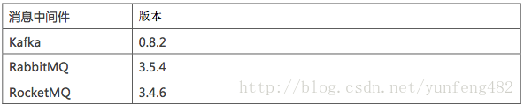
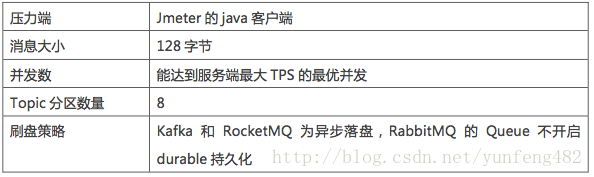

# Kafka、RabbitMQ、RocketMQ等消息中间件的介绍和对比

2017年06月04日 01:59:36

BraveSoul360

阅读数 65938

​                 标签：                                   [消息中间件                                    ](https://so.csdn.net/so/search/s.do?q=消息中间件&t=blog)[RocketMQ                                    ](https://so.csdn.net/so/search/s.do?q=RocketMQ&t=blog)[Kafka                                    ](https://so.csdn.net/so/search/s.do?q=Kafka&t=blog)[RabbitMQ                                  ](https://so.csdn.net/so/search/s.do?q=RabbitMQ&t=blog)               更多

​                 个人分类：                                   [消息中间件                                  ](https://blog.csdn.net/yunfeng482/article/category/6953493)               

​                   

​                                          版权声明：本文为博主原创文章，未经博主允许不得转载。                     https://blog.csdn.net/yunfeng482/article/details/72856762                 

# 前言

在分布式系统中,我们广泛运用消息中间件进行系统间的数据交换,便于异步解耦。现在开源的消息中间件有很多,前段时间产品 RocketMQ (MetaQ的内核) 也顺利开源,得到大家的关注。

# 概念

## MQ简介

MQ,Message queue,消息队列，就是指保存消息的一个容器。具体的定义这里就不类似于数据库、缓存等，用来保存数据的。当然，与数据库、缓存等产品比较，也有自己一些特点，具体的特点后文会做详细的介绍。
 现在常用的MQ组件有ActiveMQ、RabbitMQ、RocketMQ、ZeroMQ、MetaMQ，当然近年来火热的kafka,从某些场景来说，也是MQ，当然kafka的功能更加强大，虽然不同的MQ都有自己的特点和优势，但是，不管是哪种MQ，都有MQ本身自带的一些特点，下面，介绍MQ的特点。

## MQ特点

**1、先进先出**
 不能先进先出，都不能说是队列了。消息队列的顺序在入队的时候就基本已经确定了，一般是不需人工干预的。而且，最重要的是，数据是只有一条数据在使用中。 这也是MQ在诸多场景被使用的原因。
 **2、发布订阅**
 发布订阅是一种很高效的处理方式，如果不发生阻塞，基本可以当做是同步操作。这种处理方式能非常有效的提升服务器利用率，这样的应用场景非常广泛。
 **3、持久化**
 持久化确保MQ的使用不只是一个部分场景的辅助工具，而是让MQ能像数据库一样存储核心的数据。
 **4、分布式**
 在现在大流量、大数据的使用场景下，只支持单体应用的服务器软件基本是无法使用的，支持分布式的部署，才能被广泛使用。而且，MQ的定位就是一个高性能的中间件。
 应用场景

# 那么,消息中间件性能究竟哪家强?

带着这个疑问,我们中间件测试组对常见的三类消息产品(Kafka、RabbitMQ、RocketMQ)做了性能比较。

### Kafka

Kafka是LinkedIn开源的分布式发布-订阅消息系统，目前归属于Apache顶级项目。Kafka主要特点是基于Pull的模式来处理消息消费，追求高吞吐量，一开始的目的就是用于日志收集和传输。0.8版本开始支持复制，不支持事务，对消息的重复、丢失、错误没有严格要求，适合产生大量数据的互联网服务的数据收集业务。

### RabbitMQ

RabbitMQ是使用Erlang语言开发的开源消息队列系统，基于AMQP协议来实现。AMQP的主要特征是面向消息、队列、路由（包括点对点和发布/订阅）、可靠性、安全。AMQP协议更多用在企业系统内，对数据一致性、稳定性和可靠性要求很高的场景，对性能和吞吐量的要求还在其次。

### RocketMQ

RocketMQ是阿里开源的消息中间件，它是纯Java开发，具有高吞吐量、高可用性、适合大规模分布式系统应用的特点。RocketMQ思路起源于Kafka，但并不是Kafka的一个Copy，它对消息的可靠传输及事务性做了优化，目前在阿里集团被广泛应用于交易、充值、流计算、消息推送、日志流式处理、binglog分发等场景。

## 测试目的

对比Kafka、RabbitMQ、RocketMQ发送小消息(124字节)的性能。这次压测我们只关注服务端的性能指标,所以压测的标准是:

不断增加发送端的压力,直到系统吞吐量不再上升,而响应时间拉长。这时服务端已出现性能瓶颈,可以获得相应的系统最佳吞吐量。

### 测试场景

在同步发送场景中，三个消息中间件的表现区分明显：

#### Kafka

Kafka的吞吐量高达17.3w/s，不愧是高吞吐量消息中间件的行业老大。这主要取决于它的队列模式保证了写磁盘的过程是线性IO。此时broker磁盘IO已达瓶颈。

#### RocketMQ

RocketMQ也表现不俗，吞吐量在11.6w/s，磁盘IO %util已接近100%。RocketMQ的消息写入内存后即返回ack，由单独的线程专门做刷盘的操作，所有的消息均是顺序写文件。

#### RabbitMQ

RabbitMQ的吞吐量5.95w/s，CPU资源消耗较高。它支持AMQP协议，实现非常重量级，为了保证消息的可靠性在吞吐量上做了取舍。我们还做了RabbitMQ在消息持久化场景下的性能测试，吞吐量在2.6w/s左右。

## 测试结论

 在服务端处理同步发送的性能上，Kafka>RocketMQ>RabbitMQ。
 附录：
 测试环境
 服务端为单机部署，机器配置如下：
 

应用版本：

测试脚本
 

# 消息队列优点对比

前面我们对比了最简单的小消息发送场景,Kafka暂时胜出。但是,作为经受过历次双十一洗礼的RocketMQ,在互联网应用场景中更有它优越的一面。

## RabbitMQ

是使用Erlang编写的一个开源的消息队列，本身支持很多的协议：AMQP，XMPP, SMTP,  STOMP，也正是如此，使的它变的非常重量级，更适合于企业级的开发。同时实现了一个经纪人(Broker)构架，这意味着消息在发送给客户端时先在中心队列排队。对路由(Routing)，负载均衡(Load  balance)或者数据持久化都有很好的支持。

## Redis

是一个Key-Value的NoSQL数据库，开发维护很活跃，虽然它是一个Key-Value数据库存储系统，但它本身支持MQ功能，所以完全可以当做一个轻量级的队列服务来使用。对于RabbitMQ和Redis的入队和出队操作，各执行100万次，每10万次记录一次执行时间。测试数据分为128Bytes、512Bytes、1K和10K四个不同大小的数据。实验表明：入队时，当数据比较小时Redis的性能要高于RabbitMQ，而如果数据大小超过了10K，Redis则慢的无法忍受；出队时，无论数据大小，Redis都表现出非常好的性能，而RabbitMQ的出队性能则远低于Redis。

## ZeroMQ

号称最快的消息队列系统，尤其针对大吞吐量的需求场景。ZMQ能够实现RabbitMQ不擅长的高级/复杂的队列，但是开发人员需要自己组合多种技术框架，技术上的复杂度是对这MQ能够应用成功的挑战。ZeroMQ具有一个独特的非中间件的模式，你不需要安装和运行一个消息服务器或中间件，因为你的应用程序将扮演了这个服务角色。你只需要简单的引用ZeroMQ程序库，可以使用NuGet安装，然后你就可以愉快的在应用程序之间发送消息了。但是ZeroMQ仅提供非持久性的队列，也就是说如果down机，数据将会丢失。其中，Twitter的Storm中使用ZeroMQ作为数据流的传输。

## ActiveMQ

Apache ActiveMQ 是最受欢迎且功能最强大的开源消息传递和Integration Patterns服务器。
 Apache ActiveMQ速度快，支持许多跨语言客户端和协议，带有易于使用的企业集成模式和许多高级功能，同时完全支持JMS 1.1和J2EE 1.4。Apache ActiveMQ是在Apache 2.0许可下发布
 **特征**
 支持Java消息服务(JMS) 1.1 版本
 Spring Framework
 集群 (Clustering)
 支持的编程语言包括：C、C++、C#、Delphi、Erlang、Adobe Flash、Haskell、Java、JavaScript、Perl、PHP、Pike、Python和Ruby
 协议支持包括：OpenWire、REST、STOMP、WS-Notification、MQTT、XMPP以及AMQP [1]

## Jafka/Kafka

Kafka是Apache下的一个子项目，是一个高性能跨语言分布式Publish/Subscribe消息队列系统，而Jafka是在Kafka之上孵化而来的，即Kafka的一个升级版。具有以下特性：快速持久化，可以在O(1)的系统开销下进行消息持久化；高吞吐，在一台普通的服务器上既可以达到10W/s的吞吐速率；完全的分布式系统，Broker、Producer、Consumer都原生自动支持分布式，自动实现复杂均衡；支持Hadoop数据并行加载，对于像Hadoop的一样的日志数据和离线分析系统，但又要求实时处理的限制，这是一个可行的解决方案。Kafka通过Hadoop的并行加载机制来统一了在线和离线的消息处理，这一点也是本课题所研究系统所看重的。Apache  Kafka相对于ActiveMQ是一个非常轻量级的消息系统，除了性能非常好之外，还是一个工作良好的分布式系统。

# 其他对比

### Rabbitmq比kafka可靠，kafka更适合IO高吞吐的处理，比如ELK日志收集

Kafka和RabbitMq一样是通用意图消息代理，他们都是以分布式部署为目的。但是他们对消息语义模型的定义的假设是非常不同的。我对"AMQP 更成熟"这个论点是持怀疑态度的。让我们用事实说话来看看用什么解决方案来解决你的问题。
 　　a)  以下场景你比较适合使用Kafka。你有大量的事件(10万以上/秒)、你需要以分区的，顺序的，至少传递成功一次到混杂了在线和打包消费的消费者、你希望能重读消息、你能接受目前是有限的节点级别高可用或则说你并不介意通过论坛/IRC工具得到还在幼儿阶段的软件的支持。
 　　b)  以下场景你比较适合使用RabbitMQ。你有较少的事件（2万以上/秒）并且需要通过复杂的路由逻辑去找到消费者、你希望消息传递是可靠的、你并不关心消息传递的顺序、你需要现在就支持集群-节点级别的高可用或则说你需要7*24小时的付费支持（当然也可以通过论坛/IRC工具）。

### redis 消息推送是基于分布式 pub/sub，多用于实时性较高的消息推送，并不保证可靠。

redis 消息推送（基于分布式  pub/sub）多用于实时性较高的消息推送，并不保证可靠。其他的mq和kafka保证可靠但有一些延迟（非实时系统没有保证延迟）。redis-pub/sub断电就清空，而使用redis-list作为消息推送虽然有持久化，但是又太弱智，也并非完全可靠不会丢。另外一点，redis  发布订阅除了表示不同的 topic  外，并不支持分组，比如kafka中发布一个东西，多个订阅者可以分组，同一个组里只有一个订阅者会收到该消息，这样可以用作负载均衡。比如，kafka  中发布：topic = “发布帖子” data=“文章1” 这个消息，后面有一百台服务器每台服务器都是一个订阅者，都订阅了这个  topic，但是他们可能分为三组，A组50台，用来真的做发布文章，A组50台里所有 subscriber  都订阅了这个topic。由于在同一组，这条消息 （topic=“发布帖子”,  data=“文章1”）只会被A组里面一台当前空闲的机器收到。而B组25台服务器用于统计，C组25台服务器用于存档备份，每组只有一台会收到。用不同的组来决定每条消息要抄送出多少分去，用同组内哪些订阅者忙，哪些订阅者空闲来决定消息会被分到哪台服务器去处理，生产者消费者模型嘛。redis完全没有这类机制，这两点是最大的区别。

### redis主要做内存数据库

redis作者做内存数据库基础上增加了消息pub/sub。mq一般都采用订阅～发布模型，如果你考虑性能，主要关注点就放在消费模型是pull还是push。影响最大的，应该是存储结构。kafka的性能要在topic数量小于64的时候，才能发挥威力。partition决定的。极限情况下丢消息，例如：主写入消息后，主机器宕机，并硬盘损坏。review代码的时候发现的。rabbit不知道，但是rocket的性能是（万条每秒），并且能够横向无限扩展，单机topic数量在256时，性能损失较小。rocket可以说是kafka的变种，是阿里在充分reviewkafka代码后，开发的metaQ。在不断更新，修补以后，阿里把metaQ3.0更名为rocket，并且rocket是java写的易于维护。另外就是rocket和kafka有类似无限堆积的能力。想想，断电不丢消息，积压两亿条消息毫无压力，niubility  kafka和rocket mq性能根本不需要考虑的问题。

# 在应用场景方面，

## RabbitMQ

RabbitMQ遵循AMQP协议，由内在高并发的erlanng语言开发，用在实时的对可靠性要求比较高的消息传递上，适合企业级的消息发送订阅，也是比较受到大家欢迎的。

## kafka

kafka是Linkedin于2010年12月份开源的消息发布订阅系统,它主要用于处理活跃的流式数据,大数据量的数据处理上。常用日志采集，数据采集上。

## ActiveMQ

- 异步调用
- 一对多通信
- 做多个系统的集成，同构、异构
- 作为RPC的替代
- 多个应用相互解耦
- 作为事件驱动架构的幕后支撑
- 为了提高系统的可伸缩性

# 在架构模型方面，

## RabbitMQ

RabbitMQ遵循AMQP协议，RabbitMQ的broker由Exchange,Binding,queue组成，其中exchange和binding组成了消息的路由键；客户端Producer通过连接channel和server进行通信，Consumer从queue获取消息进行消费（长连接，queue有消息会推送到consumer端，consumer循环从输入流读取数据）。rabbitMQ以broker为中心；有消息的确认机制。

## kafka

kafka遵从一般的MQ结构，producer，broker，consumer，以consumer为中心，消息的消费信息保存的客户端consumer上，consumer根据消费的点，从broker上批量pull数据；无消息确认机制。

# 在吞吐量，

## kafka

kafka具有高的吞吐量，内部采用消息的批量处理，zero-copy机制，数据的存储和获取是本地磁盘顺序批量操作，具有O(1)的复杂度，消息处理的效率很高。

## rabbitMQ

rabbitMQ在吞吐量方面稍逊于kafka，他们的出发点不一样，rabbitMQ支持对消息的可靠的传递，支持事务，不支持批量的操作；基于存储的可靠性的要求存储可以采用内存或者硬盘。

# 在可用性方面，

## rabbitMQ

rabbitMQ支持miror的queue，主queue失效，miror queue接管。

## kafka

kafka的broker支持主备模式。

# 在集群负载均衡方面，

## kafka

kafka采用zookeeper对集群中的broker、consumer进行管理，可以注册topic到zookeeper上；通过zookeeper的协调机制，producer保存对应topic的broker信息，可以随机或者轮询发送到broker上；并且producer可以基于语义指定分片，消息发送到broker的某分片上。

## rabbitMQ

rabbitMQ的负载均衡需要单独的loadbalancer进行支持。

# 其他

Kafka是可靠的分布式日志存储服务。用简单的话来说，你可以把Kafka当作可顺序写入的一大卷磁带，  可以随时倒带，快进到某个时间点重放。先说下日志的定义：日志是数据库的核心，是对数据库的所有变更的严格有序记录，“表”是变更的结果。日志的其他名字有：  Changelog, Write Ahead Log, Commit Log, Redo Log,  Journaling.Kafka的特征如下：高写入速度：Kafka能以超过1Gbps NIC的速度写这盘磁带（实际可以到SATA  3速度，参考Benchmarking Apache Kafka: 2 Million Writes Per Second (On Three  Cheap Machines))，充分利用了磁盘的物理特性，即，随机写入慢（磁头冲停），顺序写入快（磁头悬浮）。高可靠性：  通过zookeeper做分布式一致性，同步到任意多块磁盘上，故障自动切换选主，自愈。高容量：通过横向扩展，LinkedIn每日通过Kafka存储的新增数据高达175TB，8000亿条消息，可无限扩容，类似把两条磁带粘到一起。传统业务数据库的根本缺陷在于：1.   太慢，读写太昂贵，无法避免的随机寻址。（磁盘最快5ms寻址，固态又太昂贵。）2.   根本无法适应持续产生的数据流，越用越慢。（索引效率问题）3.  无法水平scale。（多半是读写分离，一主多备。另:  NewSQL通过一致性算法，有多主。）针对这些问题，Kafka提出了一种方法: “log-centric  approach（以日志为中心的方法）。”将传统数据库分为两个独立的系统，即日志系统和索引系统。“持久化和索引分开，日志尽可能快的落地，索引按照自己的速度追赶。”在数据可靠性在得到Kafka这种快速的，类似磁带顺序记录方式保障的大前提下。数据的呈现，使用方式变得非常灵活，可以根据需要将数据流同时送入搜索系统，RDBMS系统，数据仓库系统，  图数据库系统，日志分析等这些各种不同的数据库系统。  这些不同的系统只不过是一种对Kafka磁带数据的一种诠释，一个侧面，一个索引，一个快照。数据丢了，没关系，重放一遍磁带即可，更多的时候，对这些各式数据库系统的维护只是需要定期做一个快照，并拷贝到一个安全的对象存储(如S3)  而已。   一句话：“日志都是相同的日志，索引各有各的不同。”关于流计算：在以流为基本抽象的存储模型下，数据流和数据流之间，可以多流混合处理，或者流和状态，状态和状态的JOIN处理，这就是Kafka  Stream提供的功能。  一个简单的例子是，在用户触发了某个事件后，和用户表混合处理，产生数据增补（Augment)，再进入数据仓库进行相关性分析，一些简单的窗口统计和实时分析也很容易就能满足，比如  在收到用户登录消息的时候，在线人数+1， 离线的时候-1，反应出当前系统的在线用户总数。

这方面可以参考PipelineDB <https://www.pipelinedb.com/Kafka>

参考文章：<http://jm.taobao.org/2016/04/01/kafka-vs-rabbitmq-vs-rocketmq-message-send-performance/?utm_source=tuicool&utm_medium=referral>