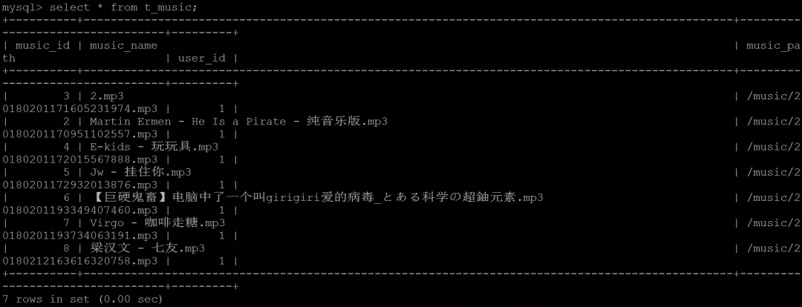
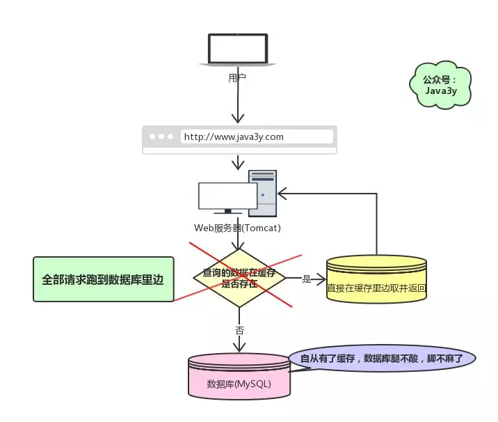
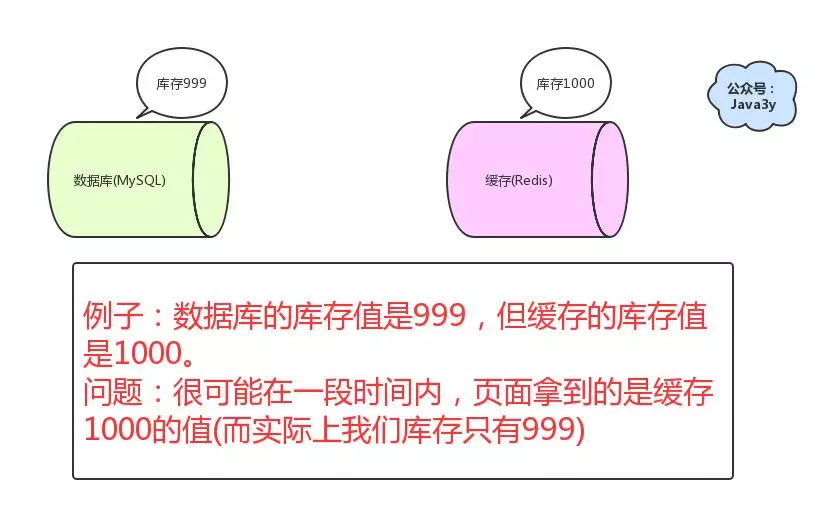
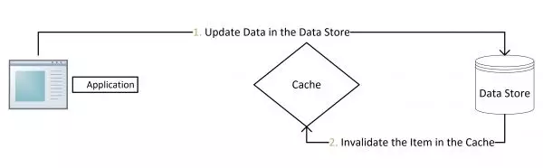

##                                                                             面试前必须要知道的Redis面试题                       

​                                                                                                                                                                                                  [                         数据库开发                      ](javascript:void(0);)                                                                   *2月18日*                      

​                     文章转载自公众号                                                                                                                                  Java3y                                         ，                                            作者                                            Java3y                                                                                

> **来自：Java3y（微信号：java3y）**

今天来分享一下Redis几道常见的面试题：

- 如何解决缓存雪崩？
- 如何解决缓存穿透？
- 如何保证缓存与数据库双写时一致的问题？

### 一、缓存雪崩

## **1.1 什么是缓存雪崩？**

回顾一下我们为什么要用缓存(Redis)：

为什么要缓存

现在有个问题，**如果我们的缓存挂掉了，这意味着我们的全部请求都跑去数据库了**。

如果缓存挂掉了，全部请求跑去数据库了

在前面学习我们都知道Redis不可能把所有的数据都缓存起来(**内存昂贵且有限**)，所以Redis需要对数据设置过期时间，并采用的是**惰性删除+定期删除**两种策略对过期键删除。[Redis对过期键的策略+持久化](https://mp.weixin.qq.com/s?__biz=MzI4Njg5MDA5NA==&mid=2247484386&idx=1&sn=323ddc84dc851a975530090fcd6e2326&chksm=ebd742e3dca0cbf52bc65d430447e639d81cc13e0ac34613edf464dae3950b10e2e1df74dcc5&token=1834317504&lang=zh_CN&scene=21#wechat_redirect)

如果缓存数据**设置的过期时间是相同**的，并且Redis恰好将这部分数据全部删光了。这就会导致在这段时间内，这些缓存**同时失效**，全部请求到数据库中。

**这就是缓存雪崩**：

- Redis挂掉了，请求全部走数据库。
- 对缓存数据设置相同的过期时间，导致某段时间内缓存失效，请求全部走数据库。

缓存雪崩如果发生了，很可能就把我们的数据库搞垮，导致整个服务瘫痪！

## **1.2 如何解决缓存雪崩？**

对于“对缓存数据设置相同的过期时间，导致某段时间内缓存失效，请求全部走数据库。”这种情况，非常好解决：

- 解决方法：在缓存的时候给过期时间加上一个**随机值**，这样就会大幅度的**减少缓存在同一时间过期**。

对于“Redis挂掉了，请求全部走数据库”这种情况，我们可以有以下的思路：

- 事发前：实现Redis的**高可用**(主从架构+Sentinel 或者Redis Cluster)，尽量避免Redis挂掉这种情况发生。
- 事发中：万一Redis真的挂了，我们可以设置**本地缓存(ehcache)+限流(hystrix)**，尽量避免我们的数据库被干掉(起码能保证我们的服务还是能正常工作的)
- 事发后：redis持久化，重启后自动从磁盘上加载数据，**快速恢复缓存数据**。

### 二、缓存穿透

## **2.1 什么是缓存穿透**

比如，我们有一张数据库表，ID都是从1开始的(**正数**)：

随便找了一张数据库表

但是可能有黑客想把我的数据库搞垮，每次请求的ID都是**负数**。这会导致我的缓存就没用了，请求全部都找数据库去了，但数据库也没有这个值啊，所以每次都返回空出去。

> 缓存穿透是指查询一个一定**不存在的数据**。由于缓存不命中，并且出于容错考虑，如果从**数据库查不到数据则不写入缓存**，这将导致这个不存在的数据**每次请求都要到数据库去查询**，失去了缓存的意义。

缓存穿透

**这就是缓存穿透**：

- 请求的数据在缓存大量不命中，导致请求走数据库。

缓存穿透如果发生了，也可能把我们的数据库**搞垮**，导致整个服务瘫痪！

## **2.1 如何解决缓存穿透？**

解决缓存穿透也有两种方案：

- 由于请求的参数是不合法的(每次都请求不存在的参数)，于是我们可以使用布隆过滤器(BloomFilter)或者压缩filter**提前拦截**，不合法就不让这个请求到数据库层！

- 当我们从数据库找不到的时候，我们也将这个**空对象设置到缓存里边去**。下次再请求的时候，就可以从缓存里边获取了。

- - 这种情况我们一般会将空对象设置一个**较短的过期时间**。

参考资料：

- 缓存系列文章--5.缓存穿透问题

- - https://carlosfu.iteye.com/blog/2248185

### 三、缓存与数据库双写一致

## **3.1 对于读操作，流程是这样的**

上面讲缓存穿透的时候也提到了：如果从数据库查不到数据则不写入缓存。

一般我们对**读操作**的时候有这么一个**固定的套路**：

- 如果我们的数据在缓存里边有，那么就直接取缓存的。
- 如果缓存里没有我们想要的数据，我们会先去查询数据库，然后**将数据库查出来的数据写到缓存中**。
- 最后将数据返回给请求

## **3.2 什么是缓存与数据库双写一致问题？**

如果仅仅查询的话，缓存的数据和数据库的数据是没问题的。但是，当我们要**更新**时候呢？各种情况很可能就**造成数据库和缓存的数据不一致**了。

- 这里不一致指的是：**数据库的数据跟缓存的数据不一致**

数据库和缓存的数据不一致

从理论上说，只要我们设置了**键的过期时间**，我们就能保证缓存和数据库的数据**最终是一致**的。因为只要缓存数据过期了，就会被删除。随后读的时候，因为缓存里没有，就可以查数据库的数据，然后将数据库查出来的数据写入到缓存中。

除了设置过期时间，我们还需要做更多的措施来**尽量避免**数据库与缓存处于不一致的情况发生。

## **3.3 对于更新操作**

一般来说，执行更新操作时，我们会有两种选择：

- 先操作数据库，再操作缓存
- 先操作缓存，再操作数据库

首先，要明确的是，无论我们选择哪个，我们都希望这**两个操作要么同时成功，要么同时失败**。所以，这会演变成一个**分布式事务**的问题。

所以，**如果原子性被破坏了**，可能会有以下的情况：

- **操作数据库成功了，操作缓存失败了**。
- **操作缓存成功了，操作数据库失败了**。

> 如果第一步已经失败了，我们直接返回Exception出去就好了，第二步根本不会执行。

下面我们具体来分析一下吧。

### 3.3.1操作缓存 

操作缓存也有两种方案：

- **更新缓存**
- ~~删除缓存~~

一般我们都是采取**删除缓存**缓存策略的，原因如下：

1. 高并发环境下，无论是先操作数据库还是后操作数据库而言，如果加上更新缓存，那就**更加容易**导致数据库与缓存数据不一致问题。(删除缓存**直接和简单**很多)
2. 如果每次更新了数据库，都要更新缓存【这里指的是频繁更新的场景，这会耗费一定的性能】，倒不如直接删除掉。等再次读取时，缓存里没有，那我到数据库找，在数据库找到再写到缓存里边(体现**懒加载**)

基于这两点，对于缓存在更新时而言，都是建议执行**删除**操作！

### 3.3.2先更新数据库，再删除缓存 

正常的情况是这样的：

- 先操作数据库，成功；
- 再删除缓存，也成功；

如果原子性被破坏了：

- 第一步成功(操作数据库)，第二步失败(删除缓存)，会导致**数据库里是新数据，而缓存里是旧数据**。
- 如果第一步(操作数据库)就失败了，我们可以直接返回错误(Exception)，不会出现数据不一致。

如果在高并发的场景下，出现数据库与缓存数据不一致的**概率特别低**，也不是没有：

- 缓存**刚好**失效
- 线程A查询数据库，得一个旧值
- 线程B将新值写入数据库
- 线程B删除缓存
- 线程A将查到的旧值写入缓存

要达成上述情况，还是说一句**概率特别低**：

> 因为这个条件需要发生在读缓存时缓存失效，而且并发着有一个写操作。而实际上数据库的写操作会比读操作慢得多，而且还要锁表，**而读操作必需在写操作前进入数据库操作，而又要晚于写操作更新缓存**，所有的这些条件都具备的概率基本并不大。

对于这种策略，其实是一种设计模式：`Cache Aside Pattern`

先修改数据库，再删除缓存

**删除缓存失败的解决思路**：

- 将需要删除的key发送到消息队列中
- 自己消费消息，获得需要删除的key
- **不断重试删除操作，直到成功**

### 3.3.3先删除缓存，再更新数据库

正常情况是这样的：

- 先删除缓存，成功；
- 再更新数据库，也成功；

如果原子性被破坏了：

- 第一步成功(删除缓存)，第二步失败(更新数据库)，数据库和缓存的数据还是一致的。
- 如果第一步(删除缓存)就失败了，我们可以直接返回错误(Exception)，数据库和缓存的数据还是一致的。

看起来是很美好，但是我们在并发场景下分析一下，就知道还是有问题的了：

- 线程A删除了缓存
- 线程B查询，发现缓存已不存在
- 线程B去数据库查询得到旧值
- 线程B将旧值写入缓存
- 线程A将新值写入数据库

所以也会导致数据库和缓存不一致的问题。

**并发下解决数据库与缓存不一致的思路**：

- 将删除缓存、修改数据库、读取缓存等的操作积压到**队列**里边，实现**串行化**。

将操作积压到队列中

### ！！最好不要做这个方案，即：**读请求和写请求串行化**

一般来说，如果允许缓存可以稍微的跟数据库偶尔有不一致的情况，也就是说如果你的系统**不是严格要求** “缓存+数据库” 必须保持一致性的话，最好不要做这个方案，即：**读请求和写请求串行化**，串到一个**内存队列**里去。

串行化可以保证一定不会出现不一致的情况，但是它也会导致系统的吞吐量大幅度降低，用比正常情况下多几倍的机器去支撑线上的一个请求。

### 

### Cache Aside Pattern

最经典的缓存+数据库读写的模式，就是 Cache Aside Pattern。

- 读的时候，先读缓存，缓存没有的话，就读数据库，然后取出数据后放入缓存，同时返回响应。
- 更新的时候，**先更新数据库，然后再删除缓存**。

## **3.4对比两种策略**

我们可以发现，两种策略各自有优缺点：

- 先删除缓存，再更新数据库

- - 在高并发下表现不如意，在原子性被破坏时表现优异

- 先更新数据库，再删除缓存(`Cache Aside Pattern`设计模式)

- - 在高并发下表现优异，在原子性被破坏时表现不如意

## **3.5 其他保障数据一致的方案与资料**

可以用**databus**或者阿里的**canal监听binlog**进行更新。

参考资料：

- 缓存更新的套路

- - https://coolshell.cn/articles/17416.html

- 如何保证缓存与数据库双写时的数据一致性？

- - https://github.com/doocs/advanced-java/blob/master/docs/high-concurrency/redis-consistence.md

- 分布式之数据库和缓存双写一致性方案解析

- - https://zhuanlan.zhihu.com/p/48334686

- Cache Aside Pattern

- - https://blog.csdn.net/z50l2o08e2u4aftor9a/article/details/81008933

### 最后

这是几道Redis常见的面试题，希望大家看完有所帮助，顺利拿到offer！

------

●编号510，输入编号直达本文

●输入m获取文章目录

**推荐↓↓↓**

