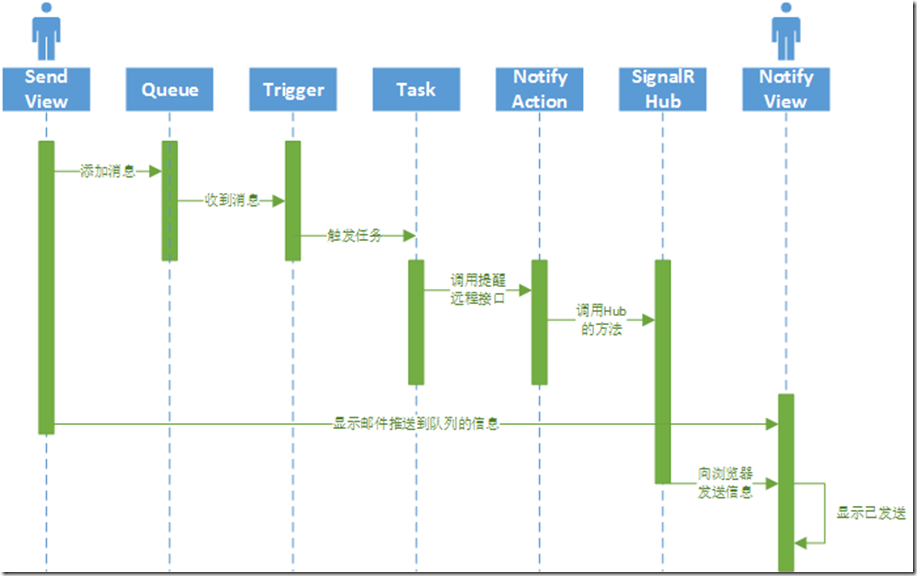

- 安装和使用更简单

- 从零开始用.NET编写，同时

  Quartz.NET 190是来自Java的端口。这意味着一个更好的API和.NET结构的使用。

  - 我特别喜欢HangFire在调度代码调用时如何将方法调用和参数序列化为表达式树。

> - Simpler to install and use
>
> - Written in .Net from scratch, while
>
>    Quartz.NET 190	is a port from Java. This means a better api and usage of .Net structures.
>
>   - [I especially like how HangFire](https://discuss.hangfire.io/t/hangfire-vs-quarz-net/859) serializes method-calls and arguments into a expression tree when scheduling a code-call.


###	结合


[Hangfire](https://www.hangfire.io/)用法比较简单，个人觉得可以和Quartz框架配合使用。

hangfire比较适合处理基于队列的任务，和延时执行任务。

至于重复和定时任务使用quartz框架可以支持秒级单位的定时任务处理，

hangfire只能到分钟  


---

### 对比


个人认为Quartz.net在定时任务处理方面优势如下：  

- 支持秒级单位的定时任务处理，但是Hangfire只能支持分钟及以上的定时任务处理

  ```csharp
//更新Hangfire版本到1.7.0，才支持使用按秒循环任务执行
  RecurringJob.AddOrUpdate("test",()=>writeLog("每20秒执行任务"), "*/20 * * * * *");

  ```
> [MVC中使用Hangfire按秒执行任务](https://www.cnblogs.com/footmark/p/10656310.html)
>
> 原因在于Hangfire用的是开源的[NCrontab](https://github.com/atifaziz/NCrontab)组件，跟linux上的crontab指令相似。  

- 更加复杂的触发器，日历以及任务调度处理

- 可配置的定时任务

  

> 调度程序方法已经改为基于Task，记得要await 它们
>
> IJob接口现在返回一个Task
>
> 支持 async/await 基于任务的作业，内部以async/await工作
>
> 删除C5 Collections，使用.NET框架内置的Collections
>
> 支持.NET Core / netstandard 2.0和.NET Framework 4.5.2及更高版本
>
> ​			 [Quartz.NET 3.0 正式发布](https://www.cnblogs.com/shanyou/p/8269641.html)

- ---


但是为什么要换Hangfire?   很大的原因在于项目需要一个后台可监控的应用，不用每次都要从服务器拉取日志查看，在没有ELK的时候相当不方便。Hangfire**控制面板不仅提供监控**，**也可以手动的触发**执行定时任务。如果在定时任务处理方面没有很高的要求，比如一定要5s定时执行，Hangfire值得拥有。抛开这些，Hangfire优势太明显了：   

- 持久化保存任务、队列、统计信息
- 支持各种常见的任务类型 
- 重试机制
- 多语言支持
- 支持任务取消
- 支持按指定`Job Queue`处理任务
- 服务器端工作线程可控，即job执行并发数控制
- 分布式部署，支持高可用
- 良好的扩展性，如支持IOC、Hangfire Dashboard授权控制、Asp.net Core、持久化存储等

说了这么多的优点，我们可以有个案例，例如秒杀场景：用户下单->订单生成->扣减库存，Hangfire对于这种分布式的应用处理也是适用的，最后会给出实现。  

###	场景

内部CRM系统需要群发邮件
eFootprint进行大量数据分析计算


## Hangfire基础


后台作业是应用程序中非常重要的部分， `Hangfire` 确保至少执行一次任务。要在应用程序重新启动之间保留后台作业信息，所有信息都将保存在您最喜欢的持久性存储中。 

- 延续性任务类似于.NET中的`Task`,可以在第一个任务执行完之后紧接着再次执行另外的任务：

```
BackgroundJob.ContinueWith(
    jobId,
    () => Console.WriteLine("Continuation!"));
```

为什么**不用Async和Await**
为什么**不用Task**

---

在循环中，有一个对cancellationToken.ThrowIfCancellationRequested()的调用，以验证是否请求了取消，但是这个调用在[执行大约30分钟后一直被触发，并在完成之前终止作业](https://cloud.tencent.com/developer/ask/152359)。

我也有过同样的问题，我花了很多时间在HangFire主题中找到解决方案。但是，我注意到只有在控制台事件之后才会触发取消。

所以问题不在它本身，而是在项目中。用**HangFire.Console**。

---

 [优化，超时和错误处理代码](https://www.colabug.com/goto/aHR0cHM6Ly9naXRodWIuY29tL29kaW5zZXJqL0hhbmdmaXJlL3dpa2kvSUlTLUNhbi1LaWxsLVlvdXItVGhyZWFkcw==) （可能导致进程终止）来防止不好的事情发生。如果您没有使用可靠的处理和自动机制，您的工作可能会丢失。您的最终用户可能无限期等待某些任务，如电子邮件，报告，通知等。 


###		Task

 		這裡有幾個部份要注意，

 		2.4.1.要執行的 Task，用一個 Method 封裝起來比較方便。

 		2.4.2.執行的 Method 參數最好是字串，如果是物件的話，不要是 nested 物件，這樣會Parse不出來，然後報錯哦!

 		 

 		 

####  		3.把資料放到 Hangfire 後，就要建立Web API 專案來讓 Hangfire 去執行 Task 及提供 Dashboard。


###	Hangfire扩展

 Hangfire扩展性大家可以参考 [这里](https://www.colabug.com/goto/aHR0cDovL2hhbmdmaXJlLmlvL2V4dGVuc2lvbnMuaHRtbA==) ，有几个扩展是很实用的.下面这些关于Hangfire扩展大家可以自己查资料。后面如果有机会的话，我再补上。 

- Hangfire Dashborad日志查看
- Hangfire Dashborad授权
- IOC容器之Autofac
- RecurringJob扩展
- 与MSMQ集成
- 持久化存储之Redis

【[阅读原文...](https://www.colabug.com/go/?url=http://www.cnblogs.com/anyushengcms/p/7927314.html)】

---


##	[MVP 2015社区大讲堂之：在ASP.NET应用中执行后台任务](https://www.cnblogs.com/redmoon/p/4266158.html)

今年1月31日，在微软的MVP  2015社区大讲堂上，我给大家分享了一个演讲：在ASP.NET应用中执行后台任务。其中介绍了三种技术的应用：QueueBackgroundWorkItem、Hangfire和Azure  WebJobs。当时由于时间关系，对三者都是简要介绍。今天想和大家着重介绍下Hangfire。  

Hangfire是一个开源且商业免费使用的工具函数库。可以让你非常容易地在ASP.NET应用（也可以不在ASP.NET应用）中执行多种类型的后台任务，而无需自行定制开发和管理基于Windows  Service后台任务执行器。且任务信息可以被持久保存。内置提供集成化的控制台。  

通过Nuget就可以在你的应用程序中安装Hangfire：Install-Package Hangfire  

Hangfire的具有如下特性和有点：  

- 支持基于队列的任务处理：任务执行不是同步的，而是放到一个持久化队列中，以便马上把请求控制权返回给调用者。使用方法：BackgroundJob.Enqueue(() => Console.WriteLine("Simple!"));  
- 延迟任务执行：不是马上调用方法，而是设定一个未来时间点再来执行。使用方法：BackgroundJob.Schedule(() => Console.WriteLine("Reliable!"), TimeSpan.FromDays(7));  
- 循环任务执行：只需要简单的一行代码就可以添加重复执行的任务，其内置了常见的时间循环模式，也可以基于CRON表达式来设定复杂的模式。使用方法：RecurringJob.AddOrUpdate(()  => Console.WriteLine("Transparent!"), Cron.Daily);  
- 持久化保存任务、队列、统计信息：默认使用SQL Server，也可以配合消息队列来降低队列处理延迟，或配置使用Redis来获得更好的性能表现  
- 内置自动重试机制：可以设定重试次数，还可以手动在控制台重启任务  
- 除了调用静态方法外还支持实例方法  
- 能够捕获多语言状态：即可以把调用者的Thread.CurrentCulture和Thread.CurrentUICulture信息同任务持久保存在一起，以便任务执行的时候多语言信息是一致的  
- 支持任务取消：使用CancellationToken这样的机制来处理任务取消逻辑  
- 支持IoC容器：目前支持Ninject和Autofac比较常用的开源IoC容器  
- 支持Web集群：可以在一台或多台机器上运行多个Hangfire实例以便实现冗余备份  
- 支持多队列：同一个Hangfire实例可以支持多个队列，以便更好的控制任务的执行方式  
- 并发级别的控制：默认是处理器数量的5倍工作行程，当然也可以自己设定  
- 具备很好的扩展性：有很多扩展点来控制持久存储方式、IoC容器支持等

为什么要使用Hangfire这样的函数库呢？我觉得好处有如下几个方面：  

1. 开发简单：无需自己额外做开发，就可以实现任务的队列执行、延迟执行和重复执行  
2. 部署简单：可以同主ASP.NET应用部署在一起，测试和维护都相对简单  
3. 迁移简单：由于宿主不仅限于ASP.NET，那么未来可以非常容易的把任务执行器放到其他地方（需要改变的就是在其他宿主中启动Hangfire服务器）  
4. 扩展简单：由于开源且有很多扩展点，在现有插件都不满足自己需要的情况下能够容易的进行扩展

之前我把Hangfire运用到两种情况下：  

1. 后台长时间的科学计算：这样就可以让请求马上返回给客户端，后台完成长时间计算后，用SignalR实时提醒用户  
2. 后台群发邮件：通过延迟和循环任务分批通过SendCloud这样的服务发送群发邮件

当然，Hangfire的应用场景还很多，比如在后台处理电商卖家的订单。  

MVP 2015社区大讲堂演讲的PPT在此：[MVP 2015社区大讲堂之：在ASP.NET应用中执行后台任务](http://www.cnblogs.com/redmoon/p/4266158.html)


昨天下午，在微软的MVP 2015社区大讲堂上给大家分享了一个题目：在ASP.NET应用中执行后台任务。这是一点都不高大上，并且还有点土气的技术分享。不过我相信很多人都遇到过这样的问题。

虽然是一个很简单的技术，不过来课堂上听讲的同学还是很多，在此再次感谢大家的捧场。

在这个分享中我主要介绍了三种解决方案：

1. QueueBackgroundWorkItem
2. Hangfire
3. Azure WebJobs

也同步演示了这三种方案的基本用法，但是由于是现场演示，所以代码的讲解都是一笔带过。不过还算这三个技术的使用都不复杂，所以大家可以看一下官方文档的说明，应该很快就可以上手的。

在演示WebJobs提醒机制的时候，由于是纯粹的代码讲解，可能有些同学没有太理解，所以我特意在这里补充一个时序图：

[](https://images0.cnblogs.com/blog/601/201502/012138395194084.png)

下面是PPT中给出的一些参考链接：

邮件发送代码示例：<https://github.com/heavenwing/MailSender>

QBWI：[参考](http://www.davidwhitney.co.uk/Blog/2014/05/09/exploring-the-queuebackgroundworkitem-in-asp-net-framework-4-5-2/?utm_source=tuicool)[1](http://www.davidwhitney.co.uk/Blog/2014/05/09/exploring-the-queuebackgroundworkitem-in-asp-net-framework-4-5-2/?utm_source=tuicool)，[参考](http://blogs.msdn.com/b/webdev/archive/2014/06/04/queuebackgroundworkitem-to-reliably-schedule-and-run-long-background-process-in-asp-net.aspx)[2](http://blogs.msdn.com/b/webdev/archive/2014/06/04/queuebackgroundworkitem-to-reliably-schedule-and-run-long-background-process-in-asp-net.aspx)

[http](http://hangfire.io/)[://hangfire.io](http://hangfire.io/)[/](http://hangfire.io/)

[Azure WebJobs](http://azure.microsoft.com/en-us/documentation/articles/websites-webjobs-resources)[推荐资源](http://azure.microsoft.com/en-us/documentation/articles/websites-webjobs-resources)

另外，关于在真实案例中的“接下来需要完善的地方”，由于时间关系，我只谈到了要开发一个抽象层来在不同的部署条件下适配使用不同的技术，没有见到还需要在任务中实现重启的功能（即“断点续传”）。

最后，这个演讲的PPT分享在：<http://pan.baidu.com/s/1eQpKURK>

