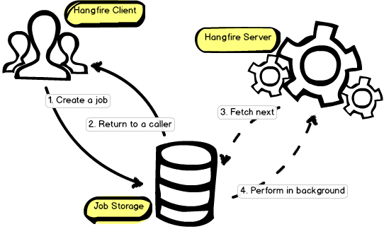
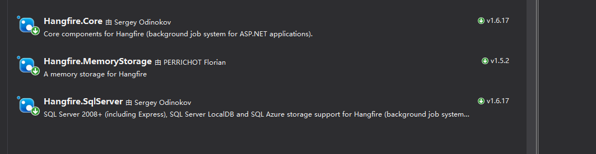
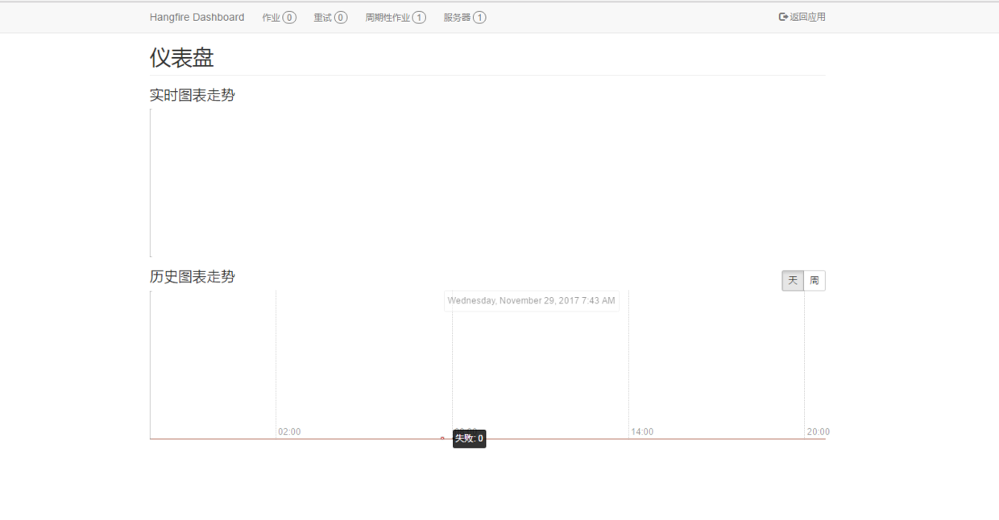
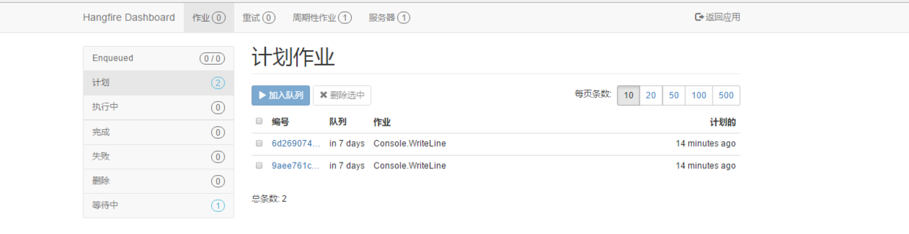
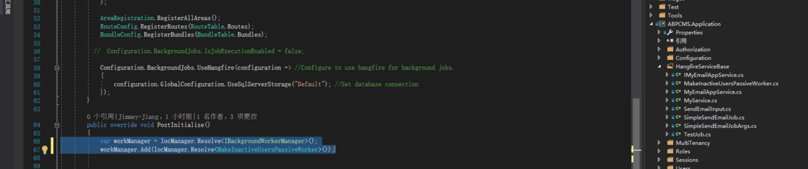
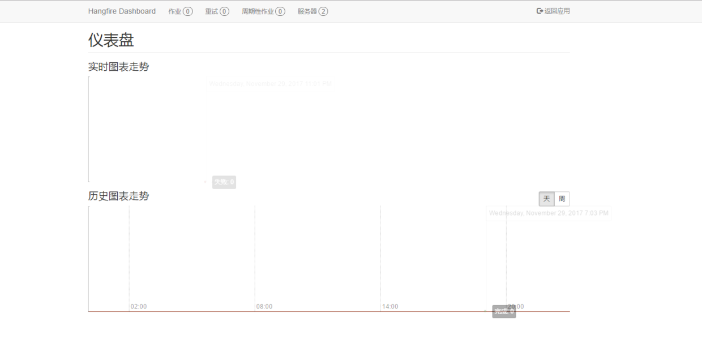
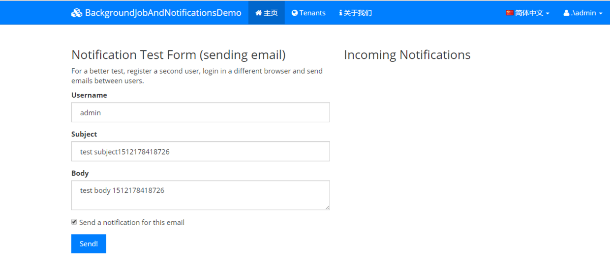
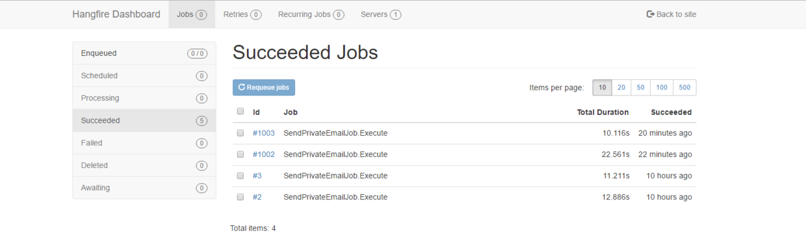

# 后台工作者HangFire与ABP框架Abp.Hangfire及扩展

​                                                   2017年11月30日 10:20:55           [安与生](https://me.csdn.net/ANYUSHENG)           阅读数 3736                   

​                   

HangFire与Quartz.NET相比主要是HangFire的内置提供集成化的控制台,方便后台查看及监控，对于大家来说，比较方便。

# HangFire是什么

Hangfire是一个开源框架（.NET任务调度框架），可以帮助您创建，处理和管理您的后台作业，处理你不希望放入请求处理管道的操作：

- 通知/通讯;
- xml，csv，json批量导入;
- 创建档案;
- 发射web hooks;
- 删除用户;
- 建立不同的图表;
- 图像/视频处理;
- 清除临时文件;
- 反复出现的自动报告;
- 数据库维护

Hangfire支持所有类型的后台任务 - 短时间运行和长时间运行， `CPU intensive` 和`I/O intensive`，一次性的和经常性的。你不需要重新发明轮子 ，可以直接使用。 
 Hangfire包含三大核心组件：客户端、持久化存储、服务端。看看官方的这张图：



## Hangfire基础

- **基于队列的任务处理(Fire-and-forget)** 
   延迟作业也只执行一次，但不会立即执行 - 只能在指定的时间间隔后执行。

```
var jobId = BackgroundJob.Schedule(
    () => Console.WriteLine("Delayed!"),
    TimeSpan.FromDays(7));123
```

- **定时执行(Recurring)** 
   按照指定的CRON计划， 重复执行的作业会被多次触发。

```
RecurringJob.AddOrUpdate(
    () => Console.WriteLine("Recurring!"),
    Cron.Daily);123
```

- **延续性执行(Continuations)** 
   延续性任务类似于.NET中的`Task`,可以在第一个任务执行完之后紧接着再次执行另外的任务：

```
BackgroundJob.ContinueWith(
    jobId,
    () => Console.WriteLine("Continuation!"));123
```

- **延时执行任务（Delayed）** 
   延迟作业也只执行一次，但不会立即执行 - 只能在指定的时间间隔后执行。

```
var jobId = BackgroundJob.Schedule(
    () => Console.WriteLine("Delayed!"),
    TimeSpan.FromDays(7));123
```

- **批处理（Batches）** 
   批处理是一组自动创建的后台作业。

```
var batchId = Batch.StartNew(x =>
{
    x.Enqueue(() => Console.WriteLine("Job 1"));
    x.Enqueue(() => Console.WriteLine("Job 2"));
});12345
```

- **延时批处理（Batch Continuations）** 
   批处理在父类完成后触发后台作业。

```
Batch.ContinueWith(batchId, x =>
{
    x.Enqueue(() => Console.WriteLine("Last Job"));
});1234
```

- **后台进程（Background Process）** 
   当你需要在应用程序的整个生命周期中连续运行后台进程时使用它们。 

```
public class CleanTempDirectoryProcess : IBackgroundProcess
{
    public void Execute(BackgroundProcessContext context)
    {
        Directory.CleanUp(Directory.GetTempDirectory());
        context.Wait(TimeSpan.FromHours(1));
    }
}12345678
```

后台作业是应用程序中非常重要的部分，`Hangfire`确保至少执行一次任务。要在应用程序重新启动之间保留后台作业信息，所有信息都将保存在您最喜欢的持久性存储中。 
         Hangfire将您的任务保存到持久化库汇总，并且以可靠的方式处理它们。这意味着，你可以中断`Hangfire Worder`的线程，重新加载应用程序域，或者终止程序，即使这样您的任务仍会被处理。只有在你代码的最后一行执行完成，`Hangfire`才会标记这个任务完成。并且知道任务可能在最后一行代码执行之前失败。它包含多种 自动-重试机制，它可以自动处理在存储或代码执行过程中发生的错误。 
        这对于通用托管环境（如IIS Server）非常重要。它们可以包含不的 
  [优化，超时和错误处理代码](https://github.com/odinserj/Hangfire/wiki/IIS-Can-Kill-Your-Threads)  （可能导致进程终止）来防止不好的事情发生。如果您没有使用可靠的处理和自动机制，您的工作可能会丢失。您的最终用户可能无限期等待某些任务，如电子邮件，报告，通知等。

## 实操演练

光说不练假把式，下面我们新建一个web项目,然后NuGet引入这几个程序集 
 

### 配置

然后在App_Start文件夹下Startup类配置下。 
 首先指定数据库,指定Hangfire使用内存存储后台任务信息. 
 `Hangfire.GlobalConfiguration.Configuration.UseSqlServerStorage("Default");` 
 然后启用HangfireServer这个中间件（它会自动释放） 
 `app.UseHangfireServer();` 
 然后启用Hangfire的仪表盘（可以看到任务的状态，进度等信息） 
 `app.UseHangfireDashboard();` 
 然后配置下前台路由

```
  app.UseHangfireDashboard("/hangfire", new DashboardOptions
 {
         Authorization = new[] { new AbpHangfireAuthorizationFilter() }
  });1234
```

然后就是加入上面已经列出的几个例子。

```
        var jobId = BackgroundJob.Schedule(
                () => Console.WriteLine("Delayed!"),
                TimeSpan.FromDays(7));


            RecurringJob.AddOrUpdate(
                        () => Console.WriteLine("Recurring!"),
                        Cron.Daily);

            BackgroundJob.ContinueWith(
                            jobId,
                            () => Console.WriteLine("Continuation!"));


            var jobId2 = BackgroundJob.Schedule(
                        () => Console.WriteLine("Delayed!"),
                        TimeSpan.FromDays(7));1234567891011121314151617
```

### 效果

运行项目，输入路径`http://<your-site>/hangfire`然后就可以看到界面了。 
 

 
  
 我们分别点击上面界面中的“加入队列”“立即执行按钮”，就得到下面这幅图片。 
  
 点击进去，可以看到如下图。 
  
 

界面看起来很清爽，而且一目了然。这就是可视化界面的好处。

## Abp.Hangfire

ASP.NET Boilerplate提供后台作业和后台工作者，用于在应用程序的后台线程中执行某些任务。 
 后台作业用于排队某些任务，以队列和持续的方式在后台执行。 
 我们可以通过从`BackgroundJob <TArgs>`类继承或直接实现`IBackgroundJob <TArgs>`接口来创建后台作业类。 
 这是最简单的后台工作：

```
public class TestJob : BackgroundJob<int>, ITransientDependency
{
    public override void Execute(int number)
    {
        Logger.Debug(number.ToString());
    }
}1234567
```

后台作业定义了一个Execute方法获取输入参数。参数类型被定义为泛型 类参数，如示例中所示。后台工作必须注册到依赖注入系统中，实现ITransientDependency是最简单的方式。下面定义一个更实际的工作，在后台队列中发送电子邮件：

```
public class SimpleSendEmailJob : BackgroundJob<SimpleSendEmailJobArgs>, ITransientDependency
{
    private readonly IRepository<User, long> _userRepository;
    private readonly IEmailSender _emailSender;

    public SimpleSendEmailJob(IRepository<User, long> userRepository, IEmailSender emailSender)
    {
        _userRepository = userRepository;
        _emailSender = emailSender;
    }

    public override void Execute(SimpleSendEmailJobArgs args)
    {
        var senderUser = _userRepository.Get(args.SenderUserId);
        var targetUser = _userRepository.Get(args.TargetUserId);

        _emailSender.Send(senderUser.EmailAddress, targetUser.EmailAddress, args.Subject, args.Body);
    }
}12345678910111213141516171819
```

我们注入了用户仓储（为了获得用户信息）和email发送者（发送邮件的服务），然后简单地发送了该邮件。SimpleSendEmailJobArgs是该工作的参数，它定义如下：

```
[Serializable]
public class SimpleSendEmailJobArgs
{
    public long SenderUserId { get; set; }

    public long TargetUserId { get; set; }

    public string Subject { get; set; }

    public string Body { get; set; }
}1234567891011
```

作业参数应该是可序列化的，因为它 被序列化并存储在数据库中。虽然ASP.NET Boilerplate默认后台作业管理器使用JSON 序列化（不需要`[Serializable]`属性），但最好定义`[Serializable]`属性，因为将来可能会切换到另一个作业管理器，在二进制序列化。保持你的参数简单（如 DTO），不要包含 实体或其他不可序列化的对象。如`SimpleSendEmailJob`示例所示，我们只能存储 一个实体的Id，并从作业中的存储库获取该实体。将新作业添加到队列中定义后台作业后，我们可以注入并使用`IBackgroundJobManager` 将作业添加到队列中。查看上面定义的`TestJob`示例：

```
public class MyService
{
    private readonly IBackgroundJobManager _backgroundJobManager;

    public MyService(IBackgroundJobManager backgroundJobManager)
    {
        _backgroundJobManager = backgroundJobManager;
    }

    public void Test()
    {
        _backgroundJobManager.Enqueue<TestJob, int>(42);
    }
}1234567891011121314
```

当入队（Enqueue）时，我们将42作为参数传递。`IBackgroundJobManager`将会实例化并使用42作为参数执行`TestJob`。 
 让我们看一下如何为上面定义的`SimpleSendEmailJob`添加一个新的工作：

```
[AbpAuthorize]
public class MyEmailAppService : ApplicationService, IMyEmailAppService
{
    private readonly IBackgroundJobManager _backgroundJobManager;

    public MyEmailAppService(IBackgroundJobManager backgroundJobManager)
    {
        _backgroundJobManager = backgroundJobManager;
    }

    public async Task SendEmail(SendEmailInput input)
    {
            await _backgroundJobManager.EnqueueAsync<SimpleSendEmailJob, SimpleSendEmailJobArgs>(
            new SimpleSendEmailJobArgs
            {
                Subject = input.Subject,
                Body = input.Body,
                SenderUserId = AbpSession.GetUserId(),
                TargetUserId = input.TargetUserId
            });
    }
}12345678910111213141516171819202122
```

`Enqueu`（或`EnqueueAsync`）方法具有其他参数，如优先级 和延迟。

#### 默认后台作业管理器

IBackgroundJobManager由BackgroundJobManager默认实现。它可以被另一个后台作业提供者替代（参见 hangfire集成）。有关默认BackgroundJobManager的一些信息： 

这是一个简单的作业队列在 单线程中作为FIFO使用。它使用IBackgroundJobStore来坚持作业。 

- 它重试作业执行，直到作业 成功运行（不会抛出任何异常，但记录它们）或 超时。作业的默认超时时间为2天。 

- 它成功执行时从商店（数据库）中删除作业。如果超时，则将其设置为废弃并保留在数据库中。 

- 它越来越多地等待重新工作。等待1分钟第一次重试，2分钟第二次重试，4分钟第三次重试等等。 

- 它以固定的时间间隔轮询商店的工作。按优先级（asc）查询作业，然后按try count（asc）进行排序。

#### 后台工作存储

默认的`BackgroundJobManager`需要一个数据存储来保存和获取作业。如果您没有实现`IBackgroundJobStore`，那么它使用 `InMemoryBackgroundJobStore`，它不会将作业保存在持久数据库中。您可以简单地实现它来将作业存储在数据库中，或者可以使用 已经实现它的`module-zero`。 
 如果您使用第三方工作经理（如 `Hanfgire`），则无需实施`IBackgroundJobStore`。

#### 配置

您可以在 模块的`PreInitialize`方法中使用`Configuration.BackgroundJobs`来配置后台作业系统。 
 禁用作业执行 
 您可能需要为应用程序禁用后台作业执行：

```
public class MyProjectWebModule : AbpModule
{
    public override void PreInitialize()
    {
        Configuration.BackgroundJobs.IsJobExecutionEnabled = false;
    }

    //...
}123456789
```

这种情况很少见。但是，认为您正在同一个数据库上运行应用程序的多个实例（在Web场中）。在这种情况下，每个应用程序将查询作业的相同数据库并执行它们。这导致同一个工作的多个执行和一些其他问题。为了防止它，你有两个选择： 
 \- 您只能为应用程序的一个实例启用作业执行。 
 \- 您可以禁用所有Web应用程序实例的作业执行，并创建一个执行后台作业的独立应用程序（例如：Windows服务）。

#### 异常处理

由于默认的后台作业管理器应该重新尝试失败的作业，它会处理（并记录）所有异常。如果你想在发生异常时得到通知，你可以创建一个事件处理程序来处理`AbpHandledExceptionData`。后台管理器用一个包装了真正异常的`BackgroundJobException`异常对象触发这个事件（对于实际的异常，得到`InnerException`）。

#### Hangfire集成

- 后台作业管理器被设计为可被另一个后台作业管理器替换。请参阅 Hangfire集成文档以用Hangfire替换它。
- 后台工作者与后台工作不同。它们是在后台运行的应用程序中的简单 独立线程。通常，他们定期执行一些任务。例子;
- 后台工作人员可以定期运行以 删除旧日志。
- 后台工作人员可以定期来 判断非活跃用户和发送电子邮件要返回给应用程序。

#### 创建一个后台工作者

要创建一个后台工作者，我们应该实现 `IBackgroundWorker`接口。或者，我们可以根据我们的需要从`BackgroundWorkerBase`或`PeriodicBackgroundWorkerBase`继承 。 
 假设我们想在最近30天内没有登录到应用程序，使用户状态passive。看代码：

```
public class MakeInactiveUsersPassiveWorker : PeriodicBackgroundWorkerBase, ISingletonDependency
{
    private readonly IRepository<User, long> _userRepository;

    public MakeInactiveUsersPassiveWorker(AbpTimer timer, IRepository<User, long> userRepository)
        : base(timer)
    {
        _userRepository = userRepository;
        Timer.Period = 5000; //5 seconds (good for tests, but normally will be more)
    }

    [UnitOfWork]
    protected override void DoWork()
    {
        using (CurrentUnitOfWork.DisableFilter(AbpDataFilters.MayHaveTenant))
        {
            var oneMonthAgo = Clock.Now.Subtract(TimeSpan.FromDays(30));

            var inactiveUsers = _userRepository.GetAllList(u =>
                u.IsActive &&
                ((u.LastLoginTime < oneMonthAgo && u.LastLoginTime != null) || (u.CreationTime < oneMonthAgo && u.LastLoginTime == null))
                );

            foreach (var inactiveUser in inactiveUsers)
            {
                inactiveUser.IsActive = false;
                Logger.Info(inactiveUser + " made passive since he/she did not login in last 30 days.");
            }

            CurrentUnitOfWork.SaveChanges();
        }
    }
}123456789101112131415161718192021222324252627282930313233
```

这是现实的代码，可以直接在`module-zero`的 ASP.NET Boilerplate中运行 。 
 \- 如果您从`PeriodicBackgroundWorkerBase`派生（如本示例中所示），则应该实施`DoWork`方法来执行您的定期工作代码。 
 \- 如果从`BackgroundWorkerBase`派生或直接实现`IBackgroundWorker`，则将覆盖/实现`Start`，`Stop`和`WaitToStop`方法。`Start`和`Stop`方法应该是非阻塞的，`WaitToStop`方法应该等待 `worker`完成当前的关键任务。

#### 注册后台工作者

创建后台工作者后，我们应该将其添加到 `IBackgroundWorkerManager`。最常见的地方是你的模块的`PostInitialize`方法：

```
public class MyProjectWebModule : AbpModule
{
    //...

    public override void PostInitialize()
    {
        var workManager = IocManager.Resolve<IBackgroundWorkerManager>();
        workManager.Add(IocManager.Resolve<MakeInactiveUsersPassiveWorker>());
    }
}12345678910
```

虽然我们通常在`PostInitialize`中加入工作人员，但对此没有限制。您可以在任何地方注入`IBackgroundWorkerManager`，并在运行时添加工作人员。当您的应用程序正在关闭时，`IBackgroundWorkerManager`将停止并释放所有注册的工作人员。

#### 后台工作者生命周期

后台工作人员通常以单例的。但是没有限制。如果您需要同一工人类的多个实例，则可以将其设置为暂时的，并向`IBackgroundWorkerManager`添加多个实例。在这种情况下，您的工作人员可能是参数化的（例如，您有一个`LogCleaner`类，但是他们监视的两个`LogCleaner`工作者实例并清除不同的日志文件夹）。

#### 高级调度

ASP.NET Boilerplate的后台工作系统很简单。除了定期运行的工人之外，它没有一个时间表系统。如果您需要更高级的计划功能，我们建议您检查`Quartz`或其他库。

#### 让您的应用程序一直运行

后台作业和工作人员只有在您的应用程序正在运行时才有效  如果很长一段时间没有对Web应用程序执行任何请求，ASP.NET应用程序将默认关闭。因此，如果您在Web应用程序中托管后台作业（这是默认行为），则应确保您的Web应用程序配置为始终运行。否则，后台作业只在您的应用程序正在使用时才起作用。  
 有一些技术来完成这一点。最简单的方法是定期从外部应用程序请求您的Web应用程序。因此，您也可以检查您的Web应用程序是否已启动并正在运行。 [Hangfire](http://docs.hangfire.io/en/latest/deployment-to-production/making-aspnet-app-always-running.html)文档解释了其他一些方法。 
 通过以上官方文档，我们在程序里配置一下。 
 

运行一下效果是一样的。 
  
 

## Hangfire优点

`Hangfire`是一个后台可监控的应用，不用每次都要从服务器拉取日志查看，在没有ELK的时候相当不方便。`Hangfire`控制面板不仅提供监控，也可以手动的触发执行定时任务。如果在定时任务处理方面没有很高的要求，比如一定要5s定时执行，`Hangfire`值得拥有。抛开这些，`Hangfire`优势太明显了： 

- 持久化保存任务、队列、统计信息
- 重试机制
- 多语言支持
- 支持任务取消
- 支持按指定`Job Queue`处理任务
- 服务器端工作线程可控，即`job`执行并发数控制
- 分布式部署，支持高可用
- 良好的扩展性，如支持`IOC`、`Hangfire Dashboard`授权控制、`Asp.net Core`、持久化存储等

## Hangfire扩展

Hangfire扩展性大家可以参考[这里](http://hangfire.io/extensions.html)，有几个扩展是很实用的.下面这些关于Hangfire扩展大家可以自己查资料。后面如果有机会的话，我再补上。

- Hangfire Dashborad日志查看
- Hangfire Dashborad授权
- IOC容器之Autofac
- RecurringJob扩展
- 与MSMQ集成
- 持久化存储之Redis

## 福利及其他

其实Hangfire还是蛮简单的。如果你需要了解更多关于Abp.Hangfire的内容，建议你去看一下github上一个专门关于Abp.Hangfire的demo， 
 地址:<https://github.com/aspnetboilerplate/aspnetboilerplate-samples/tree/master/BackgroundJobAndNotificationsDemo> 
 另外 [ABP后台工作者类使用HANGFIRE](http://www.cnblogs.com/94pm/p/6803829.html)这篇文章 
 讲解abp Hangfire 缺点是工作者类依赖了具体的基类（PeriodicBackgroundWorkerBase），就会存在应用程序耦合。以及解决耦合的办法，算是对abp Hangfire的扩展，我不太认同，各有看法吧。

就以上面我说到的项目 abp Hangfire demo 项目  BackgroundJobAndNotificationsDemo为例，首先是一个创建邮件发送的任务。 
  
  
 ，创建到数据库之后，HangFire会自动在数据库创建几张表。 
  
 然后配置我上面说到的几个配置步骤之后。运行项目可以看到。每隔5秒钟会请求一下后台任务。 
  
 界面上就有了相应的效果 
 

 
 大家可以自行下载Demo下来看一下相关的写法以及配置。

> [后台工作者HangFire与ABP框架Abp.Hangfire及扩展](http://www.jianshu.com/p/ebe390e48479)