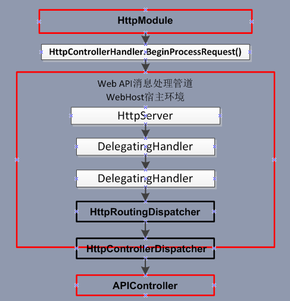

##  调用流程


#### 当进入ASP.NET请求管道中时，

在HttpModel中通过事件对其请求进行拦截后， 
然后利用UrlRoutingModel中注册的路由对象对当前请求的URL进行匹配， 
若匹配通过由对应匹配的路由解析并生成一个RouteData对象， 
当然这个Route对象就是HttpWebRoute对象， 
接着利用RouteData对象对应的Route来获得RouteHandler， 
这个RouteHandler就是HttpControllerRouteHandler， 
接着利用UrlRoutingModel中得到的RouteData和当前上下文HttpContext生成一个请求上下文对象，再以该请求上下文对象为对象调用HttpControllerRouteHandler上的GetHttpHandler方法获得HttpHandler（返回的是HttpControllerHandler）， 
并将HttpHandler映射到当前上下文HttpContext中， 
然后调用HttpControllerHandler上继承自IHttpAsyncHandler上的BeginProcessRequest方法开始进入Web  API管道。



## 重构

- 重复的代码
- 过长的函数
- 过大的类
- 过长的参数列
- 少用switch-case
- 免写出条件式代码14
- 过度耦合 

> 重构                【[皮斯特劳沃](https://me.csdn.net/pistolove)】 
> https://blog.csdn.net/pistolove/article/category/2683633

## 接口整合

尽量使用缓存，包括用户缓存，信息缓存等，多花点内存来做缓存，可以大量减少与数据库的交互，提高性能。

> ​	优化数据库查询语句。
> ​    优化数据库结构，多做索引，提高查询效率。
> ​    统计的功能尽量做缓存，或按每天一统计或定时统计相关报表，避免需要时进行统计的功能。
> ​    能使用静态页面的地方尽量使用，减少容器的解析（尽量将动态内容生成静态html来显示）。
> ​    解决以上问题后，使用服务器集群来解决单台的瓶颈问题。

## EF

#####  贪婪加载： 
**顾名思议就是把所有要加载的东西一 次性读取 
```
using (var context = new MyDbContext()) 
 {  var orders = from o in context.Orders.Include("OrderDetails") select o;}
```
当读取订单信息orders的时候，我们希望把订单的详细信息也读取出来，那么这里我们使用**Include**关键字将关联表也加载进 来。 
> 1、减少数据访问的延迟，在一次数据库的访问中返回所有的数据。
> 2、一次性读取所有相关的数据，可能导致部分数据实际无需用到，从而导致读取数据的速度变慢，效率变低

#####  **延迟加载：**

即当我们需要用到的时候才进行加载（读取） 
使用Lamabda表达式或者Linq 从 EF实体对象中查询数据时，EF并不是直接将数据查询出来，而是在用到具体数据的时候才会加载到内存。 
当我们希望浏览某条订单信息的时候，才显示其对应的订单详细记录时，我们希望使用延迟加载来实现，这样不仅加快的了 读取的效率，同时也避免加载不需要的数据。延迟加载通常用于foreach循环读取数据时。 
> 1、只在需要读取关联数据的时候才进行加载
> 2、可能因为数据访问的延迟而降低性能，因为循环中，每一条数据都会访问一次数据库，导致数据库的压力加大

### [EF延迟加载及原理深入解析](https://www.cnblogs.com/jasonwb/articles/3505130.html) 
> https://www.cnblogs.com/jasonwb/articles/3505130.html 
#### [EF延迟加载及原理深入解析](https://www.cnblogs.com/jasonwb/articles/3505130.html)

###	综上所述

我们应该比较清楚时候应该使用哪种机制？我个人的建议是： 
1、如果是在foreach循环中加载数据，那么使用延迟加载会比较好， 因为不需要一次性将所有数据读取出来，这样虽然有可能会造成n次数据库的查询，但 是基本上在可以接受的范围内。 
2、如果在开发时就可以预见需要一次性加载所有的数据，包含关联表的所有数据， 那么使用使用贪婪加载是比较好的选择，但是此种方式会导致效率问题，特别是数据量大的情况下。

##### 	 延迟加载优点

延迟加载的优点是使用的时候才会去加载，特别是去查询导航属性的时候，这样EF只需要去查询使用的内容，避免了查询出多余的数据

##### 	延迟加载缺点 
会查询多次SalesOrder表，增加数据库的压力，

##### 使用建议 
只有在当前导航属性的内容每次都需要加载的时候就，采用Include("[导航属性]")来一次性加载过来，减少查询次数

 

## 落实过程中的问题
### 版本号 
### UEider匹配 
### Execl在WebAPI上传下载 
###	协作事务管理，协调工作

 

## 高并发


可以控制连接池的连接数量条件好的话 可以用负载平衡


## 分布式 
###	**事务补偿机制**	正逆操作对应 
每一个业务服务或操作都有对应的可逆服务；可撤销可返回的才做一一对应

对于事务链上的任何一个服务正向和逆向操作均在事务管理和协同器上注册，由事务管理器接管所有的事务补偿和回滚操作。

### 	**事件源机制**	消费中间件消息 
两个服务的真正解耦，关键就是异步消息和消息持久化机制 
对于转账操作： 
> 第一步调用本地的取款服务， 
> 第二步发送异地取款的异步消息到**消息中间件**。

如果第二步在本地，则保证事务的完整性基本无任何问题，即本身就是本地事务的管理机制。 
只要两个操作都成功即可以返回客户成功。如果服务调用失败则进行重试。 
中间过渡状态等待，在**约定的窗口期**内保证最终一致性。 
> **事件源机制** 
> ​	https://mp.weixin.qq.com/s/w93v5q60bQ3vveF4XLslIQ?

事件源不仅解耦，也是微服务分布式查询的一个大前提，也就是是CQRS的大前提。


若采用事务补偿机制，基本可以是做到准实时的补偿，不会有太大的影响。必须要考虑客户需要的是否一定是最终一致性，**承受度**是如何的(忍受)。

而如果采用基于消息的最终一致性方式，则可能整个周期比较长，需要较长的时间才能给得到最终的一致性。

**隔离性** 要求下，考虑添加业务锁

**聚合内事务** 
用代码弥补数据库的非事务性，分摊一部分处理分布式事务的麻烦 
> 很多nosq数据库并不支持跨聚合事务，但在聚合内却能保证事务，所以在很多时候，我们可以把往常涉及到多个操作的组合合并到一个聚合内来操作，这样也算是一种分布式事务吧。虽然这些数据库并不支持跨聚合事务，但在一个聚合内却是支持事务的。

###	MongoDB**扇出写**

扇出读、扇出写的说法是基于社交网络的海量用户、海量数据的应用特征。这些大量的数据往往分布在各个分片服务器上。扇出读是一种比较常规的做法，就是当你需要去获得所有你关注用户的最新更新的时候，你就去到每一个你关注用户的数据区，把最新的一些数据取回来。因为需要去到不同的分片服务器去取，所以叫做扇出读。大家可以想象，这种扇出读的效率不会太高，基本上是最慢的那个服务器的响应时间决定了总体的响应时间。  当然，这种方式是比较简单的，不需要特殊处理。 


扇出写，我称之为土豪玩法。具体来说就是当发布的时候，一条数据会写多次，直接写到每一个关注你的粉丝的墙上。这样做的好处是当你的粉丝读他自己的微博墙的时候，他只需要去一个地方就可以把所有最新的更新连续取回来。由于一个用户的数据可一般可以存储在同一台服务器上的同一个区域，通过这种方式可以实现快速的读取微博墙数据。  代价当然也是很明显： 你的写入需求会被放大几十几百倍，存储也是相应的扩大几十几百倍。这个绝对不是关系型数据库的玩法，但是在MongoD  模式设计，这个很正常。只要保证性能，什么事情都做得出来。


