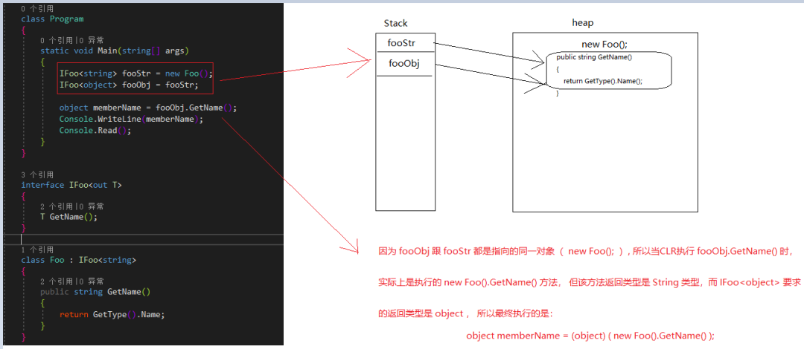
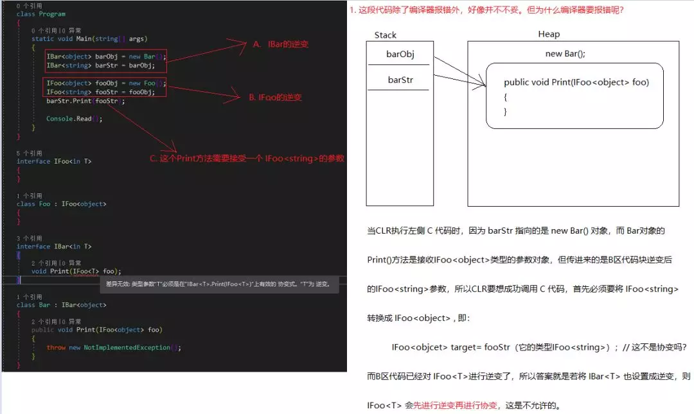

##                                                                             C# 协变、逆变 看完这篇就懂了                       

​                                                                                                                                                 [                         DotNet                      ](javascript:void(0);)                                                                   *5天前*                      

（给DotNet加星标，提升.Net技能）


> 转自：Virgil-Zhou
>
> cnblogs.com/VVStudy/p/11404300.html


**一、基本概念**


官方：协变和逆变都是术语，前者指能够使用比原始指定的派生类型的派生程度更大（更具体的）的类型，后者指能够使用比原始指定的派生类型的派生程度更小（不太具体的）的类型。


**公式：**


协变：IFoo<父类> = IFoo<子类>；


逆变：IBar<子类> =  IBar<父类>；


暂时不理解没关系，您接着往下看。


**二、协变(Covariance)**


**1、out关键字**


对于泛型类型参数，out 关键字可指定类型参数是协变的。 可以在泛型接口和委托中使用 out 关键字。[MSDN] 


**2、鲁迅：**一张图胜过千言万语（图小看不清，点击放大查看）





备注：泛型委托的协变原理也是一样的。


**3、什么是协变？**


协变就是对具体成员的输出参数进行一次类型转换，且类型转换的准则是 “里氏替换原则”。


**三、逆变(Contravariance)**


**1、in关键字**


对于泛型类型参数，in 关键字可指定类型参数是逆变的。 可以在泛型接口和委托中使用 in 关键字。


**2、鲁迅：**一张图胜过千言万语（图小看不清，点击放大查看）





**备注：**泛型委托的逆变原理也是一样的。


**3、什么是逆变？**


逆变就是对具体成员的输入参数进行一次类型转换，且类型转换的准则是"里氏替换原则"。


**四、自问自答**


**1、协变、逆变 为什么只能针对泛型接口或者委托？而不能针对泛型类？**


因为它们都只能定义方法成员（接口不能定义字段），而方法成员在创建对象的时候是不涉及到对象内存分配的，所以它们是类型（内存）安全的。


为什么不针对泛型？因为泛型类是模板类，而类成员是包含字段的，不同类型的字段是影响对象内存分配的，没有派生关系的类型它们是不兼容的，也是内存不安全的。


**2、协变、逆变 为什么是类型安全的？**


本质上是里氏替换原则，由里氏替换原则可知：派生程度小的是派生程度大的子集，所以子类替换父类的位置整个程序功能都不会发生改变。


**3、官方对 协变、逆变 的定义现在是否能看懂？**


上面看懂了，官方定义肯定也是没问题的。派生程度小可以理解为基类，派生程度大可以理解为子类或派生类，至于为什么用程度这个词，是因为继承链的深度是没限制的。


**4、为什么 in 、out 只能是单向的（输入或输出）？**


因为若类型参数同时为输入参数和输出参数，则必然会有一种转换不符合里氏替换原则，即将父类型的变量赋值给子类型的变量，这是不安全的所以需要明确指定 in 或 out。


**五、协变和逆变的相互作用**


首先我们先看一道经典的题目


```
interface IFoo<in T> { }// 应该是 ininterface IBar<in T>{    void Print(IFoo<T> foo);}// 还是应该是 outinterface IBar<out T>{    void Print(IFoo<T> foo);}
```


看过这道题目的人应该知道是 out ，但这是为什么呢？为什么 in 不行？要知道 in 行不行直接举出一个反例即可，还是鲁迅那句话"一张图胜过千言万语"。


**总结**


1、将可变成员作为方法的输入参数，则当前成员的泛型参数可变性必须与输入成员的泛型参数可变性相反。


2、将可变成员作为方法的返回参数，则当前成员的泛型参数可变性必须与输出成员的泛型参数可变性相同。