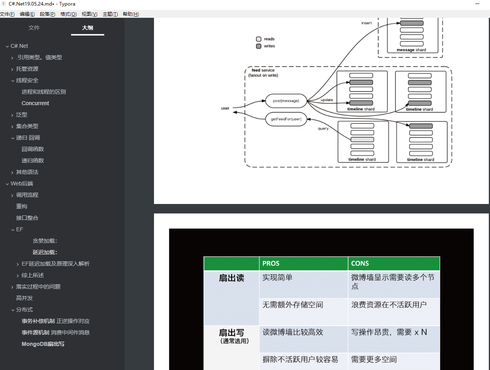
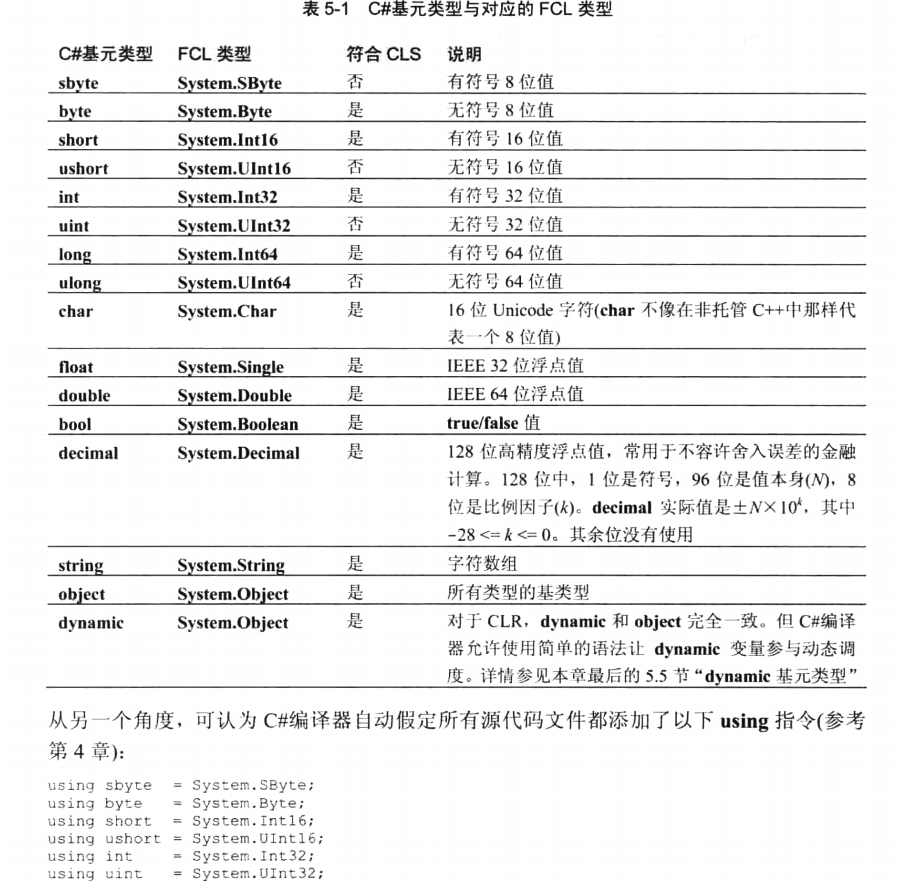
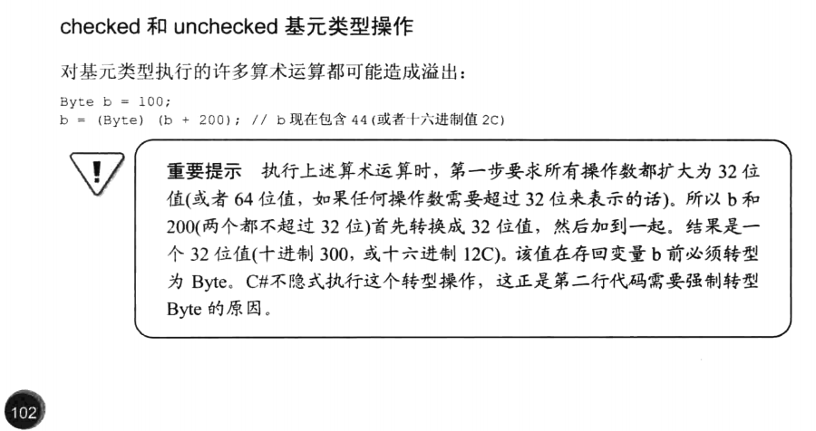
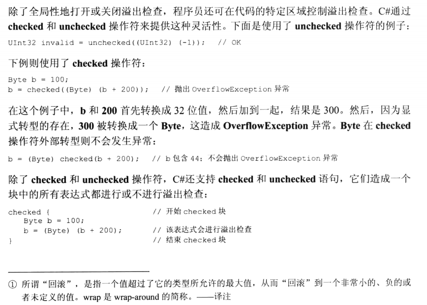
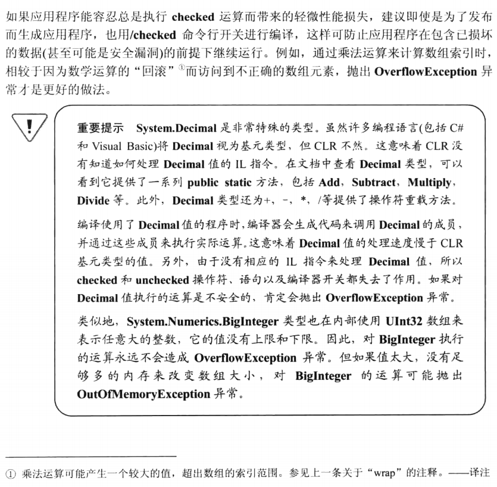
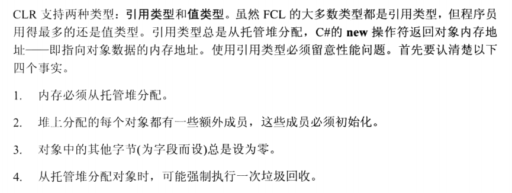
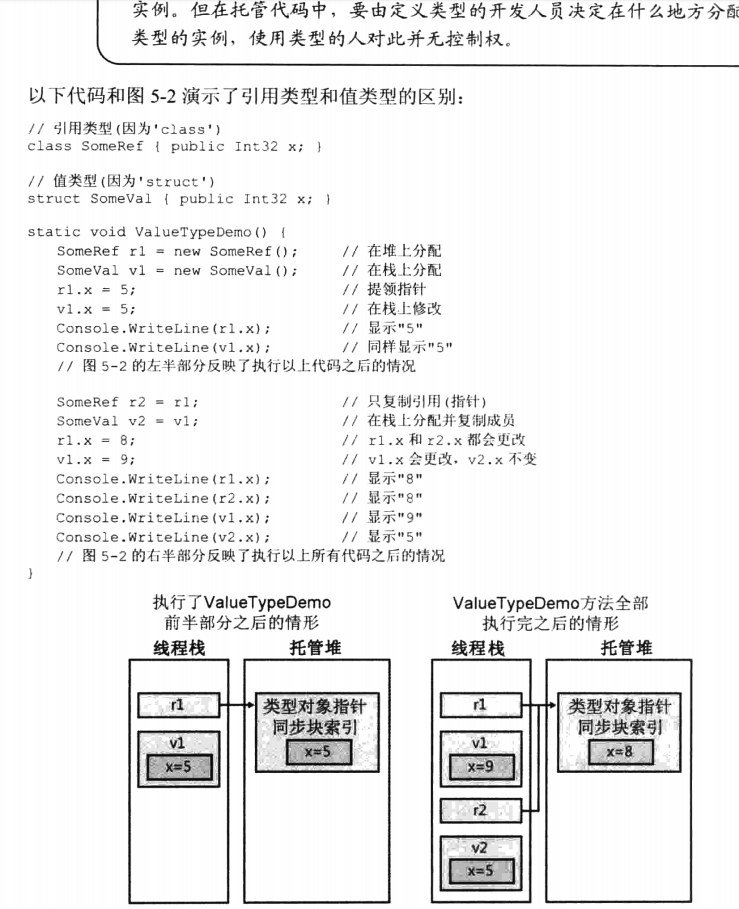
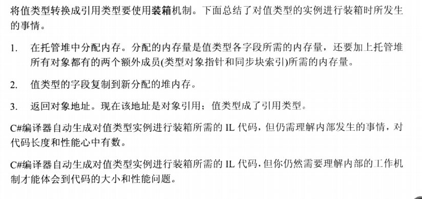
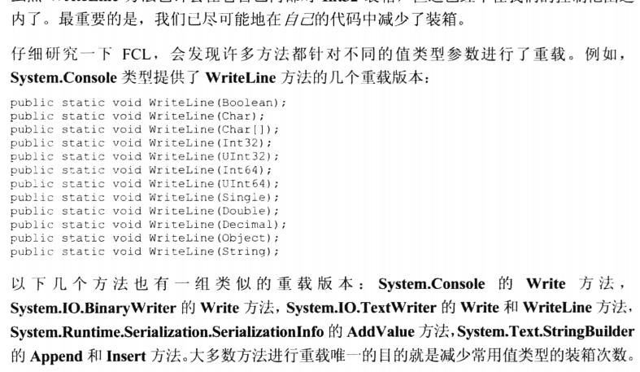

# C#.Net


### 基元类型

C#与FCL类型

``` 
System.Int32	====		int
```




#####	Checked操作





#####	Decimal




##	.引用类型。值类型


值类型：结构体（数值类型，bool型，用户定义的结构体），枚举，可空类型。

引用类型：数组，用户定义的类、接口、委托，object，字符串。

但引用类型要认清的：




### 堆和栈的区别

> 答:栈是编译期间就分配好的内存空间，因此你的代码中必须就栈的大小有明确的定义；堆是程序运行期间动态分配的内存空间，你可以根据程序的运行情况确定要分配的堆内存的大小.


### 类与结构的区别

> 　　1)、结构是值类型；
> 　　2)、结构不支持继承；
> 　　3)、结构不能定义默认的构造函数；
> 　　4)、结构不能定义析构函数；
> 　　5)、结构不能使用初始值设置域值 

**线程池**	&& **托管堆**



### 深拷贝 浅拷贝

#####	浅拷贝　

将对象中的所有字段复制到新的对象（副本）中。其中，值类型字段的值被复制到副本中后，在副本中的修改不会影响到源对象对应的值。而引用类型的字段被复制到副本中的是引用类型的引用，而不是引用的对象，在副本中对引用类型的字段值做修改会影响到源对象本身。


#####	深拷贝

同样，将对象中的所有字段复制到新的对象中。不过，无论是对象的值类型字段，还是引用类型字段，都会被重新创建并赋值，对于副本的修改，不会影响到源对象本身。

## OOP

###	继承性（inheritance）

> 继承的思想实现了 **属于（IS-A）** 关系。例如，哺乳动物 **属于（IS-A）** 动物，狗 **属于（IS-A）** 哺乳动物，因此狗 **属于（IS-A）** 动物

### 封装性（encapsulation）

抽象和封装是面向对象程序设计的相关特性。抽象允许相关信息可视化，封装则使开发者*实现所需级别的抽象*。 
> C# 封装根据具体的需要，设置使用者的访问权限，并通过 **访问修饰符** 来实现。 
> https://www.runoob.com/csharp/csharp-encapsulation.html 
> 一个 **访问修饰符** 定义了一个类成员的范围和可见性。C# 支持的访问修饰符如下所示： 
>
> > - public：所有对象都可以访问；
> > - private：对象本身在对象内部可以访问；
> > - protected：只有该类对象及其子类对象可以访问
> > - internal：同一个程序集的对象可以访问；
> > - protected internal：访问限于当前程序集或派生自包含类的类型。
> >


### 多态性（polymorphism）

面向对象的编程使用了派生继承 以及虚函数机制. 
一个本来指向基类的对象指针可以指向其派生类的.并访问从基类继承而来的成员变量和函数. 
而虚函数是专门为这个特性设计的,这个函数在每个基类的派生类中都是同一个名字,但函数体却并不一定相同,派生类往往为实现自己的功能而修改这个虚函数.这样用一个指针就能够实现对多种不同的派生类的访问, 并实现其派生类的特定功能(代码 )

> **多态性**意味着有多重形式。在面向对象编程范式中，多态性往往表现为"一个接口，多个功能"。 
> 多态性可以是**静态**的或**动态**的。  
> https://www.runoob.com/csharp/csharp-polymorphism.html 
> 在**静态多态性**中，函数的响应是在编译时发生的。【函数重载，运算符重载】 
> 在**动态多态性**中，函数的响应是在运行时发生的。【**abstract** 抽象类	**virtual**虚方法】

### 	所有类的基类就是Object【System.Object】

> 支持 .[NET](https://www.baidu.com/s?wd=NET&tn=SE_PcZhidaonwhc_ngpagmjz&rsv_dl=gh_pc_zhidao) Framework 类层次结构中的所有类，并为派生类提供低级别服务。这是 .NET Framework 中所有类的最终基类；它是类型层次结构的根。
>
> 如果说你的意思是所有类的最终基类，那么答案是Object，这个也决定了.[NET](https://www.baidu.com/s?wd=NET&tn=SE_PcZhidaonwhc_ngpagmjz&rsv_dl=gh_pc_zhidao)平台的单根性质
>
> https://zhidao.baidu.com/question/579224748.html

### static静态成员

> 成员变量和成员函数前加static的作用？
>
> 答:它们被称为常成员变量和常成员函数，又称为类成员变量和类成员函数。分别用来反映类的状态。比如类成员变量可以用来统计类实例的数量，类成员函数负责这种统计的动作。

### 重载重写和覆盖

##### 重载（Overload）

是重新加载的意思，指的是同一个类中同名，但是参数列表不同的方法组（返回值不能区别函数是否重载），重载没有关键字。通俗点说重载是对内存中同一个类中的函数或方法进行重新加载的意思。

##### 重写（Override）

指子类修改父类中某个函数的函数体，需要重写的父类中的函数必须是由virtual、abstract 或override标注的，不能重写非虚方法或静态方法。
  Override是在继承的时候，如果你写的函数与要继承的函数函数特征（函数特征包括函数名，参数的类型和个数）相同，那么，加上这个关键字，在使用这个子类的这个函数的时候就看不见父类（或超类）的函数了，它被覆盖掉了。


##### 覆盖

   1、示意	覆盖指重新定义子类中与父类具有相同函数特征的的函数体。子类中有一函数和父类中函数的函数特征相同，但函数体不同，称为覆盖。这种覆盖又称为隐藏，是隐藏父类中相同的函数，并没有进行重写。

   2、发生条件	  在子类中写一个和基类一样名字(参数不同也算)的非虚函数,会让基类中的函数被隐藏,编译后会提示要求使用New关键字。

### using和new

> 在c#中using和new这两个关键字有什么意义，请写出你所知道的意义？using 指令 和语句 new 创建实例 new 隐藏基类中方法。
>
> 答：using 引入名称空间或者使用非托管资源,new 新建实例或者隐藏父类方法.


### 虚函数vs抽像函数 
答：虚函数：可由子类继承并重写的函数。抽像函数：规定其非虚子类必须实现的函数，必须被重写。


###   property 与 attribute 
attribute:自定义属性的基类; 
property :类中的属性


## 托管资源 

> IDisposable接口的类，以下哪些项可以执行与释放或重置非托管资源相关的应用程序定义的任务？(多选) (   ABC     )
>
> A.Close		B.Dispose 
> C.Finalize	D.using    


### GC是什么? 为什么要有GC?

> 答：GC是垃圾收集器。程序员不用担心内存管理，因为垃圾收集器会自动进行管理

垃圾回收（GC）功能，它替代了程序员 不过在C#中，不能直接实现Finalize方法，而是在析构函数中调用基类的Finalize()方法

## 线程安全

###  进程和线程的区别

线程和进程有区别 
进程是系统进行资源分配和调度的单位；线程是CPU调度和分派的单位，一个进程可以有多个线程，这些线程共享这个进程的资源。 
System.Threading.ThreaPool 类型封装了线程池的操作

###	**Concurrent**

类型必须实现以在 **BlockingCollection** 中使用的接口。 
> 若要确保枚举过程中的线程安全，可以在整个枚举过程中锁定集合。若要允许多个线程访问集合以进行读写操作，则必须实现自己的同步。 
.NET在4.0里面提供了专门的**并行类，来弥补相关集合类的线程安全性**。


## 泛型

从编程的角度说是在定义类或者方法的时候省去具体的类型，由调用者来指定，类型+泛型类型合成得到真正的类型。从实现机制上说，泛型是CLR在运行时动态根据泛型类型创建的匿名类型。 
从OO设计的角度说，泛型体现了多态性。泛型使得程序员可以复用数据结构和算法，并且适应不同的类型，享有编译期间的强类型检查和语法提示。 
> 一些经典的FCL提供的泛型类型和接口：    
> List<T>、Dictionary<T1, T2>这个属于复用数据结构  　 
> IComparer<T>、IEnumerable<T>这个属于复用算法 
> http://www.mamicode.com/info-detail-2436360.html

 

OOP三大特性之一的继承，我们知道，C#语言中，object是所有类型的基类

> 1、object类型是一切类型的父类。 
> 2、通过继承，子类拥有父类的一切属性和行为，任何父类出现的地方，都可以用子类来代替。 
> 但是上面object类型的方法又会带来另外一个问题：装箱和拆箱，会损耗程序的性能。 
> 微软在C#2.0的时候推出了泛型，可以很好的解决上面的问题。

###	作用： 
为了促进代码的重用，尤其是算法的重用

###	优势：

（1）可重用性
（2）类型安全，在参数化的类中只有成员明确希望的数据类型才可以使用
（3）性能：避免了从Object的强制转换和值类型的装箱
（4）减小了内存消耗：避免装箱也就不在需要消耗堆上的内存。

>
> 执行时的行为：泛型也是对象，泛型类的“类型参数”变成了元数据；CLR会在需要的时候构造利用它们的类。
>
> 一个泛型类经过编译好之后和普通的类并没有什么区别。编译的结果只有元数据和CIL。基于值类型的泛型实例化：CLR会讲指定的类型参数放到CIL中合适的位置，从而创建一个具体化的泛型类型。所以CLR会为没个新的参数值创建具体的泛型类型
> 基于引用类型的实例化：CLR会创建一个具体化的泛型类型。以后，每次用一个引用类型参数来说实例化一个构造好的类型时，并在CIL中用Object引用替换类型参数，CLR都会重用以前生成好的泛型版本

**List<T>和T[]的区别是什么，平时你如何进行选择？**

> List<T>arrylist的泛型版本，大小是可变的，
>
> T[]继承自Array,大小是固定的。如果大小没有怎么变化，选择T[],一般情况下选择List<T>

### 拆箱装箱

从值类型接口转换到引用类型装箱。 
从引用类型转换到值类型拆箱。【p111】



#####	重载减少装箱




### 字典Dict和Hashtable

Dictionary<TKey, TValue>是做什么的？ 
.NET BCL中还有哪些常用的容器？它们分别是如何实现的（哪种数据结构）？分别是适用于哪些场景？ 

> Dictionary是hashtable的泛型版本，用来存储键值对的.例如：sortlist，stack等

### 	泛型类型参数

> 在泛型类型或方法定义中，类型参数是在其实例化泛型类型的一个变量时，客户端指定的特定类型的占位符。  泛型类( `GenericList<T>`)无法按原样使用，因为它不是真正的类型；它更像是类型的蓝图。 若要使用 `GenericList<T>`，客户端代码必须通过指定尖括号内的类型参数来声明并实例化构造类型。 此特定类的类型参数可以是编译器可识别的任何类型。 可创建任意数量的构造类型实例，其中每个使用不同的类型参数。
>
> https://www.cnblogs.com/dotnet261010/p/9034594.html


###  ！！【泛型方法的性能最高，其次是普通方法，object方法的性能最低。】

### 	 注意：

1、泛型在声明的时候可以不指定具体的类型，但是在使用的时候必须指定具体类型

2、类实现泛型接口也是这种情况


###	泛型约束

怎么解决类型不安全的问题呢？那就是使用泛型约束。 
所谓的泛型约束，实际上就是约束的类型T。使T必须遵循一定的规则。比如T必须继承自某个类，或者T必须实现某个接口等等。那么怎么给泛型指定约束？其实也很简单，只需要where关键字，加上约束的条件。 
泛型约束总共有五种。

| 约束          | s说明                                                        |
| ------------- | ------------------------------------------------------------ |
| T：结构       | 类型参数必须是值类型                                         |
| T：类         | 类型参数必须是引用类型；这一点也适用于任何类、接口、委托或数组类型。 |
| T：new()      | 类型参数必须具有无参数的公共构造函数。 当与其他约束一起使用时，new() 约束必须最后指定。 |
| T：<基类名>   | 类型参数必须是指定的基类或派生自指定的基类。                 |
| T：<接口名称> | 类型参数必须是指定的接口或实现指定的接口。 可以指定多个接口约束。 约束接口也可以是泛型的。 |

1. 基类约束

   基类约束时，基类不能是密封类，即不能是sealed类。

   sealed类表示该类不能被继承，在这里用作约束就无任何意义，因为sealed类没有子类。

2. 接口约束

3. 引用类型约束 class

   引用类型约束保证T一定是引用类型的。

4. 值类型约束  struct

   值类型约束保证T一定是值类型的。

5. 无参数构造函数约束  new()

   泛型约束也可以同时约束多个

   

   

### 泛型的协变和逆变

> 协变和逆变是在.NET 4.0的时候出现的，只能放在接口或者委托的泛型参数前面， 
> out 协变covariant，用来修饰返回值； 
> in：逆变contravariant，用来修饰传入参数。
>
> https://www.cnblogs.com/dotnet261010/p/9034594.html


## 集合类型

### List, Set, Map是否继承自Collection接口?

> 答：List，Set是,Map不是

###  Set如何区分重复

Set元素是不能重复的，那么用什么方法来区分重复与否呢? 是用==还是equals()? 它们有何区别?

> 答：Set里的元素是不能重复的，那么用iterator()方法来区分重复与否。equals()是判读两个Set是否相等。equals()和==方法决定引用值是否指向同一对像equals()在类中被覆盖，为的是当两个分离的对象的内容和类型相配的话，返回真值。

### HashMap和Hashtable的区别。

> 答：HashMap是Hashtable的轻量级实现（非线程安全的实现），他们都完成了Map接口，主要区别在于HashMap允许空（null）键值（key）,由于非线程安全，效率上可能高于Hashtable.


###	常用集合

[C#中四种常用集合的运用(非常重要)](https://www.cnblogs.com/maj99/p/6322626.html)

**1.ArrayList**

**2.HashTable**

**3. 泛型集合: List<T>**

**4.泛型集合Dictionary<K,V>**

下面是各种常用的 **System.Collection** 命名空间的类。点击下面的链接查看细节。

| 类                                                           | 描述和用法                                                   |
| ------------------------------------------------------------ | ------------------------------------------------------------ |
| [动态数组（ArrayList）](https://www.runoob.com/csharp/csharp-arraylist.html) | 它代表了可被单独**索引**的对象的有序集合。它基本上可以替代一个数组。但是，与数组不同的是，您可以使用**索引**在指定的位置添加和移除项目，动态数组会自动重新调整它的大小。它也允许在列表中进行动态内存分配、增加、搜索、排序各项。 |
| [哈希表（Hashtable）](https://www.runoob.com/csharp/csharp-hashtable.html) | 它使用**键**来访问集合中的元素。当您使用键访问元素时，则使用哈希表，而且您可以识别一个有用的键值。哈希表中的每一项都有一个**键/值**对。键用于访问集合中的项目。 |
| [排序列表（SortedList）](https://www.runoob.com/csharp/csharp-sortedlist.html) | 它可以使用**键**和**索引**来访问列表中的项。 排序列表是数组和哈希表的组合。它包含一个可使用键或索引访问各项的列表。如果您使用索引访问各项，则它是一个动态数组（ArrayList），如果您使用键访问各项，则它是一个哈希表（Hashtable）。集合中的各项总是按键值排序。 |
| [堆栈（Stack）](https://www.runoob.com/csharp/csharp-stack.html) | 它代表了一个**后进先出**的对象集合。当您需要对各项进行后进先出的访问时，则使用堆栈。当您在列表中添加一项，称为**推入**元素，当您从列表中移除一项时，称为**弹出**元素。 |
| [队列（Queue）](https://www.runoob.com/csharp/csharp-queue.html) | 它代表了一个**先进先出**的对象集合。当您需要对各项进行先进先出的访问时，则使用队列。当您在列表中添加一项，称为**入队**，当您从列表中移除一项时，称为**出队**。 |
| [点阵列（BitArray）](https://www.runoob.com/csharp/csharp-bitarray.html) | 它代表了一个使用值 1 和 0 来表示的**二进制**数组。当您需要存储位，但是事先不知道位数时，则使用点阵列。您可以使用**整型索引**从点阵列集合中访问各项，索引从零开始。 |


###	  [C#集合总结](https://www.cnblogs.com/yuyuefly/p/9685321.html)

> https://www.cnblogs.com/yuyuefly/p/9685321.html

## 递归	回调

### 	回调函数

> https://blog.csdn.net/sajiazaici/article/details/78702144


### 	递归函数

> https://www.cnblogs.com/ys9527/p/10114725.html

## 	其他语法

### 在.Net中所有可序列化的类都被标记为[serializable]

### ### &和&&的区别。

答：&是位运算符，表示按位与运算，&&是逻辑运算符，表示逻辑与（and）.

###  const与readonly的区别。

> 每一个class至多只可以定义一个static构造函数，并且不允许增加访问级别关键字，参数列必须为空。
>         为了不违背编码规则，通常把static数据成员声明为private，然后通过statci property提供读写访问。
>         const 关键字用于修改字段或局部变量的声明。它指定字段或局部变量的值不能被修改。常数声明引入给定类型的一个或多个常数。
>         const数据成员的声明式必须包含初值，且初值必须是一个常量表达式。因为它是在编译时就需要完全评估。
>         const成员可以使用另一个const成员来初始化，前提是两者之间没有循环依赖。
>         readonly在运行期评估赋值，使我们得以在确保“只读访问”的前提下，把object的初始化动作推迟到运行期进行。
>          readonly 关键字与 const 关键字不同：　const 字段只能在该字段的声明中初始化。readonly  字段可以在声明或构造函数中初始化。因此，根据所使用的构造函数，readonly 字段可能具有不同的值。另外，const 字段是编译时常数，而  readonly 字段可用于运行时常数。 
> 　　readonly 只能在声明时或者构造函数里面初始化，并且不能在 static 修饰的构造函数里面。


# 	Web后端


## 调用流程

#### 当进入ASP.NET请求管道中时，

在HttpModel中通过事件对其请求进行拦截后， 
然后利用UrlRoutingModel中注册的路由对象对当前请求的URL进行匹配， 
若匹配通过由对应匹配的路由解析并生成一个RouteData对象， 
当然这个Route对象就是HttpWebRoute对象， 
接着利用RouteData对象对应的Route来获得RouteHandler， 
这个RouteHandler就是HttpControllerRouteHandler， 
接着利用UrlRoutingModel中得到的RouteData和当前上下文HttpContext生成一个请求上下文对象，再以该请求上下文对象为对象调用HttpControllerRouteHandler上的GetHttpHandler方法获得HttpHandler（返回的是HttpControllerHandler）， 
并将HttpHandler映射到当前上下文HttpContext中， 
然后调用HttpControllerHandler上继承自IHttpAsyncHandler上的BeginProcessRequest方法开始进入Web  API管道。


## 重构

- 重复的代码
- 过长的函数
- 过大的类
- 过长的参数列
- 少用switch-case
- 免写出条件式代码14
- 过度耦合 

> 重构                【[皮斯特劳沃](https://me.csdn.net/pistolove)】 
> https://blog.csdn.net/pistolove/article/category/2683633

## 接口整合

尽量使用缓存，包括用户缓存，信息缓存等，多花点内存来做缓存，可以大量减少与数据库的交互，提高性能。

> ​	优化数据库查询语句。
> ​    优化数据库结构，多做索引，提高查询效率。
> ​    统计的功能尽量做缓存，或按每天一统计或定时统计相关报表，避免需要时进行统计的功能。
> ​    能使用静态页面的地方尽量使用，减少容器的解析（尽量将动态内容生成静态html来显示）。
> ​    解决以上问题后，使用服务器集群来解决单台的瓶颈问题。

## EF

##### 贪婪加载： 

**顾名思议就是把所有要加载的东西一 次性读取 

```
using (var context = new MyDbContext()) 
 {  var orders = from o in context.Orders.Include("OrderDetails") select o;}
```

当读取订单信息orders的时候，我们希望把订单的详细信息也读取出来，那么这里我们使用**Include**关键字将关联表也加载进 来。 

> 1、减少数据访问的延迟，在一次数据库的访问中返回所有的数据。
> 2、一次性读取所有相关的数据，可能导致部分数据实际无需用到，从而导致读取数据的速度变慢，效率变低

##### **延迟加载：**

即当我们需要用到的时候才进行加载（读取） 
使用Lamabda表达式或者Linq 从 EF实体对象中查询数据时，EF并不是直接将数据查询出来，而是在用到具体数据的时候才会加载到内存。 
当我们希望浏览某条订单信息的时候，才显示其对应的订单详细记录时，我们希望使用延迟加载来实现，这样不仅加快的了 读取的效率，同时也避免加载不需要的数据。延迟加载通常用于foreach循环读取数据时。 

> 1、只在需要读取关联数据的时候才进行加载
> 2、可能因为数据访问的延迟而降低性能，因为循环中，每一条数据都会访问一次数据库，导致数据库的压力加大

### [EF延迟加载及原理深入解析](https://www.cnblogs.com/jasonwb/articles/3505130.html) 

> https://www.cnblogs.com/jasonwb/articles/3505130.html 

#### [EF延迟加载及原理深入解析](https://www.cnblogs.com/jasonwb/articles/3505130.html)

### 综上所述

我们应该比较清楚时候应该使用哪种机制？我个人的建议是： 
1、如果是在foreach循环中加载数据，那么使用延迟加载会比较好， 因为不需要一次性将所有数据读取出来，这样虽然有可能会造成n次数据库的查询，但 是基本上在可以接受的范围内。 
2、如果在开发时就可以预见需要一次性加载所有的数据，包含关联表的所有数据， 那么使用使用贪婪加载是比较好的选择，但是此种方式会导致效率问题，特别是数据量大的情况下。

##### 延迟加载优点

延迟加载的优点是使用的时候才会去加载，特别是去查询导航属性的时候，这样EF只需要去查询使用的内容，避免了查询出多余的数据

##### 延迟加载缺点 

会查询多次SalesOrder表，增加数据库的压力，

##### 使用建议 

只有在当前导航属性的内容每次都需要加载的时候就，采用Include("[导航属性]")来一次性加载过来，减少查询次数

 

## 落实过程中的问题

### 版本号

### UEider匹配 

### Execl在WebAPI上传下载 

### 协作事务管理，协调工作

 

## 高并发


可以控制连接池的连接数量条件好的话 可以用负载平衡

###	缓存


###	限流

通过对并发访问/请求进行限速或者一个时间窗口内的的请求进行限速来保护系统 
> 消息队列消费；排队或等待（比如秒杀、评论、下单） 
> 降级（返回兜底数据或默认数据，如商品详情页库存默认有货） 
> 达到限制速率则可以拒绝服务（定向到错误页或告知资源没有了）
>
> https://blog.csdn.net/u014012083/article/details/88721301


## 分布式 

### **事务补偿机制**	正逆操作对应 

每一个业务服务或操作都有对应的可逆服务；可撤销可返回的才做一一对应

对于事务链上的任何一个服务正向和逆向操作均在事务管理和协同器上注册，由事务管理器接管所有的事务补偿和回滚操作。

### **事件源机制**	消费中间件消息 

两个服务的真正解耦，关键就是异步消息和消息持久化机制 
对于转账操作： 

> 第一步调用本地的取款服务， 
> 第二步发送异地取款的异步消息到**消息中间件**。

如果第二步在本地，则保证事务的完整性基本无任何问题，即本身就是本地事务的管理机制。 
只要两个操作都成功即可以返回客户成功。如果服务调用失败则进行重试。 
中间过渡状态等待，在**约定的窗口期**内保证最终一致性。 

> **事件源机制** 
> ​	https://mp.weixin.qq.com/s/w93v5q60bQ3vveF4XLslIQ?

事件源不仅解耦，也是微服务分布式查询的一个大前提，也就是是CQRS的大前提。


若采用事务补偿机制，基本可以是做到准实时的补偿，不会有太大的影响。必须要考虑客户需要的是否一定是最终一致性，**承受度**是如何的(忍受)。

而如果采用基于消息的最终一致性方式，则可能整个周期比较长，需要较长的时间才能给得到最终的一致性。

**隔离性** 要求下，考虑添加业务锁

**聚合内事务** 
用代码弥补数据库的非事务性，分摊一部分处理分布式事务的麻烦 

> 很多nosq数据库并不支持跨聚合事务，但在聚合内却能保证事务，所以在很多时候，我们可以把往常涉及到多个操作的组合合并到一个聚合内来操作，这样也算是一种分布式事务吧。虽然这些数据库并不支持跨聚合事务，但在一个聚合内却是支持事务的。

### MongoDB**扇出写**

扇出读、扇出写的说法是基于社交网络的海量用户、海量数据的应用特征。这些大量的数据往往分布在各个分片服务器上。扇出读是一种比较常规的做法，就是当你需要去获得所有你关注用户的最新更新的时候，你就去到每一个你关注用户的数据区，把最新的一些数据取回来。因为需要去到不同的分片服务器去取，所以叫做扇出读。大家可以想象，这种扇出读的效率不会太高，基本上是最慢的那个服务器的响应时间决定了总体的响应时间。  当然，这种方式是比较简单的，不需要特殊处理。 


扇出写，我称之为土豪玩法。具体来说就是当发布的时候，一条数据会写多次，直接写到每一个关注你的粉丝的墙上。这样做的好处是当你的粉丝读他自己的微博墙的时候，他只需要去一个地方就可以把所有最新的更新连续取回来。由于一个用户的数据可一般可以存储在同一台服务器上的同一个区域，通过这种方式可以实现快速的读取微博墙数据。  代价当然也是很明显： 你的写入需求会被放大几十几百倍，存储也是相应的扩大几十几百倍。这个绝对不是关系型数据库的玩法，但是在MongoD  模式设计，这个很正常。只要保证性能，什么事情都做得出来。


