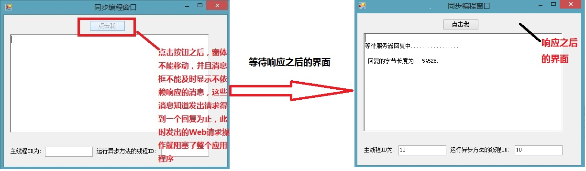
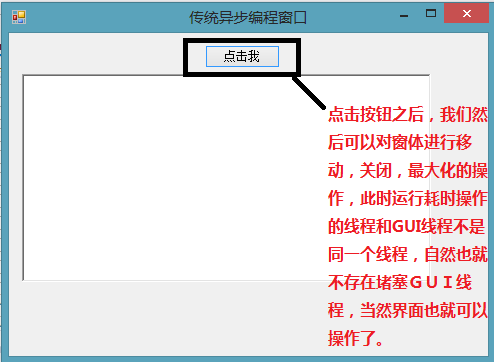
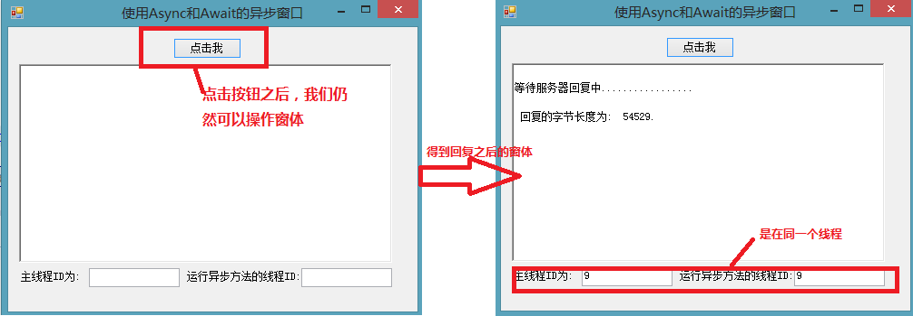

 


#    [Learning hard](https://www.cnblogs.com/zhili/)

#  			[[你必须知道的异步编程\]C# 5.0 新特性——Async和Await使异步编程更简单](https://www.cnblogs.com/zhili/archive/2013/05/15/Csharp5asyncandawait.html)

#	【[C# 基础知识系列文章索引](https://www.cnblogs.com/zhili/archive/2013/01/08/CsharpIndex.html)】

**本专题概要:**

**引言**

**同步代码存在的问题**

**传统的异步编程改善程序的响应**

**C# 5.0 提供的async和await使异步编程更简单**

 **async和await关键字剖析**

**小结**

 Task对象需要**更多的内存**，但任务运行的更快。 

什么叫做“把多线程的实现改成单线程实现”？本来一个东西，要用多线程来实现的；在编译的时候，就把多线程改成单线程了（看了一下，其实就是加了一下while的跳转）

TASK注重点在**并行**~ 所以如果你是**工作在多核**情况下，那么task或许是你最好的选择了，但是thread却无法实现自动化的并行操作~ 

Task是用了**线程池来控制的**，这是出于稳定性考虑的设计，Task的设计是用来解决实际问题的，比如网络下载、数据读写，瓶颈在于网络或存储的速度，并且要保证稳定。

# 一、引言

 在之前的[C#基础知识系列文章](http://www.cnblogs.com/zhili/archive/2013/01/08/CsharpIndex.html)中只介绍了从C#1.0到C#4.0中主要的特性，然而.NET  4.5  的推出，对于C#又有了新特性的增加——就是C#5.0中async和await两个关键字，这两个关键字简化了异步编程，之所以简化了，还是因为编译器给我们做了更多的工作，下面就具体看看编译器到底在背后帮我们做了哪些复杂的工作的。

# 二、同步代码存在的问题

 对于同步的代码，大家肯定都不陌生，因为我们平常写的代码大部分都是同步的，然而同步代码却存在一个很严重的问题，例如我们向一个Web服务器发出一个请求时，如果我们发出请求的代码是同步实现的话，这时候我们的应用程序就会处于等待状态，直到收回一个响应信息为止，然而在这个等待的状态，对于用户不能操作任何的UI界面以及也没有任何的消息，如果我们试图去操作界面时，此时我们就会看到"应用程序为响应"的信息(在应用程序的窗口旁)，相信大家在平常使用桌面软件或者访问web的时候，肯定都遇到过这样类似的情况的，对于这个，大家肯定会觉得看上去非常不舒服。引起这个原因正是因为代码的实现是同步实现的，所以在没有得到一个响应消息之前，界面就成了一个"卡死"状态了，所以这对于用户来说肯定是不可接受的，因为如果我要从服务器上下载一个很大的文件时，此时我们甚至不能对窗体进行关闭的操作的。为了具体说明同步代码存在的问题(造成界面开始)，下面通过一个程序让大家更形象地看下问题所在：

[](javascript:void(0);)

```
// 单击事件
        private void btnClick_Click(object sender, EventArgs e)
        {
            this.btnClick.Enabled = false;

            long length = AccessWeb();
            this.btnClick.Enabled = true;
            // 这里可以做一些不依赖回复的操作
            OtherWork();

            this.richTextBox1.Text += String.Format("\n 回复的字节长度为:  {0}.\r\n", length);
            txbMainThreadID.Text = Thread.CurrentThread.ManagedThreadId.ToString();
        }

        private  long AccessWeb()
        {
            MemoryStream content = new MemoryStream();

            // 对MSDN发起一个Web请求
            HttpWebRequest webRequest = WebRequest.Create("http://msdn.microsoft.com/zh-cn/") as HttpWebRequest;
            if (webRequest != null)
            {
                // 返回回复结果
                using (WebResponse response = webRequest.GetResponse())
                {
                    using (Stream responseStream = response.GetResponseStream())
                    {
                        responseStream.CopyTo(content);
                    }
                }
            }

            txbAsynMethodID.Text = Thread.CurrentThread.ManagedThreadId.ToString();
            return content.Length;
        }
```

[](javascript:void(0);)

运行程序后，当我们点击窗体的 "点击我"按钮之后，在得到服务器响应之前，我们不能对窗体进行任何的操作，包括移动窗体，关闭窗体等，具体运行结果如下：



# 三、传统的异步编程来改善程序的响应

 上面部分我们已经看到同步方法所带来的实际问题了，为了解决类似的问题，.NET Framework很早就提供了对异步编程的支持，下面就用.NET 1.0中提出的[异步编程模型(APM)](http://www.cnblogs.com/zhili/archive/2013/05/10/APM.html)来解决上面的问题，具体代码如下(注释的部分通过获得GUI线程的同步上文对象，然后同步调用同步上下文对象的post方法把要调用的方法交给GUI线程去处理，因为控件本来就是由GUI线程创建的，然后由它自己执行访问控件的操作就不存在跨线程的问题了，程序中使用的是调用**RichTextBox**控件的**Invoke**方式来异步回调访问控件的方法，其实背后的原来和注释部分是一样的，调用**RichTextBox**控件的**Invoke**方法可以获得创建RichTextBox控件的线程信息(也就是前一种方式的同步上下文)，然后让Invoke回调的方法在该线程上运行):

[](javascript:void(0);)

```
private void btnClick_Click(object sender, EventArgs e)
        {
            this.richTextBox1.Clear();
            btnClick.Enabled = false;
            AsyncMethodCaller caller = new AsyncMethodCaller(TestMethod);
            IAsyncResult result = caller.BeginInvoke(GetResult, null);

            //// 捕捉调用线程的同步上下文派生对象
            //sc= SynchronizationContext.Current;
        }
   
        # region 使用APM实现异步编程
        // 同步方法
        private string TestMethod()
        {       
            // 模拟做一些耗时的操作
            // 实际项目中可能是读取一个大文件或者从远程服务器中获取数据等。
            for (int i = 0; i < 10; i++)
            {
                Thread.Sleep(200);
            }

            return "点击我按钮事件完成";
        }
       
        // 回调方法
        private void GetResult(IAsyncResult result)
        {
            AsyncMethodCaller caller = (AsyncMethodCaller)((AsyncResult)result).AsyncDelegate;
            // 调用EndInvoke去等待异步调用完成并且获得返回值
            // 如果异步调用尚未完成，则 EndInvoke 会一直阻止调用线程，直到异步调用完成
            string resultvalue = caller.EndInvoke(result);
            //sc.Post(ShowState,resultvalue);
            richTextBox1.Invoke(showStateCallback, resultvalue);
        }

        // 显示结果到richTextBox
        private void ShowState(object result)
        {
            richTextBox1.Text = result.ToString();
            btnClick.Enabled = true;
        }

        // 显示结果到richTextBox
        //private void ShowState(string result)
        //{
        //    richTextBox1.Text = result;
        //    btnClick.Enabled = true;
        //}
        #endregion
```

[](javascript:void(0);)

运行的结果为：



# 四、C# 5.0 提供的async和await使异步编程更简单

 上面部分演示了使用传统的异步编程模型(APM)来解决同步代码所存在的问题，然而在.NET 2.0，.NET 4.0和.NET  4.5中，微软都有推出新的方式来解决同步代码的问题，他们分别为基于事件的异步模式，基于任务的异步模式和提供async和await关键字来对异步编程支持。关于前两种异步编程模式，在我前面的文章中都有介绍，大家可以查看相关文章进行详细地了解，本部分就C#   5.0中的async和await这两个关键字如何实现异步编程的问题来给大家介绍下。下面通过代码来了解下如何使用async和await关键字来实现异步编程，并且大家也可以参看前面的博客来对比理解使用async和await是异步编程更简单。

[](javascript:void(0);)

```
  private async void btnClick_Click(object sender, EventArgs e)
        {
            long length = await AccessWebAsync();
           
            // 这里可以做一些不依赖回复的操作
            OtherWork();

            this.richTextBox1.Text += String.Format("\n 回复的字节长度为:  {0}.\r\n", length);
            txbMainThreadID.Text = Thread.CurrentThread.ManagedThreadId.ToString();
        }

        // 使用C# 5.0中提供的async 和await关键字来定义异步方法
        // 从代码中可以看出C#5.0 中定义异步方法就像定义同步方法一样简单。
        // 使用async 和await定义异步方法不会创建新线程,
        // 它运行在现有线程上执行多个任务.
        // 此时不知道大家有没有一个疑问的？在现有线程上(即UI线程上)运行一个耗时的操作时，
        // 为什么不会堵塞UI线程的呢？
        // 这个问题的答案就是 当编译器看到await关键字时，线程会
        private async Task<long> AccessWebAsync()
        {
            MemoryStream content = new MemoryStream();

            // 对MSDN发起一个Web请求
            HttpWebRequest webRequest = WebRequest.Create("http://msdn.microsoft.com/zh-cn/") as HttpWebRequest;
            if (webRequest != null)
            {
                // 返回回复结果
                using (WebResponse response = await webRequest.GetResponseAsync())
                {
                    using (Stream responseStream = response.GetResponseStream())
                    {
                        await responseStream.CopyToAsync(content);
                    }
                }
            }

            txbAsynMethodID.Text = Thread.CurrentThread.ManagedThreadId.ToString() ;
            return content.Length;
        }

        private void OtherWork()
        {
            this.richTextBox1.Text += "\r\n等待服务器回复中.................\n";
        }
```

[](javascript:void(0);)

运行结果如下：



# 	五、async和await关键字剖析

我们对比下上面使用async和await关键字来实现异步编程的代码和在第二部分的同步代码**，有没有发现使用async和await关键字的异步实现和同步代码的实现很像,只是异步实现中多了async和await关键字和调用的方法都多了async后缀而已。正是因为他们的实现很像，所以我在第四部分才命名为使用async和await使异步编程更简单，就像我们在写同步代码一样，并且代码的coding思路也是和同步代码一样，这样就避免考虑在APM中委托的回调等复杂的问题，以及在EAP中考虑各种事件的定义。**从代码部分我们可以看出async和await的使用确实很简单，我们就如在写同步代码一般，但是我很想知道编译器到底给我们做了怎样的处理的？并且从运行结果可以发现，运行异步方法的线程和GUI线程的ID是一样的，也就是说**异步方法的运行在GUI线程上，所以就不用像APM中那样考虑跨线程访问的问题了(因为通过委托的BeginInvoke方法来进行回调方法时，回调方法是在线程池线程上执行的)。下面就用反射工具看看编译器把我们的源码编译成什么样子的：**

**对于按钮点击事件的代码来说，编译器生成的背后代码却是下面这样的，完全和我们源码中的两个样：**

[](javascript:void(0);)

```
// 编译器为按钮Click事件生成的代码
private void btnClick_Click(object sender, EventArgs e)
{
    <btnClick_Click>d__0 d__;
    d__.<>4__this = this;
    d__.sender = sender;
    d__.e = e;
    d__.<>t__builder = AsyncVoidMethodBuilder.Create();
    d__.<>1__state = -1;
    d__.<>t__builder.Start<<btnClick_Click>d__0>(ref d__);
}
```

[](javascript:void(0);)

看到上面的代码,作为程序员的我想说——编译器你怎么可以这样呢？怎么可以任意篡改我的代码呢？这样不是侵犯我的版权了吗？你要改最起码应该告诉我一声吧，如果我的源码看到它在编译器中的实现是上面那样的，我相信我的源码会说——难道我中了世间上最恶毒的面目全非脚吗？   好吧，为了让大家更好地理清编译器背后到底做了什么事情，下面就顺着上面的代码摸瓜，我也来展示耍一套还我漂漂拳来帮助大家找到编译器代码和源码的对应关系。我的分析思路为:

1、提出问题——我的click事件的源码到哪里去了呢？

　　从编译器代码我们可以看到，前面的7句代码都是对某个类进行赋值的操作，最真正起作用的就是最后Start方法的调用。这里又产生了几个疑问——<btnClick_Click>d__0是什么类型? 该类型中的<>t__builder字段类型的Start方法到底是做什么用的？ 有了这两个疑问，我们就点击<btnClick_Click>d__0(反射工具可以让我们直接点击查看)来看看它是什么类型

[](javascript:void(0);)

```
// <btnClick_Click>d__0类型的定义，从下面代码可以看出它是一个结构体
// 该类型是编译器生成的一个嵌入类型
// 看到该类型的实现有没有让你联想到什么？
private struct <btnClick_Click>d__0 : IAsyncStateMachine
{
    // Fields
    public int <>1__state;
    public Form1 <>4__this;
    public AsyncVoidMethodBuilder <>t__builder;
    private object <>t__stack;
    private TaskAwaiter<long> <>u__$awaiter2;
    public long <length>5__1;
    public EventArgs e;
    public object sender;

    // Methods
    private void MoveNext()
    {
        try
        {
            TaskAwaiter<long> CS$0$0001;
            bool <>t__doFinallyBodies = true;
            switch (this.<>1__state)
            {
                case -3:
                    goto Label_010E;

                case 0:
                    break;

                default:
　　　　　　　　　　　　// 获取用于等待Task（任务）的等待者。你要知道某个任务是否完成，我们就需要一个等待者对象对该任务进行一个监控，所以微软就定义了一个等待者对象的
　　　　　　　　　　　　// 从这里可以看出，其实async和await关键字背后的实现原理是基于任务的异步编程模式(TAP)
                    // 这里代码是在线程池线程上运行的
                    CS$0$0001 = this.<>4__this.AccessWebAsync().GetAwaiter();
　　　　　　　　　　　　// 如果任务完成就调转到Label_007A部分的代码
                    if (CS$0$0001.IsCompleted)
                    {
                        goto Label_007A;
                    }
　　　　　　　　　　　
                    // 设置状态为0为了退出回调方法。
                    this.<>1__state = 0;
                    this.<>u__$awaiter2 = CS$0$0001;
　　　　　　　　　　　　// 这个代码是做什么用的呢？让我们带着问题看下面的分析
this.<>t__builder.AwaitUnsafeOnCompleted<TaskAwaiter<long>, Form1.<btnClick_Click>d__0>(ref CS$0$0001, ref this);
                    <>t__doFinallyBodies = false;
　　　　　　　　　　　　// 返回到调用线程,即GUI线程,这也是该方法不会堵塞GUI线程的原因,不管任务是否完成都返回到GUI线程
                    return;
            }
            // 当任务完成时，不会执行下面的代码，会直接执行Label_007A中代码
            CS$0$0001 = this.<>u__$awaiter2;
            this.<>u__$awaiter2 = new TaskAwaiter<long>();
            // 为了使再次回调MoveNext代码
            this.<>1__state = -1;
        Label_007A:
            // 下面代码是在GUI线程上执行的
            CS$0$0001 = new TaskAwaiter<long>();
            long CS$0$0003 = CS$0$0001.GetResult();
            this.<length>5__1 = CS$0$0003;
　　　　　　　　// 我们源码中的代码这里的
            this.<>4__this.OtherWork();
            this.<>4__this.richTextBox1.Text = this.<>4__this.richTextBox1.Text + string.Format("\n 回复的字节长度为:  {0}.\r\n", this.<length>5__1);
            this.<>4__this.txbMainThreadID.Text = Thread.CurrentThread.ManagedThreadId.ToString();
        }
        catch (Exception <>t__ex)
        {
            this.<>1__state = -2;
            this.<>t__builder.SetException(<>t__ex);
            return;
        }
    Label_010E:
        this.<>1__state = -2;
        this.<>t__builder.SetResult();
    }

    [DebuggerHidden]
    private void SetStateMachine(IAsyncStateMachine param0)
    {
        this.<>t__builder.SetStateMachine(param0);
    }
}
```

[](javascript:void(0);)

　　如果你看过我的[迭代器专题](http://www.cnblogs.com/zhili/archive/2012/12/02/Interator.html)的话,相信你肯定可以联想到该结构体就是一个迭代器的一个实现,其主要方法就是MoveNext方法。从上面的代码的注释应该可以帮助我们解决在第一步提到的第一个问题,

即<btnClick_Click>d__0是什么类型,下面就分析下第二个问题，从<btnClick_Click>d__0结构体的代码中可以发现<>t__builder的类型是**AsyncVoidMethodBuilder类型,下面就看看它的Start方法的解释——运行关联状态机的生成器,即调用该方法就可以开始运行状态机,运行状态机指的就是执行MoveNext方法(MoveNext方法中有我们源码中所有代码,这样就把编译器生成的Click方法与我们的源码关联起来了)。从上面代码注释中可以发现，当该MoveNext被调用时会立即还回到GUI线程中，同时也有这样的疑问——刚开始调用MoveNext方法时，任务肯定是还没有被完成的，但是我们输出我们源码中的代码，必须等待任务完成（因为任务完成才能调转到Label_007A中的代码），此时我们应该需要回调MoveNext方法来检查任务是否完成，(就如迭代器中的，我们需要使用foreach语句一直调用MoveNext方法)，然而我们在代码却没有找到回调的任何代码啊？   对于这个疑问，回调MoveNext方法肯定是存在的，只是首次看上面代码的朋友还没有找到类似的语句而已，上面代码注释中我提到了一个问题——这个代码是做什么用的呢？让我们带着问题看下面的分析,其实注释下面的代码就是起到回调MoveNext方法的作用，AsyncVoidMethodBuilder.AwaitUnsafeOnCompleted<TAwaiter, TStateMachine> 方法就是调度状态机去执行MoveNext方法,从而也就解决了回调MoveNext的疑问了。**

相信大家从上面的解释中可以找到源码与编译器代码之间的对应关系了吧,  但是我在分析完上面的之后,又有一个疑问——当任务完成时，是如何退出MoveNext方法的呢？总不能让其一直回调吧，从上面的代码的注释可以看出，当任务执行完成之后，会把<>1__state设置为0,当下次再回调MoveNext方法时就会直接退出方法，然而任务没完成之前，同样也会把<>1__state设置为0，但是Switch部分后面的代码又把<>1__state设置为-1,这样就保证了在任务没完成之前，MoveNext方法可以被重复回调，当任务完成之后，<>1__state设置为-1的代码将不会执行，而是调转到Label_007A部分。

经过上面的分析之后,相信大家也可以耍出一套还我漂漂拳去分析异步方法**AccessWebAsync**(),其分析思路是和btnClick_Click的分析思路是一样的.这里就不重复啰嗦了。

分析完之后,下面再分享下几个关于async和await常问的问题

#####	有当async和await关键字同时出现

问题一：是不是写了async关键字的方法就代表该方法是异步方法，不会堵塞线程呢？

　　答: 不是的，对于只标识async关键字的(指在方法内没有出现await关键字)的方法,调用线程会把该方法当成同步方法一样执行,所以然而会堵塞GUI线程,只有当async和await关键字同时出现，该方法才被转换为异步方法处理。

问题二：“async”关键字会导致调用方法用线程池线程运行吗?

　　答:  不会,被async关键字标识的方法不会影响方法是同步还是异步运行并完成,而是，它使方法可被分割成多个片段，其中一些片段可能异步运行，这样这个方法可能异步完成。这些片段界限就出现在方法内部显示使用”await”关键字的位置处。所以，如果在标记了”async”的方法中没有显示使用”await”，那么该方法只有一个片段，并且将以同步方式运行并完成。在await关键字出现的前面部分代码和后面部分代码都是同步执行的(即在调用线程上执行的，也就是GUI线程，所以不存在跨线程访问控件的问题)，await关键处的代码片段是在线程池线程上执行。总结为——使用async和await关键字实现的异步方法，此时的**异步方法被分成了多个代码片段去执行**的，而不是像之前的异步编程模型(APM)和EAP那样，使用线程池线程去执行一整个方法。

关于更多async和await关键字的常问问题可以查看——[Async/Await FAQ](http://blogs.msdn.com/b/pfxteam/archive/2012/04/12/async-await-faq.aspx)和中文翻译——[（译）关于async与await的FAQ](http://www.cnblogs.com/heyuquan/archive/2012/11/30/2795859.html)

# 六、小结

　　写到这里本专题的内容就介绍到这里的,并且我也会把本专题的内容同步到之前的[C#基础知识系列文章](http://www.cnblogs.com/zhili/archive/2013/01/08/CsharpIndex.html)索引，这样我的C#特性系列也就完整了，并且该专题也是异步编程的最后一篇专题，在后面的专题将为大家实现一个类似迅雷的多任务多线程下载器，对于这个专题可能会用到并行编程的内容，所以接下面我为为大家分享下并行编程的内容。

 

　　根据 一路转圈的雪人的建议，因为对于刚使用await的人，经常会问“帮来看一下怎么死锁了，怎么办啊，要死了，怎么解决？”，对于这样的问题大家应该明白一点就是——**使用async标识的异步方法的运行在GUI线程上(对于这点大家一定要明白，在我文章中的剖析部分也详细介绍了原因，阅读文章的人应该重点了解)，所以就不用像APM中那样考虑跨线程访问的问题了**。[
](http://www.cnblogs.com/lwzz/)

 

本专题所有源码下载：[ASyncAndAwaitTestProject.zip](http://files.cnblogs.com/zhili/ASyncAndAwaitTestProject.zip)

 

 如果您认为这篇文章还不错或者有所收获，您可以通过**右边的“打赏”功能** 打赏我一杯咖啡【物质支持】，也可以点击右下角的**【店长推荐】**按钮【精神支持】，因为这两种支持都是我继续写作，分享的最大动力


分类: [你必须知道的异步编程系列](https://www.cnblogs.com/zhili/category/475336.html),[C#基础知识梳理系列](https://www.cnblogs.com/zhili/category/421637.html)

标签: [C# 5.0 async await 异步编程 .NET 4.5](https://www.cnblogs.com/zhili/tag/C%23 5.0 async await 异步编程 .NET 4.5/)

​         [好文要顶](javascript:void(0);)             [关注我](javascript:void(0);)     [收藏该文](javascript:void(0);)     [](javascript:void(0);)     [](javascript:void(0);) 


​             [Learning hard](https://home.cnblogs.com/u/zhili/)
​             [关注 - 169](https://home.cnblogs.com/u/zhili/followees)
​             [粉丝 - 3574](https://home.cnblogs.com/u/zhili/followers)         


荣誉：[推荐博客](https://www.cnblogs.com/expert/)

​                 [+加关注](javascript:void(0);)     

​         90     

​         4     


​     


[« ](https://www.cnblogs.com/zhili/archive/2013/05/13/TAP.html) 上一篇：[[你必须知道的异步编程\]——基于任务的异步模式](https://www.cnblogs.com/zhili/archive/2013/05/13/TAP.html)
[» ](https://www.cnblogs.com/zhili/archive/2013/05/23/ChangeResolution.html) 下一篇：[[C# 开发技巧系列\]如何动态设置屏幕分辨率](https://www.cnblogs.com/zhili/archive/2013/05/23/ChangeResolution.html)

pyright ©2019 Learning hard 	