#  			[[C#\] 走进异步编程的世界 - 剖析异步方法（上）](https://www.cnblogs.com/liqingwen/p/5844095.html)

# 走进异步编程的世界 - 剖析异步方法（上）

## 序

　　这是上篇《[走进异步编程的世界 - 开始接触 async/await 异步编程](http://www.cnblogs.com/liqingwen/p/5831951.html)》（入门）的第二章内容，主要是与大家共同深入探讨下异步方法。

　　本文要求了解委托的使用。

 

## 目录

- [介绍异步方法](https://www.cnblogs.com/liqingwen/p/5844095.html#link0)
- [控制流](https://www.cnblogs.com/liqingwen/p/5844095.html#link1)
- [await 表达式](https://www.cnblogs.com/liqingwen/p/5844095.html#link2)
- [How 取消异步操作](https://www.cnblogs.com/liqingwen/p/5844095.html#link3)

 

## 介绍异步方法

​     异步方法：在执行完成前立即返回调用方法，在调用方法继续执行的过程中完成任务。

​     语法分析：

​     （1）关键字：方法头使用 async 修饰。

​     （2）要求：包含 N（N>0） 个 await 表达式（不存在 await 表达式的话 IDE 会发出警告），表示需要异步执行的任务。【备注】感谢 [czcz1024](http://www.cnblogs.com/czcz1024/) 的修正与补充：没有的话，就和普通方法一样执行了。

​     （3）返回类型：只能返回 3 种类型（void、Task 和 Task< T>）。Task 和 Task<T> 标识返回的对象会在将来完成工作，表示调用方法和异步方法可以继续执行。

​     （4）参数：数量不限。但不能使用 out 和 ref 关键字。

​     （5）命名约定：方法后缀名应以 Async 结尾。

​     （6）其它：匿名方法和 Lambda 表达式也可以作为异步对象；async 是一个上下文关键字；关键字 async 必须在返回类型前。

 

图1 异步方法的简单结构图 

　　关于 async 关键字：

　　①在返回类型之前包含 **async** 关键字

　　②它只是标识该方法包含一个或多个 await 表达式，即，它本身不创建异步操作。

　　③它是上下文关键字，即可作为变量名。

 

　　现在先来简单分析一下这三种返回值类型：void、Task 和 Task<T>

　　（1）Task<T>：调用方法要从调用中获取一个 T 类型的值，异步方法的返回类型就必须是Task<T>。调用方法从 Task 的 Result 属性获取的就是 T 类型的值。

  Program.cs

  View Code 

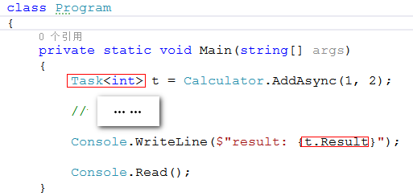

图2

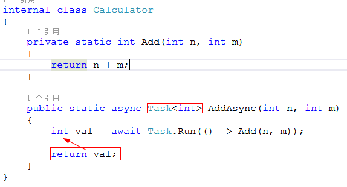

图3

 

　　（2）Task：调用方法不需要从异步方法中取返回值，但是希望检查异步方法的状态，那么可以选择可以返回 Task 类型的对象。不过，就算异步方法中包含 return 语句，也不会返回任何东西。

  Program.cs

  View Code

 

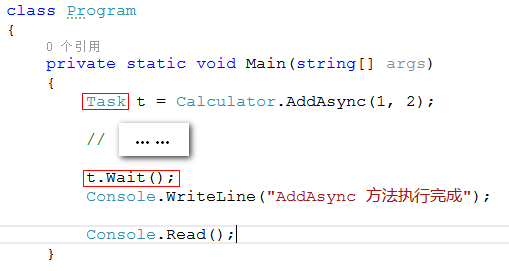

 

图4

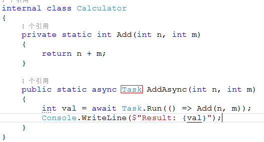

图5

​     

　　（3）void：调用方法执行异步方法，但又不需要做进一步的交互。 

  Program.cs

  Calculator.cs

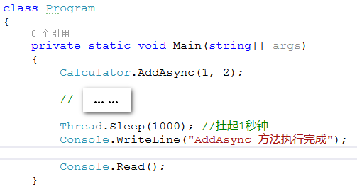

图6

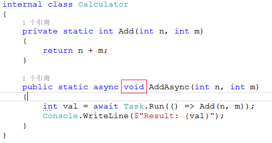

图7

 

## 一、控制流

​     异步方法的结构可拆分成三个不同的区域：

​     （1）表达式之前的部分：从方法头到第一个 await 表达式之间的所有代码。

​     （2）await 表达式：将被异步执行的代码。

​     （3）表达式之后的部分：await 表达式的后续部分。

 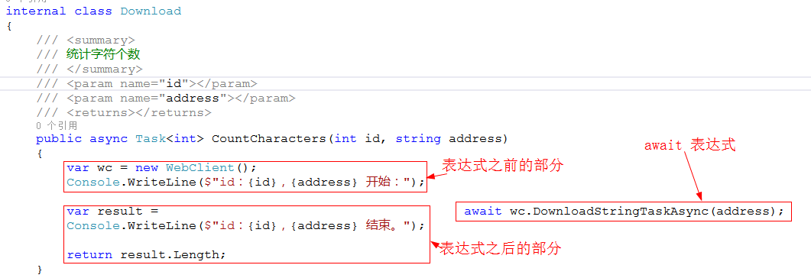

　　图1-1

 

　　该异步方法执行流程：从await表达式之前的地方开始，同步执行到第一个 await，标识着第一部分执行结束，一般来说此时  await 工作还没完成。当await 任务完成后，该方法将继续同步执行后续部分。在执行的后续部分中，如果依然存在 await，就重复上述过程。

　　当到达 await 表达式时，线程将从异步方法返回到调用方法。如果异步方法的返回类型为 Task 或 Task<T>，会创建一个 Task 对象，标识需要异步完成的任务，然后将 Task 返回来调用方法。

 

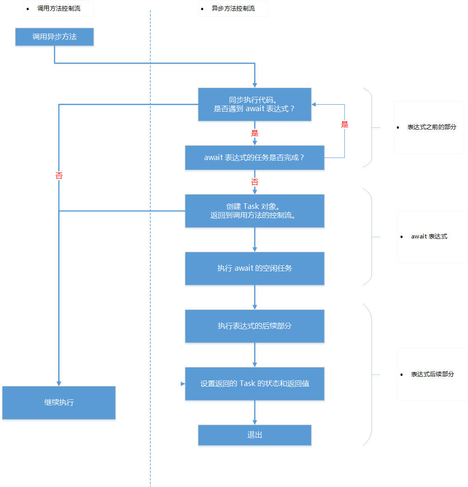

　　图1-2

　　异步方法的控制流：

　　①异步执行 await 表达式的空闲任务。

　　②await 表达式执行完成，继续执行后续部分。如再遇到 await 表达式，按相同情况进行处理。

　　③到达末尾或遇到 return 语句时，根据返回类型可以分三种情况：

　　　　a.void：退出控制流。

　　　　b.Task：设置 Task 的属性并退出。

　　　　c.Task<T>：设置 Task 的属性和返回值（Result 属性）并退出。

　　④同时，调用方法将继续执行，从异步方法获取 Task 对象。需要值的时候，会暂停等到 Task 对象的 Result 属性被赋值才会继续执行。

 

　　【难点】

　　①第一次遇到 await 所返回对象的类型。这个**返回类型就是同步方法头的返回类型**，跟 await 表达式的返回值没有关系。

　　②到达异步方法的末尾或遇到 **return 语句，它并没有真正的返回一个值**，而是退出了该方法。

 

## 二、await 表达式

　　await 表达式指定了一个异步执行的任务。默认情况，该任务在当前线程异步执行。

　　每一个任务就是一个 awaitable 类的实例。awaitable 类型指包含 GetAwaiter() 方法的类型。

　　实际上，你并不需要构建自己的 awaitable，一般只需要使用 Task 类，它就是 awaitable。

　　最简单的方式是在方法中使用 Task.Run() 来创建一个 Task。【注意】它是在不同的线程上执行方法。

 

　　让我们一起来看看示例。

  View Code

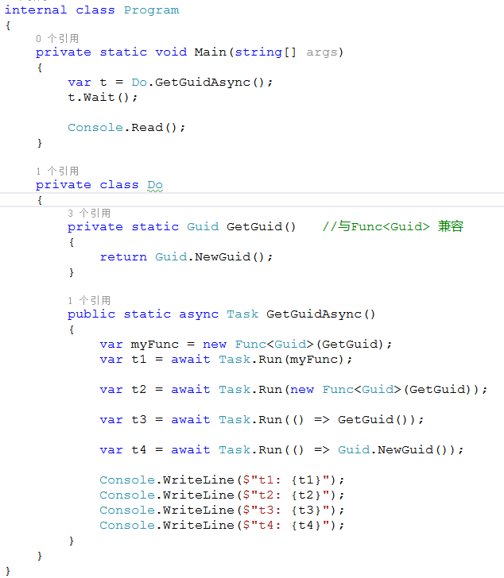

图2-1

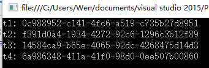

图2-2

 　　上面 4 个 Task.Run() 都是采用了 Task Run(Func<TReturn> func) 形式来直接或间接调用 Guid.NewGuid()。

 

　　Task.Run() 支持 4 中不同的委托类型所表示的方法：Action、Func<TResult>、Func<Task> 和 Func<Task<TResult>>

  View Code

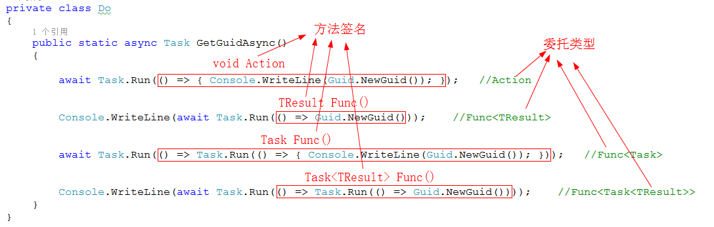

图2-3 Task.Run() 方法的重载

 

## 三、How 取消异步操作

 　　CancellationToken 和 CancellationTokenSource 这两个类允许你终止执行异步方法。

　　（1）CancellationToken 对象包含任务是否被取消的信息；如果该对象的属性  IsCancellationRequested 为  true，任务需停止操作并返回；该对象操作是不可逆的，且只能使用（修改）一次，即该对象内的 IsCancellationRequested  属性被设置后，就不能改动。

　　（2）CancellationTokenSource 可创建 CancellationToken  对象，调用 CancellationTokenSource 对象的 Cancel 方法，会使该对象的 CancellationToken  属性 IsCancellationRequested 设置为 true。

　　【注意】调用 CancellationTokenSource 对象的 Cancel 方法，并不会执行取消操作，而是会将该对象的 CancellationToken 属性 IsCancellationRequested 设置为 true。

 

　　示例

  View Code

图3-1

图3-2 注释两行代码

图3-3：图3-1和图3-2的执行结果（注释两行代码）

　　上图是不调用 Cancel() 方法的结果图，不会取消任务的执行。

 

　　下图在 3 秒后调用 Cancel() 方法取消任务的执行：

图3-4：去掉注释

****

图3-5：图3-1和图3-4的执行结果（去掉注释）

 

## 小结

- 介绍异步方法的语法、三种不同的返回值类型（void、Task 和 Task<T>）和控制流程等。
- 简单常用的异步执行方式：Task.Run()。【注意】它是在不同的线程上执行方法。
- 如何取消异步操作。

 

## 传送门

　　入门：《[开始接触 async/await 异步编程](http://www.cnblogs.com/liqingwen/p/5831951.html)》

　　补充篇：《[走进异步编程的世界 - 剖析异步方法（下）](http://www.cnblogs.com/liqingwen/p/5866241.html)》

　　GUI 篇：《[走进异步编程的世界 - 在 GUI 中执行异步操作](http://www.cnblogs.com/liqingwen/p/5877042.html)》