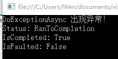
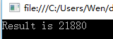
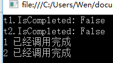
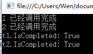
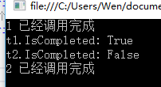
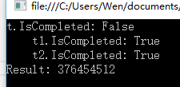
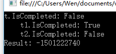
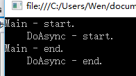

#  			[[C#\] 走进异步编程的世界 - 剖析异步方法（下）](https://www.cnblogs.com/liqingwen/p/5866241.html) 		


# 走进异步编程的世界 - 剖析异步方法（下）

 

## 序

　　感谢大家的支持，这是昨天发布《[走进异步编程的世界 - 剖析异步方法（上）](http://www.cnblogs.com/liqingwen/p/5844095.html)》的补充篇。

 

## 目录

- [异常处理](https://www.cnblogs.com/liqingwen/p/5866241.html#link1)
- [在调用方法中同步等待任务](https://www.cnblogs.com/liqingwen/p/5866241.html#link2)
- [在异步方法中异步等待任务](https://www.cnblogs.com/liqingwen/p/5866241.html#link3)
- [Task.Delay() 暂停执行](https://www.cnblogs.com/liqingwen/p/5866241.html#link4)

　　

## 一、异常处理

　　await 表达式也可以使用 try...catch...finally 结构。

[](javascript:void(0);)

```
 1     internal class Program
 2     {
 3         private static void Main(string[] args)
 4         {
 5             var t = DoExceptionAsync();
 6             t.Wait();
 7 
 8             Console.WriteLine($"{nameof(t.Status)}: {t.Status}");   //任务状态
 9             Console.WriteLine($"{nameof(t.IsCompleted)}: {t.IsCompleted}");     //任务完成状态标识
10             Console.WriteLine($"{nameof(t.IsFaulted)}: {t.IsFaulted}");     //任务是否有未处理的异常标识
11 
12             Console.Read();
13         }
14 
15         /// <summary>
16         /// 异常操作
17         /// </summary>
18         /// <returns></returns>
19         private static async Task DoExceptionAsync()
20         {
21             try
22             {
23                 await Task.Run(() => { throw new Exception(); });
24             }
25             catch (Exception)
26             {
27                 Console.WriteLine($"{nameof(DoExceptionAsync)} 出现异常！");
28             }
29         }
30     }
```

[](javascript:void(0);)



图1-1

　　【分析】await  表达式位于 try  块中，按普通的方式处理异常。但是，为什么图中的状态（Status）、是否完成标识（IsCompleted）和是否失败标识（IsFaulted）分别显示：运行完成（RanToCompletion）  、已完成（True） 和 未失败（False） 呢？因为：任务没有被取消，并且异常都已经处理完成！

 

## 二、在调用方法中同步等待任务

　　调用方法可能在某个时间点上需要等待某个特殊的 Task 对象完成，才执行后面的代码。此时，可以采用实例方法 Wait 。

[](javascript:void(0);)

```csharp
 1     internal class Program
 2     {
 3         private static void Main(string[] args)
 4         {
 5             var t = CountCharactersAsync("http://www.cnblogs.com/liqingwen/");
 6 
 7             t.Wait();   //等待任务结束
 8             Console.WriteLine($"Result is {t.Result}");
 9 
10             Console.Read();
11         }
12 
13         /// <summary>
14         /// 统计字符数量
15         /// </summary>
16         /// <param name="address"></param>
17         /// <returns></returns>
18         private static async Task<int> CountCharactersAsync(string address)
19         {
20             var result = await Task.Run(() => new WebClient().DownloadStringTaskAsync(address));
21             return result.Length;
22         }
23     }
```

[](javascript:void(0);)



图2-1

 

　　Wait() 适合用于单一 Task 对象，如果想操作一组对象，可采用 Task 的两个静态方法 WaitAll() 和 WaitAny() 。

[](javascript:void(0);)

```csharp
 1     internal class Program
 2     {
 3         private static int time = 0;
 4         private static void Main(string[] args)
 5         {
 6             var t1 = GetRandomAsync(1);
 7             var t2 = GetRandomAsync(2);
 8 
 9             //IsCompleted 任务完成标识
10             Console.WriteLine($"t1.{nameof(t1.IsCompleted)}: {t1.IsCompleted}");    
11             Console.WriteLine($"t2.{nameof(t2.IsCompleted)}: {t2.IsCompleted}");
12 
13             Console.Read();
14         }
15 
16         /// <summary>
17         /// 获取一个随机数
18         /// </summary>
19         /// <param name="id"></param>
20         /// <returns></returns>
21         private static async Task<int> GetRandomAsync(int id)
22         {
23             var num = await Task.Run(() =>
24             {
25                 time++;
26                 Thread.Sleep(time * 100);
27                 return new Random().Next();
28             });
29 
30             Console.WriteLine($"{id} 已经调用完成");
31             return num;
32         }
33     }
```

[](javascript:void(0);)



图2-2 两个任务的 IsCompleted 属性都显示未完成

 

　　现在，在 Main() 方法中新增两行代码（6 和 7 两行），尝试调用 WaitAll() 方法。

[](javascript:void(0);)

```
 1         private static void Main(string[] args)
 2         {
 3             var t1 = GetRandomAsync(1);
 4             var t2 = GetRandomAsync(2);
 5 
 6             Task<int>[] tasks = new Task<int>[] { t1, t2 };
 7             Task.WaitAll(tasks);    //等待任务全部完成，才继续执行
 8 
 9             //IsCompleted 任务完成标识
10             Console.WriteLine($"t1.{nameof(t1.IsCompleted)}: {t1.IsCompleted}");    
11             Console.WriteLine($"t2.{nameof(t2.IsCompleted)}: {t2.IsCompleted}");
12 
13             Console.Read();
14         }
```

[](javascript:void(0);)



图2-3 两个任务的 IsCompleted 属性都显示 True

 

　　现在，再次将第 7 行改动一下，调用 WaitAny() 方法试试。 

[](javascript:void(0);)

```
 1         private static void Main(string[] args)
 2         {
 3             var t1 = GetRandomAsync(1);
 4             var t2 = GetRandomAsync(2);
 5 
 6             Task<int>[] tasks = new Task<int>[] { t1, t2 };
 7             Task.WaitAny(tasks);    //等待任一 Task 完成，才继续执行
 8 
 9             //IsCompleted 任务完成标识
10             Console.WriteLine($"t1.{nameof(t1.IsCompleted)}: {t1.IsCompleted}");    
11             Console.WriteLine($"t2.{nameof(t2.IsCompleted)}: {t2.IsCompleted}");
12 
13             Console.Read();
14         }
```

[](javascript:void(0);)



图2-4 有一个任务的 IsCompleted 属性显示 True （完成） 就继续执行

 

## 三、在异步方法中异步等待任务

　　上节说的是如何使用 WaitAll() 和 WaitAny() 同步地等待 Task 完成。这次我们使用 Task.WhenAll() 和 Task.WhenAny()  在异步方法中异步等待任务。

[](javascript:void(0);)

```
 1     internal class Program
 2     {
 3         private static int time = 0;
 4 
 5         private static void Main(string[] args)
 6         {
 7             var t = GetRandomAsync();
 8 
 9             Console.WriteLine($"t.{nameof(t.IsCompleted)}: {t.IsCompleted}");
10             Console.WriteLine($"Result: {t.Result}");
11 
12             Console.Read();
13         }
14 
15         /// <summary>
16         /// 获取一个随机数
17         /// </summary>
18         /// <param name="id"></param>
19         /// <returns></returns>
20         private static async Task<int> GetRandomAsync()
21         {
22             time++;
23             var t1 = Task.Run(() =>
24             {
25                 Thread.Sleep(time * 100);
26                 return new Random().Next();
27             });
28 
29             time++;
30             var t2 = Task.Run(() =>
31             {
32                 Thread.Sleep(time * 100);
33                 return new Random().Next();
34             });
35 
36             //异步等待集合内的 Task 都完成，才进行下一步操作
37             await Task.WhenAll(new List<Task<int>>() { t1, t2 });
38 
39             Console.WriteLine($"    t1.{nameof(t1.IsCompleted)}: {t1.IsCompleted}");
40             Console.WriteLine($"    t2.{nameof(t2.IsCompleted)}: {t2.IsCompleted}");
41 
42             return t1.Result + t2.Result;
43         }
44     }
```

[](javascript:void(0);)



图3-1 调用 WhenAll()  方法

　　【注意】WhenAll() 异步等待集合内的 Task 都完成，不会占用主线程的时间。

　

 　　现在，我们把 GetRandomAsync() 方法内的 WhenAll() 方法替换成 WhenAny()，并且增大一下线程挂起时间，最终改动如下：

[](javascript:void(0);)

```
 1         private static async Task<int> GetRandomAsync()
 2         {
 3             time++;
 4             var t1 = Task.Run(() =>
 5             {
 6                 Thread.Sleep(time * 100);
 7                 return new Random().Next();
 8             });
 9 
10             time++;
11             var t2 = Task.Run(() =>
12             {
13                 Thread.Sleep(time * 500);   //这里由 100 改为 500，不然看不到效果
14                 return new Random().Next();
15             });
16 
17             //异步等待集合内的 Task 都完成，才进行下一步操作
18             //await Task.WhenAll(new List<Task<int>>() { t1, t2 });
19             await Task.WhenAny(new List<Task<int>>() { t1, t2 });
20 
21             Console.WriteLine($"    t1.{nameof(t1.IsCompleted)}: {t1.IsCompleted}");
22             Console.WriteLine($"    t2.{nameof(t2.IsCompleted)}: {t2.IsCompleted}");
23 
24             return t1.Result + t2.Result;
25         }
```

[](javascript:void(0);)



图3-2 调用 WhenAny() 方法

 

## 四、Task.Delay() 暂停执行

　　Task.Delay() 方法会创建一个 Task 对象，该对象将暂停其在线程中的处理，并在一定时间之后完成。和 Thread.Sleep 不同的是，它不会阻塞线程，意味着线程可以继续处理其它工作。

[](javascript:void(0);)

```
 1     internal class Program
 2     {
 3         private static void Main(string[] args)
 4         {
 5             Console.WriteLine($"{nameof(Main)} - start.");
 6             DoAsync();
 7             Console.WriteLine($"{nameof(Main)} - end.");
 8 
 9             Console.Read();
10         }
11 
12         private static async void DoAsync()
13         {
14             Console.WriteLine($"    {nameof(DoAsync)} - start.");
15 
16             await Task.Delay(500);
17 
18             Console.WriteLine($"    {nameof(DoAsync)} - end.");
19         }
20     }
```

[](javascript:void(0);)



图4-1

 

## 传送门

　　入门：《[开始接触 async/await 异步编程](http://www.cnblogs.com/liqingwen/p/5831951.html)》

　　上篇：《[走进异步编程的世界 - 剖析异步方法（上）](http://www.cnblogs.com/liqingwen/p/5844095.html)》

　　下篇：《[走进异步编程的世界 - 在 GUI 中执行异步操作](http://www.cnblogs.com/liqingwen/p/5877042.html)》

 

------

 【原文链接】<http://www.cnblogs.com/liqingwen/p/5866241.html>

【参考】《Illustrated C# 2012》