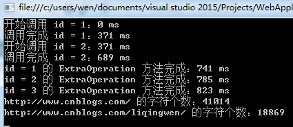
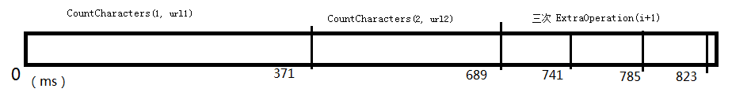
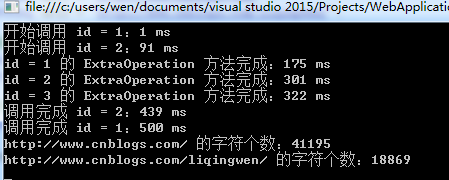
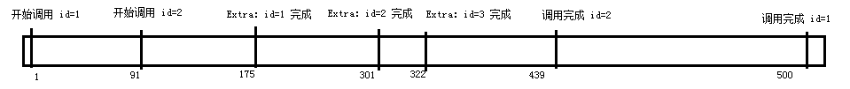
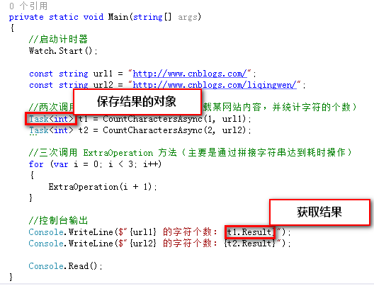

# 走进异步编程的世界 - 开始接触 async/await

 

## 序

　　这是学习异步编程的入门篇。

　　涉及 C# 5.0 引入的 async/await，但在控制台输出示例时经常会采用 C# 6.0 的 $"" 来拼接字符串，相当于string.Format() 方法。

 

## 目录

- [What's 异步？](https://www.cnblogs.com/liqingwen/p/5831951.html#link1)
- [async/await 结构](https://www.cnblogs.com/liqingwen/p/5831951.html#link2)
- [What’s 异步方法？](https://www.cnblogs.com/liqingwen/p/5831951.html#link3)

 

## 一、What's 异步？

​     启动程序时，系统会在内存中创建一个新的进程。进程是构成运行程序资源的集合。

​     在进程内部，有称为线程的内核对象，它代表的是真正的执行程序。系统会在 Main 方法的第一行语句就开始线程的执行。

 

​     线程：

​     ①默认情况，一个进程只包含一个线程，从程序的开始到执行结束；

​     ②线程可以派生自其它线程，所以一个进程可以包含不同状态的多个线程，来执行程序的不同部分；

​     ③**一个进程中的多个线程，将共享该进程的资源**；

​     ④系统为处理器执行所规划的单元是线程，而非进程。

 

​     一般来说我们写的**控制台程序都只使用了一个线程**，从第一条语句按顺序执行到最后一条。但在很多的情况下，这种简单的模型会在性能或用户体验上不好。

​     例如：服务器要同时处理来自多个客户端程序的请求，又要等待数据库和其它设备的响应，这将严重影响性能。程序不应该将时间浪费在响应上，而要在等待的同时执行其它任务！

​     现在我们开始进入异步编程。在异步程序中，代码不需要按照编写时的顺序执行。这时我们需要用到 C# 5.0 引入的 async/await 来构建异步方法。

 

​     我们先看一下不用异步的示例：

[](javascript:void(0);)

```
 1     class Program
 2     {
 3         //创建计时器
 4         private static readonly Stopwatch Watch = new Stopwatch();
 5 
 6         private static void Main(string[] args)
 7         {
 8             //启动计时器
 9             Watch.Start();
10 
11             const string url1 = "http://www.cnblogs.com/";
12             const string url2 = "http://www.cnblogs.com/liqingwen/";
13 
14             //两次调用 CountCharacters 方法（下载某网站内容，并统计字符的个数）
15             var result1 = CountCharacters(1, url1);
16             var result2 = CountCharacters(2, url2);
17 
18             //三次调用 ExtraOperation 方法（主要是通过拼接字符串达到耗时操作）
19             for (var i = 0; i < 3; i++)
20             {
21                 ExtraOperation(i + 1);
22             }
23 
24             //控制台输出
25             Console.WriteLine($"{url1} 的字符个数：{result1}");
26             Console.WriteLine($"{url2} 的字符个数：{result2}");
27 
28             Console.Read();
29         }
30 
31         /// <summary>
32         /// 统计字符个数
33         /// </summary>
34         /// <param name="id"></param>
35         /// <param name="address"></param>
36         /// <returns></returns>
37         private static int CountCharacters(int id, string address)
38         {
39             var wc = new WebClient();
40             Console.WriteLine($"开始调用 id = {id}：{Watch.ElapsedMilliseconds} ms");
41 
42             var result = wc.DownloadString(address);
43             Console.WriteLine($"调用完成 id = {id}：{Watch.ElapsedMilliseconds} ms");
44 
45             return result.Length;
46         }
47 
48         /// <summary>
49         /// 额外操作
50         /// </summary>
51         /// <param name="id"></param>
52         private static void ExtraOperation(int id)
53         {
54             //这里是通过拼接字符串进行一些相对耗时的操作
55             var s = "";
56 
57             for (var i = 0; i < 6000; i++)
58             {
59                 s += i;
60             }
61 
62             Console.WriteLine($"id = {id} 的 ExtraOperation 方法完成：{Watch.ElapsedMilliseconds} ms");
63         }
64     }
```

[](javascript:void(0);)



​     图1-1 运行的效果图，以毫秒（ms）为单位

 

　　【备注】一般来说，直接拼接字符串是一种比较耗性能的手段，如果对字符串拼接有性能要求的话应该使用 StringBuilder。

　　【注意】每次运行的结果可能不同。不管哪次调试，绝大部分时间都浪费前两次调用（CountCharacters 方法），即在等待网站的响应上。

 



　　图1-2 根据执行结果所画的时间轴

 

​     有人曾幻想着这样提高性能的方法：在调用 A 方法时，不等它执行完，直接执行 B 方法，然后等 A 方法执行完成再处理。

​     C# 的 **async/await 就可以允许我们这么弄**。

  这是修改后的代码



 图1-3 修改后的执行结果图



图1-4 根据加入异步后的执行结果画的时间轴。

 

　　我们观察时间轴发现，新版代码比旧版快了不少（由于网络波动的原因，很可能会出现耗时比之前长的情况）。这是由于 ExtraOperation 方法的数次调用是在 CountCharactersAsync 方法调用时等待响应的过程中进行的。所有的工作都是在主线程中完成的，没有创建新的线程。

 

　　【改动分析】只改了几个细节的地方，直接展开代码的话可能看不出来，改动如下：

 　　

 图1-5


　　图1-6

 

　　①从 Main 方法执行到 CountCharactersAsync(1, url1)  方法时，该方法会立即返回，然后才会调用它内部的方法开始下载内容。该方法返回的是一个 Task< int >  类型的占位符对象，表示计划进行的工作。这个占位符最终会**返回 int 类型**的值。

　　②这样就可以不必等 CountCharactersAsync(1, url1) 方法执行完成就可以继续进行下一步操作。到执行 CountCharactersAsync(2, url2)  方法时，跟 ① 一样返回 Task<int> 对象。

　　③然后，Main 方法继续执行三次 ExtraOperation 方法，同时两次 CountCharactersAsync 方法依然在持续工作 。

　　④t1.Result 和 t2.Result 是指从 CountCharactersAsync 方法调用的 Task<int> 对象取结果，如果还没有结果的话，将阻塞，直有结果返回为止。

 

## 二、async/await 结构

​     先解析一下专业名词：

​     同步方法：一个程序调用某个方法，等到其执行完成之后才进行下一步操作。这也是默认的形式。

​     异步方法：一个程序调用某个方法，**在处理完成之前就返回该方法**。通过 async/await 我们就可以实现这种类型的方法。

 

​     async/await 结构可分成三部分：

​     （1）调用方法：该方法调用异步方法，然后在异步方法执行其任务的时候继续执行；

​     （2）异步方法：该方法异步执行工作，然后立刻返回到调用方法；

​     （3）await 表达式：用**于异步方法内部**，指出需要异步执行的任务。一个异步方法可以包含多个 await 表达式（不存在 await 表达式的话 IDE 会发出警告）。

 

　　现在我们来分析一下示例。


　　图2-1

 

##  三、What’s 异步方法

​     异步方法：在执行完成前立即返回调用方法，在调用方法继续执行的过程中完成任务。

​     语法分析：

​     （1）关键字：方法头使用 async 修饰。

​     （2）要求：包含 N（N>0） 个 await 表达式（不存在 await 表达式的话 IDE 会发出警告），表示需要异步执行的任务。

​     （3）返回类型：只能返回 3 种类型（**void、Task 和 Task< T>**）。Task 和 Task<T> 标识返回的对象会在将来完成工作，表示调用方法和异步方法可以继续执行。

​     （4）参数：数量不限，**但不能使用 out 和 ref 关键字**。

​     （5）命名约定：方法后缀名应以 Async 结尾。

​     （6）其它：匿名方法和 Lambda 表达式也可以作为异步对象；async 是一个上下文关键字；关键字 async 必须在返回类型前。


图3-1 异步方法的简单结构图

 

## 小结

　　1.解析了进程和线程的概念

　　2.异步的简单用法

　　3.async/await 结构体

　　4.异步方法语法结构

 

## 传送门

　　下篇：《[走进异步编程的世界 - 剖析异步方法（上）](http://www.cnblogs.com/liqingwen/p/5844095.html)》《[走进异步编程的世界 - 剖析异步方法（下）](http://www.cnblogs.com/liqingwen/p/5866241.html)》

　　后篇：《[走进异步编程的世界 - 在 GUI 中执行异步操作](http://www.cnblogs.com/liqingwen/p/5877042.html)》