#  			[C#并行编程-Task](https://www.cnblogs.com/woxpp/p/3928788.html) 		


菜鸟学习并行编程，参考《C#并行编程高级教程.PDF》，如有错误，欢迎指正。

#### 目录

- [C#并行编程-相关概念](http://www.cnblogs.com/woxpp/p/3924476.html)
- [C#并行编程-Parallel](http://www.cnblogs.com/woxpp/p/3925094.html)
- [C#并行编程-Task](http://www.cnblogs.com/woxpp/p/3928788.html)
- [C#并行编程-并发集合](http://www.cnblogs.com/woxpp/p/3935557.html)
- [C#并行编程-线程同步原语](http://www.cnblogs.com/woxpp/p/3941550.html)
- [C#并行编程-PLINQ:声明式数据并行](http://www.cnblogs.com/woxpp/p/3951096.html)

 

###   任务简介###   

TPL引入新的基于任务的编程模型，通过这种编程模型可以发挥多核的功效，提升应用程序的性能，不需要编写底层复杂且重量级的线程代码。

但需要注意：任务并不是线程（任务运行的时候需要使用线程，但并不是说任务取代了线程，任务代码是使用底层的线程（软件线程，调度在特定的硬件线程或逻辑内核上）运行的，任务与线程之间并没有一对一的关系。）

创建一个新的任务时，调度器（调度器依赖于底层的线程池引擎）会使用工作窃取队列找到一个最合适的线程，然后将任务加入队列，任务所包含的代码会在一个线程中运行。如图：

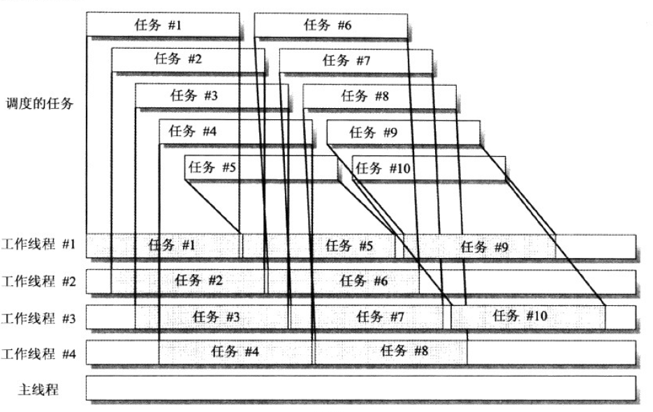

 

###   System.Threading.Tasks.Task###   

一个Task表示一个异步操作，Task提供了很多方法和属性，通过这些方法和属性能够对Task的执行进行控制，并且能够获得其状态信息。

Task的创建和执行都是独立的，因此可以对关联操作的执行拥有完全的控制权。

使用Parallel.For、Parallel.ForEach的循环迭代的并行执行，TPL会在后台创建System.Threading.Tasks.Task的实例。

使用Parallel.Invoke时，TPL也会创建与调用的委托数目一致的System.Threading.Tasks.Task的实例。

 

###   注意项###   

程序中添加很多异步的操作作为Task实例加载的时候，为了充分利用运行时所有可用的逻辑内核，任务调度器会尝试的并行的运行这些任务，也会尝试在所有的可用内核上对工作进行负载均衡。

但在实际的编码过程当中，并不是所有的代码片段都能够方便的用任务来运行，因为任务会带来额外的开销，尽管这种开销比添加线程所带来的开销要小，但是仍然需要将这个开销考虑在内。

###   【Task**状态**与**生命周期**】

一个Task实例只会完成其生命周期一次，当Task到达它的3种肯呢过的最终状态之一是，就无法回到之前的任何状态

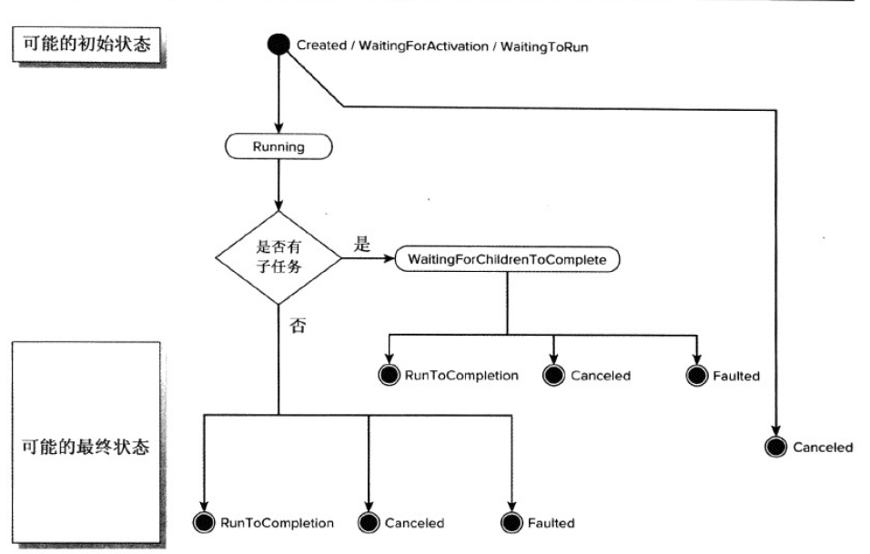

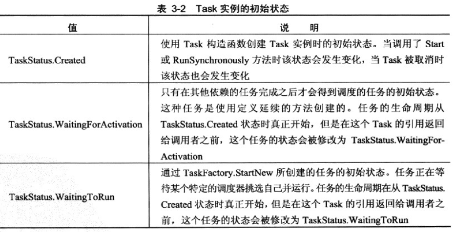

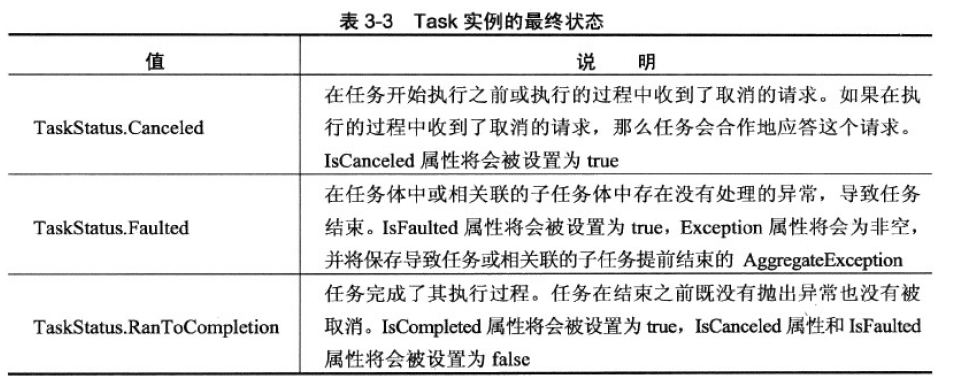

下面贴代码，详解见注释，方便大家理解Task的状态：


[](javascript:void(0);)

```csharp
    class Program
    {
        /*  coder:释迦苦僧    */
        static void Main(string[] args)
        {
            /*  创建一个任务 不调用 不执行  状态为Created */
            Task tk = new Task(() =>
            {
            });
            Console.WriteLine(tk.Status.ToString());

            /*  创建一个任务 执行  状态为 WaitingToRun */
            Task tk1 = new Task(() =>
            {
            });
            tk1.Start();/*对于安排好的任务，就算调用Start方法也不会立马启动 此时任务的状态为WaitingToRun*/
            Console.WriteLine(tk1.Status.ToString());

            /*  创建一个主任务 */
            Task mainTask = new Task(() =>
            {
                SpinWait.SpinUntil(() =>
                {
                    return false;
                }, 30000);
            });
            /*  将子任务加入到主任务完成之后执行 */
            Task subTask = mainTask.ContinueWith((t1) =>
            {
            });
            /*  启动主任务 */
            mainTask.Start();
            /*  此时子任务状态为 WaitingForActivation */
            Console.WriteLine(subTask.Status.ToString());


            /*  创建一个任务 执行 后 等待一段时间 并行未结束的情况下 状态为 Running */
            Task tk2 = new Task(() =>
            {
                SpinWait.SpinUntil(() => false, 30000);
            });
            tk2.Start();/*对于安排好的任务，就算调用Start方法也不会立马启动*/
            SpinWait.SpinUntil(() => false, 300);
            Console.WriteLine(tk2.Status.ToString());


            /*  创建一个任务 然后取消该任务 状态为Canceled */
            CancellationTokenSource cts = new CancellationTokenSource();
            Task tk3 = new Task(() =>
            {
                for (int i = 0; i < int.MaxValue; i++)
                {
                    if (!cts.Token.IsCancellationRequested)
                    {
                        cts.Token.ThrowIfCancellationRequested();
                    }
                }
            }, cts.Token);
            tk3.Start();/*启动任务*/
            SpinWait.SpinUntil(() => false, 100);
            cts.Cancel();/*取消该任务执行 但并非立马取消 所以对于Canceled状态也不会立马生效*/
            SpinWait.SpinUntil(() => false, 1000);
            Console.WriteLine(tk3.Status.ToString() + " " + tk3.IsCanceled);
            SpinWait.SpinUntil(() => false, 1000);
            Console.WriteLine(tk3.Status.ToString() + " " + tk3.IsCanceled);
            SpinWait.SpinUntil(() => false, 1000);
            Console.WriteLine(tk3.Status.ToString() + " " + tk3.IsCanceled);

            /*创建一个任务 让它成功的运行完成 会得到 RanToCompletion 状态*/
            Task tk4 = new Task(() =>
            {
                SpinWait.SpinUntil(() => false, 10);
            });
            tk4.Start();
            SpinWait.SpinUntil(() => false, 300);
            Console.WriteLine(tk4.Status.ToString());

            /*创建一个任务 让它运行失败 会得到 Faulted 状态*/
            Task tk5 = new Task(() =>
            {
                throw new Exception();
            });
            tk5.Start();
            SpinWait.SpinUntil(() => false, 300);
            Console.WriteLine(tk5.Status.ToString());

            Console.ReadLine();
        }
    }

    class Product
    {
        public string Name { get; set; }
        public string Category { get; set; }
        public int SellPrice { get; set; }
    }
```

[](javascript:void(0);)

 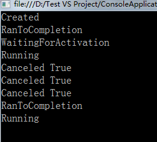

###   使用任务来对代码进行并行化###   

使用Parallel.Invoke可以并行加载多个方法，使用Task实例也能完成同样的工作，下面贴代码：


[](javascript:void(0);)

```
    class Program
    {
        private static ConcurrentQueue<Product> queue = null;
        /*  coder:释迦苦僧    */
        static void Main(string[] args)
        {
            queue = new ConcurrentQueue<Product>();
            Task tk1 = new Task(() => { SetProduct(1); SetProduct(3);});
            Task tk2 = new Task(() => SetProduct(2));
            tk1.Start();
            tk2.Start();
          
          
            Console.ReadLine();
        }
        static void SetProduct(int index)
        {
            Parallel.For(0, 10000, (i) =>
            {
                Product model = new Product();
                model.Name = "Name" + i;
                model.SellPrice = i;
                model.Category = "Category" + i;
                queue.Enqueue(model);
            });
            Console.WriteLine("SetProduct {0} 执行完成", index);
        }
    } 
    class Product
    {
        public string Name { get; set; }
        public string Category { get; set; }
        public int SellPrice { get; set; }
    }
```

[](javascript:void(0);)

​    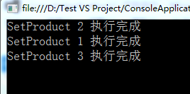 

###   等待任务完成Task.WaitAll

Task.WaitAll 方法，这个方法是同步执行的，在Task作为参数被接受，所有Task结束其执行前，主线程不会继续执行下一条指令，下面贴代码

  View Code

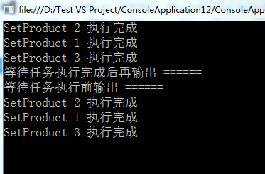

###   Task.WaitAll 限定等待时长

 

```
            queue = new ConcurrentQueue<Product>();
            Task tk1 = new Task(() => { SetProduct(1); SetProduct(3);});
            Task tk2 = new Task(() => SetProduct(2));
            tk1.Start();
            tk2.Start();

            /*如果tk1 tk2 没能在10毫秒内完成 则输出 ###   ###   *  */
            if (!Task.WaitAll(new Task[] { tk1, tk2 }, 10))
            {
                Console.WriteLine("###   ###   ###   ");
            }
          
            Console.ReadLine();
```

[](javascript:void(0);)

如图10毫秒没有完成任务，则输出了###   ###   

 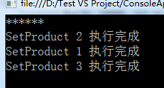

###   通过**取消标记**取消任务

通过取消标记来中断Task实例的执行。 CancellationTokenSource，CancellationToken下的IsCanceled属性标志当前是否已经被取消，取消任务，任务也不一定会马上取消，下面贴代码：


[](javascript:void(0);)

```
    class Program
    {
        private static ConcurrentQueue<Product> queue = null;
        /*  coder:释迦苦僧    */
        static void Main(string[] args)
        {
            queue = new ConcurrentQueue<Product>();
            System.Threading.CancellationTokenSource token = new CancellationTokenSource();
            Task tk1 = Task.Factory.StartNew(() => SetProduct(token.Token));
            Task tk2 = Task.Factory.StartNew(() => SetProduct(token.Token));
            Thread.Sleep(10);
            /*取消任务操作*/
            token.Cancel();
            try
            {
                /*等待完成*/
                Task.WaitAll(new Task[] { tk1, tk2 });
            }
            catch (AggregateException ex)
            {
                /*如果当前的任务正在被取消，那么还会抛出一个TaskCanceledException异常，这个异常包含在AggregateException异常中*/
                Console.WriteLine("tk1 Canceled：{0}", tk1.IsCanceled);
                Console.WriteLine("tk1 Canceled：{0}", tk2.IsCanceled);
            }

            Thread.Sleep(2000);
            Console.WriteLine("tk1 Canceled：{0}", tk1.IsCanceled);
            Console.WriteLine("tk1 Canceled：{0}", tk2.IsCanceled);
            Console.ReadLine();
        }
        static void SetProduct(System.Threading.CancellationToken ct)
        {
            /* 每一次循环迭代，都会有新的代码调用 ThrowIfCancellationRequested 
             * 这行代码能够对 OpreationCanceledException 异常进行观察
             * 并且这个异常的标记与Task实例关联的那个标记进行比较，如果两者相同 ，而且IsCancelled属性为True，那么Task实例就知道存在一个要求取消的请求，并且会将状态转变为Canceled状态，中断任务执行。  
             * 如果当前的任务正在被取消，那么还会抛出一个TaskCanceledException异常，这个异常包含在AggregateException异常中
            /*检查取消标记*/
            ct.ThrowIfCancellationRequested();
            for (int i = 0; i < 50000; i++)
            {
                Product model = new Product();
                model.Name = "Name" + i;
                model.SellPrice = i;
                model.Category = "Category" + i;
                queue.Enqueue(model);
            
                ct.ThrowIfCancellationRequested();
            }
            Console.WriteLine("SetProduct   执行完成");
        }
    }
    class Product
    {
        public string Name { get; set; }
        public string Category { get; set; }
        public int SellPrice { get; set; }
    }
```

[](javascript:void(0);)

###   Task异常处理

当很多任务并行运行的时候，可能会并行发生很多异常。Task实例能够处理一组一组的异常，这些异常有System.AggregateException类处理


[](javascript:void(0);)

```
    class Program
    {
        private static ConcurrentQueue<Product> queue = null;
        /*  coder:释迦苦僧    */
        static void Main(string[] args)
        {
            queue = new ConcurrentQueue<Product>();
            System.Threading.CancellationTokenSource token = new CancellationTokenSource();
            Task tk1 = Task.Factory.StartNew(() => SetProduct(token.Token));
            Thread.Sleep(2000);
            if (tk1.IsFaulted)
            {
                /*  循环输出异常    */
                foreach (Exception ex in tk1.Exception.InnerExceptions)
                {
                    Console.WriteLine("tk1 Exception：{0}", ex.Message);
                }
            }
            Console.ReadLine();
        }

        static void SetProduct(System.Threading.CancellationToken ct)
        {
            for (int i = 0; i < 5; i++)
            {
                throw new Exception(string.Format("Exception Index {0}", i));
            }
            Console.WriteLine("SetProduct   执行完成");
        }
    }
```

[](javascript:void(0);)

 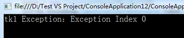

###   Task**返回值**Task < TResult>


```
    class Program
    {
        /*  coder:释迦苦僧    */
        static void Main(string[] args)
        {
            Task<List<Product>> tk1 = Task<List<Product>>.Factory.StartNew(() => SetProduct());
            Task.WaitAll(tk1);
            Console.WriteLine(tk1.Result.Count);
            Console.WriteLine(tk1.Result[0].Name);
            Console.ReadLine();
        }
        static List<Product> SetProduct()
        {
            List<Product> result = new List<Product>();
            for (int i = 0; i < 500; i++)
            {
                Product model = new Product();
                model.Name = "Name" + i;
                model.SellPrice = i;
                model.Category = "Category" + i;
                result.Add(model);
            }
            Console.WriteLine("SetProduct   执行完成");
            return result;
        }
    }
```

[](javascript:void(0);)

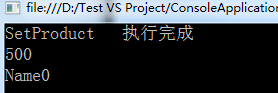

###  【ContinueWith】 通过延续串联多个任务###

ContinueWith:创建一个目标Task完成时，异步执行的延续程序，await，如代码所示：


[](javascript:void(0);)

```
    class Program
    {
        /*  coder:释迦苦僧    */
        static void Main(string[] args)
        {
            /*创建任务t1*/
            Task t1 = Task.Factory.StartNew(() =>
            {
                Console.WriteLine("执行 t1 任务");
                SpinWait.SpinUntil(() =>
                {
                    return false;
                }, 2000);

            });
            /*创建任务t2   t2任务的执行 依赖与t1任务的执行完成*/
            Task t2 = t1.ContinueWith((t) =>
            {
                Console.WriteLine("执行 t2 任务"); 
                SpinWait.SpinUntil(() =>
                {
                    return false;
                }, 2000);

            });    
            /*创建任务t3   t3任务的执行 依赖与t2任务的执行完成*/
            Task t3 = t2.ContinueWith((t) =>
            {
                Console.WriteLine("执行 t3 任务");
            });
            Console.ReadLine();
        }
    }
```

[](javascript:void(0);)

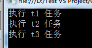

###   【TaskContinuationOptions】可选行为

TaskContinuationOptions参数，可以控制延续另一个任的任务调度和执行的可选行为。下面看代码： 

```
    class Program
    {
        /*  coder:释迦苦僧    */
        static void Main(string[] args)
        {
            /*创建任务t1*/
            Task t1 = Task.Factory.StartNew(() =>
            {
                Console.WriteLine("执行 t1 任务");
                SpinWait.SpinUntil(() =>
                {
                    return false;
                }, 2000);
                throw new Exception("异常");
            });

            /*创建任务t2   t2任务的执行 依赖与t1任务的执行完成*/
            Task t2 = t1.ContinueWith((t) =>
            {
                Console.WriteLine(t.Status);
                Console.WriteLine("执行 t2 任务");
                SpinWait.SpinUntil(() =>
                {
                    return false;
                }, 2000);

                /*定义 TaskContinuationOptions 行为为 NotOnFaulted 在 t1 任务抛出异常后，t1 的任务状态为 Faulted ， 则t2 不会执行里面的方法 但是需要注意的是t3任务*/
                /*t2在不符合条件时 返回Canceled状态状态让t3任务执行*/
            }, TaskContinuationOptions.NotOnFaulted);
            /*创建任务t3   t3任务的执行 依赖与t2任务的执行完成*/

            /*t2在不符合条件时 返回Canceled状态状态让t3任务执行*/
            Task t3 = t2.ContinueWith((t) =>
            {
                Console.WriteLine(t.Status);
                Console.WriteLine("执行 t3 任务");
            });

            Console.ReadLine();
        }
    }
```

[](javascript:void(0);)

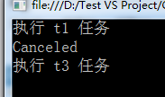

TaskContinuationOptions 属性有很多，如下所示

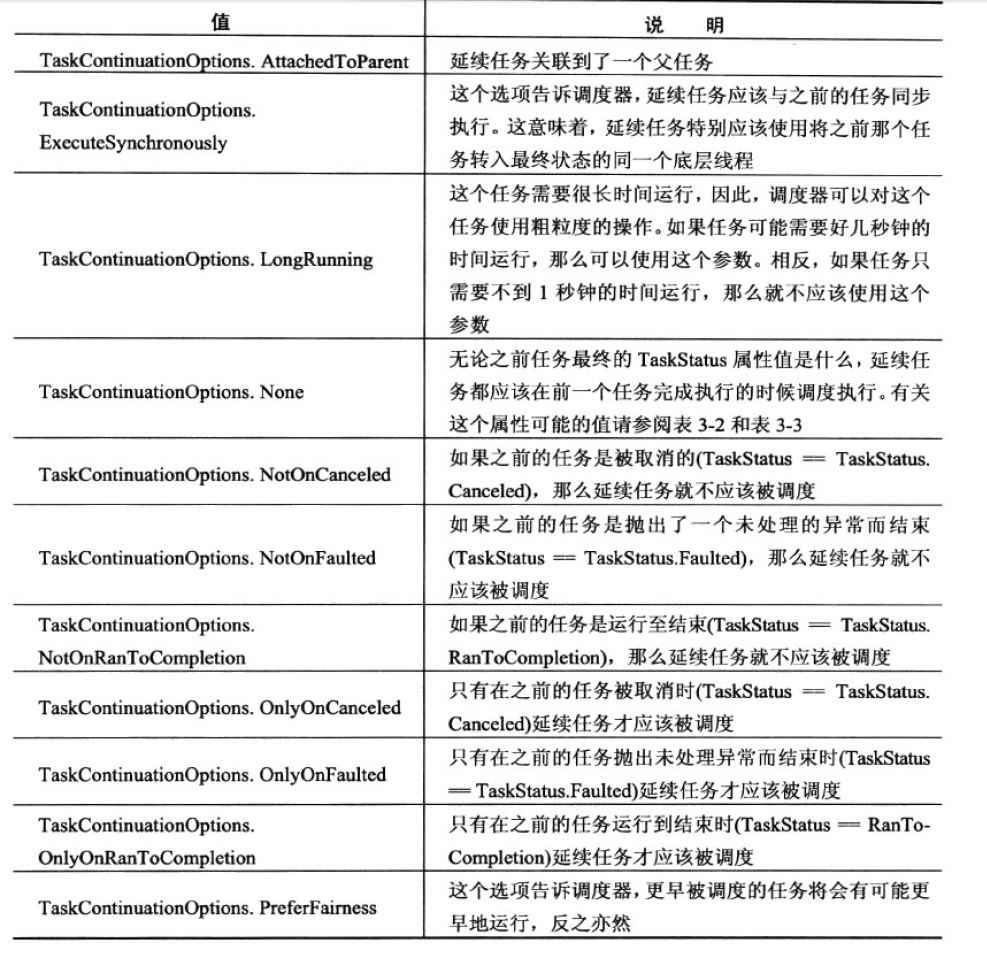

 关于并行编程中的Task就写到这，如有问题，请指正。


作者：释迦苦僧 出处：<http://www.cnblogs.com/woxpp/p/3928788.html>
本文版权归作者和博客园共有，欢迎转载，但未经作者同意必须保留此段声明，且在文章页面明显位置给出原文连接。