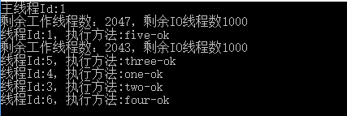
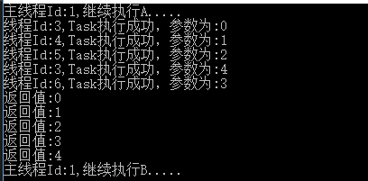
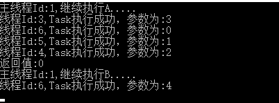
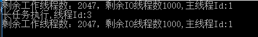
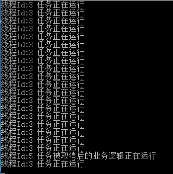
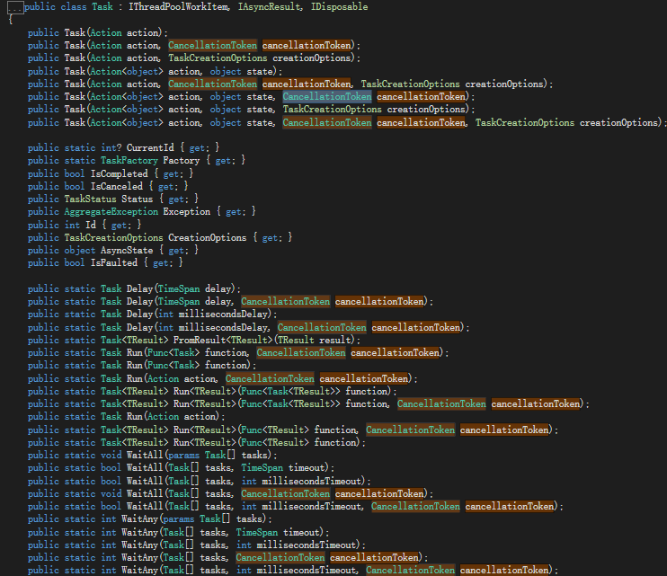
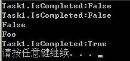
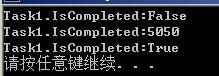
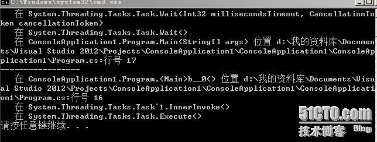

# [Task类使用总结](https://blog.csdn.net/qq_36598803/article/details/77645651)

 [原文1](https://blog.51cto.com/cnn237111/1102476)

[任务2（task）](https://blog.csdn.net/ahilll/article/details/81702312)

 [新手浅谈C#Task异步编程](https://www.cnblogs.com/qiandi/p/4704255.html)


参考资料：《C# 5.0 IN A NUTSHELL》

 MSDN官方资料

 本文出自 “[一只博客](http://cnn237111.blog.51cto.com/)” 博客，请务必保留此出处<http://cnn237111.blog.51cto.com/2359144/1102476>

##	概念

由于Framework 4.0和Framework 4.5对Task类稍微有些不同，此处声明以下代码都是基于Framework 4.5

------

Task类和Task<TResult>类，后者是前者的###   泛型版本###   。TResult类型为Task所调用方法的返回值。

主要区别在于Task构造函数接受的参数是###   Action委托###   ，而Task<TResult>接受的是###   Func<TResult>委托###   。

```
Task(Action) Task<TResult>(Func<TResult>)  
```

 


## 任务概述

**线程（Thread）**是创建并发的底层工具，因此有一定的局限性（不易得到返回值（必须通过创建共享域）；异常的捕获和处理也麻烦；同时线程执行完毕后无法再次开启该线程），这些局限性会降低性能同时影响并发性的实现（不容易组合较小的并发操作实现较大的并发操作，会增加手工同步处理（加锁，发送信号）的依赖，容易出现问题）。

**线程池的（ThreadPool）**的**QueueUserWorkItem**方法很容发起一次异步的计算限制操作。但这个技术同样有着许多限制，最大的问题是没有内建的机制让你知道操作在什么时候完成，也没有机制在操作完成时获得返回值。

而**Task**类可以解决上述所有的问题。

**任务（Task）**表示一个通过或不通过线程实现的并发操作，**任务**是可组合的，使用**延续（continuation）**可将它们串联在一起，它们可以使用线程池减少启动延迟，可使用回调方法避免多个线程同时等待I/O密集操作。

Task机制就是更新潮、更智能的服务调度机制。

## 基础任务（Task）

微软在.NET 4.0 引入**任务（Task）**的概念。通过System.Threading.Tasks命名空间使用**任务**。它是在ThreadPool的基础上进行封装的。**Task**默认都是使用**池化线程**，它们都是**后台线程**，这意味着主线程结束时其它任务也会随之停止。

> 在thread pool时期，[我们不能知道一个workitem是否完成，也不能在完成后知道workitem所得出的返回值](https://bbs.csdn.net/topics/370117994)，task就是封装后解决这个问题的。当然这个只是小方面。Task还**优化了thread pool的调用机制**，在多核的情况下可以得到更好的效率，兄弟可以去网上查查thread pool和task CPU运行效率图。还有就是**task还封装了一些同步机制**，详细可以看看他的API.


启动一个任务有多种方式，如以下示例：

```
 1     class Program
 2     {
 3         static void Main(string[] args)
 4         {
 5             Console.WriteLine("主线程Id:{0}", Thread.CurrentThread.ManagedThreadId);
 6             int workerThreadsCount, completionPortThreadsCount;
 7             ThreadPool.GetAvailableThreads(out workerThreadsCount, out completionPortThreadsCount);
 8             Console.WriteLine("剩余工作线程数：{0}，剩余IO线程数{1}", workerThreadsCount, completionPortThreadsCount);
 9             //第一种：实例化方式Start启动
10             {
11                 Task task = new Task(() =>
12                 {
13                     Test("one-ok");
14                 });
15                 task.Start();
16             }
17             //第二种：通过Task类静态方法Run方式进行启动
18             {
19                 Task.Run(() =>
20                 {
21                     Test("two-ok");
22                 });
23             }
24             //第三种：通过TaskFactory的StartNew方法启动
25             {
26                 TaskFactory taskFactory = new TaskFactory();
27                 taskFactory.StartNew(() =>
28                 {
29                     Test("three-ok");
30                 });
31             }
32             //第四种：.通过Task.Factory进行启动
33             {
34                 Task taskStarNew = Task.Factory.StartNew(() =>
35                 {
36                     Test("four-ok");
37                 });
38             }
39             //第五种：通过Task对象的RunSynchronously方法启动（同步,由主线程执行，会卡主线程）
40             {
41                 Task taskRunSync = new Task(() =>
42                 {
43                     Console.WriteLine("线程Id:{0}，执行方法:five-ok", Thread.CurrentThread.ManagedThreadId);
44                 });
45                 taskRunSync.RunSynchronously();
46             }
47             Thread.Sleep(1000);
48             ThreadPool.GetAvailableThreads(out workerThreadsCount, out completionPortThreadsCount);
49             Console.WriteLine("剩余工作线程数：{0}，剩余IO线程数{1}", workerThreadsCount, completionPortThreadsCount);
50             Console.ReadKey();
51         }
52         static void Test(string o)
53         {
54             Thread.Sleep(2000);
55             Console.WriteLine("线程Id:{0}，执行方法:{1}", Thread.CurrentThread.ManagedThreadId, o);
56         }
57         /*
58          * 作者：Jonins
59          * 出处：http://www.cnblogs.com/jonins/
60          */
61     }
```

执行结果：



上面示例中除去使用RunSynchronously方法启动的是同步任务（由启用的线程执行任务）外，其它几种方式内部都由**线程池**内的**工作者线程**处理。

**说明**：

1.事实上Task.Factory类型本身就是TaskFactory（任务工厂），而Task.Run（在.NET4.5引入，4.0版本调用的是后者）是Task.Factory.StartNew的简写法，是后者的重载版本，更灵活简单些。

2.调用静态Run方法会自动创建Task对象并立即调用Start

3.如Task.Run等方式启动任务并没有调用Start,因为它创建的是“热”任务，相反“冷”任务的创建是通过Task构造函数。

 

## 返回值（Task<TResult>）&状态（Status）

**Task**有一个泛型子类**Task<TResult>**,它允许任务返回一个值。调用Task.Run，传入一个Func<Tresult>代理或兼容的Lambda表达式，然后查询Result属性获得结果。**如果任务没有完成，那么访问Result属性会阻塞当前线程，直至任务完成**。

```
1     public static Task<TResult> Run<TResult>(Func<TResult> function);
```

而任务的**Status**属性可用于跟踪任务的执行状态，如下所示：

```
 1     class Program
 2     {
 3         static void Main(string[] args)
 4         {
 5             Task<int> task = Task.Run(() =>
 6             {
 7                 int total = 0;
 8                 for (int i = 0; i <= 100; i++)
 9                 {
10                     total += i;
11                 }
12                 Thread.Sleep(2000);
13                 return total;
14             });
15             Console.WriteLine("任务状态:{0}",task.Status);
16             Thread.Sleep(1000);
17             Console.WriteLine("任务状态:{0}", task.Status);
18             int totalCount = task.Result;//如果任务没有完成，则阻塞
19             Console.WriteLine("任务状态:{0}", task.Status);
20             Console.WriteLine("总数为：{0}",totalCount);
21             Console.ReadKey();
22         }
23     }
```

执行如下：

 

Reulst属性内部会调用Wait（等待）；

任务的**Status属性**是一个**TaskStatus**枚举类型：

```
1  public TaskStatus Status { get; }
```

说明如下：

| 枚举值                       | 说明                                                         |
| ---------------------------- | ------------------------------------------------------------ |
| Canceled                     | 任务已通过对其自身的 CancellationToken 引发 OperationCanceledException 对取消进行了确认，此时该标记处于已发送信号状态； 或者在该任务开始执行之前，已向该任务的 CancellationToken 发出了信号。 |
| Created                      | 该任务已初始化，但尚未被计划。                               |
| Faulted                      | 由于未处理异常的原因而完成的任务。                           |
| RanToCompletion              | 已完成执行的任务。                                           |
| Running                      | 任务正在运行，尚未完成。                                     |
| WaitingForActivation         | 该任务正在等待 .NET Framework 基础结构在内部将其激活并进行计划。 |
| WaitingForChildrenToComplete | 该任务已完成执行，正在隐式等待附加的子任务完成。             |
| WaitingToRun                 | 该任务已被计划执行，但尚未开始执行。                         |

 

## 任务集合返回值（WhenAll&WhenAny）

 **Task**中有非常方便的对并行运行的任务集合获取返回值的方式，比如**WhenAll**和**WhenAny**。

### 1.WhenAll

**WhenAll：**等待提供的所有 Task 对象完成执行过程（所有任务全部完成）。

```
 1     class Program
 2     {
 3         static void Main(string[] args)
 4         {
 5             List<Task<int>> taskList = new List<Task<int>>();//声明一个任务集合
 6             TaskFactory taskFactory = new TaskFactory();
 7             for (int i = 0; i < 5; i++)
 8             {
 9                 int total = i;
10                 Task<int> task = taskFactory.StartNew(() => Test(total));
11                 taskList.Add(task);//将任务放进集合中
12             }
13             Console.WriteLine("主线程Id:{0},继续执行A.....", Thread.CurrentThread.ManagedThreadId);
14             Task<int[]> taskReulstList = Task.WhenAll(taskList);//创建一个任务，该任务将集合中的所有 Task 对象都完成时完成
15             for (int i = 0; i < taskReulstList.Result.Length; i++)//这里调用了Result,所以会阻塞线程，等待集合内所有任务全部完成
16             {
17                 Console.WriteLine("返回值:{0}", taskReulstList.Result[i]);//遍历任务集合内Task返回的值
18             }
19             Console.WriteLine("主线程Id:{0},继续执行B.....", Thread.CurrentThread.ManagedThreadId);
20             Console.ReadKey();
21         }
22         private static int Test(int o)
23         {
24             Console.WriteLine("线程Id:{0},Task执行成功，参数为:{1}", Thread.CurrentThread.ManagedThreadId, o);
25             Thread.Sleep(500 * o);
26             return o;
27         }
28     }
```

执行结果：



### 2.WhenAny

**WhenAny**：等待提供的任一 Task 对象完成执行过程（只要有一个任务完成）。

```
 1     class Program
 2     {
 3         static void Main(string[] args)
 4         {
 5             List<Task<int>> taskList = new List<Task<int>>();//声明一个任务集合
 6             TaskFactory taskFactory = new TaskFactory();
 7             for (int i = 0; i < 5; i++)
 8             {
 9                 int total = i;
10                 Task<int> task = taskFactory.StartNew(() => Test(total));
11                 taskList.Add(task);//将任务放进集合中
12             }
13             Console.WriteLine("主线程Id:{0},继续执行A.....", Thread.CurrentThread.ManagedThreadId);
14             Task<Task<int>> taskReulstList = Task.WhenAny(taskList);//创建一个任务，该任务将在集合中的任意 Task 对象完成时完成
15             Console.WriteLine("返回值:{0}", taskReulstList.Result.Result);//得到任务集合内最先完成的任务的返回值
16             Console.WriteLine("主线程Id:{0},继续执行B.....", Thread.CurrentThread.ManagedThreadId);
17             Console.ReadKey();
18         }
19         private static int Test(int o)
20         {
21             Console.WriteLine("线程Id:{0},Task执行成功，参数为:{1}", Thread.CurrentThread.ManagedThreadId, o);
22             Thread.Sleep(500 * o);
23             return o;
24         }
25     }
```

执行结果（这里返回值肯定会是0，因为休眠最短）：



 

## 等待（Wait）&执行方式（TaskCreationOptions）

### 1.任务等待（Wait）

调用任务的**Wait**方法可以阻塞任务直至任务完成，类似于线程的**join。**

```
 1     class Program
 2     {
 3         static void Main(string[] args)
 4         {
 5             Task task = Task.Run(() =>
 6             {
 7                 Console.WriteLine("线程执行Begin");
 8                 Thread.Sleep(2000);
 9                 Console.WriteLine("线程执行End");
10             });
11             Console.WriteLine("任务是否完成:{0}", task.IsCompleted);
12             task.Wait();//阻塞，直至任务完成
13             Console.WriteLine("任务是否完成:{0}", task.IsCompleted);
14             Console.ReadKey();
15         }
16     }
```

执行如下：


**注意**：

线程调用Wait方法时，系统检测线程要等待的Task是否已经开始执行。如果是线程则会阻塞直到Task运行结束为止。但如果Task还没有开始执行任务，系统可能（取决于TaskScheduler）使用调用Wait的线程来执行Task,这种情况下调用Wait的线程不会阻塞，它会执行Task并立即返回。好处在于没有线程会被阻塞，所以减少了资源占用。不好的地方在于加入线程在调用Wait前已经获得了一个线程同步锁，而Task试图获取同一个锁，就会造成死锁的线程。

### 2.任务执行方式（TaskCreationOptions）

我们知道为了创建一个Task，需要调用构造函数并传递一个Action或Action<object>委托，如果传递的是期待一个Object的方法，还必须向Task的构造函数穿都要传给操作的实参。还可以选择向构造器传递一些**TaskCreationOptions**标记来控制Task的执行方式。

 **TaskCreationOptions为枚举类型**

| 枚举值           | 说明                                                         |
| ---------------- | ------------------------------------------------------------ |
| None             | 默认。                                                       |
| PreferFairness   | 尽可能公平的方式安排任务，即先进先执行。                     |
| LongRunning      | 指定任务将是长时间运行的，会新建线程执行，不会使用池化线程。 |
| AttachedToParent | 指定将任务附加到任务层次结构中的某个父级                     |
| DenyChildAttach  | 任务试图和这个父任务连接将抛出一个InvalidOperationException  |
| HideScheduler    | 强迫子任务使用默认调度而非父级任务调度                       |

在默认情况下，**Task内部是运行在池化线程上，这种线程会非常适合执行短计算密集作业。如果要执行长阻塞操作，则要避免使用池化线程。**

在池化线程上运行一个长任务问题不大，但是如果要同时运行多个长任务（特别是会阻塞的任务），则会对性能产生影响。最好使用：TaskCreationOptions.LongRunning。

```
 1     class Program
 2     {
 3         static void Main(string[] args)
 4         {
 5             int workerThreadsCount, completionPortThreadsCount;
 6             ThreadPool.GetAvailableThreads(out workerThreadsCount, out completionPortThreadsCount);
 7             Console.WriteLine("剩余工作线程数：{0}，剩余IO线程数{1},主线程Id:{2}", workerThreadsCount, completionPortThreadsCount, Thread.CurrentThread.ManagedThreadId);
 8             Task task = Task.Factory.StartNew(() =>
 9             {
10                 Console.WriteLine("长任务执行,线程Id:{0}", Thread.CurrentThread.ManagedThreadId);
11                 Thread.Sleep(2000);
12             }, TaskCreationOptions.LongRunning);
13             Thread.Sleep(1000);
14             ThreadPool.GetAvailableThreads(out workerThreadsCount, out completionPortThreadsCount);
15             Console.WriteLine("剩余工作线程数：{0}，剩余IO线程数{1},主线程Id:{2}", workerThreadsCount, completionPortThreadsCount, Thread.CurrentThread.ManagedThreadId);
16             Console.ReadKey();
17         }
18     }
```

执行结果如下：



**注意**：

如果使运行I/O密集任务，则可以使用**TaskCompletionSource**和异步函数（asynchronous functions），通过**回调（延续）实现并发性**，而是不通过线程实现。

如果使运行计算密集性任务，则**可以使用一个生产者/消费者队列**，控制这些任务的并发数量，避免出现线程和进程阻塞的问题。

 

## 延续（continuation）&延续选项（TaskContinuationOptions）

**延续（continuation）**会告诉**任务**在完成后继续执行下面的操作。延续通常由一个回调方法实现，它会在操作完成之后执行一次。给一个任务附加延续的方法有两种

### 1.**GetAwaiter**

任务的方法**GetAwaiter**是Framework 4.5新增加的，而C# 5.0的异步功能使用了这种方法，因此它非常重要。给一个任务附加**延续**如下：

```
 1     class Program
 2     {
 3         static void Main(string[] args)
 4         {
 5             Task<int> task = Task.Run(() =>
 6              {
 7                  int total = 0;
 8                  for (int i = 0; i <= 100; i++)
 9                  {
10                      total += i;
11                  }
12                  Thread.Sleep(2000);
13                  return total;
14              });
15             var awaiter = task.GetAwaiter();
16             awaiter.OnCompleted(() =>
17             {
18                 int result = awaiter.GetResult();//在延续中获取Task的执行结果
19                 Console.WriteLine(result);
20             });
21             Console.ReadKey();
22         }
23     }
```

执行结果控制台会打印：5050。

调用**GetAwaiter**会返回一个等待者（**awaiter**）对象，它会让先导（antecedent）任务在任务完成（或出错）之后执行一个代理。已经完成的任务也可以附加一个延续，这事延续会马上执行。

**注意**：

1.等待者（**awaiter**）可以是任意对象，但必须包含特定的两个方法和一个Boolean类型属性。

```
1   public struct TaskAwaiter<TResult> : ICriticalNotifyCompletion, INotifyCompletion
2     {
3         public bool IsCompleted { get; }
4         public TResult GetResult();
5         public void OnCompleted(Action continuation);
6     }
```

2.先导任务出现错误，那么当延续代码调用**awaiter.GetResult()**时就会重新抛出异常。我们可以需要调用GetResult,而是直接访问先导任务的Result属性（**task.Result**）。

**GetResult**的好处是，当先导任务出现错误时，异常可以直接抛出而不封装在**AggregateException**中。

3.如果出现同步上下文，那么会自动捕捉它，然后延续提交到这个上下文中。在无需同步上下文的情况下通常不采用这种方法，使用**ConfigureAwait**代替它。它通常会使**延续**运行在**先导任务**所在的线程上，从而避免不必要的过载。

```
1    var awaiter = task.ConfigureAwait(false).GetAwaiter();
```

### 2.ContinueWith

另一种附加延续的方法是调用任务的**ContinueWith**方法：

```
 1         static void Main(string[] args)
 2         {
 3             Task<int> task = Task.Run(() =>
 4             {
 5                 int total = 0;
 6                 for (int i = 0; i <= 100; i++)
 7                 {
 8                     total += i;
 9                 }
10                 Thread.Sleep(2000);
11                 return total;
12             });
13             task.ContinueWith(continuationAction =>
14             {
15                 int result = continuationAction.Result;
16                 Console.WriteLine(result);
17             });
18             Console.ReadKey();
19         }
```

**ContinueWith**本身会返回一个Task,它非常适用于添加更多的延续。然后如果任务出现错误，我们必须直接处理AggregateException。

如果想让延续运行在统一个线程上，必须指定 TaskContinuationOptions.ExecuteSynchronously；否则它会弹回线程池。**ContinueWith**特别适用于并行编程场景。

### 3.延续选项（TaskContinuationOptions）

在使用**ContinueWith**时可以指定任务的延续选项即**TaskContinuationOptions**，它的前六个枚举类型与之前说的**TaskCreationOptions**枚举提供的标志完全一样，补充后续几个枚举值：

| 枚举值                | 说明                                                         |
| --------------------- | ------------------------------------------------------------ |
| LazyCancellation      | 除非先导任务完成，否则禁止延续任务完成（取消）。             |
| NotOnRanToCompletion  | 指定不应在延续任务前面的任务已完成运行的情况下安排延续任务。 |
| NotOnFaulted          | 指定不应在延续任务前面的任务引发了未处理异常的情况下安排延续任务。 |
| NotOnCanceled         | 指定不应在延续任务前面的任务已取消的情况下安排延续任务。     |
| OnlyOnCanceled        | 指定只应在延续前面的任务已取消的情况下安排延续任务。         |
| OnlyOnFaulted         | 指定只有在延续任务前面的任务引发了未处理异常的情况下才应安排延续任务。 |
| OnlyOnRanToCompletion | 指定只有在延续任务前面的任务引发了未处理异常的情况下才应安排延续任务。 |
| ExecuteSynchronously  | 指定希望由先导任务的线程执行，先导任务完成后线程继续执行延续任务。 |

 

**ExecuteSynchronously**是指同步执行，两个任务都在同一个=线程一前一后的执行。

ContinueWith结合TaskContinuationOptions使用的示例：

```
 1     class Program
 2     {
 3         static void Main(string[] args)
 4         {
 5             Task<int> task = Task.Run(() =>
 6             {
 7                 int total = 0;
 8                 for (int i = 0; i <= 100; i++)
 9                 {
10                     total += i;
11                 }
12                 if (total == 5050)
13                 {
14                     throw new Exception("错误");//这段代码可以注释或开启，用于测试
15                 }
16                 return total;
17             });
18             //指定先导任务无报错的延续任务
19             task.ContinueWith(continuationAction =>
20             {
21                 int result = continuationAction.Result;
22                 Console.WriteLine(result);
23             }, TaskContinuationOptions.NotOnFaulted);
24             //指定先导任务报错时的延续任务
25             task.ContinueWith(continuationAction =>
26             {
27                 foreach (Exception ex in continuationAction.Exception.InnerExceptions)//有关AggregateException异常处理后续讨论
28                 {
29                     Console.WriteLine(ex.Message);
30                 }
31             }, TaskContinuationOptions.OnlyOnFaulted);
32             Console.ReadKey();
33         }
34     }
```

执行结果会打印：报错，如果注释掉抛出异常的代码则会打印5050。

 

## TaskCompletionSource

另一种创建任务的方法是使用**TaskCompletionSource**。它允许创建一个任务，并可以任务分发给使用者，并且这些使用者可以使用该任务的任何成员。它的实现原理是通过一个可以手动操作的“附属”任务，用于指示操作完成或出错的时间。

**TaskCompletionSource的真正作用是创建一个不绑定线程的任务（手动控制任务工作流，可以使你把创建任务和完成任务分开）**。

这种方法非常适合I/O密集作业：可以利用所有任务的优点（它们能够生成返回值、异常和延续），但不会在操作执行期间阻塞线程。

例如，假设一个任务需要等待2秒，然后返回10，我们的方法会返回在一个2秒后完成的任务，通过给任务附加一个延续就可以在不阻塞任何线程的前提下打印这个结果，如下：

```
 1     class Program
 2     {
 3         static void Main(string[] args)
 4         {
 5             var awaiter = Demo(2000).GetAwaiter();//得到任务通过延续输出返回值
 6             awaiter.OnCompleted(() =>
 7             {
 8                 Console.WriteLine(awaiter.GetResult());
 9             });
10             Console.WriteLine("主线程继续执行....");
11             Console.ReadKey();
12         }
13         static Task<int> Demo(int millis)
14         {
15             //创建一个任务完成源
16             TaskCompletionSource<int> taskCompletionSource = new TaskCompletionSource<int>();
17             var timer = new System.Timers.Timer(millis) { AutoReset = false };
18             timer.Elapsed += delegate
19             {
20                 timer.Dispose(); taskCompletionSource.SetResult(10);//写入返回值
21             };
22             timer.Start();
23             return taskCompletionSource.Task;//返回任务
24         }
25     }
```

执行结果：


**注意**：如果多次调用SetResult、SetException或SetCanceled，它们会抛出异常，而TryXXX会返回false。

 

## 任务取消（CancellationTokenSource）

一些情况下，后台任务可能运行很长时间，取消任务就非常有用了。.NET提供了一种标准的任务取消机制可用于**基于任务的异步模式**。

**取消**基于**CancellationTokenSource**类，该类可用于发送取消请求。请求发送给引用**CancellationToken**类的任务，其中**CancellationToken**类与**CancellationTokenSource**类相关联。

使用示例如下：

```
 1     class Program
 2     {
 3         static void Main(string[] args)
 4         {
 5             //构造函数 指定延迟2秒后自动取消任务
 6             CancellationTokenSource source = new CancellationTokenSource(2000);
 7             //注册一个任务取消后执行的委托
 8             source.Token.Register(() =>
 9             {
10                 Console.WriteLine("线程Id:{0} 任务被取消后的业务逻辑正在运行", Thread.CurrentThread.ManagedThreadId);
11             });
12             //启动任务，将取消标记源带入参数
13             Task.Run(() =>
14             {
15                 while (!source.IsCancellationRequested)//IsCancellationRequested为True时取消任务
16                 {
17                     Thread.Sleep(100);
18                     Console.WriteLine("线程Id:{0} 任务正在运行", Thread.CurrentThread.ManagedThreadId);
19                 }
20             }, source.Token);
21             //主线程挂起2秒后手动取消任务
22             {
23                 //Thread.Sleep(2000);
24                 //source.Cancel();//手动取消任务
25             }
26             //主线程不阻塞，2秒后自动取消任务
27             {
28                 source.CancelAfter(2000);
29             }
30             Console.ReadKey();
31         }
32     }
```

执行结果：



根据**Register**方法绑定任务取消后的委托

```
1   public CancellationTokenRegistration Register(Action callback);
2   public CancellationTokenRegistration Register(Action callback, bool useSynchronizationContext);
3   public CancellationTokenRegistration Register(Action<object> callback, object state);
4   public CancellationTokenRegistration Register(Action<object> callback, object state, bool useSynchronizationContext);
```

**手动取消任务**：**Cancel**方法

**自动取消任务**：

1.**CancelAfter**方法后面可以带入参数指定延迟多少后时间取消任务。

```
1   public void CancelAfter(TimeSpan delay);
2   public void CancelAfter(int millisecondsDelay);
```

2.**CancellationTokenSource**构造函数可以带入参数指定延迟多少时间后取消任务。

```
1   public CancellationTokenSource(TimeSpan delay);
2   public CancellationTokenSource(int millisecondsDelay);
```

任务绑定**CancellationTokenSource**对象，在Task源码中可以带入**CancellationToken**对象的启动任务方式都可以绑定**CancellationTokenSource。**



 

## **异步等待 （Task.Delay）**

 异步等待非常实用，因此它成为**Task**类的一个静态方法

 常用的使用方式有2种，如下：

```
 1     class Program
 2     {
 3         static void Main(string[] args)
 4         {
 5             //第1种
 6             {
 7                 Task.Delay(2000).ContinueWith((o) =>
 8                 {
 9                     Console.WriteLine("线程Id:{0},异步等待2秒后执行的逻辑", Thread.CurrentThread.ManagedThreadId);
10                 });
11             }
12             //第2种
13             {
14                 Task.Delay(3000).GetAwaiter().OnCompleted(() =>
15                 {
16                     Console.WriteLine("线程Id:{0},异步等待3秒后执行的逻辑", Thread.CurrentThread.ManagedThreadId);
17                 });
18             }
19             Console.WriteLine("主线程Id:{0},继续执行", Thread.CurrentThread.ManagedThreadId);
20             Console.ReadKey();
21         }
22     }
```

执行结果如下：


**Task.Delay**是**Thread.Sleep**的异步版本。而它们的区别如下（引自 禅道 ）：

> 1.Thread.Sleep 是同步延迟，Task.Delay异步延迟。
>
> 2.Thread.Sleep 会阻塞线程，Task.Delay不会。
>
> 3.Thread.Sleep不能取消，Task.Delay可以。
>
> \4. Task.Delay() 比 Thread.Sleep() 消耗更多的资源，但是Task.Delay()可用于为方法返回Task类型；或者根据CancellationToken取消标记动态取消等待。
>
> **5. Task.Delay() 实质创建一个运行给定时间的任务， Thread.Sleep() 使当前线程休眠给定时间。**

 

## 异常（AggregateException）

与线程不同，任务可以随时抛出异常。所以，如果任务中的代码抛出一个未处理异常，那么这个异常会自动传递到调用Wait()或Task<TResult>的Result属性的代码上。
任务的异常将会自动捕获并抛给调用者。为确保报告所有的异常，CLR会将异常封装在**AggregateException**容器中，该容器公开的**InnerExceptions**属性中包含所有捕获的异常，从而更适合并行编程。

```
 1     class Program
 2     {
 3         static void Main(string[] args)
 4         {
 5             try
 6             {
 7                 Task.Run(() =>
 8                 {
 9                     throw new Exception("错误");
10                 }).Wait();
11             }
12             catch (AggregateException axe)
13             {
14                 foreach (var item in axe.InnerExceptions)
15                 {
16                     Console.WriteLine(item.Message);
17                 }
18             }
19             Console.ReadKey();
20         }
21     }
```

上述示例控制台会显示：错误

**注意**：

使用**Task**的**IsFaulted**和**IsCanceled**属性，就可以不重新抛出异常而检测出错的任务。
1.IsFaulted和IsCanceled都返回False，表示没有错误发生。
2.IsCanceled为True，则任务抛出了**OperationCanceledOperation**(取消线程正在执行的操作时在线程中抛出的异常)。
3.IsFaulted为True,则任务抛出另一种异常，而Exception属性包含了该错误。

### 1.Flatten

当子任务抛出异常时，通过调用**Flatten**方法，可以消除任意层次的嵌套以简化异常处理。

```
 1     class Program
 2     {
 3         static void Main(string[] args)
 4         {
 5             var parent = Task.Factory.StartNew(() =>
 6             {
 7                 int[] numbers = { 0 };
 8                 var childFactory = new TaskFactory(TaskCreationOptions.AttachedToParent, TaskContinuationOptions.None);
 9                 childFactory.StartNew(() => 10 / numbers[0]);//除零
10                 childFactory.StartNew(() => numbers[1]);//超出索引范围
11                 childFactory.StartNew(() => throw null);//空引用
12             });
13             try
14             {
15                 parent.Wait();
16             }
17             catch (AggregateException axe)
18             {
19                 foreach (var item in axe.Flatten().InnerExceptions)
20                 {
21                     Console.WriteLine(item.Message);
22                 }
23             }
24             Console.ReadKey();
25         }
26     }
```


### 2.Handle

 如果需要只捕获特定类型异常，并重抛其它类型的异常，**Handle**方法为此提供了一种快捷方式。

Handle接受一个predicate(异常断言），并在每个内部异常上运行此断言。

```
1 public void Handle(Func<Exception, bool> predicate);
```

如果断言返回True,它认为该异常是“已处理”，当所有异常过滤之后：

1.如果所有异常是已处理的，异常不会抛出。

2.如果存在异常未处理，就会构造一个新的AggregateException对象来包含这些异常并抛出。

 

```
 1     class Program
 2     {
 3         static void Main(string[] args)
 4         {
 5             var parent = Task.Factory.StartNew(() =>
 6             {
 7                 int[] numbers = { 0 };
 8                 var childFactory = new TaskFactory(TaskCreationOptions.AttachedToParent, TaskContinuationOptions.None);
 9                 childFactory.StartNew(() => 10 / numbers[0]);//除零
10                 childFactory.StartNew(() => numbers[1]);//超出索引范围
11                 childFactory.StartNew(() => throw null);//空引用
12             });
13             try
14             {
15                 try
16                 {
17                     parent.Wait();
18                 }
19                 catch (AggregateException axe)
20                 {
21                     axe.Flatten().Handle(ex =>
22                     {
23                         if (ex is DivideByZeroException)
24                         {
25                             Console.WriteLine("除零-错误处理完毕");
26                             return true;
27                         }
28                         if (ex is IndexOutOfRangeException)
29                         {
30                             Console.WriteLine("超出索引范围-错误处理完毕");
31                             return true;
32                         }
33                         return false;//所有其它 异常重新抛出
34                     });
35 
36                 }
37             }
38             catch (AggregateException axe)
39             {
40                 foreach (var item in axe.InnerExceptions)//捕获重新抛出的异常
41                 {
42                     Console.WriteLine(item.Message);
43                 }
44             }
45             Console.ReadKey();
46         }
47     }
```

执行结果：


 

##  结语

1.async和await这两个关键字下篇记录。

2.任务调度器（TaskScheduler）是Task之所以如此灵活的本质，我们常说Task是在ThreadPool上更升级化的封装，其实很大程度上归功于这个对象，考虑下篇要不要说一下，但其实我看的都头疼...

3.Task类包含很多的重载，最好F12跳到Task内熟悉下结构。

 

## 参考文献 

CLR via C#（第4版） Jeffrey Richter

C#高级编程（第10版） C# 6 & .NET Core 1.0   Christian Nagel  

果壳中的C# C#5.0权威指南  Joseph Albahari

C#并发编程 经典实例  Stephen Cleary


---


## 操作

###   启动一个任务###    

```csharp
static void Main(string[] args)         {             
    Task Task1 = new Task(() => Console.WriteLine("Task1"));             Task1.Start();             Console.ReadLine();         } 
```

通过实例化一个Task对象，然后Start，这种方式中规中矩，但是实践中，通常采用更方便快捷的方式

```csharp
Task.Run(() => Console.WriteLine("Foo"));
```

这种方式直接运行了Task，不像上面的方法还需要调用Start();

Task.Run方法是Task类中的静态方法，接受的参数是委托。返回值是为该Task对象。

Task.Run(Action)

Task.Run<TResult>(Func<Task<TResult>>)

Task构造方法还有一个重载函数如下：

Task 构造函数 (Action, TaskCreationOptions)，对应的Task泛型版本也有类似构造函数。TaskCreationOptions参数指示Task创建和执行的可选行为。常用的参数LongRunning。

默认情况下，Task任务是由###   *线程池线程异步执行###   *的。如果是运行时间很长的操作，使用LongRunning 参数暗示任务调度器，*将这个任务放在非线程池上运行。通常不需要用这个参数，除非通过性能测试觉得使用该参数能有更好的性能，才使用*。

###   任务等待###   

默认情况下，Task任务是由线程池线程异步执行。要知道Task任务的是否完成，可以通过task.IsCompleted属性获得，也可以使用task.Wait来等待Task完成。Wait会阻塞当前线程。 

```csharp
    static void Main(string[] args) 
            { 
                Task Task1=Task.Run(() => { Thread.Sleep(5000); 
                Console.WriteLine("Foo"); 
                    Thread.Sleep(5000); 
                }); 
                Console.WriteLine(Task1.IsCompleted); 
                Task1.Wait();//阻塞当前线程 
                Console.WriteLine(Task1.IsCompleted); 
            } 
```

Wait方法有个重构方法，签名如下：public bool Wait(int millisecondsTimeout)，接受一个时间。如果在设定时间内完成就返回true，否则返回false。如下的代码：

```csharp
    static void Main(string[] args) 
            { 
                Task Task1=Task.Run(() => { Thread.Sleep(5000); 
                Console.WriteLine("Foo"); 
                    Thread.Sleep(5000); 
                }); 
     
                Console.WriteLine("Task1.IsCompleted:{0}",Task1.IsCompleted); 
                bool b=Task1.Wait(2000); //Wait方法有个重构方法
                Console.WriteLine("Task1.IsCompleted:{0}", Task1.IsCompleted); 
                Console.WriteLine(b); 
                Thread.Sleep(9000); 
                Console.WriteLine("Task1.IsCompleted:{0}", Task1.IsCompleted); 
           } 
```

运行结果为：

[](https://s1.51cto.com/attachment/201212/27/2359144_1356612675tEqI.jpg)

 

###   获得返回值###    

要获得返回值，就要用到Task的泛型版本了。 

```csharp
    static void Main(string[] args) 
            { 
                Task<int> Task1 = Task.Run<int>(() => { Thread.Sleep(5000); return Enumerable.Range(1, 100).Sum(); }); 
                Console.WriteLine("Task1.IsCompleted:{0}",Task1.IsCompleted); 
                Console.WriteLine("Task1.IsCompleted:{0}", Task1.Result);//如果方法未完成，则会等待直到计算完成，得到返回值才运行下去。 
                Console.WriteLine("Task1.IsCompleted:{0}", Task1.IsCompleted); 
            } 
```

结果如下：

[](https://s1.51cto.com/attachment/201212/27/2359144_13566126757OfK.jpg)

###   异常抛出###   

和线程不同，Task中抛出的异常可以捕获，但是也**不是直接捕获**，而是由**调用Wait()方法或者访问Result属性**的时候，由他们获得异常，将这个异常包装成AggregateException类型，再重新抛出捕获。 

```csharp
    static void Main(string[] args) 
            { 
                try 
                { 
                    Task<int> Task1 = Task.Run<int>(() => { throw new Exception("xxxxxx"); return 1; }); 
                    Task1.Wait(); //waiT!!!
                } 
                catch (Exception ex)//error的类型为System.AggregateException 
                { 
                    Console.WriteLine(ex.StackTrace); 
                    Console.WriteLine("-----------------"); 
                    Console.WriteLine(ex.InnerException.StackTrace); 
                } 
            } 
```

如上代码，运行结果如下：

[](https://s1.51cto.com/attachment/201212/27/2359144_1356612676q7Ia.jpg)

可以看到异常真正发生的地方。

对于某些匿名的Task（通过 Task.Run方法生成的，不调用wait，也不关心是否运行完成），某些情况下，记录它们的异常错误也是有必要的。这些异常称作未观察到的异常（**unobserved** exceptions）。可以**通过订阅一个全局的静态事件TaskScheduler.UnobservedTaskException来处理这些异常**。只要当一个Task有异常，并且在被垃圾回收的时候，才会触发这一个事件。**如果Task还处于被引用状态，或者只要GC不回收这个Task，这个UnobservedTaskException事件就不会被触发**

例子： 

```csharp
    static void Main(string[] args) 
            { 
                TaskScheduler.UnobservedTaskException += UnobservedTaskException; 
                Task.Run<int>(() => { throw new Exception("xxxxxx"); return 1; }); 
                Thread.Sleep(1000); 
           } 
     
            static void UnobservedTaskException(object sender, UnobservedTaskExceptionEventArgs e) 
            { 
                Console.WriteLine(e.Exception.Message); 
                Console.WriteLine(e.Exception.InnerException.Message); 
            } 
```

这样的代码直到程序运行完成也为未能触发UnobservedTaskException，因为GC没有开始做垃圾回收。

在代码中加入 GC.Collect(); 

```csharp
    static void Main(string[] args) 
            { 
                TaskScheduler.UnobservedTaskException += UnobservedTaskException; 
                Task.Run<int>(() => { throw new Exception("xxxxxx"); return 1; }); 
                Thread.Sleep(1000); 
                GC.Collect(); 
                GC.WaitForPendingFinalizers(); 
            } 
```

运行后得到如下：

[](https://s1.51cto.com/attachment/201212/27/2359144_1356612678WHWj.jpg)

 

###   延续任务###   

延续任务就是说当一个Task完成后，继续运行下一个任务。通常有2种方法实现。

一种是使用GetAwaiter方法。GetAwaiter方法返回一个TaskAwaiter结构，该结构有一个OnCompleted事件，只需对OnCompleted事件赋值，即可在完成后调用该事件。 

```csharp
    static void Main(string[] args) 
            { 
                Task<int> Task1 = Task.Run<int>(() => { return Enumerable.Range(1, 100).Sum(); }); 
                var awaiter = Task1.GetAwaiter(); 
                awaiter.OnCompleted(() => 
                { 
                    Console.WriteLine("Task1 finished"); 
                    int result = awaiter.GetResult(); //[result] 
                    Console.WriteLine(result); // Writes result 
                }); 
                Thread.Sleep(1000); 
            } 
```

运行结果如下：

[](https://s1.51cto.com/attachment/201212/27/2359144_1356612678j7EJ.jpg)

此处调用**GetResult()**的好处在于，一旦先前的Task有异常，就会抛出该异常。而且该异常和之前演示的异常不同，它不需要经过AggregateException再包装了。

另一种延续任务的方法是调用**ContinueWith**方法。ContinueWith返回的任然是一个Task类型。ContinueWith方法有很多重载，算上泛型版本，差不多40个左右的。其中最常用的，就是接受一个**Action或者Func委托****，而且，这些委托的第一个传入参数都是Task类型，即可以访问先前的Task对象。示例： 

```csharp
    static void Main(string[] args) 
            { 
                Task<int> Task1 = Task.Run<int>(() => {return Enumerable.Range(1, 100).Sum(); }); 
                Task1.ContinueWith(antecedent => { 
    Console.WriteLine(antecedent.Result); 
    Console.WriteLine("Runing Continue Task"); 
    }); 
                Thread.Sleep(1000); 
            } 
```

使用这种ContinueWith方法和GetAwaiter都能实现相同的效果，有点小区别

就是**ContinueWith**若获取Result的时候有异常，抛出的异常类型是经过AggregateException包裹的，而**GetAwaiter**()后的OnCompleted所调用的方法中，如果出错，直接抛出异常。 

 

###   生成Task的另一种方法，TaskCompletionSource

TaskCompletionSource

使用**TaskCompletionSource**很简单，只需要实例化它即可。TaskCompletionSource有一个Task属性，你可以对该属性暴露的task做操作，比如让它wait或者ContinueWith等操作。当然，这个task由TaskCompletionSource完全控制。TaskCompletionSource<TResult>类中有一些成员方法如下：

```csharp
    public class TaskCompletionSource<TResult> 
    { 
    public void SetResult (TResult result); 
    public void SetException (Exception exception); 
    public void SetCanceled(); 
    public bool TrySetResult (TResult result); 
    public bool TrySetException (Exception exception); 
    public bool TrySetCanceled(); 
    ... 
    } c
```

调用以上方法意味着对Task做状态的改变，将状态设成completed，faulted或者 canceled。这些方法只能调用一次，不然会有异常。Try的方法可以调多次，只不过返回false而已。

通过一些技巧性的编码，将线程和Task协调起来，通过Task获得线程运行的结果。

示例代码： 

```csharp
static void Main(string[] args)       
 { 
            var tcs = new TaskCompletionSource<int>(); 
            new Thread(() => { 
                Thread.Sleep(5000); 
                int i = Enumerable.Range(1, 100).Sum(); 
                tcs.SetResult(i); }).Start();//线程把运行计算结果，设为tcs的Result。 
            Task<int> task = tcs.Task; 
            Console.WriteLine(task.Result); //此处会阻塞，直到匿名线程调用tcs.SetResult(i)完毕 
        } 
```

说明一下以上代码：

tcs是TaskCompletionSource<int>的一个实例，即**这个Task返回的肯定是一个int类型**。

获得tcs的Task属性，读取并打印该属性的值。那么 Console.WriteLine(task.Result);其实是会阻塞的，直到task的result被赋值之后，才会取消阻塞。而对task.result的赋值正在一个匿名线程中做的。也就是说，一直等到匿名线程运行结束，把运行结果赋值给tcs后，task.Result的值才会被获得。这正是**变相的实现了线程同步的功能**，并且可以获得线程的运行值。而此时的线程**并不是运行在线程池上的**！**！！！！**！。

我们可以定义一个泛型方法，来实现一个Task对象，并且运行Task的线程不是线程池线程：

```csharp
    Task<TResult> Run<TResult>(Func<TResult> function) 
            { 
                var tcs = new TaskCompletionSource<TResult>(); 
                Thread t = new Thread(() => 
                 { 
                     try { tcs.SetResult(function()); //赋给某个task
                         } 
                     catch (Exception ex) { tcs.SetException(ex); } 
                 }); 
                t.IsBackground = true; 
                t.Start();//启动线程 
                return tcs.Task; 
            } 
```

比如什么一个泛型方法，接受的参数是Func委托，返回的是Task类型。

该方法中启动一个线程t，把t设为后台线程，该线程运行的内容就是传入的Func委托，并将Func委托的运行后的返回值通过**tcs.SetResult赋给某个task**。同时，如果有异常的话，就把异常赋给，某个task，然后将这个task返回。这样，直到线程运行完毕，才能得到task.Result的值。调用的时候： 

```csharp
    Task<int> task = Run(() => { 
        Thread.Sleep(5000); 
        return Enumerable.Range(1, 100).Sum(); }); 
    Console.Write(task.Result);//这句会阻塞当前线程，直到task的result值被赋值才行。 
```

##### 创建Task，而不绑定任何线程

TaskCompletionSource的另一个强大用处，是可以创建Task，而不绑定任何线程，比如，我们可以通过TaskCompletionSource实现对某一个方法的延迟调用。

代码示例： 

```csharp
    static Task<int> delayFunc() 
            { 
                var tcs = new TaskCompletionSource<int>(); 
                var timer = new System.Timers.Timer(5000) { AutoReset = false }; 
                timer.Elapsed += (sender, e) => { 
                    timer.Dispose(); 
                    int i = Enumerable.Range(1, 100).Sum(); 
                    tcs.SetResult(i); 
                }; 
     
                timer.Start(); 
                return tcs.Task; 
            } 
```

说明：

delayFunc()方法使用了一个定时器，5秒后，定时器事件触发，将i的值赋给某个task的result。返回的是tcs.Task属性，调用方式: 

```
var task = delayFunc(); 
Console.Write(task.Result); 
```

task变量得到赋值后，要读取Result值，必须等到tcs.SetResult(i);运行完成才行。这就相当于实现了延迟某个方法。

当然Task自身提供了Delay方法，使用方法如下： 

```csharp
    Task.Delay (5000).GetAwaiter().OnCompleted (() =>
                          Console.WriteLine (42)); 
    或者: 
    Task.Delay (5000).ContinueWith (ant => Console.WriteLine (42)); 
```

Delay方法是相当于异步的Thread.Sleep();

\---------------------------------

参考资料：《C# 5.0 IN A NUTSHELL》

MSDN官方资料