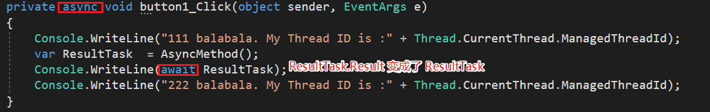

#	[彻底搞懂 C# 的 async/await](https://www.cnblogs.com/feipeng8848/p/10188871.html)


## 前言

Talk is cheap, Show you the code first！

```
Copy
Copyprivate void button1_Click(object sender, EventArgs e)
        {
            Console.WriteLine("111 balabala. My Thread ID is :" + Thread.CurrentThread.ManagedThreadId);
            AsyncMethod();
            Console.WriteLine("222 balabala. My Thread ID is :" + Thread.CurrentThread.ManagedThreadId);
        }

        private async Task AsyncMethod()
        {
            var ResultFromTimeConsumingMethod = TimeConsumingMethod();
            string Result = await ResultFromTimeConsumingMethod + " + AsyncMethod. My Thread ID is :" + Thread.CurrentThread.ManagedThreadId;
            Console.WriteLine(Result);
            //返回值是Task的函数可以不用return
        }

        //这个函数就是一个耗时函数，可能是IO操作，也可能是cpu密集型工作。
        private Task<string> TimeConsumingMethod()
        {            
            var task = Task.Run(()=> {
                Console.WriteLine("Helo I am TimeConsumingMethod. My Thread ID is :" + Thread.CurrentThread.ManagedThreadId);
                Thread.Sleep(5000);
                Console.WriteLine("Helo I am TimeConsumingMethod after Sleep(5000). My Thread ID is :" + Thread.CurrentThread.ManagedThreadId);
                return "Hello I am TimeConsumingMethod";
            });

            return task;
        }
```

我靠，这么复杂！！！竟然有三个函数！！！竟然有那么多行！！！
 别着急，慢慢看完，最后的时候你会发现使用`async/await`真的炒鸡优雅。

## 异步方法的结构

上面是一个的使用`async/await`的例子（为了方便解说原理我才写的这样复杂的）。
 使用`async/await`能非常简单的创建异步方法，防止耗时操作阻塞当前线程。
 使用`async/await`来构建的异步方法，逻辑上主要有下面三个结构：

### 调用异步方法

```
Copy
Copyprivate void button1_Click(object sender, EventArgs e)
        {
            Console.WriteLine("111 balabala. My Thread ID is :" + Thread.CurrentThread.ManagedThreadId);
            AsyncMethod();//这个方法就是异步方法，异步方法的调用与一般方法完全一样
            Console.WriteLine("222 balabala. My Thread ID is :" + Thread.CurrentThread.ManagedThreadId);
        }
```

注意：微软建议异步方法的命名是在方法名后添加Aysnc后缀，示例是我为了读起来方便做成了前缀，在真正构建异步方法的时候请注意用后缀。(好吧我承认是我忘记了，然后图片也都截好了再修改太麻烦了。。。。就懒得重新再修改了)
 异步方法的返回类型只能是`void`、`Task`、`Task<TResult>`。示例中异步方法的返回值类型是`Task`。

另外，上面的AsyncMethod()会被编译器提示报警，如下图：
 
 因为是异步方法，所以编译器提示在前面使用`await`关键字，这个后面再说，为了不引入太多概念导致难以理解暂时就先这么放着。

### 异步方法本体

```
Copy
Copyprivate async Task AsyncMethod()
        {
            var ResultFromTimeConsumingMethod = TimeConsumingMethod();
            string Result = await ResultFromTimeConsumingMethod + " + AsyncMethod. My Thread ID is :" + Thread.CurrentThread.ManagedThreadId;
            Console.WriteLine(Result);
            //返回值是Task的函数可以不用return
        }
```

用`async`来修饰一个方法，表明这个方法是异步的，声明的方法的返回类型必须为：`void`或`Task`或`Task<TResult>`。方法内部必须含有`await`修饰的方法，如果方法内部没有`await`关键字修饰的表达式，哪怕函数被`async`修饰也只能算作同步方法，执行的时候也是同步执行的。

被await修饰的只能是`Task`或者`Task<TResule>`类型，通常情况下是一个返回类型是`Task/Task<TResult>`的方法，当然也可以修饰一个`Task/Task<TResult>`变量，await只能出现在已经用async关键字修饰的异步方法中。上面代码中就是修饰了一个变量`ResultFromTimeConsumingMethod`。

关于被修饰的对象，也就是返回值类型是`Task`和`Task<TResult>`函数或者`Task/Task<TResult>`类型的变量：如果是被修饰对象的前面用`await`修饰，那么返回值实际上是`void`或者`TResult`（示例中`ResultFromTimeConsumingMethod`是`TimeConsumingMethod()`函数的返回值，也就是`Task<string>`类型，当`ResultFromTimeConsumingMethod`在前面加了`await`关键字后 `await ResultFromTimeConsumingMethod`实际上完全等于 `ResultFromTimeConsumingMethod.Result`）。如果没有`await`，返回值就是`Task`或者`Task<TResult>`。

### 耗时函数

```
Copy
Copy//这个函数就是一个耗时函数，可能是IO密集型操作，也可能是cpu密集型工作。
        private Task<string> TimeConsumingMethod()
        {            
            var task = Task.Run(()=> {
                Console.WriteLine("Helo I am TimeConsumingMethod. My Thread ID is :" + Thread.CurrentThread.ManagedThreadId);
                Thread.Sleep(5000);
                Console.WriteLine("Helo I am TimeConsumingMethod after Sleep(5000). My Thread ID is :" + Thread.CurrentThread.ManagedThreadId);
                return "Hello I am TimeConsumingMethod";
            });

            return task;
        }
```

这个函数才是真正干活的（为了让逻辑层级更分明，我把这部分专门做成了一个函数，在后面我会精简一下直接放到异步函数中，毕竟活在哪都是干）。

在示例中是一个CPU密集型的工作，我另开一线程让他拼命干活干5s。如果是IO密集型工作比如文件读写等可以直接调用.Net提供的类库，对于这些类库底层具体怎么实现的？是用了多线程还是DMA？或者是多线程+DMA？这些问题我没有深究但是从表象看起来和我用Task另开一个线程去做耗时工作是一样的。

`await`只能修饰`Task/Task<TResult>`类型，所以这个耗时函数的返回类型只能是`Task/Task<TResult>`类型。

总结：有了上面三个结构就能完成使用一次异步函数。

## async/await异步函数的原理

在开始讲解这两个关键字之前,为了方便，对某些方法做了一些拆解，拆解后的代码块用代号指定：
 
 上图对示例代码做了一些指定具体就是：

- Caller代表调用方函数，在上面的代码中就是button1_Click函数。
- CalleeAsync代表被调用函数，因为代码中被调用函数是一个异步函数，按照微软建议的命名添加了Async后缀，在上面示例代码中就是AsyncMethod()函数。
- CallerChild1代表调用方函数button1_Click在调用异步方法CalleeAsync之前的那部分代码。
- CallerChild2代表调用方函数button1_Click在调用异步方法CalleeAsync之后的那部分代码。
- CalleeChild1代表被调用方函数AsyncMethod遇到await关键字之前的那部分代码。
- CalleeChild2代表被调用方函数AsyncMethod遇到await关键字之后的那部分代码。
- TimeConsumingMethod是指被await修饰的那部分耗时代码（实际上我代码中也是用的这个名字来命名的函数）

### 示例代码的执行流程


 为了方便观看我模糊掉了对本示例没有用的输出。
 这里涉及到了两个线程，线程ID分别是1和3。

Caller函数被调用，先执行CallerChild1代码，这里是同步执行与一般函数一样，然后遇到了异步函数CalleeAsync。

在CalleeAsync函数中有await关键字，await的作用是打分裂点。

编译器会把整个函数（CalleeAsync）从这里分裂成两个函数。await关键字之前的代码作为一个函数（按照我上面定义的指代，下文中就叫这部分代码CalleeChild1）await关键字之后的代码作为一个函数（CalleeChild2）。

CalleeChild1在调用方线程执行（在示例中就是主线程Thread1），执行到await关键字之后，另开一个线程耗时工作在Thread3中执行，然后立即返回。这时调用方会继续执行下面的代码CallerChild2（注意是Caller不是Callee）。

在CallerChild2被执行期间，TimeConsumingMethod也在异步执行（可能是在别的线程也可能是CPU不参与操作直接DMA的IO操作）。

当TimeConsumingMethod执行结束后，CalleeChild2也就具备了执行条件，而这个时候CallerChild2可能执行完了也可能没有，由于CallerChild2与CalleeChild2都会在Caller的线程执行，这里就会有冲突应该先执行谁，编译器会在合适的时候在Caller的线程执行这部分代码。示意图如下：
 

请注意，CalleeChild2在上图中并没有画任何箭头，因为这部分代码的执行是由编译器决定的，暂时无法具体描述是什么时候执行。

总结一下：

整个流程下来，除了TimeConsumingMethod函数是在Thread3中执行的，剩余代码都是在主线程Thread1中执行的.

也就是说异步方法运行在当前同步上下文中，只有激活的时候才占用当前线程的时间，异步模型采用时间片轮转来实现（这一点我没考证，仅作参考）。

你也许会说，明明新加了一个Thread3线程怎么能说是运行在当前的线程中呢？这里说的异步方法运行在当前线程上的意思是由CalleeAsync分裂出来的CalleeChild1和CalleeChild2的确是运行在Thread1上的。

## 带返回值的异步函数

之前的示例代码中异步函数是没有返回值的，作为理解原理足够了，但是在实际应用场景中，带返回值的应用才是最常用的。那么，上代码：

```
Copy
Copyprivate void button1_Click(object sender, EventArgs e)
        {
            Console.WriteLine("111 balabala. My Thread ID is :" + Thread.CurrentThread.ManagedThreadId);
            var ResultTask  = AsyncMethod();
            Console.WriteLine(ResultTask.Result);
            Console.WriteLine("222 balabala. My Thread ID is :" + Thread.CurrentThread.ManagedThreadId);
        }

        private async Task<string> AsyncMethod()
        {
            var ResultFromTimeConsumingMethod = TimeConsumingMethod();
            string Result = await ResultFromTimeConsumingMethod + " + AsyncMethod. My Thread ID is :" + Thread.CurrentThread.ManagedThreadId;
            Console.WriteLine(Result);
            return Result;
        }

        //这个函数就是一个耗时函数，可能是IO操作，也可能是cpu密集型工作。
        private Task<string> TimeConsumingMethod()
        {            
            var task = Task.Run(()=> {
                Console.WriteLine("Helo I am TimeConsumingMethod. My Thread ID is :" + Thread.CurrentThread.ManagedThreadId);
                Thread.Sleep(5000);
                Console.WriteLine("Helo I am TimeConsumingMethod after Sleep(5000). My Thread ID is :" + Thread.CurrentThread.ManagedThreadId);
                return "Hello I am TimeConsumingMethod";
            });

            return task;
        }
```

主要更改的地方在这里：
 
 按理说没错吧？然而，这代码一旦执行就会卡死。

### 死锁

是的，死锁。分析一下为什么：
 

按照之前我划定的代码块指定，在添加了新代码后CallerChild2与CalleeChild2的划分如上图。

这两部分代码块都是在同一个线程上执行的，也就是主线程Thread1，而且通常情况下CallerChild2是会早于CalleeChild2执行的(毕竟CalleeChild2得在耗时代码块执行之后执行)。

`Console.WriteLine(ResultTask.Result);`(CallerChild2)其实是在请求CalleeChild2的执行结果，此时明显CalleeChild2还没有结束没有return任何结果，那`Console.WriteLine(ResultTask.Result);`就只能阻塞Thread1等待，直到CalleeChild2有结果。

然而问题就在这，CalleeChild2也是在Thread1上执行的，此时CallerChild2一直占用Thread1等待CalleeChild2的结果，耗时程序结束后轮到CalleeChild2执行的时候CalleeChild2又因Thread1被CallerChild2占用而抢不到线程，永远无法return，那么CallerChild2就会永远等下去，这就造成了死锁。

解决办法有两种一个是把`Console.WriteLine(ResultTask.Result);`放到一个新开线程中等待(个人觉得这方法有点麻烦，毕竟要新开线程)，还有一个方法是把Caller也做成异步方法：
 
 ResultTask.Result变成了ResultTask 的原因上面也说了，await修饰的`Task/Task<TResult>`得到的是TResult。

之所以这样就能解决问题是因为嵌套了两个异步方法，现在的Caller也成了一个异步方法，当Caller执行到await后直接返回了（await拆分方法成两部分），CalleeChild2执行之后才轮到Caller中await后面的代码块（`Console.WriteLine(ResultTask.Result);`）。

另外，把Caller做成异步的方法也解决了一开始的那个警告，还记得么？
 

## 这样没省多少事啊？

到现在，你可能会说：使用`async/await`不比直接用Task.Run()来的简单啊？比如我用`Task`的`TaskContinueWith`方法也能实现：

```
Copy
Copyprivate void button1_Click(object sender, EventArgs e)
        {
            var ResultTask = Task.Run(()=> {
                Console.WriteLine("Helo I am TimeConsumingMethod. My Thread ID is :" + Thread.CurrentThread.ManagedThreadId);
                Thread.Sleep(5000);
                Console.WriteLine("Helo I am TimeConsumingMethod after Sleep(5000). My Thread ID is :" + Thread.CurrentThread.ManagedThreadId);
                return "Hello I am TimeConsumingMethod";
            });

            ResultTask.ContinueWith(OnDoSomthingIsComplete);

        }

        private void OnDoSomthingIsComplete(Task<string> t)
        {
            Action action = () => {
                textBox1.Text = t.Result;
            };
            textBox1.Invoke(action);
            Console.WriteLine("Continue Thread ID :" + Thread.CurrentThread.ManagedThreadId);
        }
```

是的，上面的代码也能实现。但是，`async/await`的优雅的打开方式是这样的：

```
Copy
Copyprivate async void button1_Click(object sender, EventArgs e)
        {
            var t = Task.Run(() => {
                Thread.Sleep(5000);
                return "Hello I am TimeConsumingMethod";
            });
            textBox1.Text = await t;
        }
```

看到没，惊不惊喜，意不意外，寥寥几行就搞定了，不用再多写那么多函数，使用起来也很灵活。最让人头疼的跨线程修改控件的问题完美解决了，再也不用使用Invoke了，因为修改控件的操作压根就是在原来的线程上做的，还能不阻塞UI。

参考：
 死锁问题 <https://www.cnblogs.com/OpenCoder/p/4434574.html>
 该博主是翻译的英文资料，英文原文：<http://blog.stephencleary.com/2012/07/dont-block-on-async-code.html>
 <https://www.cnblogs.com/zhili/archive/2013/05/15/Csharp5asyncandawait.html>
 <http://www.cnblogs.com/heyuquan/archive/2013/04/26/3045827.html>
 <https://docs.microsoft.com/zh-cn/dotnet/csharp/programming-guide/concepts/async/index>

作者：[feipeng8848](https://www.cnblogs.com/feipeng8848/)

出处：<https://www.cnblogs.com/feipeng8848/p/10188871.html>

本站使用「[署名 4.0 国际](https://creativecommons.org/licenses/by/4.0/deed.zh)」创作共享协议，转载请在文章明显位置注明作者及出处。