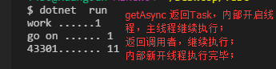

#  【异步编程】Part1：await&async语法糖让异步编程如鱼得水](https://www.cnblogs.com/JulianHuang/p/10678887.html)


### 前导

　　Asynchronous programming Model（APM）异步编程模型以BeginMethod(...) 和 EndMethod(...)结对出现。

```
IAsyncResult  BeginGetResponse(AsyncCallback callback, object state)
WebResponse  EndGetResponse(IAsyncResult asyncResult)
```

 　　Event-based Asynchronous Pattern（EAP）模型以MethodAsync(...) 和CancelAsync(...) 结对出现，由Completed事件设置回调函数。

> WebClient类中通过DownloadStringAsync方法开启一个异步任务，并由DownloadStringCompleted事件供设置回调函数，能通过CancelAsync方法取消异步任务。

　　.Net4.5开始Task Parallel Library（TPL） 为异步和并行编程提供新的模型，使异步和并发操作有统一的编程入口，

该模型常定义以Async后缀结尾的函数名、返回带有awaitable属性的Task/Task<T>对象，  如果你的program target设置为4.5+，可用Task-based Asynchronous Pattern  (TAP)取代以上2种模型。

 

### TAP

　　TPL的核心是Task类，Task，Task<TResult>可以将其理解为**一个包装委托（通常就是Action或Func委托）并执行的容器**，有了Task几乎不用去和Thread  打交道，使用者只需要关注具体业务对应的Job，Task背后有一个 TaskScheduler  的类来负责调度Task的执行，这样Task对象将在默认的TaskScheduler调度下执行，TaskScheduler使用线程池中的线程，至于是新建还是使用已有线程这个对用户是完全透明的，也可以通过重载函数的参数传入自定义的TaskScheduler。

Task任务状态：

| 状态& 枚举值                     | 说明                                                         |
| -------------------------------- | ------------------------------------------------------------ |
| Created = 0                      | The task has been initialized but has not yet been scheduled |
| WaitingForActivation = 1         | The task is waiting to be activated and scheduled internally by the .NET Framework infrastructure. |
| WaitingToRun = 2                 | The task has been scheduled for execution but has not yet begun executing. |
| Running = 3                      | The task is running but has not yet completed.               |
| WaitingForChildrenToComplete = 4 | The task has finished executing and is implicitly waiting for attached child tasks to complete. |
| RanToCompletion = 5              | The task completed execution successfully                    |
| Canceled = 6                     | The task acknowledged cancellation by throwing an  OperationCanceledException with its own CancellationToken while the  token was in signaled state, or the task's CancellationToken was already  signaled before the task started executing |
| Faulted = 7                      | The task completed due to an unhandled exception             |

明确Task和线程的关系：

- 任务是架构在线程之上的，也就是说任务最终还是要抛给线程去执行
- 任务跟线程不是一对一的关系，比如开10个任务并不是说会开10个线程，在.NET面向任务异步编程模型中，你只需要关注业务概念的任务，具备底层实现会由Task包装完成。

Task相比ThreadPool的优势:

- ThreadPool不支持线程取消、完成、失败通知等交互新操作
- ThreadPool不支持线程执行的先后顺序。

###  

### await/async 语法糖

> 在异步编程实践中，将网络、数据库同步访问称为 I/O-bound；将等待CPU计算结果称为CPU-bound

　　TAP异步编程模型的核心是塑造异步操作的Task、Task<T>对象，这是awaitable 对象，await/async语法糖简化了写法

- 对于I/O-bound 代码，编写一个返回Task或Task<T>的async方法， 之后await 这个方法
- 对于CPU-bound代码，使用Task.Run方法后台启动一个操作，之后await这个操作。

　　魔法发生在await关键字，会将控制权上交给执行Async方法的上层调用者。

　　在C#语言底层，编译器将你的await/async 代码转换为状态机， 记录了**当await发生时控制权上交**和**后台工作完成时恢复执行**的标记。

 

　　异步编程在实践时需要理解：

- 异步代码可用于I/O -bound 和CPU-bound 代码， 但是2个场景的写法是不同的
- 异步编程利用Task和Task<T>对象来 塑造需要在后台完成的工作
- async关键字将方法转变为异步方法，这样可在方法体使用await关键词， 如果async方法内不包含await关键词，那将不会上交控制权
- 当await动作发生时，将会暂停（注意是suspend 而不是block）方法，并将控制权上交给调用者（直到awaitable任务完成）
- await 只能被用在async方法内部

执行操作的“异步方式”

| 执行以下操作…      | 替换以下方式…           | 使用以下方式       |
| ------------------ | ----------------------- | ------------------ |
| 检索后台任务的结果 | Task.Wait / Task.Result | await              |
| 等待任何任务完成   | Task.WaitAny            | await Task.WhenAny |
| 检索多个任务的结果 | Task.WaitAll            | await Task.WhenAll |
| 等待一段时间       | Thread.Sleep            | await Task.Delay   |


下面是一个I/O-bound的例子:    

[](javascript:void(0);)

```
using System;
using System.Threading;
using System.Threading.Tasks;
using System.Net.Http;
namespace Test
{
    class Program
    {
        static void Main(string[] args)
       {
         var asyncMethod =  AccessTheWebAsync();
         Console.WriteLine("go on ...... "+ Thread.CurrentThread.ManagedThreadId );
         // 等待异步线程处理完毕,没有以下句子，await使控制回到调用方，主线程即终止。
         asyncMethod.Wait();
       }
      public static async Task<int> AccessTheWebAsync()
      {
          HttpClient client = new HttpClient();
          // GetStringAsync returns a Task<string>.
          // That means that when you await the task you'll get a string (urlContents).
          Task<string> getStringTask = client.GetStringAsync("http://msdn.microsoft.com");
          // You can do work here that doesn't rely on the string from GetStringAsync.
         DoIndependentWork();

        // The await operator suspends AccessTheWebAsync.
        // - AccessTheWebAsync can't continue until getStringTask is complete.
        // - Meanwhile, control returns to the caller of AccessTheWebAsync.
        // - Control resumes here when getStringTask is complete.
        // - The await operator then retrieves the string result from getStringTask.
    
         string urlContents = await getStringTask;
         Console.WriteLine(urlContents.Length+"....... "+Thread.CurrentThread.ManagedThreadId );
         // The return statement specifies an integer result.
         // Any methods that are awaiting AccessTheWebAsync retrieve the length value.
         return urlContents.Length;
       } 
        public static void DoIndependentWork()
        {
            Console.WriteLine("work ......"+Thread.CurrentThread.ManagedThreadId);
        }
    }
}
```

[](javascript:void(0);)



　　以上代码在ASP.NET 或GUI程序可能会发生死锁，  具体参见《.NET异步编程系列3：掌握SynchronizationContext避免deadlock》；控制台程序经过验证在.NET Core  和.Net Framework上都没有SynchronizationContext，故不会发生死锁。

Task对象提供了丰富的API帮助我们完成 基于任务的异步操作， 让我们专注**业务概念的任务**。

 

作者：[JulianHuang](https://www.cnblogs.com/JulianHuang/)[
](https://www.cnblogs.com/myzony/)

感谢您的认真阅读，如有问题请大胆斧正，如果您觉得本文对你有用，不妨右下角点个或加关注。

本文版权归作者所有，欢迎转载，但未经作者同意必须保留此段声明，且在文章页面明显位置注明本文的**作者及原文链接**，否则保留追究法律责任的权利。