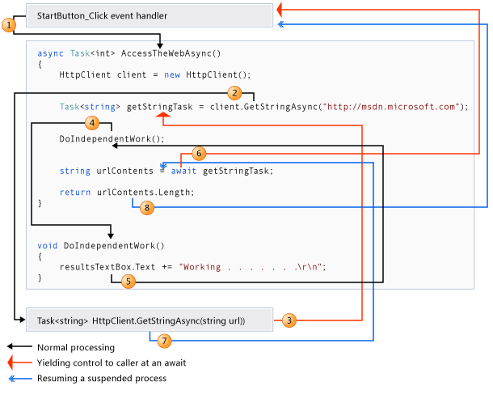

#  			[【异步编程】Part2：掌控SynchronizationContext避免deadlock](https://www.cnblogs.com/JulianHuang/p/10644071.html) 		


### 引言：

　　多线程编程/异步编程非常复杂，有很多概念和工具需要去学习，贴心的.NET提供**Task线程包装类**和**await/async异步编程语法糖**简化了异步编程方式。

相信很多开发者都看到如下异步编程实践原则：

|      | 实践原则        | 说明                                           | 例外情况         |
| ---- | --------------- | ---------------------------------------------- | ---------------- |
| ①    | 避免 Async Void | 最好使用 async Task 方法而不是 async void 方法 | 事件处理程序     |
| ②    | 始终使用 await  | 不要混合阻塞式代码和异步代码                   | 控制台 main 方法 |
| ③    | 配置上下文      | 尽可能使用ConfigureAwait(false)                | 需要上下文的方法 |

  

　　遵守以上冷冰冰的②③条的原则，可保证异步程序按照预期状态正常运作；我们在各大编程论坛常看到违背这2条原则引发的莫民奇妙的死锁问题。

　　UI 例子：点击按钮触发了一个远程HTTP请求，用请求的返回值修改UI控件, 以下代码会引发deadlock （类似状态出现在Windows Form、WPF）

[](javascript:void(0);)

```
public static async Task<JObject> GetJsonAsync(Uri uri)
{
  using (var client = new HttpClient())
  {
    var jsonString = await client.GetStringAsync(uri);
    return JObject.Parse(jsonString);
  }
}

// 顶层调用方法
public void Button1_Click(...)
{
  var jsonTask = GetJsonAsync(...);
  textBox1.Text = jsonTask.Result;
}
```

[](javascript:void(0);)

　　ASP.NET例子：API Action发起远程HTTP请求，等待请求的json结果，并解析json字符串，以下代码也会引发deadlock

[](javascript:void(0);)

```
public static async Task<JObject> GetJsonAsync(Uri uri)
{
  using (var client = new HttpClient())
  {
    var jsonString = await client.GetStringAsync(uri);
    return JObject.Parse(jsonString);
  }
}
// My "top-level" method.
public class MyController : ApiController
{
  public string Get()
  {
    var jsonTask = GetJsonAsync(...);
    return jsonTask.Result.ToString();
  }
}
```

[](javascript:void(0);)

　　 解决以上deadlock需利用以上第②③条编程原则：

- 不要混合使用异步、同步代码，始终使用async/await语法糖编写异步代码
- 在等待的异步任务内应用ConfigureAwait(false)方法 （：不再尝试从捕获的同步上下文执行异步编程的后续代码）

　　 第②③条原则与我们今天的主角SynchronizationContext  密切相关，大多数时候SynchronizationContext 是在异步编程后面默默工作的，  但是了解这个对象对于理解Task、await/sync 工作原理大有裨益。本文会解释

- 为什么要有SynchronizationContext 对象
- 阐述await关键字与SynchronizationContext对象交互原理
- 以上代码为什么会有deadlock， 另外ASP.NET Core为什么不会发生以上死锁

###  

### 1. The Need for SynchronizationContext

　　先看下MSDN中关于SynchronizationContext的定义：

> 提供在各种同步模型中传播同步上下文的基本功能。此类实现的同步模型的目的是允许公共语言运行库的内部异步/同步操作使用不同的同步模型正常运行。

　　上面的定义给我的印象是：在线程切换过程中保存前置线程执行的上下文环境。

　　我们大家都知道：*Windows Form和WPF都基于类似的原则： 不允许在非UI线程上操作 UI元素*

　　 

　　这个时候我们可以捕获当前执行环境SynchronizationContext，利用这个对象切换回原UI线程。

[](javascript:void(0);)

```
public static void DoWork()
{
    //On UI thread
    var sc = SynchronizationContext.Current;

    ThreadPool.QueueUserWorkItem(delegate
    {
       // do work on ThreadPool
        sc.Post(delegate
        {
             // do work on the original context (UI)
        }, null);
    });
}
```

[](javascript:void(0);)

​      SynchronizationContext表示**代码正在运行的当前环境**，每个线程都有自己的SynchronizationContext，通过SynchronizationContext.Current可获取当前线程的同步上下文。在异步线程切换场景中，我们并不需要代码在哪个线程上启动，只需要使用SynchronizationContext  ，就可以返回到启动线程。

　　不同的.NET框架因各自独特的需求有不同SynchronizationContext子类（通常是重写Post虚方法）：

　　- 默认SynchronizationContext封装的是线程池内线程，将执行委托发送到线程池中任意线程。

　　- asp.Net有AspNetSynchronizationContext，在一个异步page处理过程中，context始终使用的是线程池中某个特定线程

　　- Windows Form有WindowsFormSynchronizationContext，封装单个UI线程，Post方法将委托传递给 Control.BeginInvoke

　　- WPF 有DispatcherSynchronizationContext， 了解到与WinForm 类似。

 

### 2. await/async语法糖与SynchronizationContext 的关系？

　　以上ThreadPool.QueueUserWorkItem 涉及线程底层，微软提出Task线程包装类和 await/async 简化了异步编程的方式：

 

　　

　　① 调用异步方法GetStringAsync时，.NET框架为我们创建了异步任务T； 

　　② 应用await时，框架捕获当前环境， 存储在SynchronizationContext 对象并附加于以上Task；

　　③ 同时，控制权返回到原上层调用函数，返回一个未完成的Task<int>对象，这个时候需要关注上层调用函数使用 await异步等待还是使用Result/Wait（）方式同步等待

　　④ 异步任务T执行完成，await之后的代码将会成为continuation block， 默认情况下利用捕获的SynchronizationContext 对象执行该continuation block 代码。

　　　　内部实际是将continuation block代码放入SynchronizationContext 的Post方法。

　　　　

### 3.引言代码为什么发生deadlock， 而ASP.NET Core/控制台程序为什么不会发生类似deadlock?

​        仔细观察引言代码，控制返回到 上层调用函数时，  该调用函数使用Result属性去等待任务结果，Result/Wait（）等同步方式会导致调用线程挂起等待任务完成。而在异步方法内部，await触发的异步任务执行完成后，会尝试利用捕获的同步上下文执行剩余代码，而该同步上下文中的线程正同步等待整个异步任务完成，形成死锁。

正因为如此，我们提出：

　　- 在原调用函数始终 使用 await方法，这样该线程是异步等待 任务完成。

　　- 在异步任务内部应用ConfigureAwait(false)方法, 不尝试使用捕获的同步上下文执行后继代码

> MSDN ConfigureAwait()： true to attempt to marshal the continuation back to the original context captured; otherwise, false

　　另外注意：ASP.NET Core,，控制台程序不存在SynchronizationContext ， 故不会发生类似的死锁。


　　虽然await/async 语法糖让我们在编写.NET 异步程序时得心应手、随心所欲，但是不要忘记了SynchronizationContext 在其中转承起合的作用。

利用能够**保存当前执行代码的上下文**特性，SynchronizationContext在线程切换后帮我们有能力执行各种骚操作。

作者：[JulianHuang](https://www.cnblogs.com/JulianHuang/)


​     


[« ](https://www.cnblogs.com/JulianHuang/p/10572840.html) 上一篇：[【异步编程】Part3:取消异步操作](https://www.cnblogs.com/JulianHuang/p/10572840.html)
[» ](https://www.cnblogs.com/JulianHuang/p/10678887.html) 下一篇：[【异步编程】Part1：await&async语法糖让异步编程如鱼得水](https://www.cnblogs.com/JulianHuang/p/10678887.html)

posted @ 2019-04-03 08:09 [头号码甲](https://www.cnblogs.com/JulianHuang/) 阅读(491) 评论(1)  [编辑](https://i.cnblogs.com/EditPosts.aspx?postid=10644071) [收藏](https://www.cnblogs.com/JulianHuang/p/10644071.html#)