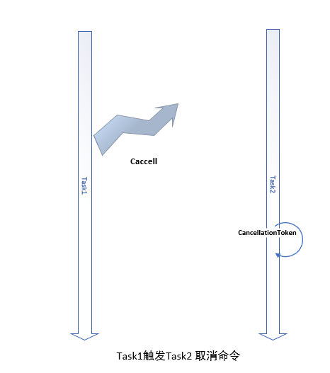

#  			[【异步编程】Part3:取消异步操作](https://www.cnblogs.com/JulianHuang/p/10572840.html) 		


在.Net和C#中运行异步代码相当简单，因为我们有时候需要**取消正在进行的异步操作**，通过本文，可以掌握 通过CancellationToken取消任务（包括non-cancellable任务）。

##

早期.Net 使用 BackgroundWorker 完成异步长时间运行操作。

可以使用CacnelAsync方法设置 CancellationPending = true

  View Code

 已经不再推荐这种方式来完成异步和长时间运行的操作，但是大部分概念在现在依旧可以使用。

##  Task横空出世

Task代表一个异步操作，**该类表示一个异步不返回值的操作，** **泛型版本Task<TResult>表示异步有返回值的操作**。

可使用async/await 语法糖代码去完成异步操作。

 

以下创建一个简单的长时间运行的操作：

  View Code

 简单异步调用代码：

[](javascript:void(0);)

```
public static async Task ExecuteTaskAsync()
{
    Console.WriteLine(nameof(ExecuteTaskAsync));
    Console.WriteLine("Result {0}", await LongRunningOperation(100));
    Console.WriteLine("Press enter to continue");
    Console.ReadLine();
}
```

[](javascript:void(0);)

##  

## 敲黑板： C#取消异步操作分为

 

 

### ① 让代码可取消（Cancellable）

因为一些原因，长时间运行的操作花费了 冗长的时间（需要取消，避免占用资源）； 或者不愿意再等待执行结果了

我们会取消异步操作。

 

为完成目的需要在 长时间运行的异步任务中传入CancellationToken:

[](javascript:void(0);)

```
/// <summary>
/// Compute a value for a long time.
/// </summary>
/// <returns>The value computed.</returns>
/// <param name="loop">Number of iterations to do.</param>
/// <param name="cancellationToken">The cancellation token.</param>
private static Task<decimal> LongRunningCancellableOperation(int loop, CancellationToken cancellationToken)
{
    Task<decimal> task = null;

    // Start a task and return it
    task = Task.Run(() =>
    {
        decimal result = 0;

        // Loop for a defined number of iterations
        for (int i = 0; i < loop; i++)
        {
            // Check if a cancellation is requested, if yes,
            // throw a TaskCanceledException.

            if (cancellationToken.IsCancellationRequested)
                throw new TaskCanceledException(task);

            // Do something that takes times like a Thread.Sleep in .NET Core 2.
            Thread.Sleep(10);
            result += i;
        }

        return result;
    });

    return task;
}
```

[](javascript:void(0);)

 

在长时间运行的操作中监测 [IsCancellationRequested](https://msdn.microsoft.com/en-us/library/system.threading.cancellationtoken.iscancellationrequested(v=vs.110).aspx)方法 (当前是否发生取消命令)，这里我倾向去包装一个[TaskCanceledException](https://msdn.microsoft.com/en-us/library/system.threading.tasks.taskcanceledexception(v=vs.110).aspx)异常类（给上层方法调用者更多处理的可能性）； 当然可以调用[ThrowIfCancellationRequested](https://msdn.microsoft.com/en-us/library/system.threading.cancellationtoken.throwifcancellationrequested(v=vs.110).aspx)方法抛出[OperationCanceledException](https://msdn.microsoft.com/en-us/library/system.operationcanceledexception(v=vs.110).aspx)异常。

### ② 触发取消命令

**CancellationToken结构体相当于打入在异步操作内部的楔子，随时等候后方发来的取消命令**。

操纵以上CancellationToken状态的对象是 [CancellationTokenSource](https://msdn.microsoft.com/en-us/library/system.threading.cancellationtokensource(v=vs.110).aspx)，这个对象是取消操作的命令发布者。

 

默认的构造函数就支持了 超时取消：

[](javascript:void(0);)

```
//  以下代码 利用 CancellationSource默认构造函数 完成超时取消
public static async Task ExecuteTaskWithTimeoutAsync(TimeSpan timeSpan)
{
    Console.WriteLine(nameof(ExecuteTaskWithTimeoutAsync));

    using (var cancellationTokenSource = new CancellationTokenSource(timeSpan))
    {
        try
        {
            var result = await LongRunningCancellableOperation(500, cancellationTokenSource.Token);
            Console.WriteLine("Result {0}", result);
        }
        catch (TaskCanceledException)
        {
            Console.WriteLine("Task was cancelled");
        }
    }
    Console.WriteLine("Press enter to continue");
    Console.ReadLine();
}
```

[](javascript:void(0);)

### ------------------------------------------------------------------------------------------------------------

 

###  附①： 高阶操作，完成手动取消：

自然我们关注到 CancellationSource 的几个方法， 要想在异步操作的时候 手动取消操作，需要建立另外的线程 等待手动取消操作的指令。

[](javascript:void(0);)

```
public static async Task ExecuteManuallyCancellableTaskAsync()
{
    Console.WriteLine(nameof(ExecuteManuallyCancellableTaskAsync));

    using (var cancellationTokenSource = new CancellationTokenSource())
    {
        // Creating a task to listen to keyboard key press
        var keyBoardTask = Task.Run(() =>
        {
            Console.WriteLine("Press enter to cancel");
            Console.ReadKey();

            // Cancel the task
            cancellationTokenSource.Cancel();
        });

        try
        {
            var longRunningTask = LongRunningCancellableOperation(500, cancellationTokenSource.Token);

            var result = await longRunningTask;
            Console.WriteLine("Result {0}", result);
            Console.WriteLine("Press enter to continue");
        }
        catch (TaskCanceledException)
        {
            Console.WriteLine("Task was cancelled");
        }

        await keyBoardTask;
    }
}
// 以上是一个控制台程序，异步接收控制台输入，发出取消命令。
```

[](javascript:void(0);)

 

### 附②：高阶操作，取消 non-Cancellable任务 ：

有时候，异步操作代码并不提供 对 Cancellation的支持，也就是以上长时间运行的异步操作

LongRunningCancellableOperation(int loop, CancellationToken cancellationToken) 并不提供参数2的传入，相当于不允许 打入楔子。

 

这时我们怎样取消 这样的non-Cancellable 任务？

 

可考虑利用 Task.WhenAny( params tasks) 操作曲线取消：

- 利用TaskCompletionSource 注册异步可取消任务
- 等待待non-cancellable 操作和以上建立的 异步取消操作

[](javascript:void(0);)

```
private static async Task<decimal> LongRunningOperationWithCancellationTokenAsync(int loop, CancellationToken cancellationToken)
{
    // We create a TaskCompletionSource of decimal
    var taskCompletionSource = new TaskCompletionSource<decimal>();

    // Registering a lambda into the cancellationToken
    cancellationToken.Register(() =>
    {
        // We received a cancellation message, cancel the TaskCompletionSource.Task
        taskCompletionSource.TrySetCanceled();
    });

    var task = LongRunningOperation(loop);

    // Wait for the first task to finish among the two
    var completedTask = await Task.WhenAny(task, taskCompletionSource.Task);

    return await completedTask;
}
```

[](javascript:void(0);)

像上面代码一样执行取消命令 ：

[](javascript:void(0);)

```
public static async Task CancelANonCancellableTaskAsync()
{
    Console.WriteLine(nameof(CancelANonCancellableTaskAsync));

    using (var cancellationTokenSource = new CancellationTokenSource())
    {
        // Listening to key press to cancel
        var keyBoardTask = Task.Run(() =>
        {
            Console.WriteLine("Press enter to cancel");
            Console.ReadKey();

            // Sending the cancellation message
            cancellationTokenSource.Cancel();
        });

        try
        {
            // Running the long running task
            var longRunningTask = LongRunningOperationWithCancellationTokenAsync(100, cancellationTokenSource.Token);
            var result = await longRunningTask;

            Console.WriteLine("Result {0}", result);
            Console.WriteLine("Press enter to continue");
        }
        catch (TaskCanceledException)
        {
            Console.WriteLine("Task was cancelled");
        }

        await keyBoardTask;
    }
}
```


大多数情况下，我们不需要编写自定义可取消任务，因为我们只需要使用现有API。但要知道它是如何在幕后工作总是好的。

 

参考资料： 

<https://johnthiriet.com/cancel-asynchronous-operation-in-csharp/>

<https://stackoverflow.com/questions/4238345/asynchronously-wait-for-taskt-to-complete-with-timeout>

<https://github.com/App-vNext/Polly/wiki/Timeout>

 

作者：[Julian_酱](https://www.cnblogs.com/mi12205599)

[« ](https://www.cnblogs.com/JulianHuang/p/10503600.html) 上一篇：[ASP.NET Core 实现带认证功能的Web代理服务器](https://www.cnblogs.com/JulianHuang/p/10503600.html)
[» ](https://www.cnblogs.com/JulianHuang/p/10644071.html) 下一篇：[【异步编程】Part2：掌控SynchronizationContext避免deadlock](https://www.cnblogs.com/JulianHuang/p/10644071.html)

posted @ 2019-03-21 17:17 [头号码甲](https://www.cnblogs.com/JulianHuang/) 阅读(3373) 评论(7)  [编辑](https://i.cnblogs.com/EditPosts.aspx?postid=10572840) [收藏](https://www.cnblogs.com/JulianHuang/p/10572840.html#)