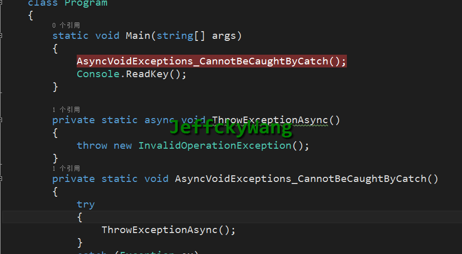
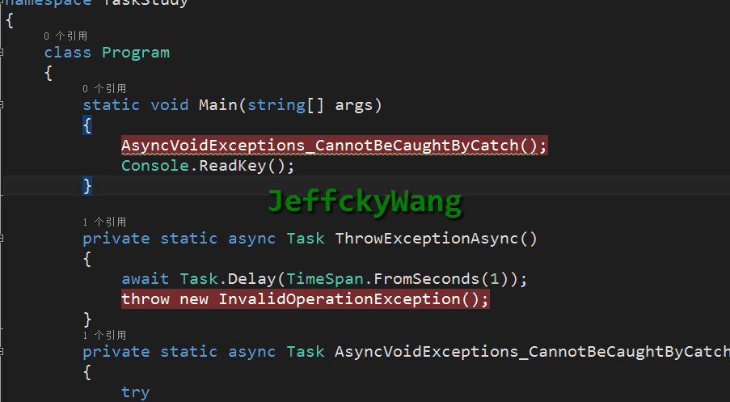
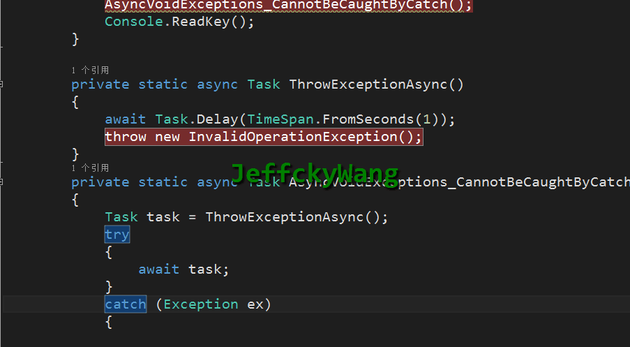
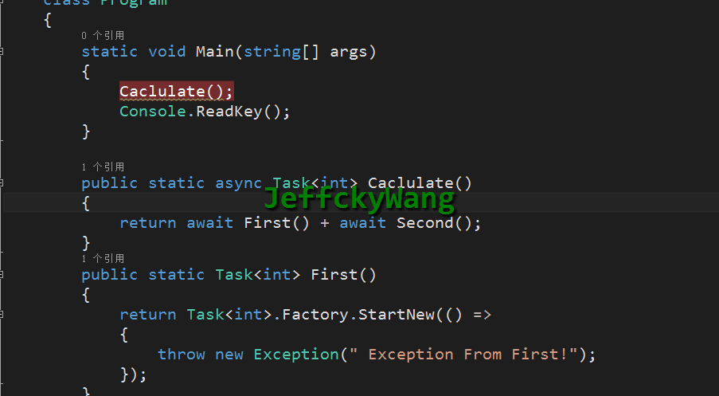
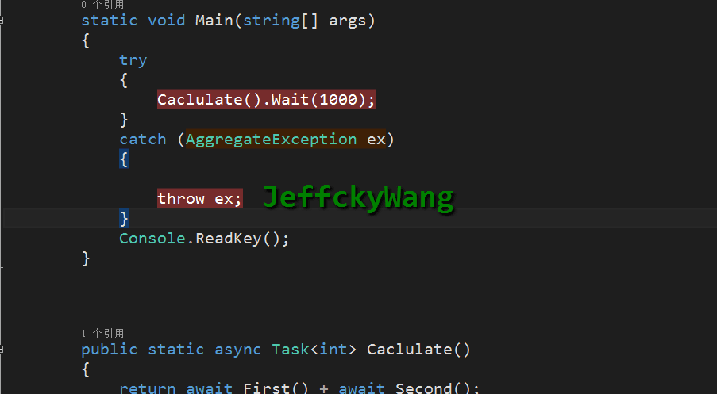
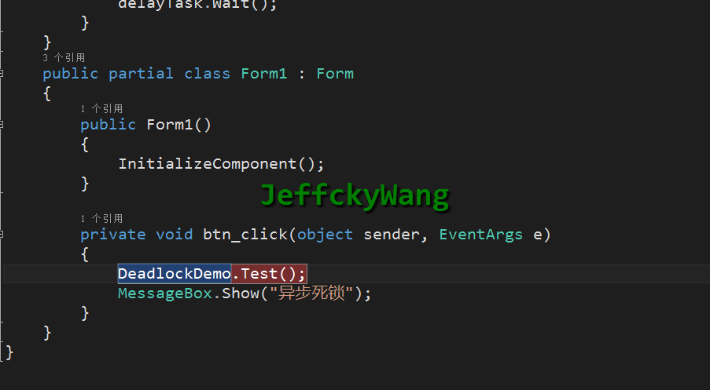
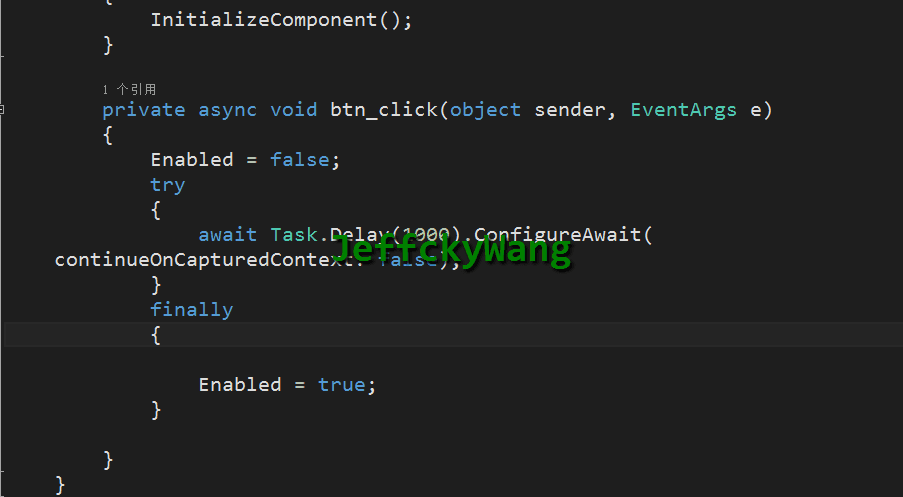
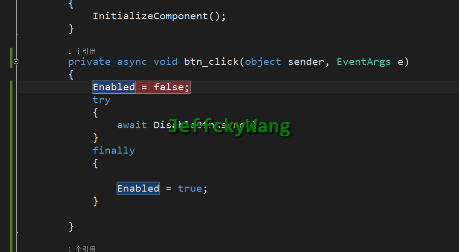

# [关于Task的一点思考和建议](https://www.cnblogs.com/CreateMyself/p/6366516.html)


# 前言

本打算继续写SQL Server系列，接下来应该是死锁了，但是在.NET  Core项目中到处都是异步，最近在写一个爬虫用到异步，之前不是很频繁用到异步，当用到时就有点缩手缩尾，怕留下坑，还是小心点才是，于是一发不可收拾，发现还是too  young，所以再次查看资料学习下Task，用到时再学效果可想而知，若有不同意见请在评论中指出。

## 建议异步返回Task或Task<T>

当在.NET  Core中写爬虫用到异步去下载资源后接下来进行处理，对于处理完成结果我返回void，想到这里不仅仅一愣，这么到底行不行，翻一翻写的第一篇博客，只是提醒了我下不要用void，至于为何不用也没去探讨，接下来我们来探讨下返回值为Task和void，至于Task<T>这个和Task类似。我们直接看代码，首先演示void，如下：

[](javascript:void(0);)

```
        private static async void ThrowExceptionAsync()
        {
            await Task.Delay(TimeSpan.FromSeconds(1));
            throw new InvalidOperationException();
        }
        private static void AsyncVoidExceptions_CannotBeCaughtByCatch()
        {
            try
            {
                ThrowExceptionAsync();
            }
            catch (Exception ex)
            {

                throw ex;
            }
        }
```

[](javascript:void(0);)

然后在控制台中进行调用，如下：

```
        static void Main(string[] args)
        {
            AsyncVoidExceptions_CannotBeCaughtByCatch();
            Console.ReadKey();
        }
```

 

此时我们在异步代码且返回值为void的方法中有一个异常，并且我们在调用该异步方法中去捕捉异常，但是结果并未捕捉到。接下来我们将异步方法返回值修改为Task如下再来看看：

[](javascript:void(0);)

```
        private static async Task ThrowExceptionAsync()
        {
            await Task.Delay(TimeSpan.FromSeconds(1));
            throw new InvalidOperationException();
        }
        private static async Task AsyncVoidExceptions_CannotBeCaughtByCatch()
        {
            try
            {               
                await ThrowExceptionAsync();
            }
            catch (Exception ex)
            {

                throw ex;
            }
        }
```

[](javascript:void(0);)

 

此时发现返回值Task和void对于异常都无法捕捉到，这么一来是不是返回值使用Task和void皆可以呢，我们注意到对于被调用的异步方法且返回值为Task，我们试试将先接收其返回值，然后再await看看。此时我们对于第二个异步方法修改成如下：

[](javascript:void(0);)

```
        private static async Task AsyncVoidExceptions_CannotBeCaughtByCatch()
        {
            Task task = ThrowExceptionAsync();
            try
            {
                await task;
            }
            catch (Exception ex)
            {

                throw ex;
            }
        }
```

[](javascript:void(0);)

 

通过事先接收其返回值Task然后再await，此时我们就能捕捉到异常，而为什么void无法捕捉到异常呢？请看如下解释

当在Task或者Task<T>中抛出异常时，此时异常信息将被捕捉到并被放到Task对象中，但是在void异步方法启动时SynchronizationContext将被激活并且此时没有Task对象，此时异常信息将直接被保存到异步上下文中即（SynchronizationContext）。

对于捕捉void异常信息其实没有什么根本上的解决办法，如果是在控制台中可以用下载 Nito.AsyncEx 程序包并将方法放在  AsyncContext.Run(()=>.....) 运行，还有其他等方法，返回值为void更多用在windows客户端事件处理程序包中，例如如下：

[](javascript:void(0);)

```
private async void btn_Click(object sender, EventArgs e)
{
  await BtnClickAsync();
}
public async Task BtnClickAsync()
{
  // Do asynchronous work.
  await Task.Delay(1000);
}
```

[](javascript:void(0);)

在异步操作中如果返回值为Task或者Task<T>，我们知道接下来给如何进行处理，但是返回值为void我们根本不知道它什么时候完成，同时利用void来进行单元测试时也不会抛出异常，所以我们对于异步返回值大部分情况下必须使用Task或者Task<T>，除了基于事件处理而不得不返回void外，对于Task或者Task<T>有利于异常捕捉、暴露更多方法如（Task.WhenAll、Task.WhenAny）、方便单元测试等，基于此我们在此下一个基本结论：

虽然在异步方法中提示返回值可以为Task、Task<T>或者void，但是我们强烈建议返回值只为Task或者Task<T>，除了基于事件处理程序外，因为返回值为void无法捕捉异常信息且不方便单元测试，同时根本不知道异步操作什么时候完成。而对于Task异常信息被保存到Task对象中，所以在捕捉异常信息时，首先返回异步方法Task，然后进行await。

但是对于Task捕捉异常信息还有一个问题我们并未探讨，请往下看。

[](javascript:void(0);)

```
        public static Task<int> First()
        {
            return Task<int>.Factory.StartNew(() =>
            {
                throw new Exception(" Exception From First!");
            });
        }
        public static Task<int> Second()
        {
            return Task<int>.Factory.StartNew(() =>
            {
                throw new Exception(" Exception From Second!");
            });
        }
```

[](javascript:void(0);)

上述定义两个异步方法，并且都抛出异常，接下来我们再来定义一个方法调用上述两个方法，如下：

```
        public static async Task<int> Caclulate()
        {
            return await First() + await Second();
        } 
```

 

上述情况下理论上调用两个方法应该抛出两个异常信息才对，但是结果只对一个First异步方法抛出异常，而对于第二个异步方法Second则忽略了，什么情况，还没看懂，我们进一步进行如下改造。

[](javascript:void(0);)

```
        static void Main(string[] args)
        {
            try
            {
                Caclulate().Wait(1000);
            }
            catch (AggregateException ex)
            {

                throw ex;
            }
            Console.ReadKey();
         }
```

[](javascript:void(0);)



我们通过聚合异常类 AggregateException 来接收异常信息，结果只抛出一个异常信息，并且是第一个。 我们再利用返回Task来接收并await来看看是否有不同。

[](javascript:void(0);)

```
        public static async Task Test()
        {
            var task = Caclulate();
            try
            {
                await task;
            }
            catch (Exception ex)
            {

                throw ex;
            }
        }
```

[](javascript:void(0);)

此时也将仅仅抛出第一个异常信息，所以通过这里演示我们可以下个结论：当在异步代码中调用多个异步方法时，若出现异常，此时则不会抛出聚合异常而仅仅只是抛出第一个异常。

## 建议异步感染

在异步操作中如果异步代码又被其他异步代码调用时，将同步代码转换为异步代码能够更有效执行，在异步代码中没有感染的概念，为什么我提出“感染”这一概念呢，想必正确使用过异步方法的童鞋深有体会，当一个异步方法被另外一个方法调用时，此时另外一个方法若是同步方法，此时会提示将该方法异步，所以通过该传播行为从最底层异步方法到最高层调用者都将是异步方法（类似僵尸尸毒），这也是我们所推荐的，一旦用了异步代码则总是用异步代码，不要将同步代码和异步代码混合使用，很容易导致阻塞情况特别是调用Task.Wait或者Task.Result。这一点我有切身感受，在爬虫中利用同步方法中调用异步代码，最终获取该异步方法中的结果通过Task.Rsult，结果利用Windows窗体测试时发现已经被阻塞，一直显示Task.Result处于计算中。不信，你看如下代码。所以我们强烈建议：一旦使用异步代码且总是使用异步代码让异步代码自然过渡层层传递，大部分情况下千万别调用Task.Wait或者Task.Result很容易导致阻塞。

[](javascript:void(0);)

```
    public static class DeadlockDemo
    {
        private static async Task DelayAsync()
        {
            await Task.Delay(1000);
        }
      
        public static void Test()
        {    
            var delayTask = DelayAsync();
            delayTask.Wait();
        }
    }
```

[](javascript:void(0);)

```
        private void btn_click(object sender, EventArgs e)
        {
            DeadlockDemo.Test();
            MessageBox.Show("异步死锁");
        }
```

将上述代码在windows  form或者ASP.NET程序中运行你会发现上述调用Wait后会导致死锁，但在控制台中将不会出现这种死锁情况。按照我们对异步的理解，默认情况下，当一个未被完成的任务被await时，此时将捕捉到当前上下文，直到任务被完成唤醒该方法，如果当前上下文为空，那么此时当前上下文则为SynchronizationContext。对于如winddows   form中的GUI或者ASP.NET应用程序，此时任务调度器的上下文则是SynchronizationContext且只允许一块代码运行一次，当任务完成时，将试图在捕捉的当前上下文去执行异步方法中的其他方法，但是此时已经有一个线程当前上下文存在，造成同步方法去等待完成异步方法，结果引起异步方法唤醒当前方法继续执行，但是当前同步方法也在等待异步方法完成，彼此等待，造成死锁。

## 建议异步配置上下文（分情况）

什么时候应该配置上下文，当我们需要等待结果完成时可以配置上下文，如下：

[](javascript:void(0);)

```
        async Task ConfigureContext()
        {           
            await Task.Delay(1000);
          
            await Task.Delay(1000).ConfigureAwait(
              continueOnCapturedContext: false);
            
        }
```

[](javascript:void(0);)

当进行如上配置后在 await Task.Delay(1000); 之前毫无疑问将在原始上下文中运行，  await Task.Delay(1000).ConfigureAwait( continueOnCapturedContext: false); 此时在此之后因为不捕捉上下文，此时将在线程池中运行。我们在此之前演示了一个造成死锁的例子，通过配置上下文就可以解决。

[](javascript:void(0);)

```
        private static async Task DelayAsync()
        {
            await Task.Delay(1000).ConfigureAwait(
    continueOnCapturedContext: false);
        }

        public static void Test()
        {
            var delayTask = DelayAsync();
            delayTask.Wait();
        }
```

[](javascript:void(0);)



我们知道默认情况下当await一个未完成的任务时，此时将捕获上下文来唤醒异步方法来执行其余的方法，但是此时我们配置上下文为false，告诉它不需要捕获我们根本不耗费时间，我们马上就能完成，此时将解决死锁的问题。在异步中配置 ConfigureAwait( continueOnCapturedContext: false); 的作用在于：将同步方法转换为异步方法和防止死锁。

那么问题来了什么时候不应该配置上下文呢？请继续看如下例子：

[](javascript:void(0);)

```csharp
        private async void btn_click(object sender, EventArgs e)
        {
            Enabled = false;
            try
            {
                await Task.Delay(1000).ConfigureAwait(
    continueOnCapturedContext: false);
            }
            finally
            {

                Enabled = true;
            }

        }
```

[](javascript:void(0);)



当点击按钮时我们禁用按钮，同时关闭了其捕获当前上下文，但是最后我们又需要用到当前上下文，所以此时导致取不到一样的线程，此时类似跨线程，出现线程不一致的情况。每个异步方法都有其上下文并且每个方法的上下文是独立开来的。什么意思呢，由于上述我们直接在点击事件里面关闭了捕获上下文，如果我们定义一个方法，在此方法里面来关闭捕获上下文，此时再来在点击事件里调用该异步方法，此时点击事件和该异步方法独立互不影响，千万别以为调用了该异步方法就说明是在点击事件里关闭了上下文，如下：

[](javascript:void(0);)

```
        private async void btn_click(object sender, EventArgs e)
        {
            Enabled = false;
            try
            {
                await DisableBtnAsync();
            }
            finally
            {

                Enabled = true;
            }

        }

        private async Task DisableBtnAsync()
        {
           
            await Task.Delay(1000).ConfigureAwait(continueOnCapturedContext: 
                false);
        }
```

[](javascript:void(0);)

 

由上已经证明了这点，好了本节我们到此结束。

## 总结

关于异步和Task中的水还是非常深，我也是用到了再去深究，本节算是对异步中的异常捕获以及返回值和配置上下文作了一个大概的探讨。