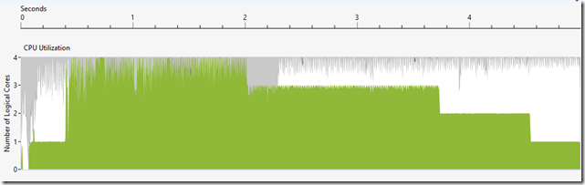
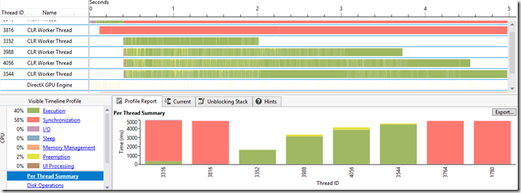
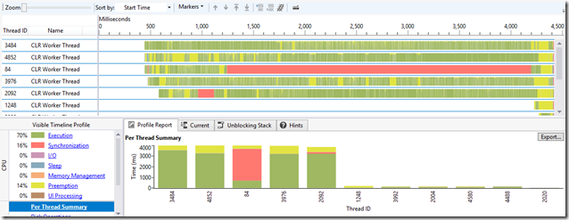
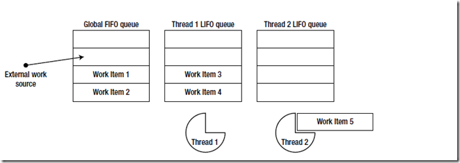

# [浅谈并发与并行(一)](https://www.cnblogs.com/yangecnu/p/Something-about-Concurrent-and-Parallel-Programming.html)

# 一、引言

   前天在[GitHub](http://joearms.github.io/2013/04/05/concurrent-and-parallel-programming.html)上看到一幅图，问如何向五岁的小孩讲解并发和并行。然后有人以这幅图做答：

[](https://images0.cnblogs.com/blog/94031/201307/01001508-e1aa5171ad2241fc88194f3b4f5a3ec8.png)

​    这幅图有点儿意思，用咖啡机的比喻来形容并发和并行，从中最直接的体会是，并发是有状态的，某一线程同时执行一个任务，完了才能进行到下一个，而并行是无状态的。

​     近些年，计算机的处理能力成指数能力增长。处理能力也越来越快，以前的一些工作站现在都可以移植到笔记本电脑或者手持设备上。但是近几年，由于处理器的处理速度已经达到了极限，所以处理器开始向多核方向发展，而提高程序性能的一个最简单的方式之一就是充分利用多核处理器的计算资源。但要编写利用多核处理器处理的程序并不那么简单。所以一些函数是编程语言，如F#，Scala，Erlang等又开始流行起来，因为他们带来的不可变性，递归思想等在一定程度上简化了并行和并发编程。

​     本文和下文从任务并行和数据并行两个方面，简要讨论一下.NET中的并行编程。这篇文章不可能讲完所有的API，框架，工具或者设计模式。对着方面感兴趣的同学可以看看专门的书籍如Concurrent  Programming on Windows 、Concurrency and Parallelism in .NET，  这些书专门讲解了.NET中的并发和并行编程，本文主要参考.NET Performance 一书的部分章节。

# 二、问题及挑战

​     对于并行，我们面临的另外一个挑战是多核系统的异质性。CPU制造商现在开始为面向用户的系统开发4核，8核或者更多内核的CPU。而且，目前的工作站或者高级点的笔记本电脑(移动工作站)通常具有强大的图形处理器(GPU),  这种强大的GPU支持成百上千的个线程同步。  如何充分利用GPU在某些方面的计算性能，以及如何在CPU与GPU上分配任务，CPU和GPU的异质性在一定程度上影响了并行开发。

​     但是，我们可以从并行，异步中获得一些性能提升。I/O受限的应用程序可以将I/O操作移到另一个线程，通过执行异步的I/O操作可以提高应用程序的响应性，并能够很容易的扩展。CPU计算受限的应用程序通过并行，可以利用所有已有的CPU核心或者升级可以提升若干个数量级的性能，或者是将一部分计算受限的任务利用   GPU内核来运算，以提高应用程序的性能。后面将会看到，一个简单的执行数组乘法的操作，通过修改几行简单的算法让这些代码运行在GPU上，就能将性能提升130倍。

​    然而，并行会带来另外一些问题-死锁，线程争用(race conditions)，饥饿，以及在单步调试时的内存崩溃。现在的一些并行框架，比如.NET 4.0中的并行库Task Parallel Library(TPL) 以及C++11 中的AMP，将一定程度上减轻编写并行程序的复杂度，并获得采用并行而形成的性能提升。

### 三、为啥要并发和并行

​    通过并发和并行能够使得应用程序可以充分利用多核以及GPU的计算能力，从而提高应用程序的性能，比如在以下几个方面中：

- 使用异步I/O操作可以提高应用程序的响应性。大多数的GUI应用程序都是用单个线程来控制所有UI界面的更新。UI线程不应该被占用过长时间，不然UI界面就会失去对用户的响应。
- 跨多线程的并行工作可以更好的利用系统的资源。具有多CPU和GPU的现代计算机，通过并行可以指数级的提高CPU计算受限的应用程序的性能。
- 同时执行多个I/O操作(如同时从多个网站上获取信息)可以提高总体的吞吐量(throughput)，等待I/O相应的操作可以用来发起新的操作，或者是处理操作返回的结果。

 

# 四、.NET 中并发和异步的演变

## 1. Threads->Thread Pool->Tasks

​    为了解决并行的问题，在最开始的时候就有了多线程的概念。线程也是处理并行和分布式异步操作的最简单的方法。

​    为了说明问题，我们使用查找质数的例子来说明问题：有一系列自然数，我们需要从这些自然数中找出所有的质数并将它们存储到一个结合中。首先我们编写一个传统的运行在一个CPU线程上的方法：

```
public static IEnumerable<int> PrimesInRange_Sequential(int start, int end)
{
    List<int> primes = new List<int>();
    for (int i = start; i < end; i++)
    {
        if (IsPrime(i)) primes.Add(i);
    }
    return primes;
}
public static bool IsPrime(int number)
{
    if (number == 2)
        return true;
    for (int divisor = 2; divisor < number; divisor += 1)
    {
        if (number % divisor == 0) return false;
    }
    return true;
}
```

 

​    这是个查找素数最原始最简单的一种办法，或许这个算法已经很快了。现在假设有一个很大的集合，比如[100，200000)，在我的i5的笔记本，上述算法花费了将近12000ms，所以有很大的优化空间。

​     首先第一个步的优化就是对算法效率本身的优化，比如说可以将线性的时间复杂度优化为根号n的时间复杂度，这里为了演示差异，暂不处理。但是无论算法怎么优化，似乎看起来仍旧不好进行并行处理。但仔细想想判断4977是否是一个质数和判断3221是否是质数是独立的，所以，将上面的数组划分到不同的线程中去计算就可以并行化。显然，在并行化的时候，我们需要注意多线程同步的问题，我们需要防止同一集合同时被多个线程修改，下面是一个改版后的代码，我们将任务均分，然后放在不同的线程上执行：

```
public static IEnumerable<int> PrimesInRange_Thread(int start, int end)
{
    List<int> primes = new List<int>();
    int range = end - start;
    int threadNum = (int)Environment.ProcessorCount;
    int chunk = range / threadNum;
    Thread[] threads = new Thread[threadNum];
    for (int i = 0; i < threadNum; i++)
    {
        int chunkStart = start + i * chunk;
        int chunkEnd = chunkStart + chunk;
        threads[i] = new Thread(() =>
        {
            for (int number = chunkStart; number < chunkEnd; ++number)
            {
                if (IsPrime(number))
                {
                    lock (primes)
                    {
                        primes.Add(number);
                    }
                }
            }

        });

        threads[i].Start();
    }

    foreach (Thread thread in threads)
    {
        thread.Join();
    }
    return primes;
}
```

​    现在，我们将10-200000这些数据平均分配到了四个线程上。

​      顺序执行的算法平均需要执行12000ms,  而使用多线程的方法则只需要大约4000ms。如果在多核的机器上，运行速度会更快。但是通过Concurrency  Profile的分析,可以看出问题。本人机器是i5处理器，有四个逻辑内核，从图中可以看出，在最开始的一段时间，CPU使用了四个内核处理，但是到最后只有一个CPU在运行。可以看到整体的CPU使用率从开始的4个核，然后下降到最后的  1个核

[](https://images0.cnblogs.com/blog/94031/201307/01001508-45db6f65cf8849b0b6cd21117d9cc8c2.png)

​     进一步从下图可以看出，四个线程的运行时间并不一样，可以看到一些线程比另外一些线程结束的早，使得整个的CPU的使用率远低于100%。

[](https://images0.cnblogs.com/blog/94031/201307/01001509-480fa799dabe4f8793bec4a1d6e7517b.png)

​    实际上如果内核更多的话，程序会运行的更快，但是有几个问题需要考虑：

- 到底创建多少个线程合适？如果系统有8个CPU内核，我们应该创建8个线程吗？
- 我们怎样保证我们不会垄断系统资源或者给计算机带来过大负担。比如，如果我们的进程中有其他线程需要使用和我们一样的并行算法计算指数，改怎么办？
- 线程如何同步的访问结果集。多个线程中同时访问List<int>是不安全的，可能会导致数据的不确定性。但是在我们每一次将一个结果加入集合中时进行加锁，代价很高，而且会带来严重的性能瓶颈，尤其是在将算法扩展到更多处理器内核的机器上时，问题更多。
- 对于小的计算问题，创建那么多的线程是否值得。或者说，对于这种情况，在单一线程中同步执行这些计算操作是否更恰当，创建和销毁一个线程开销是很大的。
- 如何保证所有的线程都分配相同的工作量？一些线程可能比其他线程更快的完成任务，特别是在处理一些结果集比较小的计算的时候。将100-100000划分为4个相等的工作量，那么查找100-25075中的素数基本会比75025-10000的快两倍，因为我们查找素数的算法会随着数字的增大效率会下降。
- 如果某个线程中抛出了异常，我们怎么处理呢？在这种情况下，似乎IsPrimer不会抛出什么异常，但是在实际的编程中，并发的工作可能会产生潜在的异常。(CLR的默认策略是，当某个线程发生未处理的异常时，整个进程都会终止，这个策略是正常的，但是他不允许PrimersInRange_Sequential  这个方法来处理这个异常

​    这些问题不是三言两语就能回答的了的， 一种框架要使得并行执行不会产生太多的进程，能够保证工作量能够平均的分配到所有线程上，并且能够报告错误和产生可靠地结果，这就是并行库Task Parallel Library的工作，后面我们会讨论。

​     从手动的线程管理来看，最自然的就是线程池了。线程池能管理很多个线程。和手动创建一个线程来执行特定操作不同，我们将工作任务扔到线程池中，它会选择合适的线程，然后去执行我们给定的方法。线程池解决了上面列出的若干问题，线程池通过限制创建线程的总数，根据给定的工作量来决定创建合适的线程数量，降低了在极端情况下，如处理量比较少的情况下创建和销毁线程的开销，帮助我们解决了对系统资源的独占和过度使用。

​     在我们的例子中，我们将上面的处理过程分成大块，然后放到线程池中让其处理。

```
public static IEnumerable<int> PrimesInRange_ThreadPool(int start, int end)
{
    List<int> primes = new List<int>();
    const int chunkSize = 100;
    int completed = 0;
    ManualResetEvent allDone = new ManualResetEvent(false);
    int chunks = (end - start) / chunkSize;

    for (int i = 0; i < chunks; i++)
    {
        int chunkStart = start + i * chunkSize;
        int chunkEnd = chunkStart + chunkSize;
        ThreadPool.QueueUserWorkItem(_ =>
        {
            for (int number = chunkStart; number < chunkEnd; number++)
            {
                if (IsPrime(number))
                {
                    lock (primes)
                    {
                        primes.Add(number);
                    }
                }
            }

            if (Interlocked.Increment(ref completed) == chunks)
            {
                allDone.Set();
            }

        });
    }

    allDone.WaitOne();
    return primes;
}
```

​    这样，较前一版本，代码更具有可扩展性。教前面那种复杂的手动创建线程的版本，使用线程池的方式，时间大概为2000ms，其次，使用Concurrency Profiler查看，CPU使用率大概接近100%，而且每一个线程执行的结束时间差不多。

 

[](https://images0.cnblogs.com/blog/94031/201307/01001509-cd7219ea467b48c7a4ac9dbcbdf8f0cf.png)

​    在CLR  4.0中，CLR线程池包含几个协作的部分。当不属于线程池的线程，比如说主线程，将任务分配到线程池时，实际上是将任务压入到一个全局的处理队列FIFO中。然后线程池中的每一个线程有一个本地的栈LIFO,然后不断的执行这个栈上的任务。如果线程池中的栈为空，他会试图尝试获取其他线程的本地栈中的任务，以队列的方式(FIF0)去执行。当所有的本地队列为空时，线程会询问全局的FIFO队列，然后从哪儿获取任务并执行。

 

[](https://images0.cnblogs.com/blog/94031/201307/01001510-8627bfd03a4b40d2b8d22f92e5c38d97.png)

 

​     当将任务压进全局的队列时，没有一个子线程有优先级去执行特定的任务，只有按顺序执行，所以FIFO适合全局队列。但是当线程池里的线程来执行一个任务时，它通常会使用当前的数据以及指令来执行下一个任务，这充分利用了CPU的数据和指令级缓存。更进一步，访问线程本地队列需要较少的同步，并且很少会遇到在访问全局队列时，其他线程争夺资源的问题。同样，当本地线程从其它线程抢工作任务是，他是以一种FIFO的形式，所以LIFO优化考虑到了CPU在本地原来线程上的缓存。

​     简言之，线程池通过一些管理机制帮助开发者从复杂的线程生命周期管理及调度中解放出来。虽然CLR的线程池有一些控制的API，比如ThreadPool.SetMinThreads以及SetMaxThreads方法控制线程的最大最小个数，也没有一些API能够控制线程或者任务的优先级。但是，他能够很方便的扩展到更强的系统上去，并且不需要为生命周期比较短的对象创建和销毁线程。

​     往线程池中添加的工作项比较简单，他们没有状态，也不能携带异常信息，不支持异步的继续和取消任务操作，当任务结束时，不能够返回处理结果。.NET  4.0中的Task Parallel  Library并行库中引入了task，它是对线程池中工作项的一种高层次抽象，Task是一种对线程和线程池里面的工作项的一种结构化抽象。

## 2. 任务并行化

​    任务并行化是指通过一系列API将大的任务分解成一系列小的任务，然后再多线程上并行执行。Task Parallel  Library（TPL）并行库有一系列API能够基于线程池同时管理成千上万个任务。TPL的核心是System.Threading.Tasks类，他代表一个小的任务，Task类提供了如下这些功能。

- 能够调度任务在非指定的线程上独立执行，要在特定的线程上执行给定任务需要通过task scheduler来确定，默认的task scheduler会将任务放到CLR的线程池中，但是有一些task scheduler可以将任务发送到特定的线程，如UI线程上。
- 能够等待任务结束，并获取执行的结果
- 能够提供一种机制，等待某一任务执行结束后立即执行继续的操作，通常我们称之为回调，但是在这里我们使用继续这一术语。
- 能够处理单一任务抛出的异常，甚至是有层次关系的任务在原始的线程上，或者是任何一个对任务结果会产生影响的异常。
- 在任务还没有开始的时候，可以取消任务，或者是在任务执行过程中，提交结束任务请求。

​     因为我们可以将task想象成为对线程的一种更高层次的抽象，我们可以使用任务代替线程来改写前面查找素数的代码。实际上，使用task可以使得代码更加短小，在每一次执行的时候，我们不需要任务结束时进行计数，也不需要重置ManualResetEvent对象来追踪任务执行的进度。但是在后面我们可以看到，TPL提供的数据并行API可能更加适合循环查找素数的应用场景。所以我们来举另外一个例子。

​    快速排序是一个比较有名的基于递归比较的排序算法。快速排序通过递归调用很容易实现并行化，其平均时间复杂度为nlog(n)。快速排序的代码如下：

```
public static void QuickSort_Sequential<T>(T[] items) where T : IComparable<T>
{
    QuickSort_Sequential(items, 0, items.Length);
}

private static void QuickSort_Sequential<T>(T[] items, int left, int right) where T : IComparable<T>
{
    if (left == right) return;
    int pivot = Partition(items, left, right);
    QuickSort_Sequential(items, left, pivot);
    QuickSort_Sequential(items, pivot + 1, right);
}

private static int Partition<T>(T[] items, int left, int right) where T : IComparable<T>
{
    int pivotPosition = (right - left) / 2;
    T pivotValue = items[pivotPosition];
    Swap(ref items[right - 1], ref items[pivotPosition]);
    int store = left;
    for (int i = left; i < right - 1; ++i)
    {
        if (items[i].CompareTo(pivotValue) < 0)
        {
            Swap(ref items[i], ref items[store]);
            ++store;
        }
    }
    Swap(ref items[right - 1], ref items[store]);
    return store;
}

private static void Swap<T>(ref T a, ref T b)
{
    T temp = a;
    a = b;
    b = temp;
}
```

​    QuickSort递归调用的每一步都可以并行化。 左侧和右侧数组排序是独立的任务，不需要同步操作。这个很容易使用task来表示。下面是使用task对QuickSort进行并行化的第一步：

```
private static void QuickSort_Parallel<T>(T[] items) where T : IComparable<T>
{
    QuickSort_Parallel(items, 0, items.Length);
}

private static void QuickSort_Parallel<T>(T[] items, int left, int right) where T : IComparable<T>
{
    if (left == right) return;
    int pivot = Partition(items, left, right);
    Task leftTask = Task.Run(() => QuickSort_Parallel(items, left, pivot));
    Task rightTask = Task.Run(() => QuickSort_Parallel(items, pivot + 1, right));
    Task.WaitAll(leftTask, rightTask);
}
```

​    Task.Run方法创建了一个新的任务,效果和new Task相同，然后让该任务执行（和调用start方法类似）。Task.WaitAll静态方法等待所有的方法执行完毕，然后返回。注意我们没有处理具体如何等待任务完成，比如编写创建和销毁线程的逻辑。

​    TPL中还有一个Parallel.Invoke 的帮助类，它能够执行一系列的任务，然后当所有任务结束之后，返回结果值，使用该方法可以重写QuickSort的主体代码。

```
Parallel.Invoke(() => QuickSort_Parallel_Threshold(items, left, pivot),
                () => QuickSort_Parallel_Threshold(items, pivot + 1, right));
```

​     不论是使用Parallel.Invoke或者是手动创建任务，如果我们将该版本和前面的顺序执行的版本相比，我们会看到，并行的版本执行的比较慢，即使在配置比较好的机器上。实际上，排1000000个随机的证书，顺序版本执行大概需要2500ms，而我们的并行版本竟然需要花4100ms。

​      为什么并行版本比顺序执行的代码运行的慢，问题在于，并行化需要一些足够的数据。当我们使用递归分解待排序的数组时，当数组变得非常小时，在使用并行化来进行进一步划分可能不如直接使用传统的方式进行排序来的快，因为当数组比较小时，使用并行排序大部分的花费都耗在了创建task对象，将带对象放到线程池以及等待任务完成上，这些操作浪费的时间远远大于元素对比所花费的时间。

## **3.控制递归算法中的并行化**

​    下面有几个方法可以对上面的并行算法进行优化：

- 只要数组的大小大于某一个阈值，就采用并行版本，否则采用顺序执行的版本。
- 只要递归的深度小于某一阈值，采用并行版本，否则采用顺序执行版本。（这一点甚至要优先于第一条，除非哨兵元素一直恰好排在元素的中间。
- 只要需要执行的任务个数小于特定的阈值，采用并行版本，否则采用顺序执行版本（这一条在没有其他的限制并行化的原则下比如递归的深度以及输入的大小上。

​    在上面的例子中，限制并行集合的大小会产生比较好的效果。在本人机器上，只需要600ms大概会比顺序版本快4倍多。而代码改动则很小，只需要设置一个阈值，该阈值需要不断测试获得。

```
private static void QuickSort_Parallel_Threshold<T>(T[] items, int left, int right) where T : IComparable<T>
{
    if (left == right) return;
    int pivot = Partition(items, left, right);
    if (right - left > 500)
    {
        Parallel.Invoke(() => QuickSort_Parallel_Threshold(items, left, pivot),
                        () => QuickSort_Parallel_Threshold(items, pivot + 1, right));
    }
    else
    {
        QuickSort_Sequential(items, left, pivot);
        QuickSort_Sequential(items, pivot + 1, right);
    }
}
```

   

​    使用相同的技巧，可以将很多其他使用递归讲解的算法并行化。事实上，大部分的递归算法，会将输入分解为几个部分独立运行，然后将结果集进行合并。

​    可以看到，使用TPL对课递归的算法进行并行化是很容易的，而且效果不错，在这里总结一下大致的方法为：

1. 对与可递归处理的算法，先写出正常的递归式，即顺序处理的算法。
2. 对递归的每一步分进行并行化处理。
3. 通过实验，设定并行化处理和顺序处理的阈值。

​    除了以上的例子外，还有很多使用递归处理的算法可以很容易的进行并行化，比如我们熟知的合并排序，Strassen矩阵乘法等等，这里有很多使用TPL进行并行化处理的例子，您感兴趣可以看看。

<http://code.msdn.microsoft.com/windowsdesktop/Samples-for-Parallel-b4b76364>

# 五、结语

​    本文简要介绍了并行和并发编程所面临的问题，并以查找素数的例子演示了在.NET中并发编程的演变，最后以快速排序演示了如何使用TPL对能够进行递归处理的算法进行并行化。本文中的代码点击[此处](http://files.cnblogs.com/yangecnu/ConcurrentandParallel.rar)下载。希望这些对您了解并发和并行编程有所帮助。