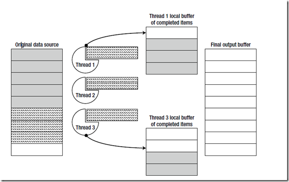

#  			[浅谈并发与并行(二)](https://www.cnblogs.com/yangecnu/p/Something-about-Concurrent-and-Parallel-Programming-PartII.html) 		


   [上文](http://www.cnblogs.com/yangecnu/p/Something-about-Concurrent-and-Parallel-Programming.html)讲解了.NET中的采用Task可以实现任务的并行。除了任务的并行之外，还有数据的并行。和任务的并行不同，数据的并行是指并行的源头不是算法的代码，而是算法操作的数据的本身，TPL ([Task Parallel Library](http://msdn.microsoft.com/en-us/library/dd537609.aspx))中提供了几个数据并行的API.

# 一 数据的并行

## **1.1 Parallel.For****和Parallel.ForEach**

​    for 和foreach语句也适合进行并行化。实际上，随着并行计算的流行，对这种循环遍历进行并行化也有过很多种尝试。这些方法包括对在编程语言进行扩充等，比如C++里面的[OpenMP](http://openmp.org/wp/)标准。C#并行类库(Task Parallel Library, TPL)通过提供一些API实现了数据并行化功能，这就是Parallel.For和Parallel.ForEach方法，分别对应平常用到的for和foreach。

​    回到[上文](http://www.cnblogs.com/yangecnu/p/Something-about-Concurrent-and-Parallel-Programming.html)中的遍历数组查找素数的方法中，当时我们是这样写的。

```
for (int number = start; number < end; ++number)
{
    if (IsPrime(number))
    {
        primes.Add(number);
    }
}
```

​     将上面的代码转换成并行遍历如下：

```
Parallel.For(start, end, number =>
{
    if (IsPrime(number))
    {
        lock (primes)
        {
            primes.Add(number);
        }
    }
});
```

​    通过将for换成Parallel.For可以自动获得并行遍历集合的特性。Parallel.For  API并不是直接在每一次遍历的时候创建一个task，或者是在特定的循环范围创建一个task。他会在执行过程中，考虑到当前正在执行的task数据，避免频繁分配等来动态的确定在多少范围内创建一个task对象。如果要手动控制task创建的个数，可以使用Parallel.For的另外一个重载方法，通过ParallelOptions参数即可控制创建的并行执行任务的最大个数，或者使用一个自定义的分隔方法来确定多少个遍历范围划分到一个task对象中去。

​    和foreach对应，TPL中有对应的并行化的Parallel.ForEach,需要注意的是ForEach遍历的源并不需要关心线程安全，因为Parallel.ForEach使用多个线程遍历集合时采用了同步策略进行访问的。

```
IEnumerable < string > rssFeeds = . . .; //数据源并不需要线程安全
WebClient webClient = new WebClient();
Parallel.ForEach(rssFeeds, url => {
    Process(webClient.DownloadString(url));
});
```

​    Foreach循环的源可以是无穷的，不确定的，就像LINQ一样，可以在符合一定条件的时候终止。

​     上面的讨论可能有点儿简单，对循环进行并行遍历有时候可能会遇到一些问题。在使用TPL对循环进行并行化时我们还需要考虑一些问题。比如C#中循环中可以使用break关键字退出循环。但是我们如何对已经在多个线程之上运行着的循环遍历进行终止呢，我们甚至不知道当前在那个线程上执行哪一次遍历。

​    所以ParallelLoopState 类表示了一种并行遍历执行的一种状态，它能够使得我们从遍历中退出。比如

```
int invitedToParty = 0;
Parallel.ForEach(customers, (customer, loopState) = > {
    if (customer.Orders.Count > 10 && customer.City == "Portland") {
        if (Interlocked.Increment(ref invitedToParty) > = 25) {
             loopState.Stop(); //no attempt will be made to execute any additional iterations
        }
    }
});
```

​     需要注意的是，Stop方法并不能保证在最后一次执行的迭代是调用该方法的那次迭代，因为已经开始执行的迭代会执行完成，除非显式的调用ParallelLoopState.ShouldExitCurrentIteration属性。但是调用了stop后，其他的迭代不会再排入到待迭代的队列中了。

​     ParallelLoopState.Stop方法的缺点是他不能保证从迭代开始至调用stop的那次迭代这之间的所有迭代都执行完成，举个例子，如果有10000个customers对象，可能1-100个已经处理完成，101-110根本就没有进行处理，但是在111时调用了stop方法。那么1-100和111会执行完成，101-110根本就不会进行处理，如果我们要保证在结束迭代之前的所有迭代都完成，则应该使用ParallelLoopState.Break方法。

## 1.2 Parallel LINQ (PLINQ)

​     LINQ使得我们的代码更加具有声明式的风格，使得代码更关注做什么，而不是怎么做。LINQ在对数据进行查询，过滤，组合上非常方便。比如说我们要从用户表customer和用户订单表orders中，查询上海的用户，在最近10个月中至少消费3笔满10快钱的用户的姓名和年龄。如果写成传统的方法，不知道要写多少代码，而且各种复杂的处理逻辑使得代码的语义非常不清晰，但是，如果写成LINQ的话，会是如下:

```
var results = from customer in customers
              where customer.State == "WA"
              let custOrders = (from order in orders
                                where customer.ID == order.ID
                                select new { order.Date, order.Amount })
              where custOrders.Count(co => co.Amount >= 10 &&
                                     co.Date >= DateTime.Now.AddMonths(−10)) >= 3
              select new { customer.Name, customer.Age };
foreach (var result in results) {
Console.WriteLine("{0} {1}", result.Name, result.Age);
}
```

​    代码很清晰的表明了意图。我们不必担心不同的遍历之间的同步问题，因为大多数的LINQ查询都是函数式的，没有副作用，他们会将一个集合，通常是IEnumerable<T>转换为另外一个集合，并不改变线程中的其他对象。

​    采用PLINQ对上面的代码进行并行化非常简单，只需要在源集合使用AsParallel扩展方法，那么返回的结果集就从IEnumerable变成了ParallelQuery：

```
var results = from customer in customers.AsParallel()
              where customer.State == "WA"
              let custOrders = (from order in orders
                                where customer.ID == order.ID
                                select new { order.Date, order.Amount })
              where custOrders.Count(co => co.Amount >= 10 &&
                                     co.Date > = DateTime.Now.AddMonths(−10)) >= 3
              select new { customer.Name, customer.Age };
foreach (var result in results) {
Console.WriteLine("{0} {1}", result.Name, result.Age);
}
```

​     PLINQ通常通过三步来进行并行查询。首先，PLINQ会决定需要多少个线程来进行并行查询，然后工作线程从源数据集合中获取任务块，并且保证对源的访问在有锁的安全情况下进行。然后每一个线程独立的处理各自的查询，然后结果集保存在各自的线程中。最后，所有的本地线程中的结果集合并成一个完整的集合。如下图：

[](https://images0.cnblogs.com/blog/94031/201310/31004053-b11dc24d09384862a8bdbe31a66ac132.png)

​    图中波浪线显示的待执行的任务，阴影表示执行完成后的结果。

​     和Parallel.ForEach相比，PLINQ最大的好处是能够帮我们将各个线程执行完成后的结果集聚合起来。回到前面，在Parallel.ForEach查找素数的那个版本中，我们需要访问一个存储查找到了的全局的素数集合，然后，每一次执行完成后将结果保存在里面，这种情况下，我们需要加锁，这样会增加一点额外的开销。现在将该方法改成PLINQ的方式，如下：

```
List<int> primes = (from n in Enumerable.Range(3, 200000).AsParallel()
                    where IsPrime(n)
                    select n).ToList();
```

# 二 同步

​     前面讲了任务并行和数据并行,在各种并行处理方法中,遇到最多的麻烦可能就是同步的问题。在一些函数式编程语言如F#，Haskel中，对象是不可变(immutant)的,  所以很好的解决了并发的问题.但是在诸如C#这类语言中, 当多个线程同时访问一个集合, 一个引用类型的对象的时候,  就需要考虑同步问题。除了只读类型的数据，访问共享内存位置的对象都需要同步，但是在各种同步机制中他们的消耗和可扩展性是有差别的。

​    同步机制有很多种，在[CLR Via C#](http://www.amazon.com/CLR-via-C-Developer-Reference/dp/0735667454/ref=sr_1_1?ie=UTF8&qid=1383149802&sr=8-1&keywords=clr+via+c)中，有一大章专门介绍同步，按照Jeffery的观点，同步分为用户模式(User-Mode)和内核模式(Kernal-Mode)两大类构造。在可能的情况下，我们应该尽可能的使用用户模式的同步构造，它比内核模式的同步方式要快，因为它使用特殊的CPU指令来调度线程，这也就意味着用户模式的同步构造是在硬件层面上实现的，所以他比较快。但这也有个问题，操作系统永远不会检测到线程在用户模式同步构造上阻塞了，线程池不会创建新的线程来代替暂时被阻塞的线程去执行任务。另外，用户模式同步构造模式下的CPU指令只会在很短的时间内对线程进行阻塞。

​     用户模式同步构造看起来不错，这就是为什么大家尽可能的应该使用这种同步构造的原因，但是他也有一些缺点。只有操作系统的内核才能阻止一个线程运行从而不再浪费CPU时间。在用户模式下运行的线程有可能被系统线程抢占，但是这些线程会被尽可能快的重新调度。因此一个线程想要获取一些资源，但是又获取不到，所以就在用户模式的同步构造中自旋起来了，这样就会浪费大量的CPU时间，如果能将这些CPU时间用去做其他事情或者让CPU休眠以节省更多能源这样就更好了。

​     这时候内核模式(kernel-mode)同步构造就发挥作用了。内核模式构造是有操作系统本身支持的。这就需要我们的应用程序去调用操作系统的内核函数来实现。让线程从用户模式切换到内核模式然后再切换回来会产生大量的性能损失，这就是内核模式同步构造需要尽量避免使用的原因。但是内核构造也有一个好处，那就是，当一个线程使用内核模式去获取一个被其他线程占有的资源的时候，Windows可以暂时将该线程阻塞从而不会浪费CPU时间，当资源变为可用，再恢复该线程允许其访问资源。

​     当一个线程当前获取到一个同步构造但是永远不释放时，线程在当前构造中有可能会被永远阻塞。当这种同步构造是用户模式的构造的时候，线程就会永远在CPU上运行，浪费CPU运行时间，这种就叫做活锁（livelock）。如果这种同步构造是内核模式，则我们称之为死锁(deadlock)，这两种情况都是我们应该避免的，但是死锁要比活锁好，因为活锁会浪费CPU时间和内存，而死锁只浪费内存。

​    在理想的情况下，我们想要同时拥有这两种同步构造的优点。就是说，在没有竞争的时候，我们想要一种既快又非阻塞的构造(就像用户模式那样)，但是当发生竞争的时候，我们有希望操作系统内核能够去阻塞处于等待中的线程。这种构造模式我们称之为混合模式同步构造。

​    内核模式构造(Kernal-Mode)相信大家用的很多，比如AutoResetEvent，ManualResetEvent，Semaphore，Mutex，这些在CLR Via C# 中都有详细介绍。

​     用户模式构造(User-Mode)在那本书中也有详细介绍，不过本文打算就用户模式构造详细讲解一下，这种高效快速的同步构造在很多情况下能够提升引用程序的性能。

​    在开始讨论之前,我们看看当访问小型数据时的同步问题.现代CPU能够对内存进行原子(atomic)读或者写操作,例如对一个32位的整形数据通常会执行原子读操作.这意味着，如果单个处理器将值0xDEADBEEF写到一个之前为0的内存地址上时，另一个处理器不能够访问这一地址进行写操作，比如将0xDEAD0000   或者0x0000BEEF同时也写到为0的内存地址上。但是对于较大的内存地址来说并非如此，即使对于一个64位的处理器，往内存地址上写入20个字节也不是原子操作，不能够执行原子读或者写。

​    即使是访问32位的内存地址也会产生多个处理单元同时操作问题，这就会产生同步问题。比如执行++i操作通常需要三条机器指令。

```
mov eax, dword ptr [ebp-64] ;//将变量从堆拷贝到寄存器上
inc eax ;//在寄存器中对该对象自增
mov dword ptr [ebp-64], eax ;//复制回堆上
```

​    这三条指令每一条都是原子操作的，但是如果没有同步操作，两个处理单元会同时并发执行该命令的一部分，这就会造成脏读或更新丢失 (lost updates)的问题。比如，假设变量的初始值为100，那么考虑下面的执行过程：

```
Processor #1                     Processor #2
mov eax, dword ptr [ebp-64]
                                 mov eax, dword ptr [ebp-64]
                                 inc eax
inc eax
mov dword ptr [ebp-64], eax
                                 mov dword ptr [ebp-64], eax
```

​    在这种情况下，变量的值最终为101，虽然两个处理器都会改变两进行了自增操作，应该是102。这种线程争用(race condition)情况很容易产生和发现，这就说明了锁的重要性和必要性。

## **无锁代码**

​     解决同步问题的一个方法是加锁，这会给操作系统添加负担。毕竟，操作系统提供了一系列方法来创建和管理线程，以及调度他们的执行过程。很自然的我们希望能够使用操作系统提供的一系列原始的同步机制。实际上，Windows自身在访问内部数据结构的时候也需要同步。Windows系统的同步机制通常需要系统级别的调用，从用户模式到内核模式的切换，以及线程的上下文切换来保证同步。如果需要进行同步的操作比较简单（比如自增某一变量，或者往列表中插入一个对象），而去动用系统级别的同步策略的话，显得有点儿杀鸡用牛刀。

​    Windows 操作系统上的处理器家族都能够实现一种硬件级别的称之为Compare-And-Swap(CAS)的同步基本单元(primitive)，下面是CAS的伪代码语义，并且能够以原子的方式执行：

```
WORD CAS(WORD* location, WORD value, WORD comparand) {
    WORD old = *location;
    if (old == comparand) {
        *location = value;
    }
    return old;
}
```

​    简单来说，CAS会比较内存位置上的值与提供的值是否相等，如果相等，就将另外一个值放到内存位置上。否则，不替换。不管怎样，方法的返回值是内存位置在方法执行之前的值。

​    举例来说，在Inter x86处理器上，LOCK  CMPXCHG指令用来执行这一CAS同步的原子操作。将CAS(&a,b,c)伪代码转换为LOCK  CMPXCHG很简单。在.NET中，CAS是通过Interlocked.CompareExchange的一系列重载方法实现的。

```
//C# code:
int n = . . .;
if (Interlocked.CompareExchange(ref n, 1, 0) == 0)//尝试将0替换为1
{ 
   //. . .do something
}

//x86 assembly instructions:
mov eax, 0 ;//待比较的值
mov edx, 1 ;//新值
lock cmpxchg dword ptr [ebp-64], edx ;//假设 n 在 [ebp-64]内存地址上
test eax, eax ;//如果 eax = 0, 则替换
jnz not_taken
;. . .do something
not_taken:
```

​     单个CAS操作并不能组建一个有用的同步机制，除非操作的方法只需要执行一次比较替换操作。但是，当和循环结构搭配时，CAS在执行同步操作时会发挥很大作用。下面我们来看看一个简单的就地(in-place)数据乘法操作。我们想要以原子的方式执行x*=y操作，x在一个共享内存上可能同时被其他线程访问，y是一个常量，不能被其他线程更改。下面的基于CAS的同步机制能够做到这一点：

```
public static void InterlockedMultiplyInPlace(ref int x, int y)
{
    int temp, mult;//temp存储原始共享内存位置的变量的值，mult存储期望的结果
    do
    {
        temp = x;
        mult = temp * y;
        //这里可能会发生线程被抢占，x的值可能会被其他线程更改，
        //如果x的值发生改变，那么x就和temp不相等，x就不会被替换为mult，循环继续
        //如果x的值没有发生改变，x就和temp相等，x就会被替换为mult，循环结束
        //不管替换或者不替换 Interlocked.CompareExchange(ref x, mult, temp)返回的是中是x之前的值
    } while (Interlocked.CompareExchange(ref x, mult, temp) != temp);
}
```

​     上述代码中，每一次执行开始都会将x读取保存在本地临时的变量temp中，这个变量不能够被其他线程修改，然后我们计算乘法的结果，然后准备将结果保存到x中。在计算乘法的过程中x可能会被外部其他线程更改，因为计算乘法有可能会被其他一些复杂的耗时的操作取代，这过程中既有可能被其他线程修改共享位置的变量。然后尝试进行替换，如果x没有被外部线程改变，那么x就应该等于temp，然后执行替换，将mult的结果赋值为x，然后结束循环比较。Interlocked.CompareExchange返回值是x的最原始的值，完了才会被替换为mult。在并发情况比较高的情况下，可能需要循环几次才能成功执行操作：

```
Processor #1                              Processor #2
temp = x; (3)
                                          temp = x; (3)
mult = temp * y; (15)
                                          mult = temp * y; (15)
                                          CAS(ref x, mult, temp) == 3 (== temp)  x=15
CAS(ref x, mult, temp) == 15 (! = temp)
```

​     上面演示了CAS做乘法的过程，线程1在执行乘法操作的时候，线程二已经将x的值改变为了乘法的结果15，然后线程1执行的时候发现x的值不和之前的temp  3  相等，所以拒绝执行替换操作，进一步循环，将15付给temp，然后mult为75，然后这是如果线程2不操作的话，x=15相等执行替换，两个线程的两次乘法操作（对x=3执行了两个乘5的操作）保证了结果集为75。

​    CAS代码很容易出错，比如上面的代码简单修改一下就很容易产生问题：

```
public static void InterlockedMultiplyInPlace(ref int x, int y)
{
    int temp, mult;
    do
    {
        temp = x;
        mult = x * y;
    } while (Interlocked.CompareExchange(ref x, mult, temp) != temp);
}
```

​    问题在于，连续读取两次x的值并不能保证这过程中x没有被其他线程修改。下面展示了这一问题，还是在初始化时x=3，y=5,执行结果会出现错误的x=60

```
Processor #1                         Processor #2
temp = x; (3)
                                     x = 12;
mult = x * y; //(60!) 在执行之前，线程2将x的值改为了12，完了之后，
//线程2又立即将值改回了3，如果这个操作很耗时，这是很有可能发生的
                                     x = 3;
CAS(ref x, mult, temp) == 3 //(== temp)。
```

​    再看一个获取最大值的原子操作方法：

```
public static void InterlockedGetMaxInPlace(ref int x, int y)
{
    int temp, mult;
    do
    {
        temp = x;
        mult = Math.Max(x, y);
    } while (Interlocked.CompareExchange(ref x, mult, temp) != temp);
}
```

​    是不是很简单，从中我们可以抽象出一种模式，Jeffrey Richter把它叫做InterLocked Anything 模式。用泛型抽象表示如下：

```
public static void DoWithCAS<T>(ref T location, Func<T, T> generator) where T : class
{
    T temp, replace;
    do
    {
        temp = location;
        replace = generator(temp);
    } while (Interlocked.CompareExchange(ref location, replace, temp) != temp);
}
```

​    现在我们改写上面的两个方法，

```
public static void InterlockedMultiplyInPlace(ref int x, int y)
{
    DoWithCAS(ref x, t = > t * y);
}
public static void InterlockedGetMaxInPlace(ref int x, int y)
{
    DoWithCAS(ref x, t => Math.Max(t, y));
}
```

​    说到这里，在一个简单的称之为自旋锁(spinlock)的同步机制，能够使用CAS来实现。其主要方法是，获取一个锁，然后保证其他线程在试图获取这个锁的时候会失败，然后会不停的藏式。自旋锁就是，当一个线程获取了这个锁之后，其他线程都会挂起。

```
public class SpinLock
{
    private volatile int locked;
    public void Acquire()
    {
        while (Interlocked.CompareExchange(ref locked, 1, 0) != 0) ;
        //第一次执行是locked默认为0，为false，推出循环，locked赋值为1
        //第二个线程获取时lock为1，循环一直进行。
        //知道第一个线程release之后，locked为0.
    }
    public void Release()
    {
        locked = 0;
    }
}
```

​    说要这里，就不可避免的要谈谈内存模型和volatile关键字了，在Joe Duffy同学的[Concurrent Programming on Windows](http://www.amazon.com/Concurrent-Programming-Windows-Joe-Duffy/dp/032143482X/ref=sr_1_1?ie=UTF8&qid=1383150180&sr=8-1&keywords=Concurrent+Programming+on+Windows)这本书中对这些都有深入的讲解。

​     简单来讲，现代编译器为了提高执行效率，通常会对编译好的指令进行重新排列或者乱序执行以提高效率。虽然大部分编程语言的内存模型认为读写共享内存地址的操作指令不会被重新排序，但是在不同的内存地址上进行读写操作可能会对指令进行重新排序以提高效率，比如利用缓存机制等等。比如下面的例子,初始值为f=0，x=13，输出结果可能会是13。

```
Processor #1        Processor #2
while (f == 0);     x = 42;
print(x);           f = 1; 
```

​    原因在于，在Processor 2  上，编译器和处理器可以对执行指令进行重新排列，可以先执行f=1，然后执行x=42，同样的在Processor  1上也可以先执行print(x)然后执行while循环。有时候这些细节可能会导致比较难以发现的bug。要解决这些问题，首先可以使用volatile关键字，他会阻止编译器对指令进行重新排序。其次可以使用Interlocked中的一系列方法以及Thread.MemoryBarrier,这些方法都会引入内存栅栏。幸运的是windows中的同步机制以及TPL中的并行方法中都默认在操作时添加了必要的内存栅栏，关于这些，大家可以看博客园中LoveJenny同学的这篇文章  [深入浅出多线程系列之八：内存栅栏和volatile 关键字](http://www.cnblogs.com/LoveJenny/archive/2011/05/29/2060718.html)

​    自旋锁在数据库访问，读写磁盘上的大文件，在网络上发送数据包，以及一些需要耗时的操作中经常被用到。而且自旋锁在一些快速访问中也经常被用到，比如修改某一个对象的多个字段，往DataTable中插入多列，以及往一个集合中添加多个元素等等。

​    实际上，Windows内核本身在实现内部的同步的时候，也大量使用了自旋锁。内核数据结构，比如说调度数据库，文件系统缓存块列表，内存页帧编号库以及其他的数据结构在访问的时候都会进行自旋锁加锁。

​    使用CAS同步的基本操作，我们可以编写一些使用lock-free的可以用于多线程访问的数据结果，比如lock-free stack。在TPL中有并行机和如ConcurrentStack<T>

我们可以使用单链表来实现一个lock-free的 stack，栈顶是列表的头元素，压栈和出栈操作就是替换这个头元素。我们使用之前介绍的DoWithCAS<T>这个辅助类来实现该功能。

```
public class LockFreeStack<T>
{
    private class Node
    {
        public T Data;
        public Node Next;
    }
    private Node head;
    public void Push(T element)
    {
        Node node = new Node { Data = element };
        DoWithCAS(ref head, h =>
        {
            node.Next = h;
            return node;
        });
    }
    public bool TryPop(out T element)
    {
        //DoWithCAS does not work here because we need early termination semantics
        Node node;
        do
        {
            node = head;
            if (node == null)
            {
                element = default(T);
                return false; //bail out – nothing to return
            }
        } while (Interlocked.CompareExchange(ref head, node.Next, node) != node);
        element = node.Data;
        return true;
    }
}
```

​    类似的，使用lock-free，可以构造多种基本的数据结果。如lock-free 双向链表，lock-free队列，lock-free优先级队列。具体的实现在<http://www.boyet.com/Articles/LockfreeStack.html>这个网站上有实现。

​    但是仍然有很多集合结构使用lock-free代码不容易实现，仍然需要同步锁机制。进一步，很多的代码不能使用CAS来重写，因为可能需要过长的执行时间。

# 三 总结

​    接[上一篇](http://www.cnblogs.com/yangecnu/p/Something-about-Concurrent-and-Parallel-Programming.html)文章，本文简要介绍了并发与并行中的数据并行，并介绍了TPL库中提供的数据并行API以及PLINQ；紧接着介绍了并发和并行中同步这一比较重要的问题，并简单介绍了用户模式和内核模式同步构造的优缺点，鉴于用户模式同步构造在很多情况下能够大幅提升应用程序的性能，着重介绍了与之相关的Interlock及一些lock  free编程方面的知识，本文主要参考[Pro .NET Performance](http://www.amazon.com/Pro-NET-Performance-Optimize-Applications/dp/1430244585/ref=sr_1_1?ie=UTF8&qid=1383150900&sr=8-1&keywords=.net+performance)、[CLR Via C#](http://www.amazon.com/CLR-via-C-Developer-Reference/dp/0735667454/ref=sr_1_1?ie=UTF8&qid=1383149802&sr=8-1&keywords=clr+via+c)，希望这些对大家认识和理解并发并行有所帮助。

作者：    [yangecnu](http://www.cnblogs.com/yangecnu/)（[yangecnu's Blog on 博客园](http://www.cnblogs.com/yangecnu/)） 
 出处：<http://www.cnblogs.com/yangecnu/> 
本作品由[yangecnu](http://www.cnblogs.com/yangecnu/) 创作，采用[知识共享署名-非商业性使用-禁止演绎 2.5 中国大陆许可协议](http://creativecommons.org/licenses/by-nc-nd/2.5/cn/)进行许可。 欢迎转载，但任何转载必须保留完整文章，在显要地方显示署名以及原文链接。如您有任何疑问或者授权方面的协商，请 [给我留言](http://space.cnblogs.com/msg/send/yangecnu)。 


分类: [DotNet Framework](https://www.cnblogs.com/yangecnu/category/416399.html)

标签: [并行](https://www.cnblogs.com/yangecnu/tag/并行/), [并发](https://www.cnblogs.com/yangecnu/tag/并发/), [Concurrent](https://www.cnblogs.com/yangecnu/tag/Concurrent/), [Parallel](https://www.cnblogs.com/yangecnu/tag/Parallel/), [Interlock](https://www.cnblogs.com/yangecnu/tag/Interlock/), [Lock-free Programming](https://www.cnblogs.com/yangecnu/tag/Lock-free Programming/)


​    

[« ](https://www.cnblogs.com/yangecnu/p/Excel-Custome-Task-Panel-Introduction.html) 上一篇：[浅谈Excel开发：七 Excel 自定义任务窗体](https://www.cnblogs.com/yangecnu/p/Excel-Custome-Task-Panel-Introduction.html)
[» ](https://www.cnblogs.com/yangecnu/p/3428647.html) 下一篇：[Kinect for Windows SDK开发入门(十九)：Kinect Fusion](https://www.cnblogs.com/yangecnu/p/3428647.html)