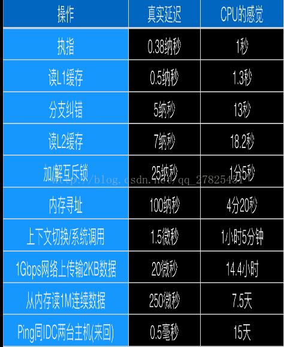

# 详解并发和并行意义

---

##	并发与并行的区别

作者：Bug辉
原文链接：https://www.bughui.com/2017/08/23/difference-between-concurrency-and-parallelism/
版权声明：《并发与并行的区别》 由 Bug辉 采用 知识共享 署名-非商业性使用-禁止演绎 4.0 国际 许可协议 进行许可。转载或引用文章时请注明原作者并带上原文链接。	作者：Bug辉

###	C#.Net -Threads->Thread Pool->Tasks 

###	并发:

虚拟的同时执行，时间片切换	抢占

并发的实质是一个物理CPU(也可以多个物理CPU) 在若干道程序（或线程）之间多路复用，并发性是对有限物理资源强制行使多用户共享以提高效率。

​     微观角度：所有的并发处理都有排队等候，唤醒，执行等这样的步骤，在微观上他们都是序列被处理的，如果是同一时刻到达的请求（或线程）也会根据优先级的不同，而先后进入队列排队等候执行。

​     宏观角度：多个几乎同时到达的请求（或线程）在宏观上看就像是同时在被处理。

>  并发就是只有**一个CPU资源**，程序（或线程）之间要**竞争**得到执行机会。图中的第一个阶段，在A执行的过程中B，C不会执行，因为这段时间内这个CPU资源被A竞争到了，同理，第二个阶段只有B在执行，第三个阶段只有C在执行。其实，并发过程中，A，B，C并不是同时在进行的（微观角度）。但又是同时进行的（宏观角度）。

###	并行:

物理OS操作线程可观的同时	

并行指两个或两个以上事件（或线程）在同一时刻发生，是真正意义上的不同事件或线程在同一时刻，在不同CPU资源上（多核），同时执行。

> ​    并行，不存在像并发那样竞争CPU资源，等待执行的概念，因为并行状态下的线程分布在不同的CPU上。
>
> ​    图中，A，B，C都在同时运行（微观，宏观）。

###	**多线程实现并发，并行**

​    1、在CPU比较繁忙，资源不足的时候（开启了很多进程），操作系统只为一个含有多线程的进程分配仅有的CPU资源，这些线程就会为自己尽量**多抢时间片**，这就是通过多线程实现并发，线程之间会竞争CPU资源争取执行机会。

   2、 在CPU资源比较充足的时候，一个进程内的多线程，可以被[分配到不同的CPU资源]()，这就是通过多线程实现并行。

   3、[至于多线程实现的是并发还是并行？上面所说](https://blog.51cto.com/jiekeyang/2177931)，所写多线程可能被分配到一个CPU内核中执行，也可能被分配到不同CPU执行，分配过程**是操作系统所为，不可人为控制**。所有，如果有人问我我所写的多线程是并发还是并行的？我会说，都有可能。

   4、不管并发还是并行，都提高了程序对CPU资源的利用率，最大限度地利用CPU资源。

多线程是为了同步完成多项任务，不是为了提高运行效率，而是为了提高资源使用效率来提高系统的效率。

---

### 优缺点

异步操作的优缺点

　　因为异步操作无须额外的线程负担，并且使用回调的方式进行处理，在设计良好的情况下，处理函数可以不必使用共享变量（即使无法完全不用，最起码可以减少共享变量的数量），减少了死锁的可能。当然异步操作也并非完美无暇。编写异步操作的**复杂程度较高**，程序主要使用**回调方式进行处理**，与普通人的思维方式有些初入，而且难以调试。

多线程的优缺点
　　多线程的优点很明显，线程中的处理程序依然是顺序执行，符合普通人的思维习惯，所以编程简单。但是多线程的缺点也同样明显，线程的使用（滥用）会给系统带**来上下文切换的额外负担**。并且**线程间的共享变量可能造成死锁**的出现。

----

###	Task

​    同步机制有很多种，在[CLR Via C#](http://www.amazon.com/CLR-via-C-Developer-Reference/dp/0735667454/ref=sr_1_1?ie=UTF8&qid=1383149802&sr=8-1&keywords=clr+via+c)中，有一大章专门介绍同步，按照Jeffery的观点，同步分为用户模式(User-Mode)和内核模式(Kernal-Mode)两大类构造。在可能的情况下，我们应该尽可能的使用用户模式的同步构造，它比内核模式的同步方式要快，因为它使用特殊的CPU指令来调度线程，这也就意味着用户模式的同步构造是在硬件层面上实现的，所以他比较快。		但这也有个问题，操作系统永远**不会检测到**线程在用户模式同步构造上**阻塞**了，线程池不会创建新的线程来代替暂时被阻塞的线程去执行任务。另外，用户模式同步构造模式下的CPU指令只会在很短的时间内对线程进行阻塞。

让线程从用户模式切换到内核模式然后再切换回来会产生大量的性能损失，这就是内核模式同步构造需要尽量避免使用的原因。暂时将该线程阻塞再去关于非要。避免死锁浪费内存，但总比活锁浪费CPU和内存抢

。Task Parallel Library（TPL）核心是System.Threading.Tasks类

​	将task想象成为对线程的一种更高层次的抽象,管理和调度任务；TPL提供的数据并行API可能更加适合循环查找素数的应用场景。

  **FIFO**（先进先出LIFO	LIFO	 ）   **LRU**（最近最少使用 法） **OPT**（最优算法）

> [**存储管理程序设计**	三种算法的命中率。](https://www.cnblogs.com/Janskid/p/6232933.html)

#####	**减少上下文切换**

- **无锁并发编程**。多线程竞争时，会引起上下文切换，所以多线程处理数据时，可以用一些办法来避免使用锁，如将数据的ID按照Hash取模分段，不同的线程处理不同段的数据
- **CAS算法**。Java的Atomic包使用CAS算法来更新数据，而不需要加锁
- **使用最少线程**。避免创建不需要的线程，比如任务很少，但是创建了很多线程来处理，这样会造成大量线程都处于等待状态
- **协程**。在单线程里实现多任务的调度，并在单线程里维持多个任务间的切换

Parallel.For API并不是直接在每一次遍历的时候创建一个task，或者是在特定的循环范围创建一个task。他会在执行过程中，**考虑到当前正在执行的task数据**，避免频繁分配等来动态的确定在多少范围内创建一个task对象。

权衡分更多的线程数	和	更少的减少切换消耗
　

------

作者：流云易采 
来源：CSDN 
原文：https://blog.csdn.net/woliuyunyicai/article/details/45165869 
版权声明：本文为博主原创文章，转载请附上博文链接！

---

[首先，我们来看看前辈的看法：](https://www.cnblogs.com/bughui/p/7422214.html)     

Vipin Jain. [Differences between concurrency vs. parallelism](https://stackoverflow.com/questions/4844637/what-is-the-difference-between-concurrency-parallelism-and-asynchronous-methods)  ：

 Concurrency is when two tasks can start, run, and complete in  overlapping time periods. Parallelism is when tasks literally run at the  same time, eg. on a multi-core processor.     Concurrency is the composition of independently executing processes,  while parallelism is the simultaneous execution of (possibly related)  computations.     Concurrency is about dealing with lots of things at once.  Parallelism is about doing lots of things at once.     An application can be concurrent – but not parallel, which means  that it processes more than one task at the same time, but no two tasks  are executing at same time instant.     An application can be parallel – but not concurrent, which means  that it processes multiple sub-tasks of a task in multi-core CPU at same  time.     An application can be neither parallel – nor concurrent, which means  that it processes all tasks one at a time, sequentially.     An application can be both parallel – and concurrent, which means  that it processes multiple tasks concurrently in multi-core CPU at same  time.     Vipin Jain. Differences between concurrency vs. parallelism  

翻译成中文：      并发是两个任务可以在重叠的时间段内启动，运行和完成。并行是任务在同一时间运行，例如，在多核处理器上。     并发是独立执行过程的组合，而并行是同时执行（可能相关的）计算。     并发是一次处理很多事情，并行是同时做很多事情。     应用程序可以是并发的，但不是并行的，这意味着它可以同时处理多个任务，但是没有两个任务在同一时刻执行。     应用程序可以是并行的，但不是并发的，这意味着**它同时处理多核CPU中的任务的多个子任务**。     一个应用程序可以即不是并行的，也不是并发的，这意味着它一次一个地处理所有任务。     应用程序可以即是并行的也是并发的，这意味着它同时在多核CPU中同时处理多个任务。

作者：Bug辉
原文链接：https://www.bughui.com/2017/08/23/difference-between-concurrency-and-parallelism/
版权声明：《并发与并行的区别》 由 Bug辉 采用 知识共享 署名-非商业性使用-禁止演绎 4.0 国际 许可协议 进行许可。转载或引用文章时请注明原作者并带上原文链接。

---

##	详解并发和并行意义

  很多人不是特别明白并发编程和并行编程的区别所在，有很多人很容易搞混淆，觉得二者近似相等，本文将用几个浅显易懂的例子，来说明一下什么是并发和并行。

1、任务与多任务

​        关于什么是进程，什么是线程，这里不打算多说，关于每一种开发语言的多线程处理技术语法上有所区别，原理很多类似，可以查阅相关的参考书。什么是任务呢？其实很简单，在我们生活中，比如我今天要学一首歌，要在操场上散步1000米，然后还要向老师电话汇报研究成果，这是今天的三个任务。在编程语言中，实现某一个任务的一般单元就是“函数”。

2、顺序执行

​       上面三个任务，如果在一般的单线程执行的程序里面，分别定义三个函数，然后依次顺序执行，即执行完第一个在执行第二个，然后执行第三个，即我先把一首歌学会，然后在操场上散步1000米，然后再给老师汇报，这样做效率低下。我们可以有一个更加高效的办事方法，我在散步的时候，顺便打电话给老说汇报一下今天的成果，然后边散步边听歌，便跟着学，这样效果就高很多，这里的是“并行执行”。

3、并发和并行的一些理解——concurrency  and  parallellism

​      并发和并行都是完成多任务更加有效率的方式，但还是有一些区别的，并发（concurrency）,并行（parallellism）,可见他们的确是有区别的。下面通过一些具体的例子进行说明。

​      例子一：

​          假设一个有三个学生需要辅导作业，帮每个学生辅导完作业是一个任务
​             顺序执行：老师甲先帮学生A辅导，辅导完之后再取给B辅导，最后再去给C辅导，效率低下 ，很久才完成三个任务
​              并发：老师甲先给学生A去讲思路，A听懂了自己书写过程并且检查，而甲老师在这期间直接去给B讲思路，讲完思路再去给C讲思路，让B自己整理步骤。这样老师就没有空                           着，一直在做事情，很快就完成了三个任务。与顺序执行不同的是，顺序执行，老师讲完思路之后学生在写步骤，这在这期间，老师是完全空着的，没做事的，所以效率低下。
​             并行：直接让三个老师甲、乙、丙三个老师“同时”给三个学生辅导作业，也完成的很快。

​      例子二：

​       顺序执行：你吃饭吃到一半，电话来了，你一直到吃完了以后才去接，这就说明你不支持并发也不支持并行。
​        并发：你吃饭吃到一半，电话来了，你停了下来接了电话，接完后继续吃饭，这说明你支持并发。
​        并行：你吃饭吃到一半，电话来了，你一边打电话一边吃饭，这说明你支持并

理解：

解释一：并行是指两个或者多个事件在同一时刻发生；而并发是指两个或多个事件在同一时间间隔发生。
 解释二：并行是在不同实体上的多个事件，并发是在同一实体上的多个事件。
 解释三：在一台处理器上“同时”处理多个任务，在多台处理器上同时处理多个任务。如hadoop分布式集群

普通解释：
 并发：交替做不同事情的能力
 并行：同时做不同事情的能力
 专业术语：
 并发：不同的代码块交替执行
 并行：不同的代码块同时执行

并发和并行的意义：

并发和并行都可以处理“多任务”，二者的主要区别在于是否是“同时进行”多个的任务。

但是 涉及到任务分解（有先后依赖的任务就不能做到并行）、任务运行（可能要考虑互斥、锁、共享等）、结果合并

4、CPU的时间观

​        为什么要进行“并发、并行、多任务、多线程、异步”等等相关的一些操作，就是为了充分利用CPU的巨大潜能，因为很多任务是需要时间的，比如文件的读写、网络数据流的下载等等，如果让CPU处于一个闲置状态，不充分利用它，程序的效率就很低。

​       站在CPU的角度而言，我就是全心全意搞计算的，你却让我闲着没事干，在我的心里，等待的时间就异常漫长。下面是CPU所谓的时间观：

​       

​      

由此可见，站在人类的角度而言，重启一次也就等了5分钟，还可以接受，可是对于CPU而言，它却感觉等了25000年，这是多么漫长的等待，25000年不做事情，太煎熬了。

5、下面是我推荐的两本关于多任务，并发并行编程的书籍，一本是基于,NET语言的，一本是基于Python语言的。

    