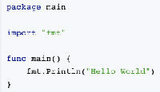
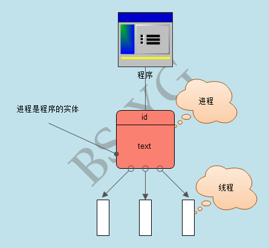
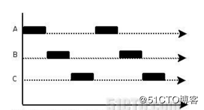
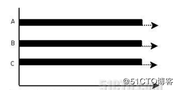

# 进程、程序、线程、多线程、并发、并行详解

 					 				

IT职场小白

0人评论

3095人阅读

2018-09-21 00:38:38

​       本人初入golang开发方向，目前刚入门。在代码开发过程中，需要提前了解一下进程、线程、多线程、并发、并行等专业知识的概念。

​       首先，并行与并发都是程序多线程处理场景，因此，一旦提到并行与并发，那首先想到的是多线程。

​        那么说到多线程，首先要了解一下什么是进程，什么是线程？

### 进程

​       狭义理解就是操作系统中一段程序的执行过程。那么广义上，进程是指一个具有一定独立功能的程序操作系统中关于某个数据集合进行的一次运行活动。是操作系统程序动态执行的基本单元。在传统的操作系统中，进程既是一个操作系统的基本分配单元，也是操作系统的基本执行单元。

​      1、首先，进程是一个实体，每一个进程都有自己对应的系统分配的内存地址，一般情况下，包括文本区域（text region）、数据区域（data region）和堆栈（stack region）。文本区域存储处理器执行的代码；数据区域存储变量和进程执行期间使用的动态分配的内存；堆栈区域存储着活动过程调用的指令和本地变量；

​     2、进程可以理解为一个正在执行的程序，程序是一个静态的没有生命体征的实体，而经过操作系统处理对其赋予生命时(即调用程序执行操作)，这个程序才可以变为一个活动的、有生命体征的实体，即进程。

​     3、进程共有三种状态：就绪、阻塞和运行。

​        （1）、就绪态：就绪状态是指程序已达到可以运行的状态，只等CPU分配资源就可以运行的状态。

​        （2）、阻塞态：当程序运行条件没有满足时，需要等待条件满足时候才能执行时所处的状态，如等待i/o操作时候，此刻的状态就叫阻塞态。

​        （3）、运行态：进程占用CPU，并在CPU上运行。即程序正在运行时所处的状态。

​        

​        进程状态转换在此处不在赘述，请看下一篇文章。

###	**程序**

​    程序是指系统指令和数据的有序集合，是一个静态的实体，不存在运行状态的概念。

​    进程与程序的概念：

​    1、进程是程序运行所处的状态实体名称，是一个动态概念。

​    2、进程包含程序，进程的执行离不开程序，二进程的文本区域就是代码区，即程序存储的区域。

### **线程**

​    线程是进程中执行运算的最小单元，是操作系统执行处理机制的基本单位。每个进程至少有一个线程，线程可以利用进程所拥有的资源执行调度和运算。

​      在引入线程的操作系统中，通常都是把进程作为分配资源的基本单位，而把线程作为独立运行和独立调度的基本单位，线程可以在一个进程中进行切换，占用资源开销小，能更高效的提高系统多个程序间并发执行的程度。

​      线程既可以有操作系统内核控制调度，也可以由用户程序控制调度。

### **进程与线程的对比**

​    1、进程是操作系统资源分配的基本单位，所有与该进程有关的资源，均会被记录在进程控制块PCB中，以表示该进程所拥有的资源。同一进程下的所有线程共享该进程下的所有资源。

​    2、线程是分配处理机的基本单位，与系统资源分配无关。事实上，正在在处理机上运行的是线程，并非进程。

​    3、一个线程只能属于一个进程，而一个进程可以有多个线程，但至少有一个线程。

​    4、线程在执行的时候需要协作同步，不同进程的线程间要利用消息通信方法实现同步。

### **进程与线程的关系**

​    1、进程将CPU资源分给线程，即真正在CPU上运行的是线程。

​    2、操作资源分配给进程，同一进程的所有线程共享该进程的所有资源。

### **多进程**

​    在同一个时间里，同一个计算机系统中如果允许两个或两个以上的进程处于运行状态，这便是多任务（多进程）。现代的操作系统几乎都是多进程操作系统，能够同时管理多个进程的运行。   多进程带来的好处是明显的。但是多进程对于系统的资源要求甚高，资源浪费也比较严重。应用多进程场景最多的是windows系统，例如同时打开运行软件，每个软件打开相当于运行一个进程。

### **多线程**

   在一段完整的代码中，往往会有需要独立的代码模块，而这些独立运行的程序片段叫作“线程”（Thread），利用多个线程编程的概念就叫作多线程处理(多线程编程)，多线程是为了同步完成多项任务，不是为了提高运行效率，而是为了提高资源使用效率来提高系统的效率。多线程是在程序在同一时间需要完成多项任务的时候实现的。多线程的目的仅仅是为了提高资源利用效率。各个线程执行自己的任务，这些线程可以”同时进行“。同时进行并非同一时刻进行，而是在某一时间段内，完成所有任务，任务的运行有先后顺序。

### **并发**

​    

​     并发的实质是一个物理CPU(也可以多个物理CPU) 在若干道程序（或线程）之间多路复用，并发性是对有限物理资源强制行使多用户共享以提高效率。

​     微观角度：所有的并发处理都有排队等候，唤醒，执行等这样的步骤，在微观上他们都是序列被处理的，如果是同一时刻到达的请求（或线程）也会根据优先级的不同，而先后进入队列排队等候执行。

​     宏观角度：多个几乎同时到达的请求（或线程）在宏观上看就像是同时在被处理。

​    并发就是只有一个CPU资源，程序（或线程）之间要竞争得到执行机会。图中的第一个阶段，在A执行的过程中B，C不会执行，因为这段时间内这个CPU资源被A竞争到了，同理，第二个阶段只有B在执行，第三个阶段只有C在执行。其实，并发过程中，A，B，C并不是同时在进行的（微观角度）。但又是同时进行的（宏观角度）。

### **并行**

​    

​    并行指两个或两个以上事件（或线程）在同一时刻发生，是真正意义上的不同事件或线程在同一时刻，在不同CPU资源上（多核），同时执行。

​    并行，不存在像并发那样竞争CPU资源，等待执行的概念，因为并行状态下的线程分布在不同的CPU上。

​    图中，A，B，C都在同时运行（微观，宏观）。

### **通过多线程实现并发，并行**

​    1、在CPU比较繁忙，资源不足的时候（开启了很多进程），操作系统只为一个含有多线程的进程分配仅有的CPU资源，这些线程就会为自己尽量多抢时间片，这就是通过多线程实现并发，线程之间会竞争CPU资源争取执行机会。

   2、 在CPU资源比较充足的时候，一个进程内的多线程，可以被分配到不同的CPU资源，这就是通过多线程实现并行。

   3、至于多线程实现的是并发还是并行？上面所说，所写多线程可能被分配到一个CPU内核中执行，也可能被分配到不同CPU执行，分配过程是操作系统所为，不可人为控制。所有，如果有人问我我所写的多线程是并发还是并行的？我会说，都有可能。

   4、不管并发还是并行，都提高了程序对CPU资源的利用率，最大限度地利用CPU资源。并行详解