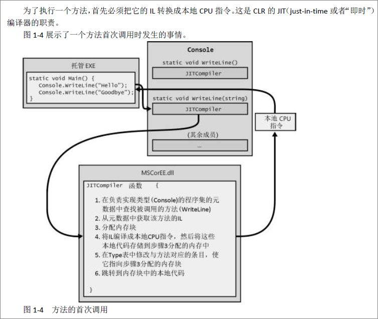
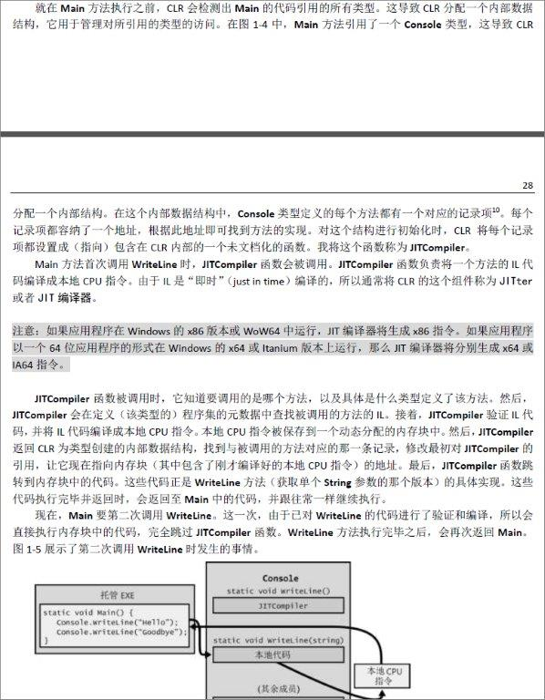
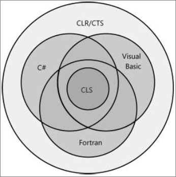
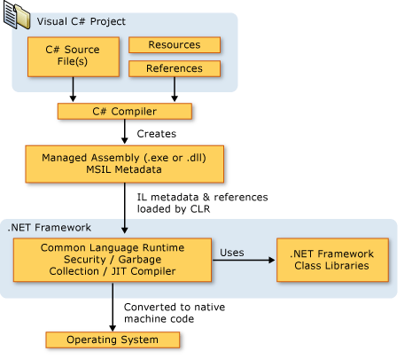

# 	[CLR via C#深解笔记一 - CLR & C# 基础概念](https://www.cnblogs.com/Dlonghow/p/5071753.html)

随笔分类 - [.NET & FCL](https://www.cnblogs.com/Dlonghow/category/164213.html)

随笔分类 - [CLR & C#](https://www.cnblogs.com/Dlonghow/category/142819.html)

写在前言

 

.Net Framework并不是Win 32 API 和COM上的一个抽象层。

 

某种程度上，它是自己的操作系统，有自己的内存管理器，自己的安全系统，自己的文件加载器，自己的错误处理机制，自己的应用程序隔离边界（AppDomains），自己的线程处理模型等。

随着多核计算机越来越普遍，线程处理，并发执行，并行结构，同步等方面的重要性日益凸显。

 

**CLR的执行模型**

 

**公共语言运行时** CLR Common Language Runtime

是一个运行时环境，保证应用和底层操作系统之间必要的分离，是.NET  Framework的主要执行引擎。是可由面向CLR的多种编程语言使用的“运行时”。CLR的核心功能（内存管理、程序集加载、安全性、异常处理和线程同步等）由面向CLR的所有语言使用。CLR不关心开发人员使用哪一种语言来写源代码。也就是说挑选编程语言时，应该选择最容易表达自己意图的语言。理论上，可以用任何语言编写代码，只要**编译器**是面向CLR的就可以了。

 

**编译器**

可以视为语法检查器和“正确代码”的分析器。它们检查源代码，确定你写的一切都有意义，然后输出对你的意图进行描述的代码。不同的编程语言，有着不同的语法。不要低估这个选择的价值，也许会节省大量的开发时间。

Microsoft已经创建好几个面向“运行时”的语言编译器，包括：C++/CLI、C# (C sharp)、Visual  Basic、F#、Iron Python、Iron Ruby以及一个“中间语言”（Intermediate Language, IL）汇编器。

 

**IL代码 （托管代码）**

本地代码编译器是面向特定CPU架构的代码。而每个面向CLR的编译器生成的都是**IL****代码** **（中间语言****代码** **）**。IL代码有时称为**托管代码**，因为CLR要管理它的执行。它明显的优势在于它是CPU无关的。

 

**元数据**

IL代码由面向CLR的编译器产生，但它并不是编译器产生的提供给运行时仅有的东西。编译器同样产生有关原始代码的元数据。它提供给CLR关于代码更多的东西，例如：各种类型的定义、各种类型成员的签名以及其他数据。基本上，元数据是类型库、注册表内容和其它用于COM的信息。尽管如此，元数据还是直接和执行代码合并在一起，并不处在  隔离的位置。

简单地说，元数据是整个microsoft .net framework开发平台的关键，它实现了编程语言、类型和对象的无缝集成。

 

**程序集 （assembly）**

一个抽象的概念。首先，他是一个或多个模块/资源文件的逻辑性分组。其次，程序集是重用、安全性以及版本控制的最小单元。取决于你对编译器或者工具的选择，即可以生成单文件程序集，也可以生成多文件程序集。在CLR的世界中，程序集相当于一个“组件”。利用“程序集”这个概念性的东西，可以将一组文件当成一个单独的实体来对待。

对于一个可重用的、可保护的、可版本控制的组件，程序集把它的逻辑表示和物理表示分开。具体如何将代码和资源划分到不同的文件中，完全取决于个人。程序集的模块中，还包含与引用的程序集有关的信息。这些信息使程序集能够自描述（self-describing）。换句话说，CLR能够判断出为了执行程序集中代码，程序集的直接依赖对象（immediate  dependency）是什么。

.png)

 

托管程序集同时包含**元数据**和**IL**。IL是与CPU无关的机器语言，是Microsoft在请教了外面的几个商业及学术性语言/编译器的作者之后，费劲心思开发出来的。IL比大多数CPU机器语言都要高级。IL能访问和操作对象类型，并提供了指令来创建和初始化对象，调用对象上的虚方法以及直接操作数据元素。甚至可以提供抛出和捕捉异常的指令来实现错误处理。可将**IL视为一种面向对象的机器语言**。

 

**重要的提示:**

允许在不同编程语言之间方便地切换，同时又保持紧密集成，这事CLR的一个非常出色的特性。遗憾的是，许多开发人员都忽视了这一特性。例如，C#和Visual   Basic等语言能很多地执行I/O操作，APL语言能很好地执行高级工程或者金融计算。通过CLR，应用程序的I/O部分可用C#编写，工程计算部分则换用APL编写。CLR在这些语言之间提供了其他技术无法媲美的集成度，使“混合语言编程”成为许多开发项目的一个值得慎重考虑的选择。

 

执行一个方法，首先必须把它的IL转换成本地CPU指令，这是CLR的JIT  （just-in-time或者“即时”）编译器的职责。JITCompiler 是CLR的一个组件，称为JITer  或者JIT编译器。它在定义（某一个类型）程序集的元数据中查找被调用的方位的IL,  接着验证IL代码，并将IL代码编译成本地CPU指令。本地CPU指令被保存到一个动态分配的内存块中。

 

 

 

一个方法只有在首次调用时才会造成一些性能损失。以后对该方法的所有调用都以本地代码的形式全速运行，无需重新验证IL并把它编译成本地代码。

 

JIT编译器将本地CPU指令存储到动态内存中，一旦应用程序终止，编译好的代码也会被丢弃。所以，如果将来再次运行应用程序，或者同时启动应用程序的两个实例（使用两个不同的操作系统进程），JIT编译器必须再次将IL编译成本地指令。

对于大多数应用程序来说，因JIT编译器造成的性能损失并不显著。大多数应用程序都会反复调用相同的方法。在应用程序运行期间，这些方法只会对性能造成一次性的影响。另外，在方法内部花费的时间很有可能比花在调用方法上的时间多得多。

 

 

**还需要特别注意的是:**

CLR的JIT编译器会对代码进行优化，这类似于非托管的C++编译器的后端所做的工作。同样地，可能花费较多的时间来生成优化的代码。优化之后的代码将获得更加出色的性能。

非托管的饭吗是针对一种具体的CPU平台编译的，一旦调用，代码直接就能执行。但是在托管环境中，代码的编译是分成两个阶段完成的。首先，编译器遍历源代码，做尽可能多的工作来生成IL代码，而为了真正的执行调用，这些IL代码本身必须在运行时编译成本地CPU指令，这需要分配更多的内存，并需要花费额外的CPU的时间。实践确实表明，运行时发生的第二个编译阶段会影响性能，会分配动态内存。但是，Microsoft进行了大量性能优化的工作，将这些额外的开销保持在最低限度。

 

**IL和验证**

IL是基于栈的。由于IL没有提供操作寄存器的指令，所以人们可以很容易的创建新的语言和编译器，生成面向CLR的代码。

IL指令还是“无类型”（typeless）的。例如，IL提供了一个add指令，它的作用是将压入栈的最后两个操作数加到一起。add指令不分32位和64位版本。

IL的亮点是它对底层CPU的抽象，但这并非它的最大优势。IL提供的最大的优势在于应用程序的健壮性和安全性。将IL编译成本地CPU指令时，CLR会执行一个名为验证（verification）的过程，这个过程会检查高级IL代码，确定代码所做的一切都是安全的。如，验证会核实调用的每个方法多有正确数量的参数，传给每个方法的参数都具有正确的类型，每个方法的返回值都得到了正确的使用，每个方法都具有一个返回语句等等。在托管模块的元数据中，包含了要由验证过程使用的所有方法和类型信息。

 

 

将每个windows进程都放到一个独立的地址空间，将获得健壮性和稳定性，一个进程无法干扰另一个进程。通过验证  托管代码，确保代码不会不正确的访问内存，不会干扰到另一个应用程序的代码。这样一来，就可以放心地将多个托管应用程序放到一个Windoes虚拟地址空间中运行。

CLR提供了在  一个操作系统进程中执行多个托管应用程序的能力。每个托管的应用程序都在一个AppDomain中执行。默认情况下，每个托管的exe文件都在它自己的独立地址空间中运行，这个地址空间只有一个AppDomain。然而，CLR的宿主进程（比如IIS或者MS  SQL Server）  可决定在单个操作系统进程中运行多个AppDomain。

 

**通用类型系统**

CLR是完全围绕类型展开的，这一点到现在为止应该很明显了。类型为应用程序和其他类型公开了功能。通过类型，用一种编程语言写的代码能与另一种语言写的代码沟通。由于类型是CLR的根本，所以Microsoft指定了一个正式的规范，叫做“通用类型系统”（Common  Type System, CTS）,  描述类型定义和行为。利用了CTS指定的规则，程序集为一个类型建立了可视边界，CLR则强制（贯彻）了这些规则。

 

事实上，并不需要去学习CTS规则本省，你选择的语言会采用你熟悉的公式公开它自己的语言语法与类型规则。通过编译来生成程序集时，它会将语言特有的语法映射到IL -- 也就是CLR的“语言”。

 

CLR让我们意识到：“代码的语言”和“代码的行为”。不同语言可以定义系统的类型，添加相同的成员，语法有不同，但是类型的行为都是完全一致的，因为最终由CLR的CTS来定义类型的行为。

 

.png)

 

\--------------------------------------------------------------------

 

 

分类: [.NET & FCL](https://www.cnblogs.com/Dlonghow/category/164213.html),[CLR & C#](https://www.cnblogs.com/Dlonghow/category/142819.html)