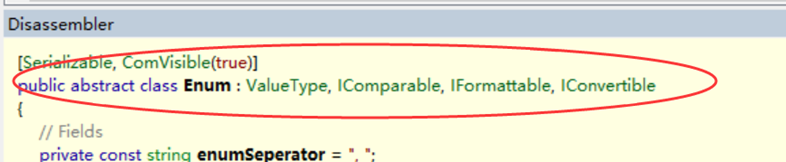

#                   [C# 枚举与位枚举](https://www.cnblogs.com/chenyao-1424433719/p/11213658.html)              


一、枚举的概念：

　　C# 枚举（Enum）, 枚举类型是用于声明一组命名的常数的基本数据类型（值类型）；

二、枚举的定义：

　　声明enum变量：　

```
  enum <enum_name> {enumeration list};
```

　　其中enum_name 指定枚举的类型名称；  enumeration list 是一个用逗号分隔的标识符列表；

　　枚举列表中的每个符号代表一个整数值，一个比他前面的符号大的整数值。默认情况下，第一个枚举符号的值是0.例如：

 

```
　enum Days {Sun , Mon, tue, Fir, sat };
```

 三、枚举的案例，枚举变量的用法：

[](javascript:void(0);)

```
using System;
namespace EnumApplication
{
    class EnumProgram
    {
          enum Days { Sun, Mon, tue, Wed, thu, Fri, sat };
          
          static void Main(string[] args)
          {
                int WeekdayStart = (int)Days.Mon;
                int WeekdayEnd = (int)Days.Fir;
                Console.WriteLine("Monday：{0}",WeekdayStart);  
                Console.WriteLine("Firday：{0}",WeekdayEnd );  
                Console.ReadKey();
          }    
    }
}
```

[](javascript:void(0);)

四、Enum类：

　　所有枚举类型都隐式地继承System.Enum 类型， System.Enum 类型是继承自System.ValueType类型唯一不为值类型的引用类型；

　　

五、Enum 类：

　　　　方法：   　　    名称：

　　1、CompareTo ：将此实例与指定对象进行比较并返回一个对二者的相对值的指示；

　　2、Equals：指示此实例是否等于指定的对象；

　　3、Format：根据指定格式将指定枚举类型的指定值转换为其等效的字符串表示形式；

　　4、GetName：在指定枚举中检索具有指定值的常数的名称；

　　5、GetNames：检索指定枚举中常数名称的数组；

　　6、GetTypeCode：返回此实例的基础TypeCode;

　　7、GetUnderlyingTye：返回指定枚举的基础类型；

　　8、GetValues：指定枚举中常数值的数组；

　　9、HasFlag：确定当前实例中是否设置了一个或多个位域；

　　10、IsDefined：返回指定枚举中是否存在具有指定值的常数的指示；

　　11、Parse：将一个或多个枚举常数的名称或数字值得字符串表示转换成等效得枚举对象，一个参数指定该操作是否不区分大小写；

　　12、TryParse：将一个或多个枚举常数得名称或数字值得字符串表示转换成等效得枚举对象，用于指示转换是否成功得返回值；

六、标志枚举/位枚举：

　　C# 标记枚举（Flags)：枚举类型是用于声明一组命名得常数得基本类型数据（值类型）。

　　枚举值是互斥得。而位标记集合是一种由组合出现得元素形成得列表，通常设计为以“位或”运算组合新值；

　　枚举类型则通常表达一种语义相对独立得数值集合。而以枚举类型来实现位标记集合是最完美得组合，简称位枚举。

七、位枚举得定义：　　

[](javascript:void(0);)

```
　　///<summary>
　　/// 权限枚举
　　///</summary>
　　[Flags]
　　public enum permission　　　　　　　　　　　　　　　　　　　　 注意加了[Flags]特性后有三种写法，
　　{　　　　　　　　　　　　　　　　　　　　　　　　　　　　　　　　　 一种是使用<<符号，
  　　  Unknown = 0; // 也可以写成0x00或0　　　　　　　　　　　　　第二种是0x01,　　　　　　　　　　　　　　　　
　　　　　　　　　　　　　　　　　　　　　　　　　　　　　　　　　　　　还有一种是直接写0，1，2，4，8....，
   　　 Create = 1<<0, // 0x01或1　　　　　　　　　　　　　　　　　一般来说是2的n次方来表示。　　
　　　　　　　　　　　　　　　　　　　　　　　　　　　　　　　　　　　  注：<<左操作符，表示对这个数进行移位。
    　　Read = 1<<1,  //0x02或2

   　　 Update = 1<<2, //0x04或4

   　　 Delete = 1<<3  //0x08或8
　　}        
```

[](javascript:void(0);)

八、位枚举的实例：

 

[](javascript:void(0);)

```csharp
//1、给用户创建、读取，修改和删除的权限
var parmission = Permission.Create | parmission.Read | parmission.Update | parmission.Delete;

//2、去掉用户的修改和删除权限
parmission = parmission &~parmission.Update;
parmission = parmission &~parmission.Delete;

//3、给用户加上修改的权限
parmission = parmission | parmission.Update;

//4、判断用户是否有创建的权限
var isCreate = (parmission & parmission.Create)!=0;
//或者
var isCreate = (parmission & parmission.Create)==parmission.Create;
```

　　这时parmission枚举的值将变成0+1+4=5，它的ToSting()将变成“parmission.Create，

　　parmission.Read”,parmission.Update; 这里我们可以解释为什么第五个值Delete是8而不能成为5。

　　也就是说它的值不应该是前几项值的复合值。一个比较简单的方法

　　就是用2的n次方来依次位每一项赋值，例如：1，2，4，8，16，32，64.......。

[](javascript:void(0);)