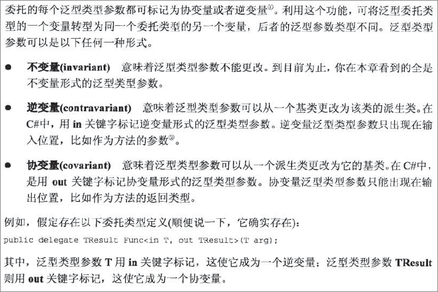

面向对象编程一个好处就是“代码重用”，极大提高了开发效率。如是，可以派生出一个类，让它继承基类的所有能力，派生类只需要重写虚方法，或添加一些新的方法，就可以定制派生类的行为，使之满足开发人员的需求。

**泛型**（generic）是CLR和编程语言提供的一种特殊机制，它支持另一种形式的代码重用，即“算法重用”。

 

# [C# 参考：泛型(1) -- 泛型简介与泛型问题陈述](https://www.cnblogs.com/Dlonghow/archive/2008/07/10/1240228.html)

# [C# 参考：泛型(2) -- 什么是泛型？ 泛型实现？ 泛型的好处？](https://www.cnblogs.com/Dlonghow/archive/2008/07/11/1240473.html)

**泛型的好处：**
    .NET 
中的泛型使您可以重用代码以及在实现它时付出的努力。类型和内部数据可以在不导致代码膨胀的情况下更改，而不管您使用的是值类型还是引用类型。您可以一次性地开发、测试和部署代码，通过任何类型（包括将来的类型）来重用它，并且全部具有编译器支持和类型安全。因为一般代码不会强行对值类型进行装箱和取消装箱，或者对引用类型进行向下强制类型转换，所以性能得到显著提高。对于值类型，性能通常会提高
200%；对于引用类型，在访问该类型时，可以预期性能最多提高 
100%（当然，整个应用程序的性能可能会提高，也可能不会提高）。本文随附的源代码包含一个微型基准应用程序，它在紧密循环中执行堆栈。该应用程序使您可以在基于
Object 的堆栈和一般堆栈上试验值类型和引用类型，以及更改循环迭代的次数以查看泛型对性能产生的影响。 

# [C# 参考：泛型(3) -- 应用泛型](https://www.cnblogs.com/Dlonghow/archive/2008/07/11/1240507.html)

简单地说，开发人员先定义好一个算法，比如排序、搜索、交换、比较或转换等。但是，定义算法的开发人员并不设定该算法要操作什么数据类型；该算法可以广泛地应用于不同类型的对象。然后，另一个开发人员只要指定了算法要操作的具体数据类型，就可以使用这个现成的算法了。例如，可用一个排序算法来操作Int32和String等类型的对象，或用一个比较算法来操作DateTime和Version等类型的对象。大多数算法都封装在一个类型中，CLR允许创建泛型引用类型和泛型值类型，但不允许创建泛型枚举类型。还允许创建泛型接口和泛型委托。

 

泛型为开发人员提供了一下优势：

\#1，源代码保护。

\#2，类型安全。编译器和CLR能理解开发人员的意图，并保证只有与指定数据类型兼容的对象才能随同算法使用。

\#3，更加清晰的代码。减少了源代码中必须进行的转型次数，代码更容易编写和维护。

\#4，更佳的性能。创建泛型算法来操作一种具体的值类型，所以值类型的实例能够以传值方式传递，CLR不再需要执行任何装箱操作。ArrayList来操作值类型（如Int32），会造成大量装箱操作，大量的垃圾回收。

泛型最明显的应用就是集合类。FCL已经定义了几个泛型集合类，其中，大多数类都在System.Collections.Generic 和System.Collections.ObjectModel命名空间中。

 

**泛型基础结构**

开发类型和封闭类型

我们关注CLR如何为应用程序使用的每个类型创建一个怎样的内部数据结构，这种数据结构称为类型对象（type  object）。具有泛型类型参数的类型仍然是类型，CLR同样会为它创建一个内部类型对象。无论引用类型（类）、值类型（结构）、接口类型，还是委托类型，这一点都成立。具有泛型类型参数的类型称为**开放类型**（open type）, CLR禁止构造开发类型的任何实例，类似CLR禁止构造接口类型的实例， 如List<>。

 

代码引用一个泛型类型时，可指定一组泛型类型实参。假如为所有类型实参传递的都是实际数据类型，类型就称为**封闭类型**（closed  type），CLR允许构造封闭类型的实例，如List<String>  。需要注意的是，CLR会在类型对象内部分配类型的静态字段，因此每个封闭类型都有自己的静态字段。例如，List<T>定义了任何静态字段，都不会在一个List<DateTime>和一个List<String>之间共享：每个封闭类型对象都有它自己的静态字段。假如一个泛型类型定义了一个静态构造器，那么针对每个封闭类型，这个构造器都会执行一次。在泛型类型上定义一个静态构造器的目的是保证传递的类型实参满足特定的条件（约束）。如，希望一个泛型类型只用于处理枚举类型，就可以如下定义：

internal sealed class GenericTypeThatRequiresAnEnum<T> {

​     static GenericTypeThatRequiresAnEnum() {

​          if(!typeof(T).IsEnum) {

​               throw new ArgumentException("T must be an enmuerated type");

​          }

​     }

}

 

CLR提供了一个名为约束的功能，可利用它更好地定义一个泛型类型来支出哪些类型实参是有效的。

 

**代码爆炸**

 

使用泛型类型参数的一个方法在进行JIT编译时，CLR获取方法的IL，用指定的类型实参进行替换，然后创建恰当的本地代码（这些代码是为操作指定数据类型的方法“量身定制”的）。这样做有一个缺点：CLR要为每一种不同的方法/类型组合生成本地代码。这个现象称为**代码爆炸**（code explosion）。它可能造成应用程序的工作集显著增大，从而损害性能。

 

CLR其实内建了一些优化措施，能够缓解代码爆炸。假如为一个特定的类型实参调用一个方法，以后再次使用相同的类型实参来调用这个方法。CLR只会为这个方法/类型组合编译一次代码。如果一个程序集使用List<DateTime>,  一个完全不同的程序集（加载到一个AppDomain中）也使用List<DateTime>,  CLR只会为List<DateTime>编译一次方法。这样显著缓解了代码爆炸。

CLR还提供了另一个优化措施，它认为所有引用类型实参都是完全相同的，所以代码可以共享。如，CLR为List<String>的方法编译的代码可直接用于List<Stream>的方法，因为String和Stream均为引用类型。事实上，对于任何引用类型，都会使用相同的代码。CLR之所以能执行这个优化，是因为所有引用类型的实参或变量实际只是指向堆上的对象的指针，而对象指针全部是以相同的方式来操作的。

但是，某个类型实参是值类型，CLR就必须专门为这个值类型生成本地代码，因为值类型的大小不定，还可能要用不同的本地CPU指令来操纵这些值。

 

**委托和接口的逆变和协变泛型类型实参**

 

.png)

 