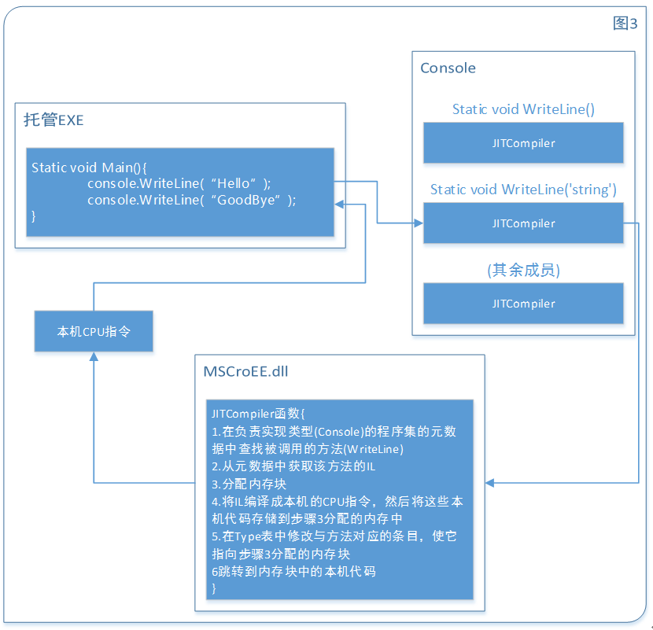

# CLR via C#》学习笔记【1】

​                                                   2016年05月05日 20:11:17           [just0kk](https://me.csdn.net/just0kk)           阅读数：2525                                                                  

​                   

​                      版权声明：本文为博主原创文章~转载请注明出处http://blog.csdn.net/just0kk           https://blog.csdn.net/just0kk/article/details/51325898        

# 一、CLR的执行模块

## 1.1 将源代码编译成托管模块

> 非托管C/C++可对系统进行低级控制，按自己的想法管理内存、VB可以快速生成UI应用程序，并控制COM对象和数据库。

公共语言运行时(Common Language Runtime, CLR)是一个由多种编程语言使用的“运行时”。CLR的核心功能（如内存管理、程序集加载、安全性、异常处理和线程同步）可由面向CLR的所有语言使用。 
 事实上在运行时，CLR根本不关心开发人员用哪一种语言写源代码，这意味着在选择编程语言时，应选择最容易表达自己意图的语言。 
 面向CLR的语言编译器：C++/CLI、C#、VB、F#、Iron Python、Iron  Ruby以及一个“中间语言”(Intermediate Language,  IL)汇编器。除了Microsoft，另一些公司、大学和学院也创建了自己的编译器，也能向CLR生成代码。例如：Ada, APL, Caml,  COBOL, Eiffel, Forth, Fortran, Haskell, Lexico, Lisp, LOGO, Lua,  Mercury, ML, Mondrian, Oberon, Pascal, Perl, PHP, Prolog, RPG, Scheme,  Smalltalk, Tcl/Tk 
 无论选择哪个编译器，结果都是**托管模块**(Managed Module)。它们都**需要CLR才能执行**。

#### 表1 托管模块各个部分

| 组成部分      | 说明                                                         |
| ------------- | ------------------------------------------------------------ |
| PE32或PE32+头 | 标识了文件类型，包括GUI、CUI或者DLL；包含时间标记，如果包含本机CPU代码的模块，会包含本机CPU代码有关的信息 |
| CLR头         | 头中包含要求的CLR版本，一些标志(Flag)，托管模块入口方法的MethodDef元数据Token以及模块的元数据、资源、强名称、一些标识以及其他不太重要的数据项的位置及大小 |
| 元数据        | 主要有两种表：描述源代码中定义的类型和成员，描述源代码引用的类型和成员 |
| IL代码        | 编译器编译源代码时生成的代码，在运行时，CLR将IL编译成本机的CPU指令 |

IL代码有时被称为“**托管代码**(Maneged Code)”，因为CLR管理它的执行。

### 1.1-1 元数据：

面向CLR的编译器要在每个托管模块中生成完整的**元数据**(metadata)。一些数据表描述了模块中定义了什么（比如类型以及其成员），另一些描述了模块引用了什么（比如导入的类型及其成员）元数据是一些老技术的超集，这些老技术包括COM的“类型库”(Type  Library)和“接口定义语言”(Interface Definition Language, IDL)文件，但CLR元数据远比他们全面。 
 元数据有多种用途，下面仅举例一部分

- 避免了编译时对原生C/C++头和库文件的需求，编译器直接从托管模块读取元数据。
- “**智能感知**”(IntelliSense)技术会解析元数据，告诉你一个类型提供了哪些方法、属性、事件和字段、乃至方法需要的参数。
- CLR的代码验证过程使用元数据确保代码只执行“类型安全”的操作。
- 元数据允许将对象的字段序列化到内存块，将其发送给另一台机器，然后反序列化，在远程机器上重建对象状态。
- 元数据允许垃圾回收器跟踪对象生存期。垃圾回收器能够判断任何对象的类型，并从源数据知道那个对象中的那些字段引用了其他对象。

为了执行包含托管代码以及/或者托管数据的模块，最终用户必须在自己的计算机上安装好CLR（目前作为.NET Framework的一部分提供）。这类似于为了运行MFC或者VB6.0应用程序，用户必须安装MFC库或者VB DLL。

### 1.1-2 C++/CLI：

Microsoft  C++编译器默认生成包含非托管代码的EXE/DLL模块，并在运行时操纵非托管数据(native内存)。这些模块不需要CLR即可执行。通过指定/CLR命令行开关，C++编译器就能生成包含托管代码的模块。在前面提到的所有Microsoft编译器中，C++编译器是独一无二的，只有它才允许开发人员同时写非托管代码和托管代码，并生成到同一个模块中。他也是唯一允许开发人员在源代码中同时定义托管和非托管数据类型的Microsoft编译器。

## 1.2 将托管模块合并成程序集

CLR实际不和模块工作，他和程序集工作。**程序集**(Assembly)是一个抽象概念。首先程序集是一个或多个模块/资源文件的逻辑性分组。其次，程序集是重用、安全性以及版本控制的最小单元。取决于你所选择的编译器或工具，即可生成单文件程序集也可生成多文件程序集。在CLR的世界中，程序集相当于“组件”。

 
 图1有助于理解程序集，图中一些托管模块和资源（或数据）文件准备交由一个工具处理。工具生成代表文件逻辑分组的一个PE32(+)文件。这个PE32(+)文件包含一个名为**清单**(manifest)的数据模块。清单也是元数据表的集合。这些表描述了构成程序集的文件、程序集中的文件所实现的公开导出的类型①

以及与程序及关联的资源或数据文件。

> ①译者注：所谓公开导出的类型，就是程序集中定义的Public类型，它们在程序集内部外部均可见

C#编译器生成的是含有清单的托管模块。对于只有一个托管模块而没有资源或数据文件的项目，程序集就是托管模块，生成过程中无需执行额外步骤，但是如果希望将一组文件合并到程序集中，就必须掌握更多的工具（比如程序集链接器AL.exe）以及其他命令行选项。 
 在程序集的模块中，还包含与引用的程序集有关的信息（包括他们的版本号）。这些信息使程序既能够**自描述**(self-describing)。CLR能判断为了执行程序集中的代码，程序集的**直接依赖对象**(Immediate dependency)是什么。相比COM而言不需要注册表或[Active Directory Domain Services(ADDS)](http://serverfault.com/questions/402580/what-is-active-directory-domain-services-and-how-does-it-work)

## 1.3 加载公共语言运行时

C#编译器提供了一个/platform命令行开关选项，这个开关允许指定最终生成的程序集只能运行在32位Windows版本的x86的机器上使用。或者在32位windows   RT的ARM机器上使用，不指定具体平台的话，默认选项就是anycpu。VS用户想要设置目标平台，可以打开项目的属性页，从“生成”选项卡的“目标平台”列表选择一个选项，如图2  
   
 取决于/platform开关选项，C#编译器生成的程序集包含的要么是PE32头，要么是PE32+头。PE32文件在32位或64位地址空间中均可运行，PE32+文件则需要64位地址空间。Windows的64位版本通过WoW64(Windows  on Windows64)技术运行32位windows应用程序。

#### 表2 /plantform开关选项对生成的模块的影响以及在运行时的影响

| /plantform开关         | 生成的托管模块   | X86 Windows          | X64 Windows             | ARM Windows RT       |
| ---------------------- | ---------------- | -------------------- | ----------------------- | -------------------- |
| anycpu(默认)           | PE32/任意cpu架构 | 作为32位应用程序运行 | 作为64位应用程序运行    | 作为32位应用程序运行 |
| Anycpu 32bit preferred | PE32/任意cpu架构 | 作为32位应用程序运行 | 作为WoW64位应用程序运行 | 作为32位应用程序运行 |
| X86                    | PE32/x86         | 作为32位应用程序运行 | 作为WoW64应用程序运行   | 不运行               |
| X64                    | PE32+/x64        | 不运行               | 作为64位应用程序运行    | 不运行               |
| ARM                    | PE32/ARM         | 不运行               | 不运行                  | 作为32位应用程序运行 |

Windows检查EXE文件头，决定进程为64或32位后，加载相应的MSCroEE.dll文件，然后进程的主线程调用该dll中的一个方法。这个方法初始化CLR，加载EXE程序集，在调用其入口方法(Main)。 
 如果非托管程序调用LoadLibrary加载托管程序集，Windows会自动加载并初始化CLR，以处理程序集中的代码，但由于此时进程已经启动并运行，则**可能影响程序集可用性**，如：64位进程无法加载使用/plantform:x86开关编译的托管程序集，但该托管程序集确实可以在64位内存空间中以WoW64方式运行。

## 1.4 执行程序集的代码

IL是与CPU无关的机器语言，IL比大多数CPU语言都高级，IL也能使用汇编语言编写，Microsoft甚至专门提供了名为ILAsm.exe的IL汇编器和名为IDLasm.exe的IL反汇编器。 
 高级语言通常**只公开了CLR全部功能的一个子集**，IL汇编语言允许开发人员访问CLR的全部功能。

### 1.4-1 JIT(just-in-time 运行时编译技术)：

为了执行方法，首先必须将方法的IL转换成本机(natice)CPU指令。这是CLR的JIT编译器的职责。 
 

在Main方法执行之前，CLR会检测出Main的代码引用的所有类型。这导致CLR分配一个内部数据结构来管理对引用类型的访问。如图3，Main方法引用了一个Console类型，在这个内部数据结构中，Console类型定义每个方法都有一个对应的**记录项**(entry)。每一个记录项都有一个地址。这个地址最初指向JITCompiler，因此**在Main首次调用WriteLine()方法时，JITCompiler会被调用**并将该方法的IL代码编译成本机的CPU指令，随后本机CPU指令会被保存到动态分配的内存块中，然后JITCompiler回到Console结构中，修改最初对JITConpiler的引用，并使其指向刚刚开辟的内存块。 
 现在，**Main要第二次调用WriteLine时，就会直接调用之前由JITCompiler生成的本机CPU代码**，直到进程终止释放该内存块。 
 

JIT将本机CPU指令保存到动态内存中，这意味着一旦应用程序终止，编译好的代码也会被丢弃，因此再次运行应用程序，**或者同时启动应用程序的两个实例**，JIT编译器都必须再次执行编译。 
 另一方面JIT会对本机代码进行优化，可能花较多时间生成优化代码，但和没有优化时相比，代码优化后性能更佳。

| 编译器开关设置                     | C# LI代码质量 | JIT本机代码质量 |
| ---------------------------------- | ------------- | --------------- |
| /optimize-/debug-                  | 未优化        | 经优化          |
| /optimize-/debug(+/full/pdbonly)   | 未优化        | 未优化          |
| /optimize+/debug(-/+/full/pdbonly) | 经优化        | 经优化          |

**/debug:full**开关告诉编译器你打算调试程序，JIT编译器会记录每一条IL指令所生成的本机代码 
 **/debug-**下则使得JIT运行的稍快，并且用的内存也稍少。 
 在Visual Studio中新建C#项目时，”调试“(Debug)配置指定的是**/optimize-/debug:full**，而”发布“(release)配置指定的是**/optimize+/debug:pdbonly**。

> 虽然你可能很难相信，但许多人（包括本书作者）都认为托管应用程序的性能实际上超越了非托管应用程序。

托管应用程序较非托管应用程序的几大优势

1. JIT能够针对本机CPU为IL代码生成指令，以利用本机指定CPU的任何特殊指令进行编译。相反，非托管应用程序通常是针对具有最小功能集合的CPU编译的。
2. JIT编译器能够判断一个特定的测试在它运行的机器上是否总是失败，例如，假定有一个方法包含以下代码

```
if(numberofCPUs>1){
    ...//Do something
}123
```

如果主机只有一个CPU，JIT编译器不会为上述代码生成任何CPU指令。

### 1.4-2 IL和验证

作者认为IL最大的优势在于其产出的应用程序具有出色的健壮性和安全性，将IL编译成本机CPU指令时，CLR执行一个名为**验证**(verification)的过程，确认代码的行为是**安全**的，确认传给每个方法的每个参数都有正确的类型，每个方法的返回值都得到了正确的使用。

### 1.4-3 不安全的代码

MS C#编译器默认生成**安全**(safe)代码，这种代码的安全性可以得到验证。C#也允许开发人员写**不安全**(unsafe)的代码。C#编译器要求包含不安全代码的所有方法都用**unsafe**关键字标记，并使用**/unsafe**编译器开关来编译源代码。

------

（以博主C++转来的浅薄的见识看来，如果可能的话，unsafe代码可能还是单独隔离出来写到C/C++中比较好，一方面感觉C#中的指针操作和内存模型不如C++好用，另一方面可能分开用也方便管理（看着顺心）一些，毕竟微软也提供了很方便的工具，C+/CLI也好，COM访问也好。不知这个想法对不对）（笑）

------

### 1.4-4 IL和知识产权保护

IL反汇编器可以较为轻松的对CLR托管模块进行逆向工程，如果担心分发出去的程序集，可以从第三方厂商购买“混淆器”(obfuscator)实用程序。它能够打乱程序集元数据中的所有私有符号的名称，但它们能提供的保护是有限的。如果觉得混淆器不能提供自己需要的知识产权保护等级，可以考虑在非托管模块中实现你想保密的算法。

## 1.5 本机代码生成器：NGen.exe

NGen.exe能将IL代码便宜成本及代码，使用它的好处主要有以下几点：

- 提高应用程序启动速度：因为代码已经编译成本机代码，运行时不再花费时间便宜。
- 减小应用程序的工具集

同时，它生成的文件也具有以下缺点

- 没有知识产权保护
- NGen生成的文件可能失去同步：当前执行环境与生成文件时有任何特征不匹配，NGen生成的文件将无法使用 
  - CLR版本
  - CPU类型
  - Windows操作系统版本
  - 程序集的标志模块版本ID：重新编译后改变
  - 引用程序集的版本ID：重新编译被引用模块后改变
  - 安全性：包括声明性继承，声明性链接时等
- 较差的执行时性能：NGen无法像JIT编译器那样对执行环境进行许多假定，不能优化地使用特定CPU指令，静态字段只能间接访问，还会到处插入代码调用类构造器，因为它不知道运行时的代码执行顺序。相较于JIT编译的版本，NGen生成的某些应用程序在执行时反而要慢5%左右。

所以使用NGen的时候应当谨慎。

## 1.6 Framework类库

.NET Framework包括Framework类库(Framework Class Library  FCL)。FCL是一组DLL程序集的总称，其中含有数千种类型的定义，Microsoft还公开了其他的库，如：Windows Azure  SDK和DirectX SDK

> Visual Studio允许创建“可移植类库”项目，能用于多种应用程序类型，包括.NET Framework, Silverlight, Windows Phone, Windows Store应用和Xbox 360。

#### 表3 部分常规FCL命名空间

| 命名空间                       | 内容说明                                                   |
| ------------------------------ | ---------------------------------------------------------- |
| System                         | 包含每个应用程序都要用的的所有基本类型                     |
| System.Data                    | 包含用于和数据库通信及处理数据的类型                       |
| System.IO                      | 包含用于执行流I/O以及浏览目录/文件的类型                   |
| System.Net                     | 包含进行低级网络通信，并与一些常用Internet协议协作的的类型 |
| System.Runtime.InteropServices | 包含允许托管代码访问非托管操作系统平台功能的类型           |
| System.Security                | 包含用于保护数据和资源的类型                               |
| System.Text                    | 包含处理各种编码文本的类型                                 |
| System.Threading               | 包含用于异步操作和同步资源访问的类型                       |
| System.Xml                     | 包含用于处理XML架构(XML Schema)和数据的类型                |

## 1.7 通用类型系统

CLR的一切都围绕类型展开，由于类型是CLR的根本，所以Microsoft制订了一个正式的规范来描述类型的定义和行为，这就是“通用类型系统”(Common Type System, CTS)。 
 Microsoft事实上已经将CTS和.NET  Framework的其他组件——包括文件格式、元数据、中间语言以及对底层平台的方位P/invoke——提交给ECMA已完成标准化的工作。最后形成的标准称为“公共语言基础结构”(Common  Language Infrastructure, CLI) 
 我们最好区别对待“代码的语言”和“代码的行为”，使用的语言不通，固然有不同的类型定义语法，但无论使用哪一种语言，类型的行为都完全一致，因为最终是由CLR的CTS来定义类型的行为。 
 下面是另一条CTS规则：所有类型最终必须从预定义的System.Object类型继承。该类型允许做下面这些事情：

```
namespace testspace
{
class test
{
    void testfun()
    {
        object obj = 0, tar = 0;
        if (obj.Equals(tar)) ;                        //比较两个实例的相等性
        int hash = obj.GetHashCode();                 //获取实例的哈希码
        obj.GetType();                                //查询一个实例的真正类型
        object other = this.MemberwiseClone();        //执行实例的浅(按位/bitwise)拷贝
        string str = obj.ToString();                  //获取实例对象当前状态的字符串表示
    }
}
}
123456789101112131415
```

## 1.8公共语言规范

不同语言创建的对象可以通过COM互相通信。CLR则集成了所有语言，用一种语言创建对象在另一种语言中也具有完全一致的行为和特征。 
 语言集成是一件非常棘手的事情，要创建很容易从不同语言访问的类型，只能从各个语言中挑选其他语言都支持的功能。Microsoft定义了“公共语言规范”(Common  Language Specification  CLS)，它详细定义了一个最小功能集。任何编译器只有支持这个功能集，生成的类型才能兼由其他符合CLS、面向CLR的语言生成的组件。 
 CLR/CTS支持的功能比CLS定义的多得多。具体的说，如果是开放式（对外可见）的类型，就必须遵守CLS定义的规则。但如果是封闭式的，或者说只需要在某一程序集内部访问，CLS规则就不再适用。 
 

关于符合CLS的类型，以下给出原书中的示例代码以作补充：

```
using System

//告诉编译器检查CLS相容性
[assembly:CLSCompliant(true)]

namespace SomeLibrary
{
    //因为是public类，所以会显示警告
    public sealed class SomeLibrarytype
    {
        //警告：SomeLibrary.SomeLibraryType.Abc()的返回类型不符合CLS
        public UInt32 Abc(){return 0;}

        //警告：仅大小写不同的标识符SomeLibrary.SomeLibraryType.abc()不符合CLS
        public void abc(){ }

        //不显示警告：该方法是私有的
        private UInt32 ABC(){return 0;}
    }
}1234567891011121314151617181920
```

第一个警告是因为Abc方法返回了无符号整数，一些语言是不能操作无符号整数值的 
 第二个警告是因为该类型公开了两个public方法，这两个方法只是大小写和返回类型有别，VB和其他一些语言无法区分这两个方法。

## 1.9 与非托管代码的互操作性

- 托管代码能调用DLL中的非托管函数：托管代码通过P/invoke机制调用DLL中的函数
- 托管代码可以使用现有的COM组件：详情可参考.NET Framework SDK提供的TlbImp.exe
- 非托管代码可以使用托管类型：可用C#创建ActiveX控件或Shell扩展。详情可以参考.NET Framework SDK提供的TlbExp.exe和RegAsm.exe工具。

Microsoft随同Windows 8引入了称为Windows Runtime(WinRT)的新Windows  API。该API内部通过COM组件来实现。但通过.NET  Framework团队创建的元数据ECMA标准描述其API，好处是用一种.NET语言写的代码能与WinRT  API无缝对接。第25章将对此详细叙述。


#	二、生成、打包、部署和管理应用程序及类型

2.1 .NET Framework部署目标

Windows多年来一直因为不稳定和过于复杂而口碑不佳。存在所谓”DLL hell“、安装的复杂性等繁琐的问题，而.NET Framework 正在尝试彻底解决DLL hell的问题，也在很大程度上解决了应用程序状态在用户硬盘中四处分散的问题。 >和COM不同，类型不再需要注册表中的设置。……像Microsoft SQL Server这样的宿主应用程序只能将少许权限授予代码，而本地安装的（自寄宿）应用程序可获得完全信任（全部权限）
2.2 将类型生成到模块中

    System.Console是Microsoft实现好的类型，用于实现这个类型的各个方法的IL代码存储在MSCorLib.dll

public sealed class Program{ 
        public static void Main(){ 
            System.Console.WriteLine("Hi"); 
        } 
}

    1
    2
    3
    4
    5

对于上述代码，由于引用了Console类的WriteLine方法，要顺利通过编译，必须向C#编译器提供一组程序集，使他能解析对外部类型的引用。因此需要添加r:MSCorLib.dll（此处”r“意为reference）开关命令，完整编译命令行应如下：

 csc.exe /out:Program.exe/t:exe/r:MSCorLib.dll Program.cs 

    1

但由于其他命令均为默认命令，本例中的编译命令行可以简化为

csc.exe Program.cs 

    1

如果不想C#编译器自动引用MSCorLib.dll程序集，可以使用/nostdlib开关。
2.2-1生成三种应用程序的编译器开关

    生成控制台用户界面(Console User Interface, CUI)应用程序使用/t:exe开关；
    生成图形用户界面(Graphical User Interface, GUI)应用程序使用/t:winexe开关；
    生成Windows Store应用程序使用/t:appcontainerexe开关；

2.2-2响应文件

编译时可以指定包含编译器设置命令的响应文件，例如：假定响应文件MyProject.rsp包含以下文本

/out:MyProject.exe
/target:winexe

    1
    2

为了让CSC.exe使用该响应文件，可以像下面这样调用它

csc.exe @MyProject.rsp CodeFile1.cs CodeFile2.cs

    1

C#支持多个相应文件，其先后顺序服从就近原则，优先级为控制台命令>本地>全局。.NET Framework具有一个默认的全局CSC.rsp文件，在运行CSC.exe进行编译时会自动调用，全局CSC.rsp文件中列出了所有的程序集，就不必使用C#的/reference开关显式引用这些程序集，这会对编译速度有一些影响，但不会影响最终的程序集文件，以及执行性能，开发者也可以自己为全局CSC.rsp添加命令开关，但这可能为在其他机器上重现编译过程带来麻烦。
另外，指定/noconfig开关后，编译器将忽略本地和全局CSC.rsp文件。
2.3 元数据概述

再来回顾一下托管模块的文件结构，托管PE文件由四部分构成，它们分别为：PE32(+)头，CLR头，元数据以及IL，接下来将展开谈元数据的内部结构和作用

    PE32(+)头是所有windows程序的标准信息头，详情可参见
    CLR头是一个小的信息块，是托管模块特有的，包含生成时所面向的版本号、一些标志、和一个MethodDef token用来指定模块的入口方法，最后，CLR头还包含模块内部的一些元数据表的大小的偏移量
    元数据是由三种表构成的二进制数据块，这三种表分别为定义表(definiton talbe)、引用表(reference table)和清单表(mainfest table)。

表1 常用的元数据定义表
元数据定义表名称 	说明
ModuleDef 	总是包含对模块进行标识的一个记录项，这个记录项包含模块文件名和扩展名（不含路径），以及模块版本ID（为编译器创建的GUID）。这样可以在保留原始名称记录的前提下自由重命名文件，但强烈反对重命名文件，因为可能妨碍CLR在运行时正确定位程序集。
TypeDef 	模块定义的每个类型在这个表中都有一个记录项，包含类型的名称、基类、标志(public/private etc.)以及一些索引，这些索引指向MethodDef中属于该类型的方法、FieldDef表中该类的字段、PropertyDef表中该类型的属性以及EventDef表中该类型的时间。
MetodDef 	模块定义的每个方法在这个表中都有一个记录项（包括入口方法）。每个记录项都包含方法的名称、标志、签名以及方法的IL代码在模块中的偏移量（通俗地说，位置）。每个记录项还引用了ParamDef表中的一个记录项，后者包括与方法参数有关的更多信息。
FieldDef 	模块定义的每一个字段在这个表中都有一个记录项。每个记录项都包括标志、类型和名称。
ParamDef 	模块定义的每个参数在这个表中都有一个记录项。每个记录项包含标志(in/out/retval等)、类型和名称。
PropertyDef 	模块定义的每个属性在这个表中都有一个记录项。每个记录项都包含标志、类型和名称。
EventDef 	模块定义的每个事件在这个表中都有一个记录项。每个记录项都包含标志和名称。

    表1：代码中定义的任何东西都将在上表中的某个表创建一个记录项。

表2 常用的引用元数据表
引用元数据表名称 	说明
AssemblyRef 	模块中引用的每个程序集在这个表中都有一个记录项。每个及录像都包含绑定(bind)①
该程序集所需的信息：程序集名称(不包含路径和扩展名)、版本号、语言文化及公钥Token(根据发布者的公钥生成一个小的哈希值，标识了所引用程序集的发布者)。每个记录项还包含一些标志和一个哈希值。该哈希值本应作为所引用程序集的二进制数据校验和来使用。但是目前CLR完全忽略该哈希值，未来的CLR可能同样如此。
ModuleRef 	实现该模块所引用的类型的每个PE模块在这个表中都有一个记录项。每个记录项都包含模块的文件名和扩展名(不含路径),如果存在别的模块实现了你需要的类型，这个表的作用便是同哪些类型建立绑定关系
TypeRef 	模块引用的每一个类型在这个表中都有一个记录项。每个记录项都包括模块的文件名和一个引用（指向该类型的位置）如果类型在另一个类型中实现，引用指向一个TypeRef记录项。如果类型在同一个模块中实现，引用指向一个ModuleDef记录项。如果类型在调用程序集内的另一个模块中实现，引用指向一个ModuleDef记录项。如果类型在不同程序集中实现，引用指向一个AssemblyRef记录项
MemberRef 	模块引用的每个成员（字段和方法，以及属性方法和事件方法）在这个表中都有一个记录项。每个记录项都包含成员的名称和签名，并指向对成员进行定义的那个类型的TypeRef记录项

    ①译者注：bind在文档中有时译为“联编”，binder有时译为”联编程序“，这里译为“绑定”和“绑定器”

2.4 将模块合并成程序集

程序集(Assembly)是一个或多个类型定义文件及资源文件的集合。在程序集的所有文件中，有一个文件容纳了清单(Manifest)，如上一节一开始所述，清单也是元数据的组成部分之一，表中主要包含作为程序集组成部分的那些文件的名称。此外还描述程序集的版本、语言文化、发布者、公开导出类型以及构成程序集的所有文件。
CLR操作的是程序集，对于程序集，有以下几点重要特性：

    程序集定义了可重用的类型。
    程序集用一个版本号标记。
    程序集可以关联安全信息。

对于一个程序集来说，除了包含清单元数据表的文件，程序集中的其他文件独立时不具备以上特点
Microsoft为何考虑要引入程序集这一概念？这是因为使用程序集，可重用类型的逻辑表示和物理表示就可以分开。物理上，可以将常用的类型放在一个文件中，不常用的程序放在另一些文件中，只在使用时加载，但是在逻辑上，这些程序仍然被组织于同一程序集中，不需要编写额外的代码显式进行链接。

    提示：总之，程序集是进行重用、版本控制和应用安全性设置的基本单元。

表3 清单元数据表
清单元数据表名称 	说明
AssemblyDef 	如果模块标识的是程序集，这个元数据表就包含单一记录项来列出程序集名称(不包含路径和扩展名)、版本(major，minor，build和revision)、语言文化、标志、哈希算法以及发布者公钥(可为null)
FileDef 	作为程序集一部分的每个PE文件和资源文件在这个表中都有一个记录项(清单本身所在的文件除外，该文件在AssemblyDef表的单一记录项中列出)。在每个记录项中，都包含文件名和扩展名(不含路径)、哈希值和一些标志。如果程序集只包含他自己的文件①
，FileDef将无记录
ManifestResourceDef 	作为程序集一部分的每个资源在这个表中都有一个记录项。记录项中包含资源名称、一些标志(如果程序集外部可见，就为public，否则为private)以及FileDef表的一个索引(指出资源或流包含在哪个文件中)。如果资源不是独立文件(比如.jpg或者.gif文件)，那么资源就是包含在PE文件中的流。对于嵌入资源，记录项还包含一个偏移量，指出资源流在PE文件中的起始位置
ExportedTypesDef 	从程序集的所有PE模块中导出的每个public类型在这个表中都有一个记录项。记录项中包含类型名称、FileDef表的一个索引(指出类型由程序集的哪个文件实现)以及TypeDef表的一个索引。注意，为了节省空间，从清单所在文件导出的类型不再重复，因为可以通过元数据的TypeDef表获取类型信息

    ①译者注：所谓“如果程序集只包含他自己的文件“，是指程序集只包含他的主模块，不包含其他非主模块和资源文件。

指定以下任何命令行开关，C#编译器都会生成程序集： /t: exe, /t: winexe, /t: appcontainerexe, /t: library 或者/t: winmdobj。这些开关会指示编译器生成含有清单元数据表的PE文件。

除了这些开关，C#编译器还支持/t: module开关。这个开关指示编译器生成一个不包含清单元数据表的PE文件。这样生成的肯定是一个DLL PE文件。CLR要想访问其中的任何类型，必须先将该文件添加到一个程序集中。使用/t: module开关时，C#编译器默认为输出文件使用.netmodule扩展名。

    遗憾的是，不能直接从Microsoft Visual studio集成开发环境中创建多文件程序集，只能用命令行工具创建多文件程序集。

可以通过C#编译器，AL连接器等方法生成多模块程序集，下面将展开介绍
2.4-1通过C#编译器生成程序集

如果用C#编译器生成含清单的PE文件，可以使用/addmodule开关。假定有如下两个源代码文件：
- RUT.cs, 其中包含不常用类型
- FUT.cs, 其中包含常用类型

下面将不常用类型编译到一个单独模块，这样一来如果程序集的用户永远不使用不常用类型，就不需要部署这个模块。

csc /t:module RUT.cs

    1

上述命令行造成C#编译器创建名为RUT.netmodule的文件。这是一个标准的DLL PE文件，但是CLR不能但单独加载它。
接着编译常用类型模块事实上由于该模块现在代表整个程序集，所以将输出的文件名改为MultiFileLibrary.dll

csc /out:NultiFileLibray.dll /t:library /addmodule:RUT.netmodule FUT.cs

    1

由于指定了.t: library开关，所以生成的是含有清单元数据表的DLL PE文件。/addmodule:RUT.netmodule 开关告诉编译器RUT.netmodule文件是程序集的一部分，从而将其添加到FileDef清单元数据表，并将RUT.netmodule的公开导出类型添加到ExportedTypesDef清单源数据表。

编译器最终创建如图2所示的两个文件，清单在右边的文件中。
生成两个文件，其中清单在右边的文件中

MultilFileLibrary.dll除了和RUT.netmodule一样包括一些描述自身类型、方法、字段等的定义元数据表外，还包含额外的清单元数据表，这使MultiFileLibrary.dll（联合RUT.netmodule）成为了程序集。清单元数据表描述了程序集的所有文件（MultiFileLibrary.dll本身和RUT.netmodule）。清单元数据表还包含从MultiFuileLibraty.dll和RUT.netmodule导出的所有公共类型

    以下供参考。元数据token试一个4字节的值。其中高位字节指明token的类型(0x01=TypeRef, 0x02=TypeDef, 0x23=AssemblyRef, 0x26=File(文件定义)， 0x27=ExportedType)更多可参见 .NET Framework SDK包含的 CORHdr.h 文件中的CorTokenType枚举类型。

在生成新程序集的时候，所引用的程序集中的所有文件都必须存在。
但在运行时，只有被调用的方法确实引用了未加载程序集中的类型时，才会加载程序。换言之，为了运行程序，并不要求被引用的程序集的所有文件都存在。
2.4-2 使用程序集链接器生成程序集

除了使用C#编译器，还可以使用”程序集链接器“实用程序AL.exe来创建程序集。如果程序集要求包含由不同编译器生成的模块(而这些编译器不支持与C#编译器的/addmodule开关等家的几种机制)，或者生成时不清楚程序集的打包要求，程序集连接器就显得相当有用。还可以用AL.exe来生成只含资源的程序集，也就是所谓的附属程序集，他们通常用于本地化，本章稍后会讨论附属程序集的问题。
AL.exe能生成EXE文件，或者生成只包含清单的DLL PE文件。
为了理解AL.exe的工作原理，让我们改变一下MultiFileLibrary.dll程序的集成方式：

csc /t:module RUT.cs
csc /t:module FUT.cs
al /out:MultiFileLibrary.dll /t:library FUT.netmodule RUT.netmodule

    1
    2
    3

图3展示了执行这些命令后生成的文件。
由三个托管模块构成的多文件程序集，其中一个含有清单

程序集链接器不能将多个文件合并成一个文件。
2.4-3为程序集添加资源文件

用AL.exe创建程序集时，可用/enbed[resource]开关将文件作为资源添加到程序集。该开关获取任意文件，并将文件内容嵌入最终的PE文件。也可用/Link[resource]开关获取资源文件，但只指出资源包含在程序集的哪个文件，并不嵌入到PE文件中；该资源文件独立，并必须与程序集文件一同被打包部署
相似的，C#编译器用/resource开关将资源嵌入PE文件，用/linkresource开关添加记录项引用资源文件。以上开关均会修改ManifestResourceDef清单表添加记录项，外部引用的开关还会修改FileDef表以指出资源包文件。
2.4-4 使用VS IDE将程序集添加到项目中

一个项目所需的程序集，除了显式的在代码中引用命名空间外，还要在项目引用管理器中引用，为此请打开解决方案资源管理器，右击想添加引用的项目，选择“添加引用”打开“引用管理器”对话框，如图4所示
Visual Studio的引用管理器
其中的COM选项允许从托管代码中访问一个非托管COM服务器。这是通过Visual Studio自动生成的一个托管代理类实现的。
2.5 程序集版本资源信息

AL.exe或CSC.exe生成PE文件程序集时，还会在PE文件中嵌入标准的Win32版本资源。
在应用程序代码中调用System.Diagnostics.FileVersionInfo的静态方法GetVersionInfo并传递程序集路径作为参数可以获取并检查这些信息。
生成程序集时，这些特性在源代码中应用于assembly级别。

    Visual Studio新建C#项目时会在一个Properties文件夹中自动创建AssemblyInfo.cs文件。可直接打开该文件并修改自己的程序集特有信息。

右侧程序详细信息由左侧所示代码生成

以下为上图中由IDE自动生成的AssemblyInfo.cs文件中的代码片段，该代码片段定义了程序集信息，右侧的详细信息窗口所来自的程序集便由此段代码所属项目生成。

// 有关程序集的一般信息由以下
// 控制。更改这些特性值可修改
// 与程序集关联的信息。
[assembly: AssemblyTitle("LentilToolbox")]
[assembly: AssemblyDescription("Licensed under the MIT license")]
[assembly: AssemblyConfiguration("")]
[assembly: AssemblyCompany("")]
[assembly: AssemblyProduct("LentilToolbox")]
[assembly: AssemblyCopyright("Copyright ©  2016 Lentil Sun")]
[assembly: AssemblyTrademark("")]
[assembly: AssemblyCulture("")]

//将 ComVisible 设置为 false 将使此程序集中的类型
//对 COM 组件不可见。  如果需要从 COM 访问此程序集中的类型，
//请将此类型的 ComVisible 特性设置为 true。
[assembly: ComVisible(false)]

// 如果此项目向 COM 公开，则下列 GUID 用于类型库的 ID
[assembly: Guid("ac315d57-80ca-4e7a-b55c-064b94547552")]

// 程序集的版本信息由下列四个值组成: 
//
//      主版本
//      次版本
//      生成号
//      修订号
//
//可以指定所有这些值，也可以使用“生成号”和“修订号”的默认值，
// 方法是按如下所示使用“*”: :
// [assembly: AssemblyVersion("1.0.*")]
[assembly: AssemblyVersion("1.1.0.2")]
[assembly: AssemblyFileVersion("1.1.0.2")]

    1
    2
    3
    4
    5
    6
    7
    8
    9
    10
    11
    12
    13
    14
    15
    16
    17
    18
    19
    20
    21
    22
    23
    24
    25
    26
    27
    28
    29
    30
    31
    32
    
    windows资源管理器的属性对话框显然遗漏了一些特性值。最遗憾的是没有显示AssemblyVersion这个特性的值，因为CLR加载程序集时会使用这个值。

表4 版本资源字段和对应的AL.exe开关/定制特性
版本资源 	AL.exe开关 	定制特性/说明
FILEVERSION 	/fileversion 	System.Reflection.AssemblyFileVersionAttribute
PRODUCTVERSION 	/productversion 	System.Reflection.AssemblyInformationalVersionAttribbute
FILEFLAGS 	（无） 	总是设为VS_FFI_FILEFLAGSMASK（在WinVer.h中定义为0x0000003F）
FILEOS 	（无） 	总是0
FILEOS 	（无） 	目前总是VOS_WINDOWS32
FILETYPE 	/target 	如果指定了/target:exe或target:winexe，就设为VFT_APP；如果指定了/target:library，就设为 VFT_DLL
FILESUBTYPE 	（无） 	总是设为VFT2_UNKNOWN（该字段对VFT_APP和VFT_DLL无意义）
AssemblyVersion 	/Version 	System.Reflection.AssemblyVersionAttribute
Comments 	/description 	System.Reflection.AssemblyDescriptionAttribute
CompanyName 	/Company 	System.Reflection.AssemblyCompanyAttrbute
FileDescription 	/title 	System.Reflection.AssemblyTitleAttribute
FileVersion 	/version 	System.Reflection.AssemblyFileVersionAttribute
InternalName 	/out 	设定为指定的输出文件的名称（无扩展名）
LegalCopyright 	/copyright 	System.Reflection.AssemblyCopyrighhtAttrubute
LegalTrademarks 	/trademark 	System.Reflection.AssemblyTrademarkAttribute
OriginalFilename 	/out 	设为输出文件的名称（无路径）
PrivateBuild 	（无） 	总是空白
ProductName 	/product 	System.Reflection.AssemblyProductAttribute
ProductVersion 	/Productversion 	System.Reflection.AssemblyInformationalVersionAttribute
2.5-1 版本号

上表指出可向程序集应用几个版本号，所有这些版本号都具有相同的格式如下
表5 版本号格式
- 	major（主版本号） 	minor（次版本号） 	build（内部版本号） 	revision（修订号）
	示例 	2 	5 	719 	2

注意：程序集有三个版本号，每个版本号都有不同的用途：

    AssemblyFileVersion：这个版本号存储在Win32版本资源中供使用者参考，CLR既不检查，也不关心，这个版本号的作用是说明该程序集的版本。
    AssemblyInformationalVersion：同上，这个版本号存储在Win32版本资源中供使用者参考，CLR既不检查，也不关心，这个版本号作用是说明使用该程序集的产品的版本。
    AssemblyVersion：存储在AssemblyDef清单元数据表中，CLR在绑定到强命名程序集时会用到它。这个版本号很重要，它唯一性地标识了程序集。

2.6 语言文化

除了版本号，语言文化(culture)①

也作为其身份标识的一部分。例如，可能有一个程序集限定德语用户，另一个限定英语用户。语言文化标准记录于RFC1766，表6展示了一些例子

    ①译者注：文档翻译为“区域性”（博主：面向用户的界面大多直译为语言吧）

表6 程序集语言文化标记的例子
主标记 	副标记 	语言文化
zh 	（无） 	中文
zh 	Hans 	中文（简体）
zh 	Hant 	中文（繁体）
en 	（无） 	英文
en 	GB 	英国英语
en 	US 	美国英语

未指定具体语言文化的程序集成为语言文化中性(Culture neutral)。

    如果应用程序包含语言文化特有的资源，Microsoft强烈建议专门创建一个程序集来包含代码和应用程序的默认（或附加）资源。生成该程序集时不要指定具体的语言文化，其他程序集通过引用该程序集来创建和操纵他的公开类型。
    标记了语言文化的程序集称为附属程序集(satellite assembly)
    一般不要生成引用了附属程序集的程序集。换言之，程序集的AssemblyRef记录项只应引用语言文化中性的程序集。要访问附属程序集中的类型或成员，应使用第23章“程序集加载和反射”介绍的反射技术。

2.7 简单应用程序部署（私有部署的程序集）

Windows Store应用对程序集的打包有一套很严格的规则，Visual Studio会将应用程序所必要的程序集打包成一个.appx文件。该文件要么上传到Windows Store，要么side-load到机器。用户安装应用时，其中包含的所有程序集都进入一个目录。CLR从该目录加载程序集
对于非Windows Store的应用，程序打包的方式没有限制。可以使用.cab文件（从Internet下载时使用，旨在压缩文件并缩短下载时间）。还可以将程序打包成一个MSI文件，以便由Windows Installer服务(MSIExec.exe)使用。也可以使用Visual Studio内建机制发布应用程序，具体做法是打开项目属性页并点击“发布”标签。这个MSI文件还能安装必备组件，以及利用ClickOnce技术，应用程序还能自动检查更新，并在用户机器上安装更新。
第三章将讨论如何部署可以由多个应用程序访问的共享程序集。
--------------------- 
作者：just0kk 
来源：CSDN 
原文：https://blog.csdn.net/just0kk/article/details/51339773 
版权声明：本文为博主原创文章，转载请附上博文链接！