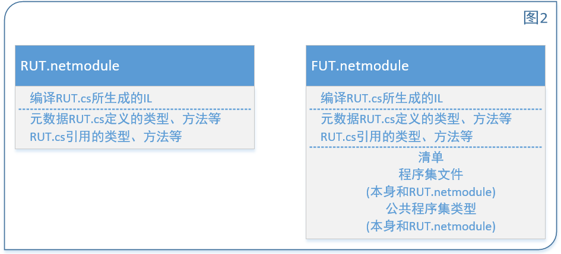
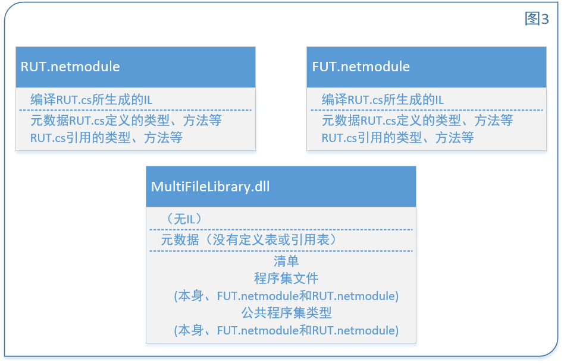
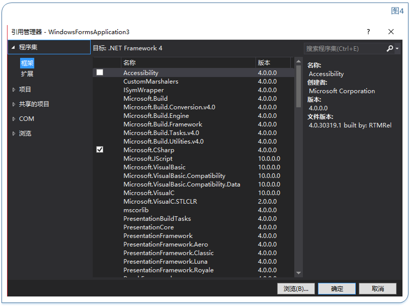
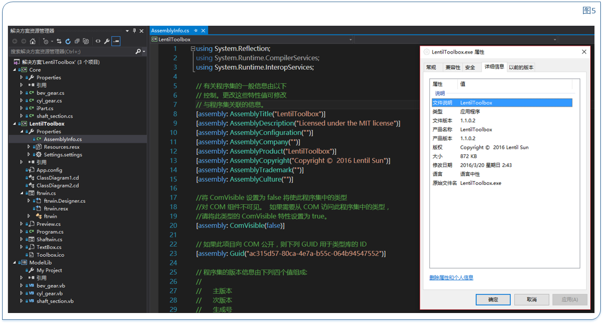

# 《CLR via C#》学习笔记【2】

​                                                   2016年05月07日 20:20:20           [just0kk](https://me.csdn.net/just0kk)           阅读数：818                                                                  

​                   

​                                                                         版权声明：本文为博主原创文章~转载请注明出处http://blog.csdn.net/just0kk           https://blog.csdn.net/just0kk/article/details/51339773        

# 二、生成、打包、部署和管理应用程序及类型

## 2.1 .NET Framework部署目标

Windows多年来一直因为不稳定和过于复杂而口碑不佳。存在所谓”DLL hell“、安装的复杂性等繁琐的问题，而.NET  Framework 正在尝试彻底解决DLL hell的问题，也在很大程度上解决了应用程序状态在用户硬盘中四处分散的问题。  >和COM不同，类型不再需要注册表中的设置。……像Microsoft SQL  Server这样的宿主应用程序只能将少许权限授予代码，而本地安装的（自寄宿）应用程序可获得完全信任（全部权限）

## 2.2 将类型生成到模块中

> System.Console是Microsoft实现好的类型，用于实现这个类型的各个方法的IL代码存储在MSCorLib.dll 

```
public sealed class Program{ 
        public static void Main(){ 
            System.Console.WriteLine("Hi"); 
        } 
}12345
```

对于上述代码，由于引用了Console类的WriteLine方法，要顺利通过编译，必须向C#编译器提供一组程序集，使他能解析对外部类型的引用。因此需要添加r:MSCorLib.dll（此处”r“意为reference）开关命令，完整编译命令行应如下：

```
 csc.exe /out:Program.exe/t:exe/r:MSCorLib.dll Program.cs 1
```

但由于其他命令均为默认命令，本例中的编译命令行可以简化为 

```
csc.exe Program.cs 1
```

如果不想C#编译器自动引用MSCorLib.dll程序集，可以使用/nostdlib开关。 

### 2.2-1生成三种应用程序的编译器开关

- 生成控制台用户界面(Console User Interface, CUI)应用程序使用/t:exe开关；
- 生成图形用户界面(Graphical User Interface, GUI)应用程序使用/t:winexe开关；
- 生成Windows Store应用程序使用/t:appcontainerexe开关；

### 2.2-2响应文件

编译时可以指定包含编译器设置命令的响应文件，例如：假定响应文件MyProject.rsp包含以下文本

```
/out:MyProject.exe
/target:winexe12
```

为了让CSC.exe使用该响应文件，可以像下面这样调用它

```
csc.exe @MyProject.rsp CodeFile1.cs CodeFile2.cs1
```

C#支持多个相应文件，其先后顺序服从就近原则，优先级为控制台命令>本地>全局。.NET  Framework具有一个默认的全局CSC.rsp文件，在运行CSC.exe进行编译时会自动调用，全局CSC.rsp文件中列出了所有的程序集，就不必使用C#的/reference开关显式引用这些程序集，这会对编译速度有一些影响，但**不会影响最终的程序集文件，以及执行性能**，开发者也可以自己为全局CSC.rsp添加命令开关，但这可能为在其他机器上重现编译过程带来麻烦。 
 另外，指定/noconfig开关后，编译器将忽略本地和全局CSC.rsp文件。

## 2.3 元数据概述

再来回顾一下托管模块的文件结构，托管PE文件由四部分构成，它们分别为：PE32(+)头，CLR头，元数据以及IL，接下来将展开谈元数据的内部结构和作用

- PE32(+)头是所有windows程序的标准信息头，详情可参见
- CLR头是一个小的信息块，是托管模块特有的，包含生成时所面向的版本号、一些标志、和一个**MethodDef token**用来指定模块的入口方法，最后，CLR头还包含模块内部的一些元数据表的大小的偏移量
- 元数据是由三种表构成的二进制数据块，这三种表分别为**定义表**(definiton talbe)、**引用表**(reference table)和**清单表**(mainfest table)。

#### 表1 常用的元数据定义表

| 元数据定义表名称 | 说明                                                         |
| ---------------- | ------------------------------------------------------------ |
| ModuleDef        | 总是包含对模块进行标识的一个记录项，**这个记录项包含模块文件名和扩展名**（不含路径），以及模块版本ID（为编译器创建的GUID）。这样可以在保留原始名称记录的前提下自由重命名文件，但强烈反对重命名文件，因为可能妨碍CLR在运行时正确定位程序集。 |
| TypeDef          | 模块定义的每个类型在这个表中都有一个记录项，包含类型的名称、基类、标志(public/private  etc.)以及一些索引，这些索引指向MethodDef中属于该类型的方法、FieldDef表中该类的字段、PropertyDef表中该类型的属性以及EventDef表中该类型的时间。 |
| MetodDef         | 模块定义的每个方法在这个表中都有一个记录项（包括入口方法）。每个记录项都包含方法的名称、标志、签名以及方法的IL代码在模块中的偏移量（通俗地说，位置）。每个记录项还引用了ParamDef表中的一个记录项，后者包括与方法参数有关的更多信息。 |
| FieldDef         | 模块定义的每一个字段在这个表中都有一个记录项。每个记录项都包括标志、类型和名称。 |
| ParamDef         | 模块定义的每个参数在这个表中都有一个记录项。每个记录项包含标志(in/out/retval等)、类型和名称。 |
| PropertyDef      | 模块定义的每个属性在这个表中都有一个记录项。每个记录项都包含标志、类型和名称。 |
| EventDef         | 模块定义的每个事件在这个表中都有一个记录项。每个记录项都包含标志和名称。 |

> 表1：代码中定义的任何东西都将在上表中的某个表创建一个记录项。

#### 表2 常用的引用元数据表

| 引用元数据表名称 | 说明                                                         |
| ---------------- | ------------------------------------------------------------ |
| AssemblyRef      | 模块中引用的每个程序集在这个表中都有一个记录项。每个及录像都包含绑定(bind)① |

| 该程序集所需的信息：程序集名称(不包含路径和扩展名)、版本号、语言文化及公钥Token(根据发布者的公钥生成一个小的哈希值，标识了所引用程序集的发布者)。每个记录项还包含一些标志和一个哈希值。该哈希值本应作为所引用程序集的二进制数据校验和来使用。但是目前CLR完全忽略该哈希值，未来的CLR可能同样如此。 |                                                              |
| ------------------------------------------------------------ | ------------------------------------------------------------ |
| ModuleRef                                                    | **实现该模块所引用的类型的每个PE模块在这个表中都有一个记录项**。每个记录项都包含模块的文件名和扩展名(不含路径),如果存在别的模块实现了你需要的类型，这个表的作用便是同哪些类型建立绑定关系 |
| TypeRef                                                      | 模块引用的每一个类型在这个表中都有一个记录项。每个记录项都包括模块的文件名和一个引用（指向该类型的位置）如果类型在另一个类型中实现，引用指向一个TypeRef记录项。如果类型在同一个模块中实现，引用指向一个ModuleDef记录项。如果类型在调用程序集内的另一个模块中实现，引用指向一个ModuleDef记录项。如果类型在不同程序集中实现，引用指向一个AssemblyRef记录项 |
| MemberRef                                                    | 模块引用的每个成员（字段和方法，以及属性方法和事件方法）在这个表中都有一个记录项。每个记录项都包含成员的名称和签名，并指向对成员进行定义的那个类型的TypeRef记录项 |

> ①译者注：bind在文档中有时译为“联编”，binder有时译为”联编程序“，这里译为“绑定”和“绑定器”

## 2.4 将模块合并成程序集

程序集(Assembly)是一个或多个类型定义文件及资源文件的集合。在程序集的所有文件中，有一个文件容纳了**清单**(Manifest)，如上一节一开始所述，清单也是元数据的组成部分之一，表中主要包含作为程序集组成部分的那些文件的名称。此外还描述程序集的版本、语言文化、发布者、公开导出类型以及构成程序集的所有文件。 
 CLR操作的是程序集，对于程序集，有以下几点重要特性：

- 程序集定义了可重用的类型。
- 程序集用一个版本号标记。
- 程序集可以关联安全信息。

对于一个程序集来说，除了包含清单元数据表的文件，程序集中的其他文件独立时不具备以上特点 
 Microsoft为何考虑要引入程序集这一概念？这是因为使用程序集，可重用类型的逻辑表示和物理表示就可以分开。**物理上，可以将常用的类型放在一个文件中，不常用的程序放在另一些文件中**，只在使用时加载，但是**在逻辑上，这些程序仍然被组织于同一程序集中**，不需要编写额外的代码显式进行链接。

> 提示：总之，程序集是进行重用、版本控制和应用安全性设置的基本单元。

#### 表3 清单元数据表

| 清单元数据表名称 | 说明                                                         |
| ---------------- | ------------------------------------------------------------ |
| AssemblyDef      | 如果模块标识的是程序集，这个元数据表就包含单一记录项来列出程序集名称(不包含路径和扩展名)、版本(major，minor，build和revision)、语言文化、标志、哈希算法以及发布者公钥(可为null) |
| FileDef          | 作为程序集一部分的每个PE文件和资源文件在这个表中都有一个记录项(清单本身所在的文件除外，该文件在AssemblyDef表的单一记录项中列出)。在每个记录项中，都包含文件名和扩展名(不含路径)、哈希值和一些标志。如果程序集只包含他自己的文件① |

| ，FileDef将无记录   |                                                              |
| ------------------- | ------------------------------------------------------------ |
| ManifestResourceDef | 作为程序集一部分的每个资源在这个表中都有一个记录项。记录项中包含资源名称、一些标志(如果程序集外部可见，就为public，否则为private)以及FileDef表的一个索引(指出资源或流包含在哪个文件中)。如果资源不是独立文件(比如.jpg或者.gif文件)，那么资源就是包含在PE文件中的流。对于嵌入资源，记录项还包含一个偏移量，指出资源流在PE文件中的起始位置 |
| ExportedTypesDef    | 从程序集的所有PE模块中导出的每个public类型在这个表中都有一个记录项。记录项中包含类型名称、FileDef表的一个索引(指出类型由程序集的哪个文件实现)以及TypeDef表的一个索引。注意，为了节省空间，从清单所在文件导出的类型不再重复，因为可以通过元数据的TypeDef表获取类型信息 |

> ①译者注：所谓“如果程序集只包含他自己的文件“，是指程序集只包含他的主模块，不包含其他非主模块和资源文件。

指定以下任何命令行开关，C#编译器都会生成程序集： /t: exe, /t: winexe, /t: appcontainerexe, /t: library 或者/t: winmdobj。这些开关会指示编译器**生成含有清单元数据表的PE文件**。

除了这些开关，C#编译器还支持/t: module开关。这个开关指示编译器生成一个不包含清单元数据表的PE文件。这样生成的肯定是一个DLL PE文件。CLR要想访问其中的任何类型，**必须先将该文件添加到一个程序集中**。使用/t: module开关时，C#编译器默认为输出文件使用.netmodule扩展名。

> 遗憾的是，不能直接从Microsoft Visual studio集成开发环境中创建多文件程序集，只能用命令行工具创建多文件程序集。

可以通过C#编译器，AL连接器等方法生成多模块程序集，下面将展开介绍

### 2.4-1通过C#编译器生成程序集

如果用C#编译器生成含清单的PE文件，可以使用/addmodule开关。假定有如下两个源代码文件： 
  \- RUT.cs, 其中包含不常用类型 
  \- FUT.cs, 其中包含常用类型

下面将不常用类型编译到一个单独模块，这样一来如果程序集的用户永远不使用不常用类型，就不需要部署这个模块。

```
csc /t:module RUT.cs1
```

上述命令行造成C#编译器创建名为RUT.netmodule的文件。这是一个标准的DLL PE文件，但是CLR不能但单独加载它。 
 接着编译常用类型模块事实上由于该模块现在代表整个程序集，所以将输出的文件名改为MultiFileLibrary.dll

```
csc /out:NultiFileLibray.dll /t:library /addmodule:RUT.netmodule FUT.cs1
```

由于指定了.t: library开关，所以生成的是含有清单元数据表的DLL PE文件。/addmodule:RUT.netmodule  开关告诉编译器RUT.netmodule文件是程序集的一部分，从而将其添加到FileDef清单元数据表，并将RUT.netmodule的公开导出类型添加到ExportedTypesDef清单源数据表。

编译器最终创建如图2所示的两个文件，清单在右边的文件中。 
 

MultilFileLibrary.dll除了和RUT.netmodule一样包括一些描述自身类型、方法、字段等的**定义元数据表**外，还包含额外的**清单元数据表**，这使MultiFileLibrary.dll（联合RUT.netmodule）成为了程序集。清单元数据表描述了程序集的所有文件（MultiFileLibrary.dll本身和RUT.netmodule）。清单元数据表**还包含从MultiFuileLibraty.dll和RUT.netmodule导出的所有公共类型**

> 以下供参考。元数据token试一个4字节的值。其中高位字节指明token的类型(0x01=**TypeRef**, 0x02=**TypeDef**, 0x23=AssemblyRef, 0x26=File(文件定义)， 0x27=ExportedType)更多可参见 .NET Framework SDK包含的 CORHdr.h 文件中的CorTokenType枚举类型。

在生成新程序集的时候，所引用的程序集中的所有文件都必须存在。 
 但在运行时，只有被调用的方法确实引用了未加载程序集中的类型时，才会加载程序。换言之，为了运行程序，并不要求被引用的程序集的所有文件都存在。

### 2.4-2 使用程序集链接器生成程序集

除了使用C#编译器，还可以使用”程序集链接器“实用程序AL.exe来创建程序集。如果程序集要求包含由不同编译器生成的模块(而这些编译器不支持与C#编译器的/addmodule开关等家的几种机制)，或者生成时不清楚程序集的打包要求，程序集连接器就显得相当有用。还可以用AL.exe来生成只含资源的程序集，也就是所谓的附属程序集，他们通常用于**本地化**，本章稍后会讨论附属程序集的问题。 
 AL.exe能生成EXE文件，或者生成只包含清单的DLL PE文件。 
 为了理解AL.exe的工作原理，让我们改变一下MultiFileLibrary.dll程序的集成方式：

```
csc /t:module RUT.cs
csc /t:module FUT.cs
al /out:MultiFileLibrary.dll /t:library FUT.netmodule RUT.netmodule123
```

图3展示了执行这些命令后生成的文件。 
 

程序集链接器不能将多个文件合并成一个文件。

### 2.4-3为程序集添加资源文件

用AL.exe创建程序集时，可用/enbed[resource]开关将文件作为资源添加到程序集。该开关获取任意文件，并将文件内容嵌入最终的PE文件。也可用/Link[resource]开关获取资源文件，但只指出资源包含在程序集的哪个文件，并不嵌入到PE文件中；该资源文件独立，并必须与程序集文件一同被打包部署  
 相似的，C#编译器用/resource开关将资源嵌入PE文件，用/linkresource开关添加记录项引用资源文件。以上开关均会修改ManifestResourceDef清单表添加记录项，外部引用的开关还会修改FileDef表以指出资源包文件。

### 2.4-4 使用VS IDE将程序集添加到项目中

一个项目所需的程序集，除了显式的在代码中引用命名空间外，还要在项目引用管理器中引用，为此请打开解决方案资源管理器，右击想添加引用的项目，选择“添加引用”打开“引用管理器”对话框，如图4所示 
  
 其中的COM选项允许从托管代码中访问一个非托管COM服务器。这是通过Visual Studio自动生成的一个托管代理类实现的。

## 2.5 程序集版本资源信息

AL.exe或CSC.exe生成PE文件程序集时，还会在PE文件中嵌入标准的Win32版本资源。 
 在应用程序代码中调用System.Diagnostics.FileVersionInfo的静态方法GetVersionInfo并传递程序集路径作为参数可以获取并检查这些信息。 
 生成程序集时，这些特性在源代码中应用于assembly级别。

> Visual Studio新建C#项目时会在一个Properties文件夹中自动创建AssemblyInfo.cs文件。可直接打开该文件并修改自己的程序集特有信息。



以下为上图中由IDE自动生成的AssemblyInfo.cs文件中的代码片段，该代码片段定义了程序集信息，右侧的详细信息窗口所来自的程序集便由此段代码所属项目生成。

```
// 有关程序集的一般信息由以下
// 控制。更改这些特性值可修改
// 与程序集关联的信息。
[assembly: AssemblyTitle("LentilToolbox")]
[assembly: AssemblyDescription("Licensed under the MIT license")]
[assembly: AssemblyConfiguration("")]
[assembly: AssemblyCompany("")]
[assembly: AssemblyProduct("LentilToolbox")]
[assembly: AssemblyCopyright("Copyright ©  2016 Lentil Sun")]
[assembly: AssemblyTrademark("")]
[assembly: AssemblyCulture("")]

//将 ComVisible 设置为 false 将使此程序集中的类型
//对 COM 组件不可见。  如果需要从 COM 访问此程序集中的类型，
//请将此类型的 ComVisible 特性设置为 true。
[assembly: ComVisible(false)]

// 如果此项目向 COM 公开，则下列 GUID 用于类型库的 ID
[assembly: Guid("ac315d57-80ca-4e7a-b55c-064b94547552")]

// 程序集的版本信息由下列四个值组成: 
//
//      主版本
//      次版本
//      生成号
//      修订号
//
//可以指定所有这些值，也可以使用“生成号”和“修订号”的默认值，
// 方法是按如下所示使用“*”: :
// [assembly: AssemblyVersion("1.0.*")]
[assembly: AssemblyVersion("1.1.0.2")]
[assembly: AssemblyFileVersion("1.1.0.2")]1234567891011121314151617181920212223242526272829303132
```

> windows资源管理器的属性对话框显然遗漏了一些特性值。最遗憾的是没有显示AssemblyVersion这个特性的值，因为CLR加载程序集时会使用这个值。

#### 表4 版本资源字段和对应的AL.exe开关/定制特性

| 版本资源         | AL.exe开关      | 定制特性/说明                                                |
| ---------------- | --------------- | ------------------------------------------------------------ |
| FILEVERSION      | /fileversion    | System.Reflection.AssemblyFileVersionAttribute               |
| PRODUCTVERSION   | /productversion | System.Reflection.AssemblyInformationalVersionAttribbute     |
| FILEFLAGS        | （无）          | 总是设为VS_FFI_FILEFLAGSMASK（在WinVer.h中定义为0x0000003F） |
| FILEOS           | （无）          | 总是0                                                        |
| FILEOS           | （无）          | 目前总是VOS_WINDOWS32                                        |
| FILETYPE         | /target         | 如果指定了/target:exe或target:winexe，就设为VFT_APP；如果指定了/target:library，就设为 VFT_DLL |
| FILESUBTYPE      | （无）          | 总是设为VFT2_UNKNOWN（该字段对VFT_APP和VFT_DLL无意义）       |
| AssemblyVersion  | /Version        | System.Reflection.AssemblyVersionAttribute                   |
| Comments         | /description    | System.Reflection.AssemblyDescriptionAttribute               |
| CompanyName      | /Company        | System.Reflection.AssemblyCompanyAttrbute                    |
| FileDescription  | /title          | System.Reflection.AssemblyTitleAttribute                     |
| FileVersion      | /version        | System.Reflection.AssemblyFileVersionAttribute               |
| InternalName     | /out            | 设定为指定的输出文件的名称（无扩展名）                       |
| LegalCopyright   | /copyright      | System.Reflection.AssemblyCopyrighhtAttrubute                |
| LegalTrademarks  | /trademark      | System.Reflection.AssemblyTrademarkAttribute                 |
| OriginalFilename | /out            | 设为输出文件的名称（无路径）                                 |
| PrivateBuild     | （无）          | 总是空白                                                     |
| ProductName      | /product        | System.Reflection.AssemblyProductAttribute                   |
| ProductVersion   | /Productversion | System.Reflection.AssemblyInformationalVersionAttribute      |

### 2.5-1 版本号

上表指出可向程序集应用几个版本号，所有这些版本号都具有相同的格式如下

#### 表5 版本号格式

| -    | major（主版本号） | minor（次版本号） | build（内部版本号） | revision（修订号） |
| ---- | ----------------- | ----------------- | ------------------- | ------------------ |
| 示例 | 2                 | 5                 | 719                 | 2                  |

注意：程序集有三个版本号，每个版本号都有不同的用途：

- **AssemblyFileVersion**：这个版本号存储在Win32版本资源中供使用者参考，CLR既不检查，也不关心，这个版本号的作用是说明**该程序集的版本**。
- **AssemblyInformationalVersion**：同上，这个版本号存储在Win32版本资源中供使用者参考，CLR既不检查，也不关心，这个版本号作用是说明**使用该程序集的产品的版本**。
- **AssemblyVersion**：存储在AssemblyDef清单元数据表中，CLR在绑定到强命名程序集时会用到它。这个版本号很重要，**它唯一性地标识了程序集**。

## 2.6 语言文化

除了版本号，语言文化(culture)①

**也作为其身份标识的一部分**。例如，可能有一个程序集限定德语用户，另一个限定英语用户。语言文化标准记录于RFC1766，表6展示了一些例子

> ①译者注：文档翻译为“区域性”（博主：面向用户的界面大多直译为语言吧）

#### 表6 程序集语言文化标记的例子

| 主标记 | 副标记 | 语言文化     |
| ------ | ------ | ------------ |
| zh     | （无） | 中文         |
| zh     | Hans   | 中文（简体） |
| zh     | Hant   | 中文（繁体） |
| en     | （无） | 英文         |
| en     | GB     | 英国英语     |
| en     | US     | 美国英语     |

未指定具体语言文化的程序集成为语言文化中性(Culture neutral)。

> 如果应用程序包含语言文化特有的资源，Microsoft强烈建议专门创建一个程序集来包含代码和应用程序的默认（或附加）资源。生成该程序集时**不要指定具体的语言文化**，其他程序集通过引用该程序集来创建和操纵他的公开类型。 
>    标记了语言文化的程序集称为附属程序集(satellite assembly) 
>    一般**不要生成引用了附属程序集的程序集**。换言之，程序集的AssemblyRef记录项只应引用语言文化中性的程序集。要访问附属程序集中的类型或成员，应**使用第23章“程序集加载和反射”介绍的反射技术**。

## 2.7 简单应用程序部署（私有部署的程序集）

Windows Store应用对程序集的打包有一套很严格的规则，Visual  Studio会将应用程序所必要的程序集打包成一个.appx文件。该文件要么上传到Windows  Store，要么side-load到机器。用户安装应用时，其中包含的所有程序集都进入一个目录。CLR从该目录加载程序集 
 对于非Windows  Store的应用，程序打包的方式没有限制。可以使用.cab文件（从Internet下载时使用，旨在压缩文件并缩短下载时间）。还可以将程序打包成一个MSI文件，以便由Windows  Installer服务(MSIExec.exe)使用。也可以使用Visual  Studio内建机制发布应用程序，具体做法是打开项目属性页并点击“发布”标签。这个MSI文件还能安装必备组件，以及利用ClickOnce技术，应用程序还能自动检查更新，并在用户机器上安装更新。  
 第三章将讨论如何部署可以由多个应用程序访问的共享程序集。