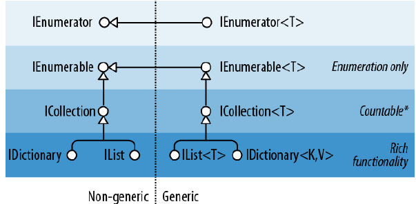
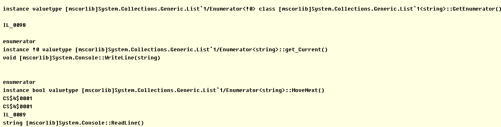

#  			[C#集合类型大盘点](https://www.cnblogs.com/jesse2013/p/CollectionsInCSharp.html) 		


C#集体类型（ Collections in C#）

　　集合是.NET FCL(Framework Class  Library)中很重要的一部分，也是我们开发当中最常用到的功能之一，几乎是无处不在。俗话说知其然，知其所以然，平常看到IEnumerable，IEnumerator，ICollection是不是知道他们之间各自的区别？除了List和Dictionary以外，你还用过哪些其它的集合类？废话少说，今天我们就来看一些这些定义集合类的接口以及他们的实现。

- [集合接口](https://www.cnblogs.com/jesse2013/p/CollectionsInCSharp.html#b01)
- [关联性泛型集合类](https://www.cnblogs.com/jesse2013/p/CollectionsInCSharp.html#b02)
- [非关联性泛型集合类](https://www.cnblogs.com/jesse2013/p/CollectionsInCSharp.html#b03)
- [推荐使用场景](https://www.cnblogs.com/jesse2013/p/CollectionsInCSharp.html#b04)
- [非泛型集合类](https://www.cnblogs.com/jesse2013/p/CollectionsInCSharp.html#b05)
- [线程安全集合类](https://www.cnblogs.com/jesse2013/p/CollectionsInCSharp.html#b06)

# 集合接口

　　先来看一下，FCL为我们提供了哪些接口：



　　

### IEnumerable 和IEnumberator

```
`public` `interface` `IEnumerator``{` `    ``bool` `MoveNext();``    ``object` `Current {  ``get``; }``    ``void` `Reset();``}`
```

　　IEnumerator定义了我们遍历集合的基本方法，以便我们可以实现单向向前的访问集合中的每一个元素。而IEnumerable只有一个方法GetEnumerator即得到遍历器。

```
`public` `interface` `IEnumerable``{``    ``IEnumerator GetEnumerator();``}`
```

　　**注意：**我们经常用的foreach即是一种语法糖，实际上还是调用Enumerator里面的Current和MoveNext实现的遍历功能。

```
`List<``string``> list = ``new` `List<``string``>() ``{ ``    ``"Jesse"``,``    ``"Chloe"``,``    ``"Lei"``,``    ``"Jim"``,``    ``"XiaoJun"``};` `// Iterate the list by using foreach``foreach` `(``var` `buddy ``in` `list)``{``    ``Console.WriteLine(buddy);``}` `// Iterate the list by using enumerator``List<``string``>.Enumerator enumerator = list.GetEnumerator();``while` `(enumerator.MoveNext())``{``    ``Console.WriteLine(enumerator.Current);``}`
```

　　上面的代码中用到的foreach和enumerator到IL中最后都会被翻译成enumerator的MoveNext和Current。



　　IEnumerable是一个很有用的接口，实现它的好处包括：

1. 支持foreach语句
2. 作为一个标准的集合类与其它类库进行交互
3. 满足更复杂的集合接口的需求
4. 支持集合初始化器

　　当然实现的方法也有很多,如下：

1. 如果我们集合是通过封装其它集合类而来的，那么我们可以直接返回这个集合的enumerator
2. 通过yield return 来返回
3. 实现我们自己的IEnumerator来实现

　　这里给大家演示一下如何通过yield来实现返回enumerator

```
`public` `class` `BuddyList : IEnumerable``{``    ``private` `string``[] data= ``new` `string``[]``    ``{ ``        ``"Jesse"``,``        ``"Chloe"``,``        ``"Lei"``,``        ``"Jim"``,``        ``"XiaoJun"``    ``};` `    ``public` `IEnumerator GetEnumerator()``    ``{``        ``foreach` `(``var` `str ``in` `data)``        ``{``            ``yield` `return` `str;``        ``}``    ``}``}` `var` `myBuddies= ``new` `BuddyList();``foreach` `(``var` `str ``in` `myBuddies)``{``    ``Console.WriteLine(str);``}`
```

　　

### ICollection<T>和ICollection

　　从最上面第一张图我们可以知道，ICollection是直接继承自IEnumerable。而实际上也是如此，我们可以说ICollection比IEnumerable多支持一些功能，不仅仅只提供基本的遍历功能，还包括：

1. 统计集合和元素个数
2. 获取元素的下标
3. 判断是否存在
4. 添加元素到未尾
5. 移除元素等等。。。

 　　ICollection 与ICollection<T> 略有不同，ICollection不提供编辑集合的功能，即Add和Remove。包括检查元素是否存在Contains也不支持。

### IList<T>和IList

　　IList则是直接继承自ICollection和IEnumerable。所以它包括两者的功能，并且支持根据下标访问和添加元素。IndexOf,  Insert,  RemoveAt等等。我们可以这样说，IEnumerable支持的功能最少，只有遍历。而ICollection支持的功能稍微多一点，不仅有遍历还有维护这个集合的功能。而IList是最全的版本。

### IReadOnlyList<T>

　　这个是在Framework4.5中新增的接口类型，可以被看作是IList<T>的缩减版，去掉了所有可能更改这个集合的功能。比如：Add, RemoveAt等等。

### IDictionary<TKey,TValue>

　　IDictionary提供了对键值对集合的访问，也是继承了ICollection<T>和IEnumerable，扩展了通过Key来访问和操作数据的方法。

# 关联性泛型集合类

　　关联性集合类即我们常说的键值对集合，允许我们通过Key来访问和维护集合。我们先来看一下 FCL为我们提供了哪些泛型的关联性集合类：

1. Dictionary<TKey,TValue>
2. SortedDictionary<TKey,TValue>
3. SortedList<TKey,TValue>

### Dictionary<TKey,TValue>

　　Dictionary<TKey,TValue>可能是我们最常用的关联性集合了，它的访问，添加，删除数据所花费的时间是所有集合类里面最快的，因为它内部用了Hashtable作为存储结构，所以不管存储了多少键值对，查询/添加/删除所花费的时间都是一样的,它的时间复杂度是O(1)。

　　Dictionary<TKey,TValue>优势是查找插入速度快，那么什么是它的劣势呢？因为采用Hashtable作为存储结构，就意味着里面的数据是无序排列的，所以想按一定的顺序去遍历Dictionary<TKey,TValue>里面的数据是要费一点工夫的。

　　作为TKey的类型必须实现**GetHashCode()**和**Equals()** 或者提供一个**IEqualityComparer****，**否则操作可能会出现问题。

### SortedDictioanry<TKey,TValue>

　　SortedDictionary<TKey,TValue>和Dictionary<TKey,TValue>大致上是类似的，但是在实现方式上有一点点区别。SortedDictionary<TKey,TValue>用二叉树作为存储结构的。并且按key的顺序排列。那么这样的话SortedDictionary<TKey,TValue>的TKey就必须要实现**IComparable<TKey>****。**如果想要快速查询的同时又能很好的支持排序的话，那就使用SortedDictionary吧。

### SortedList<TKey,TValue>       

　　SortedList<TKey,TValue>是另一个支持排序的关联性集合。但是不同的地方在于，SortedList实际是将数据存存储在数组中的。也就是说添加和移除操作都是线性的，时间复杂度是O(n)，因为操作其中的元素可能导致所有的数据移动。但是因为在查找的时候利用了二分搜索，所以查找的性能会好一些，时间复杂度是O(log   n)。所以推荐使用场景是这样地：如果你想要快速查找，又想集合按照key的顺序排列，最后这个集合的操作（添加和移除）比较少的话，就是SortedList了。

# 非关联性泛型集合类

　　非关联性集合就是不用key操作的一些集合类，通常我们可以用元素本身或者下标来操作。FCL主要为我们提供了以下几种非关联性的泛型集合类。

1. List<T>
2. LinkedList<T>
3. HashSet<T>
4. SortedSet<T>
5. Stack<T>
6. Queue<T>

### List<T>

　　泛型的List  类提供了不限制长度的集合类型，List在内部维护了一定长度的数组(默认初始长度是4)，当我们插入元素的长度超过4或者初始长度  的时候，会去重新创建一个新的数组,这个新数组的长度是初始长度的2倍（不永远是2倍，当发现不断的要扩充的时候，倍数会变大），然后把原来的数组拷贝过来。所以如果知道我们将要用这个集合装多少个元素的话，可以在创建的时候指定初始值，这样就避免了重复的创建新数组和拷贝值。

　　另外的话由于内部实质是一个数组，所以在List的未必添加数据是比较快的，但是如果在数据的头或者中间添加删除数据相对来说更低效一些因为会影响其它数据的重新排列。

### LinkedList<T>

　　LinkedList在内部维护了一个双向的链表，也就是说我们在LinkedList的任何位置添加或者删除数据其性能都是很快的。因为它不会导致其它元素的移动。一般情况下List已经够我们使用了，但是如果对这个集合在中间的添加删除操作非常频繁的话，就建议使用LinkedList。

### HashSet<T>

　　HashSet是一个无序的能够保持唯一性的集合。我们也可以把HashSet看作是Dictionary<TKey,TValue>，只不过TKey和TValue都指向同一个对象。HashSet非常适合在我们需要保持集合内元素唯一性但又不需要按顺序排列的时候。

　　HashSet不支持下标访问。

### SortedSet<T>

　　SortedSet和HashSet,就像SortedDictionary和Dictionary一样，还记得这两个的区别么？SortedSet内部也是一个二叉树，用来支持按顺序的排列元素。

### Stack<T>

　　后进先出的队列
　　不支持按下标访问

### Queu<T>

　　先进先出的队列
　　不支持按下标访问

# 推荐使用场景

 

| **集合**          | **顺序排列**                 | **连顺存储** | **直接访问方式** | **访问时间**            | **操作时间** | **备注**                                                     |
| ----------------- | ---------------------------- | ------------ | ---------------- | ----------------------- | ------------ | ------------------------------------------------------------ |
| Dictionary        |                              | 是           | Key              | Key: O(1)               | O(1)         | 访问性能最快，不支持排序                                     |
| SortedDinctionary | 顺序排列                     | 否           | Key              | Key:     O(log n)       | O(log n)     | 快速访问和支持排序的折衷                                     |
| SortedList        | 顺序排列                     | 是           | Key              | Key: O(log n)           | O(n)         | 和SortedDictionary相似，只是内部用数据替代树作为存储结构。   |
| List              | 使用者可以精确控制元素的位置 | 是           | Index            | Index: O(1) Value: O(n) | O(n)         | 最适合需要直接访问每一个元素的少量集合。                     |
| LinkedList        | 使用者可以精确控制元素的位置 | 否           | 不支持           | Value: O(n)             | O(1)         | 最适合不需要直接访问单个元素，但是在集合中添加/移除非常频繁的场景。 |
| HashSet           | 不支持                       | 是           | Key              | Key: O(1)               | O(1)         | 能保持元素唯一性的集合。不支持排序                           |
| SortedSet         | 顺序排列                     | 否           | Key              | Key: O(log n)           | O(log n)     | 能保持元素唯一性并且支持排序。                               |
| Stack             | LIFO                         | 是           | 只能获取顶部元素 | Top: O(1)               | O(1)         |                                                              |
| Queue             | FIFO                         | 是           | 只能获底部元素   | Front: O(1)             | O(1)         |                                                              |

# 非泛型类集合

泛型集合类是在.NET2.0的时候出来的,也就是说在1.0的时候是没有这么方便的东西的。现在基本上我们已经不使用这些集合类了，除非在做一些和老代码保持兼容的工作的时候。来看看1.0时代的.NET程序员们都有哪些集合类可以用。

1. ArraryList

后来被List<T>替代。

1. HashTable 后来被Dictionary<TKey,TValue>替代。
2. Queue 后来被Queue<T>替代。
3. SortedList 后来被SortedList<T>替代。
4. Stack 后来被Stack<T>替代。

# 线程安全的集合类

1. ConcurrentQueue 线程安全版本的Queue
2. ConcurrentStack线程安全版本的Stack
3. ConcurrentBag线程安全的对象集合
4. ConcurrentDictionary线程安全的Dictionary
5. BlockingCollection

.NET为我们提供的集合类是我们很常用的工具类之一，希望这篇文章能够帮助大家更好的认识这些集合类。当然，个人感觉还有不完善的地方，比如说HashTable和Binary  Search Tree就没有细究下去，包括单向链表和双向链表之间的对比本文也没有提及。感兴趣的朋友可以深入了解一下。