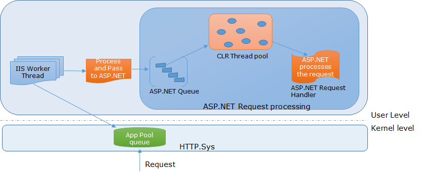

# 充分发挥异步在 ASP.NET 中的强大优势


[OneAPM 助您轻松锁定 .NET 应用性能瓶颈](https://www.oneapm.com/ai/dotnet.html?utm_source=Community&utm_medium=Article&utm_term=%E5%85%85%E5%88%86%E5%8F%91%E6%8C%A5%E5%BC%82%E6%AD%A5%E5%9C%A8%20ASP.NET%20%E4%B8%AD%E7%9A%84%E5%BC%BA%E5%A4%A7%E4%BC%98%E5%8A%BF&utm_content=wk411-417&utm_campaign=AiNetArti&from=jscldfjdci)，通过强大的 Trace 记录逐层分析，直至锁定行级问题代码。以用户角度展示系统响应速度，以地域和浏览器维度统计用户使用情况。


​              

​             [OneAPM_Official](https://www.jianshu.com/u/0c6074c10464)                          

​                                               2016.04.13 16:10*               字数 1976             阅读 997评论 0喜欢 10

作者：[Brij Bhushan Mishra](http://www.infragistics.com/community/blogs/brijmishra/default.aspx)

最近几年，异步编程受到极大关注，主要是出于两个关键原因：首先，它有助于提供更好的用户体验，因为**不会阻塞 UI 线程**，避免了处理结束前出现 UI 界面挂起。其次，它**有助于大幅扩展系统，而且无需添加额外硬件**。

但是，编写合适的异步代码来管理线程本身是项乏味的工作。虽然如此，其巨大好处让许多新旧技术纷纷开始使用异步编程。微软自发布了 .NET  4.0以后也对其投入颇多，随后在 .NET 4.5中引入了 **async 和 await 关键字，使异步编程**变得前所未有地简单。

但是，ASP.NET 中的异步功能自一开始就可以使用，只是从来没有得到应有的重视。而且，考虑到 ASP.NET 和 IIS  处理请求的方式，异步体现的优势可能更明显。通过异步，我们很容易就可以大幅提高 ASP.NET 应用程序的扩展性。随着新的编程结构引入，如  async 和 await 关键字，我们也应该学会使用异步编程的强大功能。

在本篇博文中，我们将讨论一下 IIS 和 ASP.NET 处理请求的方式，然后看看 ASP.NET 中哪些地方可以使用异步，最后再讨论几个最能体现异步优势的场景。

## 请求是如何处理的?

每个 ASP.NET 请求都要先通过 IIS，然后再由 ASP.NET 处理程序进行最终处理。 

首先IIS  **接收请求，初步处理**后，发送给ASP.NET（必须是一个ASP.NET请求），然后由ASP.NET进行**实际处理并生成响应，之后该响应通过IIS发回**给客户。在IIS上，有一些**工作进程负责从队列中取出请求**，并执行IIS  模块，然后再将该**请求发送到ASP.NET 队列**。但是，ASP.NET本身不创建任何线程，也没有处理请求的线程池，而**是通过使用CLR  线程池**，从中获取线程来处理请求。因此，IIS 模块调用ThreadPool.QueueUserWorkItem，将请求排入队列，供CLR  工作线程处理。我们都知道，CLR线程池是由CLR管理，并且能够自动调整（也就是说，它根据需要创建和销毁进程）。这里还要记住，创建和销毁线程是项很繁重的任务，这就是为什么CLR线程池允许使用同一个线程处理多个任务。下面来看一个描述请求处理过程的图示。




在上图中可以看到，请求首先由  HTTP.sys接收，并添加到相应内核级应用程序池队列。然后，一个IIS工作线程从队列中取出请求，处理后将其传到ASP.NET  队列。注意，该请求如果不是一个ASP.NET请求，将从 IIS 自动返回。最后，从CLR线程池中分配一个线程，负责处理该请求。

## ASP.NET中异步的使用场景是？

所有请求大致可以分为两类：

1. CPU Bound 类
2. I/O Bound 类

**CPU Bound 类请求**，需要 CPU 时间，而且是在同一进程中执行；

而 **I/O Bound  类请求**，本身具有阻塞性，需要依赖其他模块执行 I/O  操作并返回响应。**阻塞性请求**是提高应用程序可伸缩性的主要障碍，而且大多数web应用程序中，在**等待 I/O 操作**的过程中浪费了大量时间。  因此以下场景适合使用异步：

1. I/O Bound 类请求，包括：

   a. 数据库访问

   b. 读/写文件

   c. Web 服务调用

   d. 访问网络资源

2. **事件驱动**的请求，比如SignalR

3. 需要从**多个数据源获取数据**的场景

作为示例，这里创建一个简单的同步页面，然后再将它转换成异步页面。 本示例设置了1000ms的延迟（以模拟一些繁重的数据库或web服务调用等），而且还使用WebClient下载了一个页面，如下所示：

```
    protected void Page_Load(object sender, EventArgs e)

    {

        System.Threading.Thread.Sleep(1000);

        WebClient client = new WebClient();

        string downloadedContent = client.DownloadString("https://msdn.microsoft.com/en-us/library/hh873175%28v=vs.110%29.aspx");

        dvcontainer.InnerHtml = downloadedContent;

    }
```

现在将该页面转换成异步页面，这里主要涉及三个步骤：

1. 在页面指令中添加Async = true，将该页面转换成异步页面，如下所示:

   ```
    <%@ Page Language="C#" AutoEventWireup="true" CodeBehind="Home.aspx.cs" Inherits="AsyncTest.Home" Async="true" AsyncTimeout="3000" %>
   ```

这里还添加了 AsyncTimeout （可选项），请根据需求选择。

2.将此方法转换成异步方法。在这里把Thread.Sleep 与 client.DownloadString 转换成异步方法如下所示：

```
    private async Task AsyncWork()

    {

        await Task.Delay(1000);

        WebClient client = new WebClient();

        string downloadedContent = await client.DownloadStringTaskAsync("https://msdn.microsoft.com/en-us/library/hh873175%28v=vs.110%29.aspx ");

        dvcontainer.InnerHtml = downloadedContent;
 
    }
```

3.现在可以直接在 Page_Load （页面加载）上调用此方法，使其异步，如下所示:

```
    protected async void Page_Load(object sender, EventArgs e)

    {
        await AsyncWork();
    }
```

但是这里的 Page_Load 返回的类型是async void，这种情况无论如何都应该避免。我们知道，Page_Load  是整个页面生命周期的一部分，如果我们把它设置成异步，可能会出现一些异常情况和事件，比如生命周期已经执行完毕而页面加载仍在运行。  因此，强烈建议大家使用 RegisterAsyncTask 方法注册异步任务，这些异步任务会在生命周期的恰当时间执行，可以避免出现任何问题。

```
    protected void Page_Load(object sender, EventArgs e)
    {
        RegisterAsyncTask(new PageAsyncTask(AsyncWork));
    } 
```

现在，页面已经转换成了异步页，它就不再是一个阻塞性请求。

笔者在 IIS8.5  上部署了同步页面和异步页面，并使用突发负载对两者进行了测试。测试结果发现，相同的机器配置，同步页面在2-3秒内只能提取1000个请求，而异步页面能够为2200多个请求提供服务。此后，开始收到超时（Timeout）或服务器不可用（Server  Not  Available）的错误。虽然两者的平均请求处理时间没有多大差别，但是通过异步页面，可以**处理两倍以上的请求**。这足以证明异步编程功能强大，所以应该充分利用它的优势。

ASP.NET中还有几个地方也可以引入异步：

1. 编写异步模块
2. 使用IHttpAsyncHandler 或 HttpTaskAsyncHandler 编写异步HTTP处理程序
3. 使用web sockets 或 SignalR

## 结论

本篇博文中,我们讨论了异步编程，而且发现，新推出的async 和 await关键字，使异步编程变得十分简单。我们讨论的话题包括  IIS和ASP.NET如何处理请求，以及在哪些场景中异步的作用最明显。另外，我们还创建了一个简单示例，讨论了异步页面的优势。最后我们还补充了几个ASP.NET中可以使用异步的地方。

本文系 [OneAPM](http://www.oneapm.com) 工程师编译呈现。OneAPM 能助您轻松锁定 [.NET 应用性能](http://www.oneapm.com/ai/dotnet.html?utm_source=Community&utm_medium=Article&utm_term=充分发挥异步在 ASP.NET 中的强大优势&utm_content=wk411-417&utm_campaign=AiNetArti&from=jscldfjdci)瓶颈，通过强大的 Trace 记录逐层分析，直至锁定行级问题代码。以用户角度展示系统响应速度，以地域和浏览器维度统计用户使用情况。想阅读更多技术文章，请访问 [OneAPM 官方博客](http://blog.oneapm.com/?utm_source=Community&utm_medium=Article&utm_term=充分发挥异步在 ASP.NET 中的强大优势&utm_content=wk411-417&utm_campaign=AiNetArti&from=jscldfjdci)。

原文地址：<http://www.infragistics.com/community/blogs/brijmishra/archive/2015/10/28/leveraging-the-power-of-asynchrony-in-asp-net.aspx>

本文转自 [OneAPM 官方博客](http://blog.oneapm.com/)


# 充分发挥异步在 ASP.NET 中的强大优势

​              

​             [OneAPM_Official](https://www.jianshu.com/u/0c6074c10464)                          

​                                               2016.04.13 16:10*               字数 1976             阅读 997评论 0喜欢 10

作者：[Brij Bhushan Mishra](http://www.infragistics.com/community/blogs/brijmishra/default.aspx)

最近几年，异步编程受到极大关注，主要是出于两个关键原因：首先，它有助于提供更好的用户体验，因为不会阻塞 UI 线程，避免了处理结束前出现 UI 界面挂起。其次，它有助于大幅扩展系统，而且无需添加额外硬件。

但是，编写合适的异步代码来管理线程本身是项乏味的工作。虽然如此，其巨大好处让许多新旧技术纷纷开始使用异步编程。微软自发布了 .NET  4.0以后也对其投入颇多，随后在 .NET 4.5中引入了 async 和 await 关键字，使异步编程变得前所未有地简单。

但是，ASP.NET 中的异步功能自一开始就可以使用，只是从来没有得到应有的重视。而且，考虑到 ASP.NET 和 IIS  处理请求的方式，异步体现的优势可能更明显。通过异步，我们很容易就可以大幅提高 ASP.NET 应用程序的扩展性。随着新的编程结构引入，如  async 和 await 关键字，我们也应该学会使用异步编程的强大功能。

在本篇博文中，我们将讨论一下 IIS 和 ASP.NET 处理请求的方式，然后看看 ASP.NET 中哪些地方可以使用异步，最后再讨论几个最能体现异步优势的场景。

## 请求是如何处理的?

每个 ASP.NET 请求都要先通过 IIS，然后再由 ASP.NET 处理程序进行最终处理。 首先IIS  接收请求，初步处理后，发送给ASP.NET（必须是一个ASP.NET请求），然后由ASP.NET进行实际处理并生成响应，之后该响应通过IIS发回给客户。在IIS上，有一些工作进程负责从队列中取出请求，并执行IIS  模块，然后再将该请求发送到ASP.NET 队列。但是，ASP.NET本身不创建任何线程，也没有处理请求的线程池，而是通过使用CLR  线程池，从中获取线程来处理请求。因此，IIS 模块调用ThreadPool.QueueUserWorkItem，将请求排入队列，供CLR  工作线程处理。我们都知道，CLR线程池是由CLR管理，并且能够自动调整（也就是说，它根据需要创建和销毁进程）。这里还要记住，创建和销毁线程是项很繁重的任务，这就是为什么CLR线程池允许使用同一个线程处理多个任务。下面来看一个描述请求处理过程的图示。


在上图中可以看到，请求首先由  HTTP.sys接收，并添加到相应内核级应用程序池队列。然后，一个IIS工作线程从队列中取出请求，处理后将其传到ASP.NET  队列。注意，该请求如果不是一个ASP.NET请求，将从 IIS 自动返回。最后，从CLR线程池中分配一个线程，负责处理该请求。

## ASP.NET中异步的使用场景是？

所有请求大致可以分为两类：

1. CPU Bound 类
2. I/O Bound 类

CPU Bound 类请求，需要 CPU 时间，而且是在同一进程中执行；而 I/O Bound  类请求，本身具有阻塞性，需要依赖其他模块执行 I/O  操作并返回响应。阻塞性请求是提高应用程序可伸缩性的主要障碍，而且大多数web应用程序中，在等待 I/O 操作的过程中浪费了大量时间。  因此以下场景适合使用异步：

1. I/O Bound 类请求，包括：

   a. 数据库访问

   b. 读/写文件

   c. Web 服务调用

   d. 访问网络资源

2. 事件驱动的请求，比如SignalR

3. 需要从多个数据源获取数据的场景

作为示例，这里创建一个简单的同步页面，然后再将它转换成异步页面。 本示例设置了1000ms的延迟（以模拟一些繁重的数据库或web服务调用等），而且还使用WebClient下载了一个页面，如下所示：

```
    protected void Page_Load(object sender, EventArgs e)

    {

        System.Threading.Thread.Sleep(1000);

        WebClient client = new WebClient();

        string downloadedContent = client.DownloadString("https://msdn.microsoft.com/en-us/library/hh873175%28v=vs.110%29.aspx");

        dvcontainer.InnerHtml = downloadedContent;

    }
```

现在将该页面转换成异步页面，这里主要涉及三个步骤：

1. 在页面指令中添加Async = true，将该页面转换成异步页面，如下所示:

   ```
    <%@ Page Language="C#" AutoEventWireup="true" CodeBehind="Home.aspx.cs" Inherits="AsyncTest.Home" Async="true" AsyncTimeout="3000" %>
   ```

这里还添加了 AsyncTimeout （可选项），请根据需求选择。

2.将此方法转换成异步方法。在这里把Thread.Sleep 与 client.DownloadString 转换成异步方法如下所示：

```
    private async Task AsyncWork()

    {

        await Task.Delay(1000);

        WebClient client = new WebClient();

        string downloadedContent = await client.DownloadStringTaskAsync("https://msdn.microsoft.com/en-us/library/hh873175%28v=vs.110%29.aspx ");

        dvcontainer.InnerHtml = downloadedContent;
 
    }
```

3.现在可以直接在 Page_Load （页面加载）上调用此方法，使其异步，如下所示:

```
    protected async void Page_Load(object sender, EventArgs e)

    {
        await AsyncWork();
    }
```

但是这里的 Page_Load 返回的类型是async void，这种情况无论如何都应该避免。我们知道，Page_Load  是整个页面生命周期的一部分，如果我们把它设置成异步，可能会出现一些异常情况和事件，比如生命周期已经执行完毕而页面加载仍在运行。  因此，强烈建议大家使用 RegisterAsyncTask 方法注册异步任务，这些异步任务会在生命周期的恰当时间执行，可以避免出现任何问题。

```
    protected void Page_Load(object sender, EventArgs e)
    {
        RegisterAsyncTask(new PageAsyncTask(AsyncWork));
    } 
```

现在，页面已经转换成了异步页，它就不再是一个阻塞性请求。

笔者在 IIS8.5  上部署了同步页面和异步页面，并使用突发负载对两者进行了测试。测试结果发现，相同的机器配置，同步页面在2-3秒内只能提取1000个请求，而异步页面能够为2200多个请求提供服务。此后，开始收到超时（Timeout）或服务器不可用（Server  Not  Available）的错误。虽然两者的平均请求处理时间没有多大差别，但是通过异步页面，可以处理两倍以上的请求。这足以证明异步编程功能强大，所以应该充分利用它的优势。

ASP.NET中还有几个地方也可以引入异步：

1. 编写异步模块
2. 使用IHttpAsyncHandler 或 HttpTaskAsyncHandler 编写异步HTTP处理程序
3. 使用web sockets 或 SignalR

## 结论

本篇博文中,我们讨论了异步编程，而且发现，新推出的async 和 await关键字，使异步编程变得十分简单。我们讨论的话题包括  IIS和ASP.NET如何处理请求，以及在哪些场景中异步的作用最明显。另外，我们还创建了一个简单示例，讨论了异步页面的优势。最后我们还补充了几个ASP.NET中可以使用异步的地方。

本文系 [OneAPM](http://www.oneapm.com) 工程师编译呈现。OneAPM 能助您轻松锁定 [.NET 应用性能](http://www.oneapm.com/ai/dotnet.html?utm_source=Community&utm_medium=Article&utm_term=充分发挥异步在 ASP.NET 中的强大优势&utm_content=wk411-417&utm_campaign=AiNetArti&from=jscldfjdci)瓶颈，通过强大的 Trace 记录逐层分析，直至锁定行级问题代码。以用户角度展示系统响应速度，以地域和浏览器维度统计用户使用情况。想阅读更多技术文章，请访问 [OneAPM 官方博客](http://blog.oneapm.com/?utm_source=Community&utm_medium=Article&utm_term=充分发挥异步在 ASP.NET 中的强大优势&utm_content=wk411-417&utm_campaign=AiNetArti&from=jscldfjdci)。

原文地址：<http://www.infragistics.com/community/blogs/brijmishra/archive/2015/10/28/leveraging-the-power-of-asynchrony-in-asp-net.aspx>

本文转自 [OneAPM 官方博客](http://blog.oneapm.com/)