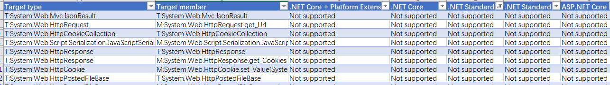
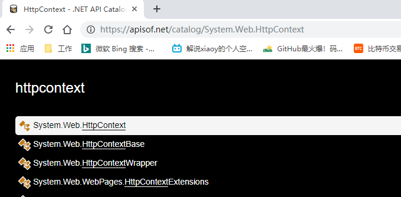
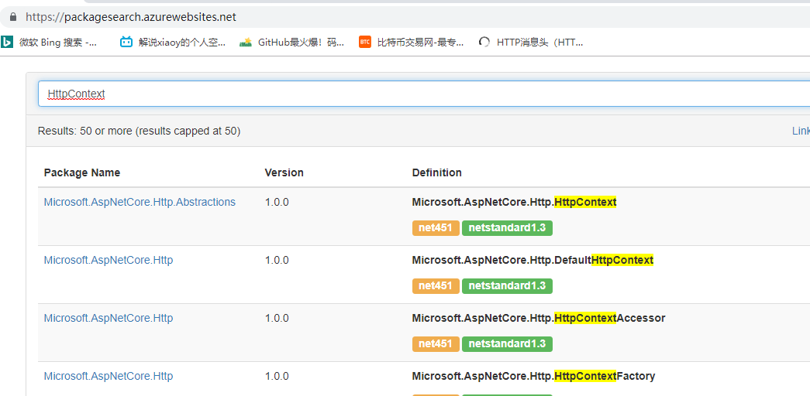
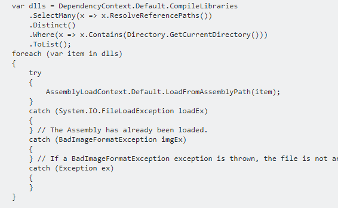

 [为什么要从.NET迁移到.NET Core？](https://www.cnblogs.com/heyuquan/p/dotnet-migration-to-dotnetcore.html?tdsourcetag=s_pctim_aiomsg#title1)

​     [ .NET Core提供的特性](https://www.cnblogs.com/heyuquan/p/dotnet-migration-to-dotnetcore.html?tdsourcetag=s_pctim_aiomsg#title1.1)

​     [ .NET Core性能提升](https://www.cnblogs.com/heyuquan/p/dotnet-migration-to-dotnetcore.html?tdsourcetag=s_pctim_aiomsg#title1.2)

[.NET如何迁移到.NET Core？](https://www.cnblogs.com/heyuquan/p/dotnet-migration-to-dotnetcore.html?tdsourcetag=s_pctim_aiomsg#title2)

​      [迁移工作量评估（API兼容性分析）](https://www.cnblogs.com/heyuquan/p/dotnet-migration-to-dotnetcore.html?tdsourcetag=s_pctim_aiomsg#title2.1)

​      [迁移方案制定](https://www.cnblogs.com/heyuquan/p/dotnet-migration-to-dotnetcore.html?tdsourcetag=s_pctim_aiomsg#title2.2)

​      [通过类名、命名空间，查询API的实现信息](https://www.cnblogs.com/heyuquan/p/dotnet-migration-to-dotnetcore.html?tdsourcetag=s_pctim_aiomsg#title2.3)

​      [类库项目、应用项目如何选择框架类型](https://www.cnblogs.com/heyuquan/p/dotnet-migration-to-dotnetcore.html?tdsourcetag=s_pctim_aiomsg#title2.4)

​      [迁移到.NET Core，但只运行在windows平台上](https://www.cnblogs.com/heyuquan/p/dotnet-migration-to-dotnetcore.html?tdsourcetag=s_pctim_aiomsg#title2.5)

​      [兼容.NET Core或.NET Standard API](https://www.cnblogs.com/heyuquan/p/dotnet-migration-to-dotnetcore.html?tdsourcetag=s_pctim_aiomsg#title2.6)

​      [迁移EF框架](https://www.cnblogs.com/heyuquan/p/dotnet-migration-to-dotnetcore.html?tdsourcetag=s_pctim_aiomsg#title2.7)

​      [修改为 ASP.NET Core 风格的应用](https://www.cnblogs.com/heyuquan/p/dotnet-migration-to-dotnetcore.html?tdsourcetag=s_pctim_aiomsg#title2.8)

 

  这篇文章，汇集了大量优秀作者写的关于".NET迁移到.NET Core"资料文章以及微软官方教程文档。是我在迁移公司框架项目到.NET Core和.NET Standard时遇到的问题，并将相关资料整理成这篇文章。记录如何一步一步把项目迁移到.NET Core。

在此感谢这些革命前辈，填平的坑，走出的路……

 

# 为什么要从.NET迁移到.NET Core？

## .NET Core提供的特性

1.开源、免费

2.轻量级、跨平台

3.组件化、模块化、IOC+Nuget、中间件

4.高性能

5.统一了MVC和WebAPI编程模型

a) 比如：ASP.NET Core 中MVC 和Web API 继承同一个基类，提供可使用的API也一致化

b) 比如：旧ASP.NET时代，写全局filter需要针对MVC 和Web API 分别编写代码，但在ASP.NET Core，直接使用一套中间件代码即可

6.可测试性

7.微服务、容器化支持

8.标准化 .NET API 规范- .NET STANDARD，整体架构如下图：

[![clip_image002[4\]](https://img2018.cnblogs.com/blog/106337/201906/106337-20190610092131720-1900110853.jpg)](https://img2018.cnblogs.com/blog/106337/201906/106337-20190610092131266-1353488742.jpg)

 

## .NET Core性能提升

1.TechEmpower机构

  TechEmpower机构会定期对各语言主流的web框架做性能测试

  <https://www.techempower.com/benchmarks/>

2.博客园博主、微软MVP – 杨晓东，做的 “Hello World”性能测试

[ASP.NET Core 1.1性能对比评测（ASP.NET，Python，Java，NodeJS）](https://www.cnblogs.com/savorboard/archive/2016/10/17/dotnet-benchmarks.html)

| **编号** | **对比方**                     | **系统环境** | **宿主环境**         | **测试结果（QPS）** |
| -------- | ------------------------------ | ------------ | -------------------- | ------------------- |
| 1        | ASP.NET Core vs ASP.NET Core   | Windows      | Kestrel vs IIS       | 45.6k vs 15.2k      |
| 2        | ASP.NET Core vs ASP.NET        | Windows      | IIS vs IIS           | 15.2k vs 18.2k      |
| 3        | ASP.NET Core vs ASP.NET        | Windows      | Kestrel vs IIS       | 45.6k vs 18.2k      |
| 4        | ASP.NET Core vs Python Django  | Linux        | Kestrel vs uwsgi     | 26.7k vs 1.57k      |
| 5        | ASP.NET Core vs Java Servlet   | Linux        | Kestrel vs Tomcat    | 26.7k vs 18.3k      |
| 6-1      | ASP.NET Core vs NodeJS Express | Linux        | Kestrel vs self host | 26.7k vs 15.6k      |
| 6-2      | ASP.NET Core vs NodeJS Koa     | Linux        | Kestrel vs self host | 26.7k vs 17.5       |

[![clip_image003[4\]](https://img2018.cnblogs.com/blog/106337/201906/106337-20190610092132546-73880637.png)](https://img2018.cnblogs.com/blog/106337/201906/106337-20190610092132140-1916204031.png)

性能测试工具：

​    微软出品：Benchmarks

​    <https://github.com/aspnet/benchmarks>

其他阅读：

​    [是什么优化让 .NET Core 2.0性能飙升？](https://www.cnblogs.com/tuding/p/7336029.html)

​    [.NET Core 3中的性能提升（译文）](https://zhuanlan.zhihu.com/p/66152703)

​    [Java(11,12) 与 .NET Core(2.2,3.0)的性能对比测试](https://blog.csdn.net/hez2010/article/details/86551299)

 

# .NET如何迁移到.NET Core？

## 迁移工作量评估（API兼容性分析）

[度量.net framework 迁移到.net core的工作量](http://www.cnblogs.com/vveiliang/p/7402409.html)

[可移植性分析工具：.NET Portability Analyzer](https://github.com/Microsoft/dotnet-apiport)

 [【Cli 版本】](https://github.com/Microsoft/dotnet-apiport/tree/dev/docs/Console)  [【Visual Studio Extension 版本】](https://github.com/Microsoft/dotnet-apiport/tree/dev/docs/VSExtension)

  评估会给出类似如下报告：

 

  [.NET Standard Versions](https://github.com/dotnet/standard/blob/master/docs/versions.md)

[![clip_image005[4\]](https://img2018.cnblogs.com/blog/106337/201906/106337-20190610092133279-1926348004.jpg)](https://img2018.cnblogs.com/blog/106337/201906/106337-20190610092132928-1640340643.jpg)

 

## 迁移方案制定

微软官方[《组织项目以支持 .NET Framework 和 .NET Core》](https://docs.microsoft.com/zh-cn/dotnet/core/porting/project-structure#replace-existing-projects-with-a-multi-targeted-net-core-project)文章中，有介绍两种迁移方案：

方案一、将现有项目和 .NET Core 项目合并为单个项目（多目标框架）

方案二、将现有项目和新的 .NET Core 项目分离（拷贝到新项目）

​    

## 通过类名、命名空间，查询API的实现信息

迁移过程中，有类库命名空间被调整，nuget归属包被调整，具体类库在.NET Core哪个版本中被实现也不是很清楚，通过下面两个查询助手，即可解决这些问题。

1、[查询命名空间、类库在哪个nuget package包中定义（第一次查询比较慢）](https://packagesearch.azurewebsites.net/)

2、[查询 NET API 在各版本中实现](https://apisof.net/catalog/)

结果图如下：

 

## 类库项目、应用项目如何选择框架类型

1.[如何组织一个同时面向多目标框架的 C# 项目解决方案](https://walterlv.com/post/organize-csharp-project-targeting-multiple-platforms.html)

2..NetStandard;.netCore;FX(.NetFrameWork)之间引用关系

在 .NET Standard 2.0中，我们使在 .NET Standard 库中通过一个兼容层去引用已有的 .NET Framework 的库成为可能。当然，这只对那些只使用了适用于 .NET Standard API 的 .NET Framework 库有效。 

[![clip_image006[4\]](https://img2018.cnblogs.com/blog/106337/201906/106337-20190610092133964-1647470901.png)](https://img2018.cnblogs.com/blog/106337/201906/106337-20190610092133572-1136791708.png)

FX引用.NetCore:不通过

.NetStandard引用.NetCore:不通过

 

.NetCore引用FX:通过

.NetCore引用.NetStandard:通过

.NetStandard引用FX:通过

FX引用.NetStandard:通过

 

具体参见：

  [【译】介绍 .NET Standard](https://www.cnblogs.com/jinanxiaolaohu/p/10681024.html) -- [【原文】](https://devblogs.microsoft.com/dotnet/introducing-net-standard/)

  [关于.net core 和 .net fx相互引用的问题](https://q.cnblogs.com/q/103398/)

[.NetStandard;.netCore;FX(.NetFrameWork)之间引用关系](http://www.cnblogs.com/xiaoliangge/p/7475268.html)

3.项目支持多目标框架

[支持多目标框架，并解决第三方库引用差异的问题（在 csproj 文件中指定包含条件）](https://walterlv.com/post/configure-projects-to-target-multiple-platforms.html)

[目标框架名称列表 （命名全小写）](https://docs.microsoft.com/zh-cn/nuget/reference/target-frameworks)

[如何调试多目标框架类库？](http://www.cnblogs.com/Greenseer/p/7611943.html)

[NET Standard/Core项目使用条件判断输出多版本xml注释文档](https://blog.csdn.net/starfd/article/details/78839704)

4.多目标框架中共享代码方案

1、【首选】.NET Standard，需要目标SDK支持对应的 .NET Standard 版本。

2、共享项目。直接共享了源码，只要在目标项目中指定了条件编译符，那么源码便能针对各种不同的目标框架进行分别编译。

3、[add as link][使用链接共享 Visual Studio 中的代码文件](https://walterlv.com/visualstudio/2016/08/01/share-code-with-add-as-link.html)

5.条件编译符号 （命名全大写）

指令： #if #elif #else #endif （||、&&、!）

因为目标框架提供的API不相同。故必要时可添加条件编译符号以便支持不同的运行时版本。

微软有针对各个目标框架有预定义预处理器符号，vs编译时会自动识别到这些框架条件编译符号。 

.NET Framework 4.5 --> NET45 

.NET Framework 4.6 --> NET46

.NET Framework 4.6.1 --> NET461

.NET Standard 1.0 --> NETSTANDARD1_0

.NET Standard 1.6 --> NETSTANDARD1_6

.NETCOREAPP 2.0 --> NETCOREAPP2_0 

参考：

[#if指令文档](https://docs.microsoft.com/zh-cn/dotnet/csharp/language-reference/preprocessor-directives/preprocessor-if)

[如何将条件编译符号(DefineConstants)传递给msbuild](http://www.voidcn.com/article/p-nsrcccet-btr.html)

 

## 迁移到.NET Core，但只运行在windows平台上

[使用 Windows 兼容性包将代码移植到 .NET Core](https://docs.microsoft.com/zh-cn/dotnet/core/porting/windows-compat-pack)

[如何：将 Windows 窗体桌面应用程序移植到 .NET Core](https://docs.microsoft.com/zh-cn/dotnet/core/porting/winforms)

[如何：将 WPF 桌面应用移植到 .NET Core](https://docs.microsoft.com/zh-cn/dotnet/core/porting/wpf)

 

## 兼容.NET Core或.NET Standard API

[迁移HttpHandler与HttpModule到 ASP.NET Core 中间件](https://docs.microsoft.com/en-us/aspnet/core/migration/http-modules?view=aspnetcore-2.2)

[.NET CORE 2.0 踩坑记录之ConfigurationManager](http://www.cnblogs.com/binbinxu/p/7440342.html)

.NET Core/Standard 2.0 编译时报“CS0579: Duplicate 'AssemblyFileVersionAttribute' attribute”错误

1.[自动生成AssemblyInfo的原理](http://www.cnblogs.com/zyl910/p/dotnet_standard_cs0579_duplicate_attribute.html)

2.[解决方案：不自动创建 AssemblyInfo 文件](https://cloud.tencent.com/developer/article/1402303)

[ASP.NET Core开发之HttpContext](http://www.cnblogs.com/linezero/p/6801602.html)

[.net core 使用JsonConvert替代JavaScriptSerializer](https://my.oschina.net/idoop/blog/915555)

[ASP.NET Core 中重复读取 Request.Body 的正确姿势](http://www.cnblogs.com/dudu/p/9190747.html)

JsonRequestBehavior在core中被移除的问题

1.[[ASP.NET MVC\]解决"若要允许 GET请求，请将 JsonRequestBehavior 设置为AllowGet"](https://shiyousan.com/post/635428880708292949)

2.[ASP.NET Core]core中不会抛出AllowGet异常，对于DenyGet则使用[HttpPost]代替

<https://stackoverflow.com/questions/38578463/asp-net-core-the-name-jsonrequestbehavior-does-not-exist-in-the-current-cont>

<https://stackoverflow.com/questions/8464677/why-is-jsonrequestbehavior-needed?r=SearchResults>

[获取ASP.NET Core中的Web根路径和内容根路径（移除的MapPath）](http://beidouxun.com/Articles/Details/419f4786-679c-4316-b2bb-baea26c94205)

[为什么我的会话状态在ASP.NET Core中不工作了？](https://www.cnblogs.com/lwqlun/p/10526380.html)

由于ASP.NET Core 2.1中引入的Cookie同意和非必要cookie的GDPR功能引起。（GDPR，即General Data Protection Regulation，《通用数据保护条例》）

 

在ASP.NET4.5和ASP.NET Core中共享cookies认证信息（加解密方式不一致问题）

   <https://www.cnblogs.com/cmt/p/5940796.html>

   <https://github.com/blowdart/idunno.CookieSharing>

[ASP.NET Core如何获取客户端IP地址（被移除的ServerVariables对象）](http://www.cnblogs.com/dudu/p/5972649.html)

在ASP.NET Core中 BuildManager.GetReferencedAssembiles() 的替代方案

1、AppDomain.CurrentDomain.GetAssemblies()

2、<https://stackoverflow.com/questions/53989393/is-there-an-alternative-for-buildmanager-getreferencedassemblies-in-asp-net-co>

  （可以正常注入使用，但是调试时会报FileNotFoundException）

  

[.NET Core 2.0迁移System.Runtime.Caching](http://www.cnblogs.com/mantgh/p/7429551.html)

 

## 迁移EF框架

[【微软官方】从 EF6 到 EF Core的迁移系列](https://docs.microsoft.com/zh-cn/ef/efcore-and-ef6/porting/)

[【微软官方】EF Core 版本升级迁移系列](https://docs.microsoft.com/zh-cn/ef/core/what-is-new/ef-core-2.2)

 

## 修改为 ASP.NET Core 风格的应用

  按照上面的方式修改API兼容性后，框架类库可以顺利迁移到.NET Core，编译通过，代码运行也正常。但是ASP.NET Core风格的应用，其写法也是有很多变化的。具体参考下面文档：

[将传统 ASP.NET 应用迁移到 .NET Core](https://mp.weixin.qq.com/s?__biz=MzAwNTMxMzg1MA==&mid=2654072516&idx=3&sn=af3916ec4e2c31c231f5f01be75712d8&chksm=80dbca91b7ac43870a3fa4dce10f5a97adf1548d1381a99f27972c67c00a1e593aa926b110ad&mpshare=1&scene=23&srcid=0311kxbJ5rwkIYu7xO2Yx08U)

[【微软官方】ASP.NET 迁移到 ASP.NET Core教程系列](https://docs.microsoft.com/zh-cn/aspnet/core/migration/proper-to-2x/?view=aspnetcore-2.2)

[【微软官方】ASP.NET Core 版本升级迁移系列](https://docs.microsoft.com/zh-cn/aspnet/core/migration/20_21?view=aspnetcore-2.2)

 

  后续，我会再整理一篇 《ASP.NET Core 学习教程》 资源汇总的文章，目的是有条理的汇总大量优秀的ASP.NET Core知识点文章，方便大家学习和知识查找。

 

==============================================================================

over，谢谢查阅，觉得文章对你有收获，请多帮推荐。欢迎提供更好的资料信息。

 

 

 