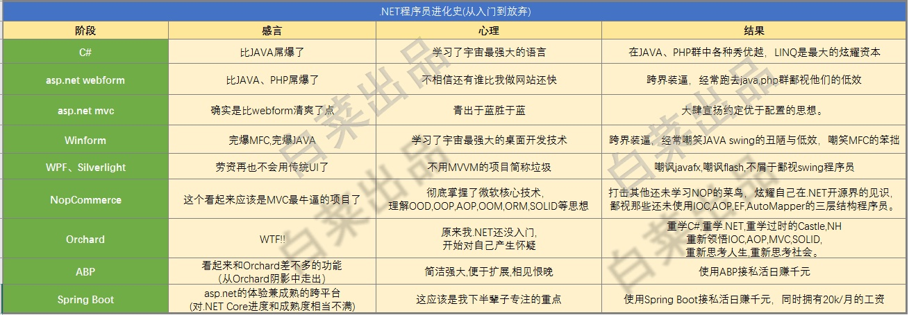

## [vczh](https://www.zhihu.com/people/excited-vczh) 专业造轮子

，拉黑抢前排。gaclib.net

[粒粒肥](https://www.zhihu.com/people/li-li-fei-5)、[刘雨培](https://www.zhihu.com/people/liuyupei)等得看赵四本，[@赵劼](https://www.zhihu.com/people/78e3b98074a915b222ae1be4ab038a6e)推荐的。

###	CLR via C#

###	.net Essentials

###	C# in Depth

###	Framework Design Guideline

[编辑于 2014-09-22

---

##	ABP-SpringBoot

](https://www.zhihu.com/question/25474641/answer/30838101)

---

## 心得

###	作者：在好

链接：https://www.zhihu.com/question/25474641/answer/336627897

来源：知乎

著作权归作者所有。商业转载请联系作者获得授权，非商业转载请注明出处。

**1.一技之长**

新技术层出不穷，而内核的精髓的东西却变化不大，就像.NET，从VS2003到VS2012，已经有10个年头，VS的版本不断更新，而.NET内核的最新版本也才4.0，所以，作为程序员，我们要多掌握内核的东西，精髓的东西。

我们的学习积累毛病在于：贪多、贪全、而不够深入。对于很多技术，我们都很有兴趣，对于刚兴起的技术，也紧紧跟随。但是，几乎都是蜻蜓点水、一知半解。回头想想，我们似乎什么都会一点，什么类型的项目都可以做，B/S的、C/S的、数据库的、分布式的，等等，但是，却不敢说，在某某方面，我的水平已经超越了圈中同类型的80%的人。只是我能做的，大家都会做，而且，我也没有把握比别人做得更好。

必须要让自己有价值，而自己的价值在于不可替代性或是难以替代性。如果，随便找个程序员就能把你replace掉，你的价值就很低廉了。如果在你负责的某个方面，只有20%的人超越你，那你的价值、你的重要性就凸显出来了，你与雇主的关系就从被动转向了主动，你就有了谈判的筹码。

在专业化高度分工的今天，一技之长并不是说需要你掌握某个很大的方面，而只需要你能掌握其中的某一个小的领域，并不断地深入下去。就这个小的领域来说，你花个3、5年的时间挤进前20%是非常可能的。比如，有人专门研究SqlServer数据库优化、有人专攻TCP通信、有人深入研究IIS、有人深入钻研WCF，等等。

**2.打造自己的精品**

当你在某个小领域钻研了3、5年后，你一定会有很多心得，积累了很多经验，其中有些经验是异常宝贵的，为什么了？因为在钻研这个领域一段时间后，会陆续碰到很多问题，而那些80%的人，在碰到某个问题时就停止向前了，在这个小领域的水平就到此为止了，而你却不断地解决这些问题，不断地超越那80%的人。

而且，很可能的一个情况是，作为几年钻研的一个副产品，你积累了一套类库或框架，而基于该类库或框架来开发该领域的项目，不仅开发速度更快，效率更高，而且项目的质量更有保证。然后，你可以把积累的这套类库/框架打造成一个精品，不断的打磨，直到某一天，可以让更多的人来用它。

当你在某一领域有了丰富的经验，或者有了自己的精品类库/框架之后，你便可以面向更广阔的市场。

**3.更广阔的市场**

在公司做个小白领，你的生死荣禄几乎就完全掌握在你的上司手中，你不得不关注他，被他的情绪所左右，很可能因为他的一句批评，你就整夜难眠。你觉得自己做得很好，可是他不认可。但是现在，你不需要再过分的关注他，你可以将眼光转向更广阔的市场。

互联网时代的一个好处就是，任何人都可以以非常低廉的成本来向大众市场展示自己或自己的产品，评判你价值的不再（仅仅）是你上司，而是整个市场，相比于你的上司，市场的评判会更客观、更公正。你可以把自己的经验能力说明放到自己的博客上、写专业的技术文章来分享知识、顺便推广自己，或者把积累的框架放到网上去卖，或者去项目交易平台接那些与你精通的领域对口的项目，由于在这个领域你超越了80%的人，所以，成功接到项目的可能性是非常之大的。有了这些基础，以后就算是靠技术创业也是有可能的。

如果做到了这三点，我想，你的“有房有车没贷款的生活”

---

---

###	[阿里云云栖社区](https://www.zhihu.com/org/a-li-yun-yun-qi-she-qu-48)

已认证的官方帐号

 原文链接：[程序员的成长路线-博客-云栖社区-阿里云](https://link.zhihu.com/?target=http%3A//click.aliyun.com/m/10673/)

工作这么些年了，看到了各种各样的程序员，也看到了各种各样的成长路线，说说自己的一些观点吧。 

作为技术人员，在刚起步阶段时，首先需要拓宽自己的技术宽度，对自己所做的项目/产品所涉及的方方面面的技术都应该有所了解，另外对于就是学习工程化，让自己真正具备开发商业软件的能力。

在工程化和知识宽度达到一定阶段后，需要开始根据自己的兴趣和工作内容有所选择，主要是加强在某一领域的技术深度。

在技术深度达到了一定阶段后，需要对自己做出一个选择，就是偏业务方向，还是偏基础技术方向。

偏业务方向的技术人员，我认为做的好的表现是： 1. 对业务发展的未来有一定的预判，有商业敏感意识； 2. 能对复杂的业务进行合理的抽象； 3. 在系统的设计上能对未来业务的变化有一定的预留处理。

偏基础方向的技术人员，我认为做的好的表现是： 1. 能结合业务的发展趋势对基础技术的方向有一定的预判，避免业务发展受到基础技术的拖累； 2. 对业界的技术发展方向有自己的认知和判断； 3. 在对应的基础技术领域有不错的技术深度。

结合自己的特质以及当前的一些状况，做出一个选择，重点发展。

而再往更高阶走的同学，通常就会出现一种新的角色，就是成为团队leader，做为一个技术团队的leader，无论是业务的还是基础技术的，在技术能力上还是不能差的，尤其是判断力上，另外，作为一个团队leader，就意味着承担了团队方向的判断的职责，一个团队的方向基本会直接影响到团队所有成员的未来，以及所支持的业务的发展状况，所以对于一个团队leader，我觉得最重要的能力就在方向的判断上，然后是根据方向的判断的组织建设（团队搭建，人才识别、培养、招募等）能力。

如果不是往leader方向呢，那基本就是往架构师方向为多，架构师的话，在至少一两个领域的深度外，对广度的要求非常高，还有同样就是判断能力，无论是业务架构师，还是基础方向的架构师，领域的知识宽度是非常重要的，意味着能做多大范围的事，判断能力会体现出一个架构师在做一个架构设计时重点是怎么判断的，在有限的资源和时间情况下取舍是怎么做的，对未来是怎么做铺垫的，以及TA对事情的技术控制能力，一个好的架构师在技术风险的控制能力上必须是非常强的，例如一个强大的基础领域的架构师，应该是可以很好的控制跨多个专业技术领域的技术演进。

还有一种是往专业技术深度领域方向走，例如内核、JVM等，这些领域是真正的需要非常深的技术功底才能hold的住的。

还会有其他例如转型往业务产品方向等发展的就不在这说了。

总而言之，言而总之，我觉得在整个成长过程中，兴趣是最为关键的，所以follow  your  heart非常重要，只有在有足够的兴趣或梦想的情况下才能产生很强的自驱，没有足够的自驱我觉得在技术领域基本上是不可能走到高阶的，除了兴趣外，自己的优势也要判断清楚，每个不同的方向，我自己认为还是需要一定的天分的，而所谓的天分我觉得就是对个人优势的判断。

ps: 我曾经很多次想过是不是也可以在厂内搞搞什么午餐会，例如每两周和一位自愿聊的同学交流职业发展、工作的困惑什么的（在各种晋升面试中看到很多时候是因为没思考清楚自己的职业路线，导致讲的时候就会没有重点），一直没搞起就觉得这样貌似有点奇怪。

[发布于 2017-02-17](https://www.zhihu.com/question/25474641/answer/146925935)

---

