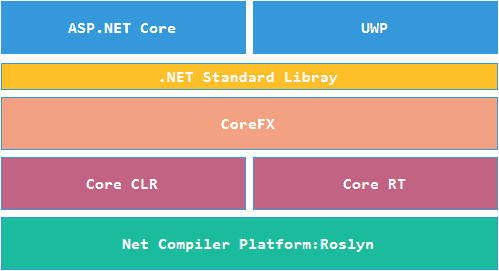
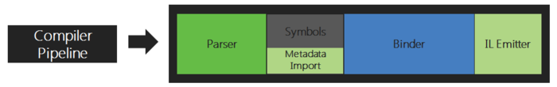
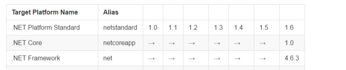
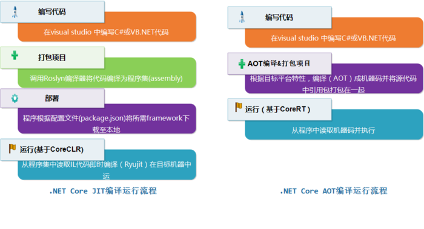

# 简析 .NET Core 构成体系


   [xdpie](https://www.jianshu.com/u/cbb08aa49717)          2017.09.07 09:51*               字数 2008             阅读 595评论 0喜欢 0

- 简析 .NET Core 构成体系
  - [Roslyn 编译器](https://www.jianshu.com/p/6dbc9f51a561#roslyn-编译器)
  - [RyuJIT 编译器](https://www.jianshu.com/p/6dbc9f51a561#ryujit-编译器)
  - [CoreCLR & CoreRT](https://www.jianshu.com/p/6dbc9f51a561#coreclr-corert)
  - [CoreFX(.NET Core Libraries)](https://www.jianshu.com/p/6dbc9f51a561#corefxnet-core-libraries)
  - [.NET Core 代码开发、部署、运行过程](https://www.jianshu.com/p/6dbc9f51a561#net-core-代码开发部署运行过程)
  - [总结](https://www.jianshu.com/p/6dbc9f51a561#总结)

**前文介绍了.NET Core 在整个.NET 平台所处的地位，以及与.NET Framework的关系**([原文链接](https://link.jianshu.com?t=http://www.xdpie.com/2017/09/09/dotnet-core-structure/))，本文将详细介绍.NET Core 框架的构成和各模块主要功能，以及如何实现跨平台。




构成体系

上图描述了 .NET Core的系统构成，最上层是应用层，是开发基于UI应用的框架集，包括了ASP.NET Core(用于创建web app)，和 UWP(用于创建Windows10 app)。

中间层是公共库(CoreFX),实现了.NET Standard Library ,囊括了常用系统级操作例如（文件、网络等）。

在CoreFx下是运行时环境，.NET Core  包含了两种运行时(CoreCLR、CoreRT),CoreCLR是一种基于即时编译程序(Just in time  compiler,JIT)的运行时,它使用了跨平台开源的编译器RyuJIT,而CoreRT是使用提前编译器(Ahead of time  compiler,AOT)的运行时,它既可以使用RyuJIT来实现AOT编译也可以使用其他的AOT编译器。由于AOT提前编译IL成了机器码，在移动设备上也具有更好的启动速度和节能性。

最后还要提到一个开源的跨平台源代码编译器Roslyn，它有别于刚才两个编译器，JIT和AOT编译器主要用于将IL编译成本机机器码，而Roslyn是将C# 或 VB.NET 代码编译成程序中间语言(intermediate language,IL)。

## Roslyn 编译器

Roslyn编译器用于将C#或VB.NET代码编译为程序集(assembly)，它的编译过程是一个管道式的处理过程一共包含4个步骤，具体过程见下图。




compiler pipeline

**A. Parser(解析)**

根据语法对源代码进行解析。

**B. Declaration (声明)**

为代码生成元数据(metadata),元数据是一个数据表的集合，描述了在当前代码中定义的数据类型和成员，同时也描述了引用的类型及成员。

**C. Bind(绑定)**

将生成的IL代码与描述它的元数据绑定在一起，生成托管模块(managed module)。

**D. Emit(生成)**

将一个或多个托管模块合并生成程序集(assembly)。

## RyuJIT 编译器

在程序运行中需要执行某一个方法，首先需要将已经编译好的IL转换本机的机器码，而这个任务就交给了RyuJIT。它是新一代JIT编译器，第一次实现了AMD64的架构，RyuJIT能够比JIT64(上一代编译器)更快地生成代码，以提高程序运行效率([测试详情链接](https://link.jianshu.com?t=https://blogs.msdn.microsoft.com/dotnet/2013/09/30/ryujit-the-next-generation-jit-compiler-for-net/))。

## CoreCLR & CoreRT

CoreCLR 和 CoreRT 都是.NET Core的运行时(Runtime),
 它们提供了与.NET Framework CLR 类似的核心功能(内存管理、程序集加载、安全性、异常、线程管理等)，可由面向于运行时的所有语言使用。

CoreRT 和 CoreCLR 不同的是，CoreRT 提供了一套
 AOT 的机制,可以将.NET Core程序编译成原生代码，不依赖 .NET 运行时而运行在宿主机器上。除此之外两个运行时大部分功能代码是共享的，比如GC。AOT的优化带来不少好处：

- **编译后生成一个单文件，包含所有的依赖，包括 CoreRT，无需安装Framework**
- **启动时是机器码，不需要生成机器码，也不要加载JIT编译器**
- **可以使用其他优化编译器，包括 LLILC ,IL to CPP**

CoreRT有两个方式生成机器码，第一个使用是直接编译IL成机器码，默认情况下，RyuJIT 作为一个 AOT 编译器将IL编译成机器码，另一个方式是将C#代码编译成C++代码，然后调用对应平台的C++编译器优化编译成机器码。

**使用 RyuJIT 编译成机器码**

```
dotnet restore
dotnet build --native --ilcpath <repo_root>\bin
\Product\Windows_NT.x64.Debug\packaging\publish1
```

**编译生成 C++ 代码**

```
dotnet restore
dotnet build --native --cpp --ilcpath <repo_root>\bin\Product\Windows_NT.x64.Debug\packaging\
publish1 --cppcompilerflags /MTd
```

CoreRT也有不足之处，它需要为不同平台编译一次；但凡事有但是，它允许工程师可以不发布到不想支持的平台（比如某游戏仅支持桌面，不支持手机）。

> 注：这两个命名在.NET Core RC2 版本中均无法使用，按照官方说法是在当前版本中已经移除这个命令了，具体等6月27日正式版发出后才知道最后的情况

## CoreFX(.NET Core Libraries)

CoreFX主要包含数个公共库，例如  System.Collections, System.IO,  System.Xml等。CoreFX是 .NET Standard Library 的实现，同样的.NET Framework  4.6.3也是基于.NET Standard Library的实现。它们目前都是基于.NET Standard  Library1.6版本，具体见下表：




standard

## .NET Core 代码开发、部署、运行过程




编译

从上图可以看到使用JIT编译和使用AOT编译源代码并运行程序是两种不同的流程。

如果使用JIT编译器部署程序时只需要将程序打包为IL的assemblies，在方法第一次执行前编译器将IL编译为目标机机器码(Native code)，而AOT编译会在编译时将源代码直接编译为目标机机器码。

AOT将源代码编译为机器码，拥有如下特性：

- **用静态代码替换反射，例如如果一个值类型(value type)没有重写 ValueType.Equals  的equals的方法，默认情况判断相等，会使用反射找到filedinfo以确定type是否相等，然后再比较value是否相等。而在AOT编译中由于替换了反射因此只能比较value是否相等。**
- **依赖的第三方类库以及.NET Libraries均打包至最终编译的程序中。**
- **打包后的程序运行在一个精简版的运行时上(CoreRT)主要包含垃圾回收器，而运行时也会打包在app文件中。**
- **虽然编译时会替换反射代码，但遇动态反射代码无能为力，运行时若遇动态反射调用则会因找不到对应的元数据及实现而抛出异常。解决办法是编译前配置运行时指令文件(Runtime directive file)指定需要用到的程序集。**

## 总结

本节介绍了.NET Core的构成体系，包括新增的多个编译器以及遵循.NET Standard Library的CoreFX,总体来说.NET Core较之前的.NET Framework 从性能和开发效率上都有很大的提升。`关键是首次实现了.NET的完全跨平台能力的基础技术栈。`

.NET Core 基于跨平台能力，并没有将与 GUI 高度相关的 API 移植到 .NET Core 内，`因此像是 Windows Forms 或是 Windows Presentation Foundation (WPF) 并未移植到 .NET Core。`.NET Core 支持控制台应用程序 (Console Application) 以及类库 (Class Library) 类型的项目。

不过微软在其 Universal Windows Platform (UWP) 开发平台使用了 .NET Core，并且利用 `.NET Native 技术将其性能提升至十分接近原生码的速度。`

ASP.NET Core 则以控制台应用程序驱动其托管环境 `Kestrel Server` 以支持 ASP.NET Core 程序的运行。

------

> 作者：xdpie 原出处： [http://www.xdpie.com/2017/09/09/dotnet-core-structure/](https://link.jianshu.com?t=http://www.xdpie.com/2017/09/09/dotnet-core-structure/)

**参考链接**

【1】[https://github.com/dotnet/corefx/blob/master/Documentation/architecture/net-platform-standard.md](https://link.jianshu.com?t=https://github.com/dotnet/corefx/blob/master/Documentation/architecture/net-platform-standard.md)

【2】[https://github.com/dotnet/corefx](https://link.jianshu.com?t=https://github.com/dotnet/corefx)

【3】[https://github.com/dotnet/corefx/blob/master/Documentation/project-docs/glossary.md](https://link.jianshu.com?t=https://github.com/dotnet/corefx/blob/master/Documentation/project-docs/glossary.md)

【4】[https://www.microsoft.com/net/core#windows](https://link.jianshu.com?t=https://www.microsoft.com/net/core#windows)

【5】[https://msdn.microsoft.com/en-us/library/dn807190(v=vs.110).aspx](https://link.jianshu.com?t=https://msdn.microsoft.com/en-us/library/dn807190(v=vs.110).aspx)

【6】[https://blogs.msdn.microsoft.com/dotnet/2013/09/30/ryujit-the-next-generation-jit-compiler-for-net/](https://link.jianshu.com?t=https://blogs.msdn.microsoft.com/dotnet/2013/09/30/ryujit-the-next-generation-jit-compiler-for-net/)

【7】[https://zh.wikipedia.org/wiki/.NET_Core](https://link.jianshu.com?t=https://zh.wikipedia.org/wiki/.NET_Core)

小礼物走一走，来简书关注我


​                      .Net Core 

​           © 著作权归作者所有         

​      