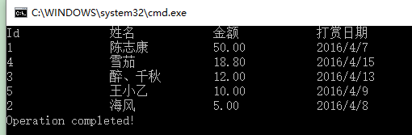

**返回《8天掌握EF的Code First开发》总目录**

------

## 本篇目录

- [管理数据库创建](https://www.cnblogs.com/farb/p/ManageDBCreationAndSeeding.html#managementForCreating)
  - **管理数据库连接**
  - **管理数据库初始化**
- **填充种子数据**
- [LINQ to Entities详解](https://www.cnblogs.com/farb/p/ManageDBCreationAndSeeding.html#linqDetails)
  - **什么是LINQ to Entities**
  - **使用LINQ to Entities操作实体**
  - **LINQ操作**
  - **懒加载和预加载**
  - **插入数据**
  - **更新数据**
  - **删除数据**
- **本章小结**
- **自我测试**

------

本篇的源码下载：**点击下载**
 先附上codeplex上EF的源码：**entityframework.codeplex.com**，此外，本人的实验环境是VS 2013 Update 5，windows 10,MSSQL Server 2008。

上一篇**《Code First开发系列之领域建模和管理实体关系》**，我们主要介绍了EF中“约定大于配置”的概念，如何创建数据库的表结构，以及如何管理实体间的三种关系和三种继承模式。这一篇我们主要说三方面的问题，数据库创建的管理，种子数据的填充以及CRUD的操作详细用法。

## 管理数据库创建

### 管理数据库连接

#### 使用配置文件管理连接

在数据库上下文类中，如果我们只继承了无参数的DbContext，并且在配置文件中创建了和数据库上下文类同名的连接字符串，那么EF会使用该连接字符串自动计算出该数据库的位置和数据库名。比如，我们的上下文定义如下：

```
public class SampleDbEntities : DbContext
{
// Code here
}
```

如果我们在配置文件中定义的连接字符串如下：

```
<connectionStrings>
<add name="SampleDbEntities" connectionString="Data Source=(LocalDb)\v11.0;Initial Catalog=myTestDb;Integrated Security=SSPI;AttachDBFilename=|DataDirectory|\myTestDb.mdf" providerName="System.Data.SqlClient" />
</connectionStrings>
```

这样，EF会使用该连接字符串执行数据库操作。究竟发生了什么呢？

当运行应用程序时，EF会寻找我们的上下文类名，即“SampleDbEntities”，并在配置文件中寻找和它同名的连接字符串，然后它会使用该连接字符串计算出应该使用哪个数据库provider,之后检查数据库位置（例子中是当前的数据目录），之后会在指定的位置创建一个名为*myTestDb.mdf*的数据库文件，同时根据连接字符串的*Initial Catalog*属性创建了一个名为*myTestDb*的数据库。

> 使用配置文件指定数据库位置和名字对于控制上下文类的连接参数也许是最简单和最有效的方式，另一个好处是如果我们想为开发，生产和临时环境创建各自的连接字符串，那么在配置文件中更改连接字符串并在开发时将它指向确定的数据库也是一种方法。
>  这里要注意的重要的事情是在配置文件中定义的连接字符串具有最高优先权，它会覆盖所有在其它地方指定的连接参数。
>  从最佳实践的角度，也许不推荐使用配置文件。注入连接字符串是一种更好的方式，因为它给开发者更多的控制权和监管权。

#### 使用已存在的ConnectionString

如果我们已经有了一个定义数据库位置和名称的ConnectionString，并且我们想在数据库上下文类中使用这个连接字符串，如下：

```
<connectionStrings>
<add name="AppConnection" connectionString="Data Source=(LocalDb)\v11.0;Initial Catalog=testDb;Integrated Security=SSPI;AttachDBFilename=|DataDirectory|\testDb.mdf" providerName="System.Data.SqlClient" />
</connectionStrings>
```

那么我们可以将该连接字符串的名字传入数据库上下文DbContext的构造函数中，如下所示：

```
public class SampleDbEntities : DbContext
{
    public SampleDbEntities()
    :base("name=AppConnection")
    {
    }
}
```

上面的代码将连接字符串的名字传给了DbContext类的构造函数，这样一来，我们的数据库上下文就会开始使用连接字符串了。

> 如果在配置文件中还有一个和数据库上下文类名同名的connectionString，那么就会使用这个同名的连接字符串。无论我们对传入的连接字符串名称如何改变，都是无济于事的，也就是说和数据库上下文类名同名的连接字符串优先权更大。

#### 使用已存在的连接

通常在一些老项目中，我们只会在项目中的某个部分使用EF Code First，同时，我们想对数据上下文类使用已经存在的数据库连接，如果要实现这个，可将连接对象传给DbContext类的构造函数，如下：

```
public class SampleDbEntities : DbContext
{
    public SampleDbEntities( DbConnection con ) : base( con, contextOwnsConnection : false )
    {
    }
}
```

这里要注意一下`contextOwnsConnection`参数，之所以将它作为false传入到上下文，是因为它是从外部传入的，当上下文出了范围时，可能会有人想要使用该连接。如果传入true的话，那么一旦上下文出了范围，数据库连接就会立即关闭。

### 管理数据库初始化

首次运行EF Code First应用时，EF会做下面的这些事情：

1. 检查正在使用的`DbContext`类。
2. 找到该上下文类使用的`connectionString`。
3. 找到领域实体并提取模式相关的信息。
4. 创建数据库。
5. 将数据插入系统。

一旦模式信息提取出来，EF会使用数据库初始化器将该模式信息推送给数据库。数据库初始化器有很多可能的策略，EF默认的策略是如果数据库不存在，那么就重新创建；如果存在的话就使用当前存在的数据库。当然，我们有时也可能需要覆盖默认的策略，可能用到的数据库初始化策略如下：

- `CreateDatabaseIfNotExists`：顾名思义，如果数据库不存在，那么就重新创建，否则就使用现有的数据库。如果从领域模型中提取到的模式信息和实际的数据库模式不匹配，那么就会抛出异常。
- `DropCreateDatabaseAlways`：如果使用了该策略，那么每次运行程序时，数据库都会被销毁。这在开发周期的早期阶段通常很有用（比如设计领域实体时），从单元测试的角度也很有用。
- `DropCreateDatabaseIfModelChanges`：这个策略的意思就是说，如果领域模型发生了变化（具体而言，从领域实体提取出来的模式信息和实际的数据库模式信息失配时），就会销毁以前的数据库（如果存在的话），并创建新的数据库。
- `MigrateDatabaseToLatestVersion`：如果使用了该初始化器，那么无论什么时候更新实体模型，EF都会自动地更新数据库模式。这里很重要的一点是，这种策略更新数据库模式不会丢失数据，或者是在已有的数据库中更新已存在的数据库对象。

> `MigrateDatabaseToLatestVersion`初始化器只有从EF 4.3才可用。

#### 设置初始化策略

EF默认使用`CreateDatabaseIfNotExists`作为默认初始化器，如果要覆盖这个策略，那么需要在DbContext类中的构造函数中使用`Database.SetInitializer`方法，下面的例子使用`DropCreateDatabaseIfModelChanges`策略覆盖默认的策略：

```
public class SampleDbEntities : DbContext
{
    public SampleDbEntities()
        : base( "name=AppConnection" )
    {
        Database.SetInitializer<SampleDbEntities>( new DropCreateDatabaseIfModelChanges<SampleDbEntities>() );
    }
}
```

这样一来，无论什么时候创建上下文类，`Database.SetInitializer`方法都会被调用，并且将数据库初始化策略设置为`DropCreateDatabaseIfModelChanges`。

如果处于生产环境，那么我们肯定不想丢失已存在的数据。这时我们就需要关闭该初始化器，只需要将`null`传给`Database.SetInitializer`方法，如下所示：

```
public class SampleDbEntities : DbContext
{
    public SampleDbEntities()
        : base( "name=AppConnection" )
    {
        Database.SetInitializer<SampleDbEntities>(null);
    }
} 
```

## 填充种子数据

到目前为止，无论我们选择哪种策略初始化数据库，生成的数据库都是一个空的数据库。但是许多情况下我们总想在数据库创建之后、首次使用之前就插入一些数据，此外，开发阶段可能想以admin的资格为其填充一些数据，或者为了测试应用在特定的场景中表现如何，想要伪造一些数据。

当我们使用`DropCreateDatabaseAlways`和`DropCreateDatabaseIfModelChanges`初始化策略时，插入种子数据非常重要，因为每次运行应用时，数据库都要重新创建，每次数据库创建之后再手动插入数据非常乏味。接下来我们看一下当数据库创建之后如何使用EF来插入种子数据。

为了向数据库插入一些初始化数据，我们需要创建满足下列条件的数据库初始化器类：

- 从已存在的数据库初始化器类中派生数据
- 在数据库创建期间种子化

#### 1.0 定义领域实体

假设我们的数据模型Employer定义如下：

```
public class Employer
{
    public int Id { get; set; }
    public string EmployerName { get; set; }
}
```

#### 2.0 创建数据库上下文

使用EF的Code First方法对上面的模型创建数据库上下文：

```
public class SeedingDataContext:DbContext
{
    public virtual DbSet<Employer> Employers { get; set; }
}
```

#### 3.0 创建数据库初始化器类

假设我们使用的是`DropCreateDatabaseAlways`数据库初始化策略，那么初始化器类就要从该泛型类继承，并传入数据库上下文作为类型参数。接下来，要种子化数据库就要重写`DropCreateDatabaseAlways`类的`Seed`方法，而Seed方法拿到了数据库上下文，因此我们可以使用它来将数据插入数据库：

```
public class SeedingDataInitializer:DropCreateDatabaseAlways<SeedingDataContext>
{
    protected override void Seed(SeedingDataContext context)
    {
        for (int i = 0; i < 6; i++)
        {
            var employer = new Employer { EmployerName = "Employer"+(i+1) };
            context.Employers.Add(employer);
        }
        base.Seed(context);
    }
}
```

前面的代码通过for循环创建了6个Employer对象，并将它们添加给数据库上下文类的`Employers`集合属性。这里值得注意的是我们并没有调用`DbContext.SaveChanges()`，因为它会在基类中自动调用。

#### 4.0 将数据库初始化器类用于数据库上下文类

```
public class SeedingDataContext:DbContext
{
    public virtual DbSet<Employer> Employers { get; set; }

    protected SeedingDataContext()
    {
        Database.SetInitializer<SeedingDataContext>(new SeedingDataInitializer());
    }
}
```

#### 5.0 Main方法中访问数据库

```
class Program
{
    static void Main(string[] args)
    {

        using (var db = new SeedingDataContext())
        {

            var employers = db.Employers;
            foreach (var employer in employers)
            {
                Console.WriteLine("Id={0}\tName={1}",employer.Id,employer.EmployerName);
            }
        }
        Console.WriteLine("DB创建成功，并完成种子化！");
        Console.Read();

    }
}
```

#### 6.0 运行程序，查看效果

Main方法中只是简单的创建了数据库上下文对象，然后将数据读取出来：


此外，我们可以从数据库初始化的`Seed`方法中，通过数据库上下文类给数据库传入原生SQL来影响数据库模式。

楼主在实践的过程中，遇到了以下问题，以后可能还会遇到，你也很可能遇到:程序运行时没有错误(有时不会生成数据库)，但在调试时就报下面的错误：

```
The context cannot be used while the model is being created. This exception may be thrown if the context is used inside the OnModelCreating method or if the same context instance is accessed by multiple threads concurrently. Note that instance members of DbContext and related classes are not guaranteed to be thread safe.
```

**提示的错误信息很清楚，但是依然没有找到问题的根本所在，网上也没找到满意的答案（有说更改连接字符串的，有说更新到最新版的EF等等），如果有解决了这个问题园友，欢迎留言！**

## LINQ to Entities详解

到目前为止，我们已经学会了如何使用Code First方式来创建实体数据模型，也学会了使用EF进行领域建模，执行模型验证以及控制数据库连接参数。一旦数据建模完成，接下来就是要对这些模型进行各种操作了，通常有以下两种方式：

- LINQ to Entities
- Entity SQL

本系列教程只讲LINQ to Entities，Entity SQL就是通过在EF中执行SQL，大家可以自行研究。

### 什么是LINQ to Entities

LINQ，全称是Language-INtegrated Query（集成语言查询），是.NET语言中查询数据的一种技术。LINQ to Entities 是一种机制，它促进了使用LINQ对概念模型的查询。

因为LINQ是声明式语言，它让我们聚焦于我们需要什么数据而不是应该如何检索数据。LINQ to  Entities在实体数据模型之上提供了一个很好的抽象，所以我们可以使用LINQ来指定检索什么数据，然后LINQ to Entities  provider会处理访问数据库事宜，并为我们取到必要的数据。

当我们使用LINQ to Entities对实体数据模型执行LINQ查询时，这些LINQ查询会首先被编译以决定我们需要获取什么数据，然后执行编译后的语句，从应用程序的角度看，最终会返回.NET理解的CLR对象。


上图展示了LINQ to Entities依赖`EntityClient`才能够使用EF的概念数据模型，接下来我们看下LINQ　to SQL如何执行该查询并给应用程序返回结果：

1. 应用程序创建一个LINQ查询。
2. LINQ to Entities会将该LINQ查询转换成`EntityClient`命令。
3. `EntityClient`命令然后使用EF和实体数据模型将这些命令转换成SQL查询。
4. 然后会使用底层的ADO.NET provider将该SQL查询传入数据库。
5. 该查询然后在数据库中执行。
6. 执行结果返回给EF。
7. EF然后将返回的结果转成CLR类型，比如领域实体。
8. `EntityClient`使用项目，并返回必要的结果给应用程序。

> `EntityClient`对象寄居在`System.Data.EntityClient`命名空间中，我们不必显式创建该对象，我们只需要使用命名空间，然后LINQ to Entities会处理剩下的事情。

如果我们对多种类型的数据库使用LINQ to Entities，那么我们只需要为该数据库使用正确的ADO.NET provider，然后`EntityClient`就会使用这个provider对任何数据库的LINQ查询无缝执行。

### 使用LINQ to Entities操作实体

编写LINQ查询的方式有两种：

- 查询语法
- 方法语法

选择哪种语法完全取决你的习惯，两种语法的性能是一样的。查询语法相对更容易理解，但是灵活性稍差；相反，方法语法理解起来有点困难，但是提供了更强大的灵活性。使用方法语法可以进行链接多个查询，因此在单个语句中可以实现最大的结果。

下面以一个简单的例子来理解一下这两种方法的区别。创建一个控制台应用，名称为“Donators_CRUD_Demo”，该demo也用于下面的CRUD一节。
 领域实体模型定义如下：

```
 public class Donator
 {
     public int Id { get; set; }
     public string Name { get; set; }
     public decimal Amount { get; set; }
     public DateTime DonateDate { get; set; }
 }
```

数据库上下文定义如下：

```
public class DonatorsContext : DbContext
{
    public DonatorsContext()
        : base("name=DonatorsConn")
        {
        }

    public virtual DbSet<Donator> Donators { get; set; }
}
```

定义好连接字符串之后，如果使用该实体数据模型通过执行LINQ查询来获取Donator数据，那么可以在数据库上下文类的Donators集合上操作。下面我们用两种方法来实现“找出打赏了50元的打赏者”。

#### 查询语法

```
 var donators = from donator in db.Donators
     where donator.Amount == 50m
     select donator;
```

#### 方法语法

```
var donators = db.Donators.Where(d => d.Amount == 50m);
```

完整的Main方法如下：

```
 class Program
 {
     static void Main(string[] args)
        {
            using (var db=new DonatorsContext())
            {
                //1.查询语法
                //var donators = from donator in db.Donators
                //    where donator.Amount == 50m
                //    select donator;

                //2.方法语法
                var donators = db.Donators.Where(d => d.Amount == 50m);
                Console.WriteLine("Id\t姓名\t金额\t打赏日期");
                foreach (var donator in donators)
                {
                    Console.WriteLine("{0}\t{1}\t{2}\t{3}",donator.Id,donator.Name,donator.Amount,donator.DonateDate.ToShortDateString());
                }
            }
            Console.WriteLine("Operation completed!");
            Console.Read();
        }
 }
```

这两种方法的执行结果都是一样的，如下：


两种方法的LINQ查询我们都是使用了`var`隐式类型变量将LINQ查询的结果存储在了donators变量中。使用LINQ to Entities，我们可以使用隐式类型变量作为输出结果，编译器可以由该隐式变量基于LINQ查询推断出输出类型。一般而言，输出类型是`IQueryable<T>`类型，我们的例子中应该是`IQueryable<Donator>`。当然我们也可以明确指定返回的类型为`IQueryable<Donator>`或者`IEnumerable<Donator>`。

> #### 重点理解
>
> 当使用LINQ to Entities时，理解何时使用`IEnumerable`和`IQueryable`很重要。如果使用了`IEnumerable`，查询会立即执行，如果使用了`IQueryable`，直到应用程序请求查询结果的枚举时才会执行查询，也就是查询延迟执行了，延迟到的时间点是枚举查询结果时。
>  如何决定使用`IEnumerable`还是`IQueryable`呢？使用`IQueryable`会让你有机会创建一个使用多条语句的复杂LINQ查询，而不需要每条查询语句都对数据库执行查询。该查询只有在最终的LINQ查询要求枚举时才会执行。

### LINQ操作

为了方便展示，我们需要再创建一张表，因此，我们需要再定义一个实体类，并且要修改之前的实体类，如下所示：

```
public class Donator
{
    public int Id { get; set; }
    public string Name { get; set; }
    public decimal Amount { get; set; }
    public DateTime DonateDate { get; set; }
    public virtual Province Province { get; set; }//新增字段
}

//新增省份类
public  class Province
 {
    public Province()
    {
        Donators=new HashSet<Donator>();
    }
    public int Id { get; set; }
    [StringLength(225)]
    public string ProvinceName { get; set; }

    public virtual ICollection<Donator> Donators { get; set; }
 }
```

从上面定义的POCO类，我们不难发现，这两个实体之间是一对多的关系，一个省份可能会有多个打赏者，至于为何这么定义，上一篇已经提到了，这篇不再啰嗦。Main方法添加了一句代码`Database.SetInitializer(new DropCreateDatabaseIfModelChanges<DonatorsContext>());`，运行程序，会生成新的数据库，然后插入以下数据（数据纯粹是为了演示，不具真实性）：

```
INSERT dbo.Provinces VALUES( N'山东省')
INSERT dbo.Provinces VALUES( N'河北省')

INSERT dbo.Donators VALUES  ( N'陈志康', 50, '2016-04-07',1)
INSERT dbo.Donators VALUES  ( N'海风', 5, '2016-04-08',1)
INSERT dbo.Donators VALUES  ( N'醉、千秋', 12, '2016-04-13',1)
INSERT dbo.Donators VALUES  ( N'雪茄', 18.8, '2016-04-15',2)
INSERT dbo.Donators VALUES  ( N'王小乙', 10, '2016-04-09',2)
```

数据如下图：


#### 执行简单的查询

平时我们会经常需要从某张表中查询所有数据的集合，如这里查询所有打赏者的集合：

```
//1.查询语法
var donators = from donator in db.Donators
    select donator;

//2.方法语法
var donators = db.Donators;
```

下面是该LINQ查询生成的SQL：

```
SELECT [t0].[Id], [t0].[Name], [t0].[Amount], [t0].[DonateDate], [t0].[Province_Id]
FROM [Donators] AS [t0]
```

> LINQPad是一款练习LINQ to  Entities出色的工具。在LINQPad中，我们已经在DbContext或ObjectContext内部了，不需要再实例化数据库上下文了，我们可以使用LINQ  to Entities查询数据库。我们也可以使用LINQPad查看生成的SQL查询了。
>  LINQPad多余的就不介绍了，看下图,点击图片下载并学习。

[](http://www.linqpad.net/Download.aspx)

下图为LINQPad将linq语法转换成了SQL。


#### 使用导航属性

如果实体间存在一种关系，那么这个关系是通过它们各自实体的导航属性进行暴露的。在上面的例子中，省份`Province`实体有一个Donators集合属性用于返回该省份的所有打赏者，而在打赏者`Donator`实体中，也有一个Province属性用于跟踪该打赏者属于哪个省份。导航属性简化了从一个实体到和它相关的实体，下面我们看一下如何使用导航属性获取与其相关的实体数据。

比如，我们想要获取“山东省的所有打赏者”：

```
#region 2.0 使用导航属性
//1 查询语法
var donators = from province in db.Provinces
               where province.ProvinceName == "山东省"
               from donator in province.Donators
               select donator;
//2 方法语法
var donators = db.Provinces.Where(p => p.ProvinceName == "山东省").SelectMany(p => p.Donators);

#endregion
```

最终的查询结果都是一样的：


反过来，如果我们想要获取打赏者“雪茄”的省份：

```
//1 查询语法
//var province = from donator in db.Donators
//    where donator.Name == "雪茄"
//    select donator.Province;

//2 方法语法
var province = db.Donators.Where(d => d.Name == "雪茄").Select(d => d.Province);
```

下面是“找出山东省的所有打赏者”的LINQ语句生成的SQL，可见，EF可以使用LINQ查询中的导航属性帮我们创建适当的SQL来获取数据。

```
SELECT
    [Extent1].[Id] AS [Id],
    [Extent2].[Id] AS [Id1],
    [Extent2].[Name] AS [Name],
    [Extent2].[Amount] AS [Amount],
    [Extent2].[DonateDate] AS [DonateDate],
    [Extent2].[Province_Id] AS [Province_Id]
    FROM  [dbo].[Provinces] AS [Extent1]
    INNER JOIN [dbo].[Donators] AS [Extent2] ON [Extent1].[Id] = [Extent2].[Province_Id]
    WHERE N'山东省' = [Extent1].[ProvinceName]
```

#### 过滤数据

实际上之前已经介绍了，根据某些条件过滤数据，可以在LINQ查询中使用`Where`。比如上面我们查询了山东省的所有打赏者，这里我们过滤出打赏金额在10~20元之间的打赏者：

```
#region 3.0 过滤数据

//1 查询语法
var donators = from donator in db.Donators
               where donator.Amount > 10 && donator.Amount < 20
               select donator;

//2 方法语法
var donators = db.Donators.Where(d => d.Amount > 10 && d.Amount < 20);
#endregion
```

最终查询的结果如下：


生成的SQL语句在这里不在贴出来了，大家自己通过LINQPad或者其他工具自己去看吧！只要知道EF会帮助我们自动将LINQ查询转换成合适的SQL语句就可以了。

#### LINQ投影

如果不指定投影的话，那么默认就是选择该实体或与之相关实体的所有字段，LINQ投影就是返回这些实体属性的子集或者返回一个包含了多个实体的某些属性的对象。

投影一般用在应用程序中的**VIewModel(视图模型)**，我们可以从LINQ查询中直接返回一个视图模型。比如，我们想要查出“所有省的所有打赏者”：

```
#region 4.0 LINQ投影

//1 查询语法
var donators = from province in db.Provinces
               select new
               {
                   Province=province.ProvinceName,
                   DonatorList=province.Donators
               };

//2 方法语法
var donators =db.Provinces.Select(p=>new
{
    Province = p.ProvinceName,
    DonatorList = p.Donators
});
Console.WriteLine("省份\t打赏者");
foreach (var donator in donators)
{
    foreach (var donator1 in donator.DonatorList)
    {
        Console.WriteLine("{0}\t{1}", donator.Province,donator1.Name); 
    }
    
}
#endregion
```

执行结果如下：


当然，如果我们已经定义了一个包含了`Province`和`DonatorList`属性的类型（比如视图模型），那么也可以直接返回该类型，下面只给出方法语法(查询语法大家可自行写出)的写法：

```
public class DonatorsWithProvinceViewModel
{
    public string Province { get; set; }
    public ICollection<Donator> DonatorList { get; set; }
}


//3 返回一个对象的方法语法
var donators = db.Provinces.Select(p => new DonatorsWithProvinceViewModel
{
    Province = p.ProvinceName,
    DonatorList = p.Donators
});
```

> 在`IQueryable<T>`中处理结果也会提升性能，因为直到要查询的结果进行枚举时才会执行生成的SQL。

#### 分组Group

分组的重要性相必大家都知道，这个肯定是要掌握的！下面就看看两种方法的写法。

```
#region 5.0 分组Group
//1 查询语法
var donatorsWithProvince = from donator in db.Donators
    group donator by donator.Province.ProvinceName
    into donatorGroup
    select new
    {
        ProvinceName=donatorGroup.Key,
        Donators=donatorGroup
    };

//2 方法语法
var donatorsWithProvince = db.Donators.GroupBy(d => d.Province.ProvinceName)
    .Select(donatorGroup => new
    {
        ProvinceName = donatorGroup.Key,
        Donators = donatorGroup
    });
foreach (var dwp in donatorsWithProvince)
{
    Console.WriteLine("{0}的打赏者如下：",dwp.ProvinceName);
    foreach (var d in dwp.Donators)
    {
        Console.WriteLine("{0}\t\t{1}", d.Name, d.Amount);
    }
}
#endregion
```

稍微解释一下吧，上面的代码会根据省份名称进行分组，最终以匿名对象的投影返回。结果中的ProvinceName就是分组时用到的字段，Donators属性包含了通过ProvinceName找到的Donator集合。

执行结果如下：


#### 排序Ordering

对特定的列进行升序或降序排列也是经常使用的操作。比如我们按照打赏金额进行排序。

按照打赏金额升序排序(LINQ sql查询中`ascending`关键字可省略)：

```
#region 6.0 排序Ordering
//1 升序查询语法
var donators = from donator in db.Donators
               orderby donator.Amount ascending //ascending可省略
               select donator;

//2 升序方法语法
var donators = db.Donators.OrderBy(d => d.Amount);
//#endregion

//1 降序查询语法
var donators = from donator in db.Donators
               orderby donator.Amount descending 
               select donator;

//2 降序方法语法
var donators = db.Donators.OrderByDescending(d => d.Amount);
#endregion
```

升序查询执行结果：


降序查询执行结果：



#### 聚合操作

使用LINQ to Entities可以执行下面的聚合操作：

- Count-数量
- Sum-求和
- Min-最小值
- Max-最大值
- Average-平均值

下面我找出山东省打赏者的数量：

```
#region 7.0 聚合操作

var count = (from donator in db.Donators
    where donator.Province.ProvinceName == "山东省"
    select donator).Count();

var count2 = db.Donators.Count(d => d.Province.ProvinceName == "山东省");
Console.WriteLine("查询语法Count={0}，方法语法Count={1}",count,count2);
#endregion
```

执行结果见下图，可见，方法语法更加简洁，而且查询语法还要将前面的LINQ sql用括号括起来才能进行聚合（其实这是混合语法），没有方法语法简单灵活，所以下面的几个方法我们只用方法语法进行演示。


其他聚合函数的代码：

```
var sum = db.Donators.Sum(d => d.Amount);//计算所有打赏者的金额总和
var min = db.Donators.Min(d => d.Amount);//最少的打赏金额
var max = db.Donators.Max(d => d.Amount);//最多的打赏金额
var average = db.Donators.Average(d => d.Amount);//打赏金额的平均值

Console.WriteLine("Sum={0},Min={1},Max={2},Average={3}",sum,min,max,average);
```

执行结果：


#### 分页Paging

分页也是提升性能的一种方式，而不是将所有符合条件的数据一次性全部加载出来。在LINQ to Entities中，实现分页的两个主要方法是：`Skip`和`Take`，这两个方法在使用前都要先进行排序，切记。

**Skip**

该方法用于从查询结果中跳过前N条数据。假如我们根据Id排序后，跳过前2条数据：

```
#region 8.0 分页Paging

var donatorsBefore = db.Donators;
var donatorsAfter = db.Donators.OrderBy(d => d.Id).Skip(2);
Console.WriteLine("原始数据打印结果：");
PrintDonators(donatorsBefore);
Console.WriteLine("Skip(2)之后的结果：");
PrintDonators(donatorsAfter);
#endregion


 static void PrintDonators(IQueryable<Donator> donators)
 {
     Console.WriteLine("Id\t\t姓名\t\t金额\t\t打赏日期");
     foreach (var donator in donators)
     {
         Console.WriteLine("{0,-10}\t{1,-10}\t{2,-10}\t{3,-10}", donator.Id, donator.Name, donator.Amount, donator.DonateDate.ToShortDateString());
     }
 }
```

执行结果如下：


**Take**

Take方法用于从查询结果中限制元素的数量。比如我们只想取出前3条打赏者：

```
var take = db.Donators.Take(3);
Console.WriteLine("Take(3)之后的结果：");
PrintDonators(take);
```

执行结果：


**分页实现**
 如果我们要实现分页功能，那么我们必须在相同的查询中同时使用Skip和Take方法。

由于现在我数据库只有5条打赏者的数据，所以我打算每页2条数据，这样就会有3页数据。

```
//分页实现
while (true)
{
    Console.WriteLine("您要看第几页数据");
    string pageStr = Console.ReadLine() ?? "1";
    int page = int.Parse(pageStr);
    const int pageSize = 2;
    if (page>0&&page<4)
    {
        var donators = db.Donators.OrderBy(d => d.Id).Skip((page - 1)*pageSize).Take(pageSize);
        PrintDonators(donators);
    }
    else
    {
        break;
    }
}
```


> 和聚合函数一样，分页操作只有方法语法。

#### 实现多表连接join

如果两个实体之间是互相关联的，那么EF会在实体中创建一个导航属性来访问相关的实体。也可能存在一种情况，两个实体之间有公用的属性，但是没有在数据库中定义它们间的关系。如果我们要使用该隐式的关系，那么可以连接相关的实体。

但是之前我们创建实体类时已经给两个实体建立了一对多关系，所以这里我们使用导航属性模拟join连接：

```
#region 9.0实现多表连接

var join1 = from province in db.Provinces
            join donator in db.Donators on province.Id equals donator.Province.Id
            into donatorList//注意，这里的donatorList是属于某个省份的所有打赏者，很多人会误解为这是两张表join之后的结果集
            select new
            {
                ProvinceName = province.ProvinceName,
                DonatorList = donatorList
            };

var join2 = db.Provinces.GroupJoin(db.Donators,//Provinces集合要连接的Donators实体集合
    province => province.Id,//左表要连接的键
    donator => donator.Province.Id,//右表要连接的键
    (province, donatorGroup) => new//返回的结果集
    {
        ProvinceName = province.ProvinceName,
        DonatorList = donatorGroup
    }
    );
#endregion
```

> LINQ中的`join`和`GroupJoin`相当于SQL中的`Left Outer Join`。无论右边实体集合中是否包含任何实体，它总是会返回左边集合的所有元素。

### 懒加载和预加载

使用LINQ to Entities时，理解懒加载和预加载的概念很重要。因为理解了这些，就会很好地帮助你编写有效的LINQ查询。

#### 懒加载

懒加载是这样一种过程，直到LINQ查询的结果被枚举时，该查询涉及到的相关实体才会从数据库加载。如果加载的实体包含了其他实体的导航属性，那么直到用户访问该导航属性时，这些相关的实体才会被加载。

在我们的领域模型中，Donator类的定义如下：

```
public class Donator
{
    public int Id { get; set; }
    public string Name { get; set; }
    public decimal Amount { get; set; }
    public DateTime DonateDate { get; set; }
    public virtual Province Province { get; set; }
}
```

当我们使用下面的代码查询数据时，实际上并没有从数据库中加载数据：

```
var donators=db.Donators;
```

要真正从数据库中加载数据，我们要枚举`donators`，通过ToList()方法或者在foreach循环中遍历都可以。

看下面的代码解释：

```
#region 10.0 懒加载

var donators = db.Donators;//还没有查询数据库
var donatorList = donators.ToList();//已经查询了数据库，但由于懒加载的存在，还没有加载Provinces表的数据
var province = donatorList.ElementAt(0).Province;//因为用户访问了Province表的数据，因此这时才加载

#endregion
```

使用Code First时，懒加载依赖于导航属性的本质。如果导航属性是`virtual`修饰的，那么懒加载就开启了，如果要关闭懒加载，不要给导航属性加`virtual`关键字就可以了。

如果想要为所有的实体关闭懒加载，那么可以在数据库中的上下文中去掉实体集合属性的`virtual`关键字即可。

#### 预加载

预加载是这样一种过程，当我们要加载查询中的主要实体时，同时也加载与之相关的实体。要实现预加载，我们要使用`Include`方法。下面我们看一下如何在加载Donator数据的时候，同时也预先加载所有的Provinces数据：

```
//预加载,以下两种方式都可以
var donators2 = db.Donators.Include(d => d.Province).ToList();
var donators3 = db.Donators.Include("Provinces").ToList();
```

这样，当我们从数据库中取到Donators集合时，也取到了Provinces集合。

### 插入数据

将新的数据插入数据库有多种方法，可以使用之前的`Add`方法，也可以给每个实体的状态设置为`Added`。如果你要添加的实体包含子实体，那么`Added`状态会扩散到该图的所有对象中。换言之，如果根实体是新的，那么EF会假定你附加了一个新的对象图。该对象图一般指的是许多相关的实体形成的一个复杂的树结构。比如，比如我们有一个Province对象，每个省份有很多打赏者Donators，包含在Province类的List属性中，那么我们就是在处理一个对象图，本质上，`Donator`实体是person对象的孩子。

首先，我们创建一个新的具有打赏者的Province实例，然后，我们把该实例添加到数据库上下文中，最后，调用`SaveChanges`将数据行提交到数据库：

```
#region 11.0 插入数据
var province = new Province { ProvinceName = "浙江省" };
province.Donators.Add(new Donator
{
    Name = "星空夜焰",
    Amount = 50m,
    DonateDate = DateTime.Parse("2016-5-30")
});

province.Donators.Add(new Donator
{
    Name = "伟涛",
    Amount = 25m,
    DonateDate = DateTime.Parse("2016-5-25")
});

using (var db=new DonatorsContext())
{
    db.Provinces.Add(province);
    db.SaveChanges();
}
#endregion
```

这和之前看到的代码还是有些不同的。我们在初始化上下文之前就创建了对象，这个表明了EF会追踪当时上下文中为attached或者added状态的实体。

另一种插入新数据的方法是使用`DbContext`API直接设置实体的状态，例如：

```
 //方法二：直接设置对象的状态
 var province2 = new Province{ ProvinceName = "广东省"};
 province2.Donators.Add(new Donator
 {
     Name = "邱宇",
     Amount = 30,
     DonateDate = DateTime.Parse("2016-04-25")
 });
 using (var db=new DonatorsContext())
 {
     db.Entry(province2).State=EntityState.Added;
     db.SaveChanges();
 }
```

`DbContext`上的`Entry`方法返回了一个`DbEntityEntry`类的实例。该类有许多有用的属性和方法用于EF的高级实现和场景。下面是`EntityState`的枚举值：

| 状态      | 描述                                                         |
| --------- | ------------------------------------------------------------ |
| Added     | 添加了一个新的实体。该状态会导致一个插入操作。               |
| Deleted   | 将一个实体标记为删除。设置该状态时，该实体会从DbSet中移除。该状态会导致删除操作。 |
| Detached  | DbContext不再追踪该实体。                                    |
| Modified  | 自从DbContext开始追踪该实体，该实体的一个或多个属性已经更改了。该状态会导致更新操作。 |
| Unchanged | 自从DbContext开始追踪该实体以来，它的任何属性都没有改变。    |

执行结果如下，可见刚才添加的数据都插入数据库了。


### 更新数据

当EF知道自从实体首次附加到DbContext之后发生了改变，那么就会触发一个更新查询。自从查询数据时 起，EF就会开始追踪每个属性的改变，当最终调用`SaveChanges`时，只有改变的属性会包括在更新SQL操作中。当想要在数据库中找到一个要更新的实体时，我们可以使用where方法来实现，也可以使用DbSet上的`Find`方法，该方法需要一个或多个参数，该参数对应于表中的主键。下面的例子中，我们使用拥有唯一ID的列作为主键，因此我们只需要传一个参数。如果你使用了**复合主键**（包含了不止一列，常见于连接表），就需要传入每列的值，并且主键列的顺序要准确。

```
 #region 12.0 更新数据

 using (var db=new DonatorsContext())
 {
     var donator = db.Donators.Find(3);
     donator.Name = "醉千秋";//我想把“醉、千秋”中的顿号去掉
     db.SaveChanges();
 }
 #endregion
```

如果执行了SaveChanges之后，你跟踪发送到SQL Server数据库的SQL查询时，会发现执行了下面的sql语句：

```
UPDATE [dbo].[Donators]
SET [Name] = @0
WHERE ([Id] = @1)
```

这个sql查询确实证明了只有那些显式修改的更改才会发送给数据库。比如我们只更改了Donator的Name属性，其他都没动过，生成的sql也是只更新Name字段。如果在SQL Profiler中查看整个代码块，会发现Find方法会生成下面的SQL代码：

```
SELECT TOP (2) 
        [Extent1].[Id] AS [Id], 
        [Extent1].[Name] AS [Name], 
        [Extent1].[Amount] AS [Amount], 
        [Extent1].[DonateDate] AS [DonateDate], 
        [Extent1].[Province_Id] AS [Province_Id]
        FROM [dbo].[Donators] AS [Extent1]
        WHERE [Extent1].[Id] = @p0
```

Find方法被翻译成了SingleOrDefault方法，所以是Select  Top(2)。如果你在写桌面应用的话，可以使用Find方法先找到实体，再修改，最后提交，这是没问题的。但是在Web应用中就不行了，因为不能在两个web服务器调用之间保留原始的上下文。我们也没必要寻找一个实体两次，第一次用于展示给用户，第二次用于更新。相反，我们可以直接修改实体的状态达到目的。

因为我们的例子不是web应用，所以这里直接给出代码了：

```
var province = new Province {Id = 1,ProvinceName = "山东省更新"};
province.Donators.Add(new Donator
{
    Name = "醉、千秋",//再改回来
    Id = 3,
    Amount = 12.00m,
    DonateDate = DateTime.Parse("2016/4/13 0:00:00"),
});

using (var db=new DonatorsContext())
{
    db.Entry(province).State=EntityState.Modified;
    db.SaveChanges();
}
```

如果你也按照我这样做了，你会发现省份表更新了，但是Donators表根本没有修改成功，这是因为EF内部的插入和更新底层实现是不同的。当把状态设置为Modified时，EF不会将这个改变传播到整个对象图。因此，要使代码正常运行，需要再添加一点代码：

```
 using (var db=new DonatorsContext())
 {
     db.Entry(province).State=EntityState.Modified;
     foreach (var donator in province.Donators)
     {
         db.Entry(donator).State=EntityState.Modified;
     }
     db.SaveChanges();
 }
```

执行的结果就不贴了，有兴趣的可以练习一下。我们需要手动处理的是要为每个发生变化的实体设置状态。当然，如果要添加一个新的Donator，需要设置状态为`Added`而不是`Modified`。此外，还有更重要的一点，无论何时使用这种状态发生改变的方法时，我们都必须知道所有列的数据（例如上面的例子），包括每个实体的主键。这是因为当实体的状态发生变化时，EF会认为所有的属性都需要更新。

一旦实体被附加到上下文，EF就会追踪实体的状态，这么做是值得的。因此，如果你查询了数据，那么上下文就开始追踪你的实体。如果你在写一个web应用，那么该追踪就变成了一个查询操作的不必要开销，原因是只要web请求完成了获取数据，那么就会dispose上下文，并销毁追踪。EF有一种方法来减少这个开销：

```
using (var db=new DonatorsContext())
{
    var provinceNormal = db.Provinces.Include(p => p.Donators);

    foreach (var p in provinceNormal)
    {
        Console.WriteLine("省份的追踪状态：{0}", db.Entry(p).State);
        foreach (var donator in p.Donators)
        {
            Console.WriteLine("打赏者的追踪状态：{0}", db.Entry(donator).State);
        }
        Console.WriteLine("**************");
    }
    var province = db.Provinces.Include(p => p.Donators).AsNoTracking();//使用AsNoTracking()方法设置不再追踪该实体
    Console.WriteLine("使用了AsNoTracking()方法之后");
    foreach (var p in province)
    {
        Console.WriteLine("省份的追踪状态：{0}", db.Entry(p).State);
        foreach (var donator in p.Donators)
        {
            Console.WriteLine("打赏者的追踪状态：{0}",db.Entry(donator).State);
        }
        Console.WriteLine("**************");
    }
}
```

从以下执行结果可以看出，使用了`AsNoTracking()`方法之后，实体的状态都变成了`Detached`，而没有使用该方法时，状态是`Unchanged`。从之前的表中，我们可以知道，Unchanged至少数据库上下文还在追踪，只是追踪到现在还没发现它有变化，而Detached根本就没有追踪，这样就减少了开销。


如果在web应用中想更新用户修改的属性怎么做？假设你在web客户端必须跟踪发生的变化并且拿到了变化的东西，那么还可以使用另一种方法来完成更新操作，那就是使用DbSet的`Attach`方法。该方法本质上是将实体的状态设置为`Unchanged`，并开始跟踪该实体。附加一个实体后，一次只能设置一个更改的属性，你必须提前就知道哪个属性已经改变了。

```
var donator = new Donator
{
    Id = 4,
    Name = "雪茄",
    Amount = 18.80m,
    DonateDate = DateTime.Parse("2016/4/15 0:00:00")
};
using (var db = new DonatorsContext())
{
    db.Donators.Attach(donator);
    //db.Entry(donator).State=EntityState.Modified;//这句可以作为第二种方法替换上面一句代码
    donator.Name = "秦皇岛-雪茄";
    db.SaveChanges();
}
```

### 删除数据

删除和更新有很多相似之处，我们可以使用一个查询找到数据，然后通过DbSet的`Remove`方法将它标记为删除，这种方法也有和更新相同的缺点，会导致一个select查询和一个删除查询。

```
#region 13.0 删除数据

using (var db = new DonatorsContext())
{
    PrintAllDonators(db);

    Console.WriteLine("删除后的数据如下：");
    var toDelete = db.Provinces.Find(2);
    toDelete.Donators.ToList().ForEach(
        d => db.Donators.Remove(d));
    db.Provinces.Remove(toDelete);
    db.SaveChanges();

    PrintAllDonators(db);
}
#endregion


//输出所有的打赏者
private static void PrintAllDonators(DonatorsContext db)
{
    var provinces = db.Provinces.ToList();
    foreach (var province in provinces)
    {
        Console.WriteLine("{0}的打赏者如下：", province.ProvinceName);
        foreach (var donator in province.Donators)
        {
            Console.WriteLine("{0,-10}\t{1,-10}\t{2,-10}\t{3,-10}", donator.Id, donator.Name, donator.Amount,
                donator.DonateDate.ToShortDateString());
        }
    }
}
```

执行结果如下：


上面的代码会删除每个子实体，然后再删除根实体。删除一个实体时必须要知道它的主键值，上面的代码删除了省份Id=2的数据。另外，可以使用`RemoveRange`方法删除多个实体。

插入操作和删除操作有一个很大的不同：删除操作必须要手动删除每个子记录，而插入操作不需要手动插入每个子记录，只需要插入父记录即可。你也可以使用级联删除操作来代替，但是许多DBA都不屑于级联删除。

下面，我们通过为每个实体设置状态来删除实体，我们还是需要考虑每个独立的实体：

```
 //方法2：通过设置实体状态删除
 var toDeleteProvince = new Province { Id = 1 };//id=1的省份是山东省，对应三个打赏者
 toDeleteProvince.Donators.Add(new Donator
 {
     Id = 1
 });
 toDeleteProvince.Donators.Add(new Donator
 {
     Id = 2
 });
 toDeleteProvince.Donators.Add(new Donator
 {
     Id = 3
 });

 using (var db = new DonatorsContext())
 {
     PrintAllDonators(db);//删除前先输出现有的数据,不能写在下面的using语句中，否则Attach方法会报错，原因我相信你已经可以思考出来了
 }

 using (var db = new DonatorsContext())
 {
     db.Provinces.Attach(toDeleteProvince);
     foreach (var donator in toDeleteProvince.Donators.ToList())
     {
         db.Entry(donator).State=EntityState.Deleted;
     }
     db.Entry(toDeleteProvince).State=EntityState.Deleted;//删除完子实体再删除父实体
     db.SaveChanges();
     Console.WriteLine("删除之后的数据如下：\r\n");
     PrintAllDonators(db);//删除后输出现有的数据
 }
```

执行效果如下：


毫无疑问你会发现删除操作非常不同于其他操作，要删除一个省份，我们只需要传入它的主键即可，要删除这个省份下的所有打赏者，我们只需要在省份对象后追加要删除的打赏者对象，并给每个打赏者对象的Id属性赋值即可。在web应用中，我们需要提交所有的主键，或者需要查询子记录来找到对应的主键。

#### 使用内存in-memory数据

有时，你需要在已存在的上下文中找到一个实体而不是每次都去数据库去找。当创建新的上下文时，EF默认总是对数据库进行查询。

应用情景：如果你的更新调用了很多方法，并且你想知道之前的某个方法添加了什么数据？这时，你可以使用DbSet的`Local`属性强制执行一个只针对内存数据的查询。

```
var query= db.Provinces.Local.Where(p => p.ProvinceName.Contains("东")).ToList();
```

`Find`方法在构建数据库查询之前，会先去本地的上下文中搜索。这个很好证明，只需要找到加载很多条实体数据，然后使用`Find`方法找到其中的一条即可。比如：

```
#region 14.0 使用内存数据

using (var db=new DonatorsContext())
{
    var provinces = db.Provinces.ToList();
    var query = db.Provinces.Find(3);//还剩Id=3和4的两条数据了
}
#endregion
```

打开Sql Server Profiler，可以看到，只查询了一次数据库，而且还是第一句代码查询的，这就证明了`Find`方法首先去查询内存中的数据。


通过`ChangeTracker`对象，我们可以访问内存中所有实体的状态，也可以查看这些实体以及它们的`DbChangeTracker`。例如：

```
using (var db=new DonatorsContext())
{
    //14.1 证明Find方法先去内存中寻找数据
    var provinces = db.Provinces.ToList();
    //var query = db.Provinces.Find(3);//还剩Id=3和4的两条数据了

    //14.2 ChangeTracker的使用
    foreach (var dbEntityEntry in db.ChangeTracker.Entries<Province>())
    {
        Console.WriteLine(dbEntityEntry.State);
        Console.WriteLine(dbEntityEntry.Entity.ProvinceName);
    }
}
#endregion
```

运行结果，可以看到追踪到的状态等：


## 本章小结

首先，我们看到了如何控制多个数据库连接参数，如数据库位置，数据库名称，模式等等，我们也看到了如何使用数据库初始化器创建数据库初始化策略以满足应用程序的需求，最后，我们看到了如何在EF Code First中使用数据库初始化器来插入种子数据。

接下来，我们看到了如何在EF中使用LINQ to Entities来查询数据。我们看到了使用EF的LINQ to Entities无缝地执行各种数据检索任务。最后，我们深入介绍了EF Code First中的插入、更新和删除！

## 自我测试

1. LINQ不支持下列拿哪种语法？ 

   1. 方法
   2. SQL
   3. 查询

2. 通过LINQ从数据库中检索到一个实体，然后更改部分属性的值，再调用`SaveChanges`，所有的属性都会更新到数据库而不仅仅是修改后的属性，对吗？

3. 要给多个属性排序，你只需要在LINQ的方法语法中多次调用`OrderBy`就行了吗？

4. 如何在LINQ的查询语法中添加两个过滤条件？ 

   1. 使用多个where调用
   2. 使用and逻辑操作符
   3. 执行两个查询

5. 如何给

   ```
   DbSet
   ```

   添加多个新的实体？ 

   1. 调用`Add`方法，然后传入数据库上下文属性识别的类的实例
   2. 调用`AddRange`方法，并传入目标实体类型的枚举
   3. 在每个新实体上使用数据库上下文API，将状态设置为`Added`
   4. 以上所有

6. 如果想创建一个具有多个子实体的新实体，也叫做对象图，那么为了持久化该对象图，必须要在父亲和每个孩子实体上调用`Add`吗？

7. 如果将一个实体的状态设置为`Modified`，那么当调用`SaveChanges`之后，相应表的所有列都会更新吗？

8. 为了触发一个删除查询执行，你需要在`SaveChanges`时调用`Add`，然后调用`Remove`,对吗？

9. 调用

   ```
   SaveChanges
   ```

   调用时，哪个实体状态不会导致数据库查询？ 

   1. Added
   2. Detached
   3. Deleted
   4. Modified

10. ```
    DbSet
    ```

    的哪个属性让你可以访问已经从数据库加载到上下文中的实体？ 

    1. Memory
    2. Local
    3. Loaded


参考书籍：
 **《Mastering Entity Framework》**
 **《Code-First Development with Entity Framework》**
 **《Programming Entity Framework Code First》**

好文要顶

​     **如果您认为这篇文章还不错或者有所收获，您可以通过右边的“打赏”功能 打赏我一杯咖啡【物质支持】，也可以点击右下角的【好文要顶】按钮【精神支持】，因为这两种支持都是我继续写作，分享的最大动力！** 

作者：[tkb至简](http://farb.cnblogs.com/)

来源：<http://farb.cnblogs.com/>