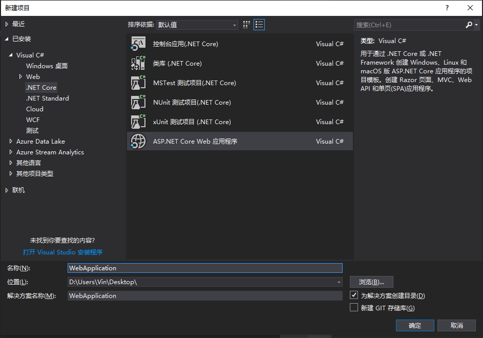
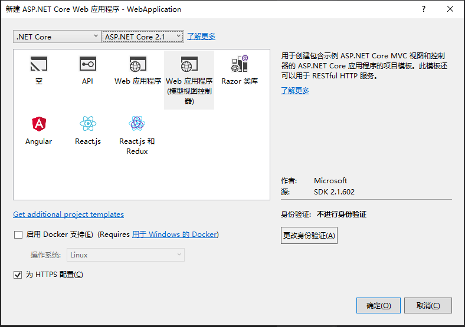
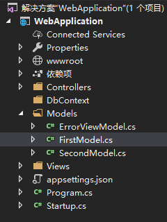
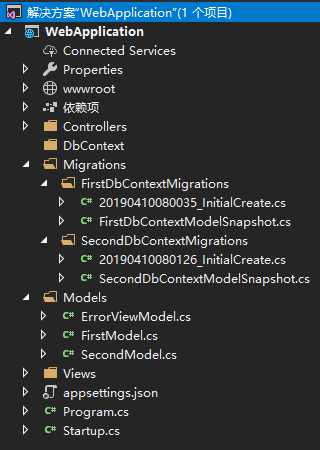
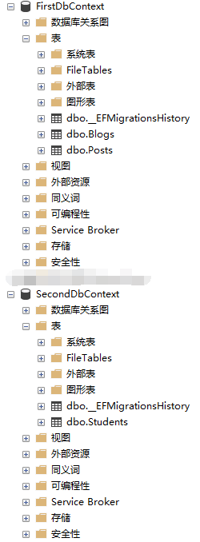

# [EF Core 2.2 对多个 DbContext 多个数据库的情况进行迁移的示例](https://www.cnblogs.com/vin-c/p/10684108.html)


# [EF Core 2.2 对多个 DbContext 多个数据库的情况进行迁移的示例](https://www.cnblogs.com/vin-c/p/10684108.html)


目录

- [场景](https://www.cnblogs.com/vin-c/p/10684108.html#场景)
- [创建新项目](https://www.cnblogs.com/vin-c/p/10684108.html#创建新项目)
- [创建第一个模型](https://www.cnblogs.com/vin-c/p/10684108.html#创建第一个模型)
- [创建第二个模型](https://www.cnblogs.com/vin-c/p/10684108.html#创建第二个模型)
- [使用依赖注入注册上下文](https://www.cnblogs.com/vin-c/p/10684108.html#使用依赖注入注册上下文)
- [创建数据库](https://www.cnblogs.com/vin-c/p/10684108.html#创建数据库)

# 场景

在一个项目中，使用了多个 `DbContext` 且每个 `DbContext` 对应一个数据库的情况

# 创建新项目

- 打开 Visual Studio 2017

- “文件”>“新建”>“项目”

- 从左菜单中选择“已安装”>“Visual C#”>“.NET Core”。

- 选择“ASP.NET Core Web 应用程序”。

- 输入“WebApplication”作为名称，然后单击“确定”。

- 在“新建 ASP.NET Core Web 应用程序”对话框中：

- 确保在下拉列表中选择“.NET Core”和“ASP.NET Core 2.1”

- 选择“Web 应用程序(模型视图控制器)”项目模板

- 确保将“身份验证”设置为“无身份验证”

- 单击“确定”

  

  

# 创建第一个模型

- 右键单击“Models”文件夹，然后选择“添加”>“类”。

- 输入“FirstModel.cs”作为名称，然后单击“确定”。

- 将此文件的内容替换为以下代码：

  ```
  using System.Collections.Generic;
  using Microsoft.EntityFrameworkCore;
  
  namespace WebApplication.Models
  {
      public class FirstDbContext : DbContext
      {
          public FirstDbContext(DbContextOptions<FirstDbContext> options)
              : base(options)
          { }
  
          public DbSet<Blog> Blogs { get; set; }
          public DbSet<Post> Posts { get; set; }
      }
  
      public class Blog
      {
          public int BlogId { get; set; }
          public string Url { get; set; }
  
          public ICollection<Post> Posts { get; set; }
      }
  
      public class Post
      {
          public int PostId { get; set; }
          public string Title { get; set; }
          public string Content { get; set; }
  
          public int BlogId { get; set; }
          public Blog Blog { get; set; }
      }
  }
  ```

  生产应用通常会将每个类放在单独的文件中。 为简单起见，本教程将这些类放在一个文件中。

# 创建第二个模型

- 右键单击“Models”文件夹，然后选择“添加”>“类”。

- 输入“SecondModel.cs”作为名称，然后单击“确定”。

- 将此文件的内容替换为以下代码：

  ```
  using Microsoft.EntityFrameworkCore;
  
  namespace WebApplication.Models
  {
      public class SecondDbContext : DbContext
      {
          public SecondDbContext(DbContextOptions<SecondDbContext> options)
              : base(options)
          { }
  
          public DbSet<Student> Students { get; set; }
      }
  
      public class Student
      {
          public int Id { get; set; }
          public string Name { get; set; }
      }
  }
  ```

  生产应用通常会将每个类放在单独的文件中。 为简单起见，本教程将这些类放在一个文件中。

- 至此，项目的目录结构如下：

  

# 使用依赖注入注册上下文

若要使 `FirstDbContext` 和 `SecondDbContext` 可用于 MVC 控制器，请在 `Startup.cs` 中将其注册为服务。

在应用程序启动过程中，通过依赖关系注入 注册服务（如 FirstDbContext），以便能够通过构造函数的参数和属性向使用服务的组件（如 MVC 控制器）自动提供该服务。

- 在 Startup.cs 中，添加以下 using 语句：

  ```
  using WebApplication.Models;
  using Microsoft.EntityFrameworkCore;
  ```

- 将以下 `手动高亮` 的代码添加到 `ConfigureServices` 方法：

  ```
  public void ConfigureServices(IServiceCollection services)
      {
          services.Configure<CookiePolicyOptions>(options =>
          {
              // This lambda determines whether user consent for non-essential cookies is needed for a given request.
              options.CheckConsentNeeded = context => true;
              options.MinimumSameSitePolicy = SameSiteMode.None;
          });
  
  
          services.AddMvc().SetCompatibilityVersion(CompatibilityVersion.Version_2_1);
  
          var connection = @"Server=你的数据库地址;Database=FirstDbContext;User Id=你的数据库账号;Password=你的数据库密码;"; // 手动高亮
          services.AddDbContext<FirstDbContext> // 手动高亮
              (options => options.UseSqlServer(connection)); // 手动高亮
  
          var secondDbconnection = @"Server=你的数据库地址;Database=SecondDbContext;User Id=你的数据库账号;Password=你的数据库密码;"; // 手动高亮
          services.AddDbContext<SecondDbContext> // 手动高亮
              (options => options.UseSqlServer(secondDbconnection)); // 手动高亮
      }
  ```

  生产应用通常会将连接字符串放在配置文件或环境变量中。 为简单起见，本教程在代码中定义它。

# 创建数据库

以下步骤使用迁移创建数据库。

- “工具”>“NuGet 包管理器”>“包管理器控制台”

- 运行以下命令创建 `FirstDbContext` 的迁移：

  ```
  Add-Migration InitialCreate -Context FirstDbContext -OutputDir Migrations\FirstDbContextMigrations
  Update-Database -Context FirstDbContext
  ```

  -Context  参数表示要使用的 `DbContext` 类，请参阅[这里](https://docs.microsoft.com/zh-cn/ef/core/miscellaneous/cli/powershell#common-parameters)了解详细信息。

- “工具”>“NuGet 包管理器”>“包管理器控制台”

- 运行以下命令创建 `SecondDbContext` 的迁移：

  ```
  Add-Migration InitialCreate -Context SecondDbContext -OutputDir Migrations\SecondDbContextMigrations
  Update-Database -Context SecondDbContext
  ```

- 至此，项目的目录结构如下：

  

- 数据库如下：

  


# 需要注意的情况

请避免**两个 `DBContext` 内的[实体有互相主外键连接的情况](https://www.cnblogs.com/vin-c/p/10685705.html#%E9%9C%80%E8%A6%81%E6%B3%A8%E6%84%8F%E7%9A%84%E6%83%85%E5%86%B5)**

- 示例

  ```
  // FirstDbContext
  public class FirstDbContext : DbContext
  {
      public FirstDbContext(DbContextOptions<FirstDbContext> options)
          : base(options)
      { }
  
      public DbSet<Blog> Blogs { get; set; }
      public DbSet<Post> Posts { get; set; }
  }
  
  public class Blog
  {
      public int BlogId { get; set; }
      public string Url { get; set; }
  
      public ICollection<Post> Posts { get; set; }
  
  
      public int StudentId { get; set; }
      public Student Student { get; set; }
  }
  
  public class Post
  {
      public int PostId { get; set; }
      public string Title { get; set; }
      public string Content { get; set; }
  
      public int BlogId { get; set; }
      public Blog Blog { get; set; }
  }
  
  
  
  // SecondDbContext
  public class SecondDbContext : DbContext
  {
      public SecondDbContext(DbContextOptions<SecondDbContext> options)
          : base(options)
      { }
  
      public DbSet<Student> Students { get; set; }
  }
  
  public class Student
  {
      public int Id { get; set; }
      public string Name { get; set; }
  
      public ICollection<Blog> Blogs { get; set; }
  }
  ```

​     


[« ](https://www.cnblogs.com/vin-c/p/10682168.html) 上一篇：[Entity Framework Core（EF Core） 最简单的入门示例](https://www.cnblogs.com/vin-c/p/10682168.html)
[» ](https://www.cnblogs.com/vin-c/p/10685705.html) 下一篇：[EF Core 2.2 对多个 DbContext 单个数据库的情况进行迁移的示例](https://www.cnblogs.com/vin-c/p/10685705.html)