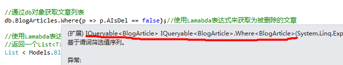
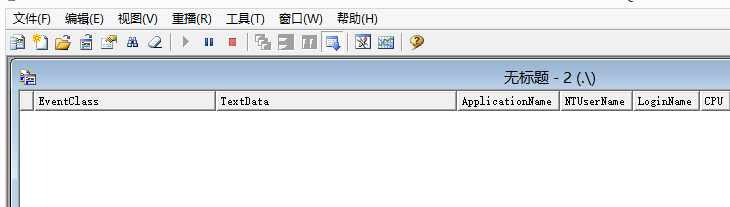
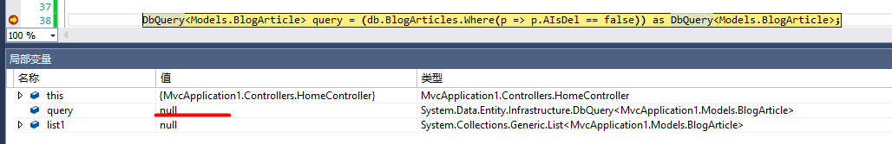

# [EF延迟加载及原理深入解析](https://www.cnblogs.com/jasonwb/articles/3505130.html)

EF延迟加载：就是使用Lamabda表达式或者Linq 从 EF实体对象中查询数据时，EF并不是直接将数据查询出来，而是在用到具体数据的时候才会加载到内存。

##	**一，实体对象的Where方法返回一个什么对象？**

大家来看一下上一篇文章的代码来分析一下：

[](javascript:void(0);)

[](javascript:void(0);)

```
#region 查询文章列表+ActionResult Article()
        /// <summary>
        /// 查询文章列表
        /// </summary>
        /// <returns></returns>
        public ActionResult Article()
        {
            //通过db对象获取文章列表
            db.BlogArticles.Where(p => p.AIsDel == false);//使用Lamabda表达式来获取为被删除的文章
            
            //使用Lamabda表达式来获取数据
            //返回一个List<T>的对象来存储文章列表
            List < Models.BlogArticle > list= db.BlogArticles.Where(p => p.AIsDel == false).ToList();
            
            
            //也可以使用Linq来获取数据 
            List<Models.BlogArticle> list1 = (from p in db.BlogArticles where p.AIsDel == false select p).ToList();

            //使用ViewData来传递list对象
            ViewData["DataList"] = list;

            return View();
        } 
        #endregion
```

[](javascript:void(0);)

[](javascript:void(0);)

 

为了体验延迟加载，我们把代码做修改如下：

[](javascript:void(0);)

[](javascript:void(0);)

```
#region 查询文章列表+ActionResult Article()
        /// <summary>
        /// 查询文章列表
        /// </summary>
        /// <returns></returns>
        public ActionResult Index()
        {
            //通过db对象获取文章列表
            db.BlogArticles.Where(p => p.AIsDel == false);//使用Lamabda表达式来获取为被删除的文章

            DbQuery<Models.BlogArticle> query = (db.BlogArticles.Where(p => p.AIsDel == false)) as DbQuery<Models.BlogArticle>;

            List<Models.BlogArticle> list = query.ToList();
            //使用ViewData来传递list对象
            ViewData["DataList"] = query;

            return View();
        }
        #endregion
```

[](javascript:void(0);)

[](javascript:void(0);)

 

在这里我们为什么要使用DbQuery<T>来接收呢？

首先我们来看使用db.BlogArticles.Where()来获取文章列表的时候，Where()方法给我们返回一个什么类型的对象呢？我们把鼠标放在Where()方法上后，会发现Where会返回给我们一个IQueryable的泛型接口对象，如下图：

 



 

那我们是不是需要使用IQueryable对象来接收获取的对象呢，代码如下：

```
　　　　　　　//where()方法返回一个IQuery的接口
            IQueryable < Models.BlogArticle > query= db.BlogArticles.Where(p => p.AIsDel == false);
```

 

这里的Query到底能不能取到值呢？我们来运行调试程序，结果如下：

 

 

 

我们在局部变量窗口看到Query已经取到了值。但是根据面向对象的原则，接口是不能直接实例化的，但是这里的代码又是不报错的，那是为什么呢?

根据面向对象的里氏替换原则，我们都知道，这里实际上是返回了一个IQueryable对象的子类对象。

注意：C#里氏替换原则，子类对象可以赋值给父类对象。也就是说子类可以替换父类出现的地方。但是父类对象一定不可以替换子类对象。

 

也就是说Where()方法返回了一个IQueryable接口的子类对象，并且赋值给了它的父类对象IQueryable。

那么Where()到底返回了一个什么样的对象呢（什么样的IQueryable的子类对象呢）？

 再次看上面的局变量窗口中query的返回值类型为，如下图：


 我们可以很明显的看出，query的返回类型为DbQuery类型。

那我们就用DbQuery来接收对象，代码如下：

```
DbQuery<Models.BlogArticle> query = (db.BlogArticles.Where(p => p.AIsDel == false)) as DbQuery<Models.BlogArticle>;
```

因为Where()方法返回的是IQueryable对象，所以要把对象转换成DbQuery对象；

 

**二，DbQuery<T>泛型接口类的延迟加载**

上面的定义已经说过了EF延迟加载的定义，那么在这里我们在query查询到对象时，数据库有没有执行查询操作呢？

这里我们借助Sql Server的自身的Profiler软件来查看，

**①打开Sql Server Profiler 软件，新建一个查询，刚开始，是有查询记录的，如下图：**

 


 

**②我们使用上图中的，红色箭头指的橡皮，清除一下记录，如下图：**

 



 

**③我们再次启动调试，运行代码，当程序运行到断点的时候，我们看到query还没有值,如下图：**

 



 

**④单步调试，进行下一步，我们在局部变量窗口中发现query已经取到了值，如下图：**


query的值，如下图：


那么我们的Sql Server Profiler 跟踪器发生了什么变化呢？没有发生任何变化，如下图：

 


 

我们如果使用ADO.NET操作数据库，查询完数据后，数据会立即送给接收的对象（比如：DataTable对象），但是EF操作数据库怎么却没有立即去查询数据呢？

**⑤DbQuery对象的延迟加载**

当我们使用query对象的时候才回去查询数据库，我们继续执行下一步，结果如下：


 

这个时候list取到了值，然后Sql Server  Profiler 也发生了变化，有了查询数据库的记录，如下图：


 也就是说，当query对象ToList()的时候，才发生了查询数据库的操作。

**三，总结：**

1）EF中的DbQuery对象操作数据库的时候发生延迟加载，而直接使用List<T>来接受对象时则不会；

2）延迟加载不会立即去查询数据库，而是在使用数据的时候才EF才会去查询数据库。

 

到这里，还没有提到实现原理，要了解真正的原因，首先我们先回顾下linq；

 

# 1】.Linq 回顾 

 

 

LINQ的查询表达式其实是C#之上的语法糖，不过这个糖确实不错。

 

在结束上一篇文章的时候，看到一个前辈评论说建议我多写写LINQ使用方面的，而不是讲这些理论。顺便借此机会解释一下，本人觉得LINQ的使用文章网上铺天盖地，实在没有什么必要更没有价值去写，网上的LINQ使用性的文章从入门到复杂的应用实在是太多了，不管是什么级别的程序员都能找到适用的文章。我更觉得这些文章属于使用类的，在实际项目中用到的时候稍微的查一下能用起来就行了，而重要的是能搞懂其原理才是我们长期所追求的，因为这些原理在任何一个应用框架的设计中都是相通的，可以帮助我们举一反三的学习，减少学习成本，不断的提高内在的设计思想。

 

> 所谓设计能力体现技术层次，这句话一点都不假。同志们我们不断追求的应该是设计，而不是拿来就用。当你搞懂了原理之后，我想每个人都能想出来各种不同的应用方向，那么技术发展才有意义，当然这也是最难能可贵的。

 

# 2】.扩展Linq to Object (应用框架具有查询功能)

 

我们知道LINQ所支持的查询范围主要在IEnumerable<T>、IQueryable<T>这两个方面，对于我们想要扩展LINQ的查询能力也主要集中在这两块。很多时候我们在编写应用框架的时候，都会自己去实现IEnumerble<T>对象，一般不会用系统提供的集合类，这样为了框架的OO性，上下文连贯性，更模型化。如果应用框架具备一定的查询能力是不是很方便些。比如你在开发一个关于数据密集性的框架，可能不是实时的持久化，但是能在外部提供某种查询工具来查询内存中的数据，所以这个时候需要我们能扩展LINQ的Object查询能力。这一节我们就来学习怎么扩展Linq to Object。

 

> LINQ查询Object是基于IEnumerable<T>对象的，不是集合对象有什么好查的。对于IEnumerable<T>对象的LINQ查询是Enumerable静态对象在支撑着，然后通过匿名表达式来表示逻辑，这样就能顺其自然的查询集合。那么我们该如何下手扩展Linq  to  Object？其实也就是两点可以扩展，要么提供扩展方法来扩展IEnumerable<T>对象，当然你别企图想让VS支持某种关键字让你对应扩展方法。还有就是继承IEnumerable<T>对象让我们自己的集合类型具备LINQ的强类型的查询能力。当然具体要看我们需求，从技术角度看目前只有这两点可以扩展。
>
> 如果我们使用扩展方法那么只能是扩展IEnumerable<T>对象，这没有问题。我们可以很方便的在LINQ的表达式中调用我们自己的扩展方法，让自己的方法跟着一起链式查询。如果我们从继承IEnumerable<T>对象扩展，那么情况会有点小复杂，你的扩展方法中要扩展的对象一定要具体的给出对象的定义才行，如果你扩展的对象不能和继承的对象保持一直，那么你将断掉所有的扩展方法。

 

## 2.1】.通过添加IEnumerable<T>对象的扩展方法

 

下面我们通过具体的例子来分析一下上面的理论，先看看通过扩展方法来扩展系统的IEnumerable<T>对象。

 

代码段：Order类

 

[](javascript:void(0);)


[](javascript:void(0);)

```
/// <summary> 
/// 订单类型 
/// </summary> 
public class Order 
{ 
    /// <summary> 
    /// 订单名称 
    /// </summary> 
    public string OrderName { get; set; } 
    /// <summary> 
    /// 下单时间 
    /// </summary> 
    public DateTime OrderTime { get; set; } 
    /// <summary> 
    /// 订单编号 
    /// </summary> 
    public Guid OrderCode { get; set; } 
}
```

[](javascript:void(0);)

[](javascript:void(0);)

 

这是个订单类纯粹是为了演示而用，里面有三个属性分别是"OrderName(订单名称)"、"OrderTime(下单时间)"、"OrderCode(订单编号)"，后面我们将通过这三个属性来配合示例的完成。

 

如果我们是直接使用系统提供的IEnumerable<T>对象的话，只需要构建IEnumerable<T>对象的扩展方法就能实现对集合类型的扩展。我假设使用List<T>来保存一批订单的信息，但是根据业务逻辑需要我们要通过提供一套独立的扩展方法来支持对订单集合数据的处理。这一套独立的扩展方法会跟随着当前系统部署，不作为公共的开发框架的一部分。这样很方便也很灵活，完全可以替代分层架构中的部分Service层、BLL层的逻辑代码段，看上去更为优雅。

 

再发散一下思维，我们甚至可以在扩展方法中做很多文章，把扩展方法纳入系统架构分析中去，采用扩展方法封装流线型的处理逻辑，对业务的碎片化处理、验证的链式处理都是很不错的。只有这样才能真正的让这种技术深入人心，才能在实际的系统开发当中去灵活的运用。

 

下面我们来构建一个简单的IEnumerable<T>扩展方法，用来处理当前集合中的数据是否可以进行数据的插入操作。

 

代码段：OrderCollectionExtent静态类

 

[](javascript:void(0);)


[](javascript:void(0);)

```
public static class OrderCollectionExtent 
    { 
        public static bool WhereOrderListAdd<T>(this IEnumerable<T> IEnumerable) where T : Order 
        { 
            foreach (var item in IEnumerable) 
            { 
                if (item.OrderCode != null && !String.IsNullOrEmpty(item.OrderName) && item.OrderTime != null) 
                { 
                    continue; 
                } 
                return false; 
            } 
            return true; 
        } 
    }
```

[](javascript:void(0);)

[](javascript:void(0);)

 

OrderCollectionExtent是个简单的扩展方法类，该类只有一个WhereOrderListAdd方法，该方法是判断当前集合中的Order对象是否都满足了插入条件，条件判断不是重点，仅仅满足例子的需要。这个方法需要加上Order类型泛型约束才行，这样该扩展方法才不会被其他的类型所使用。

 

[](javascript:void(0);)


[](javascript:void(0);)

```
List<Order> orderlist = new List<Order>() 
            { 
                new Order(){ OrderCode=Guid.NewGuid(), OrderName="水果", OrderTime=DateTime.Now}, 
                new Order(){ OrderCode=Guid.NewGuid(), OrderName="办公用品",OrderTime=DateTime.Now} 
            }; 
            if (orderlist.WhereOrderListAdd()) 
            { 
                //执行插入 
            }
```

[](javascript:void(0);)

[](javascript:void(0);)

 

如果.NET支持扩展属性【不过微软后期肯定是会支持属性扩展的】，就不会使用方法来做类似的判断了。这样我们是不是很优雅的执行了以前BLL层处理的逻辑判断了，而且这部分的扩展方法是可以动态的更改的，完全可以建立在一个独立的程序集当中。顺便在扩展点使用思路，在目前MVVM模式中其实也可以将V中的很多界面逻辑封装在扩展方法中来减少VM中的耦合度和复杂度。包括现在的MVC都可以适当的采用扩展方法来达到更为便利的使用模式。

 

但是大部分情况下我们都是针对所有的IEnunerale<T>类型进行扩展的，这样可以很好的结合Linq的链式编程。原理就这么多，根据具体项目需要适当的采纳。

 

## 2.2】.通过继承IEnumerable<T>接口

 

我想大部分的情况下我们都是直接使用IEnumerable<T>的实现类，但是在编写系统组件、框架的时候一般都是要自己去实现自己的迭代器类的。那么这个时候的扩展方法还能作用于我们继承下来的类，这是相当方便的，不知不觉我们自己扩展的组件将也会支持Linq的查询。但是这个时候应该适当的控制你针对继承下来的类的扩展，扩展方法应该是面向你内部使用的，不能污染到外部的对象。

 

我们继续看例子，该例子是针对继承IEnumerable<T>来分析使用方式；

 

[](javascript:void(0);)


[](javascript:void(0);)

```
public class OrderCollection : IEnumerable<Order> 
   { 
       List<Order> orderList; 
       public OrderCollection() 
       { 
           orderList = new List<Order>() { 
               new Order(){ OrderCode=Guid.NewGuid(),OrderName="订单1", OrderTime=DateTime.Now}, 
               new Order(){ OrderCode=Guid.NewGuid(),OrderName="订单2", OrderTime=DateTime.Now}, 
               new Order(){ OrderCode=Guid.NewGuid(),OrderName="订单3", OrderTime=DateTime.Now} 
           }; 
       } 

       public IEnumerator<Order> GetEnumerator() 
       { 
           foreach (var order in orderList) 
           { 
               yield return order; 
           } 
       } 
       System.Collections.IEnumerator System.Collections.IEnumerable.GetEnumerator() 
       { 
           foreach (var order in orderList) 
           { 
               yield return order; 
           } 
       } 
   }
```

[](javascript:void(0);)

[](javascript:void(0);)

 

这是个Order集合类型OrderCollection类，该类专门用来存放或处理Order类的。不管是从兼容.NET2.0或者其他方面考虑都可能将集合的类型封装在.NET2.0版本的程序集中，在.NET2.0之上的版本都会提供扩展版本的程序集，这个时候我们的扩展方法要专门针对OrderCollection去编写，否则就会造成  IEnumerable<T>对象的污染。

 


```
public static OrderCollection GetOutOrderCollection(this OrderCollection OrderColl) 
       { 
           return OrderColl; 
       }
```

 

这个时候会很干净的使用着自己的扩展方法，不会造成大面积的污染。当然一般都是依赖倒置原则都会有高层抽象，不会直接扩展实现类，这里只是简单的介绍。

 

## 2.3】.详细的对象结构图

 

这个小结主要将IEnumerable<T>及它的扩展方法包括Linq的查询进行一个完整的结构分析，将给出详细的对象结构导图。

 

对象静态模型、运行时导图：

 


 

上图中的关键部分就是i==10将被封装成表达式直接送入Where方法，而select后面的i也是表达式【(int  i)=>i】，也将被送入Select方法，这里就不画出来了。顺着数字序号理解，IEnumerable<T>是Linq to  Object的数据源，而Enumerable静态类是专门用来扩展Linq查询表达式中的查询方法的，所以当我们编写Linq查询IEnumerable<T>集合是，其实是在间接的调用这些扩展方法，只不过我们不需要那么繁琐的去编写Lambda表达式，由编辑器帮我们动态生成。

 

小结：本节主要讲解了Linq to  Object的原理，其实主要的原理就是Lambda表达式传入到Enumerable扩展方法当中，然后形成链式操作。Linq  只是辅助我们快速查询的语言，并不是.NET或者C#的一部分，在任何.NET平台上的语言中都可以使用。下面我们将重点分析Linq to  Provider，这样我们才能真正的对LINQ进行高级应用。

 

# 3.】.实现IQueryable<T> 、IQueryProvider接口

 

这篇文章的重点就是讲解IQueryable<T>、IQueryProvider两个接口的，当我们搞懂了这两个接口之后，我们就可以发挥想象力的去实现任何一个数据源的查询。IQueryable<T>、IQueryProvider两接口还是有很多值得我们研究的好东西，里面充斥大量的设计模式、数据结构的知识，下面我们就来慢慢的分析它的美。

 

> IQueryable<T>接口是Linq to  Provider的入口，非常有意思的是它并不是一个IQueryable<T>来支撑一次查询。我们在编写Linq语句的时候一般都是  where什么然后select  什么，至少连续两个扩展方法的映射调用，但是朋友你知道它内部是如何处理的吗？每当Where过后紧接着Select他们是如何关联一个完整的查询的？IQueryable<T>并非IEnumerable<T>对象，无法实时的做出处理然后将结果返回给下一个方法接着执行。那么它如何将片段性的执行方法串成一个整的、完整的查询？下面我们将逐个的分析这其中要涉及到的模式、数据结构、框架原则，这些搞懂了之后代码都是模型的表现，也就顺其自然的明白了。

 

## 3.1】.延迟加载IEnumertor<T>对象(提高系统性能)

 

延迟加载的技术其实在Linq之前就已经在使用，只不过很少有人去关注它，都被隐藏在系统框架的底层。很多场合下我们需要自己去构建延迟加载特性的功能，在IEnumerable<T>对象中构建延迟基本上是通过yield  return  去构建一个状态机，当进行迭代的时候才进行数据的返回操作。那么在IQueryable<T>中是通过执行Provider程序来获取数据，减少在一开始就获取数据的性能代价。IQueryable<T>继承自IEnumerable<T>接口，也就是可以被foreach语法调用的，但是在GetEnumerator方法中才会去执行提供程序的代码。我们来分析一下IQueryable<T>接口的代码。

 

[](javascript:void(0);)


[](javascript:void(0);)

```
public IEnumerator<T> GetEnumerator() 
       { 
           return (Provider.Execute<T>(Expression) as IEnumerable<T>).GetEnumerator(); 
       } 

       System.Collections.IEnumerator System.Collections.IEnumerable.GetEnumerator() 
       { 
           return (Provider.Execute(Expression) as IEnumerable).GetEnumerator(); 
       }
```

[](javascript:void(0);)

[](javascript:void(0);)

 

这是IQueryable<T>接口中从IEnumerable<T>继承下来的两个返回IEnumerator接口类型的方法，在我们目前使用的Linq  to Sql、Linq to  Entity中都会返回强类型的集合对象，一般都不会实时的进行数据查询操作，如果要想实时执行需要进行IQueryable<T>.Provider.Execute方法的直接调用。

 

我们用图来分析一下Linq to Provider中的延迟加载的原理；

 


 

这段代码不会被立即执行，我们跟踪一下各个组成部分之间的执行过程；

 


 

这幅图重点是IQueryable<T>对象的连续操作，大致原理是每次执行扩展方法的时候都会构造一个新的IQueryable<T>，本次的IQueryable<T>对象将包含上次执行的表达式树，以此类推就形成了一颗庞大的表达式树。详细的原理在下面几小节中具体分析。

 

最后Orderlist将是一个IQueryable<T>类型的对象，该对象中包含了完整的表达式树，这个时候如果我们不进行任何的使用将不会触发数据的查询。这就是延迟加载的关键所在。如果想立即获取orderlist中的数据可以手动执行orderlist.Provider.Execute<TB_Order>(orderlist.Expression)来获取数据。

 

## 3.2】.扩展方法的扩展对象之奥秘(this IQueryable<TSource> source)

 

其实这里有一个思维陷阱，当我们分析源码的时候只将焦点集中在扩展方法中的后面参数上，而没有集中精力考虑扩展方法所扩展的对象本身，看似不同的方法位于不同的地方，其实他们来自一个地方，所在的逻辑对象是一个，但是这恰恰会造成我们分析问题的瓶颈，这里我们重点的讲解一下扩展方法所扩展对象。

 

我们直接用源码进行讲解吧；

 

[](javascript:void(0);)


[](javascript:void(0);)

```
public static IQueryable<TResult> Select<TSource, TResult>(this IQueryable<TSource> source, Expression<Func<TSource, TResult>> selector) 
{ 
    if (source == null) 
    { 
        throw Error.ArgumentNull("source"); 
    } 
    if (selector == null) 
    { 
        throw Error.ArgumentNull("selector"); 
    } 
    return source.Provider.CreateQuery<TResult>(Expression.Call(null, ((MethodInfo) MethodBase.GetCurrentMethod()).MakeGenericMethod(new Type[] { typeof(TSource), typeof(TResult) }), new Expression[] { source.Expression, Expression.Quote(selector) })); 
}
```

[](javascript:void(0);)

[](javascript:void(0);)

 

这是Queryable类中的Select扩展方法的源代码，它扩展IQueryable<TSource>对象，在方法内部都是在使用source对象来操作，source是扩展对象的直接引用。这是问题的重点，对扩展方法、链式编程不熟悉的朋友很难将source能串联到之前方法所返回的IQueryable<T>对象上。根据这里的代码分析，source每次都代表着IQueryable<T>实例，不管你是哪次进行方法的调用，它都代表着你当前调用方法的对象，所以不管我们进行多少次的调用它们都是连贯的，就好比数据结构里面的双向链表一样，这个方法处理完后，接着下一个方法都将是本对象的方法。所以要注意本次的调用将是接着上一次调用，而不是以个新的开始。理解这一点对后面的LINQ分析很关键。

 


 

## 3.3】.分段执行IQueryable<T>中的子方法(Queryable中的扩展方法)

 

都知道Linq的查询是将一些关键字拼接起来的，行成连续的查询语义，这其中背后的原理文章上上下下也说过很多遍，我想也应该大致的了解了。其实这有点像是把大问题分解成多个小问题来解决，但是又不全是为了分解问题而这样设计，在链式查询中很多关键字在不同的查询上下文中都是公用的，比如where可以用在查询，也可以用在更新、删除。这里讨论的问题可能已经超过LINQ，但是很有意义，因为他们有着相似的设计模型。

 

根据3.2图中的意思，我们都已经知道扩展方法之间传输的对象都是来自不同的实例但是来自一个对象类型，那么为什么要分段执行每个关键字的操作呢？我们还是用图来帮助我们分析问题吧。

 


 

两行代码都引用了Where方法，都需要拼接条件，但是 Where方法所产生的条件不会影响你之前的方法。分段执行的好处就在这里，最大粒度的脱耦才能最大程度的重用。

 

## 3.4】.链式查询方法的设计误区(重点：一次执行程序多次处理)

 

在使用IQueryable<T>时，我们尝试分析源码，看看IQueryable内部使用原理来帮我们生成表达式树数据的，我们顺其自然的看到了Provider属性，该属性是IQueryProvider接口，根据注释说明我们搞懂了它是最后执行查询的提供程序，我们理所当然的把IQueryable<T>的开始实例当成了查询的入口，并且在连续调用的扩展方法当中它都保持唯一的一个实例，最后它完整的获取到了所有表达式，形成一颗表达式树。但是IQueryable<T>却跟我们开了一个玩笑，它的调用到最后的返回不知道执行多少了CreateQuery了。看似一次执行却隐藏着多次方法调用，后台暗暗的构建了我们都不知道的执行模型，让人欣喜若狂。我们来揭开IQueryable<T>在链式方法中到底是如何处理的，看看它到底藏的有多深。

 

View Code   

 

类似这段代码的在文章的上面曾出现过，大同小异，我们下面详细的分析一下它的内部原理，到底是如何构建一个动态却是静态的对象模型。

 

这个方法有一个参数，是条件表达式，并且这个方法扩展IQueryable<T>接口，任何派生着都能直接使用。方法的返回类型也是IQueryable<T>类型，返回类型和扩展类型相同就已经构成链式编程的最小环路。方法中有两个判断，第一个是判断是否是通过扩展方法方式调用代码的，防止我们直接使用扩展方法，第二个判断是确定我们是否提供了表达式。

 

那么重点是最后一行代码，它包裹着几层方法调用，到底是啥意思呢？我们详细分解后自然也就恍然大悟了。

 


 

由于问题比较复杂，这里不做全面的IQueryable<T>的上下文分析，只保证本节的完整性。通过上图中，我们大概能分析出IQueryable<T>对象是每次方法的调用都会产生一个新的实例，这个实例接着被下一个方法自然的接受，依次调用。

 

面向接口的设计追求职责分离，这里为什么把执行和创建IQueryable<T>都放到IQueryProvider<T>中去？如果把创建IQueryable<T>提取处理形成独立的创建接口我觉得更巧妙，当然这只是我的猜测，也许是理解错了。