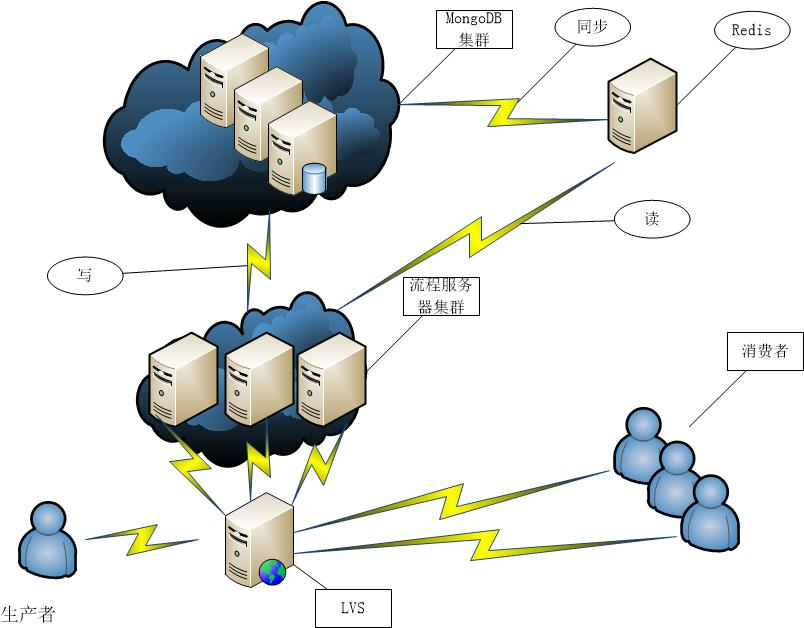
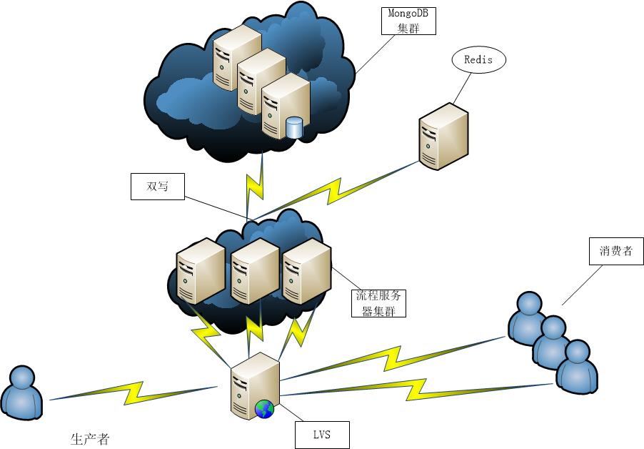

#  			[Redis+MongoDB 最佳实践 做到读写分离 -摘自网络](https://www.cnblogs.com/haoliansheng/p/4395640.html) 		

方案1. (被否定)

 

加上Redis，做到MongoDB的读写分离，单一进程从MongoDB及时把任务同步到Redis中。

看起来很完美，但是上线后出现了各种各样的问题，列举一下：

1.Redis队列长度为多少合适？

2.同步进程根据优先级从MongoDB向Redis同步过程中，一次取多少任务合适？太大导致很多无谓的开销，太小又会频繁操作MongoDB

3.当某一个子任务处理较慢的时候，会导致MongoDB的前面优先级较高的任务没有结束，而优先级较低的确得不到处理，造成消费者空闲

 

**最终方案：**

在生产者产生一个任务的同时，向Redis同步任务，Redis sort set(有序集合，保证优先级顺序不变)，消费者通过RPC调用时候，RPC服务器从Redis中取出任务，然后结束任务后从MongoDB中删除。

测试结果，Redis插入效率。Redis-benchmark 并发150,32byte一个任务,一共100W个，插入效率7.3W(不使用持久化)

在这之前我们的担心都是没必要的，Redis的性能非常的好。

目前此套系统可以胜任每天5KW量的任务，我相信可以更多。