# 架构设计图--数据缓存

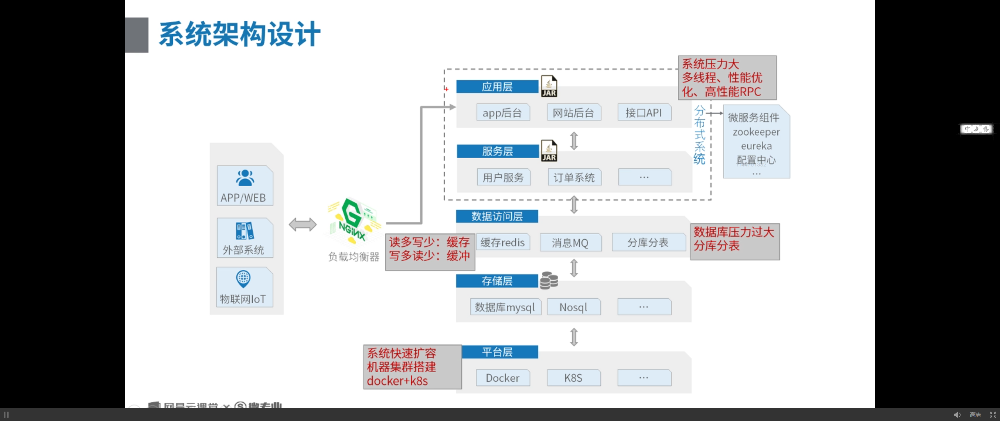

##	应用层	缓存

### 	单应用缓存

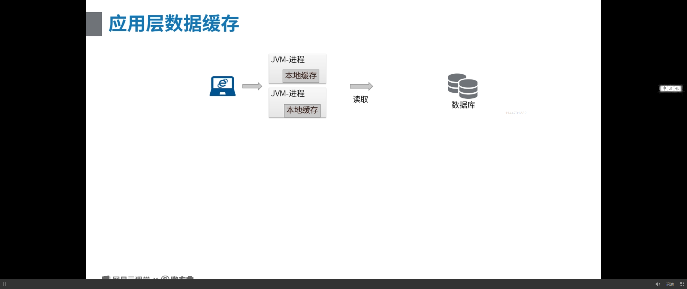

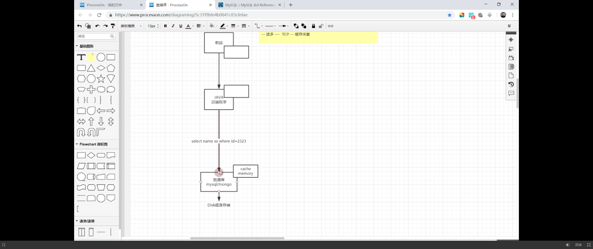

单应用缓存	-不能跨进程/跨应用访问

应用系统/服务器	多个应用/进程占用	内存紧张

## 应用层	=>	分布式中间件	

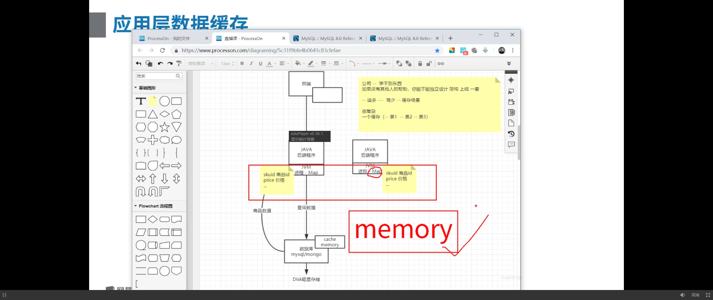

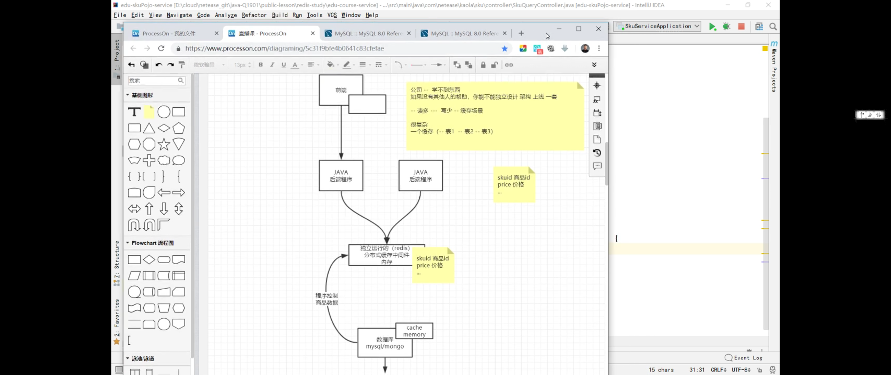

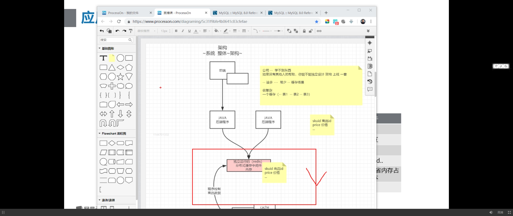

##	分布式中间件	缓存

### 分布式	应用缓存

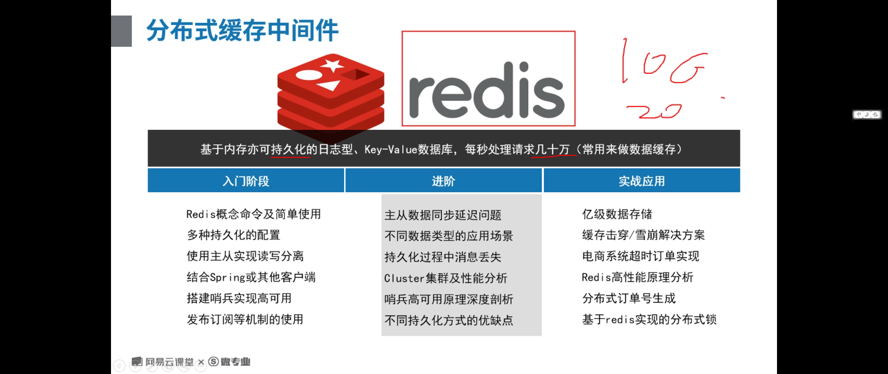

## 客户端缓存

内容不小	不经常变	

服务器采购	带宽很贵	

放在客户端-，浏览器

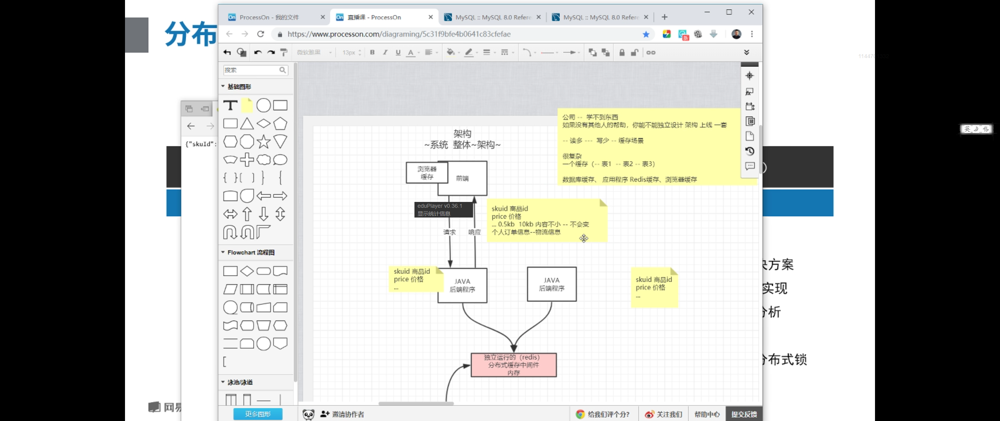

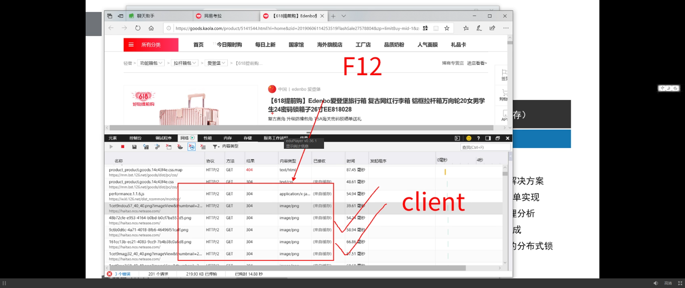

加载静态文件

ajax异步请求数据包	内容

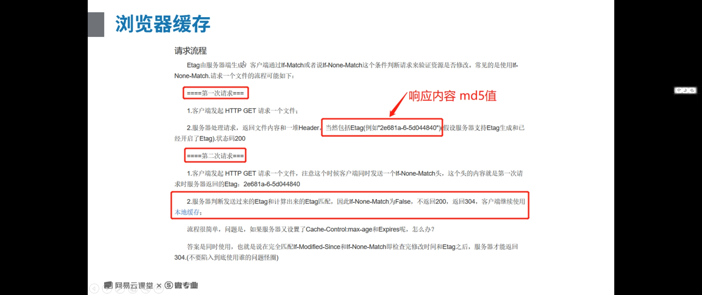

###	首次请求	Hash出的	ETag

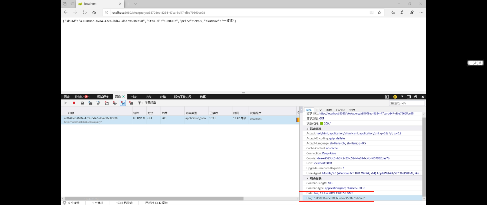

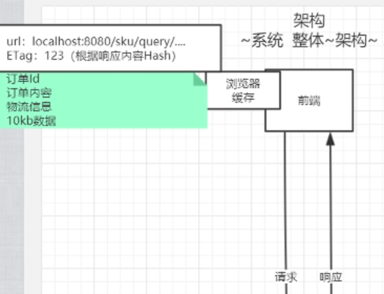

###		后续对比	处理ETag

hash对比	符合则反馈304	不用做处理使用缓存内容

减少带宽损耗

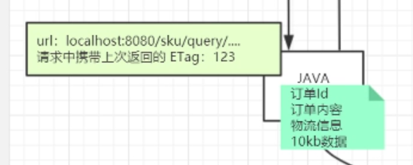

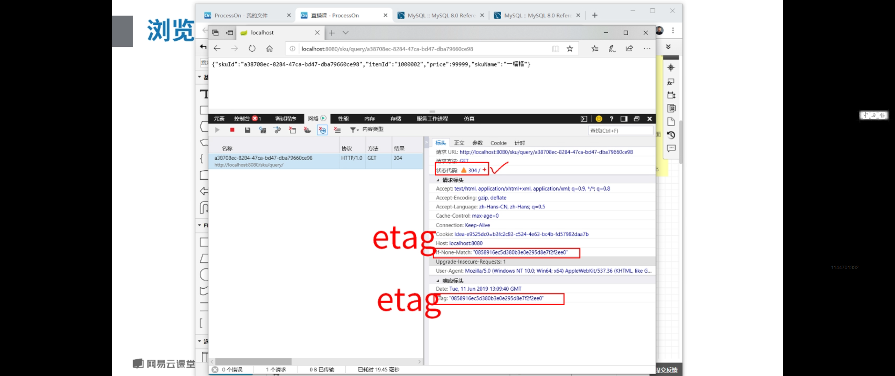

### 浏览器储存

## 	SpringBoot

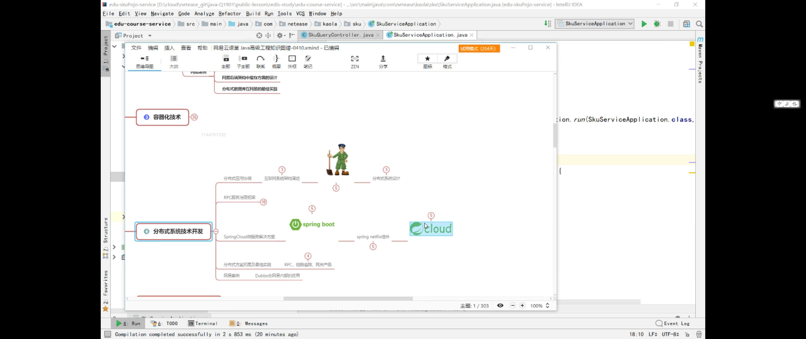