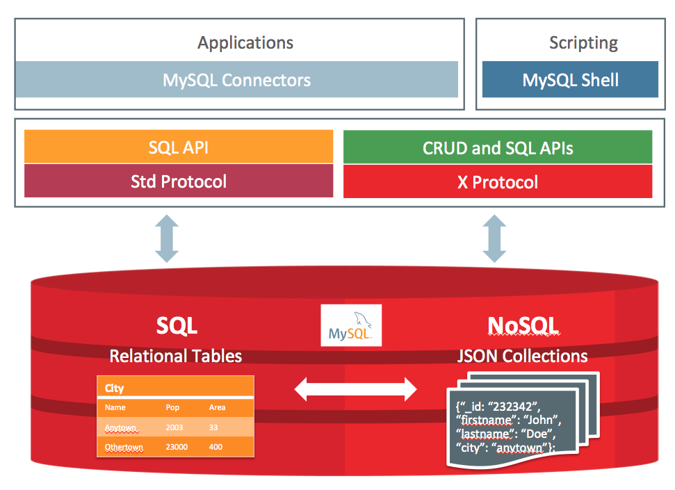

#	**MySQLWorkbench**

https://www.mysql.com/downloads/

# MySQL [Document Store](https://www.mysql.com/products/enterprise/document_store.html)

X Protocol 

- **X DevAPI**-XDevAPI是一个新的、现代的、异步开发API，用于XProtocol上的CRUD和SQL操作。它引入集合作为新的架构对象。文档存储在集合中，并设置它们的专用CRUD操作。

## NoSQL + SQL = MySQL

MySQL Document store gives users maximum flexibility developing  traditional SQL relational applications and NoSQL schema-free document  database applications.  This eliminates the need for a separate NoSQL  document database.  Developers can mix and match relational data and  JSON documents in the same database as well as the same application.   For example, both data models can be queried in the same application and  results can be in table, tabular or JSON formats.

# Doc	[服务器命令选项](https://dev.mysql.com/doc/refman/8.0/en/server-options.html#option_mysqld_character-set-client-handshake)

