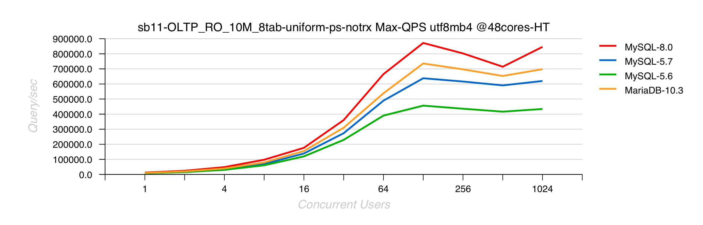
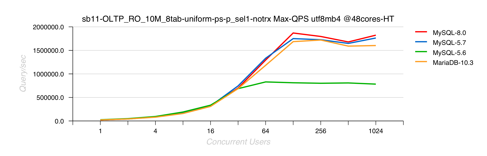
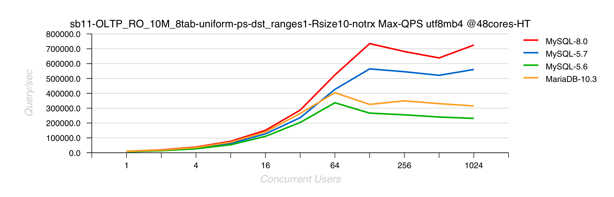

---

# [mysql的utf8mb4编码的collation应该怎么选择？](https://segmentfault.com/q/1010000015560802)

```
mysql> SHOW COLLATION WHERE Charset = 'utf8mb4';
```


utf8可以直接转成utf8mb4,使用ALTER TABLE ... CONVERT TO CHARACTER SET ...语句，这是由于utf8是utf8mb4的子集。其他类型最好不要直接转，会出现问题，比如latin转utf8.


:mysql*字符集*小结utf8mb4已成为*MySQL8*.0的默认*字符集*,在*MySQL8*.0.1及更高版本中将*utf8mb4_0900_ai_ci*作为默认排序规则


一般是utf8mb4_general_ci和utf8mb4_bin,前者不区分大小写

---

# Unknown collation: 'utf8mb4_0900_ai_ci'

最好使用[UTF8MB4](https://blog.csdn.net/itmr_liu/article/details/80851266)，而不要使用UTF8


在将本地数据库同步到服务器的数据库时，发现失败了

问题的原因是两个数据库待转移的表的字符格式不能被被转移数据库识别。例如mysql8的utf8mb4_0900_ai_ci格式再**mysql5中就不支持**。就需要更改数据库字符编码和各个varchar等字段的编码方式


> mysql版本是8，照顾低版本--服务器上版本较低导致的不兼容
>
> 解决方式：
>
> 1 先查错误的字符集存在哪些表里：
>
> select TABLE_SCHEMA,TABLE_NAME,TABLE_COLLATION from information_schema.tables where table_collation = 'utf8mb4_0900_ai_ci' 
> and table_schema = 'jh';
>
> 2 发现无法修改，使用mysql命令行+root权限还是失败 update information_schema.tables 
> set table_collation = 'utf8_general_ci' where table_collation = 'utf8mb4_0900_ai_ci' and table_schema = 'jh';
>
> 3 傻傻的导出.sql文件，然后批量把

字符：utf8mb4_0900_ai_ci 替换为：utf8_general_ci 
--------------------- 
作者：westworld2017163com 
来源：CSDN 
原文：https://blog.csdn.net/westworld2017163com/article/details/83150628 
版权声明：本文为博主原创文章，转载请附上博文链接！


##	linux[下MySQL5 版本不兼容导致的](https://blog.csdn.net/weixin_34038293/article/details/88309172)

**ERROR 1273 (HY000): Unknown collation: 'utf8mb4_0900_ai_ci'**


---


# utf8字符集、排序规则及utf8mb4_bin列大小写不敏感方法


UTF-8是使用1~4个字节，一种变长的编码格式。（[字符编码](https://github.com/4rnold/Blog/issues/2) ）

mb4即 most bytes 4，使用4个字节来表示完整的UTF-8。而MySQL中的utf8是utfmb3，只有三个字节，节省空间但不能表达全部的UTF-8，只能支持“基本多文种平面”（Basic Multilingual Plane，BMP）。

##	推荐使用utf8mb4。

> general_ci 更快，unicode_ci 更准确

如果你的应用有德语、法语或者俄语，请一定使用utf8_unicode_ci

## 大小写敏感

utf8mb4_general_cs 大小写敏感

utf8mb4_bin 大小写敏感


---

---

#	mysql中utf8 ,utf8mb4[区别**转化**方法](https://yq.aliyun.com/articles/674741)

## 查看所有表的字符集


```
mysql> select TABLE_SCHEMA,TABLE_NAME,TABLE_COLLATION from information_schema.tables where table_schema = 'mydb';
+--------------+---------------------+--------------------+
| TABLE_SCHEMA | TABLE_NAME          | TABLE_COLLATION    |
+--------------+---------------------+--------------------+
| mydb         | charset_test_latin1 | utf8mb4_0900_ai_ci |
| mydb         | student             | utf8_general_ci    |
| mydb         | t1                  | utf8mb4_0900_ai_ci |
| mydb         | t2                  | utf8_general_ci    |
| mydb         | t3                  | utf8_general_ci    |
| mydb         | t4                  | utf8_general_ci    |
| mydb         | t5                  | utf8mb4_unicode_ci |
| mydb         | t6                  | utf8mb4_0900_ai_ci |
| mydb         | t8                  | utf8mb4_unicode_ci |
| mydb         | vc                  | utf8mb4_unicode_ci |
+--------------+---------------------+--------------------+
```


## 常用命令

set names utf8mb4;
   相当于设置

- character_set_client

- character_set_connection

- character_set_results
  三个值为utf8mb4.

  

## ERROR 1071 (42000) 问题解决

出现这种报错主要有两种情况：

```
ERROR 1071 (42000): Specified key was too long; max key length is 3072 bytes
ERROR 1071 (42000): Specified key was too long; max key length is 1000 bytes
```

一个是length 大于3072 bytes，一个是大于1000 bytes。

mysql5.7中支持index key最大的长度是 767  bytes，在开启了innodb_large_prefix这个参数之后，max len 限制是3072  bytes。在5.7之前这个参数没有默认开启，5.7之后默认是开启的。8.0之后去掉了这个参数，默认就支持3072个字节。

所以在转换字符集过程中，如果一个列上有索引，由于之前的utf8的编码是3个bytes，utf8mb4是4个bytes。转换之后key的值可能会超过767或则3072，这个时候就是出现类似的报错。如果是MyISAM的引擎，是直接不能超过1000  bytes这个限制的。

这个时候的解决办法是如果是MyISAM的引擎，改成innodb引擎。

如果改成innodb还不行，只能缩小字段的大小。

## 总结

不得不说，mysql这个3个byte的utf8是个巨坑，没有按照国际的标准来设计，不过之后肯定会改成utf8mb4为默认字符集。

## 参考连接

<https://dba.stackexchange.com/questions/8239/how-to-easily-convert-utf8-tables-to-utf8mb4-in-mysql-5-5>

<http://aprogrammers.blogspot.com/2014/12/utf8mb4-character-set-in-amazon-rds.html>

<https://oracle-base.com/articles/mysql/mysql-converting-table-character-sets-from-latin1-to-utf8#the-problem>


---

# utf8 与 utf8mb4，utf8mb4_unicode_ci 与 utf8mb4_general_ci

## 新项目只考虑 utf8mb4

UTF-8 编码是一种变长的编码机制，可以用1~4个字节存储字符。

##	MySQL 中字符集相关变量

character_set_client：客户端请求数据的字符集
character_set_connection：从客户端接收到数据，然后传输的字符集
character_set_database：默认数据库的字符集，无论默认数据库如何改变，都是这个字符集；如果没有默认数据库，那就使用 character_set_server指定的字符集，这个变量建议由系统自己管理，不要人为定义。
character_set_filesystem：把操作系统上的文件名转化成此字符集，即把 character_set_client转换character_set_filesystem， 默认binary是不做任何转换的
character_set_results：结果集的字符集
character_set_server：数据库服务器的默认字符集
character_set_system：存储系统元数据的字符集，总是 utf8，不需要设置

如果数据库默认字符集不是 utf8mb4，那么可以在创建数据库时指定字符集：

```mysql
CREATE DATABASE mydb CHARACTER SET utf8mb4 COLLATE utf8mb4_unicode_ci;
```

---------------------


排序字符集 collation

字符除了需要存储，还需要排序或比较大小。推荐用 utf8mb4_unicode_ci，但是用 utf8mb4_general_ci 也没啥问题。

MySQL 8.0 默认的是 utf8mb4_0900_ai_ci，属于 utf8mb4_unicode_ci 中的一种，具体含义如下：

    uft8mb4 表示用 UTF-8 编码方案，每个字符最多占4个字节。
    0900 指的是 Unicode 校对算法版本。（Unicode归类算法是用于比较符合Unicode标准要求的两个Unicode字符串的方法）。
    ai指的是口音不敏感。也就是说，排序时e，è，é，ê和ë之间没有区别。
    ci表示不区分大小写。也就是说，排序时p和P之间没有区别。

utf8mb4 已成为默认字符集，在MySQL 8.0.1及更高版本中将**utf8mb4_0900_ai_ci作为默认**排序规则。以前，utf8mb4_general_ci是默认排序规则。由于utf8mb4_0900_ai_ci排序规则现在是默认排序规则，因此默认情况下新表格可以存储基本多语言平面之外的字符。现在可以默认存储表情符号。

如果需要**重音灵敏度和区分大小**写，则可以使用utf8mb4_0900_as_cs代替。

---------------------

作者：kikajack 
来源：CSDN 
原文：https://blog.csdn.net/kikajack/article/details/84668924 
版权声明：本文为博主原创文章，转载请附上博文链接！


---


# 	[general_ci 更快，unicode_ci 更准确](https://blog.csdn.net/yzh_1346983557/article/details/89643071)


>  Mysql的utf8与utf8mb4区别，utf8mb4_bin、utf8mb4_general_ci、utf8mb4_unicode_ci区别

但相比现在的CPU来说，它远远不足以成为考虑性能的因素，索引涉及、SQL设计才是。使用者更应该关心字符集与排序规则在db里需要统一。（可能产生乱码的字段不要作为主键或唯一索引。例如：以 url 来作为唯一索引，但是它记录的有可能是乱码。）


---


# MySQL性能：8.0和UTF8的影响

MySQL 8.0现在默认使用utf8mb4字符集

想使用UTF8，请首先使用“utf8mb4”，它是最完整的任何类型字符（可能是今天唯一有意义的字符），第二个 - 相关代码在MySQL 8.0中得到了更多改进，以提高效率

## [MySQL Performance : 8.0 and UTF8 impact](http://dimitrik.free.fr/blog/archives/2018/04/mysql-performance-80-and-utf8-impact.html)

> 
>
> 

> 


---


#	mysql中utf8mb4_unicode_ci的坑[字符集](https://blog.csdn.net/u010309596/article/details/79804531)

```
原来utf8mb4_unicode_ci和utf8_general_ci列不能混合查询！！！！
```


# utf8_unicode_ci与utf8_general_ci的区别

当前，utf8_unicode_ci校对规则仅部分支持Unicode校对规则算法。一些字符还是不能支持。并且，不能完全支持组合的记号。这主要影响越南和俄罗斯的一些少数民族语言，如：Udmurt 、Tatar、Bashkir和Mari。

**utf8_unicode_ci**的最主要的特色是**支持扩展**，即当把一个字母看作与其它字母组合相等时。例如，在德语和一些其它语言中‘ß’等于‘ss’。

**utf8_general_ci**是一个遗留的 校对规则，不支持扩展。它仅能够在字符之间进行逐个比较。这意味着utf8_general_ci**校对规则进行的比较速度很快**，但是与使用utf8_unicode_ci的校对规则相比，比较**正确性较差**）。

对于一种语言仅当使用utf8_unicode_ci排序做的不好时，才执行与具体语言相关的utf8字符集 校对规则。例如，对于德语和法语，utf8_unicode_ci工作的很好，因此不再需要为这两种语言创建特殊的utf8校对规则。

utf8_general_ci也适用与德语和法语，除了‘ß’等于‘s’，而不是‘ss’之外。如果你的应用能够接受这些，那么应该使用utf8_general_ci，因为它速度快。否则，使用utf8_unicode_ci，因为它比较准确。


---


#  					Mysql8.0字符集更新比对 				

 						2018.06.13 10:53 						1045浏览 					

 																					 							 						

| 语言           | 整理                       |
| -------------- | -------------------------- |
| 克罗地亚       | utf8mb4_hr_0900_ai_ci      |
| 捷克           | utf8mb4_cs_0900_ai_ci      |
| 丹麦           | utf8mb4_da_0900_ai_ci      |
| 世界语         | utf8mb4_eo_0900_ai_ci      |
| 爱沙尼亚语     | utf8mb4_et_0900_ai_ci      |
| 德国电话簿顺序 | utf8mb4_de_pb_0900_ai_ci   |
| 匈牙利         | utf8mb4_hu_0900_ai_ci      |
| 冰岛的         | utf8mb4_is_0900_ai_ci      |
| 拉脱维亚       | utf8mb4_lv_0900_ai_ci      |
| 立陶宛         | utf8mb4_lt_0900_ai_ci      |
| 抛光           | utf8mb4_pl_0900_ai_ci      |
| 古典拉丁文     | utf8mb4_la_0900_ai_ci      |
| 罗马尼亚       | utf8mb4_ro_0900_ai_ci      |
| 斯洛伐克       | utf8mb4_sk_0900_ai_ci      |
| 斯洛文尼亚     | utf8mb4_sl_0900_ai_ci      |
| 现代西班牙     | utf8mb4_es_0900_ai_ci      |
| 传统西班牙     | utf8mb4_es_trad_0900_ai_ci |
| 瑞典           | utf8mb4_sv_0900_ai_ci      |
| 土耳其         | utf8mb4_tr_0900_ai_ci      |
| 越南           | utf8mb4_vi_0900_ai_ci      |

utf8mb4_0900_ai_ci 也可用作下表中语言的不区分重音，不区分大小写的整理。

utf8mb4_0900_ai_ci适用的语言

| 语言名称                   | 语言代码 |
| -------------------------- | -------- |
| 德语（字典顺序）           | de       |
| 英语                       | en       |
| 加拿大法语（locale fr_CA） | FR       |
| 爱尔兰盖尔语               | GA       |
| 印度尼西亚                 | ID       |
| 意大利                     | it       |
| 卢森堡                     | lb       |
| 马来语                     | ms       |
| 荷兰人                     | NL       |
| 葡萄牙语                   | pt       |
| 斯瓦希里                   | SW       |
| 祖鲁                       | zu       |

相信很多小伙伴升级后发现字符编码上多了很多不一样得编码这里根据官方文档给大家做一个解释

---


# **简短总结**utf8_unicode_ci和utf8_general_ci对中、英文来说没有实质的差别。

utf8_general_ci**校对速度快**，但准确度稍差。
utf8_unicode_ci准确度高，但校对速度稍慢。

如果你的应用有德语、法语或者俄语，请一定使用utf8_unicode_ci。一般用utf8_general_ci就够了，到现在也没发现问题。。。