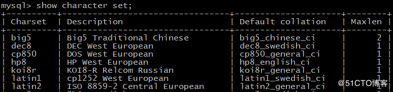
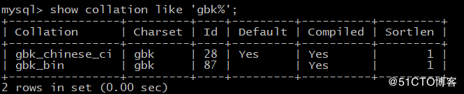
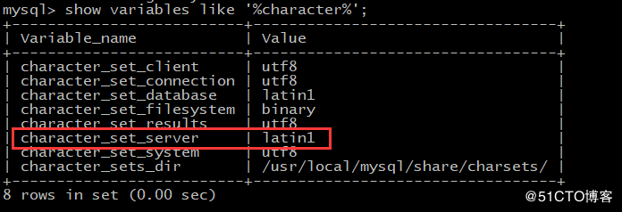

#  MySQL选择合适的字符集](https://www.cnblogs.com/aotemanzhifu/p/9192386.html)

对数据库来说，字符集更加重要，因为数据库存储的数据大部分都是各种文字，字符集对数据库的存储，处理性能，以及日后系统的移植，推广都会有影响。 
 MySQL5.6目前支持几十种字符集，包括UCS-2，UTF-16，UTF-16LE,UTF-32，UTF-8和utf8mb4等Unicode字符集。 
 根据应用的需求，考虑以下几方面的因素。

1. 满足应用支持语言的需求，如果应用要处理各种各样的文字，或者将发布到使用不同语言的国家或地区，就应该选择Unicode字符集。对MySQL来说，目前就是UTF-8
2. 如果应用中涉及已有数据的导入，就要充分考虑数据库字符集对已有数据的兼容性。假如已有数据是GBK文字，如果选择GB2312-80为数据库字符集，就很有可能出现某些文字无法正确导入的问题
3. 如果数据库只支持一般中文，数据量很大，性能要求也很高，那就应该选择双字节长编码的中文字符集，比如GBK。因为，相对于UTF-8而言，GBK比较“小”，每个汉字只占2个字节，而UTF-8汉字编码需要3个字节，这样可以减少磁盘I/O，数据库Cache以及网络传输的时间，从而提高性能。相反，如果应用主要处理英文字符，仅有少量汉字数据，那么选择UTF-8更好，因为GBK,UCS-2，UTF-16的西文字符编码都是2个字节，会造成很多不必要的开销。
4. 如果数据库需要做大量的字符运算，如比较，排序等，那么选择定长字符集可能更好，因为定长字符集的处理速度要比变长字符集的处理速度快。
5. 如果所有客户端程序都支持相同的字符集，则应该优先选择该字符集作为数据库字符集，这样可以避免因字符集转换带来的性能开销和数据损失。

---

# 	MySQL字符集选择

 					 				

两袖春风

关注

0人评论

1442人阅读

2018-07-03 13:50:01

一、**怎样选择合适的字符集**
对MySQL数据库来说，字符集很重要，因为数据库存储的数据大部分都是各种文字，字符集对数据库的存储，处理性能都会有所影响。

主要考虑一下几方面的因素 
1.满足应用支持语言的需求，应用处理各种各样的文字，发布到使用不同语言的国家或地区，可以选择Unicode字符集，MySQL的话可以选择UTF-8 
2.如果应用中涉及已有数据的导入，就要充分考虑数据库字符集对已有数据的兼容性。
假设数据是GBK文字，如果选择其他数据库字符集，就可能导致某些文字无法正确导入的问题。 
3.如果数据库需要支持一般是中文，数据量很大，性能要求也很高，可以选择双字节定长编码的中文字符集，比如GBK。 
因为相对于UTF-8而言，GBK比较小，每个汉字只占用2个字节，而UTF-8汉字编码需要3个字节，这样可以减少磁盘I/O，数据库缓存，已经网络传输的时间，从而提高性能。 
如果是英文字符，仅有少量汉字字符，那么选择UTF-8更好。 
4.如果数据库需要做大量的字符运算，如比较、排序，那么选择定长字符集可能会更好，因为定长字符集的处理速度比变长的快。

二、MySQL支持的字符集 
MySQL服务器可以支持多种字符集，在同一台服务器，同一个数据库，同一个表都可以指定不同的字符集。 
查看所有可用字符集的命令 show character set; 
例如MySQL5.7支持41种可以用字符集
mysql> show character set;

三、MySQL的字符集包括字符集和校对规则
1.字符集用来定义MySQL存储字符串的方式
2.校对规则用来定义比较字符串的方式。
3.字符集和校对规则是一对多关系
4.每个字符集至少对应一个校对规则
例如：查看gbk的校对
show collation like 'gbk%';

校对规则命名约定，它们以字符集名开始，通常包括一个语言名，并且以_ci（大小写不敏感）、_cs(大小写敏感)或者_bin(二元)

四、MySQL字符集的设置
1.MySQL的字符集和校对规则有4个级别的默认设置，服务器级、数据库级、表级、和字段级。
2.服务器字符集和校对规则
默认服务器字符集使用latin1

可以在my.cnf中设置服务器字符集，设置完重启就生效
[mysqld]
character-set-server=utf8 

1. 查看当前服务器的字符集

mysql> show variables like 'character_set_server';
+----------------------+-------+
| Variable_name | Value |
+----------------------+-------+
| character_set_server | utf8 |
+----------------------+-------+
1 row in set (0.00 sec)

4.查看当前服务器的校对规则
mysql> show variables like 'collation_server';
+------------------+-----------------+
| Variable_name | Value |
+------------------+-----------------+
| collation_server | utf8_general_ci |
+------------------+-----------------+
1 row in set (0.00 sec)

注意：创建完数据库要修改字符集，可以使用alter db_name character set 
但是数据库里面存在数据，就不能将已有的数据按照新的字符集进行存放，所以不能修改数据库字符集直接修改数据的内容。

5.连接字符集和校对规则
客户端和服务器的交互操作，MySQL提供了3个不同的参数：character_set_client,character_set_connection和character_set_result。
分别代表客户端、连接和返回结果的字符集
通常这个3个字符集应该相同的，才可以确保用户写入的数据可以正确读出
可以在my.cnf中设置
[mysql]
default-character-set=utf8    
这样服务器启动后，所有连接默认就是使用utf8字符集进行连接的，而不需要在程序中执行set names。

五、字符集的修改步骤
alter database db_name character set = utf8; 
alter table table_name character set = utf8;

---

# MySQL 8.0.11 字符集

   2018年04月24日 11:43:53           [yxli1](https://me.csdn.net/llyyxx0088)           阅读数：4413                                                                  

 版权声明：本文为博主原创文章，转载请注明出处。          https://blog.csdn.net/llyyxx0088/article/details/80062139        

​             **字符集：是一套符号和编码校对规则：是在字符集内用于比较字符的一套规则字符集生效规则：Table继承于Database，Database继承于Server，就是说，可只设置character_set_server校对规则生效规则：如果没有设置校对规则，字符集取默认校对规则，例如utf8mb4的校对规则是utf8mb4_0900_ai_ci**

**MySQL8.0字符集变化：**

修改默认字符集、校对规则：

    # 当前session
    set session character_set_server='utf8';
    set session collation_server='utf8_bin';
    set names 'utf8';
    # 全局
    set global character_set_server='utf8';
    set global collation_server='utf8_bin';
    # 配置文件中修改
    [client]
    default-character-set = utf8
    [mysqld]
    character-set-server  = utf8
---------------------
作者：yxli1 
来源：CSDN 
原文：https://blog.csdn.net/llyyxx0088/article/details/80062139 
版权声明：本文为博主原创文章，转载请附上博文链接！

---

---

# mysql 8.0.11[安装教程](https://blog.csdn.net/sky_jiangcheng/article/details/80722517)

---

